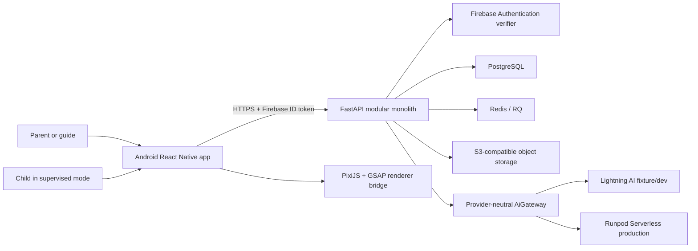
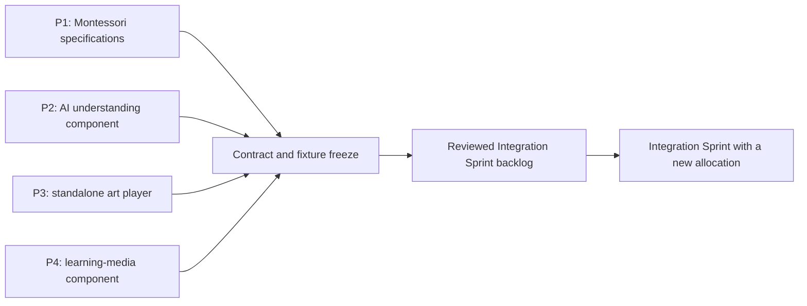

# Sketch2Life current system baseline

- Baseline date: 2026-08-24
- Repository phase: foundation ready; product implementation not started
- Active client: Android only
- Android application ID: `com.sketch2life.mobile`
- Team size: four cross-functional members
- Data policy: fixtures/synthetic data only
- Governing records: `AGENTS.md`, `docs/governance/`, `docs/adr/`, and `features/`

## 1. Purpose of this document

This is the single detailed snapshot of the system as it exists now. It separates:

- **implemented foundation**: files, boundaries, configuration, validators, and tests already present;
- **accepted architecture**: decisions that future features must follow;
- **planned product behavior**: the target experience, not yet implemented;
- **open production decisions**: choices intentionally deferred until evidence is available.

Reference handbooks and sprint workbooks inform the baseline but do not authorize implementation. Their originals and rendered extracts are external local references and are not published in this repository.

## 2. Product objective

Sketch2Life turns a child's drawing and narration into a short personalized learning experience, then transitions the child to a physical Montessori activity and captures parent/guide feedback.

The product is not a generic image generator. Its central constraints are:

- preserve the child's original drawing;
- explicitly review uncertain AI understanding;
- apply deterministic age/readiness/material/prerequisite rules;
- require adult approval before the activity/learning objective is locked;
- keep digital playback short and end with an off-screen activity;
- retain provenance for every derived artifact;
- protect child-related data through consent, least privilege, retention, and deletion controls.

## 3. User and account model

The application contains role-based modes in one Android app:

| Mode | Authenticated account? | Responsibility |
|---|---:|---|
| Parent | Yes | Consent, review gates, session supervision, feedback |
| Guide | Yes | Montessori review, activity/objective approval, feedback |
| Child | No independent account | Drawing/narration capture, playback, physical activity handoff within a supervised session |

Initial managed sign-in methods are:

- Google Sign-In;
- email/password.

Firebase Authentication provides identity only. The backend remains authoritative for roles, child/guardian relationships, access to sessions/artifacts, and all authorization decisions.

## 4. Target experience flow

The complete MVP flow is planned as:

```text
Parent/guide sign-in
 -> create supervised session
 -> capture child drawing and narration
 -> quality checks
 -> multimodal understanding
 -> Gate A: adult confirms/corrects meaning
 -> deterministic Montessori candidate filtering
 -> model-assisted ranking only among valid candidates
 -> Gate B: adult approves activity + learning objective versions
 -> compile short experience
 -> animate original artwork through deterministic renderer
 -> resolve or generate separate reviewed learning media
 -> physical Activity Bridge handoff
 -> parent/guide feedback
 -> retention/deletion lifecycle
```

This flow is an accepted target. The current repository implements only the foundation shell and boundary protocols, not these product screens/use cases.

## 5. Non-negotiable product invariants

1. Original child media is immutable; derivatives never silently replace it.
2. Every derivative records source artifact IDs, versions, model/configuration, actor/reason, and timestamp.
3. Gate A confirms or corrects multimodal understanding.
4. Gate B locks both activity identity/version and learning-objective identity/version.
5. Deterministic safety, age/readiness, prerequisite, and material constraints run before model selection.
6. Generated learning media is separate from original-art animation.
7. Reviewed/cached learning assets are resolved before cache-miss generation.
8. Media/AI failure produces a typed fallback; it does not remove the off-screen activity.
9. Async completion with a stale expected session version cannot mutate newer session state.
10. A ready experience ends in an off-screen activity handoff and feedback path.

## 6. System context and trust boundaries



Rules at these boundaries:

- mobile calls only the Sketch2Life backend for product APIs;
- mobile never contains Lightning, Runpod, AWS, S3, database, or service-account credentials;
- mobile never calls S3 or an AI provider directly;
- Firebase proves identity but does not own product data;
- backend infrastructure adapters are the only provider-aware code;
- all provider responses are untrusted until contract/domain validation succeeds.

## 7. Accepted technology baseline

| Area | Accepted baseline | Current implementation status |
|---|---|---|
| Mobile | React Native 0.87 + TypeScript | Shell, Android native project, protocol tests |
| Android | minSdk 29, targetSdk 36, compileSdk/build tools 37 | Configured; Android SDK not installed on current machine |
| Mobile server state | TanStack Query | Dependency present; feature usage not implemented |
| Boundary validation | Zod/TypeScript | Pixi bridge validation skeleton present |
| Original-art renderer | PixiJS + GSAP in isolated package/WebView bridge | Package/protocol boundary only |
| Backend | Python 3.12, FastAPI, Pydantic | Health-only app and clean layers present |
| Persistence | PostgreSQL, SQLAlchemy, Alembic | Dependencies/local service defined; repositories/migrations not implemented |
| Object storage | S3-compatible; MinIO locally | Local service/config present; adapter not implemented |
| Async work | Redis + RQ | Local service/dependencies present; jobs/workers not implemented |
| Authentication | Firebase Authentication only | Provider-neutral ports/config policy; live adapter not implemented |
| Development AI | Lightning AI with fixture data | Provider-neutral port/config only; no live call |
| Production AI | Runpod Serverless queue endpoint | Accepted target; adapter/benchmark not implemented |
| Backend hosting | Provider-neutral, AWS-compatible later | No cloud deployment provisioned |
| Packaging | Docker backend + Gradle Android | Backend Dockerfile/native Gradle skeleton present |

Exact model profiles such as ASR, VLM, video generation, and optional Vietnamese TTS remain benchmark decisions. Their names in reference material are candidates, not frozen production dependencies.

## 8. Repository structure

```text
apps/mobile/                       Android React Native app
  android/                         official native Android 0.87 skeleton
  src/app/                         composition/startup boundary
  src/features/                    future feature slices
  src/bridge/pixi/                 versioned renderer protocol/validation
  src/infrastructure/api/          backend API adapter boundary
  src/infrastructure/auth/         provider-neutral auth session boundary

backend/
  src/sketch2life/domain/          framework-independent rules/state
  src/sketch2life/application/     commands, queries, services, ports
  src/sketch2life/contracts/       versioned boundary schemas
  src/sketch2life/interfaces/      HTTP/event inbound adapters
  src/sketch2life/infrastructure/  DB/storage/queue/auth/AI/config adapters
  tests/                           unit and contract tests

packages/art-renderer/             isolated PixiJS/GSAP boundary
packages/                          planned language/domain contract boundaries
services/                          planned replaceable worker/provider boundaries
data/fixtures/                     synthetic fixtures only
infra/                             future deployment/migration definitions
tests/                             future cross-component/e2e/eval layers
docs/                              architecture, ADRs, context, security, setup
features/                          feature-local plan/approval/evidence/context
tools/                             harness/architecture/security validators
```

Some packages/services are intentional boundary placeholders. They do not imply independent deployed microservices. The backend remains a modular monolith until measured scaling or ownership evidence justifies extraction.

## 9. Backend clean architecture

Dependencies point inward:

```text
FastAPI routes / event consumers
          |
          v
application commands, queries, ports
          |
          v
domain entities, policies, state transitions
          ^
          |
infrastructure implementations
```

### Domain

- standard-library-oriented entities, values, policies, and state transitions;
- no FastAPI, Pydantic transport DTOs, ORM, Redis, queues, cloud SDKs, or AI SDKs;
- owns business invariants, not provider/network behavior.

### Application

- orchestrates explicit commands/queries and transactions;
- depends on domain and abstract ports;
- currently defines provider-neutral `AiGateway` and `IdentityTokenVerifier` boundaries;
- cannot import interfaces or infrastructure.

### Contracts

- owns versioned HTTP/event/schema shapes;
- validates external/model/provider responses before conversion;
- carries session/job/artifact/version/provenance identity.

### Interfaces

- thin FastAPI routers/dependencies and future event consumers;
- translates inbound data to application commands and results to transport responses;
- contains no business branching or direct provider SDK calls.

### Infrastructure

- implements PostgreSQL, S3, Redis/RQ, Firebase verification, Lightning/Runpod, and telemetry ports;
- maps provider/ORM objects into accepted contracts/domain types;
- handles retries, timeouts, circuit breakers, redaction, and runtime secrets.

## 10. Mobile architecture

The active client is a single Android application with role-aware navigation planned inside one composition root.

Feature slices own their screens, view-models/hooks, local validators, tests, and API commands. They do not import another feature's private store.

State ownership:

- server session/job/artifact truth: backend, cached client-side by query keys containing identity/version;
- local UI/playback/draft state: component/feature-local state;
- navigation: route state only, never Gate A/B business approval;
- authentication: `AuthSessionPort`, with Firebase isolated in its future infrastructure adapter;
- rendering: narrow versioned Pixi bridge; general screens cannot import PixiJS directly.

The main Android manifest disables cleartext traffic. The debug manifest permits local Metro traffic only. No launcher/UI artwork is currently applied because visual assets require generation and owner approval first.

## 11. Authentication and authorization

Planned request flow:

```text
Google Sign-In or email/password
 -> Firebase Authentication issues ID token
 -> Android sends token to backend over HTTPS
 -> Firebase infrastructure adapter verifies token
 -> adapter returns VerifiedPrincipal
 -> application policy authorizes role/resource relationship
```

Required checks include signature, key ID, issuer, audience/project ID, expiry, issued-at, subject, auth time, and revocation where required.

Explicitly forbidden:

- Firebase Storage;
- Firestore;
- Realtime Database;
- trusting client-supplied roles/relationships;
- service-account JSON in mobile or Git;
- plain-text token logging/storage;
- child seed accounts or reusable test credentials.

Local tests should use ephemeral factories or Firebase Authentication Emulator identities. Seed account credentials are not repository artifacts.

## 12. Data and storage ownership

| Data | Authoritative owner | Rule |
|---|---|---|
| Users/external identity | Firebase Authentication | Identity only |
| Internal principal/role mapping | Backend/PostgreSQL | Backend authorization truth |
| Session and gate state | Backend/PostgreSQL | Versioned state machine |
| Original media | S3-compatible storage | Immutable source artifact |
| Derived/generated media | S3-compatible storage | New artifact with provenance |
| Async job state | Backend/PostgreSQL + Redis/RQ execution | Internal job ID is authoritative |
| Client cache/drafts | Android local memory/approved secure storage | Not business truth |

S3 access is always backend-controlled. Future uploads/downloads use short-lived references or backend-controlled streaming; permanent bucket credentials are never sent to mobile or provider jobs.

No real child data is allowed during the current phase. All test/evaluation data must be synthetic fixtures with no identifying metadata.

## 13. AI provider lifecycle

### Development

- Lightning AI is used only with fixtures on the owner's normal low-credit account;
- its endpoint is treated as authenticated public infrastructure, not private networking;
- provider URL/token exists only in backend runtime configuration;
- usage must have budget/timeout/concurrency limits.

### Production

- Runpod Serverless queue endpoints are the accepted target;
- use a restricted API key scoped to the intended endpoint;
- keep the key in a runtime secret file/manager;
- map Runpod job IDs/statuses into internal versioned job contracts;
- validate and persist outputs before provider result retention expires;
- benchmark model, GPU, region, cold-start, latency, cost, failure, and data-residency behavior before lock.

Production settings mechanically reject Lightning and require Firebase + Runpod runtime references.

## 14. Async job and progress strategy

The MVP uses bounded HTTP polling against backend job resources:

- start near 2 seconds;
- back off to at most 10 seconds;
- use ETag/job version when available;
- honor retry/back-pressure responses;
- stop at terminal state;
- pause or substantially reduce polling while the app is backgrounded.

SSE/WebSocket adoption requires measured evidence and an ADR change. Provider job/status contracts must not leak directly to mobile.

## 15. Android release path

| Stage | Artifact | Use |
|---|---|---|
| Developer smoke | Debug APK | Emulator/local device only |
| Controlled off-Play test | Signed release APK | Approved internal testers |
| Google Play test/public | Signed AAB | Internal/closed tracks, then production |

Commands:

```powershell
pnpm --dir apps/mobile android:apk:debug
pnpm --dir apps/mobile android:apk:release
pnpm --dir apps/mobile android:aab:release
```

The cross-platform Node wrapper selects `gradlew.bat` on Windows and `./gradlew` on Linux/macOS CI.

The project owner controls the Google Play account and Android upload/release key. The key is never committed. A backup/recovery record is required before distributing the first signed release APK.

Current machine limitation: Java is present, but Android SDK/`ANDROID_HOME` is not; therefore no APK/AAB has yet been emitted.

## 16. Environment and secret policy

Only `.env.example` templates are publishable. Actual `.env` files are ignored.

Backend runtime configuration categories:

- application environment, host, port, log level;
- PostgreSQL, Redis, and S3-compatible storage;
- Firebase Authentication project/credential reference;
- selected AI provider;
- Lightning development endpoint/token-file reference;
- Runpod production endpoint ID/key-file reference;
- connection/request timeout limits.

Never commit:

- `.env` or non-placeholder secret values;
- seed accounts/users/passwords;
- Firebase `google-services.json` or service-account files;
- Android keystores/signing passwords;
- Lightning/Runpod/AWS/S3/database/GitHub credentials;
- real child data;
- external handbook/workbook originals or rendered extracts;
- build caches, virtual environments, `node_modules`, or local SDK paths.

Run before every commit/push:

```powershell
python tools/validate_repository_security.py
```

## 17. Local infrastructure

`compose.yaml` defines disposable local services:

- PostgreSQL 17;
- Redis 8 with append-only persistence;
- MinIO as S3-compatible object storage.

Compose fallback credentials are local placeholders only and must be replaced through an ignored `.env`. They are not production configuration.

## 18. Governance and delivery harness

Every feature uses:

```text
DRAFT -> PLANNED -> AWAITING_APPROVAL -> APPROVED
       -> IN_PROGRESS -> REVIEW -> DONE
```

Each `features/FEAT-xxx/` folder contains:

- `CONTEXT.md`: scope, constraints, dependencies, risks, status;
- `plan/PLAN.md`: steps, acceptance criteria, verification/evidence plan;
- `approvals/TASK_APPROVAL.md`: explicit owner approval and exact scope;
- `DECISIONS.md`: feature-local decisions or ADR links;
- `evidence/`: feature-owned proof;
- `assets/`: generated/approved/applied visual lifecycle.

Implementation is blocked until plan revision and approval match. Product tasks listed in an external workbook are backlog references, not permission to implement.

## 19. Frontend visual gate

Visual lifecycle:

```text
BRIEF -> GENERATED -> REVIEW_PENDING -> APPROVED -> APPLIED
                         \-> REJECTED -> REVISE
```

Generated visuals stay in the owning feature's `assets/generated/`. Runtime code can reference only approved/applied assets. Material changes invalidate prior approval. The current app intentionally has no approved product UI art or launcher branding.

## 20. Context and evidence retention

Cross-project truth lives in `docs/context/`; irreversible/cross-feature decisions live in `docs/adr/`; feature context and evidence live in the owning feature folder.

Evidence must record command/input, environment/version, output, timestamp, interpretation, and limitation. Large/sensitive evidence is summarized by IDs/hashes and must not become an untraceable shared dump.

Chat transcripts are not project context. Meaningful decisions from conversation are normalized into context, ADR, plan, approval, and evidence files.

## 21. Four-person Sprint 1 allocation

Sprint 1 is organized for parallel discovery and component delivery, not end-to-end runtime integration. Each person receives versioned synthetic fixtures, publishes a versioned output contract, and provides a standalone runner or test harness. No Sprint 1 workstream may require another person's live service to make progress.

| Person | Sprint 1 ownership | Required standalone deliverables | Explicitly outside Sprint 1 ownership |
|---|---|---|---|
| Person 1 — BA / Montessori | Montessori domain analysis, Activity Catalog, Learning Objective taxonomy, prerequisite/safety/material rules, test harness, acceptance criteria | Versioned catalog/taxonomy/rule specifications, positive/negative fixtures, deterministic expected results, acceptance pack | Recommendation runtime, Gate B UI, backend integration |
| Person 2 — AI Understanding | Media validation, Whisper adapter, VLM adapter, fusion, `RawUnderstandingResult`, understanding benchmark | Fixture CLI/runner, versioned raw-understanding contract, provenance/error cases, Lightning/Runpod model benchmark evidence | Gate A UI, session/job orchestration, app API integration |
| Person 3 — Art Animation | PixiJS, GSAP, Motion DSL, `DRAW_REVEAL`, preservation checks, fallback, standalone animation player | Fixture player, versioned animation input/output protocol, original-art preservation and fallback evidence | Full Android app, capture, Gate A/B UI, authentication |
| Person 4 — Learning Media | Learning-asset cache, resolver, video-generation adapter, video validation, still+narration fallback, benchmark | Fixture runner, versioned learning-media request/result contract, cache/validation/fallback evidence | Backend orchestration, PostgreSQL, S3/Redis/RQ integration, deployment, E2E ownership |

Sprint 1 independence is achieved through contract-first fixtures, not direct person-to-person runtime dependencies:



### Integration Sprint

After the four standalone outputs and contracts pass review, a separate plan reallocates work for:

- Android shell, capture/playback, and Gate A/B UI;
- backend orchestration and session/job state;
- Firebase Authentication and authorization;
- PostgreSQL, S3, Redis/RQ, and worker wiring;
- cross-component contracts, observability, deployment, and E2E.

These responsibilities are shared integration backlog items. They are not implicitly owned by Person 4, and the full Android application is not implicitly owned by Person 3. The team must rebalance them using Sprint 1 evidence before approving Integration Sprint tasks.

## 22. Implemented and not implemented

### Implemented foundation

- Git/governance/context/evidence harness;
- Python clean-architecture package layout;
- health-only FastAPI endpoint;
- typed runtime settings and production provider guards;
- provider-neutral AI and identity ports;
- Android-only React Native/native skeleton;
- versioned Pixi bridge protocol validation;
- isolated art-renderer package boundary;
- local PostgreSQL/Redis/MinIO Compose services;
- APK/AAB build command wrappers;
- security, architecture, harness, syntax, type, lint, and unit/contract validators.

### Not implemented yet

- navigation, screens, sign-in UI, Firebase adapter;
- capture/camera/microphone permissions and media workflow;
- domain entities/state machine/use cases;
- Gate A/Gate B APIs and screens;
- database migrations/repositories;
- S3/Redis/RQ adapters and workers;
- Lightning/Runpod live adapters/model calls;
- PixiJS/GSAP rendering behavior;
- Montessori catalog/recommendation engine;
- generated learning media/fallback pipeline;
- telemetry provider, CI/CD, cloud deployment;
- production APK/AAB signing and Play Console setup.

## 23. Current validation baseline

The latest foundation checks pass:

- harness and approval/asset gates;
- skeleton configuration;
- Python dependency direction;
- mobile feature isolation;
- mobile provider/credential boundary;
- absence of Firebase data products;
- four independent Sprint 1 workstreams and separate Integration Sprint allocation;
- TypeScript typechecks;
- Jest protocol tests;
- ESLint;
- Ruff;
- Mypy strict checks;
- Pytest unit/contract tests;
- repository security scan before publication.

Native Gradle plugin evaluation succeeded up to Android SDK discovery. A full native APK build remains pending SDK installation.

## 24. Frozen decisions

- Android-only; no iOS target.
- One app with parent/guide/child modes.
- No independent child account.
- Google Sign-In plus email/password for parent/guide users.
- Firebase Authentication only; no Firebase product storage/database.
- Backend-owned PostgreSQL and S3-compatible data plane.
- Lightning fixture/dev; Runpod Serverless production.
- Backend-only AI and object-storage access.
- Bounded polling for MVP job progress.
- APK first for testing; AAB for Google Play.
- Project owner controls Firebase, Play, and Android release/upload key.
- Fixtures only until retention/deletion and production security gates are approved.

## 25. Remaining non-blocking production decisions

The base architecture has no unresolved blocker. These choices remain intentionally evidence-gated:

1. child-data retention/deletion duration beyond fixtures;
2. Runpod model/GPU/region, benchmark thresholds, and data residency;
3. AWS region/services and production S3 lifecycle policy;
4. monitoring/crash-reporting provider after privacy/redaction review;
5. exact model profiles and optional Vietnamese TTS;
6. release-key backup/recovery procedure and CI signing implementation.

## 26. Project roadmap (dependency-driven)

This sequence describes technical dependencies for the project as a whole. It is not the four-person task assignment and must not be converted into a P1 -> P2 -> P3 -> P4 staffing chain. Sprint assignments follow Section 21 and prioritize parallel, fixture-driven workstreams; the later Integration Sprint receives its own allocation.

1. Install Android SDK and prove a blank debug APK on API 29/API 36.
2. Create Firebase development project/config outside Git and implement auth adapter using emulator fixtures first.
3. Freeze v1 session/artifact/job/auth contracts.
4. Implement one backend/mobile vertical slice with fixtures: sign-in -> create supervised session -> basic capture metadata.
5. Add PostgreSQL/S3 repositories with immutable artifact provenance.
6. Implement understanding/Gate A, then deterministic recommendation/Gate B.
7. Implement renderer/playback/activity bridge and feedback.
8. Benchmark Lightning fixture models, then implement/benchmark Runpod production adapter.
9. Add CI signing/security scans and Play internal-test AAB.

Every item above requires its own feature plan, owner approval, and feature-local evidence before implementation. Roadmap order and sprint ownership are reviewed independently.
