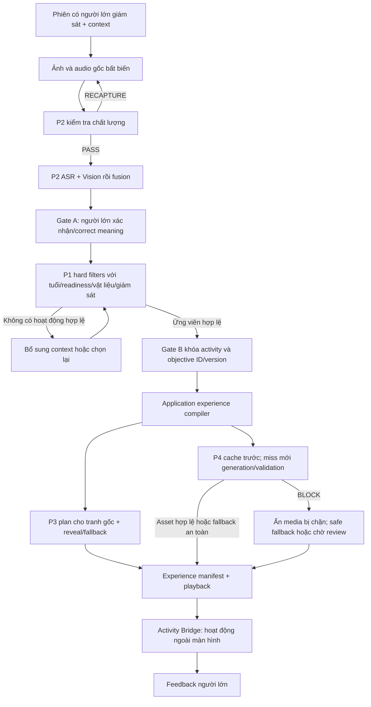

# Đề xuất nối thành luồng chung

- Status: PROPOSED
- Revision: 1, 2026-09-05
- Implementation status: NOT_STARTED
- Approval: NOT_APPROVED for implementation. Approval của FEAT-015 chỉ dành cho review/tài liệu.
- Basis: EV-015-01, ADR-0006, contract/integration rules và system baseline.

## Luồng mục tiêu

Các mũi tên là application commands/results qua contract, không phải service gọi chéo trực tiếp. P3 và P4 là hai nhánh tạo artifact khác nhau sau lựa chọn đã duyệt; không dùng video sinh của P4 để thay tranh gốc P3. Chỉ phát experience khi chính sách readiness thỏa mãn; BLOCK không được tự chuyển thành playable. Model-assisted ranking nếu có chỉ xem candidate đã vượt hard rules; slice đầu có thể cho người lớn chọn trong tập hợp hợp lệ.

## Giai đoạn 0 — Chốt đầu vào và hợp đồng

1. Dùng bốn tip đã pin trong EV-015-01. Review riêng local 1419f75 để giữ behavioral hardening cần thiết; không merge cả bộ adapter cũ một cách mặc định.
2. Đồng bộ harness từng stream, nhất là P4, rồi mở task integration có plan, acceptance, owner, evidence và approval riêng.
3. Lập schema/fixture catalog chung cho envelope: contract_name/version, session_id, expected_session_version, artifact_id/version, source_artifact_ids, timestamp và provenance theo applicability. Version của schema, artifact và activity/objective phải tách biệt.
4. P1 và P4 review mapping semantic objective, ID/version, locale/age band và review eligibility. Giữ canonical ID gốc và mapping có version; không suy ra mapping chỉ bằng đổi chữ hoa/thường.
5. Pin ASR V1/vision V2 ở adapter boundary; xác định consumer của V1 còn tồn tại và chính sách compatibility. Không sửa ngầm V1 thành V2.

Các contract cần review (tên dưới là đề xuất trừ các type đã có):

| Boundary | Payload cần thống nhất | Consumer |
|---|---|---|
| Intake -> P2 | immutable source refs/hash + validation provenance | ASR/vision |
| ASR/vision -> fusion | versioned typed success/failure, support/conflicts | RawUnderstandingResult |
| Raw -> Gate A | proposal version, correction, actor, expected version | canonical confirmed meaning |
| Gate A/context -> P1 | meaning ref + explicit age/readiness/material/supervision | deterministic candidate filtering |
| P1 -> Gate B | eligible activity + objective refs/versions, reason trace | approved choice |
| Approved choice -> P3 | artifact-bound objects + deterministic motion plan | renderer bridge |
| Approved choice -> P4 | activity/objective refs, locale, age context, provenance | cache/generation policy |
| P3/P4 -> composer | typed terminal status + artifact refs, no provider paths | experience manifest |
| Player -> application | session/plan/instance/version-bound events | handoff and feedback |

Người lớn/context có thẩm quyền cung cấp tuổi, readiness, vật liệu và giám sát. Không suy luận các giá trị này từ tranh/ASR.

## Giai đoạn 1 — Một vertical slice offline

Mục tiêu nghiệm thu: một session synthetic đi từ media fixture tới feedback, có cả trường hợp thành công và fail-safe, hoàn toàn không cần live provider.

- Bổ sung P2 T4/fusion theo approval riêng; trong lúc chưa có có thể dùng fixture RawUnderstandingResult được review, ghi rõ stub thay vì gọi đó là fusion thật.
- Gate A/B dùng command/harness có actor và version thật trong model ứng dụng, chưa cần UI đẹp.
- P1 rule fixtures là oracle; chọn activity cụ thể trong tập hợp hợp lệ. Không đặt activity trước rồi bỏ qua hard filters.
- P3 dùng WHOLE_DRAWING + DRAW_REVEAL/transform đơn giản. Segmentation, mask và rig là mở rộng sau.
- P4 dùng cache fixture đã review và still+narration; generation giả chỉ dùng để kiểm tra typed failures/retry.
- Composer giữ riêng original-art, learning media và handoff. Không để media failure làm mất hoạt động được duyệt.
- Application state/ports có in-memory implementation rõ ràng, không dùng các file mutable làm state chia sẻ giữa workstream. JSON fixtures là input bất biến.

## Giai đoạn 2 — Runtime ứng dụng và Android

Sau khi phase 1 đạt acceptance: FastAPI application commands, auth/authorization, PostgreSQL/S3-compatible/Redis-RQ adapters theo baseline; worker completion đi qua application với expected version và idempotency. Backend cấp media qua API được kiểm soát; mobile không chứa endpoint/credential S3/Lightning/Runpod.

Android nối capture, Gates, waiting/polling, bridge playback, handoff và feedback. Poll versioned backend job khoảng 2 giây, backoff tối đa 10 giây, dừng terminal, giảm khi background. Fixture mode vẫn là baseline test. Visual mới phải qua generated -> review/approval -> approved/applied; không lấy synthetic POC art làm product asset tự động.

## Giai đoạn 3 — Live model và vận hành

Chỉ thay từng port sau offline acceptance, theo approval/budget/profile hiện hành. P2 tiếp tục bằng chứng ASR/vision; P4 bổ sung concrete content-validation adapter, exception fallback, media integrity và artifact identity. Chạy FFmpeg thật, GPU preflight, benchmark held-out, latency/memory/cost và shutdown/cancellation; không gộp số đo mock với model thật. Production deployment có gate riêng, không mặc định thực hiện sau review này.

## Chiến lược branch/merge đề xuất

Sau approval implementation, tạo codex/integration-fixture-slice từ main sạch, pin các commit đã review. Thứ tự gợi ý P1 -> P2 -> P3 -> P4, từng PR/slice nhỏ, chạy lại harness và test tại mỗi mốc. Giải SOURCE_REGISTER bằng hợp nhất nguồn; giữ lịch sử/provenance. Đây là thứ tự thuận tiện để xử lý contract, không yêu cầu các thành viên dừng phát triển song song.

Không dùng nhánh local hiện tại có tài liệu review chưa commit làm integration base. Không chỉ merge tất cả rồi xử lý lỗi runtime; việc ghép phải đi cùng contract adapter/acceptance đã duyệt. Preflight cặp chưa thay thế merged-tree CI cuối cùng.

## Gợi ý phân công để người dùng duyệt sau

| Work package | Người dẫn dắt đề xuất | Reviewer/phối hợp |
|---|---|---|
| Canonical IDs, catalog eligibility, Gate A/B semantics và acceptance | P1 | P2 cho meaning, P4 cho objective |
| Fusion, source/provenance, understanding boundary | P2 | P1 |
| Experience compiler, renderer bridge/playback, preservation | P3 | P2 cho input, P4 cho media |
| Learning-media boundary, failure/fallback và activity-handoff/feedback slice | P4 | P1 về pedagogy, P3 về client |
| Session/job state và API contracts | Pair P1 + P2 | P3/P4 review consumer |
| Auth/storage/queue/device/E2E | Chia thành task có estimate/capacity trước khi giao | Shared; mỗi người đóng góp fixture và failure tests của boundary mình |

Bảng này là đề xuất vai trò để thảo luận, không phải approved Sprint assignment. Không tự giao toàn bộ backend/infra/E2E cho P4 hoặc toàn bộ Android cho P3. Chưa có dữ liệu capacity nên không bịa điểm hoặc deadline; phải estimate các task integration riêng theo ADR-0006.

## Owner choices applied — 2026-09-05

P1 is the canonical source for activity/objective IDs and versions. Gate A is mandatory before P1 filtering. ASR/vision conflicts retain both claims and require adult confirmation/correction. If P1 finds no eligible activity, the session collects additional context and re-evaluates. The first slice is fixture/mock based through activity handoff.

### PixiJS asset work package

The first slice must include one synthetic child-art asset with a versioned manifest, source artifact reference, sourceAssetId, sourceAssetVersion, SHA-256 and provenance. The loader validates the bytes and manifest before creating an animation plan, rejects missing provenance or mismatched hashes, and falls back to the whole drawing when extraction is unavailable. A synthetic fixture is not automatically a product visual; any app-applied asset follows assets/generated -> review/provenance -> assets/approved -> assets/applied.

## Fixture clarification

The shared integration fixture is a versioned synthetic package, not a service or mutable store. It should contain the original drawing and narration references, immutable hashes, media-validation expectation, expected P2 observations/conflict labels, explicit adult context for P1, expected Gate A/B outcomes, the P3 whole-drawing asset manifest/plan expectation, and the P4 cache/fallback expectation. Existing P3 butterfly fixtures remain standalone; the integration package may reference the same scenario concept but must own its own manifest and provenance.
