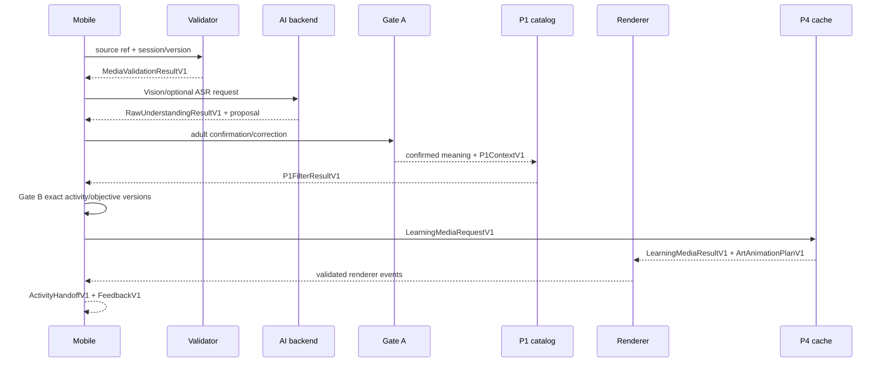

# FEAT-018 shared contract freeze

## Purpose

This document is the single contract source for the four person plans. A person may add an implementation detail only if it preserves these names, versions, required fields, provenance rules, and failure semantics. No person may invent a parallel field name or silently change a version.

## Contract authority and change rule

- Domain/API schemas are authoritative in `backend/src/sketch2life/contracts/schemas/` and their generated JSON Schema artifacts.
- Mobile and renderer types are mirrors generated or manually checked against the same JSON Schema; they are never a second source of truth.
- Fixture manifests declare contract names and versions and are validated before any device run.
- A breaking field change increments the contract major/version name (for example `VisionUnderstandingResultV1` → `VisionUnderstandingResultV2`), updates every producer/consumer, and adds a migration fixture. A compatible optional field increments the minor `contract_version` only after review.
- Every request carries `session_id`, `expected_session_version`, `request_id`, and an idempotency key at the transport boundary. Every result carries `contract_name`, `contract_version`, status, provenance, and a typed failure when failed.
- No raw media, prompt, model output, token, signed URL, or personal metadata enters normal logs/evidence.

## Canonical version registry

| Contract | Version | Owner | Consumers | Required invariants |
|---|---|---|---|---|
| `SourceMediaReferenceV1` | 1.0 | P2 | P1/P2/P3/P4/backend | `artifact_ref`, `sha256` only when `AVAILABLE`, `source_status`, immutable original; working copy never replaces source |
| `MediaValidationResultV1` | 1.0 | P2 | backend/mobile | `PASS` or `RECAPTURE`, ordered stable reasons, image/audio signals, validator policy version |
| `ModelProvenanceV1` | 1.0 | P2 | all AI evidence | provider, exact model, adapter version, config version; no token/URL |
| `AsrRequestV1` / `AsrResultV1` | 1.0 | P2 | fusion/backend | source audio ref, transcript/segments/quality on success; typed failure on failure |
| `VisionRequestV1` / `VisionUnderstandingResultV1` | 1.0 | P2 | fusion/P1/backend | entities, actions, relations, themes, ambiguous regions, uncertainty, source image, provenance |
| `RawUnderstandingResultV1` | 1.0 | P2 | Gate A/P1 | claims, source modality, confidence, conflicts, gate-a-required; observations never equal eligibility |
| `IntegrationGateDecisionV1` | 1.0 | shared | mobile/session | gate A/B, status, actor, expected session version; Gate B includes exact activity/objective IDs and versions |
| `P1ContextV1` | 1.0 | P1 | P1 filter/backend | explicit age, readiness, completed activities, materials, supervision, policy flags, candidate status |
| `P1FilterResultV1` | 1.0 | P1 | Gate B | status, exact activity/objective IDs and versions, ordered reason codes |
| `PixiArtAssetManifestV1` | 1.0 | P3 | renderer/mobile | asset/source IDs and versions, source hash/path reference, extraction status, provenance |
| `ArtAnimationPlanV1` | 1.0 | P3 | renderer/bridge | plan/source asset IDs and versions, bounded motions, target IDs, duration/bounds |
| `RendererBootstrap` + event protocol | 1 | P3 | mobile/WebView | protocol version, renderer instance ID, validated lifecycle events, bounded payloads |
| `LearningMediaRequestV1` / `LearningMediaResultV1` | 1.0 | P4 | P3/mobile | exact activity/objective/renderer versions, cache status, generation-called flag, provenance |
| `ActivityHandoffV1` | 1.0 | P1/shared | mobile/offscreen activity | exact activity/objective IDs and versions, source session version, ready status |
| `FeedbackV1` | 1.0 | shared | mobile/evidence | actor ref, exact activity/objective identity, recorded status; no child diagnosis/personality |

## Field-level rules

### Source and validation

`SourceMediaReferenceV1` keeps the original `artifact_ref` and SHA-256. `source_status=AVAILABLE` requires a 64-character lowercase SHA-256. `MISSING`/`UNREADABLE` cannot carry a hash. A working copy is derived-only and must point back to the original.

`MediaValidationResultV1` preserves image/audio references even when one modality is missing. `decision=RECAPTURE` stops inference. Stable reasons include unreadable, too-small, too-dark, low-contrast, blurry, framing-risk, silent/no-speech, duration, clipping, and unsupported media.

### AI results

Successful ASR/Vision results require available source, no failure object, and complete model/config provenance. Failed results require one typed `AdapterFailureV1` code. The allowed failure codes are `VALIDATION_REJECTED`, `TIMEOUT`, `PROVIDER_ERROR`, `RATE_LIMITED`, `MALFORMED_OUTPUT`, `PROHIBITED_FIELD`, and `SOURCE_MISMATCH`.

`RawUnderstandingResultV1` preserves ASR and Vision separately. `claims[].source` is `ASR`, `VISION`, or `FUSED_PROPOSAL`; `conflicts` and uncertainty are retained. `gate_a_required` is always true for a live proposal. No AI output may contain psychological/personality or eligibility claims.

### Gates and session

Gate A confirmation records `meaning_version`, `confirmed_claim_ids`, actor, expected session version, and optional adult correction. Gate B records exact activity/objective ID+version pairs and rejects stale session versions, inactive records, mismatched objective mappings, and missing hard-rule context.

### P1 context and identity

P1 context is adult-provided. The runtime must not infer `age_months`, readiness, completed activities, available materials, supervision, or policy flags from media. `P1FilterResultV1` is either eligible or blocked and always carries ordered reason codes.

### Renderer and media

`PixiArtAssetManifestV1` references the immutable source and optional derived masks/regions. `ArtAnimationPlanV1` can reveal/highlight/transform bounded source regions but cannot replace the original with generated art. `LearningMediaResultV1` must preserve activity/objective/renderer identity across cache hit, miss, timeout, and fallback.

## End-to-end state sequence

## Cross-person handoff table

| From | To | Input | Output | Blocking condition |
|---|---|---|---|---|
| P2 | P1/Gate A | validation + ASR/Vision | `RawUnderstandingResultV1` | invalid source, malformed/prohibited output, missing provenance |
| P1 | Mobile/P4 | `P1ContextV1` | `P1FilterResultV1` | missing context, hard safety/material failure, stale catalog |
| P1 | Gate B/P4 | candidate identity | `IntegrationGateDecisionV1` | mismatched IDs/versions or Gate A absent |
| P4 | P3 | `LearningMediaResultV1` | approved asset/plan references | cache miss, unsafe/corrupt/stale media |
| P3 | Mobile | `PixiArtAssetManifestV1` + `ArtAnimationPlanV1` | renderer events | invalid plan, source hash mismatch, bridge error |
| Mobile | shared | state + identity | `ActivityHandoffV1`, `FeedbackV1` | any gate/session invariant failure |

## Known reconciliation items before implementation

1. The integration fixture currently names `VisionUnderstandingResultV2`, while the active backend schema is `VisionUnderstandingResultV1`. FEAT-018 freezes V1 unless a separately approved V2 migration is added.
2. The fixture currently pairs `ACT-0004` with `OBJ_MOVEMENT_COORDINATION`; the reviewed golden catalog pairs `ACT-0004` with `OBJ_OBJECT_PERMANENCE` primary and `OBJ_RECEPTIVE_LANGUAGE` secondary. P1 must correct this before wiring the pilot.
3. `packages/art-renderer` currently exposes only protocol types. P3 must add the runtime without changing the protocol version silently.

## Contract-freeze evidence

- JSON Schema export and compatibility report.
- Fixture manifest contract registry check.
- Producer/consumer table for all four people.
- Positive, malformed, stale, missing-context, fallback, and redaction fixtures.
- One review record for every contract version change.
