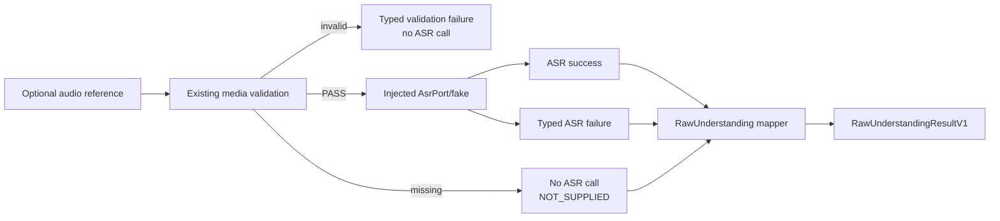

# FEAT-018 P2-T3 optional narration path - plan draft

Status: DRAFT. This note is planning-only and does not authorize implementation, model execution,
provider/network calls, GPU/Lightning work, approval-record changes, or a commit.

Date: 2026-09-13

## Objective

Define the smallest offline FEAT-018 slice for an optional narration input. The slice must preserve
truthful modality state and provenance while giving the existing `RawUnderstandingResultV1` mapper
typed ASR success and failure inputs. It must work entirely with injected fakes and deterministic
fixtures; real `faster-whisper`, model weights and live services are deferred.

## Confirmed constraints

- P2-T2 offline is complete at commit `11468d3a5a327697a491f09251a3210987337da0`.
- `RawUnderstandingResultV1` already distinguishes `NOT_SUPPLIED`, `ASR_SUCCEEDED` and
  `ASR_FAILED`, and rejects a supplied ASR result with a stale correlation ID.
- The versioned `AsrRequestV1`/`AsrResultV1` contract and `AsrPort` are existing typed boundaries.
  They are inputs to this plan, not a reason to create a second flat `label/confidence` contract.
- `gate_a_required=true` remains mandatory. Narration cannot infer eligibility, readiness,
  personality, activity, objective or Gate B decisions.
- No raw audio, transcript payload, provider headers, credentials or absolute local paths may enter
  tracked evidence.

## Proposed offline flow

Required behavior:

1. Missing narration produces `NOT_SUPPLIED`, no ASR invocation, and no invented transcript or
   confidence.
2. A validated supplied audio reference is passed to an injected typed port/fake. A successful
   `AsrResultV1` preserves transcript/segments, source audio hash, profile and quality metadata.
3. A typed ASR failure preserves error code, retryability and bounded detail as `ASR_FAILED`.
4. Any source hash, session/correlation or schema mismatch fails closed before Raw construction.
5. Invalid, unreadable, silent or otherwise rejected audio produces a stable typed outcome and zero
   ASR calls; it is not silently treated as missing narration.
6. ASR and vision claims remain separate collections. Fusion is limited to the existing mapper
   contract and does not create a new confidence or uncertainty formula.

## Candidate implementation boundary (requires approval)

This is a proposed file set only; no file is approved by this draft.

- Reuse, read-only: existing `contracts/schemas/asr.py`, `application/ports/asr.py`, and the
  approved media-validation contracts. Do not modify FEAT-003-owned schemas or adapters.
- Reuse or extend only after gap confirmation: deterministic fixture ASR adapter and injected
  engine seam. A provider-shaped adapter must map typed engine output and never leak SDK objects or
  raw payloads.
- FEAT-018 changes, if required, should be limited to an orchestration service/port, focused unit
  and contract tests, and one sanitized evidence note under this feature. The exact paths and
  ownership must be recorded in a task-approval addendum before implementation.
- Do not touch `qwen_vision.py`, FEAT-017's remote adapter, mobile, Gate A UI, P1, P3/P4 or shared
  integration.

## Acceptance criteria for a future approved implementation

- Tests cover image-only, valid audio plus vision, ASR failure, invalid audio, silent/no-speech,
  missing audio, malformed result, extra fields, source-hash mismatch and stale correlation.
- A spy/fake proves no ASR call occurs for missing or rejected audio.
- Success and failure outputs retain exact source/provenance and remain compatible with
  `RawUnderstandingResultV1`; no transcript, aggregate confidence or model provenance is invented.
- Correlation identity is checked for every supplied ASR result before mapping.
- No test requires network, model weights, GPU, Lightning, provider credentials or subprocess model
  execution.
- Sanitized evidence reports counts/statuses and hashes only; no raw audio or transcript payload is
  published.
- Focused tests, relevant ASR/vision regressions, ruff/mypy and repository validators pass.

## Stop gates

Stop and return for owner decision if any of the following is required: a new public ASR schema, a
change to the existing `AsrRequestV1`/`AsrResultV1` contract, FEAT-003 or FEAT-017 edits, hidden
retry/queue behavior, unbounded transcript/audio handling, real model execution, provider/network
access, mobile transport, or a policy that infers child attributes from narration.

## Decisions required before approval

1. Confirm that P2-T3 is offline-only and uses injected fakes; live Whisper/Lightning remains a
   separate later approval.
2. Confirm reuse of the existing typed ASR contract and port without modifying their owner files.
3. Approve the exact FEAT-018 file list after an implementation-gap inspection.
4. Confirm whether silent/no-speech is represented as an ASR typed failure or a media-validation
   rejection for this slice; do not collapse it into `NOT_SUPPLIED`.
5. Approve the sanitized evidence fields and test matrix before implementation begins.

## Explicit non-goals

This draft does not authorize P2-T4 pilot diagnostics, live Qwen/Whisper quality or latency
measurement, provider integration, mobile work, Gate A/Gate B changes, P3/P4 work, or any FEAT-003
benchmark/fixture/schema modification.
