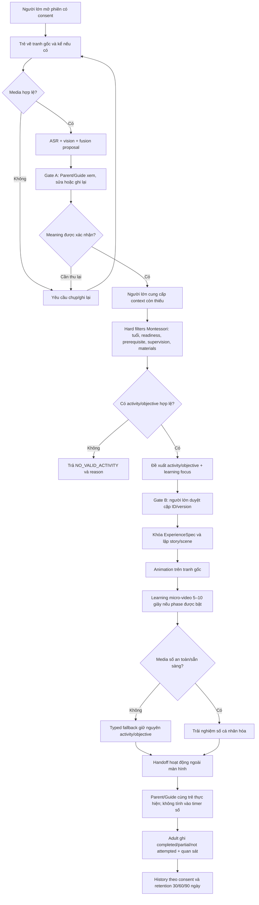
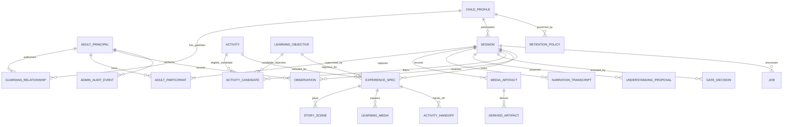
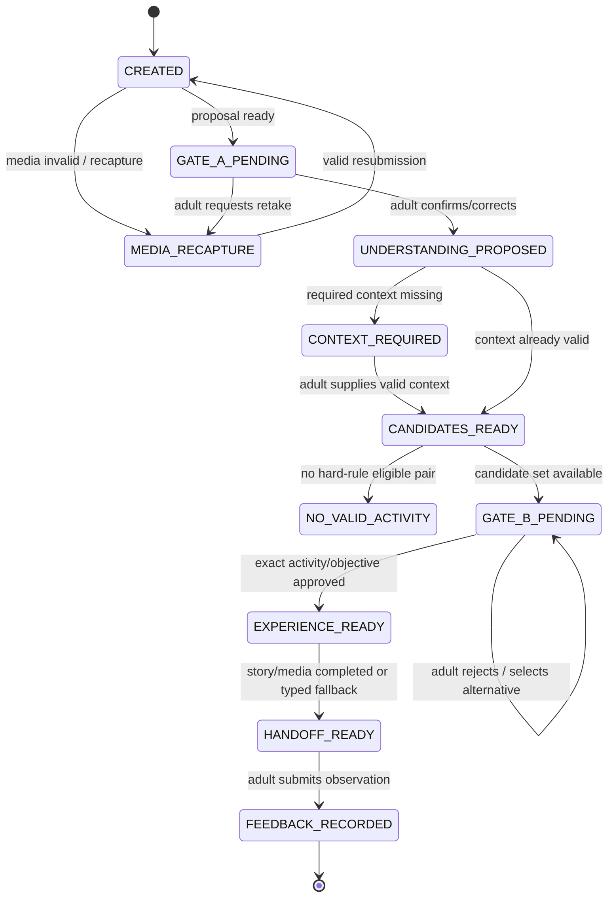

# SRS tổng thể Sketch2Life

- Mã tài liệu: S2L-SRS-MASTER
- Phiên bản: 1.3
- Ngôn ngữ: Tiếng Việt
- Ngày lập: 2026-09-19
- Trạng thái: Baseline mục tiêu đã được owner chốt; các chi tiết pháp lý, vận hành và physical deployment còn được đánh dấu TBD
- Căn cứ: tài liệu/mã nguồn repository hiện tại, Phieu_FA26SE225.docx, câu trả lời owner và hai ảnh workflow đã cung cấp
- Loại tài liệu: SRS cho sản phẩm mục tiêu, có chú thích riêng về mức độ hiện thực hóa

> Tài liệu này mô tả hành vi mục tiêu của Sketch2Life. Nó không khẳng định mọi hành vi đã được triển khai hoặc sẵn sàng production. Working tree của repository đã có thay đổi trước khi feature này bắt đầu; các thay đổi có sẵn được chỉ đọc và giữ nguyên.

## Mục lục

- [0. Cách đọc, thứ tự thẩm quyền và trạng thái](#0-cách-đọc-thứ-tự-thẩm-quyền-và-trạng-thái)
- [B1. Giới thiệu và mục tiêu tài liệu](#b1-giới-thiệu-và-mục-tiêu-tài-liệu)
- [B2. Mô tả tổng thể hệ thống](#b2-mô-tả-tổng-thể-hệ-thống)
- [B3. Bối cảnh hệ thống và interface bên ngoài](#b3-bối-cảnh-hệ-thống-và-interface-bên-ngoài)
- [B4. Actor và hệ thống bên ngoài](#b4-actor-và-hệ-thống-bên-ngoài)
- [B5. Phạm vi sản phẩm và workflow mục tiêu](#b5-phạm-vi-sản-phẩm-và-workflow-mục-tiêu)
- [B6. Business rules](#b6-business-rules)
- [B7. Thực thể và thuộc tính](#b7-thực-thể-và-thuộc-tính)
- [B8. Chuyển sang ERD](#b8-chuyển-sang-erd)
- [B9. Vòng đời trạng thái](#b9-vòng-đời-trạng-thái)
- [B10. Tính năng FR](#b10-tính-năng-fr)
- [B11. Ràng buộc và NFR](#b11-ràng-buộc-và-nfr)
- [B12. Contract, truy vết và review](#b12-contract-truy-vết-và-review)
- [B13. Mô hình relationship và phân quyền theo quan hệ](#b13-mô-hình-relationship-và-phân-quyền-theo-quan-hệ)
- [B14. Logical schema và data dictionary](#b14-logical-schema-và-data-dictionary)
- [B15. Logical API, command và error contract](#b15-logical-api-command-và-error-contract)
- [B16. Use case catalogue và acceptance scenarios](#b16-use-case-catalogue-và-acceptance-scenarios)
- [B17. Quality, operations, security và verification detail](#b17-quality-operations-security-và-verification-detail)
- [B18. Traceability và requirement verification index](#b18-traceability-và-requirement-verification-index)
- [B19. Review gate và các câu hỏi cần chốt để khóa schema](#b19-review-gate-và-các-câu-hỏi-cần-chốt-để-khóa-schema)
- [B20. Owner-approved scope closure](#b20-owner-approved-scope-closure)
- [B21. Product surfaces và Parent Web](#b21-product-surfaces-và-parent-web)
- [B22. Actor, relationship và authorization baseline](#b22-actor-relationship-và-authorization-baseline)
- [B23. Session, revoke và live monitoring](#b23-session-revoke-và-live-monitoring)
- [B24. Logical schema canonical target](#b24-logical-schema-canonical-target)
- [B25. Logging, audit và Grafana observability](#b25-logging-audit-và-grafana-observability)
- [B26. Retention, archive, deletion và legal constraints](#b26-retention-archive-deletion-và-legal-constraints)
- [B27. API/event contract baseline](#b27-apievent-contract-baseline)
- [B28. Verification, acceptance và remaining TBD](#b28-verification-acceptance-và-remaining-tbd)
- [B29. Source and legal reference register](#b29-source-and-legal-reference-register)


## 0. Cách đọc, thứ tự thẩm quyền và trạng thái

### 0.1 Thứ tự ưu tiên khi tài liệu mâu thuẫn

1. Chỉ dẫn trực tiếp và câu trả lời của project owner trong cuộc trao đổi hiện tại.
2. ADR đã chấp thuận và hồ sơ task approval cụ thể.
3. Phieu_FA26SE225.docx là nguồn scope đăng ký capstone; câu trả lời owner hiện tại ghi đè khi đã làm rõ mâu thuẫn.
4. Mã nguồn hiện tại cùng evidence có thể tái lập, dùng để nêu trạng thái implementation chứ không thay mục tiêu sản phẩm.
5. Context, plan, decision và tài liệu hiện trạng theo feature.
6. Handbook, workbook và tài liệu tham khảo bên ngoài trong docs/context/SOURCE_REGISTER.md.

Ảnh B4–B12 được dùng làm khung tài liệu theo xác nhận của owner. Ảnh workflow Sketch2Life được dùng làm luồng sản phẩm mục tiêu; owner đã xác nhận target age 0–12, story kể và giữ auth theo repository. Phiếu đăng ký được dùng làm nguồn scope của capstone, nhưng các câu imperative trong phiếu không phải chỉ dẫn cho assistant để bỏ qua yêu cầu hiện tại của owner. Nội dung nguồn không tự cho phép sửa runtime, gọi provider, thu thập dữ liệu trẻ thật, hay chọn một contract làm canonical. Không sao chép nội dung handbook/workbook bên ngoài vào SRS này.

### 0.1.a. Quy tắc áp dụng bản chốt ngày 2026-09-19

B20–B28 là phần owner-approved scope closure và **ghi đè các dòng OPEN_TBD cũ có cùng chủ đề** trong B4–B19. Những nội dung chưa được owner chọn vẫn giữ nhãn `OPEN_TBD`; tài liệu không tự chuyển proposal thành runtime contract. Các quyết định mới được ghi nhận:

- Một `Owner Caregiver` (cha/mẹ hoặc người giám hộ) sở hữu chính xác một ChildProfile; một Owner Caregiver có thể tạo nhiều ChildProfile.
- Một ChildProfile có thể có nhiều Guide; Guide được cấp quyền trong toàn bộ thời gian assignment/share còn hiệu lực.
- ChildProfile không có tài khoản đăng nhập riêng; mỗi session có đúng một adult operator.
- Parent Web là surface Phase 2 theo cùng backend authorization; MVP không bị mở rộng ngầm bởi quyết định này.
- Guide session bị Parent revoke thì dừng ngay, hiển thị thông báo trên màn hình và gửi notification cho các bên liên quan.
- Parent được xem live toàn bộ thông tin cần thiết của Guide session, nhưng UI phải áp dụng data minimization, không hiển thị toàn bộ metadata thô.
- Parent Web dùng để quản lý, theo dõi, cập nhật thông tin trẻ và gửi feedback; không tự động được coi là client mở session.
- Retention 30/60/90 ngày áp dụng cho toàn bộ data classes của child/session theo policy; audit log có policy riêng.
- Dữ liệu hết hạn được chuyển sang trạng thái archive hạn chế quyền xem trước khi purge theo deletion policy; archive không được hiển thị cho Parent/Guide.
- Assignment chồng thời gian giữa nhiều Guide được phép; mỗi Guide chỉ chạy một session tại một thời điểm.
- Notification dùng kết hợp nhiều kênh, nhưng exact channel matrix và retry policy vẫn là `OPEN_TBD`.

### 0.2 Nhãn trạng thái yêu cầu và evidence

| Nhãn | Ý nghĩa |
|---|---|
| OWNER_CONFIRMED | Project owner xác nhận trực tiếp, bao gồm lựa chọn workflow mục tiêu. |
| CURRENT_IMPLEMENTED | Có trong source tree đã kiểm tra; có thể là thay đổi local/chưa commit. |
| FIXTURE_ONLY | Chỉ có trong fixture, offline hoặc in-memory; chưa phải dịch vụ production bền vững. |
| ACCEPTED_ARCH | Ranh giới/kiến trúc đã chấp thuận, chưa chắc đã được nối vào runtime. |
| APPROVED_PLAN | Nằm trong phạm vi plan được duyệt; implementation có thể đang chờ hoặc còn gate. |
| PROPOSED_UNADOPTED | Đã có proposal/review nhưng chưa thành contract hoặc quyết định canonical. |
| OPEN_TBD | Còn thiếu quyết định hoặc đang chờ một bước riêng. |
| OUT_OF_SCOPE | Nằm ngoài mục tiêu SRS này hoặc ngoài approval được trích dẫn. |

Nhãn áp dụng cho đúng hành vi và ranh giới nguồn được dẫn. Test fixture xanh không làm thay đổi trạng thái FIXTURE_ONLY thành CURRENT_IMPLEMENTED cho luồng production.

### 0.3 Mốc hiện trạng và working tree

Tài liệu hiện trạng hiện có tại docs/CURRENT_SYSTEM_STATE.md được chụp ngày 2026-09-11. Checkout đang ở nhánh codex/feat-018-contract-plan. Trước khi feature này bắt đầu, working tree đã có file sửa đổi/chưa track ở FEAT-016 và FEAT-018, cùng tài liệu/contract trong FEAT-026 và FEAT-028. Không sửa các thay đổi đó. SRS dẫn cả nguồn hiện có lẫn nguồn mới trong working tree, nhưng phân biệt snapshot cũ, code local và plan đã duyệt.

### 0.4 Nguồn chính trong repository

- docs/context/PROJECT_CONTEXT.md và docs/context/SOURCE_REGISTER.md: quyết định của owner, nguyên tắc sản phẩm và ranh giới tài liệu tham khảo.
- Phieu_FA26SE225.docx: project context, proposed solution, actor-based FR/NFR, products, work packages, research questions/objectives/method and minimum-vs-extended note.
- docs/CURRENT_SYSTEM_STATE.md: snapshot hệ thống và khoảng trống hiện tại.
- docs/architecture/CONTRACTS_AND_INTEGRATION.md, OVERVIEW.md, REACT_NATIVE_ARCHITECTURE.md: ranh giới contract và hệ thống.
- docs/security/AUTHENTICATION.md và PRIVATE_AI_BOUNDARY.md: identity, authorization, provider và privacy.
- docs/adr/ADR-0003 đến ADR-0006: ranh giới kỹ thuật và quy tắc phân bổ công việc đã chấp thuận.
- features/FEAT-018-live-image-canvas-flow/plan/CONTRACT_FREEZE.md: registry contract tích hợp.
- features/FEAT-018-live-image-canvas-flow/plan/UI_MOBILE_LIGHTNING_ANDROID_DEMO_PLAN_REV2_DETAILED.md: phạm vi demo Android không video và các gate.
- features/FEAT-020-backend-ai-workflow-demo/: phạm vi backend AI riêng biệt.
- features/FEAT-003-multimodal-understanding/evidence/notes/P2_T4_BLOCKER_0_CONTRACT_RECONCILIATION_REPORT_20260913.md: xung đột contract trùng tên chưa được thông qua.
- packages/domain-montessori/spec/ và data/activity-catalog/mvp/: định danh activity, tuổi, hard rules, Gate B và handoff.
- backend/src/sketch2life/contracts/schemas/: contract backend có version.
- features/FEAT-015-integration-readiness-review/ và FEAT-016-runtime-integration/: fixture tích hợp và contract session/job in-memory.
- packages/art-renderer/ và apps/mobile/src/bridge/pixi/: ranh giới renderer và bridge.


## B1. Giới thiệu và mục tiêu tài liệu

### B1.1 Mục đích

Tài liệu này là Software/System Requirements Specification tổng thể cho Sketch2Life. Tài liệu định nghĩa sản phẩm mục tiêu, ranh giới hệ thống, actor, relationship, business rule, use case, dữ liệu logic, schema, interface, functional requirement, non-functional requirement, security, privacy, vận hành, verification và traceability đủ để làm baseline cho product, domain, backend, mobile, Guide Console, QA và review capstone.

Tài liệu không thay thế ADR, contract registry hoặc schema source đã được phê duyệt. Một schema được mô tả trong các phần PROPOSED_UNADOPTED chỉ là logical proposal để owner và các workstream review; không được tự động dùng để migrate runtime.

### B1.2 Đối tượng đọc

| Nhóm đọc | Phần cần dùng | Mục tiêu |
|---|---|---|
| Product owner/Advisor | B1–B6, B10, B12, B17 | Chốt scope, priority, business rule, TBD và acceptance. |
| Domain/Montessori reviewer | B6, B7, B13, B14, B16 | Kiểm tra sequence, prerequisite, safety, readiness, handoff và quyền Guide. |
| Backend/API engineer | B3, B4, B7–B10, B14–B15 | Thiết kế resource, authorization, schema, command, job và error. |
| Mobile/Guide Console engineer | B3–B5, B9–B10, B14–B16 | Thiết kế màn hình, session flow, offline, Gate A/B, notification và feedback. |
| AI/media/renderer engineer | B5–B7, B10, B12, B14–B15 | Giữ provenance, source precedence, model boundary, renderer và fallback. |
| QA/validation | B6, B9–B12, B16–B17 | Viết scenario, negative test, contract test, security test và traceability. |
| Security/privacy/research reviewer | B4, B13–B17 | Kiểm tra consent, child data, Admin raw access, retention, research và audit. |

### B1.3 Quy ước requirement

Mỗi requirement nên có các thuộc tính sau khi được promote khỏi TBD:

| Thuộc tính | Ý nghĩa |
|---|---|
| ID | Định danh bất biến, ví dụ BR-001, FR-001, NFR-001, REL-001, SCH-001, API-001. |
| Statement | Câu yêu cầu nguyên tử, dùng “phải” cho nghĩa bắt buộc. |
| Rationale | Lý do nghiệp vụ/an toàn/kỹ thuật hoặc nguồn đăng ký. |
| Priority | Must, Should, Could hoặc OUT_OF_SCOPE; priority MVP/extended còn TBD ở các mục chưa chốt. |
| Source | Owner, phiếu đăng ký, ADR, contract, catalog hoặc evidence path. |
| Status | OWNER_CONFIRMED, ACCEPTED_ARCH, CURRENT_IMPLEMENTED, FIXTURE_ONLY, PROPOSED_UNADOPTED, OPEN_TBD hoặc OUT_OF_SCOPE. |
| Verification | Test, inspection, analysis hoặc demonstration; phải chỉ rõ điều kiện pass. |
| Dependencies | Relationship, consent, version, catalog, provider, policy hoặc requirement khác. |

Một requirement không được dùng đồng thời hai ý nghĩa khác nhau. Nếu một câu còn phụ thuộc vào quyết định owner, câu đó giữ OPEN_TBD và không biến thành default implementation.

### B1.4 Baseline SRS tham khảo

Cấu trúc tài liệu này được đối chiếu với:

- ISO/IEC/IEEE 29148-2018, dùng để kiểm tra thuộc tính của requirement và cách quản lý requirement trong vòng đời: https://standards.ieee.org/ieee/29148/6937/
- NASA SWE-109 Software Requirements Specification, dùng để bảo đảm SRS bao phủ performance, interface, operational, quality-assurance requirement, assumptions và verification: https://swehb.nasa.gov/spaces/7150/pages/16449740/SWE-109%2B-%2BSoftware+Requirements+Specification
- Các contract, ADR và security guide trong repository được ưu tiên hơn template chung khi có mâu thuẫn.

### B1.5 Kiểm tra tính đầy đủ của tài liệu

| Nhóm nội dung thường có trong SRS | Vị trí trong tài liệu |
|---|---|
| Purpose, audience, document convention, references | B1 |
| Product perspective, user classes, environment, constraints, assumptions | B2 |
| System context, external interfaces, trust boundaries | B3 |
| Actors, AuthN/AuthZ, relationship và permissions | B4, B13 |
| Scope, workflow, use cases và state | B5, B9, B16 |
| Business rules và domain entities | B6, B7 |
| ERD/cardinality và data dictionary | B7, B8, B14 |
| Functional requirements | B10 |
| Non-functional, security, privacy và operational requirements | B11, B17 |
| Contracts, API, schemas, errors, idempotency | B12, B14, B15 |
| Research, deliverables và traceability | B12.3, B12.7, B18 |
| Open decisions, glossary và review gate | B12.4–B12.6, B19 |

## B2. Mô tả tổng thể hệ thống

### B2.1 Góc nhìn sản phẩm

Sketch2Life là hệ thống phối hợp giữa mobile supervised experience, backend domain/application services, Montessori knowledge base, AI adapters, artifact storage, renderer/media pipeline và Guide/Admin operations. Hệ thống biến tranh và lời kể của trẻ thành một trải nghiệm ngắn có adult gate, sau đó bàn giao sang hoạt động Montessori ngoài màn hình.

Hệ thống có hai loại trạng thái cần phân biệt:

1. Target product state: hành vi mà sản phẩm được yêu cầu phải đạt.
2. Implementation evidence state: phần đã có trong source tree, fixture hoặc demo hiện tại.

Không dùng fixture, local adapter hoặc demo metadata để tuyên bố production readiness.

### B2.2 Chức năng cấp cao

| Capability | Mô tả | Actor chính |
|---|---|---|
| Identity và access | Firebase adult authentication; backend resolve role, one-owner ChildProfile relationship, direct GuideAssignment và resource permission. | Parent, Guide, Admin |
| Child/family management | Tạo child profile, age/readiness/context, guardian relationship, consent và retention choice. | Parent, Admin |
| Capture và narration | Nhận original drawing, audio/narration, transcript; edit hoặc record lại khi không rõ. | Child, Parent, Guide |
| Multimodal understanding | ASR, vision, fusion proposal, uncertainty, conflict và provenance. | AI service, Parent/Guide |
| Gate A | Adult xác nhận/sửa meaning hoặc yêu cầu recapture/retake. | Parent, Guide |
| Montessori recommendation | Context, hard filters, sequence/prerequisite/safety, ranked candidates và reasons. | Backend, Guide, Parent |
| Gate B | Adult duyệt activity/objective/template/version. | Parent, Guide |
| Story/scene | Tạo nội dung kể chuyện và scene dựa trên meaning/objective đã duyệt; safety screen. | Story service, child, adult |
| Artwork animation | Animate/reveal original strokes với plan được validate; fallback still image. | Renderer, child |
| Learning micro-video | Clip giáo dục 5–10 giây theo workflow mục tiêu, có safety/content validation. | Media service, child |
| Off-screen handoff | Materials, substitute, setup, steps, supervision và safety để thực hiện hoạt động thật. | Parent, Guide, child |
| Observation/history | Ghi completed/partial/not attempted, interest/independence và observation/history. | Parent, Guide |
| Guide Console | KB, mapping review, class observation, override, template curation và assignment view. | Guide, Admin |
| Admin operations | Account/role/family/class links, model/safety/time, retention/consent/deletion, jobs/health và raw support access. | Admin |
| Research/evaluation | Dataset annotation, Guide rating, household trial và evaluation report sau consent/protocol. | Research team, Guide, Parent |

### B2.3 Nhóm người dùng và mức độ tin cậy

| User class | Có credential? | Mức tin cậy | Boundary |
|---|---:|---|---|
| Child supervised mode | Không | Người dùng được giám sát | Không cấp quyền domain; mọi action qua session của adult. |
| Parent | Có | Adult đã xác thực và có guardian link | Chỉ children được liên kết; không tự mở class scope. |
| Guide | Có | Adult đã xác thực và có active GuideAssignment | Assignment do Parent/Admin cấp; không tự xem ngoài scope. |
| Admin | Có | Adult có top-level role | Có quyền quản trị và raw support access theo owner; mọi action cần server enforcement/audit. |
| AI/service | Không phải adult credential | Workload identity/job scoped | Chỉ chạy purpose/session được cấp; không xác nhận human gate hay grant role. |
| External provider | Provider identity | Untrusted boundary | Không quyết định domain truth, eligibility, authorization hoặc retention. |

### B2.4 Môi trường vận hành mục tiêu

| Thành phần | Mục tiêu hiện tại | Chưa chốt |
|---|---|---|
| Parent/Child app | Android theo repository architecture; child mode supervised. | Android version/device matrix, tablet support, localization, accessibility. |
| Guide Console | Deliverable trong phiếu. | Web/mobile platform, browser matrix, deployment target. |
| Backend | HTTPS API, domain/application inward, adapter/provider boundary. | Production topology, regions, scale, SLO/RPO/RTO. |
| Authentication | Firebase Authentication, Google Sign-In/email-password adult identity. | Invitation, verification, recovery, MFA/reauth, Admin provisioning. |
| Data storage | Backend-owned PostgreSQL/S3-compatible/queue boundary theo architecture; không dùng Firebase Storage/Firestore/Realtime Database. | Physical schema, migrations, backup and disaster recovery. |
| AI/media | Backend-only adapters; Lightning fixture/dev và Runpod target sau gate theo ADR. | Provider approval, model versions, data processing/retention. |
| Renderer | PixiJS/GSAP boundary với original source. | Production WebView/native lifecycle and video protocol. |

### B2.5 Assumptions, dependencies và constraints

| ID | Loại | Nội dung | Trạng thái |
|---|---|---|---|
| ASM-001 | Assumption | Adult cung cấp age/readiness/consent/context; hệ thống không suy luận các field safety-critical từ tranh. | ACCEPTED_ARCH |
| ASM-002 | Assumption | Parent/Guide có trách nhiệm quan sát và tham gia hoạt động cùng trẻ. | OWNER_CONFIRMED |
| ASM-003 | Dependency | Recommendation phụ thuộc catalog đã review, version, prerequisite, safety và materials. | REGISTERED_SCOPE / qualification TBD |
| ASM-004 | Dependency | AI output phụ thuộc provider/model policy, nhưng provider không được làm authority. | ACCEPTED_ARCH |
| ASM-005 | Constraint | Original drawing/audio không bị thay thế âm thầm; derived artifact có provenance. | OWNER_CONFIRMED / ACCEPTED_ARCH |
| ASM-006 | Constraint | Firebase chỉ là Authentication; không dùng Firebase product state/storage. | ACCEPTED_ARCH / OWNER_CONFIRMED auth |
| ASM-007 | Constraint | Real child data chỉ thu thập sau consent/deletion/research controls. | REGISTERED_SCOPE |
| ASM-008 | Dependency | Direct GuideAssignment, Parent/Admin notification, revoke and optional petition cần assignment/relationship service. | OWNER_CONFIRMED behavior; channel/review details TBD |
| ASM-009 | Dependency | Retention 30/60/90 cần data class và deletion policy trước implementation. | OWNER_CONFIRMED choice; policy TBD |

### B2.6 Ngoài phạm vi hoặc chưa được phép suy ra

- Không tự tạo credential cho trẻ.
- Không dùng AI để suy luận chẩn đoán, tính cách, tâm lý, sang chấn hoặc developmental conclusion.
- Không cho ranking/Guide override bỏ qua hard safety, age, prerequisite hoặc supervision rule.
- Không coi Admin là được miễn consent, audit hoặc retention.
- Không coi Parent notification là Parent consent/approval; Parent có quyền revoke assignment đã được chốt.
- Không coi logical schema trong B14 là canonical runtime schema.
- Không tự mở rộng Parent Web vào MVP; animation, narrated story và micro-video là MVP theo owner closure, Parent Web là Phase 2.
- Không coi research sample, threshold, ethics, dataset release hoặc production SLO là đã được phê duyệt.

## B3. Bối cảnh hệ thống và interface bên ngoài

### B3.1 Context boundary

| Boundary | Bên trong Sketch2Life | Bên ngoài/không tin cậy | Quy tắc |
|---|---|---|---|
| Identity | Adult principal, role assignment, guardian/class relationship | Firebase token/provider claim | Backend verify token; token claim không cấp domain permission. |
| Client | Mobile/Guide Console command adapter, local session view | Thiết bị, UI state, client-sent role/child/class IDs | Client không quyết định state, role hoặc eligibility. |
| AI | Port, adapter, model provenance, typed failure | ASR/VLM/story/video provider | Provider không nhận trực tiếp credential mobile; output là proposal. |
| Artifact | Backend references, hashes, retention class | S3-compatible object store | Mobile không nhận bucket credential; original immutable. |
| Domain | Catalog, rules, Gate A/B, ExperienceSpec, handoff | Model free text/unknown IDs | Chỉ approved versioned records được tiếp tục. |
| Admin support | Permission check, audit, reason, raw access | Admin browser/device | Raw access phải có policy/audit controls sau khi chốt. |
| Research | Consent state, pseudonymous record, protocol | Research export/reviewer | Không export real child data khi chưa có approved protocol. |

### B3.2 Interface inventory

| Interface ID | Producer → consumer | Giao tiếp | Dữ liệu chính | Auth/availability |
|---|---|---|---|---|
| IF-001 | Mobile → Backend | HTTPS JSON command/query | Auth token, session command, artifact refs, gate decisions | Adult token; online/offline behavior TBD |
| IF-002 | Guide Console → Backend | HTTPS JSON command/query | assigned-child view, observations, KB, mappings, overrides, sessions | Active GuideAssignment |
| IF-003 | Admin Console → Backend | HTTPS JSON command/query | roles, links, config, privacy, jobs, raw support | Admin role + audit |
| IF-004 | Backend → Firebase Auth | Provider SDK/API | token verification and revocation status | Backend only |
| IF-005 | Backend → AI adapters | Internal ports/jobs | ASR/Vision/Fusion/Story/Media requests | Backend policy/provider gate |
| IF-006 | Backend → Object storage | Internal adapter | immutable originals and derivatives | Backend credential only |
| IF-007 | Backend → Renderer | Validated plan/bridge | source hash, plan, bounded motion/events | Approved asset/spec only |
| IF-008 | Backend → Notification channel | Internal notification port | Parent assignment notice, petition status | Channel/provider TBD |
| IF-009 | Backend → Research export | Controlled export | pseudonymous approved records | Consent/protocol gate |
| IF-010 | Backend → Observability/audit | Internal event/log port | redacted metrics, admin/security events | No raw child payload by default |

### B3.3 Interface envelope tối thiểu

Mọi mutation interface logical phải mang các field sau, trừ endpoint auth handshake thuần provider:

| Field | Type | Required | Rule |
|---|---|---:|---|
| request_id | UUID/string | Có | Correlate request/response/log redaction. |
| idempotency_key | string | Có với mutation retryable | Cùng key + cùng actor/scope trả cùng result; reuse khác payload bị reject. |
| actor_ref | internal ID | Server-derived | Không lấy authority từ client body. |
| session_id | UUID | Khi thuộc session | Must be server-authorized. |
| expected_version | integer | Khi optimistic concurrency | Stale version trả conflict; không overwrite. |
| occurred_at | RFC3339 UTC | Có | Server time là authoritative cho audit/state. |
| schema_version | string | Có | Serialized contract family/version, không alias khác shape. |
| trace_ref | string | Nên có | Correlate async job; không chứa PII. |

## B4. Actor và hệ thống bên ngoài

### B4.1 Actor con người

| Actor | Tài khoản và quan hệ | Trách nhiệm trong luồng mục tiêu | Trạng thái và điểm còn mở |
|---|---|---|---|
| Trẻ | Không có tài khoản đăng nhập độc lập; tham gia phiên có người lớn giám sát. Target age 0–12 tuổi theo owner. | Vẽ, kể/giải thích tranh, nghe story được kể, xem animation/learning media được duyệt và tham gia hoạt động Montessori ngoài màn hình. | Không tạo tài khoản riêng cho trẻ. Tuổi/readiness do người lớn cung cấp, không suy luận từ media; catalog bands vẫn có eligibility per-activity. |
| Parent / Owner Caregiver | Người giám hộ trưởng thành đã xác thực; là owner duy nhất của từng ChildProfile. Một owner có thể quản lý nhiều ChildProfile. | Đồng hành, quan sát; quản lý profile/consent; sửa narration; xác nhận Gate A; duyệt Gate B; xem history/screen time; assign/revoke Guide; theo dõi Guide session live; ghi feedback; chọn retention và yêu cầu xóa. | Owner scope đã chốt. Retention/archive/legal exceptions và account lifecycle vẫn theo TBD riêng. |
| Guide | Người lớn đã xác thực và được Parent hoặc Admin assign trực tiếp vào ChildProfile. Một ChildProfile có thể có nhiều Guide, kể cả assignment chồng thời gian. | Trong thời gian assignment còn hiệu lực, Guide có quyền thao tác workflow/session theo permission profile; quản lý/review Montessori KB, mapping, override và templates theo scope. | Assignment hiệu lực ngay; 3/7/15/30 ngày; Parent có thể revoke ngay. Field-level raw/history access vẫn cần chốt. |
| Admin | Actor quản trị người lớn; role cao nhất, xác thực qua Firebase Authentication. | Quản lý account/role/assignment; cấu hình model/safety/screen-time; retention/consent/deletion; jobs/model/platform health; break-glass raw-content access. | Break-glass, reason, notice, time window, dual approval và provisioning chi tiết được ghi ở B25/B26; chưa phải runtime implementation. |

### B4.2 Actor hệ thống và provider

| Hệ thống | Vai trò và ranh giới |
|---|---|
| Ứng dụng Parent/Child | Ứng dụng mobile Android theo kiến trúc hiện tại; trẻ dùng supervised mode, người lớn đăng nhập. Xử lý capture/quyền thiết bị, review, playback, activity handoff và gọi backend; không quyết định business rules hay authorization. Parent Web là surface Phase 2 dùng cùng backend policy. Offline local behavior còn TBD. |
| Guide Console | Deliverable có trong phiếu, gồm curriculum management, mapping review, observation records, recommendation override, template curation và assigned-child sessions. Nền tảng web/mobile cụ thể còn OPEN_TBD; authorization dùng cùng backend policy. |
| Sketch2Life backend | Nguồn thẩm quyền cho session ID/version, authentication verification, authorization, ràng buộc an toàn/Montessori, validate contract, artifact refs và job status. |
| Provider xác thực | Firebase Authentication; owner xác nhận giữ hướng auth hiện tại cho Parent, Guide và Admin. Repo ghi Google Sign-In và email/password cho người lớn; backend verify ID token và tự quyết định authorization. Cấm Firebase Storage, Firestore và Realtime Database. Chi tiết provisioning/lifecycle vẫn TBD. |
| Adapter AI/model | Port/adapter backend-only, trung lập provider cho ASR, VLM/fusion và phần tạo learning-media nếu được duyệt riêng. Model chỉ đề xuất meaning/content, không duyệt safety, eligibility hay human gate. |
| Artifact/object storage | Ranh giới S3-compatible do backend sở hữu cho artifact gốc/derived. Mobile không nhận bucket credentials và không gọi S3 trực tiếp. |
| PixiJS/GSAP renderer | Renderer xác định, chạy kế hoạch animation đã validate trên tranh gốc và asset được duyệt; không thay thế tranh gốc. |
| Montessori catalog/review | Metadata có version về activity, objective, materials, readiness, supervision, prerequisites, safety và review. Record synthetic/provisional hiện có chưa phải nội dung Montessori production-qualified. |

### B4.3 Authentication và authorization

#### Authentication (AuthN)

- Owner xác nhận giữ cách xác thực hiện tại trong repository. Theo docs/security/AUTHENTICATION.md, Parent/Guide là adult identity dùng Firebase Authentication; phương thức khởi đầu là Google Sign-In và email/password. Firebase chứng minh danh tính, không quyết định role hoặc quyền truy cập.
- Backend xác minh ID token qua verifier port/adapter trước use case. Source security yêu cầu kiểm tra signature, kid, issuer, audience/project ID, expiry, issued-at, subject và auth time; kiểm tra revocation với thao tác nhạy cảm và sau đổi account/role.
- Không tin role, uid, guardian relationship, classroom membership hoặc navigation mode do mobile gửi lên. Map verified principal sang internal adult ID, role assignment và các relationship record phía server.
- Chỉ người lớn xác thực. Child mode chạy bên trong session do Parent/Guide có quyền mở và không tạo/stored credential riêng cho trẻ.
- Cấm lưu token rõ trong log hoặc AsyncStorage; Firebase Storage, Firestore, Realtime Database và Firebase-hosted product state bị cấm theo repository security boundary.
- Provider exception trả lỗi generic 401/403, không lộ token hoặc nội dung provider. Role changes và relationship revocation phải có hiệu lực ở backend; chi tiết account lifecycle/UX còn OPEN_TBD.

#### Authorization (AuthZ)

Authorization do backend/domain/application policy thực thi ở mỗi resource/command; UI hide/show không phải security boundary. Mỗi ChildProfile có đúng một Owner Caregiver; Parent chỉ truy cập ChildProfile do mình sở hữu. Guide chỉ truy cập ChildProfile có assignment active do Parent hoặc Admin cấp; một ChildProfile có thể có nhiều Guide và assignment chồng thời gian. Parent assign có hiệu lực ngay và thông báo Guide; Admin assign là exception path thông báo cả Parent và Guide. Parent có thể revoke assignment ngay; revoke đang chạy làm session dừng theo B23.

| Actor/role | Scope được owner xác nhận hoặc ghi trong phiếu | Actions thuộc scope | Giới hạn còn cần chốt |
|---|---|---|---|
| Child supervised mode | Không có authenticated principal độc lập; chỉ session hiện tại do adult mở. | Vẽ/kể, xem story/animation/media được duyệt, tham gia activity. | Không đổi account, profile, consent, role, retention hoặc admin settings. PIN/parent gate cho exit/setup còn TBD. |
| Parent/Owner Caregiver | ChildProfile có `owner_adult_id` trỏ tới adult này. | Profile/consent, session capture, Gate A/B, recommendation/activity, feedback/history/screen time, Guide assignment/revoke, retention/deletion. | Không chuyển ownership qua Guide; legal guardian verification và account lifecycle còn TBD. |
| Guide | ChildProfile có GuideAssignment active trỏ tới adult này. | Session participation, assigned-child observation/history, KB/mapping/override/templates theo permission profile. | Assignment expiry/revoke chặn access; raw/history field-level visibility còn TBD. |
| System Admin | Owner xác nhận là role cao nhất hệ thống. | Account/role/assignment, model/safety/screen-time config, retention/consent/deletion, jobs/model/platform health và break-glass raw access. | Break-glass reason/notice/time-window/dual approval/provisioning chi tiết được khóa ở B25/B26. |
| AI/service identity | Operation/job và artifact được backend cấp cho một purpose/session cụ thể. | Chạy inference/selection/rendering theo allowlist, consent và approved contract. | Không thể xác nhận Gate A/B, đổi guardian relationship, publish KB hoặc cấp quyền; không được dùng quyền adult/admin. |

**Ma trận authorization chi tiết theo resource**

| Resource/action | Parent/Guardian | Guide | Admin | Enforcement status |
|---|---|---|---|---|
| Child profile / consent | Read/update children mình; quản lý consent theo policy | Read child/class records trong assignment; quyền sửa consent không mặc định | Quản lý consent records/policy theo phiếu; raw content khác | Owner scope + Admin assignment; chi tiết permission TBD |
| Capture / narration / Gate A | Trong session của ChildProfile mình sở hữu | Trong ChildProfile/session có GuideAssignment active | Có thể xem raw content chỉ qua break-glass; mutation workflow vẫn theo policy | Backend check ownership/assignment, session version và adult actor |
| Gate B / recommendation | Duyệt exact candidate/spec của ChildProfile mình sở hữu | Duyệt/override theo active permission profile | Không thay decision pedagogical của adult trừ support policy được duyệt | Hard safety/prerequisite filters không được bỏ qua |
| Activity feedback / history / screen time | Ghi/xem child mình | Child mình hoặc class được assignment | Monitor aggregate/system health và child-level records khi cần quyền quản trị/support | Resource-scope authorization ở backend |
| Curriculum KB / mappings / templates | Không có quyền mặc định | Quản lý/review/curate theo phiếu; publish level TBD | Có quyền cao nhất; có thể cấu hình role/workflow | Change version, actor, review state và audit |
| Accounts / role / family / classroom links | Quản lý relationship của child mình trong giới hạn được chốt | Được xem assignment; không tự cấp assignment | Admin cấp/quản lý assignment và gửi notification theo policy | Chỉ server-side; every change audit |
| Model / safety / time configuration | Không cấu hình global | Không cấu hình global trừ khi được giao riêng | Admin theo phiếu | Config version, actor/reason, rollback/audit TBD |
| Retention / deletion / audit | Chọn 30/60/90 ngày và yêu cầu xóa child mình | Không mặc định đổi Parent preference | Quản lý policy/request queue theo phiếu | Data classes, expiry, authorization and proof TBD |
| Raw drawing/audio/transcript | Trong ChildProfile mình sở hữu khi workflow/consent cho phép | Chỉ nếu permission profile và consent cho phép trong thời gian assignment | Break-glass only | Raw access reason, temporary scope, audit; dual approval/notice details TBD |

#### Authentication and authorization use cases

| ID | Use case | Basic behavior | Failure/security behavior |
|---|---|---|---|
| AUTH-UC-01 | Adult signs in | Adult authenticates using the retained Firebase provider methods; app exchanges verified identity with backend. | Invalid/expired/revoked identity cannot open a protected session; generic error only. |
| AUTH-UC-02 | Backend resolves permissions | Backend maps verified principal to internal adult account, role and child/class relationship. | Client role/child ID/class ID cannot grant scope; unknown/unlinked resource is denied. |
| AUTH-UC-03 | Adult starts child session | Parent/Guide opens an authorized child session after required consent checks. | Missing/revoked consent or relationship blocks creation/processing and returns typed safe reason. |
| AUTH-UC-04 | Guide opens assigned classroom record | Guide accesses only a roster/resource for which a server-side assignment is recorded by Admin; if a Parent existed beforehand, system sends a notification and Parent may submit a change petition. | Assignment/revocation and petition handling remain TBD; no implicit global class access. |
| AUTH-UC-05 | Admin performs privileged action | Admin performs registered account, role, link, model/safety/time, privacy, or monitoring operation. | Must be authenticated, server-authorized and audited; child-content access, break-glass and dual approval remain OPEN_TBD. |
| AUTH-UC-06 | Access is revoked | Role/guardian/class relationship or consent changes; backend denies subsequent unauthorized requests and sensitive operations check token revocation. | Existing job/artifact expiry and in-progress behavior follow consent/revocation policy still to be defined. |

## B5. Phạm vi sản phẩm và workflow mục tiêu

### B5.1 Mục đích

Sketch2Life chuyển tranh và lời kể của trẻ thành trải nghiệm học tập cá nhân hóa có story được kể và người lớn xem xét. Owner xác nhận workflow hình là target, dải tuổi mục tiêu 0–12 và MVP gồm animation, narrated story, micro-video. Trải nghiệm số cần dẫn sang hoạt động Montessori thật ngoài màn hình, có người lớn quan sát và ghi nhận feedback. Việc input narration có bắt buộc cho mọi session vẫn OPEN_TBD; Parent Web là Phase 2.

### B5.2 Luồng mục tiêu trong phạm vi SRS

Đây là workflow mục tiêu OWNER_CONFIRMED từ ảnh sản phẩm. Cột cuối tách mục tiêu này khỏi trạng thái runtime hiện tại.

| Giai đoạn | Hành vi mục tiêu | Kết quả chính | Mức độ hiện tại |
|---|---|---|---|
| 1. Đầu vào và context | Người lớn mở phiên được giám sát. Trẻ đưa tranh gốc và narration; narration có thể sửa/ghi lại khi chưa rõ. Tuổi, readiness, history liên quan và consent do người lớn cung cấp. | Reference ảnh/âm thanh bất biến và context người lớn có giới hạn. | Capture, consent UX và tạo session bền vững chưa được nối đầy đủ. |
| 2. Validate, hiểu và xác nhận | Media được kiểm tra xác định; ASR chuyển narration thành transcript; VLM quan sát tranh; fusion giữ lại claim, ambiguity và conflict theo nguồn. Người lớn xem ở Gate A, sửa meaning, chỉnh narration hoặc yêu cầu ghi lại. | Meaning đã được người lớn xác nhận, giữ provenance của nguồn và correction. | Có media validation và các họ contract ASR/Vision offline/dev; Gate A UX/API production chưa được nối. |
| 3. Đề xuất Montessori | Kiểm tra catalog status, tuổi chính xác, readiness, prerequisite, supervision/policy và materials trước mọi ranking. Chỉ chọn activity/objective có sẵn. Người lớn xem đề xuất/alternatives ở Gate B. | Cặp activity/objective đúng ID/version được duyệt cùng nhau. | P1 filter/compiler và Gate B integrity có ở offline/fixture; catalog đủ chuẩn production và UI/API còn mở. |
| 4. Lập story/scene | Nội dung dựa trên meaning đã xác nhận và learning objective đã duyệt; phù hợp tuổi và có cơ sở thực tế. | Experience plan có version, gắn với identity đã duyệt. | Có contract/plan; trải nghiệm người dùng chưa hoàn chỉnh. |
| 5. Animation tranh cá nhân hóa | Tạo chuyển động/reveal trên tranh gốc bằng motion xác định, có giới hạn và asset đã duyệt. | Animation cá nhân hóa và derivative có provenance. | Có renderer độc lập/fixture; mobile bridge chưa hoàn tất. |
| 6. Micro-video học tập | Clip ngắn giải thích objective, không thay trẻ hoặc tuyên bố tạo tranh của trẻ. Ảnh workflow nêu 5–10 giây. | Learning-media artifact riêng, đã qua kiểm tra safety/content. | OWNER_CONFIRMED là mục tiêu sản phẩm. Demo Android FEAT-018 được duyệt không có video; FEAT-020 có plan backend/video riêng. |
| 7. Chuyển sang hoạt động ngoài màn hình | Dừng playback số và bàn giao đúng activity đã duyệt, materials/substitutes, chuẩn bị, bước thực hiện và an toàn/giám sát. | Hoạt động Montessori thật có người lớn giám sát. | Có handoff contract/fixture; session production chưa nối. |
| 8. Feedback và history | Parent/Guide ghi hoàn thành, một phần hoặc chưa thực hiện; ghi chú interest, independence, observations. Cập nhật history mà không suy ra hoàn thành từ thời lượng xem. | Feedback gắn chính xác activity/objective/spec đã duyệt. | Contract gallery/feedback hiện process-local hoặc fixture-only; history bền vững chưa nối. |

### B5.3 Phạm vi hệ thống

**Trong phạm vi SRS**

- Ứng dụng Parent/Child Android và Guide Console là deliverables trong phiếu; nền tảng Guide Console còn TBD; API/command do backend sở hữu.
- Identity người lớn, authorization theo role/quan hệ, session có người lớn giám sát, consent, retention và deletion.
- Đầu vào tranh/narration và media admission xác định.
- ASR, VLM, fusion, Gate A, context người lớn, deterministic activity filtering và Gate B.
- Animation tranh gốc, learning-media riêng, fallback, handoff ngoài màn hình, feedback/history.
- Admin account/role/family-class workflows; model/safety/time configuration; privacy operations; job/platform monitoring theo phiếu.
- Research dataset/evaluation deliverables, Guide validation và household trial theo phiếu, subject to consent and approved protocol.
- Contract versioned, session/job semantics, provenance, security, acceptance criteria và traceability.

**Ngoài baseline triển khai hiện tại**

- Trình bày fixture/offline như luồng production end-to-end.
- Coi nội dung Montessori provisional/owner-reviewed là qualified approval.
- Tự động adoption mapping contract P2 đang đề xuất.
- Firebase data products, mobile gọi provider hoặc S3 trực tiếp.
- AI tự tạo activity/objective hoặc tranh thay thế.
- Suy luận tâm lý, tính cách, chẩn đoán, sang chấn hoặc phát triển từ media.
- iOS hoặc cloud deployment chưa được duyệt. Guide Console đã đăng ký là deliverable; web/mobile platform chưa được owner khóa.

### B5.4 Ranh giới kiến trúc và trust

- Mobile gọi Sketch2Life backend qua HTTPS; không gọi trực tiếp AI provider, database, queue hay object store.
- Firebase Authentication chỉ xác minh identity. Backend quyết định role người lớn, quan hệ child/guardian, quyền session/artifact và quyền Admin.
- Domain rules không phụ thuộc FastAPI, provider SDK, database, queue, renderer hay UI.
- Tiến độ async dùng backend job resource với HTTP polling giới hạn: bắt đầu khoảng 2 giây, backoff tối đa 10 giây, tôn trọng back-pressure, dừng khi job terminal. SSE/WebSocket cần evidence đo đạc và cập nhật ADR.
- Lightning chỉ fixture/dev trên account hiện tại; Runpod Serverless là production target sau benchmark/approval. Ranh giới này không tự cho phép mọi feature gọi provider.
- PostgreSQL/S3-compatible và Redis/RQ là ranh giới kiến trúc đã nhận; adapter/migration/worker hiện chưa hoàn chỉnh.

### B5.5 Sơ đồ workflow mục tiêu


### B5.6 Truy vết scope theo phiếu đăng ký

| Mục trong phiếu | Yêu cầu/deliverable được ghi trong phiếu | Vị trí tương ứng trong SRS | Trạng thái sau câu trả lời owner |
|---|---|---|---|
| 3.1 Project name | Sketch2Life chuyển tranh trẻ thành Montessori experience cá nhân hóa. | B5.1 mục đích; B5.2 workflow. | OWNER_CONFIRMED; target age 0–12 được owner xác nhận. |
| 3.2(a) Context | Interest signal, material sequence, generic AI không phải pedagogy, screen restriction, sketch domain gap, misrecognition/safety/privacy risk. | B5.1, B6, B10, B11, B12.7. | Nguồn rationale; từng luận điểm được phân loại thành constraint hoặc research premise, không coi mọi câu là implementation fact. |
| 3.2(b) Proposed solution | Capture + child description; multimodal understanding; six curriculum areas; age/prior-work filtering; animation on original lines; guarded story; off-screen activity; safety; observation history. | B5.2, B6, B10, B12.7. | Workflow image là target; narrated story được owner xác nhận. Child-description precedence và sequence semantics được truy thành yêu cầu nhưng acceptance detail cần chốt. |
| 3.2(c) Functional requirements | Child/adult, Parent/Guardian, Guide, AI engine, System Admin actors and capabilities. | B4.1, B4.3, B10. | Parent access is one-owner-per-child scoped; Guide access is active Parent/Admin assignment scoped; Admin highest role and raw child-content access are break-glass audited. |
| 3.2(d) NFR | Off-screen orientation, original artwork ownership, misrecognition, content/activity safety, pedagogy, privacy, responsiveness, offline. | B6, B10, B11. | Preserve registered nonfunctional topics; measurable targets absent in form remain TBD. |
| 3.2(e) Theory/practical | Montessori sequence, drawing development/sketch understanding, child speech, constrained recommendation, safety; KB, dataset annotation, guide validation and household study. | B12.7 research scope; evidence/source register. | Include as research context/plan; no performance result claimed. |
| 3.2(f) Products | Mobile app, Guide Console, KB, understanding, animation, story, recommender, annotated dataset, evaluation report. | B5.6, FR-031 onward, B12.7, B21. | MVP includes animation, narrated story and micro-video. Parent Web is Phase 2; research dataset/release remains TBD. |
| 3.2(g) Work packages | WP1 domain/research, WP2 backend/recommender, WP3 AI/animation/story, WP4 mobile/Guide Console. | B12.7 project work-package trace. | Registered allocation recorded as project organization, not runtime authorization or proof of completed implementation. |
| 3.3 Research | Two research questions, objectives, mixed methods, comparative baselines, household trial, contribution and related-work themes. | B12.7. | Preserve as intended study design from form. Owner says details are not yet clear; sample sizes, protocol, thresholds and approvals remain TBD. |
| 4 Other comments | Minimum scope: KB, multimodal + adult confirmation, constrained recommender, activity delivery, Guide Console. Animation/story/dataset release are extended scope; secure guides/families early. | B5.6, B20.2 and B21. | Owner chose workflow target and approved animation/story/micro-video for MVP; Parent Web remains Phase 2; dataset release stays TBD. |

**Scope distinction:** “Product target” means what the complete Sketch2Life experience is intended to do. “MVP/extended” means what the capstone must deliver by its deadline. Owner approved animation, narrated story and learning micro-video as MVP target scope. Parent Web is explicitly Phase 2. Research dataset release, exact deployment and production operations remain separate TBD gates.
## B6. Business rules

| ID | Quy tắc | Điều kiện chấp nhận/kiểm tra | Trạng thái |
|---|---|---|---|
| BR-001 | Trẻ không có tài khoản đăng nhập riêng và tham gia phiên có người lớn giám sát. | Mode trẻ không tạo credential độc lập; mỗi session có quan hệ người lớn được phép. | OWNER_CONFIRMED / ACCEPTED_ARCH |
| BR-002 | Parent/Owner Caregiver và Guide là người lớn đồng hành, quan sát và tham gia với trẻ; một ChildProfile có đúng một Owner và có thể có nhiều Guide assignment. | Parent chỉ truy cập ChildProfile mình sở hữu; Guide chỉ truy cập assignment active do Parent/Admin cấp. Assignment 3/7/15/30 ngày, hiệu lực ngay và Parent có thể revoke ngay. | OWNER_CONFIRMED; field-level Guide policy remains TBD |
| BR-003 | Admin là role có quyền cao nhất của hệ thống và tách khỏi Owner Caregiver. | Admin quản trị account/role/assignment/policy; raw child access chỉ qua break-glass, reason-required và audit. | OWNER_CONFIRMED; control details in B25/B26 |
| BR-004 | Tranh/âm thanh gốc của trẻ là bất biến. | Mọi derivative tham chiếu source artifact ID/version/hash; correction/retry tạo version/event mới, không âm thầm ghi đè source. | ACCEPTED_ARCH |
| BR-005 | Narration có thể được sửa hoặc ghi lại khi chưa rõ; giữ provenance giữa audio gốc, transcript edit và bản ghi mới. | Người lớn có thể chỉnh transcript hoặc ghi lại; correction/bản ghi mới có actor/version. Việc narration có bắt buộc ngay đầu session hay không còn TBD. | OWNER_CONFIRMED / OPEN_TBD |
| BR-006 | Kiểm tra chất lượng/an toàn media trước khi gọi inference. | Media lỗi/không hỗ trợ trả RECAPTURE với reason ổn định, không gọi ASR/VLM cho submission đó. | CURRENT_IMPLEMENTED / FIXTURE_ONLY |
| BR-007 | Kết quả ASR/VLM/fusion là đề xuất, không phải meaning chuẩn của trẻ. | Kết quả AI giữ source/model/config provenance, ambiguity/conflict và yêu cầu người lớn xem xét. | ACCEPTED_ARCH |
| BR-008 | Gate A là bước người lớn xác nhận hoặc sửa meaning. | P1 không dùng anchor chưa xác nhận như sự thật do người lớn duyệt; correction giữ actor/provenance. | OWNER_CONFIRMED / ACCEPTED_ARCH |
| BR-009 | Context người lớn phải được cung cấp tường minh; không suy luận tuổi, readiness, activity đã hoàn thành, materials, supervision, policy flags, consent hoặc quan hệ guardian từ media. | Thiếu context trả CONTEXT_REQUIRED hoặc typed failure; không tự điền giá trị làm yếu safety. | ACCEPTED_ARCH / FIXTURE_ONLY |
| BR-010 | Chỉ chọn activity/objective có trong catalog và có identity/version. AI chỉ xếp hạng ứng viên đã qua deterministic constraints. | ID/version được tìm thấy trong catalog; phản hồi model ngoài allowlist bị từ chối. | ACCEPTED_ARCH |
| BR-011 | Hard rules Montessori chạy trước model selection/ranking: catalog status, tuổi, readiness, prerequisite, supervision/policy và materials cần thiết. | Giữ mọi reason của hard rule thất bại; ứng viên bị block không được ranking. | CURRENT_IMPLEMENTED / FIXTURE_ONLY |
| BR-012 | Target population của SRS là 0–12 tuổi theo owner; tuổi được tính theo số tháng đã đủ và min/max catalog là inclusive. | Các band: 0–3 = 0–35 tháng; 3–6 = 36–71; 6–9 = 72–107; 9–12 = 108–155. Tuổi/readiness/safety từng activity vẫn là căn cứ eligibility cuối. | OWNER_CONFIRMED / SOURCE_VERIFIED |
| BR-013 | Age band 0–3 cần caregiver có mặt và giám sát trực tiếp. | Chặn ứng viên nếu thiếu policy hoặc mức giám sát tương ứng. | CURRENT_IMPLEMENTED |
| BR-014 | Không nới rule để buộc phải có gợi ý. | Nếu không có ứng viên hợp lệ, trả NO_VALID_ACTIVITY/NO_ELIGIBLE_ACTIVITY cùng reasons; không cho duyệt lựa chọn bị block. | CURRENT_IMPLEMENTED / ACCEPTED_ARCH |
| BR-015 | Gate B duyệt activity và learning objective cùng nhau với version chính xác; ExperienceSpec phải khớp lựa chọn đó. | Stale version, objective không khớp, record inactive, fit lỗi hoặc spec thay đổi đều bị chặn và không sửa session mới hơn. | ACCEPTED_ARCH / FIXTURE_ONLY |
| BR-016 | Story, animation, learning media, handoff và feedback giữ nguyên identity activity/objective đã duyệt. | Fallback có thể giản lược media nhưng không đổi activity/objective/template/spec âm thầm. | ACCEPTED_ARCH |
| BR-017 | Animation cá nhân hóa vận hành trên tranh gốc. | Renderer chỉ reveal/highlight/biến đổi có giới hạn trên vùng source đã validate; ảnh sinh mới không thay tranh gốc. Asset bổ sung tách riêng và có provenance. | ACCEPTED_ARCH / FIXTURE_ONLY |
| BR-018 | Learning media là artifact riêng. Tìm reviewed/cache trước khi tạo khi cache miss. | Cache hit phải READY; media stale/corrupt/unsafe hoặc provider lỗi trả fallback/block có type. | ACCEPTED_ARCH / FIXTURE_ONLY |
| BR-019 | Lỗi AI/media không được làm mất đường dẫn sang hoạt động thật. | Fallback media đơn giản hơn vẫn giữ activity identity đã duyệt và handoff ngoài màn hình có thể tiếp tục. | ACCEPTED_ARCH |
| BR-020 | Workflow số nên tối đa khoảng 10 phút; không tính hoạt động thể chất/ngoài trời. | Mục tiêu từ lúc bắt đầu luồng số đến handoff. Quy tắc timer, dung sai, chạy nền và pause còn TBD. | OWNER_CONFIRMED / OPEN_TBD |
| BR-021 | Micro-video mục tiêu dài 5–10 giây và có tính giáo dục. Video giải thích objective, không thay tranh hay hoạt động thật của trẻ. | Video nếu được tạo phải đúng duration và qua kiểm tra safety/content. Video chưa nằm trong demo Android FEAT-018 đã duyệt. | OWNER_CONFIRMED IMAGE TARGET / APPROVED_PLAN GATE |
| BR-022 | Handoff chấm dứt playback số và chuyển sang activity thể chất. | Không tự phát clip giải trí khác; hiển thị chuẩn bị, materials, safety và xác nhận hoàn thành do người lớn quan sát. | ACCEPTED_ARCH |
| BR-023 | Feedback là quan sát của người lớn. | Ghi completed/partial/not attempted, rating interest/independence nếu có, observation tags và refs đã duyệt; không suy ra hoàn thành từ thời lượng xem. | ACCEPTED_ARCH / FIXTURE_ONLY |
| BR-024 | Owner chọn retention cho toàn bộ child/session data classes: 30, 60 hoặc 90 ngày. | Hết hạn chuyển archive không hiển thị cho Parent/Guide rồi purge theo policy; audit log có retention riêng; backup/provider copy và legal exceptions vẫn TBD. | OWNER_CONFIRMED; lifecycle in B26 |
| BR-025 | Consent, least privilege, retention và deletion áp dụng cho dữ liệu nhạy cảm liên quan đến trẻ. | Không ghi media/PII của trẻ vào log/evidence; backend cấp quyền; audit deletion không giữ lại nội dung đã xóa. | ACCEPTED_ARCH |
| BR-026 | Command/result async có version và idempotency khi phù hợp. | Gửi lại key trả kết quả cũ; expected_session_version cũ không sửa state mới; timestamp phải có timezone. | CURRENT_IMPLEMENTED / FIXTURE_ONLY |
| BR-027 | Đạt fixture không đồng nghĩa đủ điều kiện production. | ACTIVE_FIXTURE hoặc PROVISIONAL_OWNER_REVIEWED không tự bật production eligibility; Montessori/provider/security vẫn cần gate riêng. | CURRENT_IMPLEMENTED / ACCEPTED_ARCH |
| BR-028 | Giữ ambiguity/conflict của source; không tự tạo độ chắc chắn hoặc suy luận tâm lý không an toàn. | Uncertainty được thể hiện; chặn claim về tâm lý, tính cách, chẩn đoán, trạng thái tinh thần, sang chấn hoặc phát triển. | ACCEPTED_ARCH / FIXTURE_ONLY |
| BR-029 | Correction, lựa chọn activity, gate approval và hành động Admin có quyền phải truy vết được. | Dùng actor ref ổn định, timestamp, session version và source/version refs; loại bỏ secret/raw payload. | ACCEPTED_ARCH |
| BR-030 | Asset bên ngoài cần provenance, quyền sử dụng, visual review và approval trước khi runtime dùng. | Runtime chỉ tham chiếu asset approved/applied; asset đang review không được chọn. | ACCEPTED_ARCH / FEAT-028 APPROVED PLAN |

| BR-031 | Authentication người dùng là adult identity do Firebase Authentication xác minh theo boundary hiện tại; authorization do backend quản lý. | Kiểm tra token/provider claims theo security guide; client role/UID/relationship không được coi là authority. | OWNER_CONFIRMED / ACCEPTED_ARCH |
| BR-032 | Guide resource scope được backend giới hạn bằng active GuideAssignment; Parent ownership là một-owner-per-child và không được suy ra từ role label. | Cross-child access deny; Parent assign thông báo Guide; Admin assign thông báo Parent và Guide; revoke có hiệu lực ngay và dừng active Guide session. | OWNER_CONFIRMED; channel/retry details TBD |
| BR-033 | Admin là top-level role cho account/role/assignment, model/safety/time, privacy operations, platform monitoring và support. | Raw child access chỉ break-glass, reason-required, temporary and audited; không truy cập object storage trực tiếp. | OWNER_CONFIRMED; dual approval/time-window/notice TBD |
| BR-034 | Montessori knowledge records và mapping corrections phải giữ version, source, editor/reviewer và trạng thái review. | Runtime chỉ dùng catalog/template được publish/approved; Guide publish permission/lifecycle còn TBD. | REGISTERED_SCOPE / OPEN_TBD |
| BR-035 | Guide recommendation override không làm mất hard safety/prerequisite rules. | Override phải trace actor/reason/version và không chọn record bị hard-block; exact eligible alternatives policy TBD. | ACCEPTED_ARCH / REGISTERED_SCOPE |
| BR-036 | Khi mạng yếu, capture và activity instructions cần usable; generation được queue đến khi connectivity trở lại. | Hiển thị queued/retry state và giữ idempotency; local persistence/encryption/consent recheck cần chốt. | REGISTERED_SCOPE / OPEN_TBD |
| BR-037 | Animation failure phải degrade thành still image, giữ original drawing và activity handoff. | Không regenerate/replace original; typed failure/fallback giữ exact approved activity/objective. | REGISTERED_SCOPE / ACCEPTED_ARCH |
| BR-038 | Real child research data chỉ được thu thập sau khi consent và deletion procedures được thiết lập. | Research consent, data purpose, retention, release and withdrawal are recorded; sample/protocol/retention details TBD. | REGISTERED_SCOPE / OPEN_TBD |
| BR-039 | Khi image và child description bất đồng, hệ thống ưu tiên lời mô tả của trẻ và trả explicit uncertainty thay vì label chắc chắn nhưng sai. | Giữ provenance/conflict; uncertainty được Gate A adult review; confidence/threshold/UI semantics còn TBD. | REGISTERED_SCOPE / OPEN_TBD |
### B6.1 Độ tuổi được kiểm tra trong catalog activity

data/activity-catalog/mvp/activities.v1.json có 100 activity baseline, mỗi band 25 bản ghi. Dải tháng đã đủ được tính inclusive:

| Age band | Dải tháng | Số activity trong MVP baseline |
|---|---:|---:|
| 0–3 tuổi | 0–35 tháng | 25 |
| 3–6 tuổi | 36–71 tháng | 25 |
| 6–9 tuổi | 72–107 tháng | 25 |
| 9–12 tuổi | 108–155 tháng | 25 |

Catalog bao phủ đến 155 tháng đã đủ, tức dưới 13 tuổi. AgeBand chỉ hỗ trợ phân nhóm review; tuổi chính xác từng activity cùng readiness/prerequisite/supervision/material/safety mới quyết định eligibility. FEAT-022/023 có công việc semantic catalog mở rộng riêng; không nhầm số profile với số activity record.

## B7. Thực thể và thuộc tính

Bảng này là logical domain model cho SRS, chưa khóa physical schema. ID/version ổn định; dữ liệu nhạy cảm và media nằm trong artifact store do backend quản lý.

| Thực thể | Thuộc tính/quan hệ chính | Bất biến |
|---|---|---|
| AdultPrincipal | `adult_id`, verified identity ref, account status, role assignments | Chỉ người lớn đăng nhập; identity provider không tự quyết định quyền domain. |
| GuardianRelationship | `guardian_id`, `child_profile_id`, relationship, status, permission scope | Backend xác minh quan hệ trước khi truy cập session/media. |
| ChildProfile | `child_profile_id`, tuổi/tháng do người lớn khai báo, readiness, consent refs, retention selection | Không có credential; tối thiểu hóa PII; không suy luận tuổi từ tranh. |
| ConsentRecord | `consent_id`, scope, guardian actor, granted/revoked time, policy version | Quyền xử lý kiểm tra tại các boundary phù hợp; thu hồi chặn xử lý mới. |
| Session | `session_id`, child ref, guardian refs, state, version, created/updated time | Mọi command kiểm tra quyền và expected version; không cho client tự đặt state. |
| MediaArtifact | `artifact_id`, session, kind, immutable object ref, hash, MIME, size, provenance, retention class | Original không bị ghi đè; artifact access kiểm tra guardian authorization. |
| NarrationTranscript | `transcript_id`, audio source ref, text/version, language, confidence, edit actor/time | Raw ASR, bản sửa, bản thu lại có lineage tách biệt. |
| UnderstandingProposal | source image/audio refs, claims, anchors, ambiguity/conflict, model/config provenance | AI output là proposal; Gate A approval tạo record/version mới. |
| GateDecision | gate type, actor, outcome, confirmed refs/IDs+versions, reason, timestamp | Gate A và Gate B là event bất biến, gắn actor được ủy quyền. |
| AdultContext | age/readiness, interests, completed history, materials, supervision/policy facts, source actor | Không nhận trường do model tự suy ra làm fact người lớn. |
| Activity / LearningObjective | catalog ID/version, age bounds, status, prerequisites, readiness, materials, supervision, safety, objective | Chỉ catalog records có status/eligibility phù hợp mới được đề xuất. |
| ActivityCandidate | activity/objective refs, deterministic filter results, reason codes, ranking metadata | Hard-rule fail không được đưa qua ranking. |
| ExperienceSpec | spec ID/version, activity/objective IDs+versions, template, learning basis, provenance | Identity phải khớp Gate B; stale/mutated spec bị chặn. |
| StoryPlan / ScenePlan | narration basis, age band, scenes, timing, asset refs, source refs | Nội dung truy nguyên được về meaning/objective đã duyệt. |
| AnimationPlan | renderer, source hash, bounded transforms/motions, approved asset refs, plan version | Giữ nguyên original; deterministic validation trước execute. |
| LearningMedia | media ID/version, objective ref, duration, content/safety status, cache key, provenance | Clip riêng với tranh/animation; cache chỉ dùng nếu READY và chưa stale. |
| ActivityHandoff | approved activity/objective refs, materials/substitutes, preparation, steps, safety, supervision | Handoff về đúng activity đã duyệt; physical activity cần giám sát. |
| Observation / Feedback | actor, outcome, interest/independence, notes/tags, event time, approved refs | Quan sát do người lớn nhập; không suy ra từ playback. |
| SessionHistory | session/activity refs, feedback summary, provenance, expiry | Chỉ dùng theo consent/retention; không biến quan sát thành chẩn đoán. |
| Job / IdempotencyReceipt | job ID/state, session version, request key, command/result ref, timestamps | Retry cùng key không nhân đôi tác động; stale version bị reject. |
| AdminAuditEvent | admin actor, permission, target ref, reason, timestamp, outcome | Least privilege; không lưu raw child payload trong audit. |
| RetentionPolicy | guardian/child scope, 30/60/90 days, effective time, policy version | Parent chọn; áp dụng hết hạn và deletion cascade theo data class đã duyệt. |

### B7.1 Quan hệ và cardinality logic

- Một `ChildProfile` có đúng một `OwnerCaregiverOwnership`; một Owner Caregiver có thể sở hữu nhiều trẻ. Guide access được biểu diễn bằng `GuideAssignment` riêng và không tạo thêm owner.
- Một child có nhiều `Session`; một session gắn với child và một hoặc nhiều adult participant được ủy quyền.
- Một session có nhiều media/artifact/version, proposal, gate event, activity candidate và job; original artifact có thể được tham chiếu bởi nhiều derivative nhưng không bị sửa.
- Một `ExperienceSpec` gắn chính xác một activity và objective version cho mỗi handoff; các scene/media phải truy ngược về spec.
- Một activity/objective trong catalog có thể xuất hiện ở nhiều candidate/session; candidate snapshot giữ catalog version đã dùng.
- Retention policy của Parent áp dụng đến child/session artifacts theo scope sẽ được chốt; quyền nhiều guardian và xung đột policy còn OPEN_TBD.

## B8. Chuyển sang ERD



Sơ đồ biểu diễn quan hệ domain ở mức tổng thể. `ADULT_PARTICIPANT`, `DERIVED_ARTIFACT` và `STORY_SCENE` là các association/conceptual records, không áp đặt bảng vật lý. Cardinality exact, indexing, event storage và lifecycle được khóa trong ADR/schema riêng sau khi câu hỏi còn mở được trả lời.

## B9. Vòng đời trạng thái

### B9.1 Vòng đời sản phẩm mục tiêu



Đây là lifecycle đích tham chiếu cho người dùng. Retry, consent withdrawal, retention expiry, technical failure và session cancellation cần terminal/recovery outcomes chi tiết trong contract/API design. Nếu GATE A retake xảy ra, downstream proposal/context/candidates/spec cũ phải bị invalidated hoặc versioned để không tái sử dụng nhầm.

### B9.2 Trạng thái session trong fixture FEAT-016

Contract fixture hiện ghi nhận thứ tự: `CREATED` → `GATE_A_PENDING` → `UNDERSTANDING_PROPOSED` → (nếu thiếu) `CONTEXT_REQUIRED` → `CANDIDATES_READY` → `GATE_B_PENDING` → `EXPERIENCE_READY` → `HANDOFF_READY` → `FEEDBACK_RECORDED`. `MEDIA_RECAPTURE` là nhánh cho media invalid hoặc adult retake; retake xóa/invalidate downstream state. `NO_VALID_ACTIVITY` là kết quả không có candidate eligible.

Fixture command mang session ID/version, actor, command ID/request ID và timestamp; duplicate idempotency key không lặp tác động, stale expected version bị reject. FEAT-016 aggregate/storage hiện là in-memory fixture, không chứng minh API hoặc persistence production. FEAT-018 contract freeze Rev2 đã ghi rõ mapping một lần từ `MobileWorkflowCommandV1.request_id` sang FEAT-016 `command_id`; không suy ra mọi named schema khác nhau là canonical chỉ vì alias.

## B10. Tính năng FR

Các FR mô tả hành vi mục tiêu; mức trạng thái phản ánh bằng chứng trong repo tại ngày lập tài liệu. `TBD` là câu hỏi cần chốt trước khi thiết kế/implementation bị ràng buộc.

| ID | Yêu cầu | Chấp nhận khi | Ưu tiên / trạng thái |
|---|---|---|---|
| FR-001 | Hệ thống phải cho người lớn đã xác thực bắt đầu phiên với child profile được ủy quyền. | Unauthorized guardian không thể tạo session hoặc đọc child artifacts; child không có login riêng. | Must / ACCEPTED_ARCH |
| FR-002 | Hệ thống phải ghi nhận adult participants, vai trò Parent/Guide và consent/version áp dụng cho session. | Backend kiểm tra quan hệ và quyền cho từng command; client role không được tin cậy. | Must / OPEN_TBD permissions |
| FR-003 | Hệ thống phải nhận tranh gốc và narration tùy workflow đã được chốt, lưu như artifact bất biến. | MIME/size/content validation trước inference; checksum/provenance tồn tại; nguồn không bị ghi đè. | Must / OPEN_TBD narration required |
| FR-004 | Hệ thống phải hỗ trợ edit transcript và thu narration lại khi nghe/nhận dạng không rõ. | Hiển thị bản gốc và bản sửa/bản thu lại có thể truy nguyên; correction yêu cầu guardian actor. | Must / OWNER_CONFIRMED |
| FR-005 | Hệ thống phải cung cấp tuổi/tháng, readiness, completed history, materials, supervision/policy và consent như context có nguồn. | Missing required context trả `CONTEXT_REQUIRED`; không tự đoán từ media. | Must / FIXTURE_ONLY |
| FR-006 | Hệ thống phải chạy media admission/quality checks trước ASR/VLM. | Kết quả lỗi có type và reason ổn định; không gọi inference nếu input bị block. | Must / FIXTURE_ONLY |
| FR-007 | Hệ thống phải chuyển narration thành transcript qua ASR adapter hoặc trả typed failure. | Transcript liên kết audio/model/config/language provenance; provider nằm phía backend. | Should / PROPOSED/DEV |
| FR-008 | Hệ thống phải phân tích tranh và kết hợp kết quả multimodal mà không làm mất ambiguity/source conflict. | Output giữ claims, source refs và uncertainty; không xuất chẩn đoán hay suy luận tâm lý. | Must / PROPOSED/DEV |
| FR-009 | Hệ thống phải mở Gate A để Parent/Guide xác nhận, sửa hoặc yêu cầu ghi/capture lại. | Chỉ adult actor có quyền ghi quyết định; correction tạo event/version; raw AI output không bị đổi thành user fact. | Must / TARGET; UI/API TBD |
| FR-010 | Hệ thống phải compile candidate set bằng hard filters trước ranking. | Catalog status, age, readiness, prerequisite, supervision/policy, material áp dụng trước rank; giữ mọi failure reason. | Must / FIXTURE_ONLY |
| FR-011 | Hệ thống phải giới hạn đề xuất vào activity/objective ID và version tồn tại trong catalog. | External/model-proposed ID hoặc version stale bị từ chối; trả `NO_VALID_ACTIVITY` nếu không còn cặp hợp lệ. | Must / ACCEPTED_ARCH |
| FR-012 | Hệ thống phải hiển thị candidate, reason/fit evidence và lựa chọn an toàn cho người lớn tại Gate B. | Không tạo spec trước approval; lựa chọn gắn exact activity/objective versions. | Must / APPROVED_PLAN; UI TBD |
| FR-013 | Hệ thống phải lock Gate B bằng record bất biến và validate ExperienceSpec khớp IDs/versions đã chọn. | Thay đổi/stale version, inactive item, mismatch hoặc failed fit không chuyển session sang ready. | Must / FIXTURE_ONLY |
| FR-014 | Hệ thống phải xây StoryPlan/ScenePlan dựa trên meaning đã được xác nhận và objective đã duyệt. | Scene có learning basis, source/spec refs, age suitability và duration; không chế child facts. | Must / ACCEPTED_ARCH; schema TBD |
| FR-015 | Hệ thống phải dựng animation cá nhân hóa trên chính tranh gốc. | Renderer xác thực hash, bounds, motion/object caps và approved asset provenance; output không thay thế original. | Must / local renderer WIP |
| FR-016 | Hệ thống phải chọn learning assets được review/cache trước và chỉ tạo mới theo provider gate được duyệt. | READY cache hit dùng được; corrupt/stale/unsafe hit bị loại; provider call có audit/budget/policy. | Must / APPROVED_PLAN; production TBD |
| FR-017 | Hệ thống phải tạo micro-video học tập 5–10 giây theo workflow mục tiêu, tách khỏi art animation. | Chỉ đưa vào experience sau content/safety validation; video giải thích objective, không nhận là nội dung/tranh của trẻ. | Should / target; FEAT018 excludes |
| FR-018 | Hệ thống phải cung cấp typed fallback khi animation/video/provider/content validation không sẵn sàng. | Fallback không đổi activity/objective/template đã duyệt và vẫn cho phép handoff ngoài màn hình. | Must / ACCEPTED_ARCH |
| FR-019 | Hệ thống phải đưa hoạt động thật ngoài màn hình lên trước sau phần trải nghiệm số. | Handoff nêu materials/substitutes, chuẩn bị, các bước và supervision/safety; playback kết thúc khi chuyển sang physical activity. | Must / TARGET; handoff fixture |
| FR-020 | Hệ thống phải cho adult ghi nhận completed, partial hoặc not attempted và quan sát interest/independence. | Feedback có adult actor/time và refs chính xác; thời lượng xem không tự đánh dấu completed. | Must / FIXTURE_ONLY |
| FR-021 | Hệ thống phải cập nhật history từ feedback hợp lệ. | History giữ nguồn quan sát và expiry; không tự sinh developmental/psychological conclusion. | Should / persistence TBD |
| FR-022 | Hệ thống phải cho Parent chọn retention 30, 60 hoặc 90 ngày. | Choice được lưu/version hóa và áp dụng cho data classes trong scope sau khi policy chi tiết được chốt. | Must / OWNER_CONFIRMED; policy TBD |
| FR-023 | Hệ thống phải chuyển dữ liệu child/session hết hạn sang archive không hiển thị cho Parent/Guide rồi purge theo retention/deletion policy. | Deletion xử lý derived objects, indexes/cache/backup/provider copies theo runbook; audit proof không lộ payload và có retention riêng. | Must / OWNER_CONFIRMED; legal/backup details TBD |
| FR-024 | Hệ thống phải hỗ trợ polling job có giới hạn cho xử lý async. | Client bắt đầu khoảng 2s, backoff đến 10s, tôn trọng retry/backpressure, dừng ở terminal state. | Should / ACCEPTED_ARCH |
| FR-025 | Hệ thống phải enforce session version và idempotency cho mutation commands. | Duplicate command không tạo artifact/job/event trùng; stale version trả conflict typed và không sửa state mới hơn. | Must / FIXTURE_ONLY |
| FR-026 | Hệ thống phải duy trì provenance xuyên suốt media, transcript, proposal, gate, catalog, spec, renderer, learning media và feedback. | Từ artifact cuối truy được nguồn/phiên bản/actor tương ứng mà không đưa raw PII vào log chung. | Must / ACCEPTED_ARCH |
| FR-027 | Hệ thống phải cung cấp Admin operations riêng có authorization và audit. | Mọi action có permission, reason, actor, target, outcome; user session không thể tự nâng quyền. Ma trận actions TBD. | Must / OWNER_CONFIRMED actor; permissions TBD |
| FR-028 | Hệ thống phải giới hạn tổng thời lượng trải nghiệm số khoảng 10 phút, loại trừ hoạt động thể chất/ngoài trời. | Timer và reporting có thể xác định digital segment; pause/background/tolerance do owner chốt; không tính physical handoff. | Should / OWNER_CONFIRMED target |
| FR-029 | Hệ thống phải cho guardian access, correction, consent withdrawal và deletion theo policy được chốt. | Unauthorized access bị từ chối; withdrawal chặn xử lý tương lai; access/deletion được audit an toàn. | Must / policy TBD |
| FR-030 | Hệ thống phải từ chối asset/template/model output không approved hoặc có safety/content failure. | Typed reject/fallback; blocked asset không được renderer/player tải xuống. | Must / ACCEPTED_ARCH |

### B10.1 Error và recovery behavior

| Tình huống | Hành vi bắt buộc |
|---|---|
| Media invalid/không hỗ trợ | Trả recapture với reason; giữ nguyên artifact trước; không gọi model. |
| Narration không rõ | Cho sửa transcript hoặc ghi lại; đánh dấu transcript chưa đủ tin cậy; không đoán từ âm thanh lỗi. |
| Vision/ASR/fusion provider lỗi hoặc timeout | Job typed failure; giữ state có thể retry; không ghi proposal giả như đã xong. |
| Thiếu adult context | `CONTEXT_REQUIRED` và nêu đúng trường cần bổ sung; không relax hard rules. |
| Không có activity/objective hợp lệ | `NO_VALID_ACTIVITY` với aggregate reasons; cho người lớn sửa context nếu thích hợp. |
| Gate decision dùng version cũ | Reject conflict/stale; trả current version; không ghi đè lựa chọn mới hơn. |
| Learning media không an toàn/chưa sẵn sàng | Dùng typed fallback hoặc chặn phần số; vẫn giữ handoff activity đã duyệt. |
| Guardian mất quyền/consent bị thu hồi | Từ chối command/access mới; ghi audit metadata tối thiểu. |
| Job được retry cùng key | Trả cùng result/job reference, không nhân đôi external spend hoặc mutation. |

### B10.2 Yêu cầu mở rộng từ phiếu đăng ký

| ID | Yêu cầu | Điều kiện chấp nhận | Ưu tiên / trạng thái |
|---|---|---|---|
| FR-031 | Hệ thống phải xác thực adult Parent/Guide bằng phương thức được repository hiện tại hỗ trợ: Firebase Authentication với Google Sign-In và email/password. | Backend xác minh ID token; role/relationship lấy từ server-side records; Admin provider/provisioning còn phải xác nhận. | Must / OWNER_CONFIRMED current approach; Admin flow TBD |
| FR-032 | Backend phải authorize từng request theo verified principal, role, child relationship, session và resource. | Client-supplied UID/role/guardian/class/mode không cấp quyền; access chéo child/session bị từ chối. | Must / ACCEPTED_ARCH + OWNER_CONFIRMED scope |
| FR-033 | Parent/Guardian chỉ được truy cập children được liên kết với mình. | Cross-family access bị deny trừ relationship được backend xác minh. | Must / OWNER_CONFIRMED |
| FR-034 | Guide operations phải hỗ trợ ChildProfile được Guide assign trực tiếp bởi Parent hoặc Admin exception. | Backend chỉ mở resource có active GuideAssignment; Parent-created assignment notify Guide, Admin-created assignment notify Parent+Guide; Parent revoke có hiệu lực ngay và dừng session. | Must target / OWNER_CONFIRMED; channel/retry details TBD |
| FR-035 | Hệ thống phải cho Parent tạo/quản lý child profile và age band, consent settings. | Profile fields tối thiểu theo quyết định privacy; age band và consent changes có actor/version/audit. | Must registered scope; exact fields TBD |
| FR-036 | Parent phải xem được recommendation, materials, home substitutes và adult guidance của child mình. | Card dùng activity/objective được duyệt, safety/supervision và substitute có nguồn. | Must registered scope |
| FR-037 | Parent phải xem interest history, completed activities và screen time theo session của child mình. | Mỗi record gắn session/time/outcome; screen time không suy ra activity completion. | Must registered scope; aggregation/retention TBD |
| FR-038 | Guide Console phải cho người có quyền manage curriculum areas, materials, activities, age bands và prerequisite sequence. | CRUD/publish/version permissions, review workflow và source validation phải được định nghĩa; safety-critical edits không tự publish nếu chưa được duyệt. | Must registered minimum; platform/review rights TBD |
| FR-039 | Guide được review/correct mappings từ detected theme sang curriculum area/activity. | Lưu old/new mapping, actor, reason và catalog version; áp dụng phạm vi sửa (session/class/global) theo policy sẽ chốt. | Must registered scope; propagation TBD |
| FR-040 | Guide được xem observation record của ChildProfile trong phạm vi active GuideAssignment. | Child-level access được kiểm tra server-side; Parent/Admin assignment và revoke được lưu; field-level visibility theo permission profile. | Must registered scope / OWNER_CONFIRMED assignment |
| FR-041 | Guide được override recommended next activity trong giới hạn Montessori safety/prerequisite rules. | Lựa chọn khác phải thuộc catalog và hard safety rules vẫn đạt; override lưu actor, reason và exact versions. Hình thức candidate set và policy chưa khóa. | Must registered scope / OPEN_TBD details |
| FR-042 | Guide được curate story/activity templates theo curriculum area. | Template có version, content/safety review status, area/objective compatibility và publish permissions. | Must registered scope; lifecycle TBD |
| FR-043 | Admin có quyền cao nhất trong hệ thống và quản lý accounts, roles, assignment links theo phiếu; Admin được xem raw child content chỉ qua break-glass support access. | Privileged mutations và raw-content access có actor, target, reason, timestamp, temporary scope và audit; user cannot self-elevate. | Must / OWNER_CONFIRMED break-glass |
| FR-044 | Admin cấu hình model choices, safety filters và screen-time limits. | Config được version/audit, validated and rolled back safely; exact configurability by environment and bounds TBD. | Must registered scope; policy values TBD |
| FR-045 | Admin quản lý retention policies, consent records và deletion-request processing. | Owner choice 30/60/90 áp dụng toàn bộ child/session data classes; expiry archive trước purge; audit policy tách riêng; Admin không đổi ngầm owner policy. | Must registered scope / OWNER_CONFIRMED; legal/backup details TBD |
| FR-046 | Admin monitor processing jobs, model versions and platform health, đồng thời có thể mở raw child content qua break-glass khi thực hiện quyền quản trị/support. | Dashboard và support view phải kiểm tra quyền; raw access có reason, temporary scope, redaction và audit; dual approval/notice detail TBD. | Must registered scope / OWNER_CONFIRMED break-glass |
| FR-047 | Khi kết nối yếu, capture và activity instructions phải tiếp tục usable; generation được queue tới khi mạng trở lại. | User can identify queued/failed/retry state; no duplicate job on retry; exact offline-capable fields, local retention and encryption TBD. | Must registered NFR; implementation absent |
| FR-048 | Nếu animation generation/execution fails, app phải degrade về still image để adult/child tiếp tục tới physical activity. | Original artwork remains unchanged; still fallback keeps same approved activity/objective; failure reason is typed. | Must registered NFR / target |
| FR-049 | Research data may include drawing, age, child description and guide-assigned mapping only under an approved study consent and data protocol. | Dataset records have pseudonymous IDs, provenance and consent state; release, reuse, access and exact retention remain OPEN_TBD. | Research target / OPEN_TBD protocol |
| FR-050 | Evaluation report must address registered understanding, recommendation and household-trial research questions. | Report separates held-out model measures, blind guide ratings/inter-rater agreement, sequence violations, adult corrections, off-screen completion and per-session screen time; numeric thresholds/sampling design are not fabricated. | Research deliverable / OWNER FORM; method details TBD |
| FR-051 | Trải nghiệm mục tiêu phải có story được kể, gắn với subject/learning concept đã xác nhận và age constraints; câu chuyện phải qua content screen trước khi phát. | Story nối đúng meaning/objective đã duyệt; unsafe text bị chặn/fallback; không tự nhận đây là lời của trẻ. | Must target / OWNER_CONFIRMED story; form classifies story as extended |
| FR-052 | Khi image và child description bất đồng, understanding engine phải ưu tiên lời mô tả của trẻ và biểu diễn uncertainty thay vì khẳng định nhãn sai với confidence cao. | Proposal giữ modality/source conflict; adult review thấy ambiguity; không dùng nhãn uncertain như eligibility fact. | Registered target / acceptance details TBD |
| FR-053 | Parent/Guardian phải kiểm tra screen time của từng session và activity outcome/history của child mình. | Per-session digital duration and completion status are linked but independent; physical/off-screen time excluded from 10-minute digital target. | Must registered scope / timing semantics TBD |

## B11. Ràng buộc và NFR

| ID | Nhóm | Yêu cầu phi chức năng / ràng buộc | Cách xác nhận / trạng thái |
|---|---|---|---|
| NFR-001 | Privacy | Thu thập tối thiểu; raw child media, transcript và identifier không vào log/evidence/repo. | Security review và repository scan; mọi TTL/data class chi tiết TBD. |
| NFR-002 | Consent | Xử lý media/AI chỉ khi consent hợp lệ cho mục đích/provider/scope tương ứng. | Negative test consent absent/revoked; policy text và provider-specific consent TBD. |
| NFR-003 | Authorization | Backend authorize từng child/session/artifact/job theo adult principal và guardian relationship. | Test cross-guardian/cross-session access denied; Admin permission matrix TBD. |
| NFR-004 | Security boundary | Firebase Authentication only; cấm Firebase Storage/Firestore/Realtime Database; mobile không chứa provider/S3/Runpod secrets. | Architecture/security scans và mobile bundle inspection. |
| NFR-005 | Integrity | Original, gate, spec, feedback và audit provenance không bị ghi đè âm thầm. | Hash/version checks, immutable events hoặc versioned persistence; production storage TBD. |
| NFR-006 | Safety | Deterministic policy/hard rules chạy trước AI ranking/rendering; unsafe/unknown content fail closed. | Domain tests; production-qualified policy/content evaluator TBD. |
| NFR-007 | Privacy retention | Owner chọn 30/60/90 ngày cho toàn bộ child/session data classes; expiry chuyển archive hạn chế quyền xem trước purge; audit log có retention riêng. | Deletion verification/evidence, backup/provider-copy expiry, clock semantics và legal exceptions TBD. |
| NFR-008 | Availability/recovery | Provider/storage/queue failure không làm mất original, gate decision hay approved physical handoff. | Failure injection; production SLO/DR targets TBD. |
| NFR-009 | Latency | Không có latency target tổng thể được owner chốt; async jobs phải có progress/terminal result và bounded polling. | Baseline đo trước khi đặt SLO; polling khoảng 2–10s là architecture guidance. |
| NFR-010 | Performance | Digital flow mục tiêu khoảng 10 phút tối đa; off-screen activity ngoài phạm vi timer. | Instrument digital stages sau khi timer/pause semantics chốt. |
| NFR-011 | Usability/accessibility | Adult có thể review uncertainty, edit narration, hiểu vì sao candidate bị loại và tiếp tục handoff. | Moderated usability/accessibility criteria chưa được xác định. |
| NFR-012 | Explainability | Reason codes cho hard-rule fails, Gate A correction và Gate B choice có nguồn/version. | Contract tests, review UI copy; tránh confidence giả chính xác. |
| NFR-013 | Auditability | Admin, consent, retention, gate decisions, corrections và deletion có audit actor/time/reason. | Audit schema/access/retention policy TBD; audit không chứa payload nhạy cảm. |
| NFR-014 | Interoperability | Contract có version, typed error, stable IDs, UTC/timezone-aware timestamps, idempotency/version semantics. | Schema validation và contract tests; versioning policy cho breaking changes TBD. |
| NFR-015 | Maintainability | Domain độc lập framework/provider/storage; adapter implement ports; cross-feature behavior qua versioned contracts. | Architecture review và dependency-direction check. |
| NFR-016 | Portability | Runtime target Android-only; provider adapters backend-only; no provider lock-in trong domain schema. | Build/architecture review; supported Android OS/device matrix TBD. |
| NFR-017 | Asset governance | Asset có source/license/rights, hash, approval/reviewer; only approved/applied enters runtime. | Asset manifest validation và provenance review. |
| NFR-018 | Data quality | Activity/objective production use cần semantic/source review, age/readiness/safety/material metadata đủ. | Catalog qualification gate; hiện 100-record catalog baseline không chứng minh toàn bộ đã production-qualified. |
| NFR-019 | Observability | Metrics dùng IDs pseudonymous/aggregate; không ghi audio/transcript/image content hay auth secrets. | Log/trace redaction review; metrics cardinality/privacy budget TBD. |
| NFR-020 | Localization | Giao diện mục tiêu tiếng Việt phù hợp caregiver; ngôn ngữ ASR/model và nội dung đa ngôn ngữ cần policy riêng. | Language coverage, copy review và locale behavior TBD. |

### B11.1 Auth, offline và nghiên cứu từ phiếu đăng ký

| ID | Nhóm | Yêu cầu bổ sung | Cách xác nhận / trạng thái |
|---|---|---|---|
| NFR-021 | Authentication | Identity người lớn phải được backend verify; provider auth không tự cấp product role/relationship. Trẻ không có login credential riêng. | Firebase Auth + adult-only principal theo owner/repo; auth lifecycle UX TBD. |
| NFR-022 | Authorization | Quyền child/session/artifact được kiểm tra server-side ở mọi request; mỗi ChildProfile có một Owner Caregiver; Guide chỉ đọc child có active GuideAssignment; Admin là role cao nhất và raw child-content access chỉ break-glass. | Negative cross-owner/assignment tests; break-glass dual approval/notice/lifecycle details TBD. |
| NFR-023 | Token security | Token verification, expiry, issuer/audience, revocation và generic auth errors phải theo repository authentication guide; token/secret không vào logs hoặc client insecure storage. | Security checklist in docs/security/AUTHENTICATION.md; future integration tests. |
| NFR-024 | Privileged audit | Account, role, Owner/Guide assignment, model/safety/time config, consent/retention/deletion và support actions phải truy vết adult actor, target, action, time và outcome. | Admin audit policy confirmed by registered scope; audit content/retention TBD. |
| NFR-025 | Research privacy | Real-child research data phải có consent, purpose limitation, access control, withdrawal and deletion process trước collection. | Registered form requires consent/deletion before collection; ethics, release and retention protocol TBD. |
| NFR-026 | Offline tolerance | Capture và activity instructions vẫn usable khi mạng yếu; generation được queued tới khi connectivity trở lại. | Registered NFR. Device persistence duration, encryption, sync conflict and queued-data consent checks TBD. |
| NFR-027 | Degraded experience | Nếu animation fail thì still image fallback; failure không làm mất đường dẫn sang physical activity. | Registered form and approved target workflow; failure UI/other media fallback TBD. |
| NFR-028 | Responsiveness | Processing phải đủ nhanh để giữ sự chú ý trong một sitting; do form chưa có số, không áp latency threshold tự đặt. | Benchmark/threshold required before quantitative acceptance. |
| NFR-029 | Pedagogical governance | Recommendation phải theo Montessori material sequence, được trained Guide reviewable/overridable trong safe domain. | Registered scope; reviewer qualification and override policy TBD. |
| NFR-030 | Research validity | Study results phải nêu rõ nhóm tuổi/input condition/baseline, guide rating agreement, sequence violations, trial comparison and limitations; không khẳng định learning outcome dài hạn khi trial ngắn. | Registered methodology and explicit stated limitation; protocol/sample/analysis TBD. |
| NFR-031 | Child-data governance | Real child drawings, voice and observation records are sensitive minor data; collection, processing, research use and deletion must have guardian consent and defined controls before real-data trial. | Registration form + repo private-AI boundary; exact consent copy/data classes/ethics approval TBD. |
| NFR-032 | Original-work integrity | Animation must move the child's original strokes and must not silently substitute a regenerated polished drawing. | Registered requirement; source hash/derivative provenance and still-image fallback. |
| NFR-033 | Misrecognition safety | Do not confidently assert an uncertain drawing identification to a child; surface uncertainty for adult review and preserve the child's own description when conflicting with pixels. | Registered scope; confidence calibration and UI copy threshold TBD. |
| NFR-034 | Off-screen orientation | Screen activity is a short bridge; each successful target workflow hands off to a concrete physical activity, while exception/cancel semantics remain defined separately. | Owner-confirmed image workflow + registration; hard-stop behavior TBD. |

Các con số chưa được owner xác nhận (availability, latency, payload size, RPO/RTO, số user đồng thời, supported OS, deletion SLA) không được bịa thêm trong SRS. Đặt chúng sau khi đo hoặc qua quyết định/ADR được chấp thuận.

## B12. Contract, truy vết và review

### B12.1 Nguyên tắc đọc contract

- Contract name/version không đủ để kết luận payload tương thích. Cần đối chiếu namespace/owner, discriminator, required fields, provenance, privacy, source refs và semantics của consumer.
- JSON Schema/domain schema backend là nguồn authority cho contract do backend sở hữu; FEAT-018 freeze định hướng registry chung cho lát tích hợp đã duyệt. Mobile/renderer type là mirror/adapter, không tự trở thành authority.
- Request mutation mang session ID, expected version, actor/request ID, idempotency boundary và timestamp có timezone. Response mang contract name/version, status, provenance và typed failure khi thất bại, theo envelope cụ thể.
- Breaking change cần version mới, update producer/consumer và migration/compatibility fixtures. Không tự biến int thành vN ngoài strict adapter.
- Raw media, prompt, provider body, token, signed URL và PII không đi vào log/evidence thông thường.

### B12.2 Danh mục contract đã phát hiện

| ID / Family | Contract và version | Nội dung/ràng buộc quan trọng | Owner / producer → consumer | Trạng thái, nguồn |
|---|---|---|---|---|
| C-01 Mobile workflow transport | MobileWorkflowCommandV1 / MobileWorkflowResultV1 1.0 | Request/session/version/request/idempotency envelope; result có status, provenance và typed failure. request_id map đúng một lần sang FEAT-016 command_id; idempotency ở application/HTTP boundary. | shared/mobile → backend/mobile | FEAT-018 frozen integration contract; schema mirror có trong working tree, local evidence. |
| C-02 Session/job/read model | SessionSnapshotV1, WorkflowJobV1, SessionGalleryV1, SessionJourneyEntryV1 1.0 | State/version và aware timestamps; job terminal có typed result/failure; snapshot nêu durable=false; gallery là projection một session, metadata/opaque refs, không chứa media bytes/owner identity. | shared/backend → backend/mobile | Process-local/fixture; không phải durable production store. |
| C-03 Feedback | FeedbackV1 1.0 | Exact activity/objective/template/spec identity, bounded scores, controlled tags; không free-text hoặc child profile fields theo frozen shape. | shared/mobile → backend/history | Fixture/process-local; SRS mục tiêu quan sát tự do vẫn cần chốt cách lưu/kiểm duyệt. |
| C-04 Media source/admission | SourceMediaReferenceV1, MediaValidationResultV1 1.0 | Immutable original ref; SHA-256 bắt buộc 64 ký tự lowercase khi AVAILABLE; MISSING/UNREADABLE không có hash; PASS/RECAPTURE, ordered stable reasons, modality signals và policy version. | P2/backend → mobile/AI boundary | FEAT-018 freeze; media-validation fixture. |
| C-05 AI provenance | ModelProvenanceV1 1.0; AdapterFailureV1 family | Provider/model/adapter/config identity, không token/URL; failure typed gồm validation, timeout, provider, rate limit, malformed, prohibited field, source mismatch. | backend adapters → AI evidence consumers | Versioned schema/fixture; provider readiness riêng theo ADR/feature gate. |
| C-06 ASR neutral P2 | AsrRequestV1, AsrResultV1 1.0 từ schemas/asr.py | Discriminated success/failure; source audio refs/hash, resolved profile/attempt/repair, diagnostics hoặc typed error; provider-neutral. | P2 ASR → P2-T4/fusion (đề xuất consumer) | P2-T2 approved contract; chưa tương đương flat live AsrResultV1. |
| C-07 Vision neutral P2 | VisionRequestV1, VisionUnderstandingResultV1 1.0 từ schemas/vision.py; VisionUnderstandingRequestV2/VisionUnderstandingResultV2 2.0 từ vision_v2.py | V1 có discriminated result, nested image ref/observation refs, policy provenance, collections/typed failure. V2 là family riêng với profile/catalog/model provenance và success/failure discriminator. | P2 → fusion/consumer theo version | V1 approved P2-T3; V2 separate study/integration family. FEAT-018 V2 consume-only adapter approval không làm V2 thành V1. |
| C-08 Live/provider-shaped ASR/Vision | Serialized AsrResultV1 và VisionUnderstandingResultV1 1.0 trong schemas/understanding.py | Flat status envelope, nested source_audio/source_image, optional transcript/segments/quality hoặc plain observation collections, scalar uncertainty, required ModelProvenanceV1, typed AdapterFailureV1. | FEAT-018 live-dev ports/adapters/routes → live workflow consumers | Có local/live-dev source; cùng tên/version với C-06/C-07 V1 nhưng shape/failure/provenance semantics khác. Không được cast trực tiếp. |
| C-09 Fused understanding/Gate A proposal | RawUnderstandingResultV1 1.0 theo FEAT-018 freeze | Claims từ ASR/VISION/FUSED_PROPOSAL, source refs/hash, confidence 0..1, uncertainty/conflicts, typed failure, gate_a_required=true; proposal không bằng eligibility. | FEAT-018 P2 handoff → Gate A/P1 | FEAT-018 freeze/fixture identity. |
| C-10 P2-T4 fused design cùng tên | RawUnderstandingResultV1 review identity P2T4.ProposedFusedRawUnderstandingResultV1@1.0 | Fused observation result với FUSED/UPSTREAM_FAILURE, source-result refs, conflicts/uncertainty và typed upstream failure refs; không đồng nhất claims handoff ở C-09. | P2-T4 design → FEAT-018 handoff (chỉ qua mapping đề xuất) | Reconciliation PROPOSED_NOT_ADOPTED; owner adoption pending. Không có schema migration/runtime mapping được phép suy ra. |
| C-11 Vision cùng tên/version collision | VisionUnderstandingResultV1 1.0: P2.VisionUnderstandingResultV1 vs FEAT018.LiveVisionUnderstandingResultV1 | Nested discriminated observation/policy family đối lập flat provider-shaped status family; requiredness, source, uncertainty, provenance và failure khác nhau. | P2 neutral vs FEAT-018 live → khác consumer | Xung đột được báo cáo; cần namespace/family mapping rõ, không merge theo tên. |
| C-12 Gate commands/decisions | GateAConfirmationV1 1.0; IntegrationGateDecisionV1 1.0; nội bộ GateAConfirmation/GateBDecision | Gate A: session/version, adult actor, meaning version, confirmed claim IDs, optional correction. Gate B: exact activity/objective/template/spec IDs+versions và status; implementation gate B. Không dùng Gate A để duyệt safety/eligibility. | shared/backend/mobile → session reducer | FEAT-018 Shared Integration Addendum Rev 2 đã làm rõ role; fixture reducer/tests đã reconciled. |
| C-13 P1 context/filter | P1ContextV1, P1FilterResultV1 1.0 | Explicit age, readiness, completed activities, materials, supervision, policy flags, candidate status; result eligible/blocked, exact IDs/versions, ordered reason codes. | P1 filter → Gate B/mobile | Hard-rule compiler/filter fixture; completed_activity_ids explicit; activity profile qualification còn mở. |
| C-14 Personalization/experience | SemanticAnchorSetV1, LearningFocusV1, ActivityTemplateV1, ExperienceSpecV1, ActivityFitEvaluationV1, BridgeSentenceV1 1.0 | Một primary anchor, objective, template; P2 cung cấp observations, P1 chọn pedagogy; ExperienceSpec là nguồn identity/version chung; fit có deterministic evidence; consumer không đổi concept. | P2 → P1 → P3/P4/mobile | FEAT-018 Rev2 approved freeze; phần triển khai/UX/backend persistence chưa hoàn chỉnh. |
| C-15 Pixi/animation | PixiArtAssetManifestV1, ArtAnimationPlanV1 1.0; renderer protocol 1 RendererBootstrapV1/RendererEventV1 | Exactly one original asset + immutable source hash; supplemental assets individually visually approved/right-cleared; bounded transforms/motions/known targets; plan khóa spec/source identity; video disabled trong protocol hiện tại; strict bridge message cap 4096 bytes. | P3 renderer → mobile/WebView | Standalone renderer schema/tests và local WIP; Expo WebView/native lifecycle chưa tích hợp đầy đủ. |
| C-16 Learning media | LearningMediaRequestV1/LearningMediaResultV1 1.0 | Khóa exact activity/objective/renderer versions, cache state, generation-called flag, provenance; cache hit/miss/timeout/fallback giữ identity. | P4 → P3/mobile | Approved FEAT-018 contract target/fixture; demo Android hiện metadata-only, không tạo video. |
| C-17 Activity handoff | ActivityHandoffV1 1.0 | Exact activity/objective IDs+versions, source session version, READY state, materials/preparation/safety và guardian handoff theo domain. | P1/shared → mobile/off-screen activity | Fixture/accepted boundary; chưa là durable production workflow. |
| C-18 Repository ports/identity adapters | SessionRepository, JobStore, ArtifactStore, IdempotencyStore; SessionRecord, StoredArtifact, IdempotencyReceipt; P1 int↔P4 vN adapter | Port tách domain khỏi persistence; adapter version chỉ nhận dạng số hợp lệ, reject zero/leading-zero/malformed/non-integer; session/job/artifact implementation hiện process-local. | FEAT-016/application → future adapters | Local untracked WIP/fixture. Không có PostgreSQL/S3 adapter production được chứng minh. |
| C-19 Admin/privacy/retention | Chưa tìm thấy một contract canonical chung bao trùm Admin permission, guardian retention 30/60/90, deletion receipt và consent withdrawal. | SRS yêu cầu least privilege, actor/time/reason và expiry; DTO, data classes, legal policy, cascade/backups, conflict rules chưa được thống nhất. | Admin/privacy service → owner/security/product | OPEN_TBD; không tự chế serialized contract. |

**Xử lý các family xung đột:** AsrResultV1, VisionUnderstandingResultV1 và RawUnderstandingResultV1 có collision material về shape/semantics. Báo cáo FEAT-003 đề xuất P2T4_FEAT018_CONTRACT_FAMILY_MAPPING_V1@1.0 với ba directional edges và fail-closed mapping, nhưng trạng thái là review complete, owner confirmation/adoption pending. Vì vậy SRS ghi riêng các identity như bảng trên; chỉ áp dụng mapping sau khi quyết định adoption/registry cutover và fixture migration được approve.

### B12.3 Traceability từ workflow tới requirements/contracts

| Giai đoạn workflow | BR | FR/NFR | Contract families tiêu biểu | Nguồn gốc chính | Acceptance evidence |
|---|---|---|---|---|---|
| Guardian, consent, session | BR-001..005, BR-024..029 | FR-001..005, FR-022..029; NFR-001..005, NFR-013 | C-01, C-02, C-18, C-19 | Câu trả lời owner; docs/security/AUTHENTICATION.md; docs/security/PRIVATE_AI_BOUNDARY.md; ADR-0003/0006. | Authz/consent/session/retention tests; guardian/admin matrix. |
| Capture, narration, validate | BR-004..008 | FR-003..009; NFR-005, NFR-006 | C-04..C-10 | Câu trả lời owner; workflow image; FEAT-018 plan/CONTRACT_FREEZE.md; backend contracts/schemas/asr.py, vision.py, understanding.py. | Invalid media stops inference; edit/retake provenance; Gate A audit. |
| Context, activity filtering | BR-009..014 | FR-005, FR-010..011; NFR-006, NFR-012, NFR-018 | C-13, C-14 | data/activity-catalog/mvp/activities.v1.json; packages/domain-montessori/spec/RULE_SEMANTICS.md; FEAT-018 CONTRACT_FREEZE.md. | Age/readiness/prerequisite/material/supervision negatives; NO_VALID_ACTIVITY. |
| Gate B, story/scene | BR-015..016 | FR-012..014; NFR-005, NFR-012, NFR-014 | C-12..C-14 | FEAT-018 CONTRACT_FREEZE.md Rev 2; backend contracts/schemas/gate_a.py and p1_experience.py. | Exact IDs/versions, stale rejection, source/spec continuity. |
| Animation, learning media | BR-017..019, BR-021, BR-030 | FR-015..018, FR-030; NFR-005..006, NFR-016..018 | C-05, C-14..C-16 | Workflow image; packages/art-renderer; backend contracts/schemas/renderer.py and learning_media.py; FEAT-028 asset plan. | Source hash, asset rights/approval, bounded plan, safe fallback. |
| Off-screen activity, feedback | BR-019, BR-022..023 | FR-018..021; NFR-006, NFR-011..012 | C-03, C-17 | Workflow image; FEAT-018 CONTRACT_FREEZE.md; packages/domain-montessori/spec/. | Correct activity handoff; adult-only completion/observation. |
| Async, audit, security, deletion | BR-024..029 | FR-022..029; NFR-001..020 | C-01..C-05, C-18..C-19 | docs/architecture/CONTRACTS_AND_INTEGRATION.md; docs/security/PRIVATE_AI_BOUNDARY.md; user retention answer; FEAT-003 reconciliation report. | Idempotency, authz, redaction, expiry/deletion proof. |
| Guide/Admin/Capstone operations | BR-031..039 | FR-031..053; NFR-021..034 | C-01, C-02, C-18, C-19 | Phieu_FA26SE225.docx sections 3.2(c)–(g), 3.3 and section 4; docs/security/AUTHENTICATION.md; owner answers. | Adult token verification, cross-child deny, Guide assignment, Admin audit, offline queue, research consent. |

### B12.4 Câu hỏi còn mở cần trả lời trước khi khóa API/schema cuối

| ID | Quyết định cần chốt | Hệ quả nếu chưa chốt |
|---|---|---|
| OPEN-001 | Narrated story thuộc target; narration của trẻ có bắt buộc làm input mỗi session không, hay người lớn có thể kể/nhập hoặc dùng drawing-only? | Story đã confirmed target; required input mode and fallback remain TBD. |
| OPEN-002 | Guide class access: Admin cấp assignment; nếu trẻ đã có Parent thì hệ thống gửi thông báo, Parent có thể kiến nghị đổi. Cần chốt assignment có cần Parent consent/acknowledgement không, kiến nghị được xử lý ra sao và khi nào thu hồi. | Cơ chế assignment và notification đã rõ; consent/petition/revocation state machine, SLA và audit detail còn khóa. |
| OPEN-003 | Admin là role cao nhất và owner xác nhận Admin được xem drawing, raw audio, transcript và observation khi cần. Cần chốt break-glass, user notice, reason, time limit, dual approval, audit detail và raw-data retention. | Raw child-content visibility đã rõ; safeguards và lifecycle controls còn khóa. |
| OPEN-004 | Mốc bắt đầu/kết thúc 10 phút là gì; có bao gồm capture, ASR/Gate A, chờ job, playback và handoff prompt? Pause/background/dung sai? | Không thể kiểm thử time budget chính xác. |
| OPEN-005 | Thời hạn 30/60/90 ngày áp vào loại nào: raw media, transcript, derived media, feedback/history, cache, backups, audit? Bắt đầu tính từ event nào? | Owner says retention scope has not been considered; no expiry scheduler/data-class policy should be asserted. |
| OPEN-006 | Retention mặc định là bao nhiêu? Khi guardian thay đổi lựa chọn, dữ liệu cũ reset hay giữ original expiry? | Policy effective-time và migration behavior chưa khóa. |
| OPEN-007 | Quyền truy cập/xóa khi có nhiều guardian; xử lý khi consent bị rút hoặc guardian relationship chấm dứt? | Access/revocation/deletion semantics chưa khóa. |
| OPEN-008 | Chuẩn production qualification cho Montessori catalog, nguồn tham khảo, evaluator/reviewer, version lifecycle và refresh? | Baseline 100 activity không thể mặc định đưa vào production. |
| OPEN-009 | Contract collision ASR/Vision/RawUnderstanding adoption: nhận mapping đề xuất nào, namespace/version, owner và rollout/migration? | Không được cutover hoặc cast schema; consumer integration giữ blocked. |
| OPEN-010 | Owner xác nhận workflow hình và narrated story là target; phiếu xếp animation/story/dataset release vào extended scope, còn hình có 5–10s learning micro-video. Những phần nào là MVP, extended, research-only; micro-video có bắt buộc không? | Target flow đã chốt, nhưng delivery phase/priority còn TBD; FEAT-018 demo không video. |
| OPEN-011 | Quy tắc narration transcript free-text/observation notes, moderation và retention; FeedbackV1 cấm free-text theo frozen shape. | UX/feedback data contract và safety review chưa thống nhất. |
| OPEN-012 | Product-level terminal/recovery states cho cancel, consent withdrawal, provider/storage failure, expiry khi session đang chạy? | API lifecycle/error contract chưa khóa ngoài fixture order. |
| OPEN-013 | Production NFR targets: availability, latency, payload caps, scale, Android support, RPO/RTO, deletion SLA, accessibility/language coverage? | Không đặt numeric SLO/acceptance threshold không có owner evidence. |
| OPEN-014 | Target population 0–12 đã owner xác nhận; cách tính tuổi theo ngày sinh/timezone, thời điểm snapshot và đổi age band khi birthday đến được xác định thế nào? | Age range resolved; exact month calculation/update semantics still open. |
| OPEN-015 | Consent legal copy/region, provider/processor disclosure và minimum guardian age/identity assurance? | Chưa thể finalize deployment, privacy notice hay provider processing policy. |
| OPEN-016 | Account lifecycle: self-registration vs invitation, verification, recovery, MFA/reauth, lock/deactivate/delete; Admin sign-in/provisioning uses same Firebase methods? | Repo fixes provider boundary but not complete product lifecycle. |
| OPEN-017 | Parent/Guide permission matrix: profile/consent/gates/history/retention/delete; multi-guardian disagreement and role combinations? | Owner gave own-child scope; action-by-action rights and conflicts still TBD. |
| OPEN-018 | Guide class scope: Admin là người cấp assignment; Parent nhận notification nếu đã tồn tại và có thể kiến nghị đổi. Cần chốt child có phải đồng thời guardian-linked không, ai quyết định petition và cách revoke. | Người cấp và notification/petition path đã rõ; điều kiện liên kết, resolution và revoke còn TBD. |
| OPEN-019 | Admin là role cao nhất và được xem raw drawing/audio/transcript/observation khi cần. Controls nào bắt buộc cho quyền này: reason, notice, time limit, break-glass, dual approval, audit và retention? | Quyền xem đã xác nhận; controls và lifecycle còn TBD. |
| OPEN-020 | MVP vs extended classification across animation, narrated story, micro-video, Guide Console, dataset creation and dataset release? | Registration and workflow image differ; target behavior is not the same as deadline scope. |
| OPEN-021 | Retention data classes, expiry start event, policy-change effect, backups/cache/provider copies, deletion SLA and proof? | Owner says “chưa tính”; preserve the 30/60/90 choice only. |
| OPEN-022 | Research protocol: sample sizes/age allocation, recruitment, trial duration/randomization, rating rubric, metrics/thresholds, statistics, ethics approval and dataset release? | Owner says “chưa rõ”; registered research questions remain proposed study scope. |
| OPEN-023 | Offline local data, encryption, queue lifetime, retry/sync conflict, logout/delete behavior and consent recheck when reconnected? | Form requires offline tolerance, but implementation acceptance is not yet defined. |
| OPEN-024 | Admin là role cao nhất; user đã xác nhận Admin có Firebase. Cần chốt ai provision/grant Admin, cách chống self-elevation và khôi phục quyền Admin. | Provider đã rõ; lifecycle và separation-of-duty còn TBD. |
| OPEN-025 | Guide KB workflow and publication: who can draft, correct, approve, publish/archive; whether a Guide can override a safety/prerequisite-ineligible activity? | Registered Guide duties are explicit; content lifecycle and non-bypass boundaries need owner/practitioner approval. |
| OPEN-026 | Evaluation success thresholds and response-time limits? | No numeric targets in the registration; do not invent. |

### B12.5 Checklist review trước khi khóa SRS/API

- [ ] Owner xác nhận narration có bắt buộc hay tùy chọn.
- [ ] Owner/Security phê duyệt permission matrix cho Parent, Guide và Admin.
- [ ] Owner chốt định nghĩa timer 10 phút cùng pause/background behavior.
- [ ] Owner/Security chốt data classes, expiry clock, default, cascade/backup và deletion proof cho 30/60/90 ngày.
- [ ] Chủ sở hữu FEAT-003/018 chấp thuận hoặc bác mapping contract collision bằng ADR/approval và registry migration plan.
- [ ] Montessori reviewer chốt qualification/approval cho production catalog và activity safety sources.
- [ ] Product owner chốt video phase, generation/provider gates và duration validation.
- [ ] API/Platform chốt terminal states, persistence, scale/security/NFR targets; kiểm thử end-to-end qua backend/mobile/renderer.
- [ ] Rà soát privacy notice/consent, accessibility, localization và retention implementation với đúng người có thẩm quyền.

### B12.6 Thuật ngữ

| Thuật ngữ | Định nghĩa trong SRS |
|---|---|
| Gate A | Người lớn xác nhận/sửa meaning proposal về tranh/narration; không duyệt activity eligibility. |
| Gate B | Người lớn duyệt cặp activity/objective và template/spec identity chính xác sau hard filtering. |
| Hard rule | Ràng buộc deterministic; không thể bị AI ranking hoặc người dùng chọn để vượt qua. |
| ExperienceSpec | Record immutable/versioned khóa anchor, learning objective, activity/template và concept xuyên video/animation/handoff. |
| Original | Artifact tranh/âm thanh do trẻ cung cấp, giữ nguyên và có provenance/hash. |
| Derived artifact | Transcript/preview/mask/animation/video hoặc nội dung được tạo từ source; tham chiếu original và có expiry phù hợp. |
| Off-screen activity | Hoạt động Montessori vật lý/ngoài trời sau trải nghiệm số, do adult giám sát. |
| Typed failure/fallback | Lỗi/kết quả thay thế có status/code/schema xác định, không che lỗi bằng output tự chế. |
| Fixture | Dữ liệu/test adapter offline, process-local hoặc synthetic; không chứng minh production integration. |
| Guardian | Adult Parent hoặc Guide được xác minh và ủy quyền cho child/session cụ thể. |
| Contract family | Identity schema có namespace/owner, serialized name/version và semantics; cùng tên nhưng khác family không tự tương thích. |


### B12.7 Phạm vi nghiên cứu và sản phẩm đầu ra theo phiếu đăng ký

Tiểu mục này ghi lại câu hỏi nghiên cứu, mục tiêu, phương pháp và sản phẩm đầu ra được nêu trong phiếu. Đây chưa phải protocol đạo đức đã được phê duyệt, kết quả đánh giá, xác nhận tuyển người tham gia hay bộ ngưỡng nghiệm thu định lượng. Tuổi mục tiêu sản phẩm 0–12 là câu trả lời của owner; không tự suy ra nghiên cứu sẽ tuyển toàn bộ dải tuổi này. Phiếu mô tả đối tượng nghiên cứu là trẻ nhỏ, còn độ tuổi và phân bổ mẫu cụ thể cần được xác nhận riêng.

#### Câu hỏi nghiên cứu đã đăng ký

| ID | Câu hỏi trong phạm vi dự án | So sánh/kết quả dự kiến theo phiếu | Nội dung chưa xác định |
|---|---|---|---|
| RQ-01 | Việc kết hợp tranh của trẻ với lời mô tả do chính trẻ nói, sau đó lọc gợi ý theo trình tự Montessori và hoạt động trước đó, có tạo ra gợi ý được Guide Montessori đã qua đào tạo đánh giá là phù hợp với sự phát triển không? | So sánh hiểu tranh chỉ từ ảnh; gợi ý có ràng buộc trình tự với baseline tương đồng chủ đề nhưng không áp dụng ràng buộc trình tự. | Cỡ mẫu/dataset, rubric, thang điểm, tiêu chuẩn Guide, xử lý bất đồng và ngưỡng đạt. |
| RQ-02 | Animation làm cầu nối có chuyển tiếp thành hoạt động thực hành ngoài màn hình không, và tiêu tốn bao nhiêu thời gian màn hình? | So sánh luồng đầy đủ với việc cung cấp cùng hoạt động nhưng không có animation; quan sát hoàn thành hoạt động ngoài màn hình và thời gian màn hình mỗi phiên. | Phân bổ thử nghiệm, thời lượng, số hộ gia đình, định nghĩa endpoint chính, phân tích và mức hiệu quả tối thiểu. |

#### Mục tiêu nghiên cứu đã đăng ký

1. Xây dựng knowledge base Montessori có đồ thị prerequisite và bộ dữ liệu tranh được gắn nhãn gồm tuổi, lời mô tả của trẻ và mapping curriculum do Guide gán.
2. Đo khả năng nhận dạng đối tượng theo ba điều kiện image-only, description-only và kết hợp ảnh với mô tả; báo cáo theo nhóm tuổi.
3. Cho Guide đánh giá mù các gợi ý và so sánh gợi ý có ràng buộc với baseline tương đồng chủ đề; báo cáo độ đồng thuận giữa người đánh giá.
4. Đo tỷ lệ gợi ý vi phạm trình tự vật liệu so với baseline không có ràng buộc.
5. Trong thử nghiệm tại hộ gia đình, đo tỷ lệ hoàn thành ngoài màn hình và thời gian màn hình mỗi phiên, so sánh luồng đầy đủ với cùng hoạt động không có animation.
6. Đo tần suất người lớn sửa kết quả và liệu việc sửa có giúp hệ thống phục hồi về gợi ý phù hợp hay không.

#### Ràng buộc phương pháp theo phiếu đăng ký

- Phiếu mô tả nghiên cứu mixed-methods, dùng tranh tự phát thay vì tranh được yêu cầu vẽ theo đề bài, và hoạt động có thể thực hiện với vật liệu ở nhà/lớp. Owner xác nhận tuổi mục tiêu của sản phẩm là 0–12; độ tuổi tuyển nghiên cứu, các age band và số người ở từng nhóm vẫn OPEN_TBD.
- Đánh giá khả năng hiểu dùng dữ liệu held-out và ba điều kiện input đã đăng ký. Phiếu yêu cầu báo cáo theo age band và curriculum area; cách chia tập, kiểm soát leakage và cỡ mẫu chưa được nêu.
- Đánh giá recommender dùng Guide rating mù, độ đồng thuận liên người đánh giá và số lần vi phạm trình tự. Rubric, phương pháp thống kê và ngưỡng thành công chưa được nêu.
- Thử nghiệm hộ gia đình kéo dài “vài tuần” theo phiếu và so sánh luồng đầy đủ với cùng hoạt động không animation. Số phiên, thời gian màn hình và mức hoàn thành do người lớn ghi nhận là các phép đo được đề xuất; phỏng vấn Parent là nguồn bổ sung. Số tuần, thiết kế phân bổ, quy mô mẫu và protocol cụ thể vẫn OPEN_TBD.
- Giới hạn diễn giải theo phiếu: thử nghiệm hộ gia đình nhỏ và ngắn đánh giá thiết kế có chuyển tiếp sang hoạt động ngoài màn hình hay không; không đủ cơ sở để khẳng định cải thiện kết quả học tập dài hạn.
- Phải thiết lập consent của guardian và quy trình xóa trước khi thu thập dữ liệu trẻ thật. Thu thập/phát hành dataset không được xem là đã được cho phép cho tới khi chốt privacy, ethics và consent.

#### Sản phẩm đầu ra đã đăng ký

| Sản phẩm | Cách thể hiện trong SRS |
|---|---|
| Ứng dụng Parent và Child | Sản phẩm MVP; kiến trúc repository hướng Android. Parent Web là surface Phase 2 dùng cùng backend policy. |
| Montessori Guide Console | Sản phẩm trong phiếu và nằm trong MVP; nền tảng cụ thể còn OPEN_TBD, permission dùng direct GuideAssignment. |
| Montessori Curriculum Knowledge Base | Nguồn dữ liệu domain cần có; qualification, quy trình review/publish và mức sẵn sàng production là các gate riêng. |
| Multimodal Drawing Understanding Engine | Năng lực mục tiêu; phải giữ thứ tự ưu tiên nguồn và thể hiện không chắc chắn; provider, ngưỡng và privacy policy còn mở. |
| Artwork-Preserving Animation Engine | Năng lực MVP theo owner-approved workflow; phải giữ nét gốc và provenance. |
| Guardrailed Story Generation Service | Narrated story là năng lực MVP theo owner-approved workflow; phải grounded, age-safe và qua content screen. |
| Prerequisite-Constrained Activity Recommender | Năng lực minimum scope; lọc safety/prerequisite cứng phải chạy trước bước xếp hạng. |
| Annotated Children's Drawing Dataset | Đầu ra nghiên cứu; phát hành dataset nằm trong extended scope theo phiếu. Consent, phạm vi, kích thước, annotation và license còn TBD. |
| Evaluation Report | Sản phẩm capstone đã đăng ký; phải báo cáo kết quả và giới hạn, không tự thêm ngưỡng hoặc tuyên bố hiệu quả chưa đo. |

#### Các work package đã đăng ký

| Gói | Trọng tâm theo phiếu | Liên kết trong SRS |
|---|---|---|
| WP1 — Quản lý dự án, domain Montessori và đánh giá | Quản lý scope/yêu cầu, nghiên cứu Montessori, thiết kế KB, safety rules, protocol annotation, kiến trúc, tuyển Guide, thử nghiệm hộ gia đình và đánh giá. | Tổ chức công việc dự án; không tạo role hệ thống hay quyền truy cập dữ liệu. |
| WP2 — Backend, curriculum service và recommender | Account, child profile/consent, curriculum/prerequisite service, observation records, recommender có ràng buộc, safety engine, retention/deletion. | Liên kết với Auth, profile, curriculum, recommendation và privacy FR; phân công nhóm lấy từ phiếu. |
| WP3 — Drawing understanding, animation và generation | Hiểu đa phương thức/uncertainty, segmentation, rigging/animation giữ tranh gốc, story có ràng buộc và content filter. | Liên kết với AI, animation và story FR; thứ tự ưu tiên phase còn mở. |
| WP4 — Ứng dụng Parent/Child và Guide Console | Capture/narration, playback, hoạt động ngoài màn hình, giới hạn thời gian, Guide Console và usability testing. | Liên kết với client và Guide requirements; nền tảng Console và offline behavior còn mở. |

## B13. Mô hình relationship và phân quyền theo quan hệ

### B13.1 Các loại relationship

Role là thuộc tính của adult account; relationship mới là cơ sở quyết định một actor được truy cập resource nào. Không dùng role label để suy ra toàn bộ quyền. Bản canonical sau owner clarification dùng một Owner Caregiver cho mỗi ChildProfile và `GuideAssignment` trực tiếp tới ChildProfile; các class/family relationship trong phiếu chỉ là grouping hoặc administrative scope, không tạo thêm owner.

| ID | Relationship | From | To | Cardinality | Ý nghĩa | Ai tạo/thay đổi |
|---|---|---|---|---|---|---|
| REL-001 | OwnerCaregiverOwnership | AdultPrincipal | ChildProfile | Adult 0..N, child 1..1 | Một Parent/legal guardian là owner duy nhất của ChildProfile. | Owner/Admin policy |
| REL-002 | FamilyMembership | AdultPrincipal | Family | Adult 0..N, family 1..N | Nhóm người lớn quản lý chung các trẻ; không tự cấp raw access. | Admin/authorized adult; rules TBD |
| REL-003 | FamilyChildMembership | Family | ChildProfile | Family 0..N, child 0..N | Liên kết trẻ vào family; khác với guardian permission. | Parent/Admin |
| REL-004 | GuideAssignment | Guide adult | ChildProfile | Guide 0..N, child 0..N | Guide được Parent hoặc Admin assign trực tiếp vào ChildProfile, có start/end/revoke. | Parent; Admin exception |
| REL-005 | ClassChildMembership | Class | ChildProfile | Class 0..N, child 0..N | Trẻ thuộc roster lớp. | Admin/authorized school operator; role TBD |
| REL-006 | GuideChildScope | GuideAssignment | ChildProfile | Assignment 1..1, child 0..N | Effective access của Guide tới từng ChildProfile trong thời hạn assignment. | Derived server-side |
| REL-007 | AssignmentNotification | Assignment event | Parent/Guide adult | Event 0..N | Parent-created assignment notifies Guide; Admin-created assignment notifies Owner and Guide. | Notification service |
| REL-008 | AssignmentChangePetition | Parent | GuideAssignment/Child | Petition 0..N | Parent kiến nghị đổi assignment; không tự suy ra kết quả approve/reject. | Parent tạo, Admin xử lý |
| REL-009 | SessionParticipant | Adult/child | Session | Session 1..N adult/child | Actor thực sự tham gia một session; session chỉ được mở bởi adult authorized. | Backend session service |
| REL-010 | ConsentGrant | Guardian | ProcessingPurpose | Guardian 0..N, purpose 0..N | Cho phép capture, AI processing, retention, research hoặc export theo scope. | Guardian/Admin workflow |
| REL-011 | AdminRoleAssignment | Admin | AdultPrincipal | Admin 0..N | Gán top-level Admin; tự nâng quyền bị cấm. | Existing Admin/provisioning authority TBD |
| REL-012 | ArtifactOwnership | Child/Session | MediaArtifact | Source 1..N derivatives | Xác định source child/session và provenance của derivative. | Backend artifact service |
| REL-013 | CatalogReviewAssignment | Guide/Admin | CatalogRecord | Reviewer 0..N, record 0..N | Phân công review curriculum/safety/mapping. | Admin/Guide workflow TBD |

### B13.2 Quy tắc relationship và cardinality

| ID | Quy tắc | Điều kiện chấp nhận | Trạng thái |
|---|---|---|---|
| REL-R-001 | Parent chỉ đọc/sửa ChildProfile có `OwnerCaregiverOwnership` ACTIVE và đúng permission scope. | Cross-owner/cross-child request trả 403/typed denial. | OWNER_CONFIRMED |
| REL-R-002 | Guide được truy cập ChildProfile khi `GuideAssignment` ACTIVE, chưa hết hạn và chưa bị revoke. | Assignment phải tồn tại ở server; role label/client child ID không đủ. | OWNER_CONFIRMED |
| REL-R-003 | GuideAssignment không tự chuyển ownership hoặc thay thế consent. | Assignment cho phép session/workflow theo permission profile; owner vẫn duy trì quyền cao hơn. | OWNER_CONFIRMED |
| REL-R-004 | Parent assign thông báo Guide; Admin assign thông báo Parent và Guide. | Notification có child, Guide, actor, thời gian và assignment ref; channel delivery TBD. | OWNER_CONFIRMED |
| REL-R-005 | Parent có thể tạo AssignmentChangePetition hoặc revoke trực tiếp. | Petition có reason/status/audit; revoke có hiệu lực ngay. | OWNER_CONFIRMED |
| REL-R-006 | Parent tạo/revoke assignment của ChildProfile mình sở hữu; Admin tạo/revoke exception assignment. | Guide không tự assign hoặc tự nâng quyền. | OWNER_CONFIRMED |
| REL-R-007 | Role assignment và relationship state phải được kiểm tra tại backend cho từng resource. | Token claim, client child ID hoặc UI navigation không cấp quyền. | ACCEPTED_ARCH |
| REL-R-008 | Revoked/expired assignment không mở resource mới; active Guide session bị dừng ngay khi Parent revoke. | Session chuyển `REVOKED`, UI hiển thị message, event và notification được ghi. | OWNER_CONFIRMED |
| REL-R-009 | Một adult có thể vừa Owner Caregiver vừa Guide nếu có cả ownership và active assignment. | Effective permission là hợp của relationship hợp lệ nhưng assignment không vượt ownership/admin policy. | OWNER_CONFIRMED |
| REL-R-010 | Admin raw access là quyền theo operation, không phải lý do để bỏ qua audit/retention. | Raw view có break-glass, actor, target, reason, outcome và audit. | OWNER_CONFIRMED / control detail TBD |
| REL-R-011 | Child không có relationship trực tiếp với AI/provider. | AI chỉ nhận job scoped và không được grant/revoke relationship. | ACCEPTED_ARCH |
| REL-R-012 | Historical records giữ snapshot của relationship/assignment cần để giải thích quyết định tại thời điểm đó. | History không tự thay đổi chỉ vì assignment hiện tại đổi. | PROPOSED_UNADOPTED |

### B13.3 Quy trình cấp Guide assignment và Parent petition

1. Actor Parent hoặc Admin đăng nhập bằng Firebase identity đã được backend verify.
2. Actor chọn Guide và ChildProfile; backend kiểm tra OwnerCaregiverOwnership/ADMIN exception, duplicate assignment, child status và policy.
3. Backend tạo `GuideAssignment` với assignment ID, start/end, permission profile, actor và status `ACTIVE` ngay lập tức.
4. Parent-created assignment gửi notification cho Guide. Admin-created exception gửi notification cho Parent và Guide.
5. Guide chỉ đọc/thao tác resource trong permission profile khi assignment active; Parent vẫn là owner và có quyền revoke.
6. Parent có thể revoke assignment trực tiếp hoặc tạo petition; revoke có hiệu lực ngay và không yêu cầu Admin approve.
7. Khi revoke trong active Guide session, session chuyển `REVOKED`, UI hiển thị thông báo, command mới bị chặn và event/audit/notification được tạo.
8. Mọi assignment, notification, petition, revoke và decision được truy vết; audit không ghi raw child payload.

### B13.4 Effective permission resolution

Backend tính effective scope theo thứ tự:

1. Verify Firebase ID token và token revocation policy.
2. Resolve internal adult account, active roles và account status.
3. Resolve `OwnerCaregiverOwnership` của adult với ChildProfile.
4. Nếu không phải owner, resolve `GuideAssignment` active hoặc Admin exception assignment.
5. Intersect resource scope với consent, purpose, session state, retention, revoke state và safety policy.
6. Apply operation permission: read, create, update, approve, override, delete, export hoặc raw-support-read.
7. Emit audit event cho privileged/raw operation.
8. Return allow với scope snapshot hoặc typed deny; client không được tự nới scope.

### B13.5 Permission action vocabulary

| Action | Ý nghĩa |
|---|---|
| READ | Đọc metadata hoặc content theo resource scope. |
| CREATE | Tạo record/resource mới trong scope. |
| UPDATE | Sửa record mutable; không áp dụng cho immutable original/event. |
| APPROVE | Ghi human gate/review decision. |
| OVERRIDE | Chọn phương án khác trong hard-rule-safe set; không bypass hard rule. |
| ASSIGN | Cấp relationship/class/role; hiện chủ yếu là Admin operation. |
| REVOKE | Thu hồi relationship/consent/assignment. |
| DELETE | Tạo hoặc thực hiện deletion theo policy; exact cascade TBD. |
| EXPORT | Tạo controlled export; research/privacy gate bắt buộc. |
| RAW_SUPPORT_READ | Xem raw drawing/audio/transcript/observation khi cần quản trị/support; Admin đã được owner xác nhận có khả năng này, controls TBD. |

## B14. Logical schema và data dictionary

### B14.1 Nguyên tắc schema

Các schema trong phần này là logical SRS schema. Chúng mô tả identity, requiredness, relationship và validation cần có; chúng chỉ trở thành serialized canonical contract sau khi owner/contract registry approve. Schema đã có trong backend/contract freeze phải giữ family/version riêng, không cast theo tên. Sau scope closure, B24 là canonical target model cho ownership, GuideAssignment và retention; các tên GuardianLink/GuideClassAssignment cũ bên dưới chỉ giữ để truy vết và phải được map trước khi implementation.

| Quy ước | Quy tắc |
|---|---|
| Identifier | UUID hoặc internal opaque ID; provider UID không được dùng làm domain authority. |
| Version | Integer optimistic-concurrency version; schema family/version là string riêng. |
| Timestamp | RFC3339 UTC; server time authoritative cho audit và state. |
| Enum | Uppercase stable code; unknown code phải fail closed hoặc map typed unknown. |
| Nullable | Chỉ nullable khi business state cho phép; không dùng empty string thay missing. |
| Reference | ID + version khi tham chiếu catalog/spec/artifact; không nhúng toàn bộ child media vào event. |
| Provenance | Source artifact, actor, model/config, policy và reason khi có derived/decision. |
| PII | Tối thiểu hóa; raw content chỉ qua authorized content path; log dùng redacted/pseudonymous ref. |
| Immutability | Original, GateDecision, AuditEvent và event lineage append-only; sửa tạo version/event mới. |
| Pagination | Cursor-based cho collection lớn; exact cursor format TBD. |
| Concurrency | Mutation có expected_version và idempotency_key khi retryable. |

### B14.2 Enum và state vocabulary

| Nhóm | Giá trị tối thiểu | Ghi chú |
|---|---|---|
| AccountStatus | INVITED, ACTIVE, SUSPENDED, REVOKED, DELETED | Lifecycle chi tiết TBD |
| Role | PARENT, GUIDE, ADMIN | Child không có role login |
| RelationshipStatus | PENDING, ACTIVE, PAUSED, REVOKED, EXPIRED | Guardian/class policy |
| AssignmentStatus | PROPOSED, ACTIVE, PETITIONED, MODIFIED, REVOKED, EXPIRED | Một assignment không đồng thời ACTIVE và REVOKED |
| ConsentStatus | GRANTED, REVOKED, EXPIRED, SUPERSEDED | Scope/purpose versioned |
| SessionState | CREATED, GATE_A_PENDING, UNDERSTANDING_PROPOSED, CONTEXT_REQUIRED, CANDIDATES_READY, GATE_B_PENDING, EXPERIENCE_READY, HANDOFF_READY, FEEDBACK_RECORDED, MEDIA_RECAPTURE, NO_VALID_ACTIVITY, FAILED, CANCELLED | Fixture có thể chưa bao phủ toàn bộ production states |
| ArtifactStatus | UPLOADING, AVAILABLE, VALIDATING, BLOCKED, EXPIRED, DELETED | Original hash bắt buộc khi AVAILABLE |
| JobState | QUEUED, RUNNING, RETRYABLE_FAILURE, SUCCEEDED, FAILED, CANCELLED, EXPIRED | Terminal states không retry tùy tiện |
| GateOutcome | CONFIRMED, CORRECTED, RETAKE_REQUIRED, REJECTED, EXPIRED | Gate A/B semantics khác nhau |
| PetitionStatus | SUBMITTED, UNDER_REVIEW, APPROVED, REJECTED, WITHDRAWN, EXPIRED | Resolution workflow TBD |
| FeedbackOutcome | COMPLETED, PARTIAL, NOT_ATTEMPTED | Không đồng nghĩa mastery |
| DeletionStatus | REQUESTED, SCHEDULED, RUNNING, PARTIAL, COMPLETED, FAILED, CANCELLED | Exact SLA/data-class TBD |

### B14.3 Identity, family, class và relationship schemas

#### SCH-001 AdultPrincipal

| Field | Type | Required | Rule |
|---|---|---:|---|
| adult_id | opaque UUID | Có | Internal stable identifier. |
| firebase_subject_ref | string | Có | Verified provider subject; không dùng trực tiếp làm authorization claim. |
| display_name | string/nullable | TBD | PII tối thiểu; visibility theo role. |
| email_ref | string/nullable | TBD | Không đưa vào raw child event. |
| account_status | AccountStatus | Có | SUSPENDED/REVOKED chặn protected request. |
| roles | Role[] | Có | Effective permissions vẫn cần relationship. |
| created_at / updated_at | timestamp | Có | Server timestamps. |
| last_verified_at | timestamp | Có | Auth audit; không log token. |

#### SCH-002 ChildProfile

| Field | Type | Required | Rule |
|---|---|---:|---|
| child_id | opaque UUID | Có | Không expose sequential identifier. |
| family_id | UUID/nullable | TBD | Family membership không tự cấp guardian scope. |
| display_name | string/nullable | TBD | PII; UI visibility policy TBD. |
| birth_date_or_age_months | date/int/nullable | TBD | Exact choice, timezone và update semantics TBD. |
| age_snapshot_months | int | Có khi session | Derived from adult-provided source at session time. |
| readiness_profile_ref | UUID/nullable | TBD | Không suy luận từ media. |
| language_preferences | string[] | TBD | UI/ASR/story language còn mở. |
| active | boolean | Có | Inactive child không tạo session mới. |
| created_by | adult_id | Có | Audit relationship. |
| created_at / updated_at | timestamp | Có | Server timestamps. |

#### SCH-003 OwnerCaregiverOwnership (supersedes legacy GuardianLink)

| Field | Type | Required | Rule |
|---|---|---:|---|
| ownership_id | UUID | Có | Ownership identity. |
| owner_adult_id | UUID | Có | Must resolve active adult Parent/legal guardian. |
| child_id | UUID | Có | Must resolve active child. |
| status | RelationshipStatus | Có | Exactly one ACTIVE owner per child. |
| permission_scope | enum/object | Có | Owner resources/actions. |
| consent_refs | UUID[] | TBD | Ownership and consent remain separate records. |
| effective_from / effective_to | timestamp | Có/TBD | Ownership change/revocation semantics. |
| created_by / updated_by | adult/admin ID | Có | Audit. |

#### SCH-004 Family and Class

| Entity | Field set tối thiểu | Rule |
|---|---|---|
| Family | family_id, display_name, adult_member_refs, child_member_refs, status, created_at | Member link không tự cấp raw content. |
| Class | class_id, name, guide_refs, child_refs, status, owner_admin_ref, version | Roster phải server-managed. |
| GuideAssignment | assignment_id, guide_id, child_id, permission_profile, status, effective_from/to, granted_by_adult, source_role, version | Parent/Admin cấp trực tiếp; 3/7/15/30 ngày; assignment không tự là consent. |
| AssignmentNotification | notification_id, assignment_id, recipient_adult_id, child_id, event_type, sent_at, delivery_status | Parent-created assignment notifies Guide; Admin-created assignment notifies Owner and Guide. |
| AssignmentChangePetition | petition_id, assignment_id, owner_id, child_id, reason, status, submitted_at, reviewed_by, reviewed_at, decision_reason | Petition bổ sung; Owner có quyền revoke trực tiếp. |

### B14.4 Consent, session và artifact schemas

#### SCH-005 ConsentRecord

| Field | Type | Required | Rule |
|---|---|---:|---|
| consent_id | UUID | Có | Stable consent event. |
| subject_child_id | UUID | Có | Child data subject. |
| grantor_adult_id | UUID | Có | Adult relationship/authority checked. |
| purpose | enum | Có | SESSION, CAPTURE, AI_PROCESSING, TRANSCRIPT, DERIVED_MEDIA, ANALYTICS, RESEARCH, EXPORT, INTERVIEW. |
| status | ConsentStatus | Có | Revocation stops new processing. |
| policy_version | string | Có | Legal/product copy version. |
| granted_at / revoked_at | timestamp | Có/TBD | Server timestamp. |
| evidence_ref | opaque ref | TBD | Do not store unnecessary legal text in event. |

#### SCH-006 Session

| Field | Type | Required | Rule |
|---|---|---:|---|
| session_id | UUID | Có | Aggregate root. |
| child_id | UUID | Có | Must be authorized. |
| opened_by_adult_id | UUID | Có | Parent/Guide relationship/assignment. |
| participant_refs | UUID[] | Có | Adult and supervised child participants. |
| consent_snapshot_refs | UUID[] | Có | Snapshot of consent at processing boundary. |
| state | SessionState | Có | Server-owned transition. |
| version | int | Có | Optimistic concurrency. |
| digital_started_at / digital_handoff_at | timestamp | TBD | Timer semantics open. |
| catalog_version / policy_version | string | Có khi recommendation | Reproducibility. |
| retention_policy_ref | UUID | TBD | Data class expiry anchor TBD. |
| created_at / updated_at | timestamp | Có | Server timestamps. |

#### SCH-007 MediaArtifact

| Field | Type | Required | Rule |
|---|---|---:|---|
| artifact_id | UUID | Có | Reference used in contracts. |
| session_id / child_id | UUID | Có | Scope anchor. |
| kind | enum | Có | ORIGINAL_DRAWING, RAW_AUDIO, TRANSCRIPT, DERIVED_IMAGE, ANIMATION, STORY, VIDEO, SETUP_PHOTO, FEEDBACK_MEDIA. |
| storage_ref | opaque ref | Có | Backend/object store only. |
| sha256 | lowercase hex string | Có when AVAILABLE | Original/media integrity. |
| mime_type / byte_size | string/int | Có | Admission validation. |
| status | ArtifactStatus | Có | BLOCKED/EXPIRED cannot be played. |
| source_artifact_refs | UUID[] | Có for derived | Lineage. |
| provenance_ref | UUID | Có | Model/actor/config/policy provenance. |
| retention_class | enum | TBD | Raw/derived/history/audit class open. |
| created_at / expires_at | timestamp | Có/TBD | Expiry policy open. |

### B14.5 Understanding, gates và recommendation schemas

#### SCH-008 NarrationTranscript

| Field | Type | Required | Rule |
|---|---|---:|---|
| transcript_id | UUID | Có | Versioned transcript lineage. |
| source_audio_artifact_id | UUID | Có | Raw audio reference. |
| text | string/nullable | Có on success | Free-text moderation/retention TBD. |
| language | string | Có/TBD | Provider/profile resolved. |
| confidence | decimal/nullable | TBD | Never alone decides meaning. |
| segments | object[] | TBD | ASR family-specific. |
| source | enum | Có | ASR, ADULT_EDIT, ADULT_RETAKE. |
| edited_by / edited_at | UUID/timestamp | Có for edit | Adult actor required. |
| supersedes_ref | UUID/nullable | Có for replacement | Original remains preserved. |

#### SCH-009 UnderstandingProposal

| Field | Type | Required | Rule |
|---|---|---:|---|
| proposal_id | UUID | Có | AI proposal identity. |
| session_id | UUID | Có | Aggregate scope. |
| source_refs | UUID[] | Có | Image/audio/transcript inputs. |
| claims | object[] | Có | Subject/entities/actions/anchors with source refs. |
| uncertainty | object | Có | Confidence, ambiguity and conflict; exact calibration TBD. |
| modality_conflicts | object[] | Có when present | Child description precedence preserved. |
| model_provenance | object | Có | Provider/model/config, no secret. |
| gate_a_required | boolean | Có | Must remain true before meaning fact. |
| status | enum | Có | PROPOSED, FAILED, SUPERSEDED, CONFIRMED_BY_ADULT only through Gate A event. |

#### SCH-010 GateDecision

| Field | Type | Required | Rule |
|---|---|---:|---|
| gate_decision_id | UUID | Có | Immutable event. |
| session_id | UUID | Có | Session version checked. |
| gate_type | enum | Có | GATE_A or GATE_B. |
| actor_adult_id | UUID | Có | Authorized Parent/Guide actor. |
| outcome | GateOutcome | Có | Gate-specific allowed outcomes. |
| proposal_ref / candidate_ref | UUID[] | Có/TBD | Exact source/version. |
| correction_payload_ref | UUID/nullable | TBD | Do not overwrite AI proposal. |
| reason_code | enum/string | Có | Controlled reason or review note. |
| expected_session_version | int | Có | Stale decision rejected. |
| occurred_at | timestamp | Có | Server timestamp. |

#### SCH-011 ActivityCandidate and ExperienceSpec

| Entity | Field set tối thiểu | Rule |
|---|---|---|
| ActivityCandidate | candidate_id, session_id, activity_id/version, objective_id/version, filter_results, blocked_reasons, rank, fit_evidence, catalog_version | Hard-filter failure never enters eligible ranking. |
| ExperienceSpec | spec_id/version, session_id/version, activity/objective/template refs, learning_basis, source_anchor_refs, age/safety refs, status, locked_by_gate_b | One exact identity for story, animation, video and handoff. |
| StoryPlan | story_id/version, spec_ref, narration_basis, age_constraints, scenes, duration_budget, safety_status, source_refs | Story cannot invent child facts or bypass screen. |
| ScenePlan | scene_id/order, visual/text/narration refs, objective_ref, asset_refs, duration, safety_status | Order/duration and media status validated. |
| AnimationPlan | plan_id/version, spec_ref, source_artifact_hash, bounded_transforms, motion_targets, asset_refs, validation_status | Original hash and asset approvals required. |
| LearningMedia | media_id/version, spec_ref, media_type, duration_seconds, cache_key, generated_flag, safety_status, storage_ref | Story/video/animation identity remains separate. |
| ActivityHandoff | handoff_id, spec_ref, materials, substitutes, preparation, steps, time_estimate, hazards, supervision, completion_prompt | Exact activity/objective identity; physical time excluded from digital timer. |

### B14.6 Feedback, history, jobs, audit và retention schemas

| Entity | Required logical fields | Invariants |
|---|---|---|
| ObservationFeedback | feedback_id, session_id, child_id, actor_id, outcome, interest, independence, tags, note_ref, occurred_at, spec_ref, version | Adult observation; completion is not mastery. |
| SessionHistory | history_id, child_id, session_id, activity/objective refs, feedback_summary, provenance, expires_at | Historical snapshot does not silently change after Guide assignment/revoke; visibility is evaluated at read time. |
| Job | job_id, session_id, job_type, input_refs, state, attempt, idempotency_key, requested_by, started_at, completed_at, result_ref, failure_ref | Same key no duplicate mutation/spend; terminal state rules. |
| IdempotencyReceipt | key, actor_scope, request_hash, result_ref, created_at, expires_at | Reuse with different request hash rejects. |
| AdminAuditEvent | event_id, actor_admin_id, action, target_type/id, scope, reason, outcome, trace_ref, occurred_at, metadata_redacted | No raw child payload by default; raw support control TBD. |
| NotificationEvent | event_id, recipient_adult_id, type, assignment/petition ref, delivery status, sent_at, read_at | Notification delivery is not consent unless explicitly defined. |
| RetentionPolicy | policy_id, child_id, selected_days 30/60/90, effective_at, source_parent_id, policy_version, data_class_rules, status | Data class/expiry anchor/deletion proof TBD. |
| DeletionRequest | request_id, child/account/artifact scope, requested_by, reason, status, requested_at, completed_at, receipt_ref | Cascade, backups, provider copies and SLA TBD. |

### B14.7 Logical relationship constraints for schema validation

| Constraint ID | Validation |
|---|---|
| SCH-C-001 | Every Session.child_id resolves to an active ChildProfile or returns typed invalid-resource error. |
| SCH-C-002 | Every adult actor on GateDecision has ACTIVE OwnerCaregiverOwnership or effective GuideAssignment for the child at decision time. |
| SCH-C-003 | Every ExperienceSpec has exactly one approved activity and learning objective version pair. |
| SCH-C-004 | Every derived artifact has at least one source artifact and provenance record. |
| SCH-C-005 | Every raw child artifact access creates an authorized request and audit reference, subject to final Admin control policy. |
| SCH-C-006 | Every child read by Guide resolves to an ACTIVE, non-expired GuideAssignment. |
| SCH-C-007 | Every assignment notification references a valid GuideAssignment and its source actor; Admin assignment notifies Owner and Guide. |
| SCH-C-008 | Every AssignmentChangePetition references an existing assignment and a Parent relationship or policy-authorized parent scope. |
| SCH-C-009 | Every mutation with expected_version rejects stale versions without changing newer state. |
| SCH-C-010 | Every deletion/expiry action identifies data classes and leaves only the minimum audit receipt required by policy. |

## B15. Logical API, command và error contract

### B15.1 API surface inventory

Đây là logical interface inventory cho SRS. Path, media type và serialized family phải được chốt trong contract registry; các dòng chưa có source hiện tại mang trạng thái PROPOSED_UNADOPTED.

| API ID | Method/path logical | Actor | Request | Success | Main failures |
|---|---|---|---|---|---|
| API-001 | POST /v1/auth/resolve | Adult | Firebase token exchange | AdultPrincipal summary, role/relationship scopes | AUTH_INVALID, AUTH_REVOKED, ACCOUNT_SUSPENDED |
| API-002 | POST /v1/children | Parent/Admin | ChildProfile fields, idempotency | ChildProfile | FORBIDDEN, VALIDATION_ERROR, DUPLICATE |
| API-003 | PATCH /v1/children/{child_id} | Parent/Admin | Allowed profile patch + version | ChildProfile version++ | FORBIDDEN, STALE_VERSION |
| API-004 | POST /v1/children/{child_id}/guide-assignments | Parent/Admin | guide_id, permission_profile, duration 3/7/15/30 | GuideAssignment + notification events | FORBIDDEN, INVALID_DURATION, DUPLICATE_ASSIGNMENT |
| API-005 | POST /v1/sessions | Parent/Guide | child_id, consent refs, context refs | Session CREATED | FORBIDDEN, CONSENT_REQUIRED, CONTEXT_REQUIRED |
| API-006 | POST /v1/sessions/{id}/media | Authorized adult | upload metadata/artifact ref | MediaArtifact/admission job | MEDIA_INVALID, SIZE_LIMIT, RETENTION_BLOCK |
| API-007 | POST /v1/sessions/{id}/understanding-jobs | Authorized adult/backend | source refs, mode, schema family | Job QUEUED | SOURCE_NOT_READY, PROVIDER_BLOCKED, IDEMPOTENCY_CONFLICT |
| API-008 | POST /v1/sessions/{id}/gate-a | Parent/Guide authorized | GateDecision GATE_A | session next state | STALE_VERSION, PROPOSAL_NOT_FOUND, FORBIDDEN |
| API-009 | POST /v1/sessions/{id}/candidates | Backend | AdultContext refs, catalog/policy versions | ActivityCandidate set | CONTEXT_REQUIRED, CATALOG_UNAVAILABLE |
| API-010 | POST /v1/sessions/{id}/gate-b | Parent/Guide authorized | candidate/spec choice | ExperienceSpec locked | HARD_RULE_BLOCKED, STALE_CATALOG, FORBIDDEN |
| API-011 | POST /v1/sessions/{id}/experience | Backend | spec ref, story/animation/media flags | Job/ExperienceSnapshot | SPEC_INVALID, SAFETY_BLOCKED, PROVIDER_FAILURE |
| API-012 | GET /v1/sessions/{id}/handoff | Parent/Guide authorized | session/version | ActivityHandoff | FORBIDDEN, NOT_READY |
| API-013 | POST /v1/sessions/{id}/feedback | Parent/Guide authorized | ObservationFeedback | Feedback + history job | FORBIDDEN, INVALID_OUTCOME, STALE_VERSION |
| API-014 | GET /v1/children/{child_id}/history | Owner/Guide assignment/Admin | filters/cursor | SessionHistory page | FORBIDDEN, RETENTION_EXPIRED |
| API-015 | POST /v1/admin/children/{child_id}/guide-assignments | Admin | guide_id, permission_profile, duration 3/7/15/30 | GuideAssignment + Parent/Guide notification events | ADMIN_REQUIRED, INVALID_DURATION, DUPLICATE_ASSIGNMENT |
| API-016 | POST /v1/guide-assignments/{id}/revoke | Owner/Admin | reason + expected version | Revoked assignment + session revoke event if active | FORBIDDEN, ASSIGNMENT_NOT_FOUND, STALE_VERSION |
| API-017 | POST /v1/guide-assignments/{id}/petitions | Owner | reason + expected version | AssignmentChangePetition | FORBIDDEN, ASSIGNMENT_NOT_FOUND |
| API-018 | POST /v1/admin/petitions/{id}/decision | Admin | decision, reason, version | Petition/assignment update | ADMIN_REQUIRED, STALE_VERSION |
| API-019 | POST /v1/admin/raw-access | Admin | target ref, reason, purpose | time-scoped raw access receipt | ADMIN_REQUIRED, POLICY_BLOCKED, AUDIT_FAILURE |
| API-020 | POST /v1/retention/preferences | Owner/Admin | 30/60/90 choice, child scope | RetentionPolicy version | FORBIDDEN, INVALID_RETENTION |
| API-021 | POST /v1/deletion-requests | Owner/Admin | child/account/artifact scope | DeletionRequest | FORBIDDEN, CONSENT_CONFLICT |
| API-022 | GET /v1/jobs/{job_id} | Authorized actor | job id/cursor | Job state/result ref | FORBIDDEN, JOB_NOT_FOUND |
| API-023 | GET /v1/admin/audit | Admin/security reviewer | filters/cursor | Redacted audit page | ADMIN_REQUIRED, QUERY_LIMIT |

### B15.2 Error envelope

Logical error response:

| Field | Type | Required | Rule |
|---|---|---:|---|
| error_code | stable enum | Có | Machine-actionable, no secret/provider raw text. |
| message_key | localization key | Có | UI maps safe human message. |
| detail_refs | opaque refs | Không | Không chứa raw child media/PII by default. |
| retryable | boolean | Có | Client retry only when true and idempotency rules allow. |
| current_version | integer/nullable | Khi conflict | Helps rebase; never exposes unauthorized state. |
| request_id | string | Có | Support correlation. |
| trace_ref | string/nullable | Nên có | Redacted observability correlation. |

Core error codes:

| Code | Meaning | Client behavior |
|---|---|---|
| AUTH_INVALID | Token missing/invalid | Re-authenticate; no detail leakage. |
| AUTH_REVOKED | Token/account/relationship revoked | Stop protected action; refresh status. |
| FORBIDDEN | Verified actor lacks resource action | Do not retry with changed client role. |
| CONSENT_REQUIRED | Required purpose consent missing | Ask authorized adult; no processing. |
| MEDIA_INVALID | Input failed admission | Recapture/retake with safe reason. |
| CONTEXT_REQUIRED | Adult context missing | Request exact missing fields. |
| HARD_RULE_BLOCKED | Activity violates deterministic rule | Show safe alternative or NO_VALID_ACTIVITY. |
| STALE_VERSION | Optimistic version conflict | Refresh current authorized view. |
| IDEMPOTENCY_CONFLICT | Same key used for different request | Generate new key only after user intent. |
| PROVIDER_FAILURE | Backend provider failure | Typed retry/fallback; no fake success. |
| SAFETY_BLOCKED | Text/image/activity rejected | Fallback/block phase; preserve approved identity. |
| RETENTION_EXPIRED | Data no longer available | Explain expiry without revealing content. |
| AUDIT_FAILURE | Privileged action cannot be recorded | Fail closed for action requiring audit. |

### B15.3 Async job and retry semantics

- Job request is accepted only after actor, consent, source artifact, policy and idempotency validation.
- Client polls a job resource with bounded backoff; the current fixture guidance starts around 2 seconds and backs off up to 10 seconds.
- Retryable provider/storage failure keeps input references immutable and increments attempt; terminal failure cannot be silently converted to success.
- A stale session version, revoked relationship or revoked consent blocks new mutation. In-progress job behavior after revocation is OPEN_TBD.
- Job result stores artifact/spec/feedback references, not large raw payloads in the session event.
- Duplicate request with same idempotency key and same request hash returns the previous receipt; different request hash returns IDEMPOTENCY_CONFLICT.

## B16. Use case catalogue và acceptance scenarios

### B16.1 Use case list

| UC ID | Use case | Primary actor | Result |
|---|---|---|---|
| UC-001 | Adult authenticate and resolve scope | Parent/Guide/Admin | Verified principal and effective permissions. |
| UC-002 | Create ChildProfile | Parent/Admin | ChildProfile with exactly one OwnerCaregiverOwnership. |
| UC-003 | Assign Guide to ChildProfile | Parent/Admin | Direct GuideAssignment, effective immediately, notification according to source actor. |
| UC-004 | Revoke or petition Guide assignment | Owner/Admin | Revoke immediately; optional petition recorded for Admin review. |
| UC-005 | Start supervised session | Parent/Guide | Authorized Session in CREATED state. |
| UC-006 | Capture drawing and narration | Child + adult | Immutable original media and admission result. |
| UC-007 | Understand and review Gate A | AI + Parent/Guide | Proposal corrected/confirmed or retake required. |
| UC-008 | Filter and approve Gate B | Backend + Parent/Guide | Exact activity/objective/spec locked. |
| UC-009 | Generate story, animation and learning media | Backend/media/renderer | Safe media or typed fallback. |
| UC-010 | Handoff to off-screen activity | Parent/Guide + child | Activity card and handoff ready. |
| UC-011 | Record feedback and history | Parent/Guide | ObservationFeedback and history update. |
| UC-012 | Admin raw support read | Admin | Audited raw view or fail closed. |
| UC-013 | Set retention and request deletion | Parent/Admin | Versioned policy/request and deletion job. |
| UC-014 | Research export under approved protocol | Research operator | Pseudonymous approved dataset subset. |

### B16.2 Acceptance scenario format

Mỗi scenario phải ghi actor, precondition, command, expected state, emitted events, security checks, failure path và evidence. Không dùng “works normally” làm acceptance criterion.

#### UC-003 Admin assign Guide to class

| Item | Expected |
|---|---|
| Preconditions | Admin token valid; Guide and class active; child roster resolved; no conflicting assignment. |
| Main steps | Admin submits assignment; backend validates role and versions; persists assignment; resolves existing Parent links; emits notification if Parent exists. |
| Postconditions | Guide can read only assignment scope; assignment and notification have audit refs. |
| Negative | Non-Admin, unknown Guide/class/child, stale version, duplicate assignment or audit failure is rejected. |
| Open | Parent consent requirement, petition blocking behavior, SLA and revoke semantics. |

#### UC-004 Parent petition assignment change

| Item | Expected |
|---|---|
| Preconditions | Parent has active relationship or policy-authorized parent scope; assignment exists. |
| Main steps | Parent submits reason and assignment version; backend records petition and notification to Admin according to policy. |
| Postconditions | Petition is visible to authorized Admin; no silent relationship mutation. |
| Negative | Unrelated adult, stale assignment or missing reason is rejected. |
| Open | Whether petition immediately pauses Guide access, who decides and decision SLA. |

#### UC-007 Gate A

| Item | Expected |
|---|---|
| Preconditions | Media admission passed; understanding proposal exists; actor has child scope. |
| Main steps | Adult reviews claims/conflicts; confirms, edits transcript/meaning or requests retake. |
| Postconditions | Immutable GateDecision; corrections preserve source/provenance; downstream state invalidated/versioned when required. |
| Negative | AI-only confirmation, stale proposal, cross-child actor or missing consent rejected. |

#### UC-008 Gate B

| Item | Expected |
|---|---|
| Preconditions | Context complete; candidate set compiled with hard filters. |
| Main steps | Adult selects exact activity/objective/template version; backend validates fit and catalog active status. |
| Postconditions | ExperienceSpec locked; story/animation/video/handoff reference same identity. |
| Negative | Blocked candidate, stale catalog, mismatched objective or unauthorized Guide class scope rejected. |

#### UC-012 Admin raw support read

| Item | Expected |
|---|---|
| Preconditions | Firebase token resolves active Admin; target is in support operation; audit service available. |
| Main steps | Admin submits target, purpose/reason; backend checks policy and creates audit receipt before returning raw content. |
| Postconditions | Read is traceable; response is scoped and redacted where policy says; no client role escalation. |
| Negative | Non-Admin, missing reason/policy, audit failure or expired target returns denial. |
| Open | User notice, break-glass, time limit, dual approval and raw retention. |

#### UC-013 Retention/deletion

| Item | Expected |
|---|---|
| Preconditions | Parent has authorized child scope; selected value is 30, 60 or 90 days. |
| Main steps | Store versioned choice; apply to data classes after policy is defined; create deletion request if requested. |
| Postconditions | Policy/request is auditable and does not silently alter another guardian’s scope. |
| Negative | Invalid value, unrelated child, stale policy or unauthorized account deletion rejected. |
| Open | Data classes, clock start, backups, provider copies, SLA and receipt. |

## B17. Quality, operations, security and verification detail

### B17.1 Quality attribute verification matrix

| Area | Requirement intent | Verification method | Current target |
|---|---|---|---|
| Correctness | Workflow state, identity/version and contract semantics are deterministic. | Contract/unit/integration tests, state transition tests. | Exact thresholds TBD where not in repository. |
| Safety | Child-facing text/image/activity is screened; hard rules cannot be bypassed. | Negative catalog tests, safety review, red-team cases, human review. | Rule set/catalog qualification TBD. |
| Privacy | Minimize child data, consent before processing/research, controlled raw access. | Threat model, access tests, audit inspection, deletion exercise. | Data class/SLA/legal copy TBD. |
| Security | Token verification, server-side authz, least privilege, no client authority. | Security test, token tampering, cross-child/class negative tests. | Firebase boundary confirmed. |
| Availability | Retry/fallback preserves handoff where possible. | Fault injection, offline/reconnect, provider timeout tests. | SLO/RPO/RTO TBD. |
| Performance | Keep digital journey within approximate 10-minute target and attention budget. | Timer instrumentation and scenario measurement. | Timer semantics/latency thresholds TBD. |
| Accessibility | Adult and child experience understandable and operable. | Manual accessibility review and device testing. | Standard/language/device matrix TBD. |
| Observability | Jobs, errors, privileged actions traceable without raw child payload. | Log schema review, audit replay, redaction scan. | Audit retention/detail TBD. |
| Maintainability | Domain rules independent of providers/UI/storage; contracts versioned. | Architecture review, dependency direction checks. | Accepted architecture constraints. |
| Research validity | Comparisons, Guide ratings, sequence violations and trial limits reported honestly. | Study protocol review and reproducibility check. | Sample/threshold/ethics TBD. |

### B17.2 Security and privacy controls

| Control | Required behavior |
|---|---|
| Token validation | Verify signature/key ID, issuer, audience/project, expiry, issued-at, subject and auth time according to repository guide. |
| Role trust | Never trust role, child ID, class ID, guardian flag or navigation mode from mobile/console. |
| Raw access | Admin raw drawing/audio/transcript/observation is allowed only through break-glass, reason-required, temporary scope and audit; dual approval/notice policy remains TBD. |
| Storage | Mobile never receives S3/object-store credentials; Firebase Storage/Firestore/Realtime Database remain prohibited. |
| Logging | No raw drawing, raw audio, transcript, child name, token, secret or provider URL in ordinary logs. |
| Consent | Processing purpose checked at capture, provider submission, derived generation, research export and deletion boundary. |
| Relationship | OwnerCaregiverOwnership/GuideAssignment checked server-side at each resource boundary; revocation denies new access and stops active Guide session. |
| Audit | Admin actions, raw reads, role/link changes, gate decisions, retention/deletion and petition decisions have actor/time/reason/outcome. |
| Child mode | No independent child credential; exit/account/configuration controls require adult policy. |
| Provider | Backend adapter owns provider calls; provider response is untrusted proposal and receives only approved data. |

### B17.3 Operational runbooks required before production

| Runbook | Minimum content | Status |
|---|---|---|
| Account recovery | Firebase recovery, role mismatch, Admin lockout, deactivation and audit | TBD |
| Owner/Guide assignment change | Parent/Admin assign, Parent revoke, immediate session stop, notification, optional petition and audit | Partially specified; channel/review details TBD |
| Consent withdrawal | Stop new work, in-progress job handling, artifact deletion/expiry, user message | TBD |
| Raw support access | Request, reason, approval, time window, redaction, audit and incident follow-up | TBD |
| Provider outage | Retry budget, fallback, circuit breaker, typed error, no fake output | Partially specified |
| Data deletion | Scope, cascade, backups, provider copies, receipt and verification | TBD |
| Catalog safety incident | Unpublish, freeze recommendations, notify users, preserve audit | TBD |
| Research incident | Stop collection/export, notify approver, withdraw participant data | TBD |
| Release/rollback | Contract compatibility, schema migration, model/config rollback, mobile compatibility | TBD |

## B18. Traceability và requirement verification index

### B18.1 Traceability chain

Mỗi production requirement cần có chuỗi:

Source or owner decision → requirement ID → relationship/entity/schema → API/contract → use case → verification method → evidence/result.

| Trace ID | Source/decision | Requirement/entity | Interface/use case | Verification |
|---|---|---|---|---|
| TR-001 | Owner adult-supervised flow | BR-001, FR-001, SCH-006 | API-005, UC-005 | Cross-child and child-credential negative tests |
| TR-002 | Owner Guide assignment answer | BR-002, BR-032, REL-004..008, SCH-004 | API-015..017, UC-003..004 | Assignment/notification/petition state tests |
| TR-003 | Owner Admin raw access answer | BR-003, BR-033, FR-043, FR-046 | API-018, UC-012 | Admin/non-Admin raw-read and audit tests |
| TR-004 | Workflow image/story | BR-016, BR-021, FR-014..019, SCH-011 | API-011..012, UC-009..010 | Identity continuity and fallback tests |
| TR-005 | Retention choice | BR-024, FR-022..023, SCH-006/007/retention | API-019..020, UC-013 | Choice validation and expiry/deletion tests |
| TR-006 | Registration research scope | FR-049..050, NFR-025/NFR-030 | API-014/research export, UC-014 | Consent/protocol/data-release gate |
| TR-007 | Auth repository guide | BR-031, FR-031..033, NFR-002/003/022 | API-001, UC-001 | Token/role/relationship negative tests |
| TR-008 | Contract freeze and collision evidence | C-01..C-19 | API envelope, job/schema consumers | Registry/family/version compatibility review |

### B18.2 Verification method definitions

| Method | Dùng khi | Evidence tối thiểu |
|---|---|---|
| Test | Có hành vi deterministic hoặc security boundary | Automated result, fixture, input/output, pass/fail. |
| Inspection | Kiểm tra schema, docs, config, provenance hoặc field presence | Reviewer checklist and source reference. |
| Analysis | Tính latency, retention, cardinality, coverage, sequence hoặc risk | Calculation, assumptions and data source. |
| Demonstration | Human-visible flow như Gate A/B, handoff, notification | Recorded scenario, actor, environment and observed result. |
| Research evaluation | So sánh model/recommender/household trial | Approved protocol, dataset split, rubric, statistics and limitations. |

### B18.3 Definition of ready for implementation

Requirement/schema chỉ được đưa vào implementation khi:

- Actor, resource scope, precondition và postcondition rõ.
- Relationship và cardinality đã được owner/security/domain reviewer chấp nhận.
- Required fields, enums, versioning, error and idempotency semantics đã rõ.
- Consent, retention và raw access impact đã có policy hoặc explicit approval.
- Status chuyển khỏi OPEN_TBD/PROPOSED_UNADOPTED, hoặc work item ghi rõ dependency/gate.
- Có ít nhất một use case và verification method.
- Có trace tới source/owner decision và contract family.
- Không vi phạm architecture/security rules của repository.

## B19. Review gate và các câu hỏi cần chốt để khóa schema

> B19 giữ lại review history và các câu hỏi chưa được chốt. Những câu hỏi đã được owner trả lời ngày 2026-09-19 được đánh dấu superseded bởi B20–B28; không dùng các mô tả cũ dưới đây để phủ định scope closure mới.

Các câu dưới đây là phần còn cần owner trả lời; không được thay bằng giá trị mặc định:

| ID | Câu hỏi khóa schema/relationship | Vì sao ảnh hưởng hệ thống |
|---|---|---|
| SCHEMA-Q-001 | MVP strategy cho animation, narrated story và micro-video? | Đã trả lời: cả ba là MVP target; Parent Web Phase 2; nghiên cứu/dataset release TBD. Superseded by B20. |
| SCHEMA-Q-002 | Parent notification khi Guide được assign có phải approval/consent không? | Đã trả lời: notification không phải approval; Parent có quyền revoke. Superseded by B22/B23. |
| SCHEMA-Q-003 | Parent petition có tạm dừng Guide access không? | Đã trả lời: Parent có thể revoke ngay; petition là kênh bổ sung, không thay thế revoke. Resolution/SLA vẫn TBD. |
| SCHEMA-Q-004 | Guide trong thời gian share có quyền Gate A/B, raw media, feedback và history đến mức nào? | Đã trả lời: quyền Parent-like trong toàn thời gian share; field-level raw/history policy vẫn TBD. |
| SCHEMA-Q-005 | Admin raw access có reason, notice, time window, break-glass, dual approval và audit nào? | Đã trả lời: break-glass, reason và audit bắt buộc; notice/time window/dual approval còn TBD. |
| SCHEMA-Q-006 | Child profile có một hay nhiều Parent/Guardian? | Đã trả lời: đúng một Owner Caregiver; một owner có nhiều ChildProfile; nhiều Guide assignment. Superseded by B22/B24. |
| SCHEMA-Q-007 | Child profile bắt buộc birth date hay age months; birthday/timezone làm thay đổi eligibility ra sao? | Quyết định ChildProfile schema và catalog evaluation. |
| SCHEMA-Q-008 | Guide Console là web hay mobile, và có cần class aggregate/export hay chỉ từng child record? | Quyết định interface, pagination, data minimization và browser/device NFR. |
| SCHEMA-Q-009 | Retention 30/60/90 áp cho data classes nào, tính từ event nào và deletion receipt giữ gì? | Đã trả lời: toàn bộ child/session data classes, archive trước purge, audit tách policy; expiry anchor/backup/provider/legal receipt vẫn TBD. |
| SCHEMA-Q-010 | Account lifecycle và Admin provisioning: invite hay self-register, MFA/reauth, ai cấp top-level Admin? | Quyết định AdultPrincipal, RoleAssignment và recovery controls. |
| SCHEMA-Q-011 | Narration có bắt buộc không; khi child không nói có adult description/image-only không? | Quyết định Session input requiredness và understanding schema. |
| SCHEMA-Q-012 | Feedback note là controlled tags, free text, ảnh hoạt động hay tất cả? Completion có tách mastery không? | Quyết định FeedbackV1 compatibility và history shape. |
| SCHEMA-Q-013 | Provider/model nào được phê duyệt cho real child data, có retention/training/human review bên provider không? | Quyết định AI adapter schema, consent purpose và deployment boundary. |
| SCHEMA-Q-014 | Offline local queue lưu artifact bao lâu, mã hóa thế nào, logout/delete/reconnect conflict ra sao? | Quyết định local schema, sync protocol, deletion and NFR acceptance. |
| SCHEMA-Q-015 | Research dataset nội bộ hay public release, field nào được phép và age-band/sample/ethics ra sao? | Quyết định export schema, pseudonymization, consent and release gate. |

### B19.1 Trạng thái khóa tài liệu

| Nhóm | Trạng thái |
|---|---|
| Product target workflow/story | OWNER_CONFIRMED |
| Target age 0–12 | OWNER_CONFIRMED |
| Firebase adult authentication boundary | OWNER_CONFIRMED |
| Admin top-level role/raw-content ability | OWNER_CONFIRMED; controls TBD |
| Guide assignment/share, Parent/Admin notification, immediate revoke and stop-on-revoke | OWNER_CONFIRMED; exact channel/retry and field-level raw access TBD |
| Relationship/schema/API logical additions in B13–B16 | OWNER_APPROVED_TARGET_BASELINE; still not runtime migration |
| Retention/archive for all child/session data classes | OWNER_CONFIRMED; legal exceptions, backup/provider copies and purge proof TBD |
| Research protocol and thresholds | OPEN_TBD |
| MVP/extended classification | OWNER_CONFIRMED for animation/story/micro-video; Parent Web Phase 2; research release TBD |
| Production implementation readiness | Not claimed |

## B20. Owner-approved scope closure

### B20.1 Quyết định đã chốt

| ID | Quyết định | Trạng thái |
|---|---|---|
| OC-001 | MVP giữ animation, narrated story và learning micro-video theo workflow mục tiêu. | OWNER_CONFIRMED |
| OC-002 | Người đăng ký là adult; trẻ chỉ có ChildProfile, không có child account. | OWNER_CONFIRMED |
| OC-003 | Một Owner Caregiver sở hữu chính xác một ChildProfile; một Owner Caregiver có thể tạo nhiều ChildProfile. | OWNER_CONFIRMED |
| OC-004 | Một ChildProfile có thể có nhiều Guide, kể cả các Guide có assignment chồng thời gian. | OWNER_CONFIRMED |
| OC-005 | Guide có quyền thao tác trong toàn bộ thời gian assignment/share còn hiệu lực, dưới quyền Owner. | OWNER_CONFIRMED; action-level details in B22 |
| OC-006 | Assignment có hiệu lực ngay; thời hạn share là 3/7/15/30 ngày; Parent có thể revoke bất kỳ lúc nào. | OWNER_CONFIRMED |
| OC-007 | Parent assign Guide thì Guide nhận notification; Admin assign Guide thì Parent và Guide cùng nhận notification. | OWNER_CONFIRMED |
| OC-008 | Parent được thông báo khi Guide mở session, nhận thông tin session và theo dõi live. | OWNER_CONFIRMED |
| OC-009 | Parent theo dõi cả thời điểm bắt đầu và kết thúc session; sau session có thể feedback. | OWNER_CONFIRMED |
| OC-010 | Parent revoke trong khi Guide session đang chạy làm session dừng ngay và UI hiển thị thông báo. | OWNER_CONFIRMED |
| OC-011 | Parent xem toàn bộ thông tin cần thiết trong live view, nhưng UI phải loại bỏ metadata thô không cần thiết. | OWNER_CONFIRMED |
| OC-012 | Parent Web là surface Phase 2; dùng chung backend authorization; tập trung quản lý, theo dõi và cập nhật thông tin trẻ. | OWNER_CONFIRMED |
| OC-013 | Mỗi Guide chỉ được chạy một session tại một thời điểm. | OWNER_CONFIRMED |
| OC-014 | Retention 30/60/90 ngày áp dụng cho toàn bộ data classes của child/session; dữ liệu hết hạn chuyển sang archive hạn chế quyền xem, sau đó purge theo policy. | OWNER_CONFIRMED; exact lifecycle in B26 |
| OC-015 | Audit log tách khỏi retention của dữ liệu trẻ và có nguyên tắc lưu riêng. | OWNER_CONFIRMED |
| OC-016 | Notification dùng kết hợp nhiều kênh. | OWNER_CONFIRMED; channel matrix TBD |
| OC-017 | Admin chỉ xem raw child data qua break-glass access, phải có lý do và audit. | OWNER_CONFIRMED; safeguards in B25/B26 |

### B20.2 Phân loại MVP và Phase 2

| Surface/capability | MVP | Phase 2 | Ghi chú |
|---|---:|---:|---|
| Adult authentication | Có | — | Firebase Authentication theo repository |
| ChildProfile | Có | — | Không có child login |
| Drawing/narration capture | Có | — | Narration được edit/re-record |
| Human Gate A/B | Có | — | Parent/Guide theo permission |
| Recommendation | Có | — | Montessori constraints |
| Personalized animation | Có | — | Giữ nét gốc của trẻ |
| Narrated story | Có | — | Reality-grounded |
| Learning micro-video | Có | — | 5–10 giây theo workflow |
| Off-screen activity | Có | — | Không tính vào digital timer |
| Guide Console | Có | — | Assignment, session, observation, KB theo scope |
| Parent mobile live monitoring | Có | — | Read-only trong Guide session |
| Guide assignment/revoke | Có | — | 3/7/15/30 ngày |
| Audit/business event log | Có | — | Bắt buộc cho sensitive actions |
| Grafana observability | Có ở mức vận hành | Mở rộng dashboard | Không phải end-user UI |
| Parent Web | Không | Có | Thiết kế API từ MVP, triển khai Phase 2 |
| Advanced research export | Chưa cam kết | TBD | Cần protocol/consent riêng |

## B21. Product surfaces và Parent Web

### B21.1 Mobile app

Mobile app phục vụ Owner Caregiver và Guide đã được assign. Backend quyết định mọi quyền; client không được tự gửi role hoặc child scope để bypass authorization.

Các màn hình tối thiểu:

1. Login/account.
2. ChildProfile list.
3. Create/edit ChildProfile.
4. Capture drawing.
5. Record/edit/re-record narration.
6. Understanding review.
7. Human Gate A.
8. Montessori recommendation.
9. Human Gate B.
10. Story/animation/micro-video playback.
11. Off-screen handoff.
12. Session history.
13. Guide assignment/revoke.
14. Live session monitor.
15. Feedback and observation.
16. Consent/retention/deletion settings.
17. Notification center.

### B21.2 Parent Web Phase 2

Parent Web không tạo một permission model riêng. Web gọi cùng domain/application API và nhận cùng policy decision như mobile.

| Module | Nội dung bắt buộc |
|---|---|
| Dashboard | Nhiều ChildProfile, session gần nhất, session đang chạy, notification và lỗi cần xử lý |
| Child information | Tên hiển thị, age band, readiness/context, consent, history và observation |
| Guide management | Assign, xem assignment, xem expiry, revoke, xem lịch sử thay đổi |
| Live monitoring | Guide, child, phase, activity, status, timestamps, safety state và event summary cần thiết |
| History | Story, animation, micro-video, activity, completion và feedback trong retention window |
| Privacy | Retention 30/60/90, archive state, deletion request, consent withdrawal |
| Feedback | Gửi feedback sau session; không sửa ngược event đã ghi |
| Notifications | Xem notification đa kênh và trạng thái delivery |

Parent Web mặc định không được coi là client mở session. Khả năng mở session từ web vẫn là `OPEN_TBD` và không được suy ra từ việc web có quyền quản lý.

### B21.3 Guide Console

Guide Console hỗ trợ:

- Danh sách ChildProfile đang được assign.
- Assignment validity và expiry.
- Một session hoạt động tại một thời điểm cho mỗi Guide.
- Human Gate A/B.
- Review/correct mapping.
- Observation.
- Recommendation override trong hard safety/prerequisite bounds.
- Story/activity template curation theo quyền.
- Session feedback.

### B21.4 Admin Console

Admin Console quản lý user, role, assignment đặc biệt, model/safety policy, job, retention/deletion, notification delivery, audit và operational dashboard. Admin không được xem raw child data trong thao tác thường; phải dùng break-glass.

## B22. Actor, relationship và authorization baseline

### B22.1 Relationship chính thức

| Relationship | Cardinality | Rule |
|---|---:|---|
| `OwnerCaregiverOwnsChild` | Owner 1..N, Child 1..1 | Mỗi ChildProfile có đúng một owner |
| `GuideAssignment` | Guide 0..N, Child 0..N | Nhiều Guide được phép; assignment có start/end/revoke |
| `SessionOperator` | Adult 1..N, Session 1..1 | Một session chỉ một operator |
| `SessionChild` | Child 1..N, Session 1..1 | Session thuộc đúng một ChildProfile |
| `ChildConsent` | Child 1..N | Versioned, có effective time và withdrawal |
| `ChildRetentionPolicy` | Child 1..1 active | Chỉ Owner/Admin policy operation được thay đổi |
| `GuideSessionNotification` | Session 1..N | Parent nhận khi Guide mở/kết thúc session |
| `AuditSubject` | Resource 1..N | Assignment, session, artifact, consent, retention đều có audit |

### B22.2 Permission rule

| Resource/action | Owner | Guide trong assignment | Admin |
|---|---:|---:|---:|
| Read ChildProfile | Own child | Có trong thời gian assignment | Có theo policy |
| Update ChildProfile | Có | Chỉ field được cấp; mặc định TBD | Có |
| Assign Guide | Có | Không | Có trường hợp đặc biệt |
| Revoke Guide | Có | Không | Có |
| Start session | Có | Có nếu assignment active | Support-only |
| Gate A/B | Có | Có trong session/scope | Có khi support |
| Read live session | Có | Session của chính Guide | Có |
| Read history | Có | Trong assignment, field-level policy | Có |
| Read raw artifact | Có theo retention/consent | `TBD`; không tự suy ra từ session right | Break-glass |
| Change retention | Có | Không | Có policy operation |
| Withdraw consent | Có | Không | Có xử lý yêu cầu |
| Submit feedback | Có | Có | Có |
| View audit | Không | Không | Có |

### B22.3 Assignment rules

1. Parent assign tạo `GuideAssignment` với `status=ACTIVE`, `starts_at=now`.
2. Guide được notification khi Parent assign.
3. Admin assign là exception path; Parent và Guide đều nhận notification.
4. Assignment có `expires_at` thuộc 3/7/15/30 ngày.
5. Nhiều assignment active cùng lúc được phép.
6. Revoke có hiệu lực ngay.
7. Revoke không xóa record; trạng thái chuyển `REVOKED`, lưu actor/reason/time.
8. Assignment hết hạn chuyển `EXPIRED` bằng scheduler hoặc lazy evaluation nhưng authorization phải deny ngay sau expiry.
9. Guide không thể tự nâng quyền hoặc chuyển assignment.
10. Parent luôn có quyền revoke Guide của ChildProfile mình sở hữu.

## B23. Session, revoke và live monitoring

### B23.1 Session states

```text
CREATED
→ INPUT_CAPTURE
→ UNDERSTANDING
→ HUMAN_GATE_A
→ RECOMMENDATION
→ HUMAN_GATE_B
→ STORY_PLANNING
→ ART_ANIMATION
→ MICRO_VIDEO
→ OFFSCREEN_HANDOFF
→ COMPLETED
→ FEEDBACK_RECORDED
```

Terminal/exception states:

```text
CANCELLED
FAILED
BLOCKED_BY_SAFETY
REVOKED
EXPIRED
```

### B23.2 Guide session flow

1. Guide requests session for a ChildProfile.
2. Backend checks Firebase token, role, active assignment, expiry, consent and one-session-per-Guide constraint.
3. Backend creates session and immutable consent/retention snapshots.
4. Parent notification is emitted through outbox.
5. Parent live view receives a redacted session projection.
6. Guide runs workflow.
7. Every state transition creates a versioned `SessionEvent`.
8. Parent receives start, phase change, safety block, failure and end notifications according to channel policy.
9. Parent can submit feedback after completion.

### B23.3 Immediate revoke behavior

When Owner revokes a Guide during an active session:

1. Authorization cache is invalidated immediately.
2. Session status changes to `REVOKED`.
3. Guide command endpoint rejects further commands.
4. Running provider/job work is cancelled where supported; otherwise result is discarded and marked non-publishable.
5. Guide UI shows a blocking message: quyền truy cập đã bị thu hồi.
6. Parent UI shows revoke confirmation.
7. Parent and Guide receive notification according to channel policy.
8. `GUIDE_REVOKED_DURING_SESSION` is written to business event log and audit log.
9. No new artifact becomes visible to Guide after revoke.

### B23.4 Parent live projection

Parent sees a purpose-built projection, not raw event metadata:

- ChildProfile display name or configured alias.
- Guide display name.
- Session status.
- Current workflow phase.
- Activity/story/animation/micro-video status.
- Start time and end time.
- Safety validation status.
- Human Gate status.
- Processing error that requires Parent action.
- Revoke status.
- Last update time.

Parent does not automatically see:

- Provider URLs.
- Internal prompt contents.
- Access tokens.
- Trace IDs as UI data.
- Internal job payloads.
- Full database metadata.

Raw drawing, audio, transcript and generated media visibility remains controlled by consent, retention and permission policy.

## B24. Logical schema canonical target

The following is the target logical schema. It is canonical for requirements analysis only; it is not a runtime migration.

### B24.1 Core tables

```text
adult_users(
  adult_id PK,
  firebase_subject_id UNIQUE,
  display_name,
  email,
  status,
  created_at,
  updated_at,
  last_login_at
)

adult_roles(
  adult_id FK adult_users,
  role,
  status,
  granted_by,
  granted_at,
  revoked_at,
  PRIMARY KEY(adult_id, role)
)

child_profiles(
  child_id PK,
  owner_adult_id FK adult_users,
  display_name,
  age_band,
  readiness_context,
  status,
  created_at,
  updated_at,
  deleted_at
)

guide_assignments(
  assignment_id PK,
  child_id FK child_profiles,
  guide_adult_id FK adult_users,
  granted_by_adult_id FK adult_users,
  granted_by_role,
  permission_profile,
  starts_at,
  expires_at,
  status,
  revoked_at,
  revoked_by,
  revoke_reason,
  created_at
)
```

### B24.2 Session and artifact tables

```text
sessions(
  session_id PK,
  child_id FK child_profiles,
  operator_adult_id FK adult_users,
  operator_role,
  assignment_id FK guide_assignments NULL,
  session_type,
  status,
  current_phase,
  consent_snapshot_id,
  retention_snapshot_id,
  started_at,
  ended_at,
  created_at,
  updated_at
)

session_events(
  event_id PK,
  session_id FK sessions,
  sequence_number,
  event_type,
  actor_adult_id,
  actor_role,
  occurred_at,
  payload_json,
  payload_schema_version,
  correlation_id,
  causation_id,
  trace_id,
  UNIQUE(session_id, sequence_number)
)

artifacts(
  artifact_id PK,
  child_id FK child_profiles,
  session_id FK sessions,
  artifact_type,
  object_storage_key,
  content_hash,
  mime_type,
  size_bytes,
  provenance_json,
  lifecycle_state,
  created_at,
  expires_at,
  archived_at,
  deleted_at
)
```

### B24.3. Privacy, notification and audit tables

```text
consent_records(
  consent_id PK,
  child_id FK child_profiles,
  owner_adult_id FK adult_users,
  purpose,
  consent_version,
  status,
  granted_at,
  withdrawn_at,
  evidence_ref
)

retention_policies(
  policy_id PK,
  child_id FK child_profiles,
  selected_days CHECK(selected_days IN (30,60,90)),
  effective_at,
  policy_version,
  data_class_rules_json,
  archive_bucket_or_prefix,
  status
)

notifications(
  notification_id PK,
  recipient_adult_id FK adult_users,
  notification_type,
  child_id,
  session_id,
  assignment_id,
  channel,
  status,
  payload_redacted_json,
  sent_at,
  delivered_at,
  read_at,
  failed_at
)

audit_events(
  audit_id PK,
  occurred_at,
  actor_adult_id,
  actor_role,
  action,
  resource_type,
  resource_id,
  child_id,
  result,
  reason,
  before_summary,
  after_summary,
  correlation_id,
  integrity_hash
)
```

### B24.4. Invariants

- `child_profiles.owner_adult_id` bắt buộc có đúng một giá trị.
- `sessions.operator_adult_id` bắt buộc có một người lớn.
- Một Guide không có hai session active cùng lúc.
- Guide chỉ được session nếu có assignment active.
- Parent chỉ đọc ChildProfile có ownership trực tiếp.
- Assignment revoke không xóa event history.
- `session_events` immutable và sequence tăng đơn điệu trong từng session.
- Artifact không được hiển thị nếu `lifecycle_state=ARCHIVED` hoặc `DELETED`.
- Retention policy phải được snapshot vào session.

## B25. Logging, audit và Grafana observability

### B25.1. Tách log nghiệp vụ và telemetry

| Loại | Nơi lưu logic | Mục đích |
|---|---|---|
| Business event | `session_events`/domain event store | Tái dựng workflow |
| Security audit | `audit_events` | Điều tra quyền, raw access, admin action |
| Technical log | Loki hoặc hệ tương đương | Debug service/worker |
| Metrics | Prometheus hoặc hệ tương đương | SLI/SLO, alert |
| Trace | Tempo hoặc hệ tương đương | Theo dõi request/job xuyên service |
| Dashboard | Grafana | Truy vấn, dashboard, alerting |

Grafana không được coi là nguồn sự thật duy nhất cho business event hoặc audit event.

### B25.2. Observability pipeline đề xuất

```text
Mobile/Web/Guide/Admin/API/Worker
        ↓
Structured logs + OpenTelemetry instrumentation
        ↓
OpenTelemetry Collector
        ├── Prometheus: metrics
        ├── Loki: redacted technical logs
        └── Tempo: traces
        ↓
Grafana dashboards and alerts
```

Exact deployment, tenancy, retention và Grafana hosting vẫn là `OPEN_TBD`.

### B25.3. Dashboard bắt buộc

1. Platform health: latency, errors, queue, database, storage.
2. Session operations: active/stuck/failed/revoked sessions.
3. AI pipeline: ASR, VLM, recommendation, animation, micro-video, safety validation.
4. Assignment/notification: assign, revoke, expiry, delivery delay, failure.
5. Security: login failure, deny, break-glass, raw access, role changes.
6. Data lifecycle: archive backlog, deletion failure, orphan artifact, retention violation.

### B25.4. Redaction rules

Không đưa vào ordinary technical logs, metrics label hoặc dashboard:

- Raw drawing.
- Raw audio.
- Full transcript.
- Child legal name nếu không cần.
- Firebase token.
- Session credential.
- Provider secret.
- Signed object URL.
- Full prompt có dữ liệu trẻ.

Logs chỉ dùng IDs, pseudonymous references, hash, enum, aggregate hoặc redacted summary.

### B25.5. Break-glass Admin

Admin raw access phải tạo `BreakGlassAccess` hoặc audit tương đương với:

- Admin ID.
- Resource và ChildProfile.
- Lý do bắt buộc.
- Thời điểm bắt đầu/kết thúc.
- Loại dữ liệu được xem.
- Kết quả cho phép/từ chối.
- Correlation ID.
- User notice policy.
- Reviewer/dual approval nếu policy sau này yêu cầu.

Admin không được xem raw content bằng cách truy cập trực tiếp object storage. Backend phải cấp quyền tạm thời và ghi audit.

## B26. Retention, archive, deletion và legal constraints

### B26.1. Chính sách nghiệp vụ đã chốt

Owner chọn 30, 60 hoặc 90 ngày. Quy tắc áp dụng:

1. Policy gắn với ChildProfile.
2. Policy áp dụng cho toàn bộ child/session data classes, trừ audit log có policy riêng.
3. Khi hết hạn, dữ liệu không còn hiển thị cho Parent/Guide.
4. Dữ liệu chuyển sang archive storage hạn chế quyền truy cập trước khi purge.
5. Archive không phải là dữ liệu đang hoạt động và không được dùng cho UI thông thường.
6. Purge phải có job status, retry, evidence và audit.
7. Backup/cache/provider copy phải nằm trong deletion runbook; không được giả định tự xóa nếu chưa kiểm chứng.

### B26.2. Data class matrix

| Data class | Active store | Archive | Parent/Guide sau expiry | Audit reference |
|---|---|---|---|---|
| Original drawing | Có | Có thể | Không | Có |
| Narration audio | Có | Có thể | Không | Có |
| Transcript | Có | Có thể | Không | Có |
| Story text | Có | Có thể | Không | Có |
| Animation | Có | Có thể | Không | Có |
| Micro-video | Có | Có thể | Không | Có |
| Activity instruction | Có | Có thể | Không | Có |
| Observation | Có | Policy riêng trong child data | Không | Có |
| Feedback | Có | Policy riêng trong child data | Không | Có |
| Session event | Có | Có thể | Không | Có |
| Audit event | Tách policy | Tách policy | Không cho Parent/Guide | Bắt buộc |
| Technical log | Telemetry store | Theo ops policy | Không | Không gắn raw child |

### B26.3. Pháp lý đã kiểm tra

Nghị định 13/2023/NĐ-CP không đặt một thời hạn chung kiểu 30/60/90 ngày cho mọi dữ liệu trẻ. Quy định tập trung vào:

- Xử lý dữ liệu trẻ phải vì quyền và lợi ích tốt nhất của trẻ.
- Trẻ từ đủ 7 tuổi trở lên cần sự đồng ý của trẻ và cha/mẹ hoặc người giám hộ, trừ ngoại lệ luật định.
- Phải xác minh tuổi trước khi xử lý dữ liệu trẻ.
- Phải ngừng xử lý và xóa/hủy không thể khôi phục khi mục đích hoàn thành, khi người giám hộ rút đồng ý hoặc theo yêu cầu cơ quan có thẩm quyền, trừ ngoại lệ.
- Yêu cầu xóa dữ liệu hợp lệ phải được thực hiện trong 72 giờ, trừ trường hợp pháp luật có quy định khác.

Nguồn chính thức: [Nghị định 13/2023/NĐ-CP — toàn văn](https://vbpl.moj.gov.vn/boyte/Pages/vbpq-toanvan.aspx?ItemID=161106&Keyword=) và [Điều 20 về dữ liệu cá nhân của trẻ em](https://xaydungchinhsach.chinhphu.vn/toan-van-nghi-dinh-13-2023-nd-cp-bao-ve-du-lieu-ca-nhan-119230516104357809.htm).

Vì vậy, SRS không ghi rằng pháp luật bắt buộc 30/60/90 ngày. 30/60/90 là lựa chọn sản phẩm của Owner. Khi triển khai thật cần legal/privacy review để xác định:

- Cơ sở pháp lý và consent wording.
- Cách xác minh Parent/Guardian.
- Cách xử lý consent của trẻ từ 7 tuổi.
- Ngoại lệ giữ lại dữ liệu để đáp ứng nghĩa vụ pháp lý, nghiên cứu hoặc thống kê.
- Deletion SLA 72 giờ cho yêu cầu hợp lệ.
- Backup, disaster recovery và provider copy.

### B26.4. Archive architecture

Logical flow:

```text
ACTIVE OBJECT
    ↓ expiry worker
ARCHIVED / PARENT-INVISIBLE
    ↓ deletion policy and legal check
PURGED / VERIFIED
```

Object storage có thể là AWS S3 hoặc S3-compatible provider, nhưng provider cụ thể và region chưa được khóa. Mobile không nhận credentials. Signed access chỉ được backend cấp cho role và lifecycle hợp lệ.

## B27. API/event contract baseline

### B27.1. Resource endpoints

```text
POST   /child-profiles
GET    /child-profiles
GET    /child-profiles/{childId}
PATCH  /child-profiles/{childId}
DELETE /child-profiles/{childId}

POST   /child-profiles/{childId}/guide-assignments
GET    /child-profiles/{childId}/guide-assignments
POST   /guide-assignments/{assignmentId}/revoke

POST   /child-profiles/{childId}/sessions
GET    /sessions/{sessionId}
GET    /sessions/{sessionId}/live
GET    /sessions/{sessionId}/events
POST   /sessions/{sessionId}/actions
POST   /sessions/{sessionId}/feedback

PATCH  /child-profiles/{childId}/retention-policy
POST   /child-profiles/{childId}/consent/withdraw
POST   /child-profiles/{childId}/deletion-request
GET    /notifications
```

### B27.2. Command envelope

```json
{
  "command_id": "uuid",
  "command_type": "GUIDE_ASSIGNMENT_REVOKE",
  "schema_version": 1,
  "actor_adult_id": "uuid",
  "child_id": "uuid",
  "session_id": "uuid|null",
  "correlation_id": "uuid",
  "idempotency_key": "string",
  "occurred_at": "RFC3339 timestamp",
  "payload": {}
}
```

### B27.3. Event envelope

```json
{
  "event_id": "uuid",
  "event_type": "GUIDE_REVOKED_DURING_SESSION",
  "schema_version": 1,
  "aggregate_type": "SESSION",
  "aggregate_id": "uuid",
  "sequence_number": 12,
  "actor": {
    "adult_id": "uuid",
    "role": "OWNER_CAREGIVER"
  },
  "occurred_at": "RFC3339 timestamp",
  "payload": {
    "assignment_id": "uuid",
    "reason_code": "OWNER_REVOKED"
  },
  "correlation_id": "uuid"
}
```

### B27.4. Error contract

```json
{
  "error_code": "GUIDE_ASSIGNMENT_REVOKED",
  "message_key": "session.access_revoked",
  "retryable": false,
  "correlation_id": "uuid",
  "details": {
    "session_id": "uuid"
  }
}
```

Không trả về raw provider error, access token, object URL hoặc dữ liệu của ChildProfile khác.

## B28. Verification, acceptance và remaining TBD

### B28.1. Acceptance scenarios

| ID | Scenario | Expected |
|---|---|---|
| AT-001 | Owner tạo nhiều ChildProfile | Tạo thành công; mỗi profile có đúng một owner |
| AT-002 | Child login attempt | Không có child credential; request bị từ chối |
| AT-003 | Parent assign Guide | Assignment active ngay; Guide nhận notification |
| AT-004 | Admin assign Guide | Parent và Guide cùng nhận notification |
| AT-005 | Nhiều Guide cùng ChildProfile | Assignment chồng thời gian được lưu độc lập |
| AT-006 | Guide mở session | Parent nhận notification và live projection |
| AT-007 | Guide mở session thứ hai | Bị từ chối vì một Guide chỉ có một session tại một thời điểm |
| AT-008 | Parent revoke active Guide session | Session dừng ngay; UI và notification hiển thị revoke |
| AT-009 | Guide truy cập sau expiry | Authorization deny |
| AT-010 | Parent live view | Thấy thông tin cần thiết; không thấy secret/internal metadata |
| AT-011 | Parent Web view | Quản lý/tracking/history trong cùng scope với backend |
| AT-012 | Retention hết hạn | Data chuyển archive, Parent/Guide không còn thấy |
| AT-013 | Deletion request hợp lệ | Deletion workflow tạo job, có status và evidence; mục tiêu xử lý theo legal policy |
| AT-014 | Admin raw access không có break-glass | Bị từ chối |
| AT-015 | Admin break-glass | Access tạm thời, reason bắt buộc, audit đầy đủ |
| AT-016 | Technical log inspection | Không có raw child content, token hoặc secret |
| AT-017 | Session event replay | Sequence và state transition tái dựng được |
| AT-018 | Notification failure | Retry/dead-letter status được ghi nhận |

### B28.2. Remaining TBD không được tự suy ra

1. Kênh notification cụ thể và retry/dead-letter policy.
2. Guide có được xem raw media/transcript/history đầy đủ hay chỉ projection trong thời gian assignment.
3. Parent Web có được mở session trong tương lai hay chỉ quản lý/theo dõi.
4. Break-glass có cần dual approval, user notice và giới hạn thời gian bắt buộc hay không.
5. Physical database/object storage/queue/Grafana deployment cụ thể.
6. Region lưu trữ AWS và data residency.
7. Cách xác minh legal guardian/Parent.
8. Cách lấy consent trực tiếp của trẻ từ đủ 7 tuổi.
9. Điều kiện pháp lý để giữ archive hoặc audit sau khi Parent yêu cầu xóa.
10. Backup và provider copy deletion SLA.
11. Numeric SLO/SLA, RPO/RTO và capacity target.
12. Account lifecycle, MFA, recovery và Admin provisioning.

## B29. Source and legal reference register

### B29.1. Project sources

| Source | Vai trò |
|---|---|
| `Phieu_FA26SE225.docx` | Scope đăng ký, actor, deliverable, functional/non-functional requirements |
| Workflow image B4–B12 | Document workflow và thứ tự B4–B12 |
| Sketch2Life workflow image | Target product journey |
| `docs/security/AUTHENTICATION.md` | Firebase adult authentication boundary |
| `docs/security/PRIVATE_AI_BOUNDARY.md` | Provider/privacy boundary |
| `docs/architecture/CONTRACTS_AND_INTEGRATION.md` | Contract/integration boundary |
| `docs/adr/ADR-0003` đến `ADR-0006` | Architecture and workstream constraints |

### B29.2. Legal references reviewed

| Văn bản | Sử dụng trong SRS |
|---|---|
| [Nghị định 13/2023/NĐ-CP](https://vbpl.moj.gov.vn/boyte/Pages/vbpq-toanvan.aspx?ItemID=161106&Keyword=) | Consent, child data, deletion, data subject rights, 72-hour deletion rule |
| [Điều 20 Nghị định 13/2023/NĐ-CP](https://xaydungchinhsach.chinhphu.vn/toan-van-nghi-dinh-13-2023-nd-cp-bao-ve-du-lieu-ca-nhan-119230516104357809.htm) | Child consent, guardian consent, stop processing and deletion conditions |
| [Luật Trẻ em 102/2016/QH13](https://vbpl.moj.gov.vn/vanphongchinhphu/Pages/vbpqen-toanvan.aspx?ItemID=11044) | Context for children’s rights and best-interest principle |

Các nguồn pháp luật chỉ dùng để đặt constraint và câu hỏi legal/privacy. Tài liệu này không thay thế legal review cho việc triển khai production.
