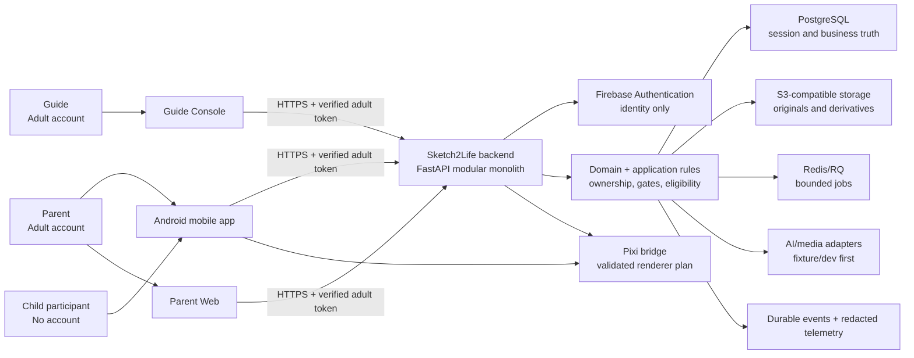
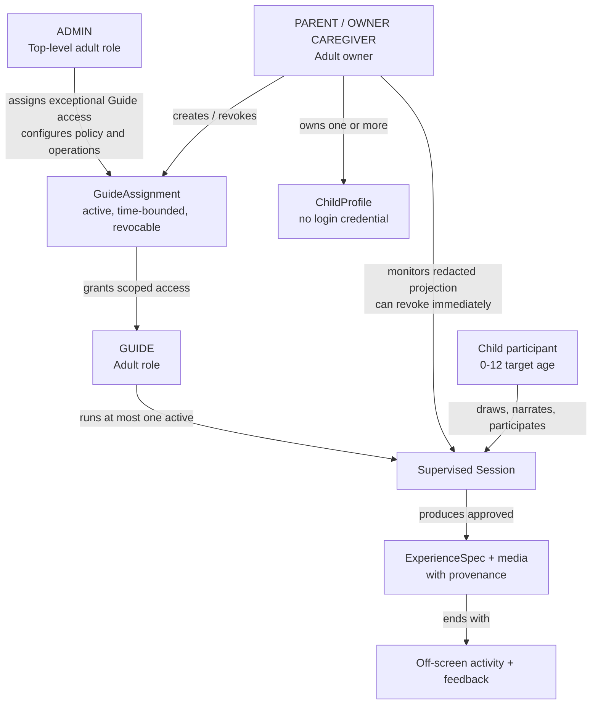

# Capstone Project Report

## Report 1 - Project Introduction

| Field | Value |
|---|---|
| Project name | Sketch2Life |
| Project code | S2L-CAPSTONE |
| Software type | Android mobile application with Parent Web and Guide Console target surfaces |
| Document date | 2026-09-27 |
| Requirements baseline | Sketch2Life Master SRS v1.6 |
| Project phase | Foundation published; product implementation remains gated by feature plans and approvals |
| Academic supervisor | TBD - fill from the official capstone record |

## Record of changes

| Date | Type | In charge | Change description |
|---|---|---|---|
| 2026-09-27 | A | Project owner / Codex reviewer | Created the Markdown project introduction from the current repository, harness/context, SRS v1.6, and supplied Report 1 form. |

`A = Added`, `M = Modified`, `D = Deleted`.

## 1. Project introduction

### 1.1 Project information

Sketch2Life is a capstone software product that turns a child's drawing and narration into a short, personalized learning experience. The experience is reviewed by an adult, uses deterministic Montessori eligibility rules, and ends with a physical activity outside the screen.

The product is designed as one supervised Android mobile experience supported by a backend and two target web surfaces: a responsive Parent Web and a desktop-first Guide Console. Only adult users authenticate. A child participates in a supervised session and does not receive an independent account or credential.

The current repository is a foundation and contract workspace. It already contains the governance harness, clean-architecture boundaries, versioned contracts, validators, fixture-driven workstreams, and an owner-approved target SRS. The complete product workflow is not yet production-implemented.

### 1.2 Project team

The team is represented by the independent Sprint 1 workstreams defined by ADR-0006. Personal names and contact details are not repeated here because they are not authoritative in the current project context.

| Team member | Primary responsibility | Main outputs |
|---|---|---|
| P1 - BA / Montessori | Montessori domain analysis and activity quality | Activity catalog, learning-objective taxonomy, prerequisite/safety/material rules, fixtures, acceptance criteria |
| P2 - AI Understanding | Media validation and multimodal understanding | ASR/VLM/fusion fixture runner, `RawUnderstandingResult` contract, provenance/error cases, benchmark evidence |
| P3 - Art Animation | Original-art animation and renderer boundary | PixiJS/GSAP fixture player, Motion DSL and bridge contract, original-art preservation and fallback evidence |
| P4 - Learning Media | Learning-media resolution and fallback | Cache/resolver fixture runner, learning-media contract, validation/fallback evidence |
| Shared project owner / QA | Governance, review, integration allocation, and acceptance | Feature approvals, architecture/security review, cross-workstream verification, Integration Sprint approval |

## 2. Product background

Children's drawings and explanations contain personal meaning, but a drawing alone is ambiguous. A useful learning experience therefore needs more than image generation: it needs adult confirmation, clear provenance, age/readiness and safety rules, and a reliable handoff from screen time to an activity with real materials.

The current manual or disconnected flow usually requires an adult to interpret the drawing, choose an activity, prepare materials, and remember what happened afterward. It does not provide one traceable path from the original drawing and narration to an approved learning objective, a short digital experience, and an observation record.

Sketch2Life addresses this gap by combining:

- capture of the original drawing and narration;
- editable or repeatable narration when the meaning is unclear;
- multimodal understanding presented as a proposal rather than a fact;
- Human Gate A for meaning confirmation or correction;
- deterministic Montessori filtering before any model-assisted ranking;
- Human Gate B for activity and learning-objective approval;
- original-art exploration and separate learning media;
- an off-screen activity handoff with materials, steps, supervision, and safety;
- feedback, observation, audit, retention, and deletion controls.

The product is intentionally not a generic image generator. The original child media is immutable, every derivative carries provenance, and a media failure must not remove the physical activity path.

## 3. Existing systems and reference points

### 3.1 Current Sketch2Life foundation

The repository provides the current engineering foundation:

- Android React Native and TypeScript application skeleton;
- FastAPI/Python modular-monolith boundary;
- domain/application/infrastructure dependency direction;
- provider-neutral identity and AI ports;
- versioned mobile, backend, renderer, and fixture contracts;
- local PostgreSQL, Redis/RQ, and MinIO infrastructure definitions;
- security, architecture, harness, syntax, type, lint, unit, and contract validators.

The foundation does not yet mean that sign-in, capture, Gate A, Gate B, durable repositories, live providers, or production deployment are complete. Some workstreams are fixture-only or offline by design.

### 3.2 Manual Montessori and family activity flow

The existing non-software process remains an important reference point. An adult observes a child's interest, selects or adapts an activity, prepares materials, supervises execution, and records observations informally. This process is valuable because it keeps the adult and physical environment central, but it can be difficult to trace consistently across sessions and can lose the connection between the child's original idea, the selected objective, and the follow-up observation.

Sketch2Life supports this process rather than replacing adult judgment. The system proposes, validates, records, and guides; the adult confirms meaning and approves the activity.

### 3.3 Related repository workstreams

The four Sprint 1 workstreams are independent reference implementations for later integration:

| Workstream | What it proves | Boundary |
|---|---|---|
| P1 | Montessori rules and deterministic candidate eligibility | Does not own recommendation runtime or Gate B UI |
| P2 | Understanding contracts and multimodal quality cases | Does not own Gate A UI or session orchestration |
| P3 | Original-art preservation and deterministic animation | Does not own the full Android app or capture flow |
| P4 | Learning-media resolution and safe fallback | Does not own backend orchestration, deployment, or E2E |

## 4. Business opportunity

Sketch2Life addresses an opportunity at the intersection of creative learning, adult-guided education, and privacy-aware child technology. The product is attractive when a family or guide wants a short digital experience that begins with the child's own work and leads to a concrete activity rather than ending at passive media consumption.

The opportunity is defined by the problem the product can solve:

1. Adults need help turning an ambiguous drawing and narration into a meaningful learning thread.
2. Activity recommendations need age, readiness, prerequisite, material, supervision, and safety constraints.
3. The adult must be able to correct an AI proposal before it affects the child experience.
4. Original child work should remain visible and traceable instead of being silently replaced by generated content.
5. Parent and guide access must follow explicit ownership and time-bounded assignment relationships.
6. The digital flow should be short and end with an off-screen activity and feedback path.

The product differentiates itself through human approval gates, deterministic Montessori rules, provenance-preserving media, a separate original-art renderer, privacy boundaries, and a physical activity handoff. It is not positioned as a replacement for a Montessori guide, parent, teacher, or legal/privacy review.

## 5. Software product vision

For parents, guides, and children who want a meaningful bridge between creative expression and hands-on learning, Sketch2Life is a supervised learning companion that transforms an original child drawing and narration into an adult-approved, short, personalized learning experience and a practical Montessori activity.

Unlike a generic image or video generator, Sketch2Life preserves the child's source work, makes uncertain understanding visible, applies deterministic safety and eligibility rules, requires adult approval, and keeps the physical activity and observation path as part of the product outcome.

The intended result is a calmer and more traceable workflow: the adult remains responsible for meaning and safety, the child sees a familiar creation explored respectfully, and the family or guide receives a concrete next activity instead of an isolated screen output.

## 6. Project scope and limitations

### 6.1 Major features

| ID | Feature | Description | Target status |
|---|---|---|---|
| FE-01 | Adult identity and access | Firebase Authentication for adult identities; backend-owned role, ownership, assignment, and authorization decisions. | Accepted architecture / target |
| FE-02 | Child profile and consent context | Owner-managed ChildProfile with age, readiness, context, consent references, and retention choice. | Target requirement |
| FE-03 | Guided capture | Capture original drawing and narration, validate media, and allow narration edit or re-record when unclear. | Target requirement |
| FE-04 | Multimodal understanding | Produce versioned ASR, vision, and fusion proposals with uncertainty, conflict, and provenance. | Fixture/contract workstreams; target workflow |
| FE-05 | Human Gate A | Adult confirms, corrects, or requests recapture before meaning is used downstream. | Target requirement |
| FE-06 | Montessori recommendation | Apply hard safety, age, readiness, prerequisite, material, and supervision filters before ranking. | P1 fixtures/domain evidence; target workflow |
| FE-07 | Human Gate B | Adult approves activity, learning objective, and relevant versioned template/experience context. | Target requirement |
| FE-08 | Personalized Drawing Exploration | PixiJS/GSAP exploration, tap-to-discover, and source-derived 2.5D/parallax behavior using the original artwork. | Renderer boundary/fixtures; target workflow |
| FE-09 | Narrated story | Create a short story from approved meaning and learning thread with safety validation. | Target requirement; provider details open |
| FE-10 | Whiteboard learning video | Independent post-Gate-B video path using localization, segmentation, contour/stroke extraction, deterministic rendering, TTS, and validation. | Target requirement; current artifact is session/process-local |
| FE-11 | Off-screen activity bridge | Provide materials, substitutes, setup, steps, supervision, safety, and observation criteria. | Domain/catalog target |
| FE-12 | Feedback and history | Record completed/partial/not attempted outcomes, interest, independence, observation, and feedback. | Target requirement |
| FE-13 | Parent Web and Guide Console | Parent management/monitoring/history surface and assigned-child Guide Console using the same backend authorization. | Required target surfaces; not current production implementation |
| FE-14 | Privacy and operations | Retention/archive/deletion workflow, durable business events, audit history, redacted telemetry, rate limits, idempotency, and concurrency guards. | Target requirement / governance constraint |

### 6.2 Limitations and exclusions

| ID | Limitation or exclusion |
|---|---|
| LI-01 | The child does not have an independent account, login, role, credential, or client-authoritative permission. |
| LI-02 | Firebase is authentication-only. Firebase Storage, Firestore, and Realtime Database are forbidden. |
| LI-03 | Mobile never calls S3-compatible storage, PostgreSQL, Redis/RQ, Lightning, Runpod, or other AI providers directly. |
| LI-04 | Development and current test work use synthetic fixtures, fake/local adapters, or offline evidence. Real child data is not permitted in the repository workflow. |
| LI-05 | The target SRS does not claim that every target feature is already implemented. Foundation, fixture-only, accepted-architecture, planned, and open states remain separate. |
| LI-06 | Exact production model profiles, provider execution, cloud topology, region, SLO/RPO/RTO, and capacity thresholds remain evidence-gated or `OPEN_TBD`. |
| LI-07 | Parent Web manages and monitors the target workflow but is not implicitly a session runner unless a separate command decision is approved. |
| LI-08 | Whiteboard MP4 is currently session/process-local in the target sequence; durable storage and authentication details remain future work. |
| LI-09 | Admin raw-content access is break-glass, reason-required, and audited; detailed dual approval, notice, and time-window policy remains open. |
| LI-10 | This report does not authorize runtime implementation, provider calls, deployment, release, or contract migration. |

## 7. Traceability and source notes

This report is derived from:

- `docs/context/PROJECT_CONTEXT.md` and `docs/context/SOURCE_REGISTER.md`;
- `docs/SYSTEM_BASELINE.md` and `docs/CURRENT_SYSTEM_STATE.md`;
- `features/FEAT-029-master-srs/artifacts/Sketch2Life_Master_SRS.md` v1.6;
- ADR-0006 and the four Sprint 1 feature allocations;
- the supplied Report 1 DOCX form and the project owner's direct request.

The supplied form contributes structure and writing prompts. Current Sketch2Life facts and target requirements come from the repository and SRS. The distinction is recorded in `features/FEAT-031-academic-reports-markdown/evidence/notes/SOURCE_BOUNDARY.md`.

## 8. Stakeholder analysis

Sketch2Life has different stakeholders with different levels of authority. The product must not treat the person using a screen, the person supervising the child, and the system administrator as interchangeable users.

| Stakeholder | Primary needs | Authority and responsibility | Success signal |
|---|---|---|---|
| Child participant | A short, understandable, respectful experience based on the child's own idea; a concrete activity to do next. | Participates under adult supervision; has no independent account or authorization authority. | Child can engage with the experience and transition to the physical activity without unsafe or confusing content. |
| Parent / Owner Caregiver | Manage children, consent and retention; confirm meaning; approve activity; supervise; revoke Guide access; review history and feedback. | Sole owner of each ChildProfile; may manage multiple ChildProfiles and revoke active Guide access. | Parent can understand why a proposal was made and can stop or correct the workflow. |
| Guide | Run a supervised session for assigned children; review Montessori mapping; record observation and feedback. | Adult account with active, time-bounded GuideAssignment; cannot access outside the assignment scope. | Guide can complete a session and record useful observations without bypassing hard safety rules. |
| Admin | Manage adult roles, assignments, policy, jobs, retention/deletion and operational health. | Highest adult role; raw child-content access is exceptional, reason-required, temporary, and audited. | Admin actions are least-privilege, reviewable, and absent from ordinary child-facing telemetry. |
| Project owner / reviewer | Confirm scope, approve plans, resolve TBDs, review evidence, and accept/reject milestones. | Governance authority for this project; approval is specific to a plan revision and scope. | No unapproved implementation is treated as accepted, and evidence is attributable. |
| QA / academic reviewer | Check requirements coverage, defects, traceability, diagrams, documentation quality, and reproducibility. | Review authority; does not silently redefine owner decisions. | Reports and implementation evidence can be checked from explicit sources. |

## 9. Problem-to-solution traceability

| Problem ID | Problem in the current/manual flow | Sketch2Life response | Related target features | Verification direction |
|---|---|---|---|---|
| PB-01 | A drawing and a child's explanation can be ambiguous. | Multimodal proposal with uncertainty, conflict, provenance, editable narration, and Gate A. | FE-03, FE-04, FE-05 | Test unclear, conflicting, recapture, and corrected-meaning cases. |
| PB-02 | Activity choices can ignore age, readiness, prerequisite, material, supervision, or safety constraints. | Deterministic hard filters before ranking and adult Gate B approval. | FE-06, FE-07 | Positive/negative fixture matrix and rejected-candidate reasons. |
| PB-03 | Generated media can replace or obscure the child's original work. | Immutable originals, source hashes, derived artifacts, and a dedicated original-art renderer. | FE-08, FE-10, FE-14 | Preservation and provenance checks. |
| PB-04 | Screen content can become an endpoint instead of a bridge to learning. | Short digital flow followed by materials, steps, supervision, safety, observation, and feedback. | FE-11, FE-12 | Handoff acceptance scenario and activity completion/feedback cases. |
| PB-05 | Parent and Guide access can become unclear or too broad. | Backend-owned ownership and active GuideAssignment with immediate revoke and scoped projection. | FE-01, FE-02, FE-13, FE-14 | Role/resource matrix, expiry, revoke, and minimal projection tests. |
| PB-06 | Technical failures can be hidden or presented as success. | Typed failure, retry/fallback, non-publishable stale results, and evidence-backed job status. | FE-04, FE-10, FE-14 | Failure, retry, idempotency, stale-completion, and no-fake-success tests. |

## 10. Target user journey

| Journey stage | Adult experience | Child experience | System responsibility | Exit condition |
|---|---|---|---|---|
| 1. Prepare | Sign in, choose a ChildProfile, confirm consent/context/retention. | Waits for supervised session. | Verify adult identity and relationship; create versioned session. | Authorized session exists. |
| 2. Capture | Help capture drawing and narration; edit or record again if unclear. | Draws and explains the drawing. | Validate media and preserve immutable originals. | Valid source artifacts exist. |
| 3. Understand | Review a proposal and correct meaning if needed. | May answer/re-record with adult support. | Combine ASR/vision/fusion without treating model output as truth. | Gate A approved. |
| 4. Select activity | Review candidates and reasons; reject or approve an activity/objective. | Waits for the adult decision. | Apply hard rules, version candidates, and enforce Gate B. | ExperienceSpec is approved. |
| 5. Explore | Observe or supervise the short digital experience. | Explores the original drawing, hears the story, and may view validated learning media. | Keep Pixi exploration separate from whiteboard video; retain provenance and job status. | Digital experience is ready or has a safe retryable fallback. |
| 6. Handoff | Prepare materials and supervise the physical activity. | Performs the off-screen Montessori activity. | Provide materials, substitutes, steps, supervision, safety, and observation criteria. | Handoff is shown; activity path remains available even after media failure. |
| 7. Reflect | Record completed/partial/not attempted, interest, independence, and feedback. | Participates as appropriate. | Persist authorized observation, feedback, business events, and audit. | Feedback is recorded or safely deferred. |

## 11. Product principles

1. Adult judgment is a product feature, not an exception path.
2. Original child work is preserved; every derivative is attributable.
3. Safety, readiness, prerequisites, materials, and supervision are deterministic constraints.
4. A provider or model is a replaceable adapter, not a source of domain truth.
5. The digital experience is intentionally short and ends with physical activity.
6. Access follows ownership and assignment relationships, not client navigation state.
7. Failure is explicit and recoverable; the system never fakes successful media readiness.
8. Privacy, retention, deletion, audit, and redacted observability are part of the product boundary.

## 12. Success criteria for the project introduction

The project introduction is complete when a reader can answer all of these questions without opening a source-code file:

- What problem does Sketch2Life solve, and why is adult supervision necessary?
- Who are the child, Parent, Guide, Admin, owner, and reviewer actors?
- What is the difference between the target product and the current foundation/fixtures?
- What are the product's major features, exclusions, trust boundaries, and non-negotiable invariants?
- How does the workflow move from original drawing to Gate A, Gate B, digital experience, physical activity, and feedback?
- Which choices are accepted, which are open, and which are explicitly outside scope?

## 13. Diagrams for the report

The following diagrams are embedded as Mermaid so they can be rendered directly in a Markdown viewer or exported to SVG/PNG for a Word report. Reusable source files are stored in `artifacts/diagrams/`.

### Figure 1. Target experience workflow

This diagram shows the required sequence and the two human approval gates. In particular, the rejection loops return to correction/re-capture or candidate review rather than silently continuing.

```mermaid
flowchart LR
    A["Adult sign-in"] --> B["Create supervised session"]
    B --> C["Capture drawing and narration"]
    C --> D["Validate media and create immutable originals"]
    D --> E["ASR + vision + fusion proposal"]
    E --> F{"Gate A<br/>Adult confirms meaning?"}
    F -- "No: correct / recapture" --> C
    F -- "Yes" --> G["Deterministic Montessori filters"]
    G --> H["Candidate ranking with reasons"]
    H --> I{"Gate B<br/>Adult approves activity + objective?"}
    I -- "No: revise" --> H
    I -- "Yes" --> J["Compile ExperienceSpec"]
    J --> K["Pixi original-art exploration"]
    J --> L["Learning story and whiteboard video jobs"]
    K --> M["Ready experience"]
    L --> M
    M --> N["Off-screen Montessori handoff"]
    N --> O["Observation and feedback"]
```

### Figure 2. System context and trust boundaries

This diagram separates adult-facing clients, the backend authority, provider/storage boundaries, and the child participant. It makes clear that mobile and web surfaces call the backend, not the database, object storage, queue, or AI provider directly.

### Figure 3. Actor and relationship model

This diagram emphasizes that the ChildProfile is owned by one adult owner, Guide access is delegated through an assignment, and the child is a supervised participant rather than a credentialed role.

## 14. Open decisions carried forward

The following items are deliberately not filled in by this report: exact notification channels and retry policy; Guide access to raw media/transcript/history; whether Parent Web can open a session; break-glass dual approval, notice, and time window; legal-guardian verification; consent handling for children from age seven; backup/provider-copy deletion; production SLO/RPO/RTO; account lifecycle/MFA/recovery; provider/model versions; whiteboard codec and quality thresholds; and physical deployment details.
