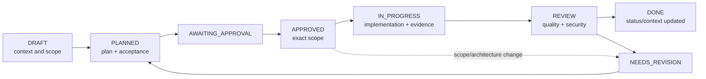
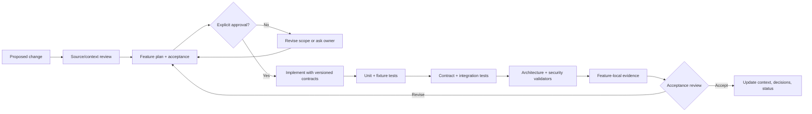
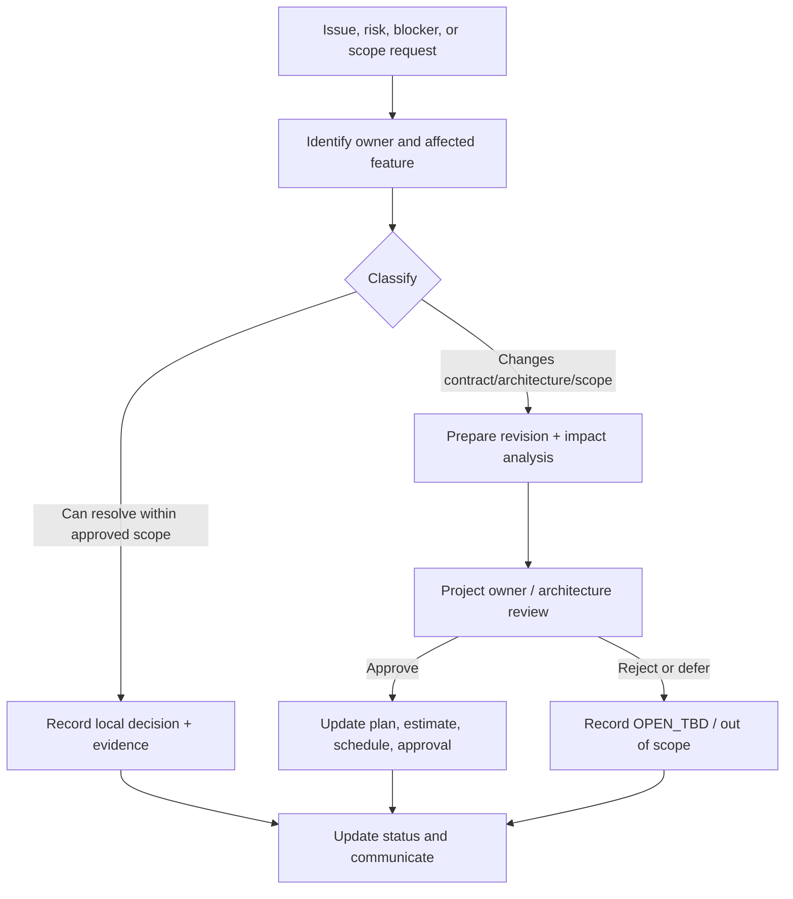
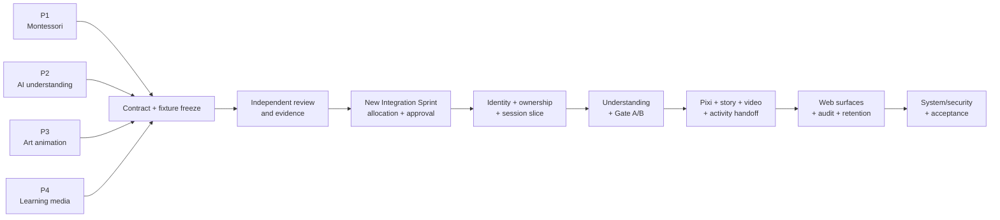
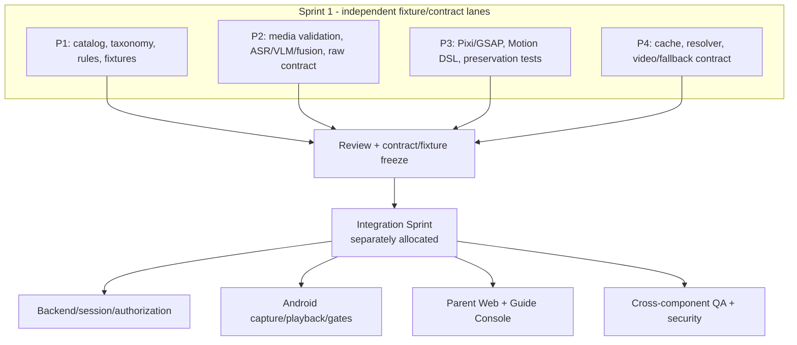

# Capstone Project Report

## Report 2 - Project Management Plan

| Field | Value |
|---|---|
| Project | Sketch2Life |
| Planning baseline | 15 relative weeks, 240 person-days |
| Requirements baseline | Sketch2Life Master SRS v1.6 |
| Delivery model | Harness-gated documentation, parallel fixture/contract Sprint 1, then separately approved Integration Sprint |
| Date | 2026-09-27 |
| Academic supervisor | TBD - fill from the official capstone record |

## Record of changes

| Date | Type | In charge | Change description |
|---|---|---|---|
| 2026-09-27 | A | Project owner / Codex reviewer | Created the Markdown project management plan from the current Sketch2Life project and supplied Report 2 form. |

`A = Added`, `M = Modified`, `D = Deleted`.

## 1. Overview

### 1.1 Scope and estimation

The estimate below is a planning baseline for the target capstone scope. It covers analysis, design, implementation, test, integration, documentation, and review for a four-person team. It is not evidence that the work is complete, and it is not a production capacity or cost commitment.

One person-day means one contributor working for one normal project day. The schedule is relative because the current project context does not contain an approved calendar start date.

| # | Work package / software function | Complexity | Estimated effort (person-days) |
|---:|---|---|---:|
| 1 | Governance, context, architecture baseline, feature approval, and evidence setup | Simple | 6 |
| 2 | Adult authentication, role exclusivity, ownership, and Guide assignment | Complex | 18 |
| 3 | ChildProfile, consent references, readiness/context, and retention preference | Medium | 10 |
| 4 | Session state machine, versioning, idempotency, stale completion, and revoke | Complex | 16 |
| 5 | Drawing/audio capture, media validation, edit, and re-record workflow | Medium | 12 |
| 6 | ASR, vision, fusion, uncertainty, provenance, and Gate A | Complex | 20 |
| 7 | Montessori catalog, hard filters, candidate reasons, and Gate B | Complex | 20 |
| 8 | Story planning, narration track, and content safety boundary | Medium | 10 |
| 9 | PixiJS/GSAP original-art exploration and renderer bridge | Complex | 18 |
| 10 | Whiteboard localization, segmentation, stroke extraction, TTS, MP4, and validation | Complex | 22 |
| 11 | Off-screen activity handoff, material substitutions, and observation criteria | Medium | 10 |
| 12 | Parent Web management, live projection, history, retention, and feedback | Complex | 16 |
| 13 | Guide Console assignment scope, sessions, Gate A/B, observation, and feedback | Complex | 16 |
| 14 | Admin operations, redacted monitoring, audit, rate limits, and lifecycle operations | Medium | 10 |
| 15 | Archive/deletion workflow, evidence, retry, and audit behavior | Medium | 8 |
| 16 | Integration, verification, security review, acceptance, and final documentation | Complex | 28 |
|  | **Total estimated effort** |  | **240** |

Planned effort distribution by activity:

| Activity | Person-days | Share |
|---|---:|---:|
| Requirements, domain analysis, and context | 32 | 13.3% |
| Architecture, contracts, and design | 32 | 13.3% |
| Implementation and fixture runners | 108 | 45.0% |
| Unit, contract, integration, system, and acceptance testing | 44 | 18.3% |
| Project management, reviews, evidence, and reporting | 24 | 10.0% |
| **Total** | **240** | **100%** |

### 1.2 Project objectives

The project objective is to produce a verifiable Sketch2Life foundation and a reviewed implementation path for an adult-supervised, privacy-aware learning experience. The team will keep independent workstreams runnable through fixtures and versioned contracts, and will integrate only after a new allocation and approval are recorded.

Planning targets:

| Area | Target | Verification |
|---|---|---|
| Scope traceability | 100% of mandatory target requirements map to a report/SRS item, contract or domain rule, and a verification method. | Traceability review against SRS v1.6 and feature evidence. |
| Safety and authorization | 100% of mandatory negative cases for ownership, assignment, role, age/readiness, prerequisite, material, supervision, and safety rules are represented in fixtures/tests before acceptance. | Contract/domain tests and review evidence. |
| Quality gates | Harness, architecture, team-allocation, and repository-security validators pass before review handoff. | Validator outputs stored in feature-local evidence. |
| Schedule | At least 90% of approved milestones finish in their planned relative week, or a dated re-baseline is recorded. | Schedule and change log review. |
| Security | Zero committed secrets, service-account files, seed credentials, or real child data. | `validate_repository_security.py` and manual review. |
| Evidence | Every completed feature records command/input, environment, output, timestamp, interpretation, and limitation. | Feature evidence index review. |
| Cost/effort | Keep total delivery planning baseline at 240 person-days with variance explained at each phase gate. | Effort log and milestone review. |

These are project management targets, not claims that the current repository already satisfies the complete product scope.

### 1.3 Project risks

| # | Risk description | Impact | Possibility | Response plan |
|---:|---|---|---|---|
| 1 | The target SRS is mistaken for implemented behavior. | High | Medium | Label `CURRENT_IMPLEMENTED`, `FIXTURE_ONLY`, `ACCEPTED_ARCH`, `OPEN_TBD`, and target requirements in every plan and review. |
| 2 | Sprint 1 workstreams become coupled through an unapproved integration task. | High | Medium | Keep P1-P4 fixture/contract-driven and independent; create a separately approved Integration Sprint allocation. |
| 3 | AI output is treated as domain truth or bypasses adult gates. | High | Medium | Validate provider/model output at the boundary, preserve provenance, and enforce Gate A/Gate B and deterministic hard rules. |
| 4 | Original child media is replaced or provenance is lost. | High | Low/medium | Store originals as immutable source artifacts; require source IDs, versions, hashes, actor/reason, and timestamps for derivatives. |
| 5 | Privacy or secret-handling failure exposes child data or credentials. | Critical | Low/medium | Synthetic fixtures only, backend-only provider access, Firebase Authentication-only boundary, redacted telemetry, security scan before publication. |
| 6 | Scope grows beyond a four-person capstone. | High | Medium | Use SRS scope closure, feature approvals, explicit non-goals, and re-baselining for new requirements. |
| 7 | Provider/model readiness is unavailable or too expensive. | Medium/high | Medium | Use fixture/fake/local adapters first; defer live Lightning/Runpod execution and production benchmarks behind evidence gates. |
| 8 | Stale async work mutates a newer session or publishes invalid media. | High | Medium | Use expected session version, idempotency keys, typed job state, stale completion rejection, and non-publishable results after revoke. |
| 9 | Academic submission dates conflict with technical dependencies. | Medium | Medium | Deliver documentation milestones separately, maintain a relative schedule, and record approved changes rather than silently moving dates. |
| 10 | Missing owner decisions block schema or operational policy. | Medium/high | Medium | Keep unresolved items explicitly `OPEN_TBD`; do not invent notification, legal, SLO, provider, or break-glass details. |

## 2. Management approach

### 2.1 Project process

Sketch2Life uses a harness-gated iterative process with parallel discovery and contract work followed by a separately approved integration phase.

```mermaid
flowchart LR
    A["Context and source review"] --> B["Feature plan and acceptance criteria"]
    B --> C["Explicit task approval"]
    C --> D["Parallel Sprint 1 fixture and contract work"]
    D --> E["Independent review and evidence"]
    E --> F["Integration allocation and approval"]
    F --> G["Incremental backend/mobile/web integration"]
    G --> H["Verification, security, and acceptance"]
    H --> I["Review and DONE status"]
```



Process rules:

1. Read governance, context, source register, and relevant feature records before proposing a change.
2. Create or update the feature folder with context, plan, acceptance criteria, decisions, approval, and evidence location.
3. Do not implement while a feature is `DRAFT`, `PLANNED`, or `AWAITING_APPROVAL`.
4. Sprint 1 has four independent workstreams: Montessori, AI understanding, art animation, and learning media.
5. Integration is a new planning view and needs its own allocation and approval; it is not silently assigned to Person 3 or Person 4.
6. Preserve source artifacts and provenance. Derived artifacts do not replace originals.
7. Update context, decisions, status, and evidence after each meaningful implementation or review step.

### 2.2 Quality management

Quality is managed as a set of prevention and verification gates rather than a final testing activity only.

| Stage | Approach | Exit evidence |
|---|---|---|
| Defect prevention | Versioned contracts, clean dependency direction, explicit invariants, synthetic fixtures, security boundaries, and owner-approved scope. | Plan/ADR/context review and validator output. |
| Reviewing | Peer review of requirements, decisions, source/status labels, contract shapes, risks, and feature-local evidence. | Review note, decisions update, or approval record. |
| Unit testing | Test domain rules, state transitions, version semantics, validation, authorization policy, media limits, and deterministic render plans in isolation. | Passing unit test output and fixture manifest. |
| Integration testing | Test HTTP/contract boundaries, repositories/adapters, queue/job status, event/audit behavior, and client/backend version exchange with synthetic data. | Contract/integration test report. |
| System testing | Exercise the supervised flow from adult sign-in through capture, gates, experience, off-screen handoff, feedback, retention, and failure paths. | System scenario matrix and reproducible run. |
| Acceptance testing | Review owner-approved SRS acceptance scenarios, including revoke, minimal Parent projection, no child credential, provenance mismatch, rate limit, idempotency, and no fake video success. | Acceptance checklist and owner decision. |
| Security review | Scan for secrets and forbidden Firebase/data access; check redaction, authorization, retention, deletion, and break-glass audit behavior. | Security validator output and evidence. |

Defect tracking baseline:

| # | Testing stage | Test coverage target | Defect metric | Notes |
|---:|---|---|---|---|
| 1 | Reviewing | All changed requirements, plans, contracts, and source boundaries | 100% of material changes reviewed | Review before implementation or handoff. |
| 2 | Unit test | Domain rules, validators, state, and adapters | No open critical defects | Negative cases are mandatory. |
| 3 | Integration test | Versioned client/backend/worker boundaries | No unresolved blocker defects | Use fixtures and fake/local adapters first. |
| 4 | System test | End-to-end target scenarios | All failed scenarios triaged | Do not infer production readiness from fixture success. |
| 5 | Acceptance test | Owner-approved SRS acceptance scenarios | All acceptance blockers closed or explicitly accepted | Record limitations and remaining TBDs. |

### 2.3 Training plan

| Training area | Participants | When and duration | Waiver criteria |
|---|---|---|---|
| Repository harness, feature lifecycle, and evidence | All | Week 1, 0.5 day | None; mandatory for contribution. |
| Clean architecture, contracts, and version semantics | All | Week 1-2, 1 day | Existing review evidence of equivalent experience. |
| Montessori domain, safety, readiness, and hard filters | P1, P2, P4, QA | Week 2, 1 day | P1 still reviews final domain acceptance. |
| React Native Android, Pixi bridge, and fixture player | P3, mobile contributors, QA | Week 2, 1.5 days | Verified protocol test contribution. |
| FastAPI/Python, PostgreSQL, Redis/RQ, MinIO boundaries | Backend/integration contributors, P2, P4 | Week 3, 1.5 days | Passing architecture-boundary review. |
| Firebase Authentication and authorization/privacy | All integration contributors | Week 3, 0.5 day | Security owner sign-off. |
| Test design, synthetic fixtures, security scan, and redaction | All | Throughout, review clinics | None for release review. |

## 3. Project deliverables

The dates are relative milestones from the approved planning start and must be converted to calendar dates only after the owner confirms a start date.

| # | Deliverable | Planned point | Owner | Notes |
|---:|---|---|---|---|
| 1 | Report 1 - Project Introduction Markdown | Week 1 | Shared / project owner review | Generated in FEAT-031. |
| 2 | Report 2 - Project Management Plan Markdown | Week 1 | Shared / project owner review | Includes estimate, risks, governance, quality, and responsibilities. |
| 3 | Adapted Project Schedule Markdown | Week 1 | Shared / project owner review | Relative schedule; no invented calendar start date. |
| 4 | Current-system and master-SRS baseline | Week 1 | Project owner / Codex reviewer | Existing SRS v1.6 remains requirements baseline, not runtime authorization. |
| 5 | P1 independent Montessori contract and fixture pack | Week 5 | P1 | Catalog/rule outputs and deterministic expected results. |
| 6 | P2 independent understanding contract and fixture runner | Week 5 | P2 | ASR/VLM/fusion/provenance/error cases. |
| 7 | P3 independent art-animation player and bridge contract | Week 5 | P3 | Original-art preservation, motion, and fallback evidence. |
| 8 | P4 independent learning-media resolver and fallback contract | Week 5 | P4 | Cache/validation/fallback evidence. |
| 9 | Integration Sprint plan and allocation approval | Week 6 | Project owner / all | New approval required before runtime integration. |
| 10 | Integrated test vertical slice | Week 10 | Integration allocation | Adult auth, ChildProfile, session, and basic capture with synthetic data. |
| 11 | Gate A/B and activity-handoff slice | Week 12 | Integration allocation | Deterministic rules, approvals, media failure fallback, feedback. |
| 12 | Parent Web, Guide Console, observability, retention slice | Week 13 | Integration allocation | Role/relationship scope, minimal projection, audit, lifecycle. |
| 13 | System/security/acceptance evidence pack | Week 14 | Shared QA | SRS acceptance scenarios and repository security scan. |
| 14 | Final capstone package and review record | Week 15 | Shared | Reports, evidence index, open decisions, and handoff notes. |

## 4. Responsibility assignments

`D = Do`, `R = Review`, `S = Support`, `I = Informed`, blank = omitted.

| Responsibility / output | Project owner | P1 | P2 | P3 | P4 | Shared QA |
|---|---|---|---|---|---|---|
| Project planning and tracking | D | S | S | S | S | R |
| Report 1 - Project Introduction | R | S | S | S | S | D |
| Report 2 - Project Management Plan | R | S | S | S | S | D |
| Project schedule and re-baselining | D | S | S | S | S | R |
| Current context and source register | D | I | I | I | I | R |
| Master SRS traceability | R | D | S | S | S | R |
| P1 Montessori catalog and rules | R | D | S | I | S | R |
| P2 AI understanding fixtures and contract | R | S | D | I | S | R |
| P3 art-animation fixture player and bridge | R | I | S | D | I | R |
| P4 learning-media resolver and fallback | R | I | S | I | D | R |
| Integration Sprint allocation | D | S | S | S | S | R |
| Auth, ownership, assignment, and session integration | D | S | S | S | S | R |
| Gate A, recommendation, and Gate B integration | R | D | D | S | S | R |
| Parent Web and Guide Console target verification | D | S | S | S | S | R |
| Security, privacy, retention, and redacted telemetry | D | S | S | S | S | R |
| System acceptance and final handoff | D | S | S | S | S | R |

## 5. Project communications

| Communication item | Target | Purpose | Frequency | Tool/method |
|---|---|---|---|---|
| Workstream check-in | P1-P4 and project owner | Surface blockers, contract drift, fixture readiness, and evidence gaps. | Weekly during Sprint 1 | Task update and short written summary. |
| Architecture/security review | All contributors and reviewer | Confirm dependency direction, secrets boundary, Firebase-only Auth, storage, and provider rules. | At plan approval and each integration gate | Repository review, validator output, decision record. |
| Contract review | Relevant workstream owners | Compare schema/version/provenance/error semantics and avoid same-name shape collisions. | At each contract freeze | Markdown contract review and fixture diff. |
| Integration planning meeting | Project owner and new integration allocation | Approve ownership, sequencing, dependencies, and acceptance evidence. | Week 6 gate | Approved plan and task record. |
| Risk and schedule review | All | Review estimate variance, blockers, open TBDs, and milestone changes. | Weekly | Schedule table and risk log. |
| Acceptance review | Project owner / QA | Decide pass, revise, or explicitly accept a limitation. | Weeks 14-15 | Acceptance matrix and evidence index. |

## 6. Configuration management

### 6.1 Document management

- Markdown is the canonical editable format for the generated report artifacts and project records.
- Every feature has its own context, plan, approval, decision, evidence, and status records.
- Use explicit revision numbers and dates for plans and approvals. Changes to scope or architecture invalidate the prior approval and require a new revision.
- Keep source/reference originals local and preserve their provenance. Do not publish external handbook/workbook originals or rendered extracts.
- Store evidence in the owning feature's `evidence/` directory, not in a shared dump.
- Separate target requirements from current implementation, fixture-only evidence, open decisions, and historical evidence.

### 6.2 Source code management

- Use Git branches with the repository's `codex/` prefix for new agent-created branches unless the owner specifies otherwise.
- Keep domain rules independent from frameworks, providers, storage, queues, and UI.
- Dependencies point inward: interfaces/adapters to application to domain; infrastructure implements ports.
- Cross-feature behavior travels through versioned contracts, not hidden state or direct database coupling.
- Do not commit `.env`, credentials, service-account files, signing keys, seed accounts, provider tokens, or real child data.
- Run the repository security validator before every commit or push.
- Preserve unrelated existing worktree changes. Do not use destructive reset or checkout operations as part of ordinary work.

### 6.3 Tools and infrastructure

| Category | Current project baseline |
|---|---|
| Mobile | React Native 0.87, TypeScript, Android-only, application ID `com.sketch2life.mobile` |
| Backend | Python 3.12, FastAPI, Pydantic, modular monolith, clean architecture |
| Web target | React/TypeScript Guide Console and responsive Parent Web |
| Database | PostgreSQL through backend-owned ports; no Firebase database products |
| Object storage | S3-compatible storage/MinIO local through backend adapters |
| Queue | Redis/RQ boundary for jobs and notification/outbox work |
| Authentication | Firebase Authentication only; backend verifies adult ID tokens |
| AI development | Fixtures/fake/local adapters at current test stage; Lightning/Runpod remain gated |
| Original-art renderer | PixiJS and GSAP behind a narrow validated bridge |
| Video target | Localization, SAM 2.1 Hiera Small baseline, contour/stroke extraction, deterministic renderer, TTS, FFmpeg/NVENC; details remain gate/TBD where noted in SRS |
| Validation | Harness, skeleton, architecture, team-allocation, security, TypeScript, Jest, Ruff, Mypy, Pytest, and contract checks as applicable |
| Documentation | Markdown in repository; supplied DOCX/PDF retained as local references only |
| Project management | Feature plans, approvals, evidence, decisions, relative schedule, and review records |

## 7. Planning assumptions and open decisions

This management plan assumes a 15-week relative schedule and 240 person-days. The following remain open and must not be silently invented: exact notification channels/retry matrix, Guide raw-media permissions, Parent Web session-creation command, break-glass dual approval/notice/time window, physical deployment, guardian verification, child consent handling from age seven, backup/provider-copy deletion, production SLO/RPO/RTO, account lifecycle/MFA/recovery, video codec/size/timeout thresholds, TTS provider/voice, and mask/stroke quality thresholds.

The master SRS v1.6 and current repository are the authority for scope/status. This report is a planning artifact and does not authorize implementation beyond an approved feature plan.

## 8. Detailed planning baseline

### 8.1 Estimation assumptions

The 240 person-day estimate is based on the following assumptions:

- four primary contributors are available throughout the relative schedule, with shared project-owner and QA review;
- Sprint 1 workstreams can progress independently using synthetic fixtures and versioned contracts;
- the first integration slice uses local/test infrastructure and fake or deterministic adapters;
- no live Lightning/Runpod benchmark, cloud deployment, Play Store release, production data migration, or real-child data collection is included in this baseline;
- each stage includes review/evidence work rather than treating documentation as zero-effort;
- unresolved SRS `OPEN_TBD` items are tracked as decision work and are not silently converted into implementation commitments.

The estimate should be re-baselined if any of the following changes: target surfaces, adult role model, retention policy, provider execution, production deployment, media quality thresholds, legal/research protocol, or Integration Sprint ownership.

### 8.2 Work breakdown structure

```text
1. Governance and baseline
   1.1 Context/source review
   1.2 Report 1, Report 2, and schedule
   1.3 Plan, approval, evidence, and status records
2. Independent Sprint 1 workstreams
   2.1 P1 Montessori catalog and hard-rule fixtures
   2.2 P2 ASR/VLM/fusion and understanding contracts
   2.3 P3 original-art renderer and bridge player
   2.4 P4 learning-media resolver and fallback
3. Integration Sprint
   3.1 Adult authentication and authorization
   3.2 OwnerCaregiver, ChildProfile, GuideAssignment
   3.3 Session state, jobs, idempotency, and revoke
   3.4 Capture, Gate A, recommendation, and Gate B
   3.5 Story, Pixi, whiteboard video, handoff, feedback
   3.6 Parent Web, Guide Console, Admin/operations
4. Verification and transition
   4.1 Unit/contract/integration/system/acceptance tests
   4.2 Security, privacy, retention, and observability review
   4.3 Defect triage and evidence completion
   4.4 Final reports, handoff, and status closure
```

### 8.3 Effort by stage

| Stage | Main effort | Person-days | Review gate |
|---|---|---:|---|
| 1. Foundation and reports | Context, source boundary, report package, planning records | 18 | FEAT-031 review |
| 2. Requirements and contracts | SRS traceability, contract families, fixture freeze | 14 | Sprint 1 readiness |
| 3. Sprint 1 workstreams | P1-P4 independent fixture/contract deliverables | 72 | Independent workstream review |
| 4. Integration planning | Ownership, sequencing, acceptance, approval | 10 | Integration allocation approval |
| 5. Identity/session slice | Auth, relationships, session, capture metadata | 34 | Vertical-slice gate |
| 6. Understanding and gates | Gate A, rules, candidates, Gate B | 32 | Gate review |
| 7. Experience/handoff | Story, Pixi, whiteboard, physical handoff, feedback | 34 | Media/handoff gate |
| 8. Surfaces/lifecycle | Parent Web, Guide Console, monitoring, audit, retention | 14 | Operational-surface gate |
| 9. Verification/stabilization | Test layers, security, defects, acceptance rehearsal | 8 | Verification gate |
| 10. Transition | Evidence, handoff, final report and presentation package | 4 | Final review |
| **Total** |  | **240** |  |

## 9. Governance and control detail

### 9.1 Harness-gated lifecycle

The lifecycle below is applied to every feature or materially independent work package. A plan that has only been written is not implementation evidence.



### 9.2 Quality and evidence gate



### 9.3 Change-control rules

| Change class | Example | Required action | Approval impact |
|---|---|---|---|
| Editorial | Wording, typo, table alignment, diagram label that does not change meaning | Update the artifact and record change log | Existing approval may remain valid if scope is unchanged. |
| Requirement clarification | More precise acceptance wording or status label | Update SRS traceability, decision/evidence note, and affected report | Owner/reviewer acknowledgement required. |
| Scope change | Add a new surface, actor, data class, or major capability | Create plan revision, update estimate/schedule/risk, obtain approval | Invalidates approval for affected plan revision. |
| Architecture change | Change Firebase boundary, provider, storage, queue, or dependency direction | Create/update ADR and feature plan; perform architecture/security review | Requires explicit architecture approval before implementation. |
| Integration allocation change | Move backend, full Android, or E2E ownership between people | Update Integration Sprint allocation and responsibility matrix | Separate approval required; Sprint 1 approval is insufficient. |
| Production-readiness change | Use live provider, real child data, cloud deployment, release signing | Add security/privacy/operational plan and evidence | Not included in this report baseline. |

### 9.4 Decision and escalation path



## 10. Deliverable acceptance matrix

| Deliverable class | Minimum acceptance evidence | Reviewer | Failure response |
|---|---|---|---|
| Documentation report | Section coverage, source traceability, status labels, diagrams, spelling/consistency review | Project owner / QA | Revise report and record change. |
| Domain/fixture workstream | Versioned contract, positive/negative fixtures, deterministic expected results, standalone runner | Relevant workstream reviewer + QA | Return to workstream plan; no integration dependency added. |
| Backend/mobile/web slice | Contract tests, authorization checks, state/version tests, synthetic end-to-end evidence | Integration reviewer + QA | Block next gate; update risk and defect record. |
| Media pipeline | Provenance, validation, failure/retry/fallback, no-fake-success evidence | P2/P3/P4 + QA | Keep output non-publishable; retry or safe fallback. |
| Security/privacy | Validator output, redaction review, no forbidden data/credentials, retention/deletion behavior | Project owner + QA | Block review/commit until fixed. |
| Final package | Reports, evidence index, status/context/decision updates, open TBD list, handoff notes | Project owner | Mark `NEEDS_REVISION` and re-baseline. |

## 11. Resource loading and capacity control

The team should review planned versus actual effort at the end of each week. The following view is a control mechanism, not a claim that all contributors work full-time every day.

| Relative period | Primary load | Expected contributors | Capacity-control question |
|---|---|---|---|
| W1 | Reports, source review, governance | ALL, PO, QA | Are the scope, authority order, and missing owner fields explicit? |
| W2-W5 | Four independent workstreams | P1-P4, QA | Can each workstream run with fixtures without another live service? |
| W6 | Integration plan and allocation | ALL, PO, QA | Is ownership balanced and separately approved? |
| W7-W10 | Backend/mobile/web foundation and gates | New integration allocation, QA | Are identity, version, Gate A/B, and hard rules stable? |
| W11-W13 | Media, handoff, operational surfaces | New integration allocation, QA | Are failures typed, redacted, recoverable, and traceable? |
| W14-W15 | Verification, reports, handoff | ALL, PO, QA | Is evidence complete and are unresolved decisions visible? |

Capacity controls:

- do not start a new complex scope item while a critical gate defect is open;
- limit parallel work in the Integration Sprint to the approved dependency order;
- record estimate variance instead of hiding it in task names or calendar compression;
- escalate a blocked decision after one review cycle if it affects a milestone;
- re-plan when the estimate variance exceeds 15% or a critical risk changes from low/medium to high/critical.

## 12. Reporting metrics and review dashboard

| Metric | Definition | Target/baseline | Review action |
|---|---|---|---|
| Milestone timeliness | Milestones completed in planned relative week / milestones due | At least 90%, unless re-baselined | Explain variance and update schedule. |
| Requirement traceability | Mandatory requirements with source, implementation/status, and verification mapping / total mandatory requirements | 100% before final acceptance | Add missing mapping or mark explicitly unresolved. |
| Critical defect count | Open critical defects at a gate | 0 for gate pass | Block gate or obtain explicit owner disposition. |
| Negative-case coverage | Required safety/auth/version/failure negative cases represented and executed | 100% before system acceptance | Add fixtures/tests and rerun. |
| Evidence completeness | Completed work packages with command/input/output/interpretation/limitation | 100% for DONE status | Keep feature in REVIEW or NEEDS_REVISION. |
| Security violations | Secrets, real child data, forbidden Firebase products, or direct provider/bucket access in client | 0 | Immediate block and security review. |
| Estimate variance | Actual effort vs approved baseline | Explain beyond 15% | Re-baseline plan and schedule. |

## 13. Diagram source map

| Figure | Diagram source | Used in |
|---|---|---|
| Figure 4 | `artifacts/diagrams/04-harness-gated-process.mmd` | Management process and approvals |
| Figure 5 | `artifacts/diagrams/05-quality-evidence-gates.mmd` | Quality management |
| Figure 6 | `artifacts/diagrams/06-sprint-to-integration-roadmap.mmd` | Sprint and integration management |
| Figure 7 | `artifacts/diagrams/08-workstream-lanes.mmd` | Resource/workstream allocation |

The diagrams are explanatory report figures. If they are exported to Word, preserve the figure number, caption, source file name, and a short alt-text description.

### Figure 6. Sprint 1 to Integration roadmap

This view shows how the independent outputs converge into a separately allocated Integration Sprint.



### Figure 7. Workstream lanes

This view is useful when placing the project schedule in a report because it makes the parallel Sprint 1 allocation visible.


