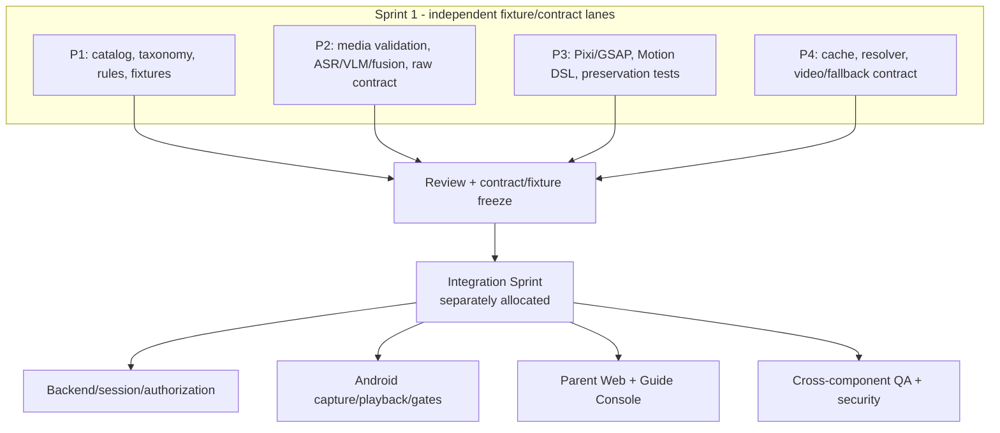

# Sketch2Life Sample High-Level Project Schedule

## Schedule purpose

This schedule adapts the structure of the supplied sample schedule to the current Sketch2Life project. It is a relative 15-week planning baseline with parallel work where the harness and ADR-0006 require independence. `W1` means the first approved planning week; no calendar start date is invented.

The schedule is not evidence of completed implementation. Every feature still requires its own plan, acceptance criteria, approval, and feature-local evidence. Sprint 1 and the later Integration Sprint are separate planning views.

## Schedule summary

| Field | Value |
|---|---|
| Project | Sketch2Life |
| Baseline duration | 15 relative weeks / 75 working days |
| Estimated effort | 240 person-days across four primary workstreams and shared review |
| Start date | TBD - confirm with project owner |
| Finish date | TBD after start date and milestone approval |
| Primary resources | Project owner, P1, P2, P3, P4, shared QA/reviewer |
| Planning rule | Parallel Sprint 1 fixture/contract delivery; Integration Sprint requires separate allocation and approval |
| Status rule | A milestone is complete only when its acceptance evidence and status/context updates are recorded |

## Resource codes

| Code | Resource |
|---|---|
| PO | Project owner / product and approval owner |
| P1 | BA / Montessori workstream |
| P2 | AI Understanding workstream |
| P3 | Art Animation workstream |
| P4 | Learning Media workstream |
| QA | Shared QA, architecture, security, and evidence reviewer |
| ALL | All contributors |

## High-level stage view

| Stage | Relative period | Main result |
|---|---|---|
| Stage 1 - Foundation and reports | W1 | Report 1, Report 2, schedule, source boundary, and approved documentation evidence |
| Stage 2 - Requirements and contract preparation | W1-W2 | SRS v1.6 traceability, contract/fixture review, and Sprint 1 readiness |
| Stage 3 - Independent Sprint 1 workstreams | W2-W5 | P1-P4 standalone fixture runners and versioned output contracts |
| Stage 4 - Integration planning | W6 | New integration allocation, plan, acceptance criteria, and approval |
| Stage 5 - Identity and session vertical slice | W7-W8 | Adult auth boundary, ownership/assignment, ChildProfile, session, and capture metadata slice |
| Stage 6 - Understanding and adult gates | W9-W10 | Understanding, Gate A, deterministic recommendation, and Gate B slice |
| Stage 7 - Personalized experience and handoff | W11-W12 | Story, Pixi exploration, whiteboard-video path, off-screen handoff, feedback, and fallback |
| Stage 8 - Operational surfaces and lifecycle | W13 | Parent Web, Guide Console, redacted monitoring, audit, retention, and deletion slice |
| Stage 9 - Verification and stabilization | W14 | System, security, regression, acceptance, and defect triage evidence |
| Stage 10 - Transition and final package | W15 | Final reports, evidence index, status updates, review, and handoff |

## Detailed schedule

| ID | Name | Duration | Start | Finish | Predecessors | Resource names | Notes |
|---:|---|---:|---|---|---|---|---|
| 1 | Sketch2Life delivery baseline | 15 weeks | W1 | W15 |  | ALL | Relative baseline; re-baseline if approved scope changes. |
| 2 | Planning start | 0 days | W1 | W1 |  | PO | Milestone. |
| 3 | Foundation and reporting - Stage 1 | 5 days | W1 | W1 | 2 | PO, QA | Documentation and governance gate. |
| 4 | Read governance, context, source register, and SRS | 1 day | W1 | W1 | 2 | ALL | Required before proposing work. |
| 5 | Prepare Report 1 - Project Introduction | 3 days | W1 | W1 | 4 | QA, PO | Uses current product and target-vs-current labels. |
| 6 | Prepare Report 2 - Project Management Plan | 3 days | W1 | W1 | 4SS | QA, PO | Includes 240 person-day baseline, risks, quality, and responsibilities. |
| 7 | Prepare adapted Project Schedule | 2 days | W1 | W1 | 4SS | QA, PO | Relative weeks; no invented calendar dates. |
| 8 | Approve Report 1, Report 2, and schedule package | 0 days | W1 | W1 | 5;6;7 | PO | Milestone; evidence recorded in FEAT-031. |
| 9 | Requirements and contract preparation - Stage 2 | 10 days | W1 | W2 | 8 | ALL, QA | Aligns SRS baseline with independent workstreams. |
| 10 | Trace target requirements to current/fixture/planned status | 3 days | W1 | W1 | 8 | QA, PO | Preserve `CURRENT_IMPLEMENTED`, `FIXTURE_ONLY`, and `OPEN_TBD`. |
| 11 | Review contract families, versions, provenance, and errors | 5 days | W1 | W2 | 10SS | P2, P3, P4, QA | Do not merge same-name incompatible shapes. |
| 12 | Freeze Sprint 1 fixture inputs and acceptance cases | 5 days | W2 | W2 | 10 | P1, P2, P3, P4, QA | Contract-first independence. |
| 13 | Sprint 1 readiness gate | 0 days | W2 | W2 | 11;12 | PO, QA | Milestone; each workstream remains independently runnable. |
| 14 | Independent Sprint 1 workstreams - Stage 3 | 20 days | W2 | W5 | 13 | P1, P2, P3, P4 | No shared live service dependency. |
| 15 | P1 Montessori catalog, rules, and deterministic fixtures | 20 days | W2 | W5 | 13 | P1, QA | Safety, age, readiness, prerequisite, material, supervision, and expected results. |
| 16 | P2 AI understanding adapters, fusion, and raw contract fixtures | 20 days | W2 | W5 | 13 | P2, QA | ASR/VLM/fusion proposal, uncertainty, provenance, and failures. |
| 17 | P3 original-art renderer, motion DSL, and bridge player | 20 days | W2 | W5 | 13 | P3, QA | Preserve original artwork; include fallback and validation evidence. |
| 18 | P4 learning-media resolver, cache, validation, and fallback | 20 days | W2 | W5 | 13 | P4, QA | Reviewed/cache-first behavior and safe fallback contract. |
| 19 | Independent workstream review and evidence pack | 5 days | W5 | W5 | 15;16;17;18 | ALL, QA | Review each output without integrating runtime behavior. |
| 20 | Sprint 1 completion review | 0 days | W5 | W5 | 19 | PO, QA | Does not authorize Integration Sprint implementation. |
| 21 | Integration planning - Stage 4 | 5 days | W6 | W6 | 20 | PO, ALL, QA | New allocation and new plan required. |
| 22 | Define integration ownership and dependency order | 2 days | W6 | W6 | 20 | PO, ALL | Rebalance Android, backend, web, QA, and operations work. |
| 23 | Write Integration Sprint plan and acceptance matrix | 3 days | W6 | W6 | 22SS | QA, ALL | Map to SRS scenarios and repository contracts. |
| 24 | Approve Integration Sprint allocation | 0 days | W6 | W6 | 23 | PO | Milestone; implementation gate. |
| 25 | Identity and session vertical slice - Stage 5 | 10 days | W7 | W8 | 24 | Integration allocation, QA | Synthetic data and backend-owned authorization. |
| 26 | Adult Firebase Authentication verification boundary | 8 days | W7 | W8 | 24 | Backend integration, QA | Auth only; no Firebase Storage/Firestore/Realtime Database. |
| 27 | OwnerCaregiver, ChildProfile, and GuideAssignment | 8 days | W7 | W8 | 24SS | Backend integration, P1, QA | Ownership, active assignment, expiry, and revoke semantics. |
| 28 | Session state, expected version, idempotency, and job status | 10 days | W7 | W8 | 24SS | Backend integration, P2, QA | Stale completion cannot mutate newer state. |
| 29 | Capture metadata and media validation slice | 8 days | W7 | W8 | 24SS | Mobile integration, P2, QA | Original artifact reference and validation status only. |
| 30 | Vertical-slice review gate | 0 days | W8 | W8 | 26;27;28;29 | PO, QA | Evidence required before next slice. |
| 31 | Understanding and adult gates - Stage 6 | 10 days | W9 | W10 | 30 | Integration allocation, QA | Gate behavior remains adult-controlled. |
| 32 | Understanding proposal and Human Gate A | 8 days | W9 | W10 | 30 | P2, mobile/backend integration, QA | Confirm, correct, recapture, or re-record. |
| 33 | Deterministic Montessori filtering and candidate reasons | 8 days | W9 | W10 | 30SS | P1, backend integration, QA | Hard rules precede any model-assisted ranking. |
| 34 | Human Gate B and versioned ExperienceSpec | 8 days | W9 | W10 | 30SS | P1, backend/mobile integration, QA | Lock activity and learning-objective identity/version. |
| 35 | Gate and recommendation review gate | 0 days | W10 | W10 | 32;33;34 | PO, QA | Negative cases and provenance reviewed. |
| 36 | Personalized experience and handoff - Stage 7 | 10 days | W11 | W12 | 35 | Integration allocation, QA | Separate original-art and learning-media paths. |
| 37 | Narrated story and independent TTS track | 8 days | W11 | W12 | 35 | P2, P4, QA | Generated narration is not raw child voice by default. |
| 38 | PixiJS personalized drawing exploration | 8 days | W11 | W12 | 35SS | P3, mobile integration, QA | Tap-to-discover and source-derived 2.5D/parallax. |
| 39 | Whiteboard video localization, segmentation, strokes, and MP4 | 10 days | W11 | W12 | 35SS | P2, P3, P4, QA | Session/process-local target; READY only after validation. |
| 40 | Off-screen activity bridge and feedback | 8 days | W11 | W12 | 35SS | P1, mobile/backend integration, QA | Materials, substitutes, setup, supervision, safety, observation. |
| 41 | Media failure, retry, fallback, and provenance review | 3 days | W12 | W12 | 37;38;39;40 | QA, PO | Failure cannot remove the off-screen activity or fake success. |
| 42 | Experience/handoff gate | 0 days | W12 | W12 | 41 | PO, QA | Milestone. |
| 43 | Operational surfaces and lifecycle - Stage 8 | 5 days | W13 | W13 | 42 | Integration allocation, QA | Shared backend authorization across surfaces. |
| 44 | Parent Web management and minimal live projection | 5 days | W13 | W13 | 42 | Web integration, QA | Phase/status/progress/update time; no technical internals. |
| 45 | Guide Console assigned-child sessions and observations | 5 days | W13 | W13 | 42SS | Web integration, P1, QA | Desktop-first target; active assignment scope. |
| 46 | Redacted monitoring, business events, and audit | 5 days | W13 | W13 | 42SS | Backend integration, QA | Grafana is a view; durable business/audit records remain authoritative. |
| 47 | Retention, archive, deletion, and break-glass controls | 5 days | W13 | W13 | 42SS | Backend integration, PO, QA | 30/60/90 choice; detailed policy questions remain explicit. |
| 48 | Operational-surface review gate | 0 days | W13 | W13 | 44;45;46;47 | PO, QA | Review redaction, authorization, and lifecycle evidence. |
| 49 | Verification and stabilization - Stage 9 | 5 days | W14 | W14 | 48 | ALL, QA | No production claim from fixture success. |
| 50 | Unit, contract, regression, and negative-case test run | 4 days | W14 | W14 | 48 | ALL, QA | Include rate limits, retry budgets, idempotency, and concurrency guards. |
| 51 | System scenarios and acceptance rehearsal | 4 days | W14 | W14 | 48SS | ALL, QA, PO | Use SRS acceptance scenarios AT-001 onward. |
| 52 | Architecture, security, and repository scan | 2 days | W14 | W14 | 48SS | QA, PO | Run harness, architecture, and security validators. |
| 53 | Defect triage, fixes, and evidence update | 5 days | W14 | W14 | 50;51;52SS | ALL, QA | Re-run affected checks and update status/context. |
| 54 | Verification completion gate | 0 days | W14 | W14 | 53 | PO, QA | Pass, revise, or explicitly accept limitation. |
| 55 | Transition and final package - Stage 10 | 5 days | W15 | W15 | 54 | ALL, QA, PO | Documentation and review closeout. |
| 56 | Update feature context, decisions, evidence, and status | 2 days | W15 | W15 | 54 | ALL, QA | Required by harness. |
| 57 | Prepare user/technical handoff notes | 3 days | W15 | W15 | 54SS | P1, P2, P3, P4, QA | Include setup, fixture inputs, known limits, and open TBDs. |
| 58 | Final capstone report package and presentation material | 4 days | W15 | W15 | 54SS | ALL, PO | Preserve source traceability and status claims. |
| 59 | Final review and transition milestone | 0 days | W15 | W15 | 56;57;58 | PO, QA | Only approved evidence supports DONE status. |

## Dependency and governance notes

- Rows 15-18 are parallel and independent. A workstream must not require another person's live service to make progress.
- Row 24 is an explicit gate. Backend, full Android, web, deployment, or E2E work is not implicitly authorized by Sprint 1 completion.
- Rows 26-29 represent an integration allocation that must be recorded separately from the four-person Sprint 1 assignment.
- Every stage gate requires a feature-local evidence record and a status/context update.
- A rejected or changed requirement triggers a plan revision and may invalidate downstream estimates.
- The supplied sample PDF's 2021 dates and task IDs were not copied as project facts. Its table shape and dependency convention were adapted only as a presentation reference.

## Source traceability

- Structure reference: `Report2_Sample Project Schedule.pdf` supplied by the project owner.
- Management and team rules: `AGENTS.md`, `docs/governance/WORKFLOW.md`, `docs/SYSTEM_BASELINE.md`, ADR-0006, and `features/FEAT-001-stack-and-team-plan/`.
- Product target and acceptance behavior: `features/FEAT-029-master-srs/artifacts/Sketch2Life_Master_SRS.md` v1.6.
- Current implementation status: `docs/CURRENT_SYSTEM_STATE.md` and feature-local status/evidence records.

## Schedule control detail

### 1. Planning assumptions

The schedule uses five working days per relative week and assumes that parallel work is possible only where the harness explicitly permits it. The dates in the supplied sample PDF were not reused. A real calendar date should be added only after the project owner confirms the start date and academic submission constraints.

The 240 person-day estimate is distributed across the detailed work packages in Report 2. A 15-week calendar baseline does not mean one contributor works on every row serially; P1-P4 work in parallel in W2-W5, and the later Integration Sprint receives its own approved allocation.

### 2. Milestone acceptance gates

| Gate | Planned week | Required evidence | Decision |
|---|---|---|---|
| G1 - Documentation baseline | W1 | Three reports, source boundary, plan/approval, diagram source map | Accept report package or revise. |
| G2 - Sprint 1 readiness | W2 | Fixture inputs, contract versions, acceptance cases, workstream ownership | Authorize independent Sprint 1 work only. |
| G3 - Sprint 1 review | W5 | P1-P4 standalone runners, outputs, negative cases, evidence | Accept workstreams for integration review; no runtime integration implied. |
| G4 - Integration allocation | W6 | New Integration Sprint plan, WBS, responsibility matrix, acceptance matrix | Approve or reject integration scope/ownership. |
| G5 - Identity/session slice | W8 | Auth/relationship/session/version/capture tests and evidence | Allow understanding/gate work. |
| G6 - Gate and recommendation slice | W10 | Gate A/B, hard-rule, candidate/provenance, stale/idempotency tests | Allow media and handoff work. |
| G7 - Experience/handoff | W12 | Pixi/story/video/fallback/handoff/feedback evidence | Allow operational surface and lifecycle review. |
| G8 - Operational surface | W13 | Parent Web, Guide Console, redaction, audit, retention/deletion evidence | Allow final system verification. |
| G9 - Verification | W14 | Unit/contract/system/security/acceptance results and defect disposition | Approve transition or return to revision. |
| G10 - Final package | W15 | Updated status/context/decisions, reports, evidence index, handoff notes | Mark complete only after owner review. |

### 3. Stage dependency diagram

This figure is the report-ready dependency view. Highlighted nodes are governance/verification gates rather than implementation tasks.

```mermaid
flowchart LR
    S1["W1<br/>Reports + baseline"] --> S2["W1-W2<br/>Requirements + contracts"]
    S2 --> S3["W2-W5<br/>P1/P2/P3/P4 parallel"]
    S3 --> S4["W6<br/>Integration allocation"]
    S4 --> S5["W7-W8<br/>Identity + session slice"]
    S5 --> S6["W9-W10<br/>Understanding + gates"]
    S6 --> S7["W11-W12<br/>Experience + handoff"]
    S7 --> S8["W13<br/>Web + operations"]
    S8 --> S9["W14<br/>Verification + stabilization"]
    S9 --> S10["W15<br/>Transition + final package"]
    classDef gate fill:#fff4cc,stroke:#8a6d1d,color:#111;
    class S1,S4,S9,S10 gate;
```



### 4. Workstream lane diagram

This figure prevents a common planning error: treating the four Sprint 1 people as a serial dependency chain or assigning all integration work to one person by default.



### 5. Critical dependency path

The most constrained dependency path is:

```text
G1 documentation baseline
 -> G2 Sprint 1 readiness
 -> G3 independent review
 -> G4 Integration allocation approval
 -> G5 identity/session slice
 -> G6 Gate A/B and recommendation
 -> G7 media/handoff
 -> G8 operational surfaces/lifecycle
 -> G9 verification
 -> G10 final package
```

P1-P4 work is parallel inside the W2-W5 window. Their outputs converge at review and contract/fixture freeze; they do not call one another's live services. If one workstream is late, the response is to record the dependency and re-plan the affected integration scope, not to bypass its contract or quietly create a direct runtime coupling.

### 6. Schedule change rules

| Trigger | Schedule response |
|---|---|
| A task changes wording only | Update the task note and report change log. |
| A task changes effort by less than 15% without scope change | Record variance in the weekly review; keep the baseline if downstream gates remain valid. |
| A task changes effort by 15% or more | Recalculate the affected stage, update risks and effort baseline, and obtain owner review. |
| A new feature or surface is requested | Create a plan revision and approval; do not insert it silently into an existing week. |
| A dependency becomes unavailable | Use fixture/fake/local adapter if already within approved scope; otherwise mark blocked and update the risk record. |
| A gate fails | Return affected work to `NEEDS_REVISION`, add evidence, and move downstream milestones only through a recorded re-baseline. |
| Integration ownership changes | Update the separate Integration Sprint allocation and responsibility matrix. |

### 7. Schedule evidence checklist

Before declaring a schedule milestone complete, record:

- the milestone ID, planned week, actual review date, and responsible reviewer;
- the approved plan revision and acceptance criteria used;
- commands, fixtures, environment, output, interpretation, and limitation;
- linked contract/schema versions and source artifact IDs where applicable;
- open defects, risks, unresolved `OPEN_TBD` decisions, and re-baseline impact;
- updated feature context, decisions, evidence index, and status.

## Diagram source map

| Figure | Diagram source | Purpose |
|---|---|---|
| Figure 8 | `artifacts/diagrams/07-schedule-stage-dependencies.mmd` | Stage dependency and gate view |
| Figure 9 | `artifacts/diagrams/08-workstream-lanes.mmd` | Parallel Sprint 1 and separately allocated integration lanes |

For Word/PDF submission, export each Mermaid block to SVG or PNG and retain the `.mmd` source next to the report so the figure remains editable and auditable.
