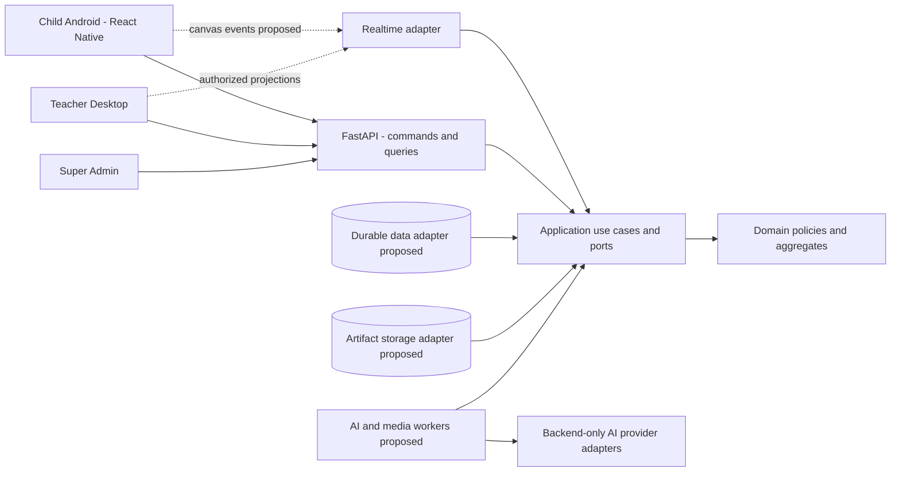

# SRS tổng thể Sketch2Life — Học tập sáng tạo cộng tác

- Mã tài liệu: S2L-SRS-MASTER.
- Phiên bản: 3.0 — thay thế scope v2.0 theo xác nhận owner ngày 2026-10-10.
- Ngôn ngữ: Tiếng Việt.
- Trạng thái: mục tiêu sản phẩm và FastAPI/React Native đã xác nhận; chi tiết `PROPOSED`/`TBD` chưa đóng băng.
- Phạm vi: nền tảng lấy cảm hứng Montessori, Reggio Emilia và học tập kiến tạo xã hội, trẻ 3–12 tuổi.
- Client đã xác nhận: tablet/điện thoại Android, React Native. Backend đã xác nhận: FastAPI.
- Feature quản lý: FEAT-039; task approval revision 2, chỉ tài liệu/phân tích.

> Đây là yêu cầu cho sản phẩm mục tiêu, không phải chứng nhận implementation. Source hiện vẫn chứa giới hạn dưới 9 tuổi, role Parent/Guide/Admin, flow cá nhân và storage in-memory. Việc sửa SRS không tự sửa runtime hoặc adopt các contract bên dưới. Bản v2.0 nguyên trạng, bao gồm nội dung chưa commit trước task, được giữ trong FEAT-039.

## 0. Nguồn, thẩm quyền và cách đọc

### 0.1 Nguồn chính

| ID | Nguồn | Vai trò |
|---|---|---|
| SRC-NEW | Final Product Scope Specification, Product Scope v1.0, Discovery Complete, attachment ngày 2026-10-10 | Yêu cầu sản phẩm mới, phân biệt CONFIRMED/PROPOSED/TBD |
| SRC-ANS | Owner trả lời: “Thay thế scope hiện tại”; “Tablet/điện thoại Android”; “giữ fastapi, reactnative” | Xác nhận thay scope, client và hai công nghệ bắt buộc |
| SRC-ANS2 | Owner chọn: duyệt từng Sketch; chọn trẻ đang vẽ theo lượt; GV retry/skip/end sau video thất bại | Chốt OD02/OD03/OD01; không tự chọn retry budget |
| SRC-OLD | Bản SRS v2.0 được bảo toàn trong FEAT-039 | Lịch sử và phân tích chuyển đổi; không còn là scope mục tiêu mới |
| SRC-CODE | Checkout thực tế: backend, apps/ui-mobile, apps/mobile, packages/art-renderer, catalog và tests | Bằng chứng implementation, không thay quyết định sản phẩm |
| SRC-GOV | AGENTS.md, docs/governance, security và versioned contracts | Quy tắc phát triển/an toàn tiếp tục áp dụng |
| SRC-ADR | ADR-0003/0006/0008–0013 cùng các feature records | Quyết định cũ cần giữ, thay hoặc rà soát theo ma trận chuyển đổi |

Attachment nguyên bản giữ ở local path; hash và nguồn được ghi tại [SOURCE_REVIEW.md](../../FEAT-039-collaborative-learning-scope/evidence/notes/SOURCE_REVIEW.md). Không sao chép handbook/workbook bên ngoài. Báo cáo phân tích chi tiết: [REUSE_AND_ARCHITECTURE.md](../../FEAT-039-collaborative-learning-scope/artifacts/REUSE_AND_ARCHITECTURE.md).

### 0.2 Nhãn yêu cầu

| Nhãn | Nghĩa |
|---|---|
| CONFIRMED | Hành vi được scope đầu vào xác nhận, áp dụng cho sản phẩm mới theo quyết định thay scope |
| OWNER_CONFIRMED | Trả lời trực tiếp trong task này: thay scope, Android, FastAPI, React Native |
| REPO_CONSTRAINT | Quy tắc repo tiếp tục áp dụng: security, provenance, inward dependencies, approval |
| PROPOSED | Chi tiết refinement/kiến trúc/schema được đề xuất; chưa là quyết định cuối |
| TBD | Cần owner hoặc stakeholder trả lời; không implement phần phụ thuộc bằng giả định |
| SOURCE_IMPLEMENTED | Có source; không hàm ý production, durable hoặc real-model benchmark đạt |
| FIXTURE_OR_DEMO | Chỉ fixture, synthetic, mock, local hoặc ephemeral |

Các ma trận quyền, state cụ thể, schema/API, ngưỡng hiệu năng và bộ tiêu chí đánh giá chi tiết là `PROPOSED`, trừ hành vi được ghi `CONFIRMED`. AC01–AC18 từ nguồn là dự thảo nghiệm thu, chưa phải cam kết performance. Technology “giữ được” không đồng nghĩa dependency upgrade đã được duyệt.

### 0.3 Thay scope và lịch sử

Owner xác nhận scope mới thay scope hiện tại. Vì vậy, các phần B20–B35 trong SRS cũ không tiếp tục ghi đè tài liệu này. Không kéo theo Parent Web, package/credit/payment, thời lượng video 40–60 giây, Wan2.2 bắt buộc, ownership/share/revoke cũ hoặc giới hạn dưới 9 tuổi khi nguồn mới chưa xác nhận.

| Chủ đề | Baseline cũ | Mục tiêu mới / hệ quả |
|---|---|---|
| Trọng tâm | Tranh/narration cá nhân → experience → off-screen | Phiên lớp học: vẽ, cộng tác, chia sẻ, kiến thức, off-screen, reflection |
| Tuổi | 0–107 tháng, dưới 9 | 3–12; UX 3–5/6–8/9–12; biên tháng chính xác TBD |
| Actor | PARENT/GUIDE/ADMIN, trẻ không role | Child/Teacher/Super Admin; phương thức cấp credential cho trẻ TBD |
| Tổ chức | Owner–Guide assignments, một trẻ/experience | Class/enrollment/group/teacher scope, nhiều nhóm tiến độ riêng |
| Video | Cache/fallback hoặc placeholder trong demo | Tạo mới hoặc thư viện; GV duyệt; đang tạo thì chờ; exhausted failure do GV retry/skip/end |
| AI | Understanding/Gate A, activity/Gate B, animation | Thêm adaptive sketch, quyền từ chối của trẻ, teacher review riêng |
| Parent/billing | Parent Web, gói/credit/payment thuộc target cũ | Chưa được xác nhận là tính năng mới; không có FR triển khai |
| Dữ liệu | Original/hash/provenance, retention cũ | Giữ provenance/an toàn; thời hạn cụ thể/consent process mới TBD |
| Transport | REST/polling progress | Giữ REST cho command/job; realtime canvas là đề xuất mới cần ADR |

Thay actor không được migration bằng đổi chuỗi `GUIDE` thành `TEACHER` hoặc `ADMIN` thành quyền xem mọi trẻ. Session, permission và age policy phải có phiên bản và mapping dữ liệu riêng.

## B1. Mục tiêu và phạm vi sản phẩm

### B1.1 Mục tiêu

Trẻ dùng quá trình vẽ để thể hiện hiểu biết ban đầu, lựa chọn đối tượng, cộng tác với bạn, khám phá kiến thức bằng nội dung/video và vận dụng qua hoạt động thực tế. Giá trị là khám phá, diễn đạt và hợp tác; không chấm tranh giống mẫu hoặc dạy vẽ đẹp làm mục tiêu chính. Sản phẩm không tuyên bố là Montessori thuần túy.

Nguyên tắc `CONFIRMED`: child-centered; collaboration; AI hỗ trợ; giáo viên kiểm soát cuối cùng; thích ứng độ tuổi; đánh giá quá trình; hoạt động thực tế; privacy và content safety.

### B1.2 Trong và ngoài phạm vi

`CONFIRMED`: canvas cá nhân/cộng tác; class/student/group/session; AI Vision và Sketch; gallery; kiến thức/video; thư viện off-screen; assessment/portfolio; Teacher Desktop và Super Admin; consent/audit/recovery.

Chưa xác nhận: Parent portal, học phí, payment, social network, chat tự do, marketplace, cạnh tranh/leaderboard. Không tự tạo backlog bắt buộc cho các mục này. Không bỏ các module confirmed vì khó hoặc vì phase trước chỉ làm một vertical slice.

Nền tảng: Android React Native cho trẻ, FastAPI cho backend (`OWNER_CONFIRMED`). Teacher Desktop là surface confirmed; đề xuất desktop browser, chưa chốt React web framework hoặc native desktop. Library/model/cloud/DB/sync còn cần ADR sau refinement.

## B2. Module và ranh giới hệ thống

| ID | Module confirmed | Trách nhiệm / section |
|---|---|---|
| M01 | Identity, Roles & Permissions | Actor, tham gia phiên, quyền resource — B4/B6 |
| M02 | Class & Student Management | Class, hồ sơ, enrollment, teacher assignment — B7/B10 |
| M03 | Session Lifecycle & Orchestration | Phiên lớp và điều phối giáo viên — B5/B9 |
| M04 | Group Management | Thành viên nhóm, tiến độ riêng — B7/B9/B10 |
| M05 | Collaborative Drawing Canvas | Canvas/document, vùng vẽ, quyền sửa, lưu/khôi phục — B10 |
| M06 | AI Vision & Adaptive Sketch | Understanding, context, proposal, review, child response — B10 |
| M07 | Artwork Gallery & Sharing | Chọn/trình chiếu tranh, trình bày ý tưởng — B10 |
| M08 | Knowledge & Video Generation | Kiến thức, tạo/chọn video, review và playback — B10 |
| M09 | Off-screen Activity Library | Chọn/chỉnh hoạt động lớp/nhóm — B10 |
| M10 | Assessment & Learning Portfolio | Quan sát/reflection/tiến bộ — B10 |
| M11 | Teacher Dashboard & Automation | Preview, điều phối, preset/override — B10 |
| M12 | Super Admin Console | Quản trị user/content/AI/audit/policy — B10 |
| M13 | Privacy, Consent & Audit | Consent, retention, export/delete/audit — B11 |
| M14 | Recovery & Exception Handling | Reconnect, conflict, pause, failure — B13 |

14 module là ranh giới chức năng. Đề xuất triển khai một modular monolith cùng workers; không yêu cầu 14 microservices.

## B3. System context và giao tiếp bên ngoài



Mũi tên từ adapter vào application biểu diễn hướng phụ thuộc; luồng gọi I/O đi qua application-owned ports. Android/Desktop không gọi provider AI hoặc bucket S3 trực tiếp. Worker chỉ trả typed result; application kiểm tra quyền, version và gán result vào state.

External boundaries: adult identity provider (Firebase Authentication hiện là ràng buộc repo; triển khai adapter chưa hoàn thành), AI Vision/Sketch/knowledge/render/TTS nếu được chọn, object storage, database, queue và telemetry. Không đưa external provider response thẳng vào domain/UI.

## B4. Actor và mô hình quyền

### B4.1 Actor confirmed

| Actor | Quyền nghiệp vụ đã xác nhận |
|---|---|
| Child | Tham gia, vẽ/cộng tác, yêu cầu/ẩn/từ chối gợi ý, chia sẻ, học/reflection |
| Teacher | Quản lý lớp/nhóm/phiên/công cụ/AI/video/hoạt động/assessment trong phạm vi phân quyền; quyết định cuối và override |
| Super Admin | Quản trị hệ thống, người dùng, nội dung, quyền, AI, logs/reports/policies |

Người đại diện hợp pháp liên quan consent nhưng chưa là một portal/product role. Dịch vụ AI và scheduler là technical actor; không có quyền “phê duyệt thay” Teacher.

### B4.2 Ma trận quyền proposed

`✓` chức năng của actor; `Scope` theo resource assignment/policy; `—` không đề xuất cấp. Các lựa chọn chi tiết của nguồn IV.2 vẫn là proposed, không coi quyền Admin can thiệp mọi canvas là mặc định.

| Action | Child | Teacher | Super Admin |
|---|---|---|---|
| Join classroom session | ✓ theo admission | Scope | Theo quyền vận hành |
| Write own/shared canvas | Scope | Scope/can thiệp có log | Không mặc định |
| Request/decline AI assistance | Scope | Scope | Theo mục đích được cấp |
| Approve sketch/video | — | Scope | Chỉ khi được cấp teaching/review scope |
| Create/control session, groups | — | Scope | Quản trị theo scope |
| View gallery/child portfolio | Scope được phép | Scope | Có mục đích/quyền cụ thể, audited |
| Assess children | — | Scope | Không mặc định đánh giá |
| Author content | — | ✓ | ✓ |
| Publish global library | — | Gửi duyệt | ✓ |
| Change roles/system AI policy | — | — | ✓ |
| Export/delete data | Theo quy trình, TBD | Theo thẩm quyền | Theo quy trình và mục đích |
| Audit access | — | Scope được phép | Scope |

Authorization dựa trên actor + organization/class + session/group + resource + action; không chỉ role string. Một mã QR không tự là quyền sửa mọi lớp.

### B4.3 Identity refinement proposed/TBD

Đề xuất Teacher/Super Admin dùng adult authentication; Child dùng `ChildParticipant` và capability phiên ngắn hạn được giáo viên xác nhận qua QR/mã hoặc hồ sơ, không bắt buộc tài khoản Firebase của trẻ. Đây là phương án, chưa là câu trả lời cho child credential/account lifecycle. Vai trò Child là quyền tham gia thật; không bị xóa khỏi scope vì baseline cũ chỉ adult.

Join credential phải giới hạn session/device/participant/purpose, hết hạn/thu hồi được, tránh guessable session code mở dữ liệu. Tách `StudentProfile`, `Participant`, `DeviceConnection`: nhiều trẻ cùng máy không đồng nghĩa cùng identity; reconnect một device không tạo duplicate participant. Owner chốt thiết bị chung chọn trẻ đang vẽ theo lượt: lưu selected contributor và turn context lúc nhận nét, tách khỏi security principal/capability. Đây là attribution được khai báo qua UI, không là chứng cứ sinh trắc về ai cầm bút; UX chuyển lượt/correction còn proposed. Không tự gán lại nét cũ khi đổi active child.

## B5. Workflow phiên học

| Bước | Hành vi confirmed | Điều kiện và control |
|---|---|---|
| 1 Preparation | GV chọn topic/tuổi/tool/group/preset | Cho chỉnh trước mở lớp |
| 2 Join | Trẻ qua QR/mã hoặc hồ sơ; GV kiểm tra | Admission + đúng session/nhóm |
| 3 Explore & Draw | Cá nhân/cộng tác; trẻ chọn đối tượng, trao đổi | Quyền vùng/canvas; không ép giống mẫu |
| 4 Adaptive Assistance | Tín hiệu/yêu cầu → analysis → sketch → review | Không tự suy thiếu hiểu biết vì dừng vẽ |
| 5 Artwork Sharing | GV mở gallery/chọn tranh; trẻ trình bày | Sharing theo phạm vi lớp |
| 6 Knowledge Discovery | Tạo/chọn nội dung/video, kiểm duyệt, GV duyệt, chiếu | Chờ video hoàn thành; không autoplay nội dung chưa duyệt |
| 7 Off-screen Exploration | GV chọn/chỉnh hoạt động lớp/nhóm | Hoạt động thực tế thuộc phiên học |
| 8 Reflection & Assessment | Trẻ reflection; GV quan sát; AI gợi ý | GV xác nhận assessment; không rank trẻ |
| 9 Completion | Lưu tranh, tiến trình, nhận xét, cập nhật portfolio | Lưu hoàn thành rõ; lỗi lưu cần recovery |

Nhóm tiến độ riêng; một nhóm ready không tự chuyển cả lớp. GV được pause, can thiệp, cho tiếp tục, lưu nháp, chuyển stage hoặc kết thúc sớm. Việc quay lại stage đã chiếu video/off-screen vẫn TBD (OD07). Không áp 10 phút hoặc video 40–60 giây từ scope cũ; screen-time và thời lượng mới chưa chốt.

## B6. Business rules

| ID | Rule | Trạng thái / nguồn |
|---|---|---|
| BR01 | Tuổi mục tiêu 3–12, UI bands 3–5/6–8/9–12; người lớn xác nhận tuổi, không suy từ ảnh | CONFIRMED + REPO_CONSTRAINT; exact month policy TBD |
| BR02 | Teacher có quyết định cuối, override automation và AI | CONFIRMED I/V/VII |
| BR03 | Group progress độc lập; chỉ teacher control mốc chung | CONFIRMED V |
| BR04 | Trẻ được chọn/giải thích ý định; label AI không là ground truth | CONFIRMED VIII |
| BR05 | Sketch hỗ trợ, không tự thay nét của trẻ; trẻ có quyền ẩn/từ chối | CONFIRMED VIII |
| BR06 | Nội dung cần duyệt không hiển thị cho trẻ khi chưa approval hợp lệ; pilot duyệt từng Sketch | CONFIRMED VIII/IX/XIII + OWNER_CONFIRMED OD02 |
| BR07 | Video tạo mới hoặc thư viện; ưu tiên chung lớp, hỗ trợ riêng trẻ; GV duyệt trước chiếu | CONFIRMED IX |
| BR08 | Video đang tạo phải chờ; sau hết retries bị lỗi, chỉ GV chọn retry/skip/end, không tự fallback/skip | CONFIRMED IX + OWNER_CONFIRMED OD01; retry budget TBD |
| BR09 | AI đề xuất hoạt động từ library; Teacher chọn/chỉnh cho lớp/nhóm | CONFIRMED IX |
| BR10 | Assessment theo tuổi/quá trình/tiến bộ chính trẻ, không leaderboard | CONFIRMED X |
| BR11 | Không suy intelligence/personality/psychological/diagnostic từ nét vẽ | REPO_CONSTRAINT; source X detailed report proposed |
| BR12 | Consent, least privilege, retention, export/delete, audit và safety có từ Phase 1 | CONFIRMED XII/XV |
| BR13 | Original/accepted snapshots bất biến; derivative có source/config/model/reviewer provenance | REPO_CONSTRAINT; mở rộng canvas logical design PROPOSED |
| BR14 | Firebase chỉ Authentication; client không có S3/Lightning/Runpod credentials/endpoints | REPO_CONSTRAINT |
| BR15 | Kết thúc session, xóa sản phẩm, chiếu nội dung AI chưa duyệt không tự động | PROPOSED từ VII, phải owner duyệt policy trước implement |
| BR16 | Thiết bị chung chọn trẻ đang vẽ theo lượt; lưu contributor theo lựa chọn, không suy từ touch pointer | OWNER_CONFIRMED OD03; switching/correction design PROPOSED |
| BR17 | Không tự thu mic/camera/face/voice nếu chưa phê duyệt tính năng | PROPOSED XII; image import/audio explanation TBD |
| BR18 | Phase chia implementation, không loại full confirmed scope | CONFIRMED XV |

Safety checks luôn áp dụng trước thực thi hoạt động; chi tiết readiness/material/prerequisite filtering của scope mới chưa được xác nhận. B33 của baseline cũ là discovery theo topic/age/preference, không hard-filter readiness/material; không nhập lại điều kiện cũ bằng suy luận. Đề xuất phân biệt library discovery rộng với xác nhận an toàn/khả thi lúc Teacher chọn thực hiện.

## B7. Thực thể và data dictionary logical

Toàn bộ tên/entity/schema sau là `PROPOSED`, chưa migrate database hoặc frozen contracts. Dùng IDs/versioned refs; không dùng alias trẻ làm khóa định danh.

| Entity | Trường chính | Quan hệ / invariant |
|---|---|---|
| OrganizationScope | id, name, policyRef, status | Isolation scope; single/multi organization OD06 |
| AdultAccount | id, identityRef, role, status | Teacher/Super Admin; mapping/account lifecycle TBD |
| StudentProfile | id, alias, adultConfirmedAge, agePolicyRef, status | Hồ sơ trẻ, không đồng nghĩa login account |
| TeacherAssignment | id, teacherRef, classRef, scope, validFrom/Until, status | Chỉ class được cấp quyền |
| Class | id, organizationRef, name, agePolicyRef, status | Có enrollment/teacher assignments/sessions |
| Enrollment | id, classRef, studentRef, status, validity | Một trẻ có thể tham gia lớp theo policy, cardinality cuối TBD |
| ConsentRecord | id, subjectRef, representativeRef, purposes, policyVersion, evidenceRef, status, timestamps | Consent không được suy từ enrollment; guardian verification TBD |
| ClassroomSession | id, classRef, topicRef, presetVersion, version, lifecycle, sharedStage, times | Aggregate orchestration lớp; không nhét toàn bộ nét vào row này |
| SessionGroup | id, sessionRef, name, version, canvasMode, progress | Nhóm có tiến độ riêng |
| GroupMembership | participantRef, groupRef, validity | Di chuyển nhóm giữ contribution/history |
| ChildParticipant | id, studentRef?, sessionRef, alias, admissionState | StudentRef có thể TBD cho guest; không tự thu DOB đầy đủ |
| DeviceConnection | id, sessionRef, participantRefs, capabilityRef, lastSeen, connectionState | Nhiều participant cùng thiết bị |
| CanvasDocument | id, sessionRef, groupRef?, ownerScope, revision, policyVersion, snapshotRef | Personal/shared/region; scope được kiểm tra |
| CanvasOperation | id, documentRef, verifiedPrincipal/capabilityRef, contributorRef?, deviceRef, attribution, targetRef, type, payload, serverSeq | Verified security principal luôn có; chỉ individual contributor có thể UNKNOWN/GROUP |
| CanvasRegion | id, documentRef, bounds, permission, lockVersion, ownerScope | Không chỉ UI lock |
| CanvasSnapshot | id, documentRef, revision, hash, operationWatermark, artifactRef, provenance | Source của AI/portfolio; snapshot đã chốt bất biến |
| ArtworkShare | id, snapshotRef, teacherRef, presentationOrder, annotations, scope | Không default public gallery |
| VisionObservation | id, snapshotHash/revision, topic/ageContextVersion, candidates, uncertainty, provenance | AI observation khác child intended meaning |
| MeaningConfirmation | id, observationRef, childStatement?, teacherCorrection, confirmedConcepts, version | Gate A principle mapped to teacher context |
| AssistanceRequest | id, participant/group/document refs, trigger, contextVersion, requestedLevel | Trigger không là diagnosis |
| SketchProposal | id, sourceSnapshotRef, targetRegion, supportLevel, sketchArtifactRef, safetyResult, version | AI suggestion riêng child strokes |
| TeacherReview | id, contentRef/version/hash, reviewer, decision, editedVersion?, time, policyRef | Approval gắn đúng content, sửa thì cần review lại |
| ChildResponse | id, proposalRef, participantRef, VIEW/HIDE/DECLINE, timestamp | Không ép nhận hỗ trợ |
| KnowledgeBundle | id, conceptRefs, sourceRefs, ageAudience, scriptVersion, editorialState | Tách imagined story detail với factual explanation |
| VideoJob | id, bundleRef, requestVersion, attempt, status, errorCode, progress | Job version không cùng canvas revision |
| ReviewedVideo | id, artifactRef/hash, bundle/scriptVersion, safetyReviewRef, teacherReviewRef, audience | Chỉ đúng version approved được chơi |
| ActivityDefinition | id, version, objectives, ageRange, materials, steps, duration, safety, reviewState | Source catalog có review/provenance, không tự production-eligible |
| ActivityAssignment | id, definitionRef/version, session/group scope, teacherEdits, safetyConfirmation, status | Nguồn activity và bản Teacher edit đều traceable |
| ObservationRecord | id, student/groupRef, sessionRef, criterionRef, evidenceRefs, teacherComment, status | “Chưa quan sát” không là thiếu năng lực |
| ReflectionRecord | id, sessionRef, participant/groupRef, format, response, author/provenance | Text/audio/image selection chưa chốt |
| PortfolioEntry | id, studentRef, evidenceRefs, attributionQuality, teacherApprovedSummary, date | Phân biệt direct evidence/Teacher observation/AI suggestion |
| PresetVersion | id, version, topic/age/tools/AI/stage settings, author, reviewState | Teacher override có log/version |
| ContentPublication | contentRef/version, publisher, reviewState, recalledAt, reason | Thu hồi không dùng phiên mới; phiên hiện hành policy TBD |
| AuditEvent | id, actor/purpose, action, resourceRef, decision, occurredAt, correlationRef | Không chứa raw child media/token |
| RetentionPolicy | id, version, dataClass, duration?, export/deleteRules, auditException | Giá trị thời hạn OD05 |

### B7.1 Relationship diagram proposed

```mermaid
erDiagram
  CLASS ||--o{ ENROLLMENT : contains
  STUDENT_PROFILE ||--o{ ENROLLMENT : joins
  CLASS ||--o{ TEACHER_ASSIGNMENT : authorizes
  ADULT_ACCOUNT ||--o{ TEACHER_ASSIGNMENT : receives
  CLASS ||--o{ CLASSROOM_SESSION : hosts
  CLASSROOM_SESSION ||--o{ SESSION_GROUP : contains
  CLASSROOM_SESSION ||--o{ CHILD_PARTICIPANT : admits
  SESSION_GROUP ||--o{ GROUP_MEMBERSHIP : has
  CHILD_PARTICIPANT ||--o{ GROUP_MEMBERSHIP : belongs
  CLASSROOM_SESSION ||--o{ CANVAS_DOCUMENT : owns
  CANVAS_DOCUMENT ||--o{ CANVAS_OPERATION : records
  CANVAS_DOCUMENT ||--o{ CANVAS_SNAPSHOT : checkpoints
  CANVAS_SNAPSHOT ||--o{ SKETCH_PROPOSAL : grounds
  SKETCH_PROPOSAL ||--o{ TEACHER_REVIEW : reviewed
  STUDENT_PROFILE ||--o{ PORTFOLIO_ENTRY : collects
  STUDENT_PROFILE ||--o{ CONSENT_RECORD : protected
```

DeviceParticipant binding, group canvas ownership và many-school schema cần refinement; ERD không bắt buộc một table/entity, không là SQL migration. Portfolio không được gán contribution của cả nhóm cho một trẻ nếu thiếu attribution.

## B8. Kiến trúc đề xuất và contract ownership

Giữ FastAPI/Python backend và React Native/TypeScript Android; dùng domain/application độc lập UI/provider/ORM. Đề xuất bounded contexts: Identity/Consent; Classroom; Session/Groups; Drawing/Collaboration; AI Assistance; Knowledge/Media; Activities; Portfolio/Assessment; Governance/Audit. Teacher/Admin là hai surface dùng cùng backend authorization.

Reuse existing image-understanding/experience pipeline dưới `ArtworkAnalysis` hoặc `ArtworkExperience` của group/class session. Không đổi ngầm meaning của `SessionSnapshotV1` cũ thành classroom aggregate. Một session-level version cho mỗi nét sẽ làm cả lớp tranh chấp; proposed mỗi aggregate có version riêng: class control, group progress, canvas document, proposal, knowledge/job.

Canvas gồm framework-free operations/document; input/render adapter; sync/recovery adapter. Pixi renderer hiện là playback; Skia native hoặc Pixi/WebView editor là candidates cần Android/stylus benchmark. Sync server-authoritative ordered operation log + checkpoints là phương án pilot; Yjs/CRDT là phương án so sánh, không là dependency đã chọn. CRDT merge không tự thực thi permission, lock, Teacher override hoặc gán đúng tác giả.

REST cho administration/commands/reviews/query và bounded job polling. WebSocket canvas/presence/teacher live projections là `PROPOSED`; old polling ADR cần amendment trước implementation. PostgreSQL, Redis/RQ và S3-compatible storage có scaffolding; đề xuất giữ candidates cho durable records, workers/artifacts, nhưng phải viết adapters. Redis presence/fanout/cache không là nguồn sự thật portfolio/approval/consent. Worker tách process; không gọi AI trên từng pointer event hoặc chặn vòng nhận nét.

Chi tiết và lộ trình tại [REUSE_AND_ARCHITECTURE.md](../../FEAT-039-collaborative-learning-scope/artifacts/REUSE_AND_ARCHITECTURE.md); [ADR-0014](../../../docs/adr/ADR-0014-collaborative-learning-scope-replacement.md) phân biệt phần xác nhận và đề xuất.

## B9. Lifecycle và state transitions

Các tên state sau là `PROPOSED` từ nguồn V/IX, cần refinement/contract approval. Hành vi pause/recover/group independent progress là confirmed.

### B9.1 Session và group

| Aggregate | State candidates | Quy tắc |
|---|---|---|
| ClassroomSession | Draft, Scheduled, Lobby, Active, Paused, Recovering, Completing, Completed, EndedEarly | Teacher điều khiển; Scheduled optional; Completing chỉ Completed khi dữ liệu đã lưu hoặc lỗi được giải quyết |
| GroupProgress | Waiting, Exploring, Drawing, HelpRequested, Reviewing, Ready, Presenting, OffScreen, Finished | Không là linear mandatory chain; assistance có thể xen kẽ; Ready không chuyển lớp |
| Shared stage | Preparation, Join, ExploreDraw, Assistance, Sharing, Knowledge, OffScreen, Reflection, Completion | Tách stage học với lifecycle, group không phải đồng tốc |
| Connection | Connected, Disconnected, Reconnecting, ResyncRequired | Mất mạng không tự là session completed |

| Command/event | Preconditions proposed | Result/rejection |
|---|---|---|
| OpenLobby | Teacher assignment, valid config, expected session version | Join open hoặc authorization/version error |
| AdmitParticipant | Lobby/allowed late join, membership và consent policy | Participant admitted + scoped device binding |
| PauseSession | Teacher quyền hiện hành | Checkpoint + policy pause; exact editing behavior cần refinement |
| ResumeSession | Teacher + saved state valid | Resume current stage/group state; không reset tranh |
| AdvanceSharedStage | Teacher/version, required approval for Knowledge playback | Stage event; nhóm chưa xong được tiếp tục/lưu nháp theo Teacher |
| MoveParticipant | Teacher + target group + attribution policy | Membership mới; contribution/history giữ nguyên |
| FinishEarly | Teacher confirmation proposed, checkpoint | EndedEarly, lưu lý do và những mục đã có |
| CompleteSession | Teacher command + save workflow | Completing → Completed; lỗi lưu thành recovery action |
| ReturnToEarlierStage | OD07 unresolved | Không implement implicit back-navigation như domain command |

### B9.2 AI assistance proposed

Requested → Analyzing → ProposalReady → PendingTeacherReview → Approved/Rejected → AvailableToChild → Viewed/Hidden/Declined. `Failed`, `BlockedUnsafe`, `Cancelled`, `Stale` có thể xảy ra tùy stage. Không mô hình phản hồi trẻ là “chấp nhận AI sửa tranh”. Source snapshot/version thay đổi không có nghĩa cứ apply lên canvas mới; overlay rebase/refresh cần policy.

Owner chốt Teacher duyệt từng gợi ý trước cho pilot (OD02); không sử dụng preset-preapproval để bỏ per-suggestion review. Approval phải xác định proposal/version/context và scope; không dùng một boolean “AI enabled” để bỏ tất cả gate.

### B9.3 Knowledge/video

Source confirmed minimum: `Generating`, `ReadyForReview`, `Approved`, `Playing`, `Failed`. Đề xuất thêm Draft/Cancelled/Rejected/Stale/Completed/SkippedByTeacher và separate script/editorial state để tránh trộn render job với Teacher review.

Pipeline: snapshot + child explanation nếu có → xác nhận object/topic → tổng hợp kiến thức có nguồn → tạo/chọn video → kiểm duyệt → Teacher approve đúng artifact → playback. Pre-render script review là proposal có thể giảm chi phí, không tự kéo “exact script approval trước image generation” từ scope cũ thành confirmed.

Generating: hiển thị trạng thái/progress thật; Teacher có thể trao đổi về tranh trong lúc chờ (proposed), không tự dùng fallback. Sau các retries được phép mà video vẫn thất bại, owner chốt Teacher có ba lựa chọn retry, bỏ qua video hoặc kết thúc phiên. Skip phải do Teacher explicit command, ghi lý do/disposition và không báo video hoàn thành; kết thúc lưu kết quả đã có. Retry budget/timeouts/backoff còn TBD. Không hứa progress percent nếu provider chỉ có status. Trường hợp dùng library vẫn review đúng nội dung trước chiếu.

## B10. Functional requirements

FR có nhãn riêng. Mọi `CONFIRMED` mô tả target; mức hiện thực hóa xem B15.

### B10.1 M01/M02 Identity và lớp/hồ sơ

| ID | Yêu cầu | Trạng thái | Nguồn |
|---|---|---|---|
| FR001 | Thực thi Child/Teacher/Super Admin permissions theo scope | CONFIRMED | IV, AC14 |
| FR002 | Join qua QR/mã hoặc hồ sơ, Teacher kiểm tra admission | CONFIRMED | V, C01/C02, AC02 |
| FR003 | Hỗ trợ một/nhiều trẻ cùng thiết bị, giữ participant/group context | CONFIRMED | VI, AC03 |
| FR066 | Thiết bị chung chọn active child theo lượt; lưu selected contributor/turn context cho nét mới, không đổi tác giả nét cũ khi switch | OWNER_CONFIRMED nguyên tắc; UX/schema chi tiết PROPOSED | SRC-ANS2/OD03 |
| FR004 | Teacher quản lý class/student/profile được cấp quyền | CONFIRMED | M02, T02 |
| FR005 | Adult Firebase verification, scoped participant capability, account provisioning/revoke | PROPOSED | Repo constraints + IV TBD |
| FR006 | Xử lý consent theo purpose trước các thao tác thu thập/AI bị policy giới hạn | CONFIRMED | XII, AC15; quy trình OD04 |

### B10.2 M03/M04 Session và groups

| ID | Yêu cầu | Trạng thái | Nguồn |
|---|---|---|---|
| FR007 | Teacher tạo/cấu hình topic, độ tuổi, tools, group, preset | CONFIRMED | V/VII, AC01 |
| FR008 | Tạo/chia/quản lý nhóm và thành viên trong session | CONFIRMED | M04, IV/VII |
| FR065 | Chia nhóm tự động trong Phase 2; Teacher kiểm soát/override kết quả, tiêu chí/thuật toán TBD | CONFIRMED khả năng; chi tiết PROPOSED/TBD | XV Phase 2, VII Teacher control |
| FR009 | Theo dõi groups tiến độ khác nhau; không tự chuyển lớp vì group ready | CONFIRMED | V, AC08 |
| FR010 | Teacher pause/intervene/continue/save draft/advance/end early | CONFIRMED | V/XIII, AC13/18 |
| FR011 | Hoàn thành lưu products/process/comments/portfolio; thể hiện save/recovery | CONFIRMED | V/X, AC12/13 |
| FR012 | Di chuyển trẻ/rời nhóm bảo toàn artwork và contribution đã ghi | CONFIRMED | XIII |
| FR013 | Quay lại stage cũ sau video/off-screen | TBD | OD07 |

### B10.3 M05 Canvas

| ID | Yêu cầu | Trạng thái | Nguồn |
|---|---|---|---|
| FR014 | Canvas cá nhân và cộng tác; shared free canvas hoặc vùng riêng | CONFIRMED | VI, AC04 |
| FR015 | Tools phù hợp nhóm tuổi; Teacher bật/tắt/cấu hình | CONFIRMED | VI, AC05 |
| FR016 | Hiển thị participants/help request; bảo vệ vùng, lock/unlock/restore | CONFIRMED | VI/XIII |
| FR017 | Lưu state và reconnect tiếp tục; xử lý conflict giữ contribution | CONFIRMED | VI/XIII, AC13 |
| FR018 | Per-author operation history, scoped undo, cảnh báo xóa nội dung người khác | PROPOSED | VI proposed; attribution OD03 |
| FR019 | Gợi ý AI tách nét trẻ; có chế độ xem sản phẩm không AI overlay | CONFIRMED tách nội dung; PROPOSED chế độ xem | VIII/VI |
| FR020 | Import ảnh/sticker/text/mẫu có sẵn | TBD | OD09; không tự giữ image picker làm core |
| FR021 | Replay quá trình và công cụ layer nâng cao phù hợp 9–12 | CONFIRMED về UX nâng cao/review; chi tiết PROPOSED | VI/OD08 |

### B10.4 M06 AI Vision và Sketch

| ID | Yêu cầu | Trạng thái | Nguồn |
|---|---|---|---|
| FR022 | Vision nhận canvas/vùng snapshot, topic, tuổi, yêu cầu, thao tác và Teacher feedback | CONFIRMED | VIII |
| FR023 | Trả object candidates/context/uncertainty; Child intent và Teacher correction được ghi nhận | CONFIRMED | VIII |
| FR024 | Nhận signal/yêu cầu hỗ trợ; Teacher kích hoạt thủ công hoặc hủy | CONFIRMED | VIII |
| FR025 | Hỗ trợ nhiều mức, sketch tham khảo bên cạnh hoặc overlay | CONFIRMED khả năng | VIII; taxonomy 0–4 PROPOSED |
| FR026 | Teacher duyệt từng gợi ý cho pilot, sửa mức hoặc từ chối trước phát cho trẻ | OWNER_CONFIRMED + CONFIRMED | SRC-ANS2/OD02, VIII, AC07 |
| FR027 | Child yêu cầu, xem, ẩn hoặc từ chối gợi ý; tiếp tục vẽ tự do | CONFIRMED | VIII, AC06 |
| FR028 | AI không tự thay nét, không suy thiếu kiến thức từ dừng vẽ; bounded analysis/config | CONFIRMED | VIII |
| FR029 | Chặn unsafe output, typed failure, log và notify Teacher phù hợp | CONFIRMED | VIII/XIII, AC16 |
| FR030 | Dedup/cache/budget/debounce và stale-snapshot checks | PROPOSED | Architecture refinement; giảm overload và bảo vệ context |

Vision classifier/segmentation/animation hiện có không là AI Sketch generator. Mức 0 none/1 question/2 shapes/3 line sketch/4 overlay vẫn là taxonomy proposed; Teacher chọn mức không giới hạn Child tự diễn đạt.

### B10.5 M07 Gallery

| ID | Yêu cầu | Trạng thái | Nguồn |
|---|---|---|---|
| FR031 | Teacher mở gallery/chọn/sắp xếp/trình chiếu/chú thích tranh | CONFIRMED | V/VII, AC09 |
| FR032 | Child preview sản phẩm, trình bày/giải thích ý tưởng theo format phù hợp | CONFIRMED | C06/V |
| FR033 | Sharing giới hạn session/class và quyền; version snapshot và AI content rõ | PROPOSED cụ thể | IV/VI/XII; privacy confirmed |

### B10.6 M08 Knowledge/video

| ID | Yêu cầu | Trạng thái | Nguồn |
|---|---|---|---|
| FR034 | Tạo video mới hoặc kết hợp library, ưu tiên lớp, bổ sung riêng trẻ | CONFIRMED | IX |
| FR035 | Knowledge phù hợp tuổi, kiểm chứng được; imagined details không trở thành science facts | CONFIRMED | IX |
| FR036 | Teacher kiểm tra/chỉnh sửa/phê duyệt đúng video trước trình chiếu | CONFIRMED | T09/IX, AC10 |
| FR037 | Generating/ReadyForReview/Approved/Playing/Failed và progress/status rõ | CONFIRMED | IX |
| FR038 | Chờ video hoàn thành; không tự fallback/bỏ stage khi đang tạo | CONFIRMED | IX |
| FR039 | Sau video thất bại hết retries được phép, GV explicit retry/skip/end; ghi disposition, không tự skip | OWNER_CONFIRMED; retry budget TBD | SRC-ANS2/OD01 |
| FR040 | Source-grounded knowledge/script version, independent TTS nếu có narration, approval invalidation sau edit | PROPOSED | Refinement/reuse; model, voice, duration TBD |

### B10.7 M09 Activities

| ID | Yêu cầu | Trạng thái | Nguồn |
|---|---|---|---|
| FR041 | Library và AI recommendations; Teacher chọn/chỉnh cho lớp hoặc từng nhóm | CONFIRMED | IX, AC11 |
| FR042 | Activity có topic/objective/age/materials/instructions/duration/safety/form/observation | PROPOSED field detail | IX “nên có”; library confirmed |
| FR043 | Teacher xác nhận khả thi với materials thực tế trước bắt đầu | PROPOSED | IX |
| FR044 | Lưu activity/reflection/off-screen evidence trong kết quả session | CONFIRMED | V/X, AC12 |

Mixed-age group activity compatibility, safety review authority và publication approval chi tiết chưa chốt. Không automatically recommend hazardous activity chỉ vì model match topic.

### B10.8 M10 Assessment/portfolio

| ID | Yêu cầu | Trạng thái | Nguồn |
|---|---|---|---|
| FR045 | Assessment theo tuổi, Teacher observation, AI suggestions và tiến bộ chính trẻ | CONFIRMED | X |
| FR046 | Không score/rank trẻ với nhau; portfolio và reports tiến bộ thời gian | CONFIRMED | X, AC17 |
| FR047 | Lưu session history, art/contribution khi xác định được, process/AI/content/comments/activity/reflection | CONFIRMED | X, AC12 |
| FR048 | Báo cáo/export theo quyền, phân biệt direct evidence/Teacher judgement/AI inference | CONFIRMED quyền; PROPOSED taxonomy evidence | X/XII |
| FR049 | Rubric exploration/cooperation/expression/creativity/skills/application, descriptive levels | PROPOSED | X/OD10 |
| FR050 | Không coi “chưa quan sát” là thiếu năng lực; không suy psychology/intelligence từ tranh | PROPOSED report semantics + REPO_CONSTRAINT prohibited inference | X/code policy |

### B10.9 M11 Teacher Dashboard/preset

| ID | Yêu cầu | Trạng thái | Nguồn |
|---|---|---|---|
| FR051 | Dashboard toàn lớp, group previews/status/help, review queue và controls | CONFIRMED | VII |
| FR052 | Tạo/tái sử dụng preset và automation có điều kiện, Teacher override bất kỳ lúc | CONFIRMED | VII, AC18 |
| FR053 | Preset version chứa tuổi/topic/tools/canvas/AI/mốc/thông báo/video/activity/assessment | PROPOSED chi tiết | VII |
| FR054 | Queue priority/help overload control và audit mọi automated action/override | PROPOSED | Pilot workload cần đo |

### B10.10 M12 Super Admin

| ID | Yêu cầu | Trạng thái | Nguồn |
|---|---|---|---|
| FR055 | Overview users/classes/sessions và role/account administration | CONFIRMED | XI A01–A03 |
| FR056 | Author/review/publish/recall learning content và system AI policies/limits | CONFIRMED | XI A04/A05/A10 |
| FR057 | Session monitoring, authorized learning reports, consent/audit/incidents | CONFIRMED | XI A06–A09 |
| FR058 | Không mặc định xem mọi child raw content; purpose-scoped audited access | PROPOSED access detail | IV proposed; least privilege confirmed |

### B10.11 M13/M14 Data/recovery

| ID | Yêu cầu | Trạng thái | Nguồn |
|---|---|---|---|
| FR059 | Access control, consent, retention policy, export/delete, audit | CONFIRMED | XII, AC15 |
| FR060 | Session/artwork recoverable, lưu drafts/checkpoints và safe error feedback | CONFIRMED | XII/XIII, AC13 |
| FR061 | Wrong recognition correction, unsafe blocking, pending review never displayed | CONFIRMED | XIII |
| FR062 | Recalled content không dùng cho phiên mới | CONFIRMED | XIII |
| FR063 | Teacher offline: permitted drawing tiếp tục, actions cần approval đợi | PROPOSED | XIII proposed |
| FR064 | Backup/provider-copy purge, mixed shared-canvas deletion và retained audit minimization | PROPOSED; policy TBD | XII/OD05 |

## B11. NFR, privacy và vận hành

| ID | Yêu cầu | Trạng thái và nghiệm thu |
|---|---|---|
| NFR01 | Age-adaptive UX: 3–5 icon/hình/âm thanh/ít thao tác; 6–8 công cụ rõ/undo/zoom/hợp tác; 9–12 công cụ nâng cao/xem quá trình | CONFIRMED VI; tool details OD08, audio collection khác audio instructions |
| NFR02 | Permission isolation cho class/session/group/artifact/review; tampered role/join/device không mở resource khác | CONFIRMED XII; concrete security scenarios proposed |
| NFR03 | AI/content moderation, Teacher review gate, child agency | CONFIRMED VIII/IX; model-quality thresholds TBD |
| NFR04 | Original/provenance, source/hash/version for derivatives and approved snapshots | REPO_CONSTRAINT; review/replay evidence |
| NFR05 | Recover accepted drawings/session after interruption; no silent loss of contribution | CONFIRMED; RPO/RTO/maximum offline duration TBD |
| NFR06 | Near-real-time collaboration, responsive local drawing and usable classroom dashboard | PROPOSED measurable objectives; latency/frame/memory/load thresholds OD12 |
| NFR07 | Data minimization, access/audit, retention/export/delete và consent lifecycle | CONFIRMED; retention duration/jurisdiction/guardian verification TBD |
| NFR08 | Redacted operational metrics/logs separate business/audit records | REPO_CONSTRAINT patterns; dashboard/provider specifics proposed |
| NFR09 | Rate limits, retry budget, idempotency, request/operation size and concurrency controls | PROPOSED new product thresholds, existing repo invariants retained |
| NFR10 | Versioned contracts, stale result rejection, inward dependencies, ports/adapters | REPO_CONSTRAINT; architecture/contract review |
| NFR11 | Synthetic fixtures in development; no real child data/secret committed | REPO_CONSTRAINT; security validator |
| NFR12 | Screen time age appropriate and off-screen part of session | CONFIRMED principle; exact limit OD11 |

### B11.1 Data classes và lifecycle

Identity; classroom; session; artwork/operations/snapshot; AI requests/reviews; learning content; assessment/reflection; consent; audit. Retention/export/delete matrix phải chọn per-class policy/version, legal basis và allowed purpose. Không tự giữ 30/60/90 ngày từ scope cũ như value confirmed.

Proposed: consent grant/revoke changes invalidate future access/provider work according to policy; purge covers derivatives/caches/provider copies/backups with traceable completion and exceptions. Cộng tác: xóa data của một trẻ cần bảo vệ quyền của trẻ khác; không phá toàn bộ shared artwork ngầm. OD05 cần trả lời ownership/retention/attribution trước durable schema freeze.

Super Admin administrative power không là consent hoặc lý do đọc toàn bộ child content. Teacher không tự đại diện hợp pháp chỉ vì quản lý lớp. Guardian consent có thể qua school-mediated record hoặc external consent flow; đây là candidates cho OD04, chưa chọn. Export/delete được yêu cầu dù không có Parent portal.

Không tuyên bố tuân thủ pháp luật của một thị trường khi chưa xác nhận jurisdiction và quy trình. Task này không quyết định pháp lý; cần nguồn chính thức hiện hành trong feature privacy riêng sau khi chốt thị trường.

### B11.2 Observability proposed

Track join failures/reconnect/sync lag/rejected operations/checkpoint persistence; group phase distribution/help queue; proposal pending/age/modeled uncertainty/unsafe/stale rates; video status/queue/retries/review time; portfolio-save/delete/export state; policy changes/unauthorized access. Không ghi raw media, child names, prompt, token, signed URL hoặc provider headers trong telemetry. UI Teacher hiện safe actionable message; technical detail chỉ admin/operator được cấp quyền.

Pilot source proposes child participation/autonomy/collaboration, Teacher preparation/workload, learning expression/application, stability/recovery/artwork integrity. Numeric thresholds cần đo và owner duyệt; không claim pedagogy efficacy chỉ vì demo chạy.

## B12. Interface, command và error contracts logical

Toàn bộ registry/interface ở section này là `PROPOSED_UNADOPTED`; không phải endpoint đã implement. Existing ASR/Vision contract families khác shape phải reconcile, không import theo tên ngắn.

### B12.1 Envelope

Đề xuất envelope: `contract_name/version`, `command_or_operation_id`, `correlation_id`, actor/capability scope, organization/class/session/group/document refs theo applicability, expected aggregate version, referenced artifact ID/version/hash, created_at, bounded payload. Server derives actor/scope from verified identity, không tin `actor_ref` tùy ý client. Idempotency keyed action/resource/actor; cùng key payload khác bị conflict.

Canvas operation đề xuất: `operation_id`, `document_id`, `document_epoch`, required verified principal/capability (server-derived), `contributor_participant_ref?`, `device_ref`, attribution status, target/region, operation type, client sequence, policy/lock version, bounded normalized points/style. Unknown contributor không cho phép unauthenticated mutation: Teacher/device participation grant vẫn phải được xác thực và có scope. Server returns accepted revision/server sequence hoặc reject reason; không bắt mọi client biết đúng head version trên mỗi stroke. Stage/lock policy epoch có thể invalidates buffered edits, cần explicit reconciliation.

### B12.2 Command/query catalogue proposed

| Contract family | Command/query | Ownership |
|---|---|---|
| ClassroomV1Candidate | class/student/enrollment/assignment CRUD | Classroom use cases |
| ParticipationV1Candidate | issue admission, join, verify roster, leave/rebind/revoke | Identity + Session |
| ClassroomSessionV1Candidate | create/open/pause/resume/advance/save/complete | Session use cases |
| GroupProgressV1Candidate | configure group, propose automatic grouping, teacher override/commit, move member, read/update group progress | Session/Groups; grouping criteria TBD |
| CanvasDocumentV1Candidate | get checkpoint+delta; append op; lock/unlock; restore revision | Drawing; authorization server |
| AssistanceV1Candidate | request/cancel; analysis result; proposal review; child response | AI Assistance |
| GalleryV1Candidate | publish within class, order, annotate, present snapshot | Artwork sharing |
| KnowledgeV1Candidate | create/edit bundle, generate/select video, review, start playback | Knowledge/Media |
| ActivityAssignmentV1Candidate | discover/recommend/select/edit/start/finish | Activities |
| PortfolioV1Candidate | teacher observation/reflection/summary, read/export | Portfolio |
| GovernanceV1Candidate | content review/publication/recall, AI/preset policy version | Admin |
| DataRequestV1Candidate | consent change, export/delete request/status | Privacy |

Endpoint naming ví dụ `/v2/classroom-sessions/{id}/commands` hoặc REST resource routes còn chưa chọn. Không tự bump old `/v1` payload semantics; coexistence/migration cần ADR và compatibility tests.

### B12.3 Events proposed

`ParticipantAdmitted`, `ParticipantRemoved`, `GroupMembershipChanged`, `SessionPaused/Resumed/StageChanged`, `CanvasOperationAccepted/Rejected`, `CanvasCheckpointSaved`, `RegionPolicyChanged`, `AssistanceRequested`, `SketchProposalReady`, `TeacherReviewRecorded`, `ChildSuggestionDeclined`, `KnowledgeVideoReady/Failed/Approved`, `ActivityAssigned`, `ObservationConfirmed`, `PortfolioEntrySaved`, `ConsentChanged`, `ContentRecalled`, `DataRequestCompleted`.

Event carries event ID/aggregate/version/time/correlation and minimum authorized payload. Presence/cursor is ephemeral; stroke acceptance/review/consent must be durable. Outbox/fanout/replay proposal: persist first, then acknowledge/fanout; duplicate delivery safe; gap detection fetches checkpoint/delta. Unauthorized cursor/thumbnail subscriber denied, not just write denied.

### B12.4 Errors and stale work

Proposed typed reasons: `UNAUTHENTICATED`, `FORBIDDEN_SCOPE`, `JOIN_EXPIRED`, `CONSENT_REQUIRED`, `AGE_POLICY_UNRESOLVED`, `STALE_AGGREGATE`, `REGION_LOCKED`, `TOOL_NOT_ALLOWED`, `OPERATION_DUPLICATE`, `SYNC_GAP`, `ATTRIBUTION_UNKNOWN`, `UNSAFE_CONTENT`, `REVIEW_REQUIRED`, `STALE_REVIEW`, `PROVIDER_TIMEOUT`, `VIDEO_FAILED`, `SAVE_FAILED`, `CONTENT_RECALLED`, `RATE_LIMITED`.

Worker returns source snapshot/hash, audience/context version, job/request version, model/config provenance. Application rejects completion after cancellation/consent revocation/content recall or changed approval scope according to policy. Editing a reviewed sketch/script/video invalidates review of the old bytes for the new version. Human readable errors should offer valid action, not show provider internals.

## B13. Exception và recovery matrix

| Case | Confirmed expected behavior | Chi tiết còn mở/proposed |
|---|---|---|
| Child offline | Giữ state, rejoin và tiếp tục sau phục hồi/resync | Offline authoring rights là PROPOSED/TBD; durable ack watermark + local draft/replay/lock policy cần chốt |
| Conflicting edits | Bảo vệ contributions, restore | Server ordered log vs CRDT TBD; duplicate/out-of-order probes |
| Draw over peer art | Apply region permissions/history | Scoped undo/confirmation proposed, same-device attribution OD03 |
| AI recognizes wrong | Child/Teacher confirm/correct/reject | Keep original observation and correction/version separately |
| Unsafe sketch/video | Block, log, Teacher feedback | Exact moderation policy/threshold/model TBD |
| Teacher review pending | Content needing approval never visible/playable; pilot từng Sketch | Scope/version/revoke checks cho review, không preset bypass |
| Video generating | Wait and show status | Optional discussion proposed; no automatic fallback |
| Video permanently failed | Failed visible; Teacher explicit retry/skip/end | Retry budget TBD; log choice, no automatic skip/fallback |
| Group unfinished | Continue/save draft/advance by Teacher | Completion ownership/class-stage policy refinement |
| Child leaves/moves group | Preserve artwork/contributions | Device rebinding/token revoke + historical membership proposed |
| Teacher pauses | Save, resume | Tool/pointer behavior while paused policy TBD |
| Ends early | Preserve appropriate records | Confirmation/reason and incomplete outcomes proposed |
| Backend/session interrupted | Restore session | Durable snapshot + operation log required; recovery targets TBD |
| Content recalled | Do not use for new session | Active playback/portfolio handling policy TBD |
| Teacher disconnects | Không có confirmed rule chi tiết | Proposed allowed drawing continues, approval waits; OD14 |
| Student deletion in shared canvas | Export/delete policy enforced | Mixed ownership and derivatives OD05; no silent peer deletion |

Local draft UI must distinguish saved-on-device, sent, accepted/durable, rejected/conflict. “Saved” cannot mean only volatile React state. Replay buffered operations rechecks current policy; rejected operations remain visible as recoverable local drafts until Teacher/user resolves according to approved policy, never silently erase or bypass lock.

## B14. Use cases, screens và acceptance

### B14.1 Screen inventory confirmed functional responsibility

Physical pages/modal/workspace states chưa chốt; không phải UI visual approval.

| Surface | Screen IDs | Trách nhiệm |
|---|---|---|
| Child Android | C01 Welcome/Join; C02 Lobby; C03 Drawing; C04 AI; C05 Collaboration | Join/context/tool policy/help and peer status |
| Child Android | C06 Preview; C07 Knowledge; C08 Activity; C09 Reflection; C10 Recovery | Sharing/learning/off-screen/reflection/rejoin |
| Teacher Desktop | T01 Home; T02 Class; T03 Builder; T04 Lobby; T05 Live; T06 Group | Teacher controls and authorized overview |
| Teacher Desktop | T07 AI Queue; T08 Gallery; T09 Knowledge Review; T10 Activity | Human gates and class/group content |
| Teacher Desktop | T11 Review; T12 Portfolio; T13 Content; T14 Preset | Outcomes, content authoring, reusable policy |
| Super Admin | A01 Overview; A02 Users; A03 Classes; A04 Content; A05 AI | Administration/governance |
| Super Admin | A06 Monitoring; A07 Reports; A08 Consent; A09 Audit; A10 Configuration | Operability/privacy/policy |

Teacher and Admin can share a web app shell but distinct authorized routes/read models; no default raw student-data visibility. Current parent phone Dashboard is not T05.

### B14.2 Core use cases proposed executable scenarios

| UC | Scenario | Positive evidence | Negative case |
|---|---|---|---|
| UC01 | Teacher builds session and admits children | Topic/age/tools/groups preset and roster persisted | Wrong class/expired QR/duplicate admission rejected |
| UC02 | Two tablets draw one canvas | Both accepted strokes retained in checkpoint | Forbidden region/duplicate ops don't change peer art |
| UC03 | Several children share one tablet | Chọn active child theo lượt; nét mới gắn lựa chọn/lượt đó, verified grant vẫn có | Switch không gán lại tác giả nét cũ; không suy child identity từ touch |
| UC04 | Groups work at own speed | Ready group doesn't advance class | Child command cannot advance class |
| UC05 | Child requests sketch | Teacher-reviewed suggestion can show/hide/decline | Pending/unsafe/stale content unavailable |
| UC06 | Child disagrees with AI label | Meaning correction preserved | AI label doesn't override intended object |
| UC07 | Gallery → knowledge/video | Reviewed exact version plays | Edited/unapproved/cross-class video denied |
| UC08 | Slow/failed video | Generating waits; exhausted failure cho Teacher retry/skip/end, disposition được lưu | Không tự skip/fallback; skip không bị báo successful video |
| UC09 | Activity and reflection | Teacher class/group choice saved; observations portfolio | Peer art not claimed as individual evidence |
| UC10 | Disconnect/restart/reconnect | Checkpoint+accepted operations restore; unsent draft reconciles | New lock/version prevents unauthorized buffered replay |
| UC11 | Teacher preset override | Policy changes visible and audited | Automation cannot bypass required review |
| UC12 | Consent/export/delete | Purpose-scoped request and traceable result | Role alone doesn't expose all students/copies |
| UC13 | Phase 2 chia nhóm tự động | Grouping proposal theo tiêu chí đã duyệt; Teacher điều chỉnh/chốt | Algorithm không tự vượt teacher scope, mất membership history hoặc ép đổi phase |

### B14.3 Source AC01–AC18 traceability

Các tiêu chí được giữ toàn bộ như dự thảo nghiệm thu chức năng của scope đầu vào.

| Source AC | Nội dung | Modules | FR/UC |
|---|---|---|---|
| AC01 | Session topic/age/group/preset | M03/M04/M11 | FR007–009, FR052; UC01 |
| AC02 | QR/mã và hồ sơ | M01/M03 | FR002; UC01 |
| AC03 | Một/nhiều trẻ một device | M01/M05 | FR003/018/066; UC03 |
| AC04 | Personal/collaborative đúng quyền | M05 | FR014/016/017; UC02 |
| AC05 | Teacher tools theo tuổi/activity | M05/M11 | FR015; UC01/11 |
| AC06 | Child request/hide/decline Sketch | M06 | FR024–027; UC05 |
| AC07 | Không hiển thị AI cần duyệt trước approval | M06/M13 | FR026/029/061; UC05 |
| AC08 | Groups tiến độ riêng | M03/M04 | FR009/010; UC04 |
| AC09 | Gallery select/present/annotate | M07 | FR031/032; UC07 |
| AC10 | Video Teacher approved | M08 | FR036–038; UC07/08 |
| AC11 | Off-screen class/group | M09 | FR041/044; UC09 |
| AC12 | Art/process/comments/portfolio | M05/M10 | FR011/017/044–048; UC09/10 |
| AC13 | Pause/resume/recover | M03/M14 | FR010/017/060; UC10 |
| AC14 | Child/Teacher/Admin permissions | M01/M12 | FR001/055–059; UC01/12 |
| AC15 | Export/delete/consent | M13 | FR006/059/064; UC12 |
| AC16 | AI moderation/errors/logs | M06/M13/M14 | FR029/057/061; UC05/08 |
| AC17 | Progress no ranking | M10 | FR045–050; UC09 |
| AC18 | Teacher overrides automation | M11 | FR010/052–054; UC11 |

### B14.4 Verification approach proposed

Unit tests: domain transition/permission/tool/age/approval policy; contract fixtures: typed envelopes/stale/provenance; integration: durable checkpoints, queue completion, authenticated scope; Android device: gestures/stylus/palm/multi-child/recovery; multi-client: simultaneous strokes/duplicates/gaps/lock conflicts; classroom E2E: all 9 steps with slow/failed video and Teacher controls; privacy negative cases: cross-class subscriptions, revoked capabilities, exports and deletion of derived/shared artifacts.

Performance/model tests require pinned versions, device/GPU, fixture manifest and reproducible metrics. Pilot 20–40 trẻ is source planning context, not a proven load result or a user-selected simultaneous-class target. Numeric acceptance thresholds stay OD12 until approved. This documentation task runs document/repository checks only; historical product test passes are not reclassified as current tests.

## B15. Hiện trạng implementation và chuyển đổi

| Capability | Source-inspected status 2026-10-10 | Target work |
|---|---|---|
| FastAPI/Pydantic/ports/contracts | Có source thật; local demo composition | Reuse and extend domains/routes, adult auth/durable adapters |
| Android RN | apps/ui-mobile Expo52/RN0.76.9 demo; apps/mobile RN0.87 fixture skeleton | Chọn một runtime/version sau benchmark; không trộn dependencies |
| Image understanding/Vision | Local/adapters/benchmarks và Lightning-shaped flow | Snapshot/context/group integration; no per-stroke inference |
| Age guard | Backend/mobile hiện 0–107 tháng | New policy/migration cho 3–12 và UX/curriculum mapping |
| Auth/session/artifact persistence | X-Actor-Ref demo, in-memory repos/store/jobs | Firebase verification, class/group auth, durable repo adapters |
| Canvas input/collaboration | Chưa có runtime canvas freehand/sync | Editor/document/operations/realtime/recovery mới |
| AI Sketch | Chưa có pipeline phát gợi ý nét | New request/proposal/review/child response + model benchmark |
| Pixi/GSAP | Original-art animation/playback/bridge đã có | Optional reuse playback; không đồng nghĩa canvas editor |
| SAM/ASR | Source adapters phục vụ segmentation/narration | Optional khi tính năng tương ứng được xác nhận |
| Activity catalog/ranking | Source rules, catalog/provenance, provisional review | Age/topic/group review + Teacher selection/edits |
| Knowledge/video | DeferredVideo, video_placeholder_only; resolver no real generation | Implement render/library/review/wait/failure policy |
| Gallery/feedback | Ephemeral gallery/snapshots, volatile feedback | Durable sharing/process/assessment/portfolio |
| PostgreSQL/Redis/RQ/MinIO | Dependencies + compose scaffolding | Proposed adapters/migrations/worker wiring, not done |
| Teacher/Admin | Chưa có new desktop console/runtime authorization | New authorized surfaces and orchestration |

Source evidence chi tiết ở báo cáo tái sử dụng. README/CURRENT_SYSTEM_STATE có snapshot cũ; không dùng “product implementation not started” để phủ nhận source demo, cũng không mô tả demo/in-memory là hoàn thành production.

### B15.1 Migration plan proposed

1. Close high-impact decisions; version age/role/admission/session/content policies, approve new contracts and allocation.
2. Preserve old contracts/data; characterize old source guards. Migrate legacy roles/ownership only through explicit mapping with consent/authority review.
3. Add ClassroomSession/Group/Participant beside per-artifact pipelines; replace demo actor and in-memory stores for vertical slice.
4. Build native Android canvas proof and server accepted-operation checkpoint/recovery; compare transport/renderer candidates before ADR freeze.
5. Integrate Vision snapshots, new SketchProposal review and Child decline, Gallery, reviewed knowledge video wait semantics and off-screen/reflection.
6. Complete portfolio/assessment/content governance/admin/retention/export/delete; load/device/model verification and controlled pilot.

Không chạy scripts migrate, đổi auth/runtime guards, download model hoặc provision provider trong task này. Không claim 9–12 catalog đầy đủ chỉ vì records tồn tại; curriculum bands cũ 3–6/6–9/9–12 không map bằng tên sang UX bands mới.

## B16. Phân kỳ và team planning

Giữ source XV full scope, session-first. Phase 1 complete learning session: creation/join/personal+collaborative canvas/AI Sketch/gallery/video/off-screen/reflection/save. Đây là vertical slice đủ chu trình, không bỏ video/collaboration vì complexity.

Phase 2 Classroom Operations: refine 20–40 trẻ, chia nhóm tự động (FR065/UC13; Teacher kiểm soát/override, thuật toán/tiêu chí TBD), full live dashboard/preset/flexible orchestration/recovery. Phase 3 Content & Learning Intelligence: full library/governance/adaptive AI/portfolio/reporting. Phase 4 Administration & Scale: full Super Admin/configuration/monitoring/multi-session operation. Minimum safety, consent/access boundaries, audit and recovery có ngay Phase 1; không đợi Phase 4.

Dependency roadmap khác parallel team allocation. ADR-0006 giữ bốn workstreams fixture/contract Sprint 1; không mặc định giao full Android cho Person 3 hoặc backend/infra/E2E cho Person 4. Workstreams mới/integration allocation chỉ là proposal cần approved plan riêng. Work cần reuse có thể chạy independent fixtures: classroom/portfolio policy contracts; Vision/Sketch contracts/evaluation; canvas input/operations/recovery harness; knowledge/media/activity handoff fixtures. Đây không sửa assignment đã duyệt.

## B17. Decision register và các mục còn mở

OD01–OD03 đã được owner trả lời ngày 2026-10-10, được giữ lại để truy vết. Các mục còn lại là TBD cho refinement/implementation gate của phần liên quan.

| ID | Chưa chốt | Mức | Chặn phần nào |
|---|---|---|---|
| OD01 | RESOLVED_OWNER: sau exhausted failure Teacher chọn retry/skip/end; retry budget còn TBD | Đã chốt hành vi | Failure transition/E2E theo FR039 |
| OD02 | RESOLVED_OWNER: duyệt từng Sketch trước cho pilot; exact approval scope/revoke implementation proposed | Đã chốt policy pilot | FR026/UC05 |
| OD03 | RESOLVED_OWNER: chọn active child theo lượt; switching/correction/undo design còn proposed | Đã chốt nguyên tắc | FR066/UC03 |
| OD04 | Guardian consent/verification khi không Parent portal | Cao | Thu thập/AI/durable child records |
| OD05 | Retention/export/delete data classes, shared artwork, copies/backups | Cao | Privacy schema/lifecycle |
| OD06 | Một trường hay nhiều tổ chức, isolation/teacher/admin scope | Trung bình | Tenancy/authorization |
| OD07 | Return to prior stage after video/off-screen | Trung bình | Session transitions |
| OD08 | Tool permissions cụ thể theo 3–5/6–8/9–12 | Trung bình | Android UX/tool rules |
| OD09 | Import ảnh/sticker/text/mẫu | Trung bình | Canvas extensions/data intake |
| OD10 | Age-specific assessment rubric/AI suggestion review | Trung bình | Assessment/report |
| OD11 | Screen-time limits mỗi nhóm tuổi | Cao | Session scheduling/UX |
| OD12 | Pilot measurable thresholds, device set, simultaneous classes, model quality/budget | Trung bình | Load/model/device acceptance |
| OD13 | “12 tuổi” đến trước 13 hay endpoint khác; age-month policy và mixed-age groups | Cao | Age gates/curriculum |
| OD14 | Child credential, provisioning/revoke; Teacher offline/late join/co-teacher policy | Cao | Auth/session recovery |
| OD15 | Expo vs bare RN, single mobile baseline/version, native Skia vs Pixi WebView, sync algorithm/transport | Cao | Stack ADR/canvas prototype |
| OD16 | AI Sketch model/output shape, video model/render/library strategy, voice/language/duration/provider capacity | Cao | AI/media implementation |
| OD17 | Market/jurisdiction, legal process và authority cho school consent/data requests | Cao | Deployment/privacy policy |
| OD18 | Tiêu chí/constraints chia nhóm tự động, mixed-age/equity/teacher preview và commit policy | Trung bình | Phase 2 automatic grouping |

FastAPI, React Native và Android đã được trả lời; không ghi chúng lại là TBD. PostgreSQL/Redis/RQ/S3/Firebase adult auth và React/TypeScript web vẫn candidates/constraints theo từng mục, không full stack freeze.

## B18. Review gates và change log

- Documentation gate: FEAT-039 approved rev2; source coverage, all M01–M14/AC01–AC18, link/provenance and repo checks.
- Product refinement gate: unresolved decisions được chốt bởi owner/stakeholders, label đổi có evidence.
- Technical gate: ADR và exact runtime contracts trước implementation, benchmark cho renderer/sync/models; không coi existing dependencies là version phù hợp tự động.
- Delivery gate: feature plan/approval/evidence/assets gate và security validator theo AGENTS.md. Không tạo/apply UI assets trong task này.

2026-10-10 v3.0: owner thay toàn bộ scope; Android/RN/FastAPI giữ; chốt per-Sketch review, active-child turn selection và Teacher retry/skip/end khi video exhausted failure. SRS tái cấu trúc quanh class/group/canvas/teacher control; bỏ quyền ưu tiên các addendum v2.0 khỏi baseline mới, giữ đầy đủ bản v2.0 nguyên trạng trong FEAT-039. Target requirements thay đổi nhưng application source chưa migration. Kiến trúc ngoài hai công nghệ/Android confirmed còn proposed/TBD.
