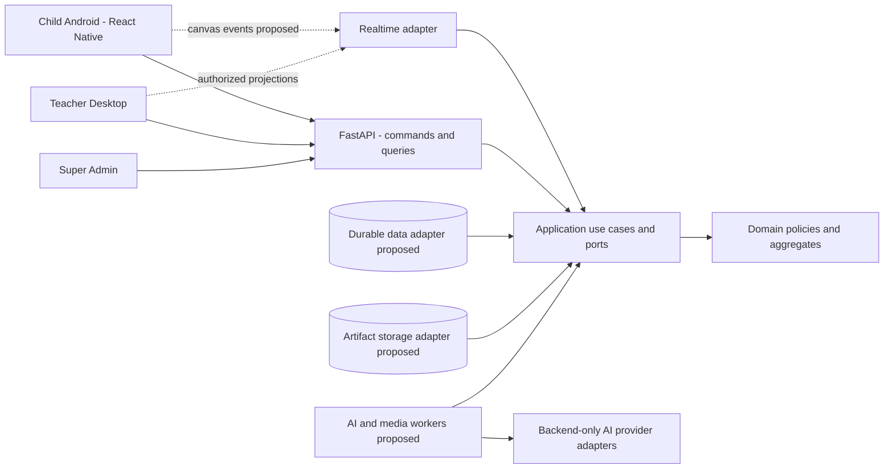
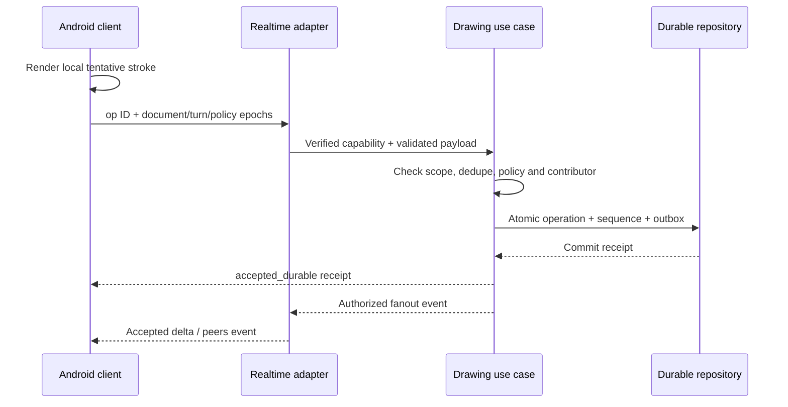

# SRS tổng thể Sketch2Life — Học tập sáng tạo cộng tác

- Mã tài liệu: S2L-SRS-MASTER.
- Phiên bản: 3.1 — đặc tả nền tảng hệ thống, mở rộng scope replacement v3.0 ngày 2026-10-10.
- Ngôn ngữ: Tiếng Việt.
- Trạng thái: mục tiêu sản phẩm và FastAPI/React Native đã xác nhận; chi tiết `PROPOSED`/`TBD` chưa đóng băng.
- Phạm vi: nền tảng lấy cảm hứng Montessori, Reggio Emilia và học tập kiến tạo xã hội, trẻ 3–12 tuổi.
- Client đã xác nhận: tablet/điện thoại Android, React Native. Backend đã xác nhận: FastAPI.
- Feature quản lý: FEAT-039; task approval revision 3, chỉ tài liệu/phân tích; implementation chưa được thực hiện trong task này.

> Đây là yêu cầu cho sản phẩm mục tiêu, không phải chứng nhận implementation. Source hiện vẫn chứa giới hạn dưới 9 tuổi, role Parent/Guide/Admin, flow cá nhân và storage in-memory. Việc sửa SRS không tự sửa runtime hoặc adopt các contract bên dưới. Bản v2.0 nguyên trạng, bao gồm nội dung chưa commit trước task, được giữ trong FEAT-039.

## 0. Nguồn, thẩm quyền và cách đọc

### 0.1 Nguồn chính

| ID | Nguồn | Vai trò |
|---|---|---|
| SRC-NEW | Final Product Scope Specification, Product Scope v1.0, Discovery Complete, attachment ngày 2026-10-10 | Yêu cầu sản phẩm mới, phân biệt CONFIRMED/PROPOSED/TBD |
| SRC-ANS | Owner trả lời: “Thay thế scope hiện tại”; “Tablet/điện thoại Android”; “giữ fastapi, reactnative” | Xác nhận thay scope, client và hai công nghệ bắt buộc |
| SRC-ANS2 | Owner chọn: duyệt từng Sketch; chọn trẻ đang vẽ theo lượt; GV retry/skip/end sau video thất bại | Chốt OD02/OD03/OD01; không tự chọn retry budget |
| SRC-ANS3 | Owner: một trường pilot, hồ sơ + QR/mã không tài khoản trẻ, trường thu consent và authorized Teacher/Admin ghi bằng chứng/phạm vi | Chốt hình thức tổ chức/child account/school consent; verification và contract chi tiết còn refinement |
| SRC-ANS4 | Owner: đủ 3 đến trước 13 tuổi; một lớp tối đa 40 trẻ; giữ dữ liệu phiên/tranh 90 ngày sau end | Chốt 36–155 tháng inclusive, pilot capacity target, default session/artwork retention; không phải benchmark hoặc TTL cho mọi data class |
| SRC-OLD | Bản SRS v2.0 và v3.0 được bảo toàn trong FEAT-039 | Lịch sử và phân tích chuyển đổi; v3.1 là canonical mới |
| SRC-CODE | Checkout thực tế: backend, apps/ui-mobile, apps/mobile, packages/art-renderer, catalog và tests | Bằng chứng implementation, không thay quyết định sản phẩm |
| SRC-GOV | AGENTS.md, docs/governance, security và versioned contracts | Quy tắc phát triển/an toàn tiếp tục áp dụng |
| SRC-ADR | ADR-0003/0006/0008–0013 cùng các feature records | Quyết định cũ cần giữ, thay hoặc rà soát theo ma trận chuyển đổi |

Attachment nguyên bản giữ ở local path; hash và nguồn được ghi tại [SOURCE_REVIEW.md](../../FEAT-039-collaborative-learning-scope/evidence/notes/SOURCE_REVIEW.md). Không sao chép handbook/workbook bên ngoài. Báo cáo phân tích chi tiết: [REUSE_AND_ARCHITECTURE.md](../../FEAT-039-collaborative-learning-scope/artifacts/REUSE_AND_ARCHITECTURE.md).

### 0.2 Nhãn yêu cầu

| Nhãn | Nghĩa |
|---|---|
| CONFIRMED | Hành vi được scope đầu vào xác nhận, áp dụng cho sản phẩm mới theo quyết định thay scope |
| OWNER_CONFIRMED | Trả lời trực tiếp trong task này, gồm scope/Android/FastAPI/RN, per-Sketch review, turn attribution, video failure choice và organization/profile/school consent |
| REPO_CONSTRAINT | Quy tắc repo tiếp tục áp dụng: security, provenance, inward dependencies, approval |
| PROPOSED | Chi tiết refinement/kiến trúc/schema được đề xuất; chưa là quyết định cuối |
| TBD | Cần owner hoặc stakeholder trả lời; không implement phần phụ thuộc bằng giả định |
| SOURCE_IMPLEMENTED | Có source; không hàm ý production, durable hoặc real-model benchmark đạt |
| FIXTURE_OR_DEMO | Chỉ fixture, synthetic, mock, local hoặc ephemeral |

Các ma trận quyền, state cụ thể, schema/API, ngưỡng hiệu năng và bộ tiêu chí đánh giá chi tiết là `PROPOSED`, trừ hành vi được ghi `CONFIRMED`. AC01–AC18 từ nguồn là dự thảo nghiệm thu, chưa phải cam kết performance. Technology “giữ được” không đồng nghĩa dependency upgrade đã được duyệt.

### 0.3 Thay scope và lịch sử

Owner xác nhận scope mới thay scope hiện tại. Vì vậy, các phần B20–B35 trong SRS cũ không tiếp tục ghi đè tài liệu này. Không kéo theo Parent Web, package/credit/payment, thời lượng video 40–60 giây, Wan2.2 bắt buộc, ownership/share/revoke cũ hoặc giới hạn dưới 9 tuổi khi nguồn mới chưa xác nhận.

| Chủ đề | Baseline cũ | Mục tiêu mới / hệ quả |
|---|---|---|
| Trọng tâm | Tranh/narration cá nhân → experience → off-screen | Phiên lớp học: vẽ, cộng tác, chia sẻ, kiến thức, off-screen, reflection |
| Tuổi | 0–107 tháng, dưới 9 | Owner chọn 36–155 tháng inclusive, từ đủ 3 đến trước 13; UX 3–5/6–8/9–12 |
| Actor | PARENT/GUIDE/ADMIN, trẻ không role | Child/Teacher/Super Admin; hồ sơ trẻ do Teacher quản lý, QR/mã phiên, không child login; capability contract proposed |
| Tổ chức | Owner–Guide assignments, một trẻ/experience | Class/enrollment/group/teacher scope, nhiều nhóm tiến độ riêng |
| Video | Cache/fallback hoặc placeholder trong demo | Tạo mới hoặc thư viện; GV duyệt; đang tạo thì chờ; exhausted failure do GV retry/skip/end |
| AI | Understanding/Gate A, activity/Gate B, animation | Thêm adaptive sketch, quyền từ chối của trẻ, teacher review riêng |
| Parent/billing | Parent Web, gói/credit/payment thuộc target cũ | Chưa được xác nhận là tính năng mới; không có FR triển khai |
| Dữ liệu | Original/hash/provenance, retention cũ | Giữ provenance/an toàn; school-mediated consent được owner chọn; chi tiết verification/retention theo OD04/05/17 |
| Transport | REST/polling progress | Giữ REST cho command/job; realtime canvas là đề xuất mới cần ADR |

Thay actor không được migration bằng đổi chuỗi `GUIDE` thành `TEACHER` hoặc `ADMIN` thành quyền xem mọi trẻ. Session, permission và age policy phải có phiên bản và mapping dữ liệu riêng.

### 0.4 Chỉ dẫn đọc bản nền tảng v3.1

| Người đọc / việc cần làm | Phần chính |
|---|---|
| Owner/BA duyệt scope và quyết định | [B1–B6](#b1), [FR và trạng thái](#b10), [decision register](#b17) |
| Thiết kế domain và orchestration | [Kiến trúc](#b8), [policy/state/consistency/recovery](#b19) |
| Backend/Android/Desktop thiết kế contracts | [Detailed use cases](#b20), [data dictionary](#b21), [API/WS/event/error examples](#b22) |
| UX và Teacher workflow | [Screens/age tools/accessibility](#b23), [privacy workflow](#b24) |
| QA, NFR và tích hợp | [Measurement profiles/fixtures](#b25), [traceability/gates](#b26) |
| Migration từ source hiện tại | [Maturity/migration](#b15), [phasing/allocation](#b16), báo cáo reuse đi kèm |

B1–B18 là scope và tổng quan; B19–B26 là refinement có actor/input/guard/error/outcome và verification. Các ID FR được giữ nguyên; UC01–UC13 là summary, UC-001–UC-038 là detailed cases. Chữ “phải” trong phần PROPOSED diễn tả candidate specification để review, không tự adopt stack hoặc cấp task implementation approval. Một quyết định owner-confirmed được ghi riêng và không trở lại TBD vì schema chi tiết chưa chốt.

<a id="b1"></a>

## B1. Mục tiêu và phạm vi sản phẩm

### B1.1 Mục tiêu

Trẻ dùng quá trình vẽ để thể hiện hiểu biết ban đầu, lựa chọn đối tượng, cộng tác với bạn, khám phá kiến thức bằng nội dung/video và vận dụng qua hoạt động thực tế. Giá trị là khám phá, diễn đạt và hợp tác; không chấm tranh giống mẫu hoặc dạy vẽ đẹp làm mục tiêu chính. Sản phẩm không tuyên bố là Montessori thuần túy.

Nguyên tắc `CONFIRMED`: child-centered; collaboration; AI hỗ trợ; giáo viên kiểm soát cuối cùng; thích ứng độ tuổi; đánh giá quá trình; hoạt động thực tế; privacy và content safety.

### B1.2 Trong và ngoài phạm vi

`CONFIRMED`: canvas cá nhân/cộng tác; class/student/group/session; AI Vision và Sketch; gallery; kiến thức/video; thư viện off-screen; assessment/portfolio; Teacher Desktop và Super Admin; consent/audit/recovery.

Chưa xác nhận: Parent portal, học phí, payment, social network, chat tự do, marketplace, cạnh tranh/leaderboard. Không tự tạo backlog bắt buộc cho các mục này. Không bỏ các module confirmed vì khó hoặc vì phase trước chỉ làm một vertical slice.

Nền tảng: Android React Native cho trẻ, FastAPI cho backend (`OWNER_CONFIRMED`). Teacher Desktop là surface confirmed; đề xuất desktop browser, chưa chốt React web framework hoặc native desktop. Library/model/cloud/DB/sync còn cần ADR sau refinement.

<a id="b2"></a>

## B2. Module và ranh giới hệ thống

| ID | Module confirmed | Trách nhiệm / section |
|---|---|---|
| M01 | Identity, Roles & Permissions | Actor, tham gia phiên, quyền resource — B4/B6 |
| M02 | Class & Student Management | Class, hồ sơ, enrollment, teacher assignment — B7/B10 |
| M03 | Session Lifecycle & Orchestration | Phiên lớp và điều phối giáo viên — B5/B9 |
| M04 | Group Management | Thành viên nhóm, tiến độ riêng — B7/B9/B10 |
| M05 | Collaborative Drawing Canvas | Canvas/document, vùng vẽ, quyền sửa, lưu/khôi phục — B10 |
| M06 | AI Vision & Adaptive Sketch | Understanding, context, proposal, review, child response — B10 |
| M07 | Artwork Gallery & Sharing | Chọn/trình chiếu tranh, trình bày ý tưởng — B10 |
| M08 | Knowledge & Video Generation | Kiến thức, tạo/chọn video, review và playback — B10 |
| M09 | Off-screen Activity Library | Chọn/chỉnh hoạt động lớp/nhóm — B10 |
| M10 | Assessment & Learning Portfolio | Quan sát/reflection/tiến bộ — B10 |
| M11 | Teacher Dashboard & Automation | Preview, điều phối, preset/override — B10 |
| M12 | Super Admin Console | Quản trị user/content/AI/audit/policy — B10 |
| M13 | Privacy, Consent & Audit | Consent, retention, export/delete/audit — B11 |
| M14 | Recovery & Exception Handling | Reconnect, conflict, pause, failure — B13 |

14 module là ranh giới chức năng. Đề xuất triển khai một modular monolith cùng workers; không yêu cầu 14 microservices.

<a id="b3"></a>

## B3. System context và giao tiếp bên ngoài



Mũi tên từ adapter vào application biểu diễn hướng phụ thuộc; luồng gọi I/O đi qua application-owned ports. Android/Desktop không gọi provider AI hoặc bucket S3 trực tiếp. Worker chỉ trả typed result; application kiểm tra quyền, version và gán result vào state.

External boundaries: adult identity provider (Firebase Authentication hiện là ràng buộc repo; triển khai adapter chưa hoàn thành), AI Vision/Sketch/knowledge/render/TTS nếu được chọn, object storage, database, queue và telemetry. Không đưa external provider response thẳng vào domain/UI.

<a id="b4"></a>

## B4. Actor và mô hình quyền

### B4.1 Actor confirmed

| Actor | Quyền nghiệp vụ đã xác nhận |
|---|---|
| Child | Tham gia, vẽ/cộng tác, yêu cầu/ẩn/từ chối gợi ý, chia sẻ, học/reflection |
| Teacher | Quản lý lớp/nhóm/phiên/công cụ/AI/video/hoạt động/assessment trong phạm vi phân quyền; quyết định cuối và override |
| Super Admin | Quản trị hệ thống, người dùng, nội dung, quyền, AI, logs/reports/policies |

Người đại diện hợp pháp liên quan consent nhưng chưa là một portal/product role. Dịch vụ AI và scheduler là technical actor; không có quyền “phê duyệt thay” Teacher.

### B4.2 Ma trận quyền proposed

`✓` chức năng của actor; `Scope` theo resource assignment/policy; `—` không đề xuất cấp. Các lựa chọn chi tiết của nguồn IV.2 vẫn là proposed, không coi quyền Admin can thiệp mọi canvas là mặc định.

| Action | Child | Teacher | Super Admin |
|---|---|---|---|
| Join classroom session | ✓ theo admission | Scope | Theo quyền vận hành |
| Write own/shared canvas | Scope | Scope/can thiệp có log | Không mặc định |
| Request/decline AI assistance | Scope | Scope | Theo mục đích được cấp |
| Approve sketch/video | — | Scope | Chỉ khi được cấp teaching/review scope |
| Create/control session, groups | — | Scope | Quản trị theo scope |
| View gallery/child portfolio | Scope được phép | Scope | Có mục đích/quyền cụ thể, audited |
| Assess children | — | Scope | Không mặc định đánh giá |
| Author content | — | ✓ | ✓ |
| Publish global library | — | Gửi duyệt | ✓ |
| Change roles/system AI policy | — | — | ✓ |
| Export/delete data | Theo quy trình, TBD | Theo thẩm quyền | Theo quy trình và mục đích |
| Audit access | — | Scope được phép | Scope |

Authorization dựa trên actor + organization/class + session/group + resource + action; không chỉ role string. Một mã QR không tự là quyền sửa mọi lớp.

### B4.3 Identity baseline và refinement

OWNER_CONFIRMED: trẻ dùng hồ sơ do Teacher quản lý và QR/mã phiên; không có tài khoản đăng nhập riêng. Teacher/Super Admin dùng adult authentication theo repository constraint. ChildParticipant, pending device admission, scoped capability, possession/refresh/revoke là logical design PROPOSED ở B19/B21/B22; không coi QR là verified child identity. Vai trò Child là quyền tham gia thật; không bị xóa khỏi scope vì baseline cũ chỉ adult. Pilot một trường, chuẩn bị organization scoping cho mở rộng; schema cụ thể và multi-tenant launch chưa được chốt.

Join credential phải giới hạn session/device/participant/purpose, hết hạn/thu hồi được, tránh guessable session code mở dữ liệu. Tách `StudentProfile`, `Participant`, `DeviceConnection`: nhiều trẻ cùng máy không đồng nghĩa cùng identity; reconnect một device không tạo duplicate participant. Owner chốt thiết bị chung chọn trẻ đang vẽ theo lượt: lưu selected contributor và turn context lúc nhận nét, tách khỏi security principal/capability. Đây là attribution được khai báo qua UI, không là chứng cứ sinh trắc về ai cầm bút; UX chuyển lượt/correction còn proposed. Không tự gán lại nét cũ khi đổi active child.

<a id="b5"></a>

## B5. Workflow phiên học

| Bước | Hành vi confirmed | Điều kiện và control |
|---|---|---|
| 1 Preparation | GV chọn topic/tuổi/tool/group/preset | Cho chỉnh trước mở lớp |
| 2 Join | Trẻ qua QR/mã hoặc hồ sơ; GV kiểm tra | Admission + đúng session/nhóm |
| 3 Explore & Draw | Cá nhân/cộng tác; trẻ chọn đối tượng, trao đổi | Quyền vùng/canvas; không ép giống mẫu |
| 4 Adaptive Assistance | Tín hiệu/yêu cầu → analysis → sketch → review | Không tự suy thiếu hiểu biết vì dừng vẽ |
| 5 Artwork Sharing | GV mở gallery/chọn tranh; trẻ trình bày | Sharing theo phạm vi lớp |
| 6 Knowledge Discovery | Tạo/chọn nội dung/video, kiểm duyệt, GV duyệt, chiếu | Chờ video hoàn thành; không autoplay nội dung chưa duyệt |
| 7 Off-screen Exploration | GV chọn/chỉnh hoạt động lớp/nhóm | Hoạt động thực tế thuộc phiên học |
| 8 Reflection & Assessment | Trẻ reflection; GV quan sát; AI gợi ý | GV xác nhận assessment; không rank trẻ |
| 9 Completion | Lưu tranh, tiến trình, nhận xét, cập nhật portfolio | Lưu hoàn thành rõ; lỗi lưu cần recovery |

Nhóm tiến độ riêng; một nhóm ready không tự chuyển cả lớp. GV được pause, can thiệp, cho tiếp tục, lưu nháp, chuyển stage hoặc kết thúc sớm. Việc quay lại stage đã chiếu video/off-screen vẫn TBD (OD07). Không áp 10 phút hoặc video 40–60 giây từ scope cũ; screen-time và thời lượng mới chưa chốt.

<a id="b6"></a>

## B6. Business rules

| ID | Rule | Trạng thái / nguồn |
|---|---|---|
| BR01 | Từ đủ 3 đến trước 13: 36–155 completed months inclusive; UX 3–5/6–8/9–12; adult xác nhận tuổi, không suy từ ảnh | OWNER_CONFIRMED endpoint + CONFIRMED bands + REPO_CONSTRAINT; calculation fixtures/mixed-age refinement |
| BR02 | Teacher có quyết định cuối, override automation và AI | CONFIRMED I/V/VII |
| BR03 | Group progress độc lập; chỉ teacher control mốc chung | CONFIRMED V |
| BR04 | Trẻ được chọn/giải thích ý định; label AI không là ground truth | CONFIRMED VIII |
| BR05 | Sketch hỗ trợ, không tự thay nét của trẻ; trẻ có quyền ẩn/từ chối | CONFIRMED VIII |
| BR06 | Nội dung cần duyệt không hiển thị cho trẻ khi chưa approval hợp lệ; pilot duyệt từng Sketch | CONFIRMED VIII/IX/XIII + OWNER_CONFIRMED OD02 |
| BR07 | Video tạo mới hoặc thư viện; ưu tiên chung lớp, hỗ trợ riêng trẻ; GV duyệt trước chiếu | CONFIRMED IX |
| BR08 | Video đang tạo phải chờ; sau hết retries bị lỗi, chỉ GV chọn retry/skip/end, không tự fallback/skip | CONFIRMED IX + OWNER_CONFIRMED OD01; retry budget TBD |
| BR09 | AI đề xuất hoạt động từ library; Teacher chọn/chỉnh cho lớp/nhóm | CONFIRMED IX |
| BR10 | Assessment theo tuổi/quá trình/tiến bộ chính trẻ, không leaderboard | CONFIRMED X |
| BR11 | Không suy intelligence/personality/psychological/diagnostic từ nét vẽ | REPO_CONSTRAINT; source X detailed report proposed |
| BR12 | Consent, least privilege, retention, export/delete, audit và safety có từ Phase 1 | CONFIRMED XII/XV |
| BR13 | Original/accepted snapshots bất biến; derivative có source/config/model/reviewer provenance | REPO_CONSTRAINT; mở rộng canvas logical design PROPOSED |
| BR14 | Firebase chỉ Authentication; client không có S3/Lightning/Runpod credentials/endpoints | REPO_CONSTRAINT |
| BR15 | Kết thúc session, xóa sản phẩm, chiếu nội dung AI chưa duyệt không tự động | PROPOSED từ VII, phải owner duyệt policy trước implement |
| BR16 | Thiết bị chung chọn trẻ đang vẽ theo lượt; lưu contributor theo lựa chọn, không suy từ touch pointer | OWNER_CONFIRMED OD03; switching/correction design PROPOSED |
| BR17 | Không tự thu mic/camera/face/voice nếu chưa phê duyệt tính năng | PROPOSED XII; image import/audio explanation TBD |
| BR18 | Phase chia implementation, không loại full confirmed scope | CONFIRMED XV |

Safety checks luôn áp dụng trước thực thi hoạt động; chi tiết readiness/material/prerequisite filtering của scope mới chưa được xác nhận. B33 của baseline cũ là discovery theo topic/age/preference, không hard-filter readiness/material; không nhập lại điều kiện cũ bằng suy luận. Đề xuất phân biệt library discovery rộng với xác nhận an toàn/khả thi lúc Teacher chọn thực hiện.

<a id="b7"></a>

## B7. Thực thể và data dictionary logical

Toàn bộ tên/entity/schema sau là `PROPOSED`, chưa migrate database hoặc frozen contracts. Dùng IDs/versioned refs; không dùng alias trẻ làm khóa định danh.

| Entity | Trường chính | Quan hệ / invariant |
|---|---|---|
| OrganizationScope | id, name, policyRef, status | Pilot một trường OWNER_CONFIRMED; scope schema chuẩn bị expansion PROPOSED; full multi-school topology riêng |
| AdultAccount | id, identityRef, role, status | Teacher/Super Admin; mapping/account lifecycle TBD |
| StudentProfile | id, alias, adultConfirmedAge, agePolicyRef, status | Hồ sơ trẻ, không đồng nghĩa login account |
| TeacherAssignment | id, teacherRef, classRef, scope, validFrom/Until, status | Chỉ class được cấp quyền |
| Class | id, organizationRef, name, agePolicyRef, status | Có enrollment/teacher assignments/sessions |
| Enrollment | id, classRef, studentRef, status, validity | Một trẻ có thể tham gia lớp theo policy, cardinality cuối TBD |
| ConsentRecord | id, subjectRef, representativeRef, purposes, policyVersion, evidenceRef, status, timestamps | Consent không được suy từ enrollment; guardian verification TBD |
| ClassroomSession | id, classRef, topicRef, presetVersion, version, lifecycle, sharedStage, times | Aggregate orchestration lớp; không nhét toàn bộ nét vào row này |
| SessionGroup | id, sessionRef, name, version, canvasMode, progress | Nhóm có tiến độ riêng |
| GroupMembership | participantRef, groupRef, validity | Di chuyển nhóm giữ contribution/history |
| ChildParticipant | id, studentRef, sessionRef, alias, admissionState | Pilot bắt buộc managed profile; không anonymous/guest participant; Android không tự thu DOB đầy đủ |
| DeviceConnection | id, sessionRef, participantRefs, capabilityRef, lastSeen, connectionState | Nhiều participant cùng thiết bị |
| CanvasDocument | id, sessionRef, groupRef?, ownerScope, revision, policyVersion, snapshotRef | Personal/shared/region; scope được kiểm tra |
| CanvasOperation | id, documentRef, verifiedPrincipal/capabilityRef, contributorRef?, deviceRef, attribution, targetRef, type, payload, serverSeq | Verified security principal luôn có; chỉ individual contributor có thể UNKNOWN/GROUP |
| CanvasRegion | id, documentRef, bounds, permission, lockVersion, ownerScope | Không chỉ UI lock |
| CanvasSnapshot | id, documentRef, revision, hash, operationWatermark, artifactRef, provenance | Source của AI/portfolio; snapshot đã chốt bất biến |
| ArtworkShare | id, snapshotRef, teacherRef, presentationOrder, annotations, scope | Không default public gallery |
| VisionObservation | id, snapshotHash/revision, topic/ageContextVersion, candidates, uncertainty, provenance | AI observation khác child intended meaning |
| MeaningConfirmation | id, observationRef, childStatement?, teacherCorrection, confirmedConcepts, version | Gate A principle mapped to teacher context |
| AssistanceRequest | id, participant/group/document refs, trigger, contextVersion, requestedLevel | Trigger không là diagnosis |
| SketchProposal | id, sourceSnapshotRef, targetRegion, supportLevel, sketchArtifactRef, safetyResult, version | AI suggestion riêng child strokes |
| TeacherReview | id, contentRef/version/hash, reviewer, decision, editedVersion?, time, policyRef | Approval gắn đúng content, sửa thì cần review lại |
| ChildResponse | id, proposalRef, participantRef, VIEW/HIDE/DECLINE, timestamp | Không ép nhận hỗ trợ |
| KnowledgeBundle | id, conceptRefs, sourceRefs, ageAudience, scriptVersion, editorialState | Tách imagined story detail với factual explanation |
| VideoJob | id, bundleRef, requestVersion, attempt, status, errorCode, progress | Job version không cùng canvas revision |
| ReviewedVideo | id, artifactRef/hash, bundle/scriptVersion, safetyReviewRef, teacherReviewRef, audience | Chỉ đúng version approved được chơi |
| ActivityDefinition | id, version, objectives, ageRange, materials, steps, duration, safety, reviewState | Source catalog có review/provenance, không tự production-eligible |
| ActivityAssignment | id, definitionRef/version, session/group scope, teacherEdits, safetyConfirmation, status | Nguồn activity và bản Teacher edit đều traceable |
| ObservationRecord | id, student/groupRef, sessionRef, criterionRef, evidenceRefs, teacherComment, status | “Chưa quan sát” không là thiếu năng lực |
| ReflectionRecord | id, sessionRef, participant/groupRef, format, response, author/provenance | Text/audio/image selection chưa chốt |
| PortfolioEntry | id, studentRef, evidenceRefs, attributionQuality, teacherApprovedSummary, date | Phân biệt direct evidence/Teacher observation/AI suggestion |
| PresetVersion | id, version, topic/age/tools/AI/stage settings, author, reviewState | Teacher override có log/version |
| ContentPublication | contentRef/version, publisher, reviewState, recalledAt, reason | Thu hồi không dùng phiên mới; phiên hiện hành policy TBD |
| AuditEvent | id, actor/purpose, action, resourceRef, decision, occurredAt, correlationRef | Không chứa raw child media/token |
| RetentionPolicy | id, version, dataClass, duration?, export/deleteRules, auditException | Giá trị thời hạn OD05 |

### B7.1 Relationship diagram proposed

```mermaid
erDiagram
  CLASS ||--o{ ENROLLMENT : contains
  STUDENT_PROFILE ||--o{ ENROLLMENT : joins
  CLASS ||--o{ TEACHER_ASSIGNMENT : authorizes
  ADULT_ACCOUNT ||--o{ TEACHER_ASSIGNMENT : receives
  CLASS ||--o{ CLASSROOM_SESSION : hosts
  CLASSROOM_SESSION ||--o{ SESSION_GROUP : contains
  CLASSROOM_SESSION ||--o{ CHILD_PARTICIPANT : admits
  SESSION_GROUP ||--o{ GROUP_MEMBERSHIP : has
  CHILD_PARTICIPANT ||--o{ GROUP_MEMBERSHIP : belongs
  CLASSROOM_SESSION ||--o{ CANVAS_DOCUMENT : owns
  CANVAS_DOCUMENT ||--o{ CANVAS_OPERATION : records
  CANVAS_DOCUMENT ||--o{ CANVAS_SNAPSHOT : checkpoints
  CANVAS_SNAPSHOT ||--o{ SKETCH_PROPOSAL : grounds
  SKETCH_PROPOSAL ||--o{ TEACHER_REVIEW : reviewed
  STUDENT_PROFILE ||--o{ PORTFOLIO_ENTRY : collects
  STUDENT_PROFILE ||--o{ CONSENT_RECORD : protected
```

Pilot một trường đã OWNER_CONFIRMED; organization boundary chuẩn bị khả năng mở rộng. DeviceParticipant binding, group canvas ownership và topology khi multi-school cần refinement; ERD không bắt buộc một table/entity, không là SQL migration. Portfolio không được gán contribution của cả nhóm cho một trẻ nếu thiếu attribution. Field/nullable/validation chi tiết xem B21.

<a id="b8"></a>

## B8. Kiến trúc đề xuất và contract ownership

Giữ FastAPI/Python backend và React Native/TypeScript Android; dùng domain/application độc lập UI/provider/ORM. Đề xuất bounded contexts: Identity/Consent; Classroom; Session/Groups; Drawing/Collaboration; AI Assistance; Knowledge/Media; Activities; Portfolio/Assessment; Governance/Audit. Teacher/Admin là hai surface dùng cùng backend authorization.

Reuse existing image-understanding/experience pipeline dưới `ArtworkAnalysis` hoặc `ArtworkExperience` của group/class session. Không đổi ngầm meaning của `SessionSnapshotV1` cũ thành classroom aggregate. Một session-level version cho mỗi nét sẽ làm cả lớp tranh chấp; proposed mỗi aggregate có version riêng: class control, group progress, canvas document, proposal, knowledge/job.

Canvas gồm framework-free operations/document; input/render adapter; sync/recovery adapter. Pixi renderer hiện là playback; Skia native hoặc Pixi/WebView editor là candidates cần Android/stylus benchmark. Sync server-authoritative ordered operation log + checkpoints là phương án pilot; Yjs/CRDT là phương án so sánh, không là dependency đã chọn. CRDT merge không tự thực thi permission, lock, Teacher override hoặc gán đúng tác giả.

REST cho administration/commands/reviews/query và bounded job polling. WebSocket canvas/presence/teacher live projections là `PROPOSED`; old polling ADR cần amendment trước implementation. PostgreSQL, Redis/RQ và S3-compatible storage có scaffolding; đề xuất giữ candidates cho durable records, workers/artifacts, nhưng phải viết adapters. Redis presence/fanout/cache không là nguồn sự thật portfolio/approval/consent. Worker tách process; không gọi AI trên từng pointer event hoặc chặn vòng nhận nét.

Chi tiết và lộ trình tại [REUSE_AND_ARCHITECTURE.md](../../FEAT-039-collaborative-learning-scope/artifacts/REUSE_AND_ARCHITECTURE.md); [ADR-0014](../../../docs/adr/ADR-0014-collaborative-learning-scope-replacement.md) phân biệt phần xác nhận và đề xuất.

<a id="b9"></a>

## B9. Lifecycle và state transitions

Các tên state sau là display concepts `PROPOSED` từ nguồn V/IX; B19.4 định nghĩa lower_snake_case wire registry cho refinement/contract approval. Hành vi pause/recover/group independent progress là confirmed. Chi tiết transitions/epochs/ack ở B19 và contracts B22; tên hiển thị không tạo enum cạnh tranh.

### B9.1 Session và group

| Aggregate | State candidates | Quy tắc |
|---|---|---|
| ClassroomSession | Draft, Scheduled, Lobby, Active, Paused, Recovering, Completing, Completed, EndedEarly | Teacher điều khiển; Scheduled optional; Completing chỉ Completed khi dữ liệu đã lưu hoặc lỗi được giải quyết |
| GroupProgress | Waiting, Exploring, Drawing, HelpRequested, Reviewing, Ready, Presenting, OffScreen, Finished | Không là linear mandatory chain; assistance có thể xen kẽ; Ready không chuyển lớp |
| Shared stage | Preparation, Join, ExploreDraw, Assistance, Sharing, Knowledge, OffScreen, Reflection, Completion | Tách stage học với lifecycle, group không phải đồng tốc |
| Connection | Connected, Disconnected, Reconnecting, ResyncRequired | Mất mạng không tự là session completed |

| Command/event | Preconditions proposed | Result/rejection |
|---|---|---|
| OpenLobby | Teacher assignment, valid config, expected session version | Join open hoặc authorization/version error |
| AdmitParticipant | Lobby/allowed late join, membership và consent policy | Participant admitted + scoped device binding |
| PauseSession | Teacher quyền hiện hành | Checkpoint + policy pause; exact editing behavior cần refinement |
| ResumeSession | Teacher + saved state valid | Resume current stage/group state; không reset tranh |
| AdvanceSharedStage | Teacher/version, required approval for Knowledge playback | Stage event; nhóm chưa xong được tiếp tục/lưu nháp theo Teacher |
| MoveParticipant | Teacher + target group + attribution policy | Membership mới; contribution/history giữ nguyên |
| FinishEarly | Teacher confirmation proposed, checkpoint | EndedEarly, lưu lý do và những mục đã có |
| CompleteSession | Teacher command + save workflow | Completing → Completed; lỗi lưu thành recovery action |
| ReturnToEarlierStage | OD07 unresolved | Không implement implicit back-navigation như domain command |

### B9.2 AI assistance proposed

Requested → Analyzing → ProposalReady → PendingTeacherReview → Approved/Rejected → AvailableToChild → Viewed/Hidden/Declined. `Failed`, `BlockedUnsafe`, `Cancelled`, `Stale` có thể xảy ra tùy stage. Không mô hình phản hồi trẻ là “chấp nhận AI sửa tranh”. Source snapshot/version thay đổi không có nghĩa cứ apply lên canvas mới; overlay rebase/refresh cần policy.

Owner chốt Teacher duyệt từng gợi ý trước cho pilot (OD02); không sử dụng preset-preapproval để bỏ per-suggestion review. Approval phải xác định proposal/version/context và scope; không dùng một boolean “AI enabled” để bỏ tất cả gate.

### B9.3 Knowledge/video

Source confirmed minimum: `Generating`, `ReadyForReview`, `Approved`, `Playing`, `Failed`. Đề xuất thêm Draft/Cancelled/Rejected/Stale/Completed/SkippedByTeacher và separate script/editorial state để tránh trộn render job với Teacher review.

Pipeline: snapshot + child explanation nếu có → xác nhận object/topic → tổng hợp kiến thức có nguồn → tạo/chọn video → kiểm duyệt → Teacher approve đúng artifact → playback. Pre-render script review là proposal có thể giảm chi phí, không tự kéo “exact script approval trước image generation” từ scope cũ thành confirmed.

Generating: hiển thị trạng thái/progress thật; Teacher có thể trao đổi về tranh trong lúc chờ (proposed), không tự dùng fallback. Sau các retries được phép mà video vẫn thất bại, owner chốt Teacher có ba lựa chọn retry, bỏ qua video hoặc kết thúc phiên. Skip phải do Teacher explicit command, ghi lý do/disposition và không báo video hoàn thành; kết thúc lưu kết quả đã có. Retry budget/timeouts/backoff còn TBD. Không hứa progress percent nếu provider chỉ có status. Trường hợp dùng library vẫn review đúng nội dung trước chiếu.

<a id="b10"></a>

## B10. Functional requirements

FR có nhãn riêng. Mọi `CONFIRMED` mô tả target; mức hiện thực hóa xem B15.

### B10.1 M01/M02 Identity và lớp/hồ sơ

| ID | Yêu cầu | Trạng thái | Nguồn |
|---|---|---|---|
| FR001 | Thực thi Child/Teacher/Super Admin permissions theo scope | CONFIRMED | IV, AC14 |
| FR002 | Join qua QR/mã hoặc hồ sơ, Teacher kiểm tra admission | CONFIRMED | V, C01/C02, AC02 |
| FR003 | Hỗ trợ một/nhiều trẻ cùng thiết bị, giữ participant/group context | CONFIRMED | VI, AC03 |
| FR066 | Thiết bị chung chọn active child theo lượt; lưu selected contributor/turn context cho nét mới, không đổi tác giả nét cũ khi switch | OWNER_CONFIRMED nguyên tắc; UX/schema chi tiết PROPOSED | SRC-ANS2/OD03 |
| FR004 | Teacher quản lý class/student/profile được cấp quyền | CONFIRMED | M02, T02 |
| FR005 | Adult Firebase verification, scoped participant capability, account provisioning/revoke | PROPOSED | Repo constraints + IV TBD |
| FR006 | Xử lý consent theo purpose trước các thao tác thu thập/AI bị policy giới hạn | CONFIRMED | XII, AC15; quy trình OD04 |

### B10.2 M03/M04 Session và groups

| ID | Yêu cầu | Trạng thái | Nguồn |
|---|---|---|---|
| FR007 | Teacher tạo/cấu hình topic, độ tuổi, tools, group, preset | CONFIRMED | V/VII, AC01 |
| FR008 | Tạo/chia/quản lý nhóm và thành viên trong session | CONFIRMED | M04, IV/VII |
| FR065 | Chia nhóm tự động trong Phase 2; Teacher kiểm soát/override kết quả, tiêu chí/thuật toán TBD | CONFIRMED khả năng; chi tiết PROPOSED/TBD | XV Phase 2, VII Teacher control |
| FR009 | Theo dõi groups tiến độ khác nhau; không tự chuyển lớp vì group ready | CONFIRMED | V, AC08 |
| FR010 | Teacher pause/intervene/continue/save draft/advance/end early | CONFIRMED | V/XIII, AC13/18 |
| FR011 | Hoàn thành lưu products/process/comments/portfolio; thể hiện save/recovery | CONFIRMED | V/X, AC12/13 |
| FR012 | Di chuyển trẻ/rời nhóm bảo toàn artwork và contribution đã ghi | CONFIRMED | XIII |
| FR013 | Quay lại stage cũ sau video/off-screen | TBD | OD07 |

### B10.3 M05 Canvas

| ID | Yêu cầu | Trạng thái | Nguồn |
|---|---|---|---|
| FR014 | Canvas cá nhân và cộng tác; shared free canvas hoặc vùng riêng | CONFIRMED | VI, AC04 |
| FR015 | Tools phù hợp nhóm tuổi; Teacher bật/tắt/cấu hình | CONFIRMED | VI, AC05 |
| FR016 | Hiển thị participants/help request; bảo vệ vùng, lock/unlock/restore | CONFIRMED | VI/XIII |
| FR017 | Lưu state và reconnect tiếp tục; xử lý conflict giữ contribution | CONFIRMED | VI/XIII, AC13 |
| FR018 | Per-author operation history, scoped undo, cảnh báo xóa nội dung người khác | PROPOSED | VI proposed; attribution OD03 |
| FR019 | Gợi ý AI tách nét trẻ; có chế độ xem sản phẩm không AI overlay | CONFIRMED tách nội dung; PROPOSED chế độ xem | VIII/VI |
| FR020 | Import ảnh/sticker/text/mẫu có sẵn | TBD | OD09; không tự giữ image picker làm core |
| FR021 | Replay quá trình và công cụ layer nâng cao phù hợp 9–12 | CONFIRMED về UX nâng cao/review; chi tiết PROPOSED | VI/OD08 |

### B10.4 M06 AI Vision và Sketch

| ID | Yêu cầu | Trạng thái | Nguồn |
|---|---|---|---|
| FR022 | Vision nhận canvas/vùng snapshot, topic, tuổi, yêu cầu, thao tác và Teacher feedback | CONFIRMED | VIII |
| FR023 | Trả object candidates/context/uncertainty; Child intent và Teacher correction được ghi nhận | CONFIRMED | VIII |
| FR024 | Nhận signal/yêu cầu hỗ trợ; Teacher kích hoạt thủ công hoặc hủy | CONFIRMED | VIII |
| FR025 | Hỗ trợ nhiều mức, sketch tham khảo bên cạnh hoặc overlay | CONFIRMED khả năng | VIII; taxonomy 0–4 PROPOSED |
| FR026 | Teacher duyệt từng gợi ý cho pilot, sửa mức hoặc từ chối trước phát cho trẻ | OWNER_CONFIRMED + CONFIRMED | SRC-ANS2/OD02, VIII, AC07 |
| FR027 | Child yêu cầu, xem, ẩn hoặc từ chối gợi ý; tiếp tục vẽ tự do | CONFIRMED | VIII, AC06 |
| FR028 | AI không tự thay nét, không suy thiếu kiến thức từ dừng vẽ; bounded analysis/config | CONFIRMED | VIII |
| FR029 | Chặn unsafe output, typed failure, log và notify Teacher phù hợp | CONFIRMED | VIII/XIII, AC16 |
| FR030 | Dedup/cache/budget/debounce và stale-snapshot checks | PROPOSED | Architecture refinement; giảm overload và bảo vệ context |

Vision classifier/segmentation/animation hiện có không là AI Sketch generator. Mức 0 none/1 question/2 shapes/3 line sketch/4 overlay vẫn là taxonomy proposed; Teacher chọn mức không giới hạn Child tự diễn đạt.

### B10.5 M07 Gallery

| ID | Yêu cầu | Trạng thái | Nguồn |
|---|---|---|---|
| FR031 | Teacher mở gallery/chọn/sắp xếp/trình chiếu/chú thích tranh | CONFIRMED | V/VII, AC09 |
| FR032 | Child preview sản phẩm, trình bày/giải thích ý tưởng theo format phù hợp | CONFIRMED | C06/V |
| FR033 | Sharing giới hạn session/class và quyền; version snapshot và AI content rõ | PROPOSED cụ thể | IV/VI/XII; privacy confirmed |

### B10.6 M08 Knowledge/video

| ID | Yêu cầu | Trạng thái | Nguồn |
|---|---|---|---|
| FR034 | Tạo video mới hoặc kết hợp library, ưu tiên lớp, bổ sung riêng trẻ | CONFIRMED | IX |
| FR035 | Knowledge phù hợp tuổi, kiểm chứng được; imagined details không trở thành science facts | CONFIRMED | IX |
| FR036 | Teacher kiểm tra/chỉnh sửa/phê duyệt đúng video trước trình chiếu | CONFIRMED | T09/IX, AC10 |
| FR037 | Generating/ReadyForReview/Approved/Playing/Failed và progress/status rõ | CONFIRMED | IX |
| FR038 | Chờ video hoàn thành; không tự fallback/bỏ stage khi đang tạo | CONFIRMED | IX |
| FR039 | Sau video thất bại hết retries được phép, GV explicit retry/skip/end; ghi disposition, không tự skip | OWNER_CONFIRMED; retry budget TBD | SRC-ANS2/OD01 |
| FR040 | Source-grounded knowledge/script version, independent TTS nếu có narration, approval invalidation sau edit | PROPOSED | Refinement/reuse; model, voice, duration TBD |

### B10.7 M09 Activities

| ID | Yêu cầu | Trạng thái | Nguồn |
|---|---|---|---|
| FR041 | Library và AI recommendations; Teacher chọn/chỉnh cho lớp hoặc từng nhóm | CONFIRMED | IX, AC11 |
| FR042 | Activity có topic/objective/age/materials/instructions/duration/safety/form/observation | PROPOSED field detail | IX “nên có”; library confirmed |
| FR043 | Teacher xác nhận khả thi với materials thực tế trước bắt đầu | PROPOSED | IX |
| FR044 | Lưu activity/reflection/off-screen evidence trong kết quả session | CONFIRMED | V/X, AC12 |

Mixed-age group activity compatibility, safety review authority và publication approval chi tiết chưa chốt. Không automatically recommend hazardous activity chỉ vì model match topic.

### B10.8 M10 Assessment/portfolio

| ID | Yêu cầu | Trạng thái | Nguồn |
|---|---|---|---|
| FR045 | Assessment theo tuổi, Teacher observation, AI suggestions và tiến bộ chính trẻ | CONFIRMED | X |
| FR046 | Không score/rank trẻ với nhau; portfolio và reports tiến bộ thời gian | CONFIRMED | X, AC17 |
| FR047 | Lưu session history, art/contribution khi xác định được, process/AI/content/comments/activity/reflection | CONFIRMED | X, AC12 |
| FR048 | Báo cáo/export theo quyền, phân biệt direct evidence/Teacher judgement/AI inference | CONFIRMED quyền; PROPOSED taxonomy evidence | X/XII |
| FR049 | Rubric exploration/cooperation/expression/creativity/skills/application, descriptive levels | PROPOSED | X/OD10 |
| FR050 | Không coi “chưa quan sát” là thiếu năng lực; không suy psychology/intelligence từ tranh | PROPOSED report semantics + REPO_CONSTRAINT prohibited inference | X/code policy |

### B10.9 M11 Teacher Dashboard/preset

| ID | Yêu cầu | Trạng thái | Nguồn |
|---|---|---|---|
| FR051 | Dashboard toàn lớp, group previews/status/help, review queue và controls | CONFIRMED | VII |
| FR052 | Tạo/tái sử dụng preset và automation có điều kiện, Teacher override bất kỳ lúc | CONFIRMED | VII, AC18 |
| FR053 | Preset version chứa tuổi/topic/tools/canvas/AI/mốc/thông báo/video/activity/assessment | PROPOSED chi tiết | VII |
| FR054 | Queue priority/help overload control và audit mọi automated action/override | PROPOSED | Pilot workload cần đo |

### B10.10 M12 Super Admin

| ID | Yêu cầu | Trạng thái | Nguồn |
|---|---|---|---|
| FR055 | Overview users/classes/sessions và role/account administration | CONFIRMED | XI A01–A03 |
| FR056 | Author/review/publish/recall learning content và system AI policies/limits | CONFIRMED | XI A04/A05/A10 |
| FR057 | Session monitoring, authorized learning reports, consent/audit/incidents | CONFIRMED | XI A06–A09 |
| FR058 | Không mặc định xem mọi child raw content; purpose-scoped audited access | PROPOSED access detail | IV proposed; least privilege confirmed |

### B10.11 M13/M14 Data/recovery

| ID | Yêu cầu | Trạng thái | Nguồn |
|---|---|---|---|
| FR059 | Access control, consent, retention policy, export/delete, audit | CONFIRMED | XII, AC15 |
| FR060 | Session/artwork recoverable, lưu drafts/checkpoints và safe error feedback | CONFIRMED | XII/XIII, AC13 |
| FR061 | Wrong recognition correction, unsafe blocking, pending review never displayed | CONFIRMED | XIII |
| FR062 | Recalled content không dùng cho phiên mới | CONFIRMED | XIII |
| FR063 | Teacher offline: permitted drawing tiếp tục, actions cần approval đợi | PROPOSED | XIII proposed |
| FR064 | Backup/provider-copy purge, mixed shared-canvas deletion và retained audit minimization | PROPOSED; policy TBD | XII/OD05 |

<a id="b11"></a>

## B11. NFR, privacy và vận hành

| ID | Yêu cầu | Trạng thái và nghiệm thu |
|---|---|---|
| NFR01 | Age-adaptive UX: 3–5 icon/hình/âm thanh/ít thao tác; 6–8 công cụ rõ/undo/zoom/hợp tác; 9–12 công cụ nâng cao/xem quá trình | CONFIRMED VI; tool details OD08, audio collection khác audio instructions |
| NFR02 | Permission isolation cho class/session/group/artifact/review; tampered role/join/device không mở resource khác | CONFIRMED XII; concrete security scenarios proposed |
| NFR03 | AI/content moderation, Teacher review gate, child agency | CONFIRMED VIII/IX; model-quality thresholds TBD |
| NFR04 | Original/provenance, source/hash/version for derivatives and approved snapshots | REPO_CONSTRAINT; review/replay evidence |
| NFR05 | Recover accepted drawings/session after interruption; no silent loss of contribution | CONFIRMED; RPO/RTO/maximum offline duration TBD |
| NFR06 | Near-real-time collaboration, responsive local drawing and usable classroom dashboard | PROPOSED measurable objectives; latency/frame/memory/load thresholds OD12 |
| NFR07 | Data minimization, access/audit, retention/export/delete và consent lifecycle | CONFIRMED; session/artwork default 90 ngày sau end OWNER_CONFIRMED; other data-class/copy durations, jurisdiction/guardian verification TBD |
| NFR08 | Redacted operational metrics/logs separate business/audit records | REPO_CONSTRAINT patterns; dashboard/provider specifics proposed |
| NFR09 | Rate limits, retry budget, idempotency, request/operation size and concurrency controls | PROPOSED new product thresholds, existing repo invariants retained |
| NFR10 | Versioned contracts, stale result rejection, inward dependencies, ports/adapters | REPO_CONSTRAINT; architecture/contract review |
| NFR11 | Synthetic fixtures in development; no real child data/secret committed | REPO_CONSTRAINT; security validator |
| NFR12 | Screen time age appropriate and off-screen part of session | CONFIRMED principle; exact limit OD11 |

### B11.1 Data classes và lifecycle

Identity; classroom; session; artwork/operations/snapshot; AI requests/reviews; learning content; assessment/reflection; consent; audit. OWNER_CONFIRMED default: dữ liệu từng phiên và tranh giữ 90 ngày sau session end. Đây là câu trả lời mới, không giữ mặc định 30/60/90 của scope cũ. Portfolio/profile/audit/consent evidence/generic library có policy riêng; copy/provider/backup/shared-delete cần exact lifecycle và evidence B24. Không kéo dài raw source bởi portfolio link; expiry/delete sớm theo approved purpose/request policy.

Proposed: consent grant/revoke changes invalidate future access/provider work according to policy; purge covers derivatives/caches/provider copies/backups with traceable completion and exceptions. Cộng tác: xóa data của một trẻ cần bảo vệ quyền của trẻ khác; không phá toàn bộ shared artwork ngầm. OD05 cần trả lời ownership/retention/attribution trước durable schema freeze.

Super Admin administrative power không là consent hoặc lý do đọc toàn bộ child content. Teacher không tự đại diện hợp pháp chỉ vì quản lý lớp. OWNER_CONFIRMED: nhà trường thu consent người đại diện hợp pháp; authorized Teacher/Admin ghi nhận bằng chứng và phạm vi. Verification authority/process, policy purposes/jurisdiction và data-class retention còn cần review; enrollment không tạo consent. Export/delete được yêu cầu dù không có Parent portal; workflow chi tiết ở B24.

Không tuyên bố tuân thủ pháp luật của một thị trường khi chưa xác nhận jurisdiction và quy trình. Task này không quyết định pháp lý; cần nguồn chính thức hiện hành trong feature privacy riêng sau khi chốt thị trường.

### B11.2 Observability proposed

Track join failures/reconnect/sync lag/rejected operations/checkpoint persistence; group phase distribution/help queue; proposal pending/age/modeled uncertainty/unsafe/stale rates; video status/queue/retries/review time; portfolio-save/delete/export state; policy changes/unauthorized access. Không ghi raw media, child names, prompt, token, signed URL hoặc provider headers trong telemetry. UI Teacher hiện safe actionable message; technical detail chỉ admin/operator được cấp quyền.

Pilot source proposes child participation/autonomy/collaboration, Teacher preparation/workload, learning expression/application, stability/recovery/artwork integrity. Numeric thresholds cần đo và owner duyệt; không claim pedagogy efficacy chỉ vì demo chạy.

<a id="b12"></a>

## B12. Interface, command và error contracts logical

Toàn bộ registry/interface ở section này là `PROPOSED_UNADOPTED`; không phải endpoint đã implement. Existing ASR/Vision contract families khác shape phải reconcile, không import theo tên ngắn.

### B12.1 Envelope

Đề xuất envelope: `contract_name/version`, `command_or_operation_id`, `correlation_id`, actor/capability scope, organization/class/session/group/document refs theo applicability, expected aggregate version, referenced artifact ID/version/hash, created_at, bounded payload. Server derives actor/scope from verified identity, không tin `actor_ref` tùy ý client. Idempotency keyed action/resource/actor; cùng key payload khác bị conflict.

Canvas operation đề xuất: `operation_id`, `document_id`, `document_epoch`, required verified principal/capability (server-derived), `contributor_participant_ref?`, `device_ref`, attribution status, target/region, operation type, client sequence, policy/lock version, bounded normalized points/style. Unknown contributor không cho phép unauthenticated mutation: Teacher/device participation grant vẫn phải được xác thực và có scope. Server returns accepted revision/server sequence hoặc reject reason; không bắt mọi client biết đúng head version trên mỗi stroke. Stage/lock policy epoch có thể invalidates buffered edits, cần explicit reconciliation.

### B12.2 Command/query catalogue proposed

| Contract family | Command/query | Ownership |
|---|---|---|
| ClassroomV1Candidate | class/student/enrollment/assignment CRUD | Classroom use cases |
| ParticipationV1Candidate | issue admission, join, verify roster, leave/rebind/revoke | Identity + Session |
| ClassroomSessionV1Candidate | create/open/pause/resume/advance/save/complete | Session use cases |
| GroupProgressV1Candidate | configure group, propose automatic grouping, teacher override/commit, move member, read/update group progress | Session/Groups; grouping criteria TBD |
| CanvasDocumentV1Candidate | get checkpoint+delta; append op; lock/unlock; restore revision | Drawing; authorization server |
| AssistanceV1Candidate | request/cancel; analysis result; proposal review; child response | AI Assistance |
| GalleryV1Candidate | publish within class, order, annotate, present snapshot | Artwork sharing |
| KnowledgeV1Candidate | create/edit bundle, generate/select video, review, start playback | Knowledge/Media |
| ActivityAssignmentV1Candidate | discover/recommend/select/edit/start/finish | Activities |
| PortfolioV1Candidate | teacher observation/reflection/summary, read/export | Portfolio |
| GovernanceV1Candidate | content review/publication/recall, AI/preset policy version | Admin |
| DataRequestV1Candidate | consent change, export/delete request/status | Privacy |

B22 đề xuất namespace `/api/collaboration/v1` và route/DTO/HTTP semantics cụ thể, toàn bộ PROPOSED_UNADOPTED. Không tự bump old `/v1` payload semantics; coexistence/migration cần ADR và compatibility tests. B12 là family overview; B22 là candidate interface chi tiết.

### B12.3 Events proposed

`ParticipantAdmitted`, `ParticipantRemoved`, `GroupMembershipChanged`, `SessionPaused/Resumed/StageChanged`, `CanvasOperationAccepted/Rejected`, `CanvasCheckpointSaved`, `RegionPolicyChanged`, `AssistanceRequested`, `SketchProposalReady`, `TeacherReviewRecorded`, `ChildSuggestionDeclined`, `KnowledgeVideoReady/Failed/Approved`, `ActivityAssigned`, `ObservationConfirmed`, `PortfolioEntrySaved`, `ConsentChanged`, `ContentRecalled`, `DataRequestCompleted`.

Event carries event ID/aggregate/version/time/correlation and minimum authorized payload. Presence/cursor is ephemeral; stroke acceptance/review/consent must be durable. Outbox/fanout/replay proposal: persist first, then acknowledge/fanout; duplicate delivery safe; gap detection fetches checkpoint/delta. Unauthorized cursor/thumbnail subscriber denied, not just write denied.

### B12.4 Errors and stale work

Proposed typed reasons: `UNAUTHENTICATED`, `FORBIDDEN_SCOPE`, `JOIN_EXPIRED`, `CONSENT_REQUIRED`, `AGE_POLICY_UNRESOLVED`, `STALE_AGGREGATE`, `REGION_LOCKED`, `TOOL_NOT_ALLOWED`, `OPERATION_DUPLICATE`, `SYNC_GAP`, `ATTRIBUTION_UNKNOWN`, `UNSAFE_CONTENT`, `REVIEW_REQUIRED`, `STALE_REVIEW`, `PROVIDER_TIMEOUT`, `VIDEO_FAILED`, `SAVE_FAILED`, `CONTENT_RECALLED`, `RATE_LIMITED`.

Worker returns source snapshot/hash, audience/context version, job/request version, model/config provenance. Application rejects completion after cancellation/consent revocation/content recall or changed approval scope according to policy. Editing a reviewed sketch/script/video invalidates review of the old bytes for the new version. Human readable errors should offer valid action, not show provider internals.

<a id="b13"></a>

## B13. Exception và recovery matrix

| Case | Confirmed expected behavior | Chi tiết còn mở/proposed |
|---|---|---|
| Child offline | Giữ state, rejoin và tiếp tục sau phục hồi/resync | Offline authoring rights là PROPOSED/TBD; durable ack watermark + local draft/replay/lock policy cần chốt |
| Conflicting edits | Bảo vệ contributions, restore | Server ordered log vs CRDT TBD; duplicate/out-of-order probes |
| Draw over peer art | Apply region permissions/history | Scoped undo/confirmation proposed, same-device attribution OD03 |
| AI recognizes wrong | Child/Teacher confirm/correct/reject | Keep original observation and correction/version separately |
| Unsafe sketch/video | Block, log, Teacher feedback | Exact moderation policy/threshold/model TBD |
| Teacher review pending | Content needing approval never visible/playable; pilot từng Sketch | Scope/version/revoke checks cho review, không preset bypass |
| Video generating | Wait and show status | Optional discussion proposed; no automatic fallback |
| Video permanently failed | Failed visible; Teacher explicit retry/skip/end | Retry budget TBD; log choice, no automatic skip/fallback |
| Group unfinished | Continue/save draft/advance by Teacher | Completion ownership/class-stage policy refinement |
| Child leaves/moves group | Preserve artwork/contributions | Device rebinding/token revoke + historical membership proposed |
| Teacher pauses | Save, resume | Tool/pointer behavior while paused policy TBD |
| Ends early | Preserve appropriate records | Confirmation/reason and incomplete outcomes proposed |
| Backend/session interrupted | Restore session | Durable snapshot + operation log required; recovery targets TBD |
| Content recalled | Do not use for new session | Active playback/portfolio handling policy TBD |
| Teacher disconnects | Không có confirmed rule chi tiết | Proposed allowed drawing continues, approval waits; OD14 |
| Student deletion in shared canvas | Export/delete policy enforced | Mixed ownership and derivatives OD05; no silent peer deletion |

Local draft UI must distinguish saved-on-device, sent, accepted/durable, rejected/conflict. “Saved” cannot mean only volatile React state. Replay buffered operations rechecks current policy; rejected operations remain visible as recoverable local drafts until Teacher/user resolves according to approved policy, never silently erase or bypass lock.

<a id="b14"></a>

## B14. Use cases, screens và acceptance

### B14.1 Screen inventory confirmed functional responsibility

Physical pages/modal/workspace states chưa chốt; không phải UI visual approval.

| Surface | Screen IDs | Trách nhiệm |
|---|---|---|
| Child Android | C01 Welcome/Join; C02 Lobby; C03 Drawing; C04 AI; C05 Collaboration | Join/context/tool policy/help and peer status |
| Child Android | C06 Preview; C07 Knowledge; C08 Activity; C09 Reflection; C10 Recovery | Sharing/learning/off-screen/reflection/rejoin |
| Teacher Desktop | T01 Home; T02 Class; T03 Builder; T04 Lobby; T05 Live; T06 Group | Teacher controls and authorized overview |
| Teacher Desktop | T07 AI Queue; T08 Gallery; T09 Knowledge Review; T10 Activity | Human gates and class/group content |
| Teacher Desktop | T11 Review; T12 Portfolio; T13 Content; T14 Preset | Outcomes, content authoring, reusable policy |
| Super Admin | A01 Overview; A02 Users; A03 Classes; A04 Content; A05 AI | Administration/governance |
| Super Admin | A06 Monitoring; A07 Reports; A08 Consent; A09 Audit; A10 Configuration | Operability/privacy/policy |

Teacher and Admin can share a web app shell but distinct authorized routes/read models; no default raw student-data visibility. Current parent phone Dashboard is not T05.

### B14.2 Core use cases proposed executable scenarios

| UC | Scenario | Positive evidence | Negative case |
|---|---|---|---|
| UC01 | Teacher builds session and admits children | Topic/age/tools/groups preset and roster persisted | Wrong class/expired QR/duplicate admission rejected |
| UC02 | Two tablets draw one canvas | Both accepted strokes retained in checkpoint | Forbidden region/duplicate ops don't change peer art |
| UC03 | Several children share one tablet | Chọn active child theo lượt; nét mới gắn lựa chọn/lượt đó, verified grant vẫn có | Switch không gán lại tác giả nét cũ; không suy child identity từ touch |
| UC04 | Groups work at own speed | Ready group doesn't advance class | Child command cannot advance class |
| UC05 | Child requests sketch | Teacher-reviewed suggestion can show/hide/decline | Pending/unsafe/stale content unavailable |
| UC06 | Child disagrees with AI label | Meaning correction preserved | AI label doesn't override intended object |
| UC07 | Gallery → knowledge/video | Reviewed exact version plays | Edited/unapproved/cross-class video denied |
| UC08 | Slow/failed video | Generating waits; exhausted failure cho Teacher retry/skip/end, disposition được lưu | Không tự skip/fallback; skip không bị báo successful video |
| UC09 | Activity and reflection | Teacher class/group choice saved; observations portfolio | Peer art not claimed as individual evidence |
| UC10 | Disconnect/restart/reconnect | Checkpoint+accepted operations restore; unsent draft reconciles | New lock/version prevents unauthorized buffered replay |
| UC11 | Teacher preset override | Policy changes visible and audited | Automation cannot bypass required review |
| UC12 | Consent/export/delete | Purpose-scoped request and traceable result | Role alone doesn't expose all students/copies |
| UC13 | Phase 2 chia nhóm tự động | Grouping proposal theo tiêu chí đã duyệt; Teacher điều chỉnh/chốt | Algorithm không tự vượt teacher scope, mất membership history hoặc ép đổi phase |

### B14.3 Source AC01–AC18 traceability

Các tiêu chí được giữ toàn bộ như dự thảo nghiệm thu chức năng của scope đầu vào.

| Source AC | Nội dung | Modules | FR/UC |
|---|---|---|---|
| AC01 | Session topic/age/group/preset | M03/M04/M11 | FR007–009, FR052; UC01 |
| AC02 | QR/mã và hồ sơ | M01/M03 | FR002; UC01 |
| AC03 | Một/nhiều trẻ một device | M01/M05 | FR003/018/066; UC03 |
| AC04 | Personal/collaborative đúng quyền | M05 | FR014/016/017; UC02 |
| AC05 | Teacher tools theo tuổi/activity | M05/M11 | FR015; UC01/11 |
| AC06 | Child request/hide/decline Sketch | M06 | FR024–027; UC05 |
| AC07 | Không hiển thị AI cần duyệt trước approval | M06/M13 | FR026/029/061; UC05 |
| AC08 | Groups tiến độ riêng | M03/M04 | FR009/010; UC04 |
| AC09 | Gallery select/present/annotate | M07 | FR031/032; UC07 |
| AC10 | Video Teacher approved | M08 | FR036–038; UC07/08 |
| AC11 | Off-screen class/group | M09 | FR041/044; UC09 |
| AC12 | Art/process/comments/portfolio | M05/M10 | FR011/017/044–048; UC09/10 |
| AC13 | Pause/resume/recover | M03/M14 | FR010/017/060; UC10 |
| AC14 | Child/Teacher/Admin permissions | M01/M12 | FR001/055–059; UC01/12 |
| AC15 | Export/delete/consent | M13 | FR006/059/064; UC12 |
| AC16 | AI moderation/errors/logs | M06/M13/M14 | FR029/057/061; UC05/08 |
| AC17 | Progress no ranking | M10 | FR045–050; UC09 |
| AC18 | Teacher overrides automation | M11 | FR010/052–054; UC11 |

### B14.4 Verification approach proposed

Unit tests: domain transition/permission/tool/age/approval policy; contract fixtures: typed envelopes/stale/provenance; integration: durable checkpoints, queue completion, authenticated scope; Android device: gestures/stylus/palm/multi-child/recovery; multi-client: simultaneous strokes/duplicates/gaps/lock conflicts; classroom E2E: all 9 steps with slow/failed video and Teacher controls; privacy negative cases: cross-class subscriptions, revoked capabilities, exports and deletion of derived/shared artifacts.

Performance/model tests require pinned versions, device/GPU, fixture manifest and reproducible metrics. OWNER_CONFIRMED pilot target: một lớp, tối đa 40 trẻ chạy cùng lúc; đây chưa là năng lực đã đo. Device/network/groups/AI budget và candidate latency/quality targets B25 còn PROPOSED/TBD. This documentation task runs document/repository checks only; historical product test passes are not reclassified as current tests.

<a id="b15"></a>

## B15. Hiện trạng implementation và chuyển đổi

| Capability | Source-inspected status 2026-10-10 | Target work |
|---|---|---|
| FastAPI/Pydantic/ports/contracts | Có source thật; local demo composition | Reuse and extend domains/routes, adult auth/durable adapters |
| Android RN | apps/ui-mobile Expo52/RN0.76.9 demo; apps/mobile RN0.87 fixture skeleton | Chọn một runtime/version sau benchmark; không trộn dependencies |
| Image understanding/Vision | Local/adapters/benchmarks và Lightning-shaped flow | Snapshot/context/group integration; no per-stroke inference |
| Age guard | Backend/mobile hiện 0–107 tháng | New policy/migration cho 3–12 và UX/curriculum mapping |
| Auth/session/artifact persistence | X-Actor-Ref demo, in-memory repos/store/jobs | Firebase verification, class/group auth, durable repo adapters |
| Canvas input/collaboration | Chưa có runtime canvas freehand/sync | Editor/document/operations/realtime/recovery mới |
| AI Sketch | Chưa có pipeline phát gợi ý nét | New request/proposal/review/child response + model benchmark |
| Pixi/GSAP | Original-art animation/playback/bridge đã có | Optional reuse playback; không đồng nghĩa canvas editor |
| SAM/ASR | Source adapters phục vụ segmentation/narration | Optional khi tính năng tương ứng được xác nhận |
| Activity catalog/ranking | Source rules, catalog/provenance, provisional review | Age/topic/group review + Teacher selection/edits |
| Knowledge/video | DeferredVideo, video_placeholder_only; resolver no real generation | Implement render/library/review/wait/failure policy |
| Gallery/feedback | Ephemeral gallery/snapshots, volatile feedback | Durable sharing/process/assessment/portfolio |
| PostgreSQL/Redis/RQ/MinIO | Dependencies + compose scaffolding | Proposed adapters/migrations/worker wiring, not done |
| Teacher/Admin | Chưa có new desktop console/runtime authorization | New authorized surfaces and orchestration |

Source evidence chi tiết ở báo cáo tái sử dụng. README/CURRENT_SYSTEM_STATE có snapshot cũ; không dùng “product implementation not started” để phủ nhận source demo, cũng không mô tả demo/in-memory là hoàn thành production.

### B15.1 Migration plan proposed

1. Close high-impact decisions; version age/role/admission/session/content policies, approve new contracts and allocation.
2. Preserve old contracts/data; characterize old source guards. Migrate legacy roles/ownership only through explicit mapping with consent/authority review.
3. Add ClassroomSession/Group/Participant beside per-artifact pipelines; replace demo actor and in-memory stores for vertical slice.
4. Build native Android canvas proof and server accepted-operation checkpoint/recovery; compare transport/renderer candidates before ADR freeze.
5. Integrate Vision snapshots, new SketchProposal review and Child decline, Gallery, reviewed knowledge video wait semantics and off-screen/reflection.
6. Complete portfolio/assessment/content governance/admin/retention/export/delete; load/device/model verification and controlled pilot.

Không chạy scripts migrate, đổi auth/runtime guards, download model hoặc provision provider trong task này. Không claim 9–12 catalog đầy đủ chỉ vì records tồn tại; curriculum bands cũ 3–6/6–9/9–12 không map bằng tên sang UX bands mới.

<a id="b16"></a>

## B16. Phân kỳ và team planning

Giữ source XV full scope, session-first. Phase 1 complete learning session: creation/join/personal+collaborative canvas/AI Sketch/gallery/video/off-screen/reflection/save. Đây là vertical slice đủ chu trình, không bỏ video/collaboration vì complexity.

Phase 2 Classroom Operations: refine 20–40 trẻ, chia nhóm tự động (FR065/UC13; Teacher kiểm soát/override, thuật toán/tiêu chí TBD), full live dashboard/preset/flexible orchestration/recovery. Phase 3 Content & Learning Intelligence: full library/governance/adaptive AI/portfolio/reporting. Phase 4 Administration & Scale: full Super Admin/configuration/monitoring/multi-session operation. Minimum safety, consent/access boundaries, audit and recovery có ngay Phase 1; không đợi Phase 4.

Dependency roadmap khác parallel team allocation. ADR-0006 giữ bốn workstreams fixture/contract Sprint 1; không mặc định giao full Android cho Person 3 hoặc backend/infra/E2E cho Person 4. Workstreams mới/integration allocation chỉ là proposal cần approved plan riêng. Work cần reuse có thể chạy independent fixtures: classroom/portfolio policy contracts; Vision/Sketch contracts/evaluation; canvas input/operations/recovery harness; knowledge/media/activity handoff fixtures. Đây không sửa assignment đã duyệt.

<a id="b17"></a>

## B17. Decision register và các mục còn mở

OD01–OD03/06/13 và một phần OD04/05/12/14 đã được owner trả lời ngày 2026-10-10; giữ lại để truy vết, không hỏi lại các lựa chọn đã chốt. Những phần còn mở là refinement/implementation gate của phần liên quan; có thể chuẩn bị independent fixtures trước khi quyết định phần implementation.

| ID | Chưa chốt | Mức | Chặn phần nào |
|---|---|---|---|
| OD01 | RESOLVED_OWNER: sau exhausted failure Teacher chọn retry/skip/end; retry budget còn TBD | Đã chốt hành vi | Failure transition/E2E theo FR039 |
| OD02 | RESOLVED_OWNER: duyệt từng Sketch trước cho pilot; exact approval scope/revoke implementation proposed | Đã chốt policy pilot | FR026/UC05 |
| OD03 | RESOLVED_OWNER: chọn active child theo lượt; switching/correction/undo design còn proposed | Đã chốt nguyên tắc | FR066/UC03 |
| OD04 | RESOLVED_OWNER hình thức: trường thu consent, authorized Teacher/Admin ghi evidence/purpose; verification authority/process còn TBD | Cao phần refinement | Thu thập/AI/durable child records, B21/B24 |
| OD05 | RESOLVED_OWNER default session/artwork: 90 ngày sau end; portfolio/profile/audit/consent/library TTL, shared-delete/copies/backups/authority còn TBD | Cao phần refinement | Privacy lifecycle B19.2/B24; không kéo dài raw source vô hạn |
| OD06 | RESOLVED_OWNER: một trường pilot, chuẩn bị mở rộng; resource scoping/topology multi-school còn PROPOSED | Đã chốt phạm vi pilot | Tenancy/authorization; không full multi-tenant launch |
| OD07 | Return to prior stage after video/off-screen | Trung bình | Session transitions |
| OD08 | Tool permissions cụ thể theo 3–5/6–8/9–12 | Trung bình | Android UX/tool rules |
| OD09 | Import ảnh/sticker/text/mẫu | Trung bình | Canvas extensions/data intake |
| OD10 | Age-specific assessment rubric/AI suggestion review | Trung bình | Assessment/report |
| OD11 | Screen-time limits mỗi nhóm tuổi | Cao | Session scheduling/UX |
| OD12 | RESOLVED_OWNER capacity target: một lớp tối đa 40 trẻ; device/network profile, latency/quality/model budget còn PROPOSED/TBD | Trung bình phần refinement | Load/model/device acceptance B25; chưa claim đạt tải |
| OD13 | RESOLVED_OWNER: từ đủ 3 đến trước 13, 36–155 completed months inclusive; calculation/date fixtures và mixed-age/curriculum details còn refinement | Đã chốt endpoint | Age gates/curriculum migration B19/B21 |
| OD14 | RESOLVED_OWNER child login: managed profiles + QR/mã, không account riêng; grant/provisioning/revoke/Teacher offline/late join/co-teacher policy còn PROPOSED/TBD | Cao phần refinement | Auth/session recovery, B19/B21/B22 |
| OD15 | Expo vs bare RN, single mobile baseline/version, native Skia vs Pixi WebView, sync algorithm/transport | Cao | Stack ADR/canvas prototype |
| OD16 | AI Sketch model/output shape, video model/render/library strategy, voice/language/duration/provider capacity | Cao | AI/media implementation |
| OD17 | Market/jurisdiction, legal process và authority cho school consent/data requests | Cao | Deployment/privacy policy |
| OD18 | Tiêu chí/constraints chia nhóm tự động, mixed-age/equity/teacher preview và commit policy | Trung bình | Phase 2 automatic grouping |

FastAPI, React Native và Android đã được trả lời; không ghi chúng lại là TBD. PostgreSQL/Redis/RQ/S3/Firebase adult auth và React/TypeScript web vẫn candidates/constraints theo từng mục, không full stack freeze.

<a id="b18"></a>

## B18. Review gates và change log

- Documentation gate: FEAT-039 approved rev3; source coverage, all M01–M14/AC01–AC18/FR001–FR066, detailed use cases/data/API/UI/NFR/traceability, preserved hashes and repo checks.
- Product refinement gate: unresolved decisions được chốt bởi owner/stakeholders, label đổi có evidence.
- Technical gate: ADR và exact runtime contracts trước implementation, benchmark cho renderer/sync/models; không coi existing dependencies là version phù hợp tự động.
- Delivery gate: feature plan/approval/evidence/assets gate và security validator theo AGENTS.md. Không tạo/apply UI assets trong task này.

2026-10-10 v3.0: owner thay toàn bộ scope; Android/RN/FastAPI giữ; chốt per-Sketch review, active-child turn selection và Teacher retry/skip/end khi video exhausted failure. SRS tái cấu trúc quanh class/group/canvas/teacher control; bỏ quyền ưu tiên các addendum v2.0 khỏi baseline mới, giữ đầy đủ bản v2.0 nguyên trạng trong FEAT-039. Target requirements thay đổi nhưng application source chưa migration. Kiến trúc ngoài hai công nghệ/Android confirmed còn proposed/TBD.

2026-10-10 v3.1: owner yêu cầu SRS làm nền tảng toàn hệ thống; bổ sung B19–B26 về policy/state/concurrency/recovery, 38 detailed use cases và AT, logical data/API contracts, UX/privacy/NFR measurement và per-FR verification. Chốt một trường pilot, managed profiles + QR/code không child login, trường thu consent với authorized Teacher/Admin ghi evidence/purpose. Giữ exact v3.0 bên cạnh exact v2.0; source runtime và full stack không thay đổi bởi tài liệu.
Owner answers cùng increment v3.1: 36–155 completed months inclusive; pilot target một lớp tối đa 40 trẻ; default session/artwork retention 90 ngày sau end. Calculation/device/model/performance/copypurge và các data-class TTL khác còn refinement; không benchmark/legal compliance claim.

<a id="b19"></a>

## B19. Nền tảng hành vi, policy và tính nhất quán

### B19.1 Phạm vi đặc tả chi tiết và thứ tự đọc

Các phần B19–B26 mở rộng B1–B18 thành yêu cầu có thể phân rã cho backend, Android, Teacher Desktop, Admin và QA. Đây là logical specification, chưa phải runtime implementation hoặc contract được adopt. Các dòng `OWNER_CONFIRMED` có căn cứ ở answers; các chi tiết thiết kế mới là `PROPOSED` cho owner review. Khi chi tiết chưa được chấp thuận, implementation phải có decision/approval cho phần tương ứng thay vì suy rằng chữ “phải” trong một proposal đã cấp quyền.

Giữ mã FR001–FR066. B20 cung cấp use case `UC-001` trở đi và acceptance `AT-UC-*`; chúng khác catalogue tóm tắt UC01–UC13. B21 là data dictionary; B22 là contract/interface; B23 là UI; B24 là privacy; B25 là chất lượng; B26 là truy vết/gates. Không đổi tên hoặc ý nghĩa contract V1 đang chạy bằng các tên đề xuất trong tài liệu.

Thẩm quyền trong tài liệu: owner answers hiện tại → CONFIRMED product requirements/security invariants → detailed refinements đã được owner xác nhận → PROPOSED detailed design → TBD. Chi tiết B19–B26 làm rõ section tổng quan cùng chủ đề; không ghi đè một quyết định confirmed bằng một proposal. Không áp dụng các addendum v2.0 khi scope mới không giữ hành vi đó.

### B19.2 Policy registry dùng chung

Mọi giá trị ở cột “Candidate” là `PROPOSED` nếu chưa có owner answer riêng. Đơn vị, mục đích, version và cách thay đổi phải rõ. Không copy số magic riêng vào từng app/service. Server trả effective policy của session/tool/capability cho UI; client tối đa làm kiểm tra sớm, server vẫn xác thực.

| Key | Candidate / trạng thái | Đơn vị và semantics | Ai có quyền đổi / giới hạn |
|---|---|---|---|
| AGE_MIN_MONTHS | 36, OWNER_CONFIRMED | Completed months từ đủ 3 do adult xác nhận; không suy từ media | Policy version; không sửa dữ liệu lịch sử im lặng |
| AGE_MAX_MONTHS | 155 inclusive, OWNER_CONFIRMED | Bao gồm trọn năm 12; 156 tháng/đủ 13 ngoài target | Exact computation/date boundary cần contract fixtures |
| AGE_UI_BANDS | 36–71 / 72–107 / 108–155, PROPOSED month mapping | UX 3–5 / 6–8 / 9–12 confirmed; exact activity ages độc lập | Theo age-policy version; không suy curriculum bằng tên band |
| PILOT_ACTIVE_CLASSROOMS | 1, OWNER_CONFIRMED target | Một lớp/session chạy đồng thời; không là kết quả benchmark | Owner target; ops/device/network profile riêng |
| PILOT_CHILDREN_PER_CLASS | 40 maximum, OWNER_CONFIRMED target | Unique admitted participants, không chỉ device connections | Không tính một tablet = một trẻ; phải verify load trước pilot |
| LIMIT_TEXT_SHORT | 128, PROPOSED | Unicode code points sau trim/NFC; alias/title/label; cấm control chars | Admin config theo contract; API có field limit riêng nếu thấp hơn |
| LIMIT_TEXT_LONG | 4000, PROPOSED | Unicode code points cho notes/reflection/script text; không HTML thực thi | Không truncate nội dung submitted im lặng |
| LIMIT_PAGE_SIZE | 100 maximum; default 25, PROPOSED | Items per page; cursor opaque, filtered trước paging | Query policy; paginate không mở scope |
| LIMIT_CANVAS_POINTS | 512, PROPOSED | Points per atomic stroke operation; stroke dài chia chunks theo B19.7 | Device prototype/quality evidence trước chốt |
| LIMIT_CANVAS_BATCH | 32, PROPOSED | Operations per batch; atomicity semantics theo B22 | Không dùng cho số trẻ/region |
| LIMIT_OPERATION_BYTES | 65536, PROPOSED | Bytes UTF-8 sau serialize của một op; validate trước decode geometry | Reject oversize bằng typed error, không âm thầm bỏ points |
| LIMIT_ASSET_BYTES | 10485760, PROPOSED | 10 MiB cho snapshot/image intake; video/report có policy riêng theo manifest | Không giả định video bị limit 10 MiB |
| MAX_JOIN_ATTEMPTS | 5 / device / 300 s, PROPOSED | Failed code guesses; kết hợp limits theo origin/network/class | Teacher có reset/quy trình support, không tắt toàn bộ guard |
| JOIN_CODE_TTL | 600, PROPOSED | Seconds kể từ issue/rotate; terminal session vô hiệu ngay | Teacher rotate; rotation không revoke admitted grants mặc định |
| CAPABILITY_TTL | 3600, PROPOSED | Seconds; effective expiry = min(TTL, session closure/revoke). Refresh cần còn admission/consent/quyền | Backend cấp/thu hồi; child không tự extend |
| WS_AUTH_DEADLINE | 5, PROPOSED | Seconds từ connect tới application-level authenticated handshake | Không broadcast/read sensitive room trước auth |
| WS_HEARTBEAT_INTERVAL | 15, PROPOSED | Seconds; presence timeout candidate 45 s; không coi presence là membership | Config operations, không đánh dấu session complete vì timeout |
| IDEMPOTENCY_TTL | 86400, PROPOSED | Seconds giữ API receipt; durable canvas op IDs giữ bằng operation retention | Replay old mutating commands sau receipt expiry vẫn kiểm state/version |
| OFFLINE_REPLAY_WINDOW | 1800, PROPOSED | Seconds giữ window replay draft; không cấp quyền viết offline | B19.9 + teacher/policy epochs; expired draft còn export/correction theo policy |
| AI_REQUEST_DEBOUNCE | 5, PROPOSED | Seconds chống duplicate trigger trong document/participant context | Child manual request hiển thị cooldown rõ; per-item approval vẫn cần |
| JOB_POLL_MIN_INTERVAL | 2, PROPOSED | Seconds minimum; backoff tới 10 s; tôn trọng Retry-After/ETag | Pause/reduce background; job terminal thì stop |
| VIDEO_RETRY_BUDGET | 2 auto retries sau attempt đầu, PROPOSED | Chỉ transient retryable error; unsafe/schema/policy error không retry auto | Exhausted → Teacher retry/skip/end confirmed; manual retry là job/attempt cycle được authorize mới |
| VIDEO_JOB_DEADLINE | TBD by model/render profile | Timeout phải có worker deadline + queue wait policy riêng | Không đặt SLA video trước benchmark/provider selection |
| RETENTION_SESSION_DAYS | 90 sau session end, OWNER_CONFIRMED default | Tranh và dữ liệu từng phiên; session-derived AI/media theo classification ở B24 | Portfolio/profile/audit có policy riêng; copy/provider/backup purge cần evidence |
| RETENTION_PORTFOLIO_DAYS | TBD | Longitudinal observations/approved summaries và liên kết evidence | Không kéo dài raw source chỉ vì link portfolio tồn tại |
| RETENTION_PROFILE_DAYS | TBD | Profile/enrollment/guardian evidence lifecycle | Không xóa roster khi một session hết hạn |
| RETENTION_AUDIT_DAYS | TBD | Redacted audit có purpose riêng; không chứa media backup | Admin không tự dùng audit để giữ raw child data vô hạn |
| RETENTION_DEVICE_DRAFT_HOURS | 24, PROPOSED | Tối đa cache draft local; purge sớm khi revoke/close/data request theo policy | Device shared clear/rebind rules, offline limits không là retention consent |

Mỗi `PolicySnapshot` gồm `policy_id`, `version`, `status`, `effective_from`, parameters/hash, approving actor và applicability. Session lưu version đã dùng; chính sách an toàn/quyền/consent mới có thể siết ngay bằng policy epoch/event. Nới quyền/công cụ không tự đổi mọi session; Teacher phải xác nhận effective scope. Values TBD không được đọc thành zero, infinity hoặc disabled.

Tuổi eligibility được chốt tại ngày phiên theo adult-confirmed age context; PROPOSED calculation dùng completed calendar months, với timezone/date-reference và trường hợp ngày cuối tháng/leap-day được fixtures xác định trước migration. Kiểm tra ít nhất 35/36/71/72/107/108/155/156 tháng; không lấy integer năm nhân 12 rồi bỏ phần tháng. Mixed-age compatibility vẫn theo từng trẻ/Teacher choice, không dùng tuổi trung bình.

Retention 90 ngày là default maximum access/storage window cho session/artwork theo owner choice, không là consent giữ vô hạn hoặc quyền trì hoãn verified delete. Proposed deadline = terminal ended_at + 90 ngày, ghi UTC instant/policy version; incomplete/draft chưa kết thúc cần policy riêng, không tự reset TTL bởi read/download/link portfolio. Khi hết hạn, raw session/art và personalized derivatives không được tiếp tục đọc/chia sẻ bằng cached URL; purge/discovery có per-copy pending/exception status. Portfolio summaries/profile/audit có class riêng; chưa chốt duration không được âm thầm kéo dài raw source quá 90 ngày. Deadline/copy enforcement exact contracts và backup/provider expiry cần decision/evidence trước dữ liệu thật.

### B19.3 Domain ownership và consistency boundary

| Aggregate | Quyết định domain sở hữu | Version/CAS scope | Nguồn authoritative |
|---|---|---|---|
| OrganizationPolicy | School boundary, policy applicability | organization policy version | Durable record; pilot đúng một active school |
| ClassRoster | Enrollment và TeacherAssignment | roster version | Classroom application repository |
| ClassroomSession | Lifecycle/mốc chung/preset snapshot/controller | session version | Session aggregate, không screen navigation |
| GroupProgress | Tiến độ nhóm/activity stage | group progress version | Group aggregate; nhóm ready không đổi session tự động |
| ParticipantMembership | Admission/device roster/group/turn eligibility | membership/authorization epoch | Durable scoped grant decision |
| DeviceTurn | Selected contributor theo lượt | turn version/epoch | Server acknowledged turn; device actor vẫn verified |
| CanvasDocument | Accepted operations/checkpoint/region policies | document epoch + server sequence; region/tool policy epochs | Durable operation history/checkpoint |
| SketchProposal | Source/context/output/safety/review/child availability | proposal version/hash | Assistance application; không boolean AI enabled |
| KnowledgeBundle/MediaRevision | Sources/script/edit/audience/output/review | content/media/review versions riêng | Content application |
| AsyncJob | Attempt/cancel/retry/outcome | job version + attempt | Job aggregate; provider job ID không là product truth |
| ActivityAssignment | Selected version/Teacher edit/preparation/execution | assignment version | Activities application |
| Observation/Portfolio | Evidence/judgement/correction | observation/entry version | Teacher-confirmed records, không AI output thẳng |
| Consent/DataRequest | Purpose/scope/revoke/export/delete | consent version/request version | Privacy application; không roster flags tự suy |

`CS-001` PROPOSED: command qua authorized application use case, transaction/CAS theo đúng aggregate; worker completion đi qua use case. Router/gateway không tự gọi model rồi ghi bảng; module không đọc private DB của module khác.

`CS-002` PROPOSED: command nhiều aggregate (admit, move group, close/revoke) cần explicit transaction boundary hoặc durable orchestration/saga có trạng thái. Không ack “xong” khi chỉ một nửa records đã ghi. Outbox event ghi trong cùng transaction state authoritative, fanout sau commit. Presence/cursor preview không cần durable transaction nhưng không được coi là stroke accepted.

`CS-003` PROPOSED: audit access/permission/review/data action có durable record; telemetry drop không làm mất domain truth. Từ chối thao tác gây hại không phụ thuộc một remote telemetry endpoint còn chạy.

### B19.4 State registry và nguyên tắc chuyển trạng thái

Wire values đề xuất `lower_snake_case`; UI có thể localize tiếng Việt. Không dùng state text từ model làm domain command. Terminal trạng thái cần ghi outcome/reason/time; không reset aggregate terminal để “retry” nếu retry thuộc job mới.

| Registry | Proposed states | Invariants |
|---|---|---|
| Session lifecycle | draft, scheduled, lobby, active, paused, recovering, completing, completed, ended_early, cancelled | completed/ended_early/cancelled không nhận nét mới; lịch scheduled optional |
| Shared learning stage | preparation, join, explore_draw, assistance, sharing, knowledge, off_screen, reflection, completion | stage độc lập lifecycle; assistance có thể là hoạt động xen kẽ |
| Group progress | waiting, exploring, drawing, help_requested, reviewing, ready, presenting, off_screen, finished | Không bắt tuyến tính; group ready không advance class |
| Admission | pending, admitted, denied, left, removed, expired | Code/profile request không là admitted; một học sinh/session admission active duy nhất theo policy |
| Device connection | connecting, authenticated, resyncing, connected, disconnected, revoked | connected chỉ sau resync/ack; revoked không refresh/replay |
| Draft sync | local_only, queued, sent_unacknowledged, accepted_durable, rejected_recoverable, quarantined, expired | rejected/local không là portfolio accepted evidence |
| Sketch pipeline | requested, analyzing, pending_teacher_review, approved, rejected, blocked_unsafe, cancelled, stale, failed | approved không tự overwrite child document; review gắn content hash |
| Child suggestion response | available, viewed, hidden, declined | Child response không đổi Teacher approval history; declined không tự re-show same version |
| Knowledge editorial | draft, in_review, changes_requested, approved_for_render, withdrawn | approved_for_render là proposed cost-control gate, không thay final-video review |
| Media job | queued, running, succeeded, failed_retryable, failed_exhausted, blocked_unsafe, cancelled | job succeeded là output tạo xong, chưa approved_for_playback |
| Video delivery | generating, ready_for_review, approved, playing, completed, rejected, failed, skipped_by_teacher | approved only exact output/audience; skipped không successful video |
| Activity execution | proposed, teacher_selected, preparation_required, ready, in_progress, completed, skipped, interrupted | Teacher chọn không tự chứng minh vật liệu/an toàn sẵn sàng |
| Observation | draft, ai_suggested, teacher_confirmed, corrected, withdrawn | ai_suggested không là final assessment |
| Content publication | draft, submitted, changes_requested, published, recalled, archived | published version reviewed; recall denies new use immediately |
| Data request | received, identity_check, scope_review, approved, running, awaiting_external_purge, completed, partially_completed, rejected, failed, cancelled | failed/partially_completed không hiển thị đã xóa toàn bộ; cancelled cần authority/state policy, không hoàn tác purge đã xảy ra |

### B19.5 Session/group transition matrix

Tất cả cấu trúc/guard chi tiết ở bảng là PROPOSED, triển khai sau feature approval. Teacher control và tiến độ riêng là CONFIRMED. `Owner answer` được nêu nơi đã chốt.

| Command | From → To | Actor/guards | Durable effect và reject behavior |
|---|---|---|---|
| CreateSession | none → draft | Teacher assigned class, topic/age/tools/preset valid | Session + policy snapshot; idempotency avoids duplicate |
| ScheduleSession | draft → scheduled | Teacher/class scope, future date/time valid | Start schedule is planning, không tự admit/play AI |
| OpenLobby | draft/scheduled → lobby | Teacher quyền hiện hành, capacity/consent policy ready | Join ticket/code issued; không public roster |
| AdmitParticipant | pending → admitted | Teacher verified roster/profile/enrollment/age/consent và device binding | Membership/capability + audit/outbox atomic; duplicates echo same admission |
| StartSession | lobby → active | Teacher controller, admitted roster, effective tools | Shared stage explore_draw; incomplete groups remain waiting |
| LateAdmit | active/paused → same lifecycle | PROPOSED Teacher explicit confirmation; policy allows late join | Child assigned group + checkpoint/resync; no old-content access outside grant |
| Pause | active → paused | Teacher control/version | control epoch increment + checkpoint job; server denies new accepted child drawing under proposed pause policy |
| Resume | paused → active | Teacher explicit command, consistent snapshot/recovery available | New control epoch, clients resync/pending reconcile; no reset source art |
| EnterRecovery | active/paused/completing → recovering | Application detected durable failure/state inconsistency | Preserve last stable state/target resume; block unsafe mutations, show safe status |
| Recover | recovering → prior valid lifecycle | Authorized recovery use case; checkpoints/hashes/version validate | Resume only validated state; corruption not silently replaced with empty canvas |
| AdvanceStage | active → active | Teacher, current version, stage guards | Class stage event; group progress unaffected unless explicit scoped command |
| ReturnStage | active → active | OD07 must be resolved for affected transitions | Do not implement UI Back as domain stage rewind |
| SaveGroupDraft | drawing/etc → reviewing/ready or remain | Teacher explicit disposition, target group scope | New submitted snapshot; unfinished artwork marked draft |
| MoveParticipant | admitted → admitted | Teacher + eligible target group + membership version | Revoke old-room writes/subscription, rebind group/new grant; old contribution retained |
| BeginCompletion | active/paused → completing | Teacher command, no required pending disposition, exact version | Freeze new writes/reviews; save outcome snapshot and jobs/assessment refs |
| Complete | completing → completed | All required durable results saved, completion consistency validates | Terminal time/outcome; policy retention anchor; no pending save reported success |
| EndEarly | lobby/active/paused/recovering → ended_early via completion record | Teacher confirms reason, existing accepted state recoverable | Save available artifacts/partial learning outcomes; cancel remaining jobs/grants |
| CancelBeforeStart | draft/scheduled/lobby → cancelled | Teacher/controller, pre-start policy | Close admission, preserve relevant administrative audit; no completed-learning claim |

`CS-004` PROPOSED: pilot session có đúng một controlling Teacher. TeacherAssignment có thể có nhiều người theo mô hình tương lai, nhưng transfer controller/co-teacher permissions là OD14; không tự cấp command quyền cho mọi Teacher trong trường. Teacher mất mạng không làm unassigned Teacher thành controller.

`CS-005` PROPOSED: pause ngừng server accepting child edits. Nét đã accepted trước control-epoch change vẫn giữ. Draft pointer đang vẽ có thể được lưu local_rejected/recoverable, không tự replay sau resume. Permission/tool/activity controls mới phải được fetch/resync trước nét mới. Teacher edit/restore lúc paused chỉ nếu có action-specific quyền và audit.

`CS-006` PROPOSED: nhóm chưa xong khi Teacher advance có explicit outcome continue_in_current_stage/save_draft/join_shared_stage; không tự mark finished hoặc mất tác phẩm. Completion ghi ended_early/group_draft/video_skipped/assessment_unobserved thay vì lấp kết quả giả.

### B19.6 Admission, authorization và active-child turns

Owner confirmed: no independent child account. Flow đề xuất: QR/mã tạo pending-device admission → Teacher gán/xác nhận các profile được phép trên thiết bị → backend cấp participation capability → device tải giới hạn roster/group/document/policy → resync → chọn active child theo lượt.

`CS-007` PROPOSED: anonymous pending grant chỉ cho submit/check pending request, không xem roster/art/portfolio. Join code được random đủ entropy, TTL/rate limit/có rotate. Teacher validation là bước xác nhận roster và context, không proof biometric ai dùng máy. Code không tự cấp write permission.

`CS-008` PROPOSED: verified principal = authenticated adult hoặc verified device/session capability. `contributor_participant_id` = trẻ đang được chọn của turn hiện hành, là thuộc tính contribution được khai báo. Cả hai được lưu riêng. Session grant bind allowed participant list/class/group/document actions; contributor gửi ngoài list bị reject, không tự thêm profile.

`CS-009` PROPOSED: switch turn có `expected_turn_version`/new child và phải server acknowledge trước operation mới có attribution của lượt mới. Nếu pointer đang vẽ, flush/finish chunk thuộc lượt cũ trước switch hoặc giữ draft; không mid-stroke đổi tác giả. Hai client/connection của cùng device tranh switch: CAS chỉ một thắng. Offline switch không được claimed confirmed tới khi reconciled.

`CS-010` PROPOSED: sửa attribution lịch sử phải Teacher correction record nêu original contributor, corrected contributor, reason, scope và evidence; giữ original event. Không update immutable op author in-place. Report hiển thị correction/declared attribution quality; không suy learning mastery từ selected child alone.

`CS-011` PROPOSED: authorization kiểm mỗi command và mỗi room subscribe/delta fetch/op batch/approval/playback request, không chỉ login/handshake. Revoked teacher/enrollment/device/consent làm capability authorization epoch stale ngay trong application. Gateway closes subscriptions và fetch results bị deny; provider job results arriving later không được publish. Chỉ accept callback/job ID còn đúng scope/version/cancellation status.

`CS-012` PROPOSED: pilot chỉ một active school nhưng mọi aggregate/resource có school scope; class/TeacherAssignment vẫn cô lập trong school. Organization preparation chỉ là scope keys và invariants, không mở UI multi-school, cross-school reports hay Admin raw-access privilege mặc định.

### B19.7 Canvas document và operation semantics

`CS-013` PROPOSED canonical canvas lưu vector/operation history; image export chỉ là derivative. Coordinate x/y normalize [0,1], transform viewport/pan/zoom không đổi source coordinates. Stroke/tool payload validated finite numeric values, allowed style, logical width/color và size bounds. Pressure chỉ là input device nếu supported, không định danh trẻ; ignore/normalize theo policy chứ không crash khi absent.

| Operation candidate | Intended meaning | Guards | Outcome |
|---|---|---|---|
| stroke.add/chunk | Nét hoặc chunk mới append theo stroke_id/chunk_index | admitted grant + active turn + allowed tool/region + current epochs + bounded points | Accepted immutable event, server_seq/hash; preview before ack is tentative |
| stroke.erase | Erase visible segment/object theo operation model | Own-scope permission; peer/shared erase policy separately approved | Mask/tombstone/compensating event; original retained within retention policy |
| operation.undo | Reverse một eligible own operation | Operation accepted, authorized contributor/teacher scope, causality checks | New compensating operation; no global rollback |
| operation.redo | Reapply eligible reversed action | Same scope/current epochs; target still valid | New event; no resurrection deleted/revoked content outside policy |
| region.lock/unlock | Teacher changes region write policy | Teacher scope/CAS/lock-policy version | Policy epoch changed + room update; not a paint operation |
| document.restore | Teacher restores a historical accepted checkpoint | Teacher permission + reason + source hash/revision + current document epoch | New epoch/checkpoint references source; keeps prior lineage, old queued ops rejected |
| overlay.show/hide | Child local display of approved sketch | Proposal approved, audience/capability valid | UI preference/response event; never source stroke |
| draft.submit | Freeze a version for gallery/analysis | Write/submit scope + last accepted watermark consistent | Immutable snapshot/hash; later edits create later revisions |

Tên operation trong bảng là semantic candidates, không là wire enum bổ sung. DATA-17 định nghĩa closed primitive union cho stroke chunks, own undo và own-stroke visibility; region/restore/review có command riêng. Erase đoạn, redo, shape/layer/transform/replay extensions phải có exact payload/causality/permission và fixtures được adopt trước khi enable tool tương ứng (OD08/OD15). Một flag trên tool policy không làm operation chưa định nghĩa trở thành supported.

`CS-014` PROPOSED: long stroke split into bounded chunks, each `(stroke_id, chunk_index)` unique; each op has unique ID. Incomplete stroke may be shown with pending segment and eventually finalize; one chunk failing doesn't falsely mark full stroke accepted. Accepted chunk duplicates return same sequence/hash, no double render. Same op ID different payload = `IDEMPOTENCY_CONFLICT`, not overwrite.

`CS-015` PROPOSED: writer service sequences per document; no global class lock per point, no `If-Match` head requirement for concurrent append. Control/document/region/tool/turn/membership epochs are security/semantic guards. Snapshot references `through_server_seq`; after that watermark fetch ordered delta; sequence gap prompts resync. Client verifies received sequence/doc epoch, not local clock.

`CS-016` PROPOSED region semantics: document can free-shared, personal or assigned-region. Role/capability authorizes operation target; stroke crossing region boundary is reject or clip by an explicitly selected geometry policy. Candidate pilot = reject whole unauthorized chunk, keep it local with explanation; do not silently modify the accepted geometry. Pixel overdraw in permitted shared canvas is collaboration; undo peer work or delete whole canvas requires Teacher action policy.

`CS-017` PROPOSED: Teacher restore creates a new document epoch and checkpoint, not deletion of all old events. Every client resyncs into new epoch; old epoch ops remain local conflict drafts and are never replayed automatically. Recovery from backup or a saved draft follows same explicit source/provenance semantics.

### B19.8 Durable acknowledgement and realtime delivery

WebSocket is proposed canvas/presence transport, not selected algorithm/library. REST remains command/query and bounded job polling candidate. Server-ordered log vs CRDT decision remains OD15; behavioral guarantees below apply whichever implementation is selected.



`CS-018` PROPOSED: accepted_durable có operation ID/document epoch/server sequence/result hash. Network send, server receipt, Redis pubsub event hoặc optimistic UI không là durable acceptance. Nếu ack mất sau commit, retry ID cũ nhận lại receipt; không ghi lần hai. Nếu transaction fail, không fanout như accepted.

`CS-019` PROPOSED: fanout có event ID/document epoch/server sequence; delivery at-least-once và out-of-order có thể xảy ra. Client dedup/correct order, fetch missing delta, hydrate checkpoint + ordered changes; không claim transport đảm bảo exactly-once. Cursor/presence không sequence cùng durable stroke log, không lưu thành assessment.

`CS-020` PROPOSED: connection/auth/subscriptions have bounded lifetimes. WSS/TLS ngoài local fixture; browser surface checks origin/allowed host, native device uses authenticated capability and optional device-binding secret. No persistent provider/Firebase token in logs/URL. Proposed short WS ticket or authenticated first-message handshake; pending channel không gửi sensitive events. Message/action validation vẫn diễn ra sau handshake. Security design dựa trên scope yêu cầu và đối chiếu [OWASP WebSocket guidance](https://cheatsheetseries.owasp.org/cheatsheets/WebSocket_Security_Cheat_Sheet.html); không suy WebSocket library tự cấp authorization.

### B19.9 Offline, reconnect, close và data revocation

`CS-021` PROPOSED conservative pilot: offline lưu local drafts của công cụ/vùng đã có policy, không broadcast/khẳng định accepted; publish/review/phase change/switch attribution require server acknowledgement. Cho phép offline authoring cụ thể vẫn cần owner approval OD14/15; nếu chưa được approve chỉ cache current accepted view và giữ interrupted tentative draft.

Reconnect sequence: (1) verify/refresh grant; (2) fetch lifecycle/control/membership/turn/tool/region/consent epochs; (3) hydrate checkpoint/delta và watermark; (4) dedup previously acknowledged op IDs; (5) classify queued drafts theo quyền hiện tại; (6) replay only valid operations theo approved replay policy; (7) typed conflict/quarantine còn lại; (8) UI transitions connected. Không gửi toàn bộ queue trước resync.

`CS-022` PROPOSED: revocation/closed session/removed member/consent withdraw denies later server acceptance regardless client-created timestamp. Accepted-before-cutoff data follows retention/privacy policy. Stale queued data không được gán “đã lưu”; giữ local conflict/export option chỉ nếu consent/local retention permits. Shared tablet rebind/next session phải clear old capability và private caches; không để trẻ sau xem portfolio/nhận xét trẻ trước.

`CS-023` PROPOSED: khi backend restart, restore authoritative aggregates/checkpoint/outbox/idempotency; in-memory-only store không đạt recovery acceptance. Server resume emits document epochs/watermarks, clients compare source hash. Failed decode/hash/corrupted snapshot enters recovering; preserve previous verified snapshot, never display an empty canvas as successful restore.

### B19.10 AI/video/activity/assessment transition rules

| Action | Guards proposed; confirmed behavior retained | Effect / fail path |
|---|---|---|
| RequestAssistance | Current participant/document/snapshot/topic/age context, consent purpose + budget, dedup | Immutable request/context ref; bounded analysis job, drawing continues |
| RecordVisionObservation | Job current, source hash/revision valid, structured schema/safety | Candidates + uncertainty; no intention inferred as fact; unsafe blocked |
| ConfirmMeaning | Teacher scope/version; child statement/correction recorded | New meaning version; old observation remains separate |
| CreateSketchProposal | Approved purpose/age/tools/source, safety validator, geometry bounds | pending_teacher_review; Child cannot fetch raw proposal before Teacher gate |
| ReviewSketch | Owner per-proposal review confirmed; exact proposal/version/hash/context | approve/reject/edit; edit creates revised content requiring review; publish only approved bytes |
| ChildView/Hide/Decline | Admitted allowed audience + approved current proposal | Child response/local preference; decline doesn't alter child art/assessment |
| SourceChangesDuringAI | Snapshot older than canvas head | Mark non-applicable/stale or retain reference view under explicit policy; no silent overlay onto unrelated current regions |
| RequestKnowledge | Confirmed concepts/Teacher sources, content age audience and scope | Grounded draft and source claims; imagined details explicitly story context |
| Render/SelectVideo | Exact bundle/script/source versions, bounded queue + active consent | Independent output artifact; succeeded job becomes ready_for_review, not approved |
| ApproveVideo | Teacher preview/edit decision + exact hash/version/audience, safety pass | approved presentation record; changed bytes/audience invalidate reuse of approval |
| PlayVideo | Approved nonrecalled media, authorized class/group/audience, current session stage | playing; offline playback rights/contentcache proposed not automatic |
| ExhaustedVideo | After retryable attempts within budget fail | Owner confirmed only Teacher retry/skip/end; skipped_by_teacher has reason/outcome, no generated-success flag |
| ManualRetry | Teacher explicit command, retryability/consent/budget recheck | New request/attempt cycle and idempotency record; no bypass blocked_unsafe |
| SelectActivity | Library version/curriculum scope and Teacher class/group choice | Teacher edits recorded as derivative assignment; safety/material preparation proposed gate |
| RecordReflection | Format permitted for age/tool/consent; participant/group scope | Save evidence with declared contribution quality; no microphone requirement implied |
| ConfirmObservation | Teacher exact observation/evidence/scope | teacher_confirmed entry; AI suggested remains provenance, rubric not rank |
| CorrectAssessment | Teacher version + reason | New version with link to prior; reports resolve current status without erasing history |

`CS-024` PROPOSED: one proposal approval never approves unrelated proposals/videos/activities. Batch UI can show multiple items, but each approved item has an explicit review record; no preset preapproval under chosen pilot policy. Child decline is recorded without automatically reducing assessment.

`CS-025` PROPOSED: reviewed library content has publication review separate from Teacher approval to present a version/audience in a session. Recall immediately denies new presentation/download to new sessions; active-use interruption/escalation policy still named decision. Media failure transition is explicit per stage, not legacy fallback code.

`CS-026` PROPOSED: class/group content suitability checks each admitted child's age policy, not average age or age estimated by AI. Mixed-age common content/activity uses compatibility set and Teacher review; if empty, Teacher chooses separate group content/activity or adjusts grouping. Specific curriculum/rubric choices remain pedagogical review decisions.

### B19.11 Candidate concurrency/error precedence

Order proposal: parse/schema/size limits → verify principal/grant and current scope to disclose receipt → lookup operation/key + payload fingerprint. Nếu đã accepted/committed và payload giống, trả immutable receipt gốc, không tạo mutation mới; lock/pause/turn change sau commit không đổi kết quả lịch sử. Same key khác payload bị conflict. Receipt replay vẫn cần current read/disclosure authorization; revoked caller không lấy lại dữ liệu qua receipt cũ. Chỉ lệnh/op chưa accepted mới qua current scope/class/membership → consent + age/purpose/tool safety → lifecycle/control/document epochs → CAS/target causality → transaction commit → receipt/outbox. Lookup cùng transaction/uniqueness guard ngăn race duplicate; lookup trước guard không là quyền accept mới.

| Collision | Expected semantics proposed |
|---|---|
| Two Teacher edits same preset/content/observation | One CAS wins; stale writer gets safe conflict + authorized current version, no last-write-wins silent overwrite |
| Two per-item review decisions | First valid transition wins; repeat same command returns prior receipt; different competing decision rejected/stale |
| Stage advance vs pending video approval | Check stage/content guards in application transaction; no UI-only gate |
| Canvas accepted vs pause/revoke | Ordering/cutoff fixed by commit/epoch, not client timestamp; accepted-before-cutoff retained |
| Turn switch vs active stroke | Finish old-turn chunk first; post-switch old-turn ops reject or recover draft by explicit policy |
| Participant move vs queued edits | Old membership epoch denied; old accepted contributions remain old group history |
| Job completion vs consent withdrawal/end/recall | Completion checks live cancellation/purpose/audience/epoch; invalid result quarantined/purged as policy |
| Session completion vs failed save | Remain completing/recovering; no completed success while durable persistence pending |

REST single-aggregate mutation may use strong ETag/If-Match: mismatched condition maps 412 as described by [RFC 9110 If-Match](https://www.rfc-editor.org/rfc/rfc9110.html#name-if-match). Domain conflicts (locked region/invalid lifecycle/duplicate key with different payload) have separate typed reasons. B22 owns exact HTTP mapping; do not use 412 for every error.

Authorization refinements follow least privilege, deny-by-default and validation per action in [OWASP Authorization guidance](https://cheatsheetseries.owasp.org/cheatsheets/Authorization_Cheat_Sheet.html). Product-specific authority is still TeacherAssignment/consent/grant data, not an external checklist claiming legal compliance.

### B19.12 Foundation scenario probes

| Probe ID | Given / When | Required observation |
|---|---|---|
| AT-CS-001 | Two admitted devices append into one canvas from same previous checkpoint | Both authorized strokes retained; no global version starvation |
| AT-CS-002 | Op committed but ack dropped, same payload retried | Same accepted receipt/sequence, no duplicate stroke |
| AT-CS-003 | Same op ID replayed with changed points/contributor | Conflict; original immutable receipt/content unchanged |
| AT-CS-004 | Participant selected changes after old-turn chunk queued | New turn acknowledged; old queued op not relabeled new author |
| AT-CS-005 | Device writes region after Teacher lock/pause/revoke | Denied at server; pending local draft status honest |
| AT-CS-006 | Teacher restores epoch while another client offline | Old accepted lineage retained; reconnect doesn't merge stale epoch automatically |
| AT-CS-007 | Backend restart and delayed outbox fanout | Accepted operations/metadata recover; event replays deduped |
| AT-CS-008 | Child asks AI and immediately changes drawing/object intention | Result retains source snapshot/context; stale overlay blocked or explicit reference view |
| AT-CS-009 | Sketch exists pending Teacher review, child guesses artifact ref | No access; per-item approval gate enforced on fetch as well as notify |
| AT-CS-010 | Approved video bytes/script/audience edited | Old approval cannot authorize edited version playback |
| AT-CS-011 | Video job exhausts retries | Only Teacher explicit retry/skip/end changes disposition; generating waiting behavior preserved |
| AT-CS-012 | Consent revoked during queued/inflight analysis | New/completion publication denied; cancellation/purge handled with traceable status |
| AT-CS-013 | Child data export includes shared artwork with peer content | Authorized subject scope/export rendering applied; no peer profile/notes leaked |
| AT-CS-014 | Session completion save partially fails | Completing/recovering visible; retry idempotent; no fake completed result |

These probes are verification requirements/proposals, not reports of executed product tests. Synthetic fixtures and fault injection precede real classroom validation; permission/privacy and durable acceptance are pass/fail, quality/latency thresholds are candidate profiles in B25.

<a id="b20"></a>

## B20. Use case chi tiết và tiêu chí nghiệm thu theo luồng

### B20.1 Thẩm quyền, quy ước và điều kiện chung

Các bước, tên lệnh/trạng thái và tiêu chí kiểm thử chi tiết trong B20 là **PROPOSED**: tầng refinement để review và làm nền tảng cho feature plan, không chứng nhận runtime đã triển khai. Nhãn của FR gốc không đổi. Các quyết định **OWNER_CONFIRMED** được nhắc rõ tại use case liên quan: pilot một trường và chuẩn bị mở rộng; hồ sơ trẻ do giáo viên quản lý, vào phiên bằng QR/mã, không tài khoản riêng; nhà trường thu consent, Teacher/Admin được cấp quyền ghi nhận bằng chứng/phạm vi; duyệt từng Sketch; chọn trẻ đang vẽ theo lượt trên tablet chung; Teacher quyết định retry/skip/end khi video thất bại hết retries. Owner xác nhận thêm tuổi **36–155 completed months inclusive**, pilot **một lớp với tối đa 40 trẻ**, lưu **session/artwork 90 ngày sau khi phiên kết thúc**; portfolio/profile/audit có lifecycle riêng chưa chốt. Capacity là mục tiêu pilot, không chứng minh tải đã đạt. Mixed-age/curriculum mapping, công cụ, quay lại stage, offline authoring, retention exceptions/shared copies/backups, rubric và giới hạn AI vẫn cần decision gate B17.

Điều kiện chung `UC-COMMON` áp dụng cho mọi luồng:

1. Actor phải có quyền hiện hành theo tổ chức, lớp, phiên, nhóm, resource và action; kiểm tra tại lúc đọc/lệnh được chấp nhận, không chỉ lúc mở màn hình. Thiết kế có organization scope để chuẩn bị mở rộng, nhưng pilot chỉ vận hành một trường theo quyết định owner.
2. Dữ liệu trẻ và tác vụ AI phải đáp ứng purpose/consent policy hiện hành. QR/mã chỉ dẫn vào admission, không thay consent hoặc quyền lớp. Thiết bị được cấp quyền và contributor do UI lựa chọn là hai khái niệm riêng.
3. Lệnh ghi cần expected version và khóa idempotency/operation ID theo contract tương ứng. Cùng khóa và cùng nội dung trả lại kết quả đã ghi; cùng khóa khác nội dung bị từ chối. State, review và đóng góp không nhân đôi khi retry.
4. Đổi quyền, consent, content policy hoặc aggregate version khi tác vụ đang chạy yêu cầu kiểm tra lại trước commit/phát kết quả. Từ chối có mã an toàn, hành động sửa phù hợp và audit; không lộ token, provider endpoint hay raw dữ liệu ngoài scope.
5. Postcondition bền vững chỉ tính khi backend xác nhận đã ghi qua persistence port. Local draft, job đang chờ, thumbnail và presence không đủ để báo “đã lưu” hoặc “hoàn tất”. Original/accepted snapshot giữ bất biến; correction/derivative có version và provenance riêng.
6. Tiêu chí `AT-UC-xxx-P/N` là Given/When/Then đề xuất, dùng fixture tổng hợp. Ngoài age endpoint, pilot capacity và session/artwork retention đã được owner xác nhận ở trên, B20 không tự đặt số latency, timeout, payload hay chất lượng model; áp dụng profile/contract được duyệt ở phần tương ứng. Tối đa 40 tính theo unique admitted children, không theo số tablet/connections.

### B20.2 Danh mục use case

| Use case | Nội dung | Actor chính | FR được làm rõ |
|---|---|---|---|
| UC-001 | Đăng nhập người lớn và phân quyền theo scope | Teacher / Super Admin | FR001, FR005 |
| UC-002 | Quản lý lớp, hồ sơ trẻ và enrollment | Teacher | FR004 |
| UC-003 | Ghi nhận, kiểm tra và thu hồi consent | Teacher / Admin được cấp quyền | FR006 |
| UC-004 | Chuẩn bị cấu hình, mở Lobby và explicit Start | Teacher | FR007, làm rõ Teacher control FR010 |
| UC-005 | Tạo và chỉnh nhóm thủ công | Teacher | FR008 |
| UC-006 | Đề xuất chia nhóm tự động Phase 2 | Teacher | FR065 |
| UC-007 | Join và Teacher admission | Child / Teacher | FR002 |
| UC-008 | Tablet chung và chọn contributor theo lượt | Child / Teacher | FR003, FR066 |
| UC-009 | Tiến độ độc lập của nhóm | Child / Teacher | FR009 |
| UC-010 | Pause, resume, advance và kết thúc sớm | Teacher | FR010, FR013 |
| UC-011 | Đóng phiên và lưu kết quả | Teacher | FR011 |
| UC-012 | Di chuyển hoặc cho trẻ rời nhóm | Teacher | FR012 |
| UC-013 | Mở canvas và vẽ theo công cụ được phép | Child | FR014, FR015, FR020 |
| UC-014 | Xin hỗ trợ, bảo vệ và khôi phục vùng vẽ | Child / Teacher | FR016 |
| UC-015 | Scoped undo và xem lại quá trình | Child / Teacher | FR018, FR021 |
| UC-016 | Mất kết nối, resync và recovery | Child / Teacher | FR017, FR060, FR063 |
| UC-017 | Tách AI overlay khỏi nét trẻ | Child / Teacher | FR019, FR028 |
| UC-018 | Vision và xác nhận/correction ý nghĩa | Child / Teacher | FR022, FR023 |
| UC-019 | Yêu cầu và chuẩn bị Sketch proposal | Child / Teacher | FR024, FR025, FR030 |
| UC-020 | Moderation và Teacher duyệt từng Sketch | Teacher | FR026, FR029, FR061 |
| UC-021 | Child xem, ẩn hoặc từ chối Sketch | Child | FR027 |
| UC-022 | Gallery, trình bày và chia sẻ đúng scope | Teacher / Child | FR031, FR032, FR033 |
| UC-023 | Chuẩn bị knowledge/script và chọn/tạo video | Teacher | FR034, FR035, FR040 |
| UC-024 | Review đúng version video trước chiếu | Teacher | FR036 |
| UC-025 | Theo dõi video đang tạo và chờ | Teacher / Child | FR037, FR038 |
| UC-026 | Quyết định sau video thất bại | Teacher | FR039 |
| UC-027 | Chọn/chỉnh hoạt động và xác nhận an toàn | Teacher | FR041, FR042, FR043 |
| UC-028 | Ghi nhận off-screen và reflection | Child / Teacher | FR044 |
| UC-029 | Quan sát và assessment theo tuổi | Teacher | FR045, FR049, FR050 |
| UC-030 | Lưu lịch sử và portfolio | Teacher | FR047 |
| UC-031 | Báo cáo tiến bộ và export theo quyền | Teacher | FR046, FR048 |
| UC-032 | Dashboard lớp và hàng đợi hỗ trợ | Teacher | FR051, FR054 |
| UC-033 | Preset, automation và Teacher override | Teacher | FR052, FR053 |
| UC-034 | Cấp quyền, đình chỉ và vận hành tài khoản | Super Admin | FR055, FR058 |
| UC-035 | Author/review/publish/recall nội dung | Teacher / Super Admin | FR056, FR062 |
| UC-036 | Version và thay đổi AI policy | Super Admin | Làm rõ phần AI policy của FR056 |
| UC-037 | Monitoring, audit và xử lý incident | Super Admin được cấp quyền | FR057 |
| UC-038 | Retention, yêu cầu xuất/xóa và kiểm chứng purge | Actor có thẩm quyền / Admin | FR059, FR064 |

FR056 được triển khai thành hai luồng nghiệp vụ UC-035/036; bảng traceability cuối có một dòng duy nhất cho FR056 và chỉ ra cả hai. Mọi use case dưới đây thừa hưởng `UC-COMMON` và không mở quyền chỉ bằng actor role.

### UC-001 — Đăng nhập người lớn và phân quyền theo scope

- **Actor / FR:** Teacher, Super Admin; FR001, FR005. Firebase dùng Authentication-only theo `REPO_CONSTRAINT`; provisioning và token/capability contract là `PROPOSED`.
- **Preconditions:** adult account được provision hoặc có quy trình chờ provision; assignment/policy có version. Không dùng Child profile làm adult credential.
- **Trigger/input:** người lớn đăng nhập; backend nhận bằng chứng identity và context resource được yêu cầu.
- **Main flow:** (1) Backend xác minh identity qua auth port. (2) Resolve account/status/assignment hiện hành, không tin role do client gửi. (3) Trả authorized context và các action của từng lớp. (4) Mỗi query/command/subscription tiếp tục kiểm tra scope/action. (5) Ghi decision bảo mật có correlation, không ghi token.
- **Alternatives/errors:** identity không hợp lệ/hết hạn yêu cầu reauthenticate; chưa provision không tự trở thành Teacher; suspended/revoked assignment chặn truy cập mới và subscription. Yêu cầu resource khác lớp bị từ chối dù user vẫn đăng nhập.
- **Persistent postconditions:** account mapping và decision audit hợp lệ; không có child account được tạo. Chỉ grant được policy cho phép mới có hiệu lực; không thay đổi assignment bởi đăng nhập.
- **AT-UC-001-P:** Given Teacher hoạt động và được giao lớp A, When đăng nhập rồi đọc lớp A, Then trả projection theo quyền và ghi actor identity đã xác minh.
- **AT-UC-001-N:** Given Teacher chỉ được giao A, When client giả role Admin hoặc đọc canvas lớp B, Then backend từ chối, không trả thumbnail/raw media và audit không chứa token.

### UC-002 — Quản lý lớp, hồ sơ trẻ và enrollment

- **Actor / FR:** Teacher trong scope được cấp; FR004. **OWNER_CONFIRMED:** Teacher quản lý hồ sơ, trẻ không có tài khoản đăng nhập riêng.
- **Preconditions:** class/teacher assignment hợp lệ; age policy được version theo tuổi owner đã chốt 36–155 completed months inclusive; cách tính tuổi tại ngày phiên và trường tối thiểu phải được contract duyệt. Consent được quản lý riêng ở UC-003.
- **Trigger/input:** tạo/chỉnh lớp, tạo/chỉnh hồ sơ bằng alias và tuổi do người lớn xác nhận, thêm/ngừng enrollment; ID/version hiện hành.
- **Main flow:** (1) Kiểm tra quyền class và danh mục trường tối thiểu. (2) Tạo hoặc chọn profile qua ID, không lấy alias làm identity. (3) Ghi adult-confirmed age/context với policy reference. (4) Ghi enrollment và thời điểm có hiệu lực. (5) Hiển thị trạng thái hồ sơ/enrollment/consent độc lập để Teacher chuẩn bị phiên.
- **Alternatives/errors:** cùng retry không tạo profile/enrollment trùng; cùng alias không tự merge hai trẻ. Không biết tuổi hoặc ngoài 36–155 completed months chặn session eligibility theo policy, không suy tuổi từ ảnh; tạo/sửa hồ sơ lịch sử không tự là admission. Ngừng enrollment không tự xóa portfolio hay đứt history.
- **Persistent postconditions:** class, profile version và enrollment history có actor/provenance; không sinh credential trẻ hoặc consent tự động. Profile correction giữ dấu vết giá trị trước.
- **AT-UC-002-P:** Given Teacher lớp A, When tạo profile rồi enroll vào A và sửa alias, Then identity/profile history giữ nguyên và không có child login account.
- **AT-UC-002-N:** Given hai profile cùng alias/request retry hoặc profile có tuổi 35/156 completed months tại ngày phiên, When Teacher enroll/xác nhận session eligibility, Then không merge nhầm/nhân đôi enrollment, tuổi ngoài biên không được admit và enrollment không tự tạo consent.

### UC-003 — Ghi nhận và thu hồi consent theo purpose

- **Actor / FR:** Teacher/Admin có authority ghi consent; FR006. **OWNER_CONFIRMED:** nhà trường thu consent của người đại diện hợp pháp; actor được cấp quyền ghi bằng chứng và phạm vi, không thay guardian chỉ vì có role.
- **Preconditions:** có subject profile và privacy policy version; quy trình kiểm tra thẩm quyền/guardian evidence được duyệt trước thu dữ liệu thực. Không đưa bằng chứng consent thật vào repo.
- **Trigger/input:** grant/correction/revoke consent; subject, representative/evidence reference, purposes, policy version và thời điểm hiệu lực theo contract.
- **Main flow:** (1) Xác minh actor có authority và evidence theo quy trình trường. (2) Ghi consent record version cùng purposes cụ thể. (3) Evaluate quyền thu thập, lưu, dùng AI và chia sẻ của các lệnh tiếp theo. (4) Khi revoke/thu hẹp, invalidate grants/tác vụ bị ảnh hưởng theo policy. (5) Hiển thị Teacher hành động được phép và việc đang chờ xử lý.
- **Alternatives/errors:** thiếu evidence/scope không tự chuyển thành grant; enrollment hoặc Teacher tick chung không đủ. Completion AI chạy trước revoke phải được kiểm tra lại, không phát nếu purpose hiện hành không cho phép. Revoke không báo mọi bản sao đã xóa; xóa theo UC-038.
- **Persistent postconditions:** consent history và audit có người ghi, bằng chứng reference/policy/purposes; derived decision có version. Không sửa original record hoặc đồng nhất consent với school enrollment.
- **AT-UC-003-P:** Given evidence đã kiểm tra chỉ cho phép lưu tranh, When Teacher ghi consent, Then lưu record và cho phép đúng purpose đã cấp.
- **AT-UC-003-N:** Given AI purpose chưa có hoặc đã revoke trong khi job chạy, When yêu cầu/nhận kết quả AI, Then không gửi/phát kết quả trái scope; lưu typed decision và Teacher thấy cách giải quyết.

### UC-004 — Chuẩn bị, mở Lobby và bắt đầu phiên

- **Actor / FR:** Teacher; FR007 và Teacher control FR010. Topic/age/tools/group/preset là `CONFIRMED`; field/validation/Start guards chi tiết `PROPOSED` trong phạm vi pilot owner đã chốt.
- **Preconditions:** lớp hoạt động, assignment đúng; thư viện/preset và age policy có version dùng được. Pilot một lớp, tối đa 40 unique admitted children; readiness/consent guards phải hợp lệ khi Start. Chưa phát QR hoặc mở drawing nếu cấu hình chưa hợp lệ.
- **Trigger/input:** tạo Draft từ mới/preset, OpenLobby hoặc explicit StartSession; topic, age context, canvas/tool/AI policy, nhóm, content references và expected session/configuration version.
- **Main flow:** (1) Teacher chọn lớp/topic/preset version. (2) Hệ thống hiển thị effective config và các thiếu sót. (3) Teacher chỉnh tools/canvas/groups và review riêng các approval policy. (4) Validate compatibility/consent/age/content policy. (5) Lưu Draft có config version; Teacher explicit mở Lobby khi sẵn sàng; admission thực hiện UC-007. (6) Sau admission, controlling Teacher explicit StartSession bằng current version; backend recheck config/roster/tuổi 36–155/consent/capacity tối đa 40, pilot một lớp hoạt động và current scope. (7) Commit Lobby→Active, effective stage/control epoch rồi phát authorized drawing/resync policy; không start chỉ vì Child đã join.
- **Alternatives/errors:** preset stale/recalled phải chọn lại hoặc tạo phiên bản hợp lệ; thiếu required policy/config làm Draft chưa mở được theo validation đã duyệt. Roster vượt 40, tuổi ngoài biên, thiếu consent hoặc Start stale bị từ chối; giữ Lobby/validation errors, không half-start. Retry cùng lệnh không tạo hai phiên/start events. Sửa cấu hình sau Lobby cần UC-033/state contract, không âm thầm thay expected config của trẻ.
- **Persistent postconditions:** session Draft/Lobby hoặc Active sau explicit Start, effective configuration/control epoch/preset source và Teacher decision được ghi; không tự admit participants/approve Sketch/video. Admission/start là records riêng và capacity target không bị mô tả là benchmark pass.
- **AT-UC-004-P:** Given preset/config hợp lệ và roster tối đa 40 trẻ đủ tuổi/consent trong pilot một lớp, When Teacher chỉnh tool, lưu/mở Lobby, admit roster qua UC-007 rồi explicit Start bằng current version, Then config/override/start lưu bền vững, phiên Active và retry không tạo start event thứ hai.
- **AT-UC-004-N:** Given preset muốn bypass review/recalled content hoặc roster vượt 40/Start version stale, When mở/bắt đầu phiên pilot, Then không bypass per-item review/content gate, Start không hợp lệ giữ Lobby và Child join không tự kích hoạt phiên.

### UC-005 — Tạo và chỉnh nhóm thủ công

- **Actor / FR:** Teacher; FR008.
- **Preconditions:** session thuộc lớp được giao; membership/session version còn hiện hành; quy tắc số nhóm/canvas/age mix đã được policy định nghĩa trước thực thi.
- **Trigger/input:** thêm/đổi tên nhóm, phân participants, chọn personal/shared/region canvas mode, expected group/session version.
- **Main flow:** (1) Teacher xem roster đủ điều kiện và các nhóm. (2) Tạo nhóm hoặc phân membership. (3) Backend kiểm tra participant cùng session và ràng buộc membership hiệu lực. (4) Ghi group/canvas scope và membership history theo transaction/contract được duyệt. (5) Cập nhật dashboard/device projections đúng scope.
- **Alternatives/errors:** cùng participant được phân trái ràng buộc hiện hành bị từ chối, không “last write wins” âm thầm. Roster stale yêu cầu reload. Chuyển nhóm khi đang vẽ đi UC-012, giữ lịch sử; xóa nhóm có artwork không tự xóa sản phẩm.
- **Persistent postconditions:** group/version, membership effective intervals và canvas references; chỉ quyền hiện hành thay đổi, history trước được giữ.
- **AT-UC-005-P:** Given roster cùng phiên, When Teacher chia thành nhóm A/B, Then mỗi participant có membership và canvas quyền tương ứng, nhóm có progress độc lập.
- **AT-UC-005-N:** Given participant thuộc phiên khác hoặc roster đã đổi, When gửi phân nhóm, Then từ chối toàn bộ thay đổi không hợp lệ, không cấp canvas quyền ngoài phiên.

### UC-006 — Đề xuất chia nhóm tự động Phase 2

- **Actor / FR:** Teacher; FR065. Khả năng thuộc `CONFIRMED` Phase 2; thuật toán, input/constraints và preview/commit là `PROPOSED/TBD` OD18.
- **Preconditions:** Phase 2 capability được mở; criteria policy đã được duyệt; roster eligible có version. Không dùng AI suy psychology/intelligence hoặc thu thông tin mới để chia nhóm.
- **Trigger/input:** Teacher chọn criteria được cho phép và yêu cầu grouping proposal cho roster hiện hành.
- **Main flow:** (1) Chụp roster/criteria version. (2) Tạo proposal kèm lý do theo tiêu chí được phép và cảnh báo constraint chưa đạt. (3) Teacher preview, đổi từng membership hoặc hủy. (4) Teacher explicit commit kết quả cuối. (5) Backend revalidate roster và ghi membership history như UC-005/012.
- **Alternatives/errors:** roster đổi trong lúc tạo thì proposal stale, không tự áp; không tìm được grouping hợp lệ thì báo constraint và cho manual grouping. Thuật toán không tự di chuyển trẻ đang vẽ hoặc điều khiển stage.
- **Persistent postconditions:** proposal/source criteria và Teacher final decision có audit; chỉ commit hợp lệ mới tạo membership phiên bản mới.
- **AT-UC-006-P:** Given roster/criteria hợp lệ, When Teacher sửa proposal rồi commit, Then nhóm đúng bản Teacher chốt, proposal và override được lưu.
- **AT-UC-006-N:** Given participant đã rời roster sau proposal, When commit cũ, Then chặn stale result, membership đang chạy và canvas cũ không bị đổi.

### UC-007 — Join bằng QR/mã và Teacher admission

- **Actor / FR:** Child tham gia với Teacher xác nhận; FR002. **OWNER_CONFIRMED:** hồ sơ + QR/mã phiên, không child login riêng.
- **Preconditions:** Lobby mở hoặc late-join policy đã được duyệt; managed profile/enrollment/consent đủ cho purpose hiện hành, tuổi 36–155 completed months tại ngày phiên và còn quota admission tối đa 40 trẻ; device chưa bị revoke.
- **Trigger/input:** quét QR/nhập mã, chọn profile qua flow được phép và yêu cầu join; join reference và device binding, không gửi quyền tự khai.
- **Main flow:** (1) Resolve join reference, chỉ trả context tối thiểu. (2) Teacher kiểm tra/chọn đúng profile, session/group. (3) Backend validate eligibility và admission. (4) Ghi participant/device binding, cấp scoped grant theo contract. (5) Trả authorized lobby/canvas config; reconnect dùng participant đã admit.
- **Alternatives/errors:** mã sai/hết hạn/đóng admission cho thông báo an toàn, không lộ roster cả lớp. Duplicate join trả binding hiện có hoặc yêu cầu Teacher xử lý rebind theo policy. Late join chưa có policy không tự admit. Grant bị revoke không thể dùng QR cũ để lấy quyền lại.
- **Persistent postconditions:** admitted participant gắn profile/session và grant/device scope; không tạo Firebase child account. Từ chối admission không tạo participant đầy quyền.
- **AT-UC-007-P:** Given Lobby và profile đủ điều kiện, When Teacher xác nhận join, Then trẻ nhận đúng canvas/group và retry không nhân đôi participant.
- **AT-UC-007-N:** Given chỉ biết mã phiên hoặc consent thiếu, When gọi canvas API trực tiếp, Then không đọc/sửa được artwork và admission không bỏ qua Teacher/consent gate.

### UC-008 — Tablet chung và contributor theo lượt

- **Actor / FR:** Child/Teacher; FR003, FR066. **OWNER_CONFIRMED:** chọn trẻ đang vẽ theo lượt; không đổi tác giả nét cũ. Chi tiết switching/correction là `PROPOSED`.
- **Preconditions:** device có grant cho danh sách participant đã admit; canvas/policy hợp lệ. Attribution là lựa chọn có khai báo, không chứng minh ai đang cầm bút.
- **Trigger/input:** chọn active child và mở/chuyển lượt; participant/turn context và expected binding version.
- **Main flow:** (1) Hiển thị các participant device được phép chọn. (2) Kết thúc input đang diễn ra trước switch theo policy được duyệt. (3) Ghi active-child/turn context mới. (4) Mỗi nét mới ghi verified device principal riêng với selected contributor/turn. (5) Teacher có thể xem history attribution và thực hiện correction có log nếu quy trình được duyệt.
- **Alternatives/errors:** chưa chọn active child thì không tự đoán contributor; chặn input hoặc lưu unknown/group attribution chỉ theo policy được duyệt. Chọn trẻ khác nhóm/scope bị từ chối. Buffered nét từ lượt trước giữ context lúc tạo và revalidate quyền lúc nhận; không đổi sang người mới.
- **Persistent postconditions:** turn/binding history và operation contributor không bị rewrite khi switch; attribution correction là record mới, giữ original attribution.
- **AT-UC-008-P:** Given A rồi B dùng cùng tablet, When switch lượt sau nét A đã nhận, Then nét mới gắn B, nét A giữ A và cả hai có verified device principal.
- **AT-UC-008-N:** Given client sửa contributor thành trẻ chưa được bind, When gửi nét, Then backend từ chối; không suy identity từ pointer/touch hoặc gán lại nét đã nhận.

### UC-009 — Theo dõi tiến độ nhóm độc lập

- **Actor / FR:** Child theo action được cho phép, Teacher điều phối; FR009.
- **Preconditions:** session Active, group membership hiện hành; group progress contract phân biệt shared stage và local state.
- **Trigger/input:** group báo hoàn thành/need help/ready; Teacher xem hoặc sửa progress; group expected version.
- **Main flow:** (1) Ghi progress group từ action được phép. (2) Dashboard cập nhật trạng thái/last accepted change. (3) Nhóm sẵn sàng có thể chờ/chia sẻ theo Teacher policy, nhóm khác vẫn tiếp tục. (4) Teacher quyết định mốc lớp qua UC-010. (5) History ghi readiness và stage quyết định riêng.
- **Alternatives/errors:** Child không thể gọi class advance qua progress update; stale group event không kéo trạng thái về cũ. Mất presence không tự đánh dấu hoàn tất/không hợp tác; Teacher thấy disconnected riêng với progress.
- **Persistent postconditions:** progress từng group và Teacher intervention history; class stage không thay đổi nếu không có command có thẩm quyền.
- **AT-UC-009-P:** Given A ready, B đang vẽ, When ghi readiness A, Then B tiếp tục được phép và shared stage giữ nguyên cho tới Teacher command.
- **AT-UC-009-N:** Given Child chỉ có group grant, When gửi stage advance hoặc event stale, Then class không chuyển, progress mới không bị ghi đè.

### UC-010 — Pause, resume, advance và kết thúc sớm

- **Actor / FR:** Teacher; FR010, FR013. Quyền control là `CONFIRMED`; quay lại stage cũ FR013 vẫn `TBD` OD07.
- **Preconditions:** Teacher assignment hiện hành; expected session version; stage guards/review/save policy đã được duyệt.
- **Trigger/input:** pause/resume/advance/save draft/end early; target stage, reason/confirmation khi policy yêu cầu.
- **Main flow:** (1) Validate command và current lifecycle. (2) Persist control event/policy version và yêu cầu checkpoint phù hợp. (3) Broadcast effective action tới groups/devices. (4) Resume giữ products/progress; advance ghi Teacher disposition đối với nhóm chưa xong. (5) End early lưu phần đã có/incomplete stages, không báo full journey hoàn tất.
- **Alternatives/errors:** network retry không tạo hai stage events; concurrent control stale phải reload. Advance Knowledge không tự play video chưa duyệt. Pause editing behavior theo state policy, không mặc định mất nét. ReturnToEarlierStage chỉ được bật sau OD07; UI back không là domain stage command.
- **Persistent postconditions:** lifecycle/stage/teacher reason/version bền vững; accepted artwork giữ. EndedEarly khác Completed, thiếu video/activity không bị ghi thành thành công.
- **AT-UC-010-P:** Given hai nhóm tiến độ khác nhau, When Teacher pause/resume rồi end early, Then products được checkpoint/giữ, quyết định có actor và phiên ghi EndedEarly.
- **AT-UC-010-N:** Given quay lại stage chưa có policy hoặc video chưa approved, When UI gửi back/advance-play, Then không tạo transition trái policy hoặc autoplay.

### UC-011 — Đóng phiên và lưu kết quả bền vững

- **Actor / FR:** Teacher; FR011.
- **Preconditions:** có accepted canvas/process/observations/reflections phù hợp; Teacher có quyền complete; save/retention policy hiện hành.
- **Trigger/input:** CompleteSession hoặc lưu draft cuối phiên, expected version và disposition các bước chưa hoàn tất.
- **Main flow:** (1) Chốt operation watermarks và products thuộc snapshot hợp lệ. (2) Ghi Completing cùng outcome từng giai đoạn. (3) Lưu session products/process/comments, tạo/đối chiếu portfolio entries theo UC-030. (4) Hiển thị lỗi và tài nguyên chưa lưu nếu bước persistence thất bại. (5) Chỉ xác nhận Completed khi bộ lưu yêu cầu đã bền vững theo contract.
- **Alternatives/errors:** một phần lưu lỗi giữ Completing/recoverable state, không báo Completed; retry dùng cùng command và entry identity để tránh duplicate. Late canvas events sau cutoff xử lý theo contract, không lặng lẽ bỏ contribution được acknowledge.
- **Persistent postconditions:** session outcome, snapshot refs/watermarks, process/comments và portfolio references; completion evidence có save status thật. End timestamp làm anchor lưu session/artwork 90 ngày theo owner policy; portfolio/profile/audit và copy exceptions có lifecycle riêng. Originals không bị thay bằng thumbnail/AI summary.
- **AT-UC-011-P:** Given bộ evidence hợp lệ, When Teacher complete và persistence xác nhận, Then session Completed, entry không trùng khi retry, watermark khớp các nét đã acknowledge.
- **AT-UC-011-N:** Given storage lỗi lúc lưu portfolio, When complete, Then UI báo phần chưa lưu và recovery action; không có tuyên bố Completed giả hoặc silent loss.

### UC-012 — Chuyển nhóm hoặc cho trẻ rời phiên

- **Actor / FR:** Teacher; FR012.
- **Preconditions:** participant/session/group versions hiện hành; Teacher có scope cả nguồn và đích trong cùng phiên; relocation policy được duyệt.
- **Trigger/input:** MoveParticipant/RemoveParticipant; participant, target group hoặc leave disposition và expected membership version.
- **Main flow:** (1) Kiểm tra source/target và xử lý input đang gửi theo cutoff. (2) Ghi kết thúc membership cũ và membership mới hoặc removed state. (3) Revoke scope canvas cũ, issue/rebind grant đúng group khi cần. (4) Cập nhật device/Teacher projections. (5) Giữ artwork/contribution của participant dưới group lịch sử; không tự chép sang canvas đích.
- **Alternatives/errors:** client không có quyền tự chuyển; queued nét gửi sau revoke bị reject/recoverable draft. Mất mạng trong lúc chuyển phải resync binding; retry không tạo nhiều memberships. Group đích thuộc phiên khác bị từ chối.
- **Persistent postconditions:** membership/grant history và contributions đã nhận còn đầy đủ; quyền mới không sửa attribution của operations trước.
- **AT-UC-012-P:** Given A có nét ở group X, When Teacher chuyển sang Y, Then A có quyền Y, mất quyền ghi X và nét cũ vẫn nằm ở X với A attribution.
- **AT-UC-012-N:** Given grant cũ bị thu hồi, When device replay nét mới vào X, Then backend không nhận nét trái quyền và không xóa các nét lịch sử đã acknowledge.

### UC-013 — Mở canvas và vẽ bằng công cụ được phép

- **Actor / FR:** Child; FR014, FR015, FR020. Import ảnh/sticker/text/mẫu vẫn `TBD` OD09, không là input core của use case này.
- **Preconditions:** admitted participant/device binding, effective age/tool/canvas policy và current region permissions; lifecycle cho phép vẽ theo B19.
- **Trigger/input:** mở personal/shared/region canvas, chọn công cụ được cho phép và gửi stroke operation cùng source context/version.
- **Main flow:** (1) Fetch checkpoint và policy đúng scope. (2) Render canvas với công cụ Teacher đã bật theo UX tuổi. (3) Child tạo local stroke; UI hiển thị pending rõ. (4) Backend validate grant, contributor/turn, tool, geometry/region và version theo contract B22. (5) Ghi accepted operation rồi acknowledge/fanout; UI đổi sang đã lưu khi có durable ack.
- **Alternatives/errors:** gửi tool hidden bằng API vẫn bị policy từ chối; region/version/operation shape sai không được nhận. Hai thiết bị cùng vẽ phải giữ cả accepted contributions theo thuật toán đã duyệt. Nhập sticker/text/image khi capability chưa được duyệt trả unsupported, không mở camera/import tự động.
- **Persistent postconditions:** accepted operation log gắn principal/contributor/provenance, canvas revision/watermark tiến lên; pending/rejected không bị tuyên bố durable.
- **AT-UC-013-P:** Given hai thiết bị cùng shared canvas, When gửi nét hợp lệ đồng thời, Then cả hai contribution có trong checkpoint và mỗi thiết bị nhận ack đúng operation.
- **AT-UC-013-N:** Given Teacher tắt công cụ hoặc import chưa approved, When client gọi trực tiếp operation đó, Then backend reject và snapshot không thay đổi do lệnh trái policy.

### UC-014 — Xin hỗ trợ, khóa và khôi phục vùng vẽ

- **Actor / FR:** Child gửi help; Teacher được cấp quyền can thiệp; FR016.
- **Preconditions:** participant/canvas đúng scope; region policy có version; Teacher intervention/restore policy ở B19 đã được duyệt.
- **Trigger/input:** help request hoặc Teacher lock/unlock/restore region; target region/checkpoint, expected policy/document version và reason phù hợp.
- **Main flow:** (1) Help request xuất hiện trong queue/dashboard, không suy ra diagnosis. (2) Teacher xem scope và có thể đặt region permission/lock. (3) Backend ghi effective lock/version rồi thông báo thiết bị. (4) Operations mới kiểm tra vùng bị khóa ở server. (5) Restore theo policy tạo revision/correction event trỏ checkpoint và phạm vi, giữ history đã nhận.
- **Alternatives/errors:** presence của bạn không cấp quyền vùng; operation vượt biên/mixed vùng bị khóa xử lý theo validation đã duyệt, không dùng UI mask làm authorization. Restore checkpoint stale yêu cầu Teacher review tác động; unlock không hồi sinh các nét đã reject tự động. Help duplicate không tạo hàng chờ vô hạn.
- **Persistent postconditions:** region policy/help/Teacher intervention history và revision restore; accepted originals/operations trước vẫn có provenance, current view thể hiện đúng quyết định.
- **AT-UC-014-P:** Given vùng của A bị khóa, When Teacher unlock rồi Child gửi nét hợp lệ, Then nét được nhận theo lock version mới và intervention có log.
- **AT-UC-014-N:** Given lock hiệu lực, When client che UI lock hoặc replay nét trái quyền, Then server reject; restore không âm thầm xóa history contribution của bạn.

### UC-015 — Scoped undo, lịch sử và xem lại quá trình

- **Actor / FR:** Child theo contribution scope; Teacher can thiệp có quyền; FR018, FR021. Scoped undo/layer behavior chi tiết là `PROPOSED` và phụ thuộc B19/OD08.
- **Preconditions:** operation history bền vững có authorship/attribution; undo scope/tool/layer policy hiện hành; UX nâng cao cho nhóm 9–12 theo scope, thao tác layer cụ thể chỉ mở khi policy đã được duyệt cho phép.
- **Trigger/input:** undo/redo, yêu cầu replay accepted history hoặc thao tác layer được bật; target operation IDs và expected revision.
- **Main flow:** (1) Xác định operations thuộc contributor/turn được phép undo. (2) Hiển thị tác động, cảnh báo/xin Teacher action nếu liên quan nội dung người khác theo policy. (3) Backend validate target và ghi compensation operation thay vì xóa original log. (4) Replay dùng ordered accepted events/checkpoints và phân biệt AI layer. (5) Teacher review quá trình theo scope, không coi tốc độ vẽ là năng lực.
- **Alternatives/errors:** target operation của peer không thể bị undo chỉ vì cùng device/canvas; group/unknown attribution cần quy tắc đã duyệt. Redo không được bypass lock/consent hiện hành. Thiếu history thì báo phạm vi replay có dữ liệu, không dựng lại bằng AI như chứng cứ thật.
- **Persistent postconditions:** undo/redo compensation và attribution/Teacher intervention history; current canvas khác old snapshot nhưng old snapshot/log không bị thay.
- **AT-UC-015-P:** Given A/B cùng canvas có nét được nhận, When A undo nét A theo policy, Then chỉ tác động hợp lệ được ghi, nét B giữ và replay cho thấy cả nét gốc/undo.
- **AT-UC-015-N:** Given A chọn operation B, When gọi undo trực tiếp, Then server từ chối hoặc yêu cầu Teacher intervention theo policy; không xóa attribution/historical evidence.

### UC-016 — Disconnect, resync và phục hồi phiên/canvas

- **Actor / FR:** Child/device và Teacher; FR017, FR060, FR063. Offline authoring và Teacher-offline continuation chi tiết `PROPOSED`, chưa được mặc định là quyền vẽ vô hạn.
- **Preconditions:** có checkpoint/ack watermark, device binding và connection state; contract gap/replay/policy ở B19/B22 đã được duyệt.
- **Trigger/input:** mất mạng/app restart/backend recovery rồi reconnect; last accepted watermark và local draft operation IDs/context.
- **Main flow:** (1) Hiển thị disconnected/local draft khác durable state. (2) Reconnect xác minh grant hiện hành. (3) Fetch checkpoint+delta từ watermark và detect gaps. (4) Reconcile accepted IDs trước replay drafts. (5) Validate từng pending operation với membership/lock/consent/turn hiện hành; giữ rejected draft cho recovery UX. (6) Teacher-offline actions cần approval tiếp tục đợi; drawing chỉ tiếp tục trong scope policy cho phép.
- **Alternatives/errors:** grant hết hạn/revoked phải rebind qua Teacher, không replay trước auth. Đồng bộ gap không thể chỉ áp event sau cùng; checkpoint fallback không mất acknowledged nét. Storage restart restore accepted log; pending chưa nhận không bị báo đã lưu. Offline quyền chưa duyệt không tự bật.
- **Persistent postconditions:** checkpoint/watermark và accepted operations khôi phục chính xác; không duplicate contribution/participant. Recovery decisions và lỗi lưu được truy vết.
- **AT-UC-016-P:** Given vài nét đã ack và vài nét local pending, When restart/reconnect, Then acked nét restore đủ, replay không duplicate và UI phân biệt các trạng thái còn chờ.
- **AT-UC-016-N:** Given Teacher khóa vùng hoặc revoke binding trong lúc offline, When replay pending nét, Then nét trái policy không được commit, local draft được giải thích/khôi phục theo policy và không bypass review.

### UC-017 — Tách gợi ý AI và giữ quyền vẽ của trẻ

- **Actor / FR:** Child/Teacher; FR019, FR028. Tách AI khỏi nét trẻ là `CONFIRMED`; view không AI và cơ chế layer cụ thể `PROPOSED`.
- **Preconditions:** canvas có child accepted operations và có thể có proposal đã approved ở đúng scope; overlay adapter không sở hữu child source operations.
- **Trigger/input:** bật/tắt reference/overlay view, tiếp tục vẽ khi AI phân tích hoặc đang chờ review; assistance policy version.
- **Main flow:** (1) Render child strokes từ document riêng với suggestion layer. (2) Hiển thị nhãn AI/reference khi suggestion được phép xuất hiện. (3) Child chuyển view không AI theo capability được duyệt. (4) Input của trẻ luôn ghi operation child bình thường. (5) Các AI callbacks chỉ tạo proposal/result reference, không sửa child strokes.
- **Alternatives/errors:** AI result không được phát dưới dạng replacement stroke; overlay API gửi mutation trực tiếp bị từ chối. Dừng vẽ, idle hoặc ít nét chỉ là signal được policy cho phép, không là kết luận thiếu kiến thức; không tự tạo report deficit/forced intervention.
- **Persistent postconditions:** child source unchanged khi chỉ toggling AI view; proposal/provenance và child response có history riêng. Chỉ thao tác vẽ thực của trẻ tạo contribution trẻ.
- **AT-UC-017-P:** Given approved overlay cùng child strokes, When ẩn overlay rồi tiếp tục vẽ, Then child snapshot giữ đúng nét gốc và nét mới, AI layer có thể truy vết riêng.
- **AT-UC-017-N:** Given trẻ dừng vẽ hoặc AI đề xuất stroke replacement, When callback chạy, Then không thay tranh/đánh giá thiếu năng lực/tự ép hỗ trợ chỉ từ idle.

### UC-018 — Vision và xác nhận/correction ý nghĩa

- **Actor / FR:** Child giải thích theo format đã được duyệt; Teacher xác nhận; FR022, FR023. Không tự thêm microphone/camera vào format giải thích.
- **Preconditions:** snapshot/vùng chốt có hash/revision, topic/age/context version và AI purpose được cấp; Vision policy/model config có version.
- **Trigger/input:** explicit analysis request hoặc signal được policy duyệt; snapshot/vùng, topic/age/context version, request/action summary theo policy, child statement nếu có và Teacher feedback. Không gọi Vision trên từng pointer event.
- **Main flow:** (1) Validate nguồn/purpose và capture context version. (2) Worker nhận snapshot qua backend port. (3) Lưu object candidates/context/uncertainty kèm provenance, không coi top label là ground truth. (4) Child/Teacher confirm/correct intended concept. (5) Ghi MeaningConfirmation version và dùng context đã xác nhận cho downstream phù hợp.
- **Alternatives/errors:** low confidence cho chọn/correction, không bịa intent. Canvas/context đổi làm result stale theo B19/B22; Teacher không “approve tất cả phiên” bằng correction cũ. Raw observation giữ nguyên khi correction khác; không tự infer tuổi/mental state.
- **Persistent postconditions:** VisionObservation source refs và MeaningConfirmation riêng, có actor/version. Downstream biết đâu là model candidate, đâu là child intent/Teacher correction.
- **AT-UC-018-P:** Given Vision gọi hình là mèo nhưng trẻ muốn hổ, When Teacher xác nhận correction, Then downstream dùng concept đã chốt và observation mèo vẫn giữ provenance.
- **AT-UC-018-N:** Given snapshot/context đã đổi hoặc AI đoán tuổi, When worker trả result, Then không dùng suy tuổi/cũ làm authoritative context, không silently thay meaning đã chốt.

### UC-019 — Yêu cầu và chuẩn bị Sketch proposal

- **Actor / FR:** Child yêu cầu, Teacher kích hoạt/hủy; FR024, FR025, FR030. Taxonomy level/cache/debounce/budget là `PROPOSED`, không chốt model/output shape.
- **Preconditions:** assistance enabled trong scope, consent AI purpose, valid snapshot/context và current request limits; required per-item review vẫn bật.
- **Trigger/input:** help/request sketch hoặc Teacher manual trigger; requested support mode/level, target region và idempotent request ID.
- **Main flow:** (1) Resolve current snapshot/confirmed meaning và quyền. (2) Dedup request, apply budget/debounce/cache theo policy B19/B22. (3) Schedule backend job và hiển thị pending. (4) Worker tạo reference/overlay proposal với source/config/model provenance. (5) Revalidate cancellation/scope/staleness, lưu proposal chờ moderation/review UC-020.
- **Alternatives/errors:** hết budget/rate limit trả cách tiếp tục vẽ hoặc Teacher action, không gửi provider request vô hạn. Cache hit vẫn kiểm tra age/topic/consent/version và phải Teacher review từng item trước trẻ. Teacher cancel thì late result không tự available; stale result không rebase ngầm.
- **Persistent postconditions:** request/job/proposal hoặc failure/cancellation typed outcome có traceability; chưa có child exposure hoặc mutation tranh.
- **AT-UC-019-P:** Given request hợp lệ, When retry cùng key trong lúc job chạy, Then có một semantic request/job/result và proposal đi vào review, trẻ tiếp tục vẽ được.
- **AT-UC-019-N:** Given request đã cancel hoặc context đổi, When result/cache hit về, Then không tự phát overlay/đổi source; ngân sách/dedup không thay Teacher approval.

### UC-020 — Moderation và Teacher duyệt từng Sketch

- **Actor / FR:** Teacher; FR026, FR029, FR061. **OWNER_CONFIRMED:** mỗi gợi ý được Teacher duyệt trước phát cho trẻ trong pilot.
- **Preconditions:** proposal/source/audience/config versions còn hợp lệ; moderation outcome được policy cho phép review; Teacher có teaching/review scope.
- **Trigger/input:** approve/reject hoặc chỉnh support level/content; content ID/version/hash và expected review context.
- **Main flow:** (1) Moderation chặn unsafe hoặc trả typed failure và safe Teacher notice. (2) Queue hiển thị proposal/context cho Teacher đúng quyền. (3) Teacher xem, chỉnh hoặc reject. (4) Chỉnh tạo phiên bản mới và chạy lại checks cần thiết; approve gắn exact version/hash/audience/policy. (5) Application revalidate trước ghi review và trước phát approved item.
- **Alternatives/errors:** unsafe output không có nút bypass bằng preset; failure không đưa provider internals vào Child UI. Source/audience thay đổi làm review stale. Duplicate approve không nhân đôi; Admin chỉ có system role không tự là reviewer. Pending/Rejected/Blocked/edited-unreviewed không vào child payload/subscription.
- **Persistent postconditions:** moderation/review history, approved exact item hoặc rejected/blocked outcome; original proposal và edits đều có provenance. Child access chỉ mở cho review còn hiệu lực.
- **AT-UC-020-P:** Given safe proposal đúng snapshot/audience, When Teacher approve item, Then review exact hash lưu và chỉ participants được cấp scope nhận item.
- **AT-UC-020-N:** Given pending/unsafe/stale hoặc item đã chỉnh sau review, When child fetch/subscription yêu cầu artifact, Then không trả content; preset “AI enabled” không bypass gate.

### UC-021 — Child xem, ẩn và từ chối gợi ý

- **Actor / FR:** Child trong scope; FR027.
- **Preconditions:** proposal đã qua UC-020, còn available/current và grant được phép xem/đáp; format view phù hợp tuổi theo B23.
- **Trigger/input:** request/view/hide/decline proposal; proposal version và participant/turn context khi cần attribution response.
- **Main flow:** (1) Child thấy có trợ giúp được phép. (2) Chọn xem reference/overlay. (3) Child có thể ẩn hoặc từ chối bằng action phù hợp tuổi. (4) Ghi response riêng với canvas; trở lại vẽ tự do. (5) Teacher projection thấy response để điều chỉnh hỗ trợ theo policy, không tự coi decline là lỗi học tập.
- **Alternatives/errors:** review bị revoke trước fetch thì unavailable; decline retry không sinh nhiều records semantic. Decline không tự xóa nét trẻ/đánh trừ điểm/tự gọi lại model để ép nhận. Việc muốn xem lại item đã decline cần policy rõ, không tự refresh proposal mới.
- **Persistent postconditions:** response actor/proposal/version/time có history, canvas child source giữ nguyên; item review và child choice là records khác nhau.
- **AT-UC-021-P:** Given approved suggestion, When Child xem rồi hide/decline, Then overlay biến mất theo lựa chọn, response lưu và vẽ vẫn tiếp tục.
- **AT-UC-021-N:** Given proposal pending hoặc đã revoked, When client dùng URL/ref cũ, Then không nhận content; decline không tạo deficit assessment hoặc tự cưỡng ép gợi ý mới.

### UC-022 — Gallery và trình bày ý tưởng trong lớp

- **Actor / FR:** Teacher điều phối, Child preview/trình bày; FR031, FR032, FR033. Format giải thích, annotations và snapshot sharing chi tiết `PROPOSED`.
- **Preconditions:** accepted snapshot và share scope hợp lệ, purpose cho phép; Teacher có class/session access. Audio/image explanation chưa được chọn không tự thu thập.
- **Trigger/input:** chọn/order/share snapshot, annotate/present; Child giải thích bằng format đã được duyệt; version/scope/audience references.
- **Main flow:** (1) Teacher chọn snapshot thay vì mutable live pointer. (2) Preview với attribution và nhãn AI/child source. (3) Chọn thứ tự/chú thích và authorized audience. (4) Child trình bày/giải thích theo format phù hợp tuổi; Teacher hỗ trợ khi cần. (5) Lưu share/presentation/annotation version và kết nối reflection/knowledge.
- **Alternatives/errors:** cross-class share/subscription denied; unauthorized raw original không đi cùng thumbnail. Canvas thay đổi sau chọn không tự thay ảnh đang trình chiếu; Teacher chọn snapshot mới để cập nhật. Peer/group artwork không gắn sở hữu cá nhân nếu attribution không đủ. Recalled/unsafe AI content không được gallery bypass gate.
- **Persistent postconditions:** ArtworkShare snapshot/order/annotations/audience và presentation evidence; canvas originals không thay đổi; không tạo public gallery.
- **AT-UC-022-P:** Given hai group snapshots, When Teacher chọn/order và Child giải thích, Then trình chiếu đúng versions/scope và lưu author/source labels.
- **AT-UC-022-N:** Given viewer thuộc lớp khác hoặc share trỏ mutable/stale item, When truy cập, Then không nhận content ngoài quyền hoặc version thay âm thầm; không tự bật mic/camera.

### UC-023 — Knowledge có nguồn và chọn/tạo video

- **Actor / FR:** Teacher, backend worker là technical actor; FR034, FR035, FR040. Source-grounded script/pre-render workflow và TTS nếu chọn là `PROPOSED`; không chốt model/voice/duration.
- **Preconditions:** concept/context được xác nhận; library/source content đủ review status; policy tuổi/purpose/provider hợp lệ.
- **Trigger/input:** Teacher yêu cầu knowledge cho lớp hoặc child scope được phép; concept, audience, source refs, library selection hoặc render request.
- **Main flow:** (1) Resolve topic/confirmed concepts và audience. (2) Tìm source/library phù hợp, kiểm tra version/recall. (3) Soạn knowledge/script gắn factual statements với nguồn, tách chi tiết tưởng tượng. (4) Teacher chỉnh script nếu workflow được duyệt. (5) Chọn video library hoặc tạo render job từ script/config version; media/TTS nếu có giữ provenance riêng. (6) Result đi UC-024, không auto play.
- **Alternatives/errors:** thiếu nguồn đáng tin thì báo cần Teacher content action, không biến hình tưởng tượng thành khoa học. Script edit tạo version mới; downstream old render không tự hợp lệ. Library hit vẫn cần Teacher approve đúng video cho audience; provider/cache không là approval.
- **Persistent postconditions:** KnowledgeBundle/script/source refs và video job/library reference, audience/policy versions; chưa có playback authorization.
- **AT-UC-023-P:** Given confirmed concept và library hợp lệ, When Teacher chọn hoặc render knowledge, Then script/source/audience provenance đầy đủ và media chờ exact-version review.
- **AT-UC-023-N:** Given tranh có động vật tưởng tượng hoặc thiếu nguồn, When tạo kiến thức, Then không trình bày imagined details là facts hoặc dùng recalled asset cho phiên mới.

### UC-024 — Teacher review video và bắt đầu trình chiếu

- **Actor / FR:** Teacher; FR036.
- **Preconditions:** media artifact ready, moderation hợp lệ, bundle/script/audience versions phù hợp; Teacher có quyền review/playback.
- **Trigger/input:** preview/approve/reject/edit video hoặc script liên quan; exact artifact ID/hash/version/audience; explicit StartPlayback.
- **Main flow:** (1) Teacher xem artifact thực và nguồn/context. (2) Approve hoặc reject; chỉnh sửa tạo version mới và quay lại checks/render khi cần. (3) Ghi review exact content và audience. (4) Khi Teacher start, backend kiểm tra review/consent/publication hiện hành. (5) Phát authorized playback reference và ghi playback state, không auto-start từ job ready.
- **Alternatives/errors:** sửa script/audio/video sau approve làm bản mới chưa approved; đổi audience cần review applicability check theo policy. Ready không có review là không playable; old artifact reference không được vượt scope. Provider result tới sau cancel không tự play.
- **Persistent postconditions:** review history và explicit playback authorization/events; review cũ vẫn chứng minh bản cũ nhưng không approve mọi phiên bản.
- **AT-UC-024-P:** Given exact video v1/h1 safe, When Teacher approve rồi start đúng audience, Then chỉ v1/h1 được playback và review/play command lưu.
- **AT-UC-024-N:** Given script/media chuyển v2 sau review v1 hoặc viewer khác scope, When start/fetch v2, Then không phát cho đến review hợp lệ; job Ready không tự autoplay.

### UC-025 — Video đang tạo: trạng thái thật và chờ

- **Actor / FR:** Teacher, Child xem trạng thái được phép; FR037, FR038. Chờ khi Generating là `CONFIRMED`; activity trong lúc chờ là proposal, không tự đổi stage.
- **Preconditions:** có video job/request version, session chưa kết thúc/cancel, authorized viewers; progress contract phân biệt trạng thái và phần trăm thực.
- **Trigger/input:** job accepted/progress/ready/failure update hoặc query status; job/version/correlation refs.
- **Main flow:** (1) Hiển thị Generating và thông tin status có thật. (2) Poll/subscribe theo contract, không tạo job mới mỗi refresh. (3) Teacher có thể trao đổi về tranh trong lúc chờ nếu policy cho phép. (4) ReadyForReview chuyển vào UC-024. (5) Failed đi UC-026 khi hết retries được policy cho phép; lớp chỉ đổi shared stage bằng Teacher action.
- **Alternatives/errors:** provider chỉ có status thì không dựng percent giả; temporary transport loss báo chưa xác định, không tự Failed/Success. Chậm quá timeout dùng typed policy outcome, không auto fallback video hoặc skip. Cancel/end early xử lý version để late update không hồi sinh stage.
- **Persistent postconditions:** job/status/attempt history và session disposition hợp lệ; waiting không là video completion hoặc off-screen completion.
- **AT-UC-025-P:** Given job đang Generating, When nhiều refresh/progress updates rồi Ready, Then chỉ có một job semantic, UI chờ rồi vào review, không tự play.
- **AT-UC-025-N:** Given job vẫn Generating lâu hoặc transport mất, When timeout/status query lỗi, Then không tự chiếu fallback/skip Knowledge hoặc báo Completed giả.

### UC-026 — Teacher quyết định sau video thất bại

- **Actor / FR:** Teacher; FR039. **OWNER_CONFIRMED:** sau hết retries được phép, Teacher chọn thử lại, bỏ qua hoặc kết thúc; retry budget/timeouts vẫn policy/TBD.
- **Preconditions:** Failed final outcome theo policy có attempt history, session chưa terminal; Teacher có scope/control và current version.
- **Trigger/input:** RetryVideo, SkipVideoByTeacher hoặc EndSessionByTeacher; failed request ref, reason/disposition và idempotency key.
- **Main flow:** (1) Hiển thị lỗi an toàn, attempts và ba lựa chọn. (2) Teacher explicit chọn action. (3) Retry tạo attempt/request lifecycle theo budget authorization, giữ nguồn context và revalidate. (4) Skip ghi disposition và Teacher quyết định tiến tới bước được phép. (5) End lưu EndedEarly cùng evidence đã có theo UC-010/011.
- **Alternatives/errors:** hết budget mới không tự grant retry vô hạn; báo Teacher cần authorization/config phù hợp. Duplicate skip/end không tạo nhiều transitions. Job cũ tới sau quyết định không auto rollback/chiếu; skip không bị ghi video success.
- **Persistent postconditions:** failed history, Teacher choice/reason và request/transition version; retained outcomes phân biệt success, skipped, ended early.
- **AT-UC-026-P:** Given Failed exhausted, When Teacher chọn skip, Then lưu explicit disposition/actor, stage chỉ chuyển theo lệnh và video không được báo đã hoàn thành.
- **AT-UC-026-N:** Given Teacher chưa chọn hoặc retry không được budget policy cho phép, When scheduler xử lý failure, Then không tự skip/end/retry vô hạn hoặc phát late result của request cũ.

### UC-027 — Chọn/chỉnh hoạt động và xác nhận khả thi/an toàn

- **Actor / FR:** Teacher; FR041, FR042, FR043. Library/recommendation và Teacher chọn/chỉnh là `CONFIRMED`; trường activity/material confirmation chi tiết `PROPOSED`.
- **Preconditions:** topic/age context được xác nhận; activity version đủ publication status; safety/material policy được duyệt trước cho trẻ thực hiện.
- **Trigger/input:** discover/recommend activities, chọn/chỉnh assignment lớp/nhóm, xác nhận materials và bắt đầu; activity/objective/version refs.
- **Main flow:** (1) Teacher xem library và AI recommendations có lý do/nguồn. (2) Chọn lớp hoặc nhóm; xem mục tiêu, độ tuổi, vật liệu, bước làm, dự kiến thời lượng, safety/observation theo schema B21. (3) Chỉnh cho điều kiện lớp, tạo assignment version giữ source. (4) Teacher kiểm tra vật liệu thực và xác nhận an toàn/khả thi. (5) Start chỉ khi guards hợp lệ; phát hướng dẫn theo nhóm/audience.
- **Alternatives/errors:** discovery rộng không bị tự hard-filter readiness chưa được duyệt; execution safety checks vẫn bắt buộc theo policy. Thiếu vật liệu/rủi ro chưa xử lý thì chọn/chỉnh hoạt động khác, không start vì AI đã chọn. Edit safety-critical cần review lại; recalled version không assignment cho phiên mới.
- **Persistent postconditions:** assignment/source/version, Teacher edits/material-safety decision và started state; recommendation không thay Teacher approval.
- **AT-UC-027-P:** Given hoạt động phù hợp và vật liệu có thật, When Teacher chỉnh cho nhóm B rồi xác nhận/start, Then assignment B lưu source+edits và child nhận đúng instructions.
- **AT-UC-027-N:** Given vật liệu nguy hiểm/thiếu hoặc activity đã recalled, When AI/client gọi start, Then guard từ chối; Teacher phải xử lý/đổi hoạt động, không bỏ safety gate.

### UC-028 — Off-screen evidence và reflection

- **Actor / FR:** Child với Teacher hỗ trợ, Teacher ghi nhận; FR044. Format reflection/evidence `PROPOSED/TBD`, không tự bật mic/camera.
- **Preconditions:** activity assignment hợp lệ hoặc session cần lưu outcome đã thực hiện; reflection formats/purposes đã duyệt; participant/group attribution rõ hoặc ghi group/unknown.
- **Trigger/input:** Teacher đánh dấu thực hiện/kết thúc activity; Child phản hồi bằng format được bật; Teacher thêm evidence reference/notes.
- **Main flow:** (1) Hiển thị instructions và chuyển sang off-screen theo Teacher control. (2) Teacher ghi trạng thái thực hiện và observation/evidence phù hợp. (3) Child reflection theo format tuổi đã duyệt, có quyền bỏ qua theo policy. (4) Tách child statement, Teacher note và evidence về nhóm/cá nhân. (5) Lưu records vào session và portfolio processing UC-030.
- **Alternatives/errors:** chưa có reflection không suy thiếu năng lực; audio/image chưa consent/capability không được thu. Group activity không tự chứng minh mỗi trẻ làm tất cả bước. Save failed giữ draft/status để retry; kết thúc sớm không báo activity hoàn thành nếu chưa làm.
- **Persistent postconditions:** ActivityOutcome/ReflectionRecord/evidence refs có author/source/attribution/save status; không chép peer evidence thành cá nhân.
- **AT-UC-028-P:** Given nhóm thực hiện activity, When Teacher ghi outcome và Child reflection hợp lệ, Then session giữ cả hai nguồn riêng và portfolio dùng đúng scope/attribution.
- **AT-UC-028-N:** Given reflection chưa được ghi hoặc format mic chưa approved, When submit/complete, Then không tự thu audio hoặc tạo negative assessment; incomplete khác successful outcome.

### UC-029 — Teacher observation và assessment theo tuổi

- **Actor / FR:** Teacher; FR045, FR049, FR050. Assessment tuổi/quá trình `CONFIRMED`; rubric/descriptive levels `PROPOSED` OD10, inference bị cấm theo repo.
- **Preconditions:** Teacher có assessment scope; age/context/rubric version đã được duyệt cho audience; evidence thuộc session/child/group hợp lệ.
- **Trigger/input:** ghi observation, nhận AI suggestion nếu purpose/capability được phép, confirm/edit assessment; criterion/evidence/version refs.
- **Main flow:** (1) Teacher xem evidence/process với attribution/source. (2) Ghi mô tả khám phá/hợp tác/diễn đạt hoặc criterion đã duyệt. (3) Nếu có AI, tách suggestion từ Teacher judgment, kèm nguồn và uncertainty. (4) Teacher confirm/chỉnh/reject; tiêu chí chưa có evidence ghi “chưa quan sát”. (5) Lưu observation confirmed và link portfolio/report, so tiến bộ của chính trẻ.
- **Alternatives/errors:** rubric chưa duyệt không tự triển khai mặc định như scale chính thức. Evidence của peer hoặc AI inference không được đánh dấu direct evidence của trẻ. Không infer intelligence/personality/psychology/diagnosis; thiếu quan sát không tự lowest level.
- **Persistent postconditions:** versioned ObservationRecord, criterion/evidence source, AI suggestion riêng và Teacher decision; no ranking/diagnostic label.
- **AT-UC-029-P:** Given evidence đúng trẻ và một criterion chưa quan sát, When Teacher confirm nhận xét, Then report giữ judgment/evidence tách biệt và ghi chưa quan sát cho criterion thiếu.
- **AT-UC-029-N:** Given chỉ có AI label hoặc group art không xác định contribution, When generate assessment, Then không suy diagnosis/deficit hoặc gán evidence cá nhân sai; không publish unconfirmed AI judgment.

### UC-030 — Session history và portfolio bền vững

- **Actor / FR:** Teacher; FR047.
- **Preconditions:** session/products/process/review/outcome refs có save status; purpose và portfolio scope hợp lệ; attribution policy được duyệt. Session/artwork nguồn lưu 90 ngày sau end; portfolio duration/retained-derivative disposition riêng chưa chốt, không giữ raw source vô hạn vì entry có link.
- **Trigger/input:** tạo/cập nhật entry từ session hoàn tất/draft outcome được phép; evidence bundle refs, source versions và Teacher approved summary.
- **Main flow:** (1) Thu thập artwork/contribution/process/AI usage/content/comments/activity/reflection refs theo scope. (2) Phân biệt direct individual evidence với group participation/unknown attribution. (3) Teacher review summary, không tự coi AI content là nét trẻ. (4) Ghi entry identity theo source session+student để retry idempotent. (5) History/read model hiển thị entry và các versions/sources được phép truy cập.
- **Alternatives/errors:** evidence thiếu hoặc artifact chưa durable giữ pending/partial trạng thái rõ. Group canvas không copy toàn bộ contribution vào mọi portfolio như tác phẩm riêng. Retention/consent thay đổi làm evidence unavailable cần giữ disposition theo policy, không broken link được coi là bằng chứng còn xem được.
- **Persistent postconditions:** PortfolioEntry/history/source lineage bền vững; summary edits giữ version; không thay original artwork/process bằng AI summary.
- **AT-UC-030-P:** Given shared canvas có nét A/B và activity outcome, When tạo portfolio A rồi retry, Then một entry có contribution A và group context đúng, không nhân đôi.
- **AT-UC-030-N:** Given contribution unknown hoặc storage chưa xác nhận, When tạo entry, Then không tuyên bố tranh cả nhóm của A hoặc báo complete evidence giả.

### UC-031 — Báo cáo tiến bộ và export theo quyền

- **Actor / FR:** Teacher hoặc actor được cấp reporting scope; FR046, FR048. Evidence taxonomy `PROPOSED`; no child-to-child ranking `CONFIRMED`.
- **Preconditions:** portfolio entries/observations được Teacher confirm; reporting/export purpose hợp lệ; actor chỉ có phạm vi học sinh được cấp.
- **Trigger/input:** chọn học sinh/time range/criteria/report format được duyệt; export request ID nếu cần artifact đầu ra.
- **Main flow:** (1) Resolve authorized entries và policy. (2) So các mốc của chính học sinh, chỉ mô tả thay đổi có evidence. (3) Tách direct evidence, Teacher observation và AI suggestion; hiển thị gaps/chưa quan sát. (4) Teacher review báo cáo trước share theo policy. (5) Export tạo artifact minimised theo scope, ghi actor/purpose/status và access expiry theo B24/B22.
- **Alternatives/errors:** cross-class export bị chặn cả nội dung lẫn aggregate dễ tái định danh. Không tạo rank/percentile so bạn, “điểm sáng tạo” hoặc diagnosis từ tranh. Nếu quyền bị revoke trong job thì recheck trước phát/download; export lỗi không cung cấp file partial như hoàn tất.
- **Persistent postconditions:** report/source versions, review/export request/audit và authorized artifact; export không tự mở public link.
- **AT-UC-031-P:** Given cùng trẻ có hai mốc confirmed, When Teacher tạo report, Then mô tả tiến bộ riêng với source labels, chưa quan sát hiện rõ và export đúng quyền.
- **AT-UC-031-N:** Given user yêu cầu bảng xếp hạng hoặc export trẻ ngoài scope, When generate/download, Then không tạo ranking/tiết lộ data; role Teacher không đủ mở mọi portfolio.

### UC-032 — Dashboard toàn lớp và queue hỗ trợ

- **Actor / FR:** Teacher; FR051, FR054. Queue priority/overload limits `PROPOSED`, workload targets ở B25.
- **Preconditions:** Teacher session access; projections/presence/help/review records phân biệt durable/ephemeral và timestamp freshness.
- **Trigger/input:** mở live dashboard, filter groups/help/review, ưu tiên item hoặc nhận overload indication; session/group scope.
- **Main flow:** (1) Load authorized groups/status/previews và class control state. (2) Hiển thị connection freshness riêng progress. (3) Queue gom help/review requests và policy-based priority có lý do. (4) Teacher mở context item/approve/intervene qua use case có quyền tương ứng. (5) Khi quá tải, ưu tiên/cancel/defer theo policy nhưng ghi automated action và Teacher override.
- **Alternatives/errors:** stale preview không báo live; mất Teacher connection chuyển trạng thái và recovery UC-016. Queue overflow không tự approve/drop requests không ghi dấu; chưa có priority policy dùng thứ tự rõ đã duyệt, không suy weak child từ idle. Subscriber lớp khác denied.
- **Persistent postconditions:** durable help/review decisions/automation actions và audit; projection/presence không thay nguồn state.
- **AT-UC-032-P:** Given nhóm có help và pending Sketch, When Teacher mở dashboard xử lý item, Then context đúng scope, item lifecycle lưu và queue refresh phản ánh decision.
- **AT-UC-032-N:** Given overload/stale preview hoặc unauthorized subscriber, When dashboard updates, Then không autoapprove/giả live/tiết lộ thumbnail; automation có traceable disposition.

### UC-033 — Preset, automation và Teacher override

- **Actor / FR:** Teacher; FR052, FR053. Preset fields/automation conditions `PROPOSED`; quyền Teacher override `CONFIRMED`.
- **Preconditions:** Teacher preset/session scope; preset schema/conditions/version và mandatory gates B19 được duyệt. System safety/consent/review guards không bị Teacher preference vô hiệu hóa.
- **Trigger/input:** tạo/version preset, áp vào draft, enable conditional automation hoặc override effective setting đang chạy; expected config/session version.
- **Main flow:** (1) Teacher chọn/edit topic/age/tools/canvas/AI/stage/notifications/video/activity/assessment settings được phép. (2) Lưu immutable preset version và effective config riêng cho phiên. (3) Evaluate automation trên state/condition version hiện hành. (4) Trước action recheck scope/guards và ghi decision. (5) Teacher override/disable bất kỳ lúc có quyền; ghi override version và reconcile scheduled work bị ảnh hưởng.
- **Alternatives/errors:** sửa preset library không retroactively đổi active session. Preset không bỏ per-Sketch/video approval, consent hoặc tự completion/xóa sản phẩm. Job/automation đang chạy sau override phải kiểm tra version, không chạy lệnh cũ. Invalid config trả field-level errors, không half-apply.
- **Persistent postconditions:** preset history, session effective config, automation/override reason/actor/version; bắt buộc gates vẫn có hiệu lực.
- **AT-UC-033-P:** Given automation đúng policy, When Teacher override tool/disable hỗ trợ, Then config mới effective có audit và scheduled stale action không được commit.
- **AT-UC-033-N:** Given preset chứa bypass review hoặc mutable update, When apply vào phiên, Then reject bypass và active session không bị đổi bởi sửa preset bên ngoài.

### UC-034 — Provision, phân quyền và đình chỉ tài khoản

- **Actor / FR:** Super Admin có administrative scope; FR055, FR058. Quyền admin raw-data access chi tiết `PROPOSED`, không mặc định theo role.
- **Preconditions:** Admin identity verified và policy cấp/đổi quyền đã được duyệt; nguồn xác thực vẫn Firebase Authentication-only.
- **Trigger/input:** provision/assign/revoke/suspend adult account, class scope hoặc request purpose-scoped data access; target/version/reason.
- **Main flow:** (1) Admin xem user/class/session operational overview được phép. (2) Kiểm tra target/actions tránh role từ client và privilege escalation. (3) Ghi account/status/assignments và scope hữu hiệu. (4) Suspend/revoke invalidates ongoing access/capabilities theo contract; impacted session xử lý recovery/control policy đã duyệt. (5) Raw-child-data access, nếu được policy cho phép, đi qua specific purpose/scope approval và audit riêng.
- **Alternatives/errors:** system admin account không tự teaching/review quyền mọi lớp. Suspended Teacher không tiếp tục approve bằng tab cũ. Không còn Teacher control cho active session dùng policy đã duyệt, không tự giao Admin đọc raw media/kết thúc/xóa. Revoke không delete lịch sử reviewer/contribution.
- **Persistent postconditions:** account/assignment/access-grant history có actor/reason và effective timestamps; original audit identities vẫn tham chiếu được với minimization policy.
- **AT-UC-034-P:** Given account Teacher có assignment A, When Admin suspend, Then các request/subscriptions mới bị chặn và lịch sử review/phiên còn provenance.
- **AT-UC-034-N:** Given Admin chỉ có user-management scope, When mở raw artwork hoặc approve Sketch lớp A, Then authorization từ chối dù role là Super Admin, không cấp global media access.

### UC-035 — Content authoring, review, publication và recall

- **Actor / FR:** Teacher author trong scope, Super Admin/publisher có quyền; FR056, FR062. Content lifecycle fields/reviewer separation `PROPOSED`.
- **Preconditions:** content type/schema/sources/version và publication/recall policy được duyệt; material không chứa raw child data ngoài purpose được phép.
- **Trigger/input:** tạo/edit/submit/review/publish/recall activity/knowledge/preset/library content; exact version/hash và reason.
- **Main flow:** (1) Author tạo draft giữ nguồn/provenance. (2) Edit tạo version mới, review scope có source/safety/age checks. (3) Authorized reviewer ghi decision exact version. (4) Publisher explicit publish version; catalog chỉ expose versions phù hợp. (5) Recall ghi reason/version/effective status; không cho phiên mới resolve recalled version và thông báo impacted references theo policy.
- **Alternatives/errors:** Teacher author không tự global publish nếu không quyền; edit không giữ approve cho bytes mới. Phiên đang chạy/portfolio dùng recalled content có policy riêng OD05/state phần liên quan, không tự silent delete/change history. Unsafe recall incident ưu tiên chặn access theo approved safety policy, giữ provenance.
- **Persistent postconditions:** content version/review/publication/recall history; new-session eligibility cập nhật; original references không bị rewrite thành version khác.
- **AT-UC-035-P:** Given published activity v1, When publisher recall, Then phiên mới không dùng v1 và audit lưu reason/version, lịch sử nguồn cũ còn traceable.
- **AT-UC-035-N:** Given author chỉnh v1 thành v2 hoặc Teacher chưa có publisher scope, When publish/use new session, Then không dựa approval v1 hoặc role author để bỏ publication gate.

### UC-036 — AI policy/configuration có version

- **Actor / FR:** Super Admin có AI-policy scope; làm rõ phần system AI policies/limits của FR056.
- **Preconditions:** policy schema/allowed operations và technical decision gate đã được duyệt; không chốt provider/model qua use case này. Provider secrets ở backend runtime secret mechanism.
- **Trigger/input:** tạo/validate/publish/disable AI configuration version; permitted model profile refs, moderation/review/limit/budget settings và effective scope.
- **Main flow:** (1) Admin xem configuration metadata/redacted operational status. (2) Draft policy và validate compatibility/mandatory safety gates. (3) Review/publish theo governance policy, ghi effective version/scope. (4) Request mới pin version; worker completion kiểm tra current eligibility trước phát. (5) Disable/emergency stop ngăn work mới và xử lý work đang chạy theo cancellation/stale contract.
- **Alternatives/errors:** secret/endpoint không trả mobile hoặc logs; thử tăng limit không tự bypass budget authorization. Policy không vô hiệu hóa per-item Teacher review của pilot/consent/safety guard. Version cũ không silently biến thành config mới; nguồn model/source provenance giữ.
- **Persistent postconditions:** policy/config version, admin change/audit và job/request pinned references; không upgrade library/cloud hoặc đưa credentials vào source.
- **AT-UC-036-P:** Given published policy P1, When Admin publish P2 rồi tạo request mới, Then request mới pin P2, request cũ giữ provenance P1 và revalidate trước exposure.
- **AT-UC-036-N:** Given config chứa secret hoặc bypass mandatory review, When validate/publish/read từ Child, Then bypass bị reject và credentials không được hiển thị/phát xuống client.

### UC-037 — Monitoring, audit và incident theo scope

- **Actor / FR:** Super Admin/operator có operational/audit/report scope; FR057.
- **Preconditions:** domain history, security audit và technical telemetry được tách; redaction/retention/access policies đã được duyệt; purpose của investigation rõ.
- **Trigger/input:** xem health/session/review/save metrics, query audit hoặc mở incident; time range/scope/action/correlation refs và reason khi policy yêu cầu.
- **Main flow:** (1) Load metrics/projections được phép, chỉ metadata tối thiểu. (2) Tìm correlation nối command/job/control/save decisions mà không lộ raw media. (3) Khi cần điều tra, mở incident và access dữ liệu riêng theo specific grant UC-034. (4) Ghi operational action, evidence refs và disposition. (5) Theo dõi recovery/consent/data-request status nhưng không đổi state bằng sửa log.
- **Alternatives/errors:** audit viewer không mặc định raw-content viewer; exported telemetry không chứa tên trẻ/token/prompt/signed URL. Missing metrics báo unavailable, không coi zero. Unauthorized audit query/incident access bị chặn; audit log không được edit để xóa dấu vết lỗi.
- **Persistent postconditions:** query/access/action audit và incident record có purpose/actor; technical metric không thay domain truth hoặc portfolio evidence.
- **AT-UC-037-P:** Given video failure và save error có correlation, When operator có quyền mở incident, Then nối đúng decisions và recovery status bằng metadata redacted.
- **AT-UC-037-N:** Given chỉ monitoring scope, When query raw canvas/prompt/child identity hoặc sửa audit, Then từ chối; telemetry không chứa secrets/raw child media.

### UC-038 — Retention, yêu cầu xuất/xóa và kiểm chứng purge

- **Actor / FR:** người được trường xác minh có thẩm quyền yêu cầu, Teacher/Admin ghi/xử lý trong scope; FR059, FR064. Không cần Parent portal; không tự coi Teacher là legal representative. Retention/shared deletion/provider-backup policy `PROPOSED/TBD` OD05/17.
- **Preconditions:** requester authority được kiểm tra theo quy trình; current data policy/subject/scope rõ. **OWNER_CONFIRMED:** session/artwork lưu 90 ngày sau end; portfolio/profile/audit không dùng TTL này mặc định. Các TTL riêng, copies/backups/shared-work/legal exceptions cần được duyệt trước vận hành thực.
- **Trigger/input:** export/delete request hoặc retention expiry; subject/data classes/purpose, evidence authority, request ID và policy/version.
- **Main flow:** (1) Trường/authorized actor ghi request và verify authority, không công bố data trước verify. (2) Resolve identity/session/artwork/derivatives/AI/cache/portfolio/copies lineage, tách shared peer data. (3) Export chỉ nội dung được phép; delete/expiry restrict access và hủy future work phù hợp. (4) Execute purge qua storage/provider/backup ports theo policy, ghi receipts/exceptions/pending states. (5) Review shared-canvas impact theo policy đã duyệt, giữ peer rights và audit minimization. (6) Chỉ báo Completed khi tiêu chí scope/copies/exceptions được đáp ứng; requester nhận outcome theo kênh đã được duyệt riêng.
- **Alternatives/errors:** mixed attribution/shared artwork hoặc authority chưa rõ chuyển policy review, không tự xóa cả canvas/giao peer raw data. Provider/backup chưa purge không báo all-copies-deleted; retry idempotent và giữ pending exception. Audit retained có policy/purpose/minimization riêng, không retention vô hạn do tiện vận hành. Revoke lúc export chạy yêu cầu revalidate trước download.
- **Persistent postconditions:** verified request/status, inventory/lineage, authorized export hoặc deletion receipts/exception refs, minimized audit; no orphan accessible derivative được bỏ sót ngoài scope.
- **AT-UC-038-P:** Given request hợp lệ và lineage đầy đủ, When export/delete hoàn tất theo policy, Then chỉ subject scope được xuất/xóa, shared peers được bảo vệ và receipts/status đúng bản sao đã xử lý.
- **AT-UC-038-N:** Given requester thiếu authority, shared ownership chưa rõ hoặc provider backup còn pending, When xử lý, Then không lộ peer data/xóa toàn canvas/báo purge hoàn tất giả; ghi review/exception và safe next action.

### B20.3 Traceability đầy đủ FR001–FR066

Bảng có một dòng cho mỗi FR gốc. Một dòng có thể dẫn nhiều use case/AT khi requirement xuyên luồng; không tạo FR mới bằng các chi tiết `PROPOSED`. Phần B19/B21–B25 bổ sung state/field/contract/UI/privacy/NFR verification cho cùng case.

| Requirement | Detailed use case | Acceptance scenario chính | Điểm kiểm chứng |
|---|---|---|---|
| `FR001` | UC-001, UC-007, UC-034 | AT-UC-001-P, AT-UC-001-N, AT-UC-007-N, AT-UC-034-N | Verified principal và scope isolation, không tin role client |
| `FR002` | UC-007 | AT-UC-007-P, AT-UC-007-N | QR/mã + Teacher admission; duplicate/revoke denied |
| `FR003` | UC-008 | AT-UC-008-P, AT-UC-008-N | One/many participants trên device, context được bind |
| `FR004` | UC-002 | AT-UC-002-P, AT-UC-002-N | Class/profile/enrollment history và minimal identity |
| `FR005` | UC-001, UC-007, UC-034 | AT-UC-001-P, AT-UC-001-N, AT-UC-034-P | Adult verification, scoped grants/provision/revoke |
| `FR006` | UC-003 | AT-UC-003-P, AT-UC-003-N | Purpose grant/evidence; AI completion kiểm tra revoke |
| `FR007` | UC-004 | AT-UC-004-P, AT-UC-004-N | Session config/version, explicit Teacher Start, age/capacity guards |
| `FR008` | UC-005 | AT-UC-005-P, AT-UC-005-N | Membership/canvas scopes và stale grouping rejected |
| `FR009` | UC-009 | AT-UC-009-P, AT-UC-009-N | Group readiness không tự chuyển shared stage |
| `FR010` | UC-004, UC-010 | AT-UC-004-P, AT-UC-004-N, AT-UC-010-P, AT-UC-010-N | Teacher Start/control, checkpoint và truthful outcome |
| `FR011` | UC-011 | AT-UC-011-P, AT-UC-011-N | Completed chỉ sau durable save; recovery/idempotency |
| `FR012` | UC-012 | AT-UC-012-P, AT-UC-012-N | Move/leave giữ contribution, revoke old grant |
| `FR013` | UC-010 | AT-UC-010-N | TBD return-stage gate; UI back không tự transition |
| `FR014` | UC-013 | AT-UC-013-P, AT-UC-013-N | Personal/shared/region canvas và accepted operations |
| `FR015` | UC-013 | AT-UC-013-P, AT-UC-013-N | Age/Teacher tool policy enforced server-side |
| `FR016` | UC-014 | AT-UC-014-P, AT-UC-014-N | Help/region locks/restore có quyền và history |
| `FR017` | UC-016 | AT-UC-016-P, AT-UC-016-N | Reconnect/gap/replay giữ accepted contribution |
| `FR018` | UC-015 | AT-UC-015-P, AT-UC-015-N | Scoped compensation, không undo peer tùy tiện |
| `FR019` | UC-017 | AT-UC-017-P, AT-UC-017-N | AI overlay riêng, child-only view khi approved capability |
| `FR020` | UC-013 | AT-UC-013-N | TBD import extensions không tự trở thành core |
| `FR021` | UC-015 | AT-UC-015-P, AT-UC-015-N | Replay và advanced tools theo age policy đã duyệt |
| `FR022` | UC-018 | AT-UC-018-P, AT-UC-018-N | Snapshot/context/topic/age/source pinned |
| `FR023` | UC-018 | AT-UC-018-P, AT-UC-018-N | Candidate/uncertainty riêng confirmed meaning |
| `FR024` | UC-019 | AT-UC-019-P, AT-UC-019-N | Explicit/manual request và cancellation |
| `FR025` | UC-019, UC-021 | AT-UC-019-P, AT-UC-021-P | Support mode/level theo approved policy |
| `FR026` | UC-020 | AT-UC-020-P, AT-UC-020-N | Per-item Teacher review exact version cho pilot |
| `FR027` | UC-021 | AT-UC-021-P, AT-UC-021-N | Child view/hide/decline và quyền tiếp tục vẽ |
| `FR028` | UC-017 | AT-UC-017-P, AT-UC-017-N | AI không replace strokes/diagnose từ idle |
| `FR029` | UC-020 | AT-UC-020-P, AT-UC-020-N | Moderation blocking/typed failures/redacted notice |
| `FR030` | UC-019 | AT-UC-019-P, AT-UC-019-N | Dedup/budget/cache/stale không bypass approval |
| `FR031` | UC-022 | AT-UC-022-P, AT-UC-022-N | Teacher gallery/order/annotate/present snapshots |
| `FR032` | UC-022 | AT-UC-022-P, AT-UC-022-N | Child explanation theo approved format, không tự thu mic |
| `FR033` | UC-022 | AT-UC-022-P, AT-UC-022-N | Versioned share đúng class/session/audience |
| `FR034` | UC-023 | AT-UC-023-P, AT-UC-023-N | Library/render scope lớp/child và provenance |
| `FR035` | UC-023 | AT-UC-023-P, AT-UC-023-N | Knowledge factual sources, không imagined facts |
| `FR036` | UC-024 | AT-UC-024-P, AT-UC-024-N | Exact-video approval và explicit playback |
| `FR037` | UC-025, UC-024, UC-026 | AT-UC-025-P, AT-UC-025-N, AT-UC-024-P, AT-UC-026-P | Status/readiness/review/play/failure rõ |
| `FR038` | UC-025 | AT-UC-025-P, AT-UC-025-N | Generating waits, no auto fallback/skip |
| `FR039` | UC-026 | AT-UC-026-P, AT-UC-026-N | Teacher explicit retry/skip/end exhausted failure |
| `FR040` | UC-023, UC-024 | AT-UC-023-P, AT-UC-023-N, AT-UC-024-N | Script/source/media versions, edit invalidates review |
| `FR041` | UC-027 | AT-UC-027-P, AT-UC-027-N | Teacher chọn/chỉnh class/group recommendation |
| `FR042` | UC-027 | AT-UC-027-P | Activity fields/source/version theo dictionary B21 |
| `FR043` | UC-027 | AT-UC-027-P, AT-UC-027-N | Material/safety confirmation trước start |
| `FR044` | UC-028 | AT-UC-028-P, AT-UC-028-N | Off-screen/reflection evidence và truthful outcomes |
| `FR045` | UC-029 | AT-UC-029-P, AT-UC-029-N | Age/process/evidence và Teacher judgement |
| `FR046` | UC-031 | AT-UC-031-P, AT-UC-031-N | Within-child progress, không rank peers |
| `FR047` | UC-030 | AT-UC-030-P, AT-UC-030-N | Session/process/AI/content/reflection portfolio lineage |
| `FR048` | UC-031 | AT-UC-031-P, AT-UC-031-N | Authorized reports/export, evidence taxonomy |
| `FR049` | UC-029 | AT-UC-029-P, AT-UC-029-N | Proposed rubric descriptive, OD10 gate |
| `FR050` | UC-029 | AT-UC-029-P, AT-UC-029-N | Chưa quan sát khác thiếu năng lực, prohibited inference |
| `FR051` | UC-032 | AT-UC-032-P, AT-UC-032-N | Authorized class live projections/control/queue |
| `FR052` | UC-033 | AT-UC-033-P, AT-UC-033-N | Preset reuse và Teacher override automation |
| `FR053` | UC-033 | AT-UC-033-P, AT-UC-033-N | Immutable preset/effective config version |
| `FR054` | UC-032, UC-033 | AT-UC-032-P, AT-UC-032-N, AT-UC-033-P | Queue priority/overload/action audit |
| `FR055` | UC-034 | AT-UC-034-P, AT-UC-034-N | Accounts/roles/classes/session metadata administration |
| `FR056` | UC-035, UC-036 | AT-UC-035-P, AT-UC-035-N, AT-UC-036-P, AT-UC-036-N | Content lifecycle và AI config governed versions |
| `FR057` | UC-037 | AT-UC-037-P, AT-UC-037-N | Monitoring/reports/consent/audit/incidents scoped |
| `FR058` | UC-034, UC-037 | AT-UC-034-N, AT-UC-037-N | Admin raw data cần specific purpose/grant |
| `FR059` | UC-038, UC-003, UC-001 | AT-UC-038-P, AT-UC-038-N, AT-UC-003-N, AT-UC-001-N | Access/consent/retention/export/delete/audit lifecycle |
| `FR060` | UC-016, UC-011 | AT-UC-016-P, AT-UC-016-N, AT-UC-011-N | Durable checkpoint/draft/recovery/save failure |
| `FR061` | UC-020, UC-018 | AT-UC-020-P, AT-UC-020-N, AT-UC-018-P | Correction, unsafe block và pending content gate |
| `FR062` | UC-035 | AT-UC-035-P, AT-UC-035-N | Recalled version bị loại khỏi new session |
| `FR063` | UC-016 | AT-UC-016-P, AT-UC-016-N | Proposed Teacher-offline rules; approval actions wait |
| `FR064` | UC-038 | AT-UC-038-P, AT-UC-038-N | Copies/backups/shared peer deletion/retained audit |
| `FR065` | UC-006 | AT-UC-006-P, AT-UC-006-N | Phase 2 grouping proposal và Teacher final commit |
| `FR066` | UC-008 | AT-UC-008-P, AT-UC-008-N | Selected contributor/turn riêng verified principal |

### B20.4 Cách sử dụng để lập feature và nghiệm thu

Use case là hợp đồng hành vi để tách feature, không gán mỗi use case một service hoặc một người. Một vertical slice phải chứng minh đường thành công và đường từ chối/recovery có liên quan qua domain/contract/adapters và thiết bị. AT trong B20 cần kết hợp negative/concurrency/state fixtures ở B19/B22 và profile đo ở B25; không dùng ảnh chụp UI thay bằng chứng authorization/persistence. Trước triển khai case có TBD, owner cần chốt decision liên quan và cập nhật FR/policy/version; trước phần có PROPOSED, feature plan/approval phải ghi rõ chi tiết nào được adopt. UC01–UC13 ở B14 là luồng tóm tắt; UC-001–UC-038 ở B20 là danh mục chi tiết riêng, không tự thay ID cũ trong evidence.

<a id="b21"></a>

## B21. Từ điển dữ liệu và ràng buộc logic chi tiết

**Trạng thái:** toàn bộ tên DTO, field, enum và wire format trong B21–B22 là `PROPOSED_UNADOPTED`. Đây là đặc tả đề xuất để review, viết fixtures và thiết kế implementation; không phải API/schema đã triển khai, không chọn ORM/database/queue/canvas engine và không thay đổi các contract cũ. Hành vi owner đã xác nhận vẫn có thẩm quyền: một trường pilot, hồ sơ trẻ do Teacher quản lý, QR/mã phiên không phải tài khoản trẻ, school-mediated consent, Teacher duyệt từng Sketch, chọn contributor theo lượt và Teacher chọn retry/skip/end khi video đã thất bại hết retries.

**Owner refinement đã xác nhận:** tuổi hỗ trợ **36–155 completed months inclusive** (36 được nhận, 155 được nhận, 35/156 ngoài target); pilot **một lớp tối đa 40 trẻ**, số trẻ không bằng số tablet; default retention cho **session/artwork là 90 ngày sau khi phiên kết thúc**. Đây là policy values confirmed được quản lý trong B19.2, không còn câu hỏi về endpoint tuổi/quy mô mục tiêu/default session TTL. Exact age-date calculation, mixed-age rule, capacity evidence và lifecycle portfolio/profile/audit/device/provider/backups vẫn cần refinement/policy riêng; target được chốt không có nghĩa runtime đã đạt tải hoặc purge đã được chứng minh.

### B21.1 Quy ước field và scope

| Ký hiệu | Ý nghĩa |
|---|---|
| `R/C` | Client phải gửi; không chấp nhận `null`; server kiểm tra và có thể chuẩn hóa |
| `O/C` | Client có thể bỏ field; nếu gửi thì không được `null`; mặc định được mô tả riêng |
| `N/C` | Field được phép `null`; khi dùng trong create vẫn phải có field nếu ghi `required` |
| `R/S` | Server sinh hoặc suy từ principal/resource; response luôn có; client không được tự ghi |
| `N/S` | Server sinh; response có field nhưng có thể `null` khi chưa có giá trị |
| `X` | Secret hoặc evidence hạn chế; chỉ xuất qua contract/quyền chuyên biệt, không đưa vào public read model |

Mỗi DTO là closed object: field không được khai báo gây `422 FIELD_NOT_ALLOWED`; điều này ngăn client thêm `role`, `organization_id`, `approved=true` hay provider configuration vào command. `N/C` chỉ dùng khi việc xóa giá trị có nghĩa nghiệp vụ; PATCH không tự xem field bị bỏ là yêu cầu xóa. Client không ghi field `R/S`/`N/S`; exception ở worker completion là backend adapter nộp observation để application kiểm tra, không phải client được ghi kết quả.

Primitive đề xuất: `OpaqueId` là string không rỗng, độ dài theo `LIMIT_TEXT_SHORT`, server cấp, không suy scope bằng cách tách ID; `Revision` là integer ≥1; `Sequence` là integer ≥0; `Instant` là RFC3339 UTC có timezone; `Hash256` là 64 ký tự hex lowercase; `ShortText`/`LongText` có giới hạn `LIMIT_TEXT_SHORT`/`LIMIT_TEXT_LONG`, trim khi phù hợp nhưng không sửa nội dung tranh; `MoneyBudget`/duration/size được validate theo policy B19.2, không tự mặc định một giá trị chưa duyệt. Các mốc lifecycle dùng lower_snake_case trên wire, ánh xạ tới tên display trong state section; casing cũng cần contract approval.

Reference value là closed object tối thiểu: `AssetRef={asset_id:OpaqueId,asset_version:Revision,content_hash:Hash256}`; `PolicyRef={policy_id:OpaqueId,version:Revision}`; `VersionedRecordRef={record_id:OpaqueId,version:Revision,hash:Hash256}`. Client gửi reference đã biết, server load và đối chiếu hash/scope; không cho client dựng full server-derived ArtifactReferenceAndProvenance. Array/set không chấp nhận phần tử null, không trùng IDs, bounded theo policy; enum không chấp nhận giá trị chưa đăng ký. Secret `X` delivery tách khỏi examples/redacted read models; DTO response secret-aware có field bắt buộc mà public projection được loại bỏ theo contract projection name.

Mọi record gắn trường có `organization_id:R/S`. Một trường hoạt động trong pilot; field này tạo boundary chuẩn bị mở rộng, không cam kết UI onboarding/multi-tenant production. Resource con phải cùng organization với cha. `class_id`, `session_id`, `group_id`, `canvas_id` chỉ được gửi khi endpoint yêu cầu reference; server kiểm tra bằng quyền hiện hành, không coi chúng là bằng chứng quyền. Tenant/class scope lấy từ principal và resource đã load; `X-Actor-Ref`, contributor hoặc route ID không thay thế xác thực.

`revision` chỉ thuộc aggregate đang đọc/sửa. Session revision, group revision, document revision, policy epoch, review revision, content version và job revision độc lập. Không dùng một số version duy nhất cho cả lớp/AI/video. Response có context references cụ thể khi cần đối chiếu nhiều aggregate. B19.2 là nơi duy nhất định nghĩa các policy constants; thiếu policy bắt buộc trả `POLICY_UNRESOLVED`, không tự điền thông số.

### B21.2 DTO registry — classroom và admission

**DATA-01 VerifiedPrincipalContext — response nội bộ authorization, không phải request DTO.** `principal_id:R/S OpaqueId`; `principal_kind:R/S enum(adult, admitted_device, pending_device, backend_worker)`; `organization_id:R/S`; `adult_role:N/S enum(teacher, super_admin)`; `device_id:N/S`; `grant_id:N/S`; `grant_revision:N/S Revision`; `capabilities:R/S array<CapabilityName>`; `authorized_scope:R/S {class_ids, session_ids, group_ids, canvas_ids}`; `expires_at:N/S Instant`; `consent_policy_version:R/S OpaqueId`. Adult role từ token đã verify + assignment local; device capabilities từ grant server. Không serialize bearer token hoặc toàn bộ scope cho Child nếu không cần. `pending_device` chỉ thao tác pending request của chính nó, không đọc roster/raw canvas.

**DATA-02 Classroom.** Create: `title:R/C ShortText`; `school_label:O/C ShortText`; `description:N/C LongText`; `teacher_assignment_refs:O/C array<OpaqueId>` chỉ Admin có quyền gán. Response thêm `class_id`, `organization_id`, `revision`, `created_at`, `updated_at:R/S`; `state:R/S enum(active, archived)`; `teacher_assignment_refs:R/S array<OpaqueId>`. Teacher quản lý lớp được giao; tên lớp không unique toàn trường. Archive không xóa session/portfolio, không tự mở quyền lịch sử cho Teacher mới.

**DATA-03 ManagedChildProfile.** `display_label:R/C ShortText`; `birth_date:N/C YYYY-MM-DD`; `age_reference:N/C {confirmed_age_months:integer>=0, reference_date:YYYY-MM-DD, confirmation_source:enum(school_record, guardian_attestation)}`; `profile_note:N/C LongText` bị giới hạn purpose; `external_school_ref:N/C ShortText` không chứa token/credential. Phải có đúng một nguồn age đang hiệu lực hoặc age chưa biết được biểu diễn explicit; hai nguồn không thống nhất gây `AGE_CONTEXT_CONFLICT`. Response: `child_id`, `organization_id`, `revision`, `age_context_revision`, `created_at`, `updated_at:R/S`; `computed_age_months:N/S`; `age_band:N/S`; `age_policy_version:R/S`; `state:R/S enum(active, archived, deletion_pending)`. Protected admission/session/AI eligibility requires computed_age_months trong AGE_MIN_MONTHS=36 tới AGE_MAX_MONTHS=155 inclusive; unknown age phải giải quyết trước admission, không mặc định 36. Ngoài target có thể giữ hồ sơ lịch sử theo profile policy nhưng không mở new protected participation bằng legacy <9 guard. Tuổi tính tại ngày phiên theo versioned age-date calculation; thuật toán ngày tham chiếu/mixed-age còn refinement, endpoint tuổi đã chốt. Không lấy ngày sinh từ AI và không tạo login/email/password cho trẻ. DOB chỉ read model được quyền; Android nhận label + age-tool policy cần thiết, không DOB.

**DATA-04 EnrollmentAndTeacherAssignment.** Hai relation có cùng revision semantics: Enrollment gồm `child_id`, `class_id`, `effective_from:R/C Instant`, `effective_until:N/C Instant`; response `enrollment_id`, `organization_id`, `revision`, `state(active, ended):R/S`. TeacherAssignment gồm `teacher_principal_id`, `class_id`, `permissions:R/C set<CapabilityName>`, `effective_from`, `effective_until:N/C`; response `assignment_id`, `organization_id`, `revision:R/S`. Actor tạo/gán Teacher phải có administration capability; Teacher không tự tăng quyền. End date > start. Không có hai enrollment đang hiệu lực cho cùng child/class hoặc hai assignment hiệu lực trùng nhau cho cùng teacher/class/capability set; thay đổi có lịch sử, không xóa contribution cũ.

**DATA-05 ConsentRecord.** Create fields `child_id:R/C`; `representative_reference:R/C OpaqueId` trỏ record xác minh hạn chế của trường, không là account trẻ; `collection_method:R/C enum(school_document, school_verified_external_record)`; `purpose_grants:R/C array<{purpose_code, decision:granted|denied, effective_from, effective_until:null|Instant}>`; `evidence_asset_ref:R/C AssetRef`; `evidence_summary:R/C ShortText`; `collection_date:R/C YYYY-MM-DD`; `policy_version:R/C`; `revocation_reason:N/C ShortText`. Response: `consent_id`, `organization_id`, `revision`, `recorded_by`, `recorded_at`, `verification_state:R/S enum(pending,verified,rejected)`, `representative_authority_status:R/S enum(pending,verified,rejected)`, `state:R/S enum(pending_verification,effective,revoked,expired,rejected)`; `effective_purposes:R/S set<PurposeCode>`. CMD-08 authorized recorder tạo record với server-derived verification_state=pending, representative_authority_status=pending, state=pending_verification; không cần consent.verify để ghi nhận evidence và không nhận client verified/rejected flags. Chỉ CMD-54 principal có delegated consent.verify quyết định verified/rejected bằng evidence/authority workflow; create/evidence collection không self-approve và method school_verified_external_record không tự bật effective purposes. Required evidence không đồng nghĩa phải upload bản có chữ ký chứa PII ra provider: evidence ở backend hạn chế. Trường thu consent, Teacher/Admin được cấp quyền ghi nhận; enrollment/adult role không tự tạo consent. Purpose candidate gồm `classroom_drawing`, `ai_image_analysis`, `ai_sketch`, `knowledge_media`, `classroom_sharing`, `portfolio`, `voice_collection` nếu được chọn; taxonomy phải privacy review. `voice_collection` không bật chỉ vì app phát hướng dẫn âm thanh.

**DATA-06 ClassroomSessionConfiguration.** `class_id`, `topic:R/C ShortText`; `roster_child_ids:R/C array<OpaqueId>` không trùng, pilot tối đa PILOT_CHILDREN_PER_CLASS=40; `age_context_mode:R/C enum(profile_at_session_date, teacher_confirmed_session_age)`; `preset_ref:N/C {preset_id, version}`; `drawing_modes:R/C set(personal, collaborative)`; `tool_policy_ref:R/C {policy_id, version}`; `assistance_policy_ref:R/C`; `content_policy_ref:R/C`; `group_definitions:R/C array<{client_group_ref, label, child_ids, canvas_mode}>`; `scheduled_at:N/C Instant`; `configuration_note:N/C LongText`. Preset được resolve sang effective config snapshot; sửa preset không ngầm sửa active session. Pilot operational scope một lớp theo PILOT_ACTIVE_CLASSROOMS=1; không claim multi-class readiness hoặc lấy một tablet nhiều profiles làm một trẻ. Mixed-age feasibility theo policy; unresolved mixed-age/tool policy chặn affected start, không coi endpoint tuổi đã xác nhận là unresolved, không tự chọn tuổi thấp nhất/tuổi trung bình. Response thêm `configuration_revision`, `effective_policy_versions`, `validated_at:R/S`; chứa validation findings có typed code, không đẩy dữ liệu trẻ ra log.

**DATA-07 ClassroomSessionView.** `session_id`, `organization_id`, `class_id`, `session_revision`, `configuration_revision`, `lifecycle`, `shared_stage`, `created_by`, `created_at`, `updated_at:R/S`; `started_at`, `ended_at:N/S`; `session_retention_policy_ref:R/S PolicyRef`; `session_retention_due_at:N/S Instant` derived ended_at + RETENTION_SESSION_DAYS=90, null trước terminal end; `group_summaries:R/S array<{group_id, group_revision, progress, canvas_ids, help_count}>`; `participant_count:R/S integer>=0` bounded by pilot capacity; `save_status:R/S enum(durable, saving, recovery_required)`; `terminal_outcome:N/S enum(completed, ended_early)`; `end_reason:N/S`; `video_disposition:N/S`. Restart/recovery không reset ended_at/retention clock cho phiên đã kết thúc. Due_at là lifecycle policy anchor, không giả provider/backups đã purge đúng mốc khi còn incomplete evidence. Child projection bỏ private roster/observations/Teacher review nội dung chưa approve; full view là Teacher scoped read. Join code/QR secret không nằm trong DTO này.

**DATA-08 GroupConfigurationAndProgress.** `label:R/C ShortText`; `member_participant_ids:R/C array<OpaqueId>` không trùng; `canvas_mode:R/C enum(shared_free, assigned_regions, personal_then_shared)`; `initial_region_assignments:O/C array<RegionPolicy>`; response `group_id`, `organization_id`, `session_id`, `group_revision`, `progress`, `help_requests`, `canvas_ids`, `membership_revision`, `updated_at:R/S`. `progress` không phải session lifecycle. Move command tham chiếu source/target group revision và session revision; membership change + grant invalidation cùng transaction. Nhóm Ready không tự advance whole-class stage.

**DATA-09 JoinBootstrapRequest.** `join_code:R/C ShortText`; `device_public_key:R/C string` theo algorithm được ADR approve; `client_nonce:R/C string`; `proof_of_possession:R/C string`; `client_contract_version:R/C`; `installation_instance_ref:R/C OpaqueId`; `client_capabilities:R/C {supported_canvas_contracts, supported_asset_types}`. Không có `child_id`, role hay roster trong bootstrap. QR chứa locator/challenge code ngắn hạn, không adult token, child identity, bucket URL hoặc durable grant. Server validates challenge signature/rate/expiry và phát pending principal; exact key storage/attestation chưa chọn. Đây chỉ cấp quyền chờ admission, không cấp quyền vẽ.

**DATA-10 PendingJoinView.** `join_request_id`, `session_id`, `pending_device_id`, `join_revision`, `status:R/S enum(pending, admitted, denied, expired)`; `safe_session_label:R/S`; `expires_at:R/S`; `next_action:R/S enum(wait_teacher, collect_admitted_grant, rejoin, stop)`; `pending_capability:X R/S` chỉ trả cho device đã chứng minh possession, không log. `pending` có display label chờ Teacher admission; không tạo wire enum `pending_teacher_admission` khác B19. Teacher list thấy device alias/thời gian/capability compatibility, không public roster. Join code dùng lại không tạo participant trùng; dedup installation + active admission được kiểm tra backend.

**DATA-11 AdmissionCommand.** `join_request_id:R/C`; `admitted_child_ids:R/C array<OpaqueId>` không trùng; `group_bindings:R/C array<{child_id, group_id}>`; `canvas_permissions:R/C array<{canvas_id, permission}>`; `admission_note:N/C ShortText`; `expected_session_revision:R/C Revision` dùng khi endpoint target join và `If-Match` áp dụng join revision. Server xác nhận roster, enrollment, tuổi, consent và Teacher scope, tạo Participant + DeviceGrant atomic; một tablet có nhiều profiles được admit nhưng contributor active vẫn chọn từng lượt. Join status không được client tự đổi `admitted`.

**DATA-12 DeviceCapabilityGrant.** `grant_id`, `grant_revision`, `device_id`, `principal_id`, `organization_id`, `session_id`, `admitted_participant_ids`, `allowed_group_ids`, `allowed_canvas_ids`, `capabilities`, `effective_policy_epochs`, `issued_at`, `expires_at`, `status(active, revoked, expired):R/S`; `replacement_of:N/S`. Bearer/refresh material là `X` và không nằm trong shared response/event. Grant audience và server revocation check bắt buộc; signature hợp lệ không đủ nếu grant đã revoked. Refresh/rebind chỉ bằng possession + current authorization; session code không khôi phục grant đã revoke.

**DATA-13 SessionParticipant.** `participant_id`, `organization_id`, `session_id`, `child_id`, `profile_revision_at_admission`, `age_context_revision`, `age_band`, `current_group_id`, `membership_revision`, `display_label`, `admission_status`, `created_at:R/S`; `left_at:N/S`; `connection_state:R/S`; `device_bindings:R/S array<OpaqueId>` theo projection được quyền. `connection_state` là presence projection, không bằng consent/enrollment/lifecycle. `participant_id` phân biệt giữa các session; không dùng child_id làm peer broadcast identifier nếu không cần.

**DATA-14 ActiveContributorTurn.** Command `participant_id:R/C`; `canvas_id:R/C`; `close_previous_turn:R/C boolean`; `expected_grant_revision:R/C`; response `turn_id`, `turn_revision`, `turn_binding_revision`, `device_id`, `session_id`, `canvas_id`, `participant_id`, `grant_id`, `grant_revision`, `started_at`, `status(active, closed, revoked):R/S`; `closed_at:N/S`. Binding aggregate `(device_id,canvas_id)` có revision khởi tạo 1 ngay cả khi chưa có active turn; authorized sync projection trả revision để CMD-27 dùng If-Match, không lấy document revision. Server binds contributor đã admitted vào verified device grant và canvas; turn không cấp quyền thay grant. Close/switch không sửa tác giả old ops. Op mới thuộc closed/revoked turn bị reject; accepted duplicates vẫn trả ack gốc nếu principal còn quyền đọc ack. Draft chưa ack giữ local và được hòa giải theo B19, không tự chuyển sang tác giả lượt mới. Sửa attribution lịch sử nếu được cho phép phải Teacher command + correction record, giữ original attribution.

### B21.3 DTO registry — drawing và AI

**DATA-15 CanvasDocumentView.** `canvas_id`, `organization_id`, `session_id`, `group_id:N/S`, `mode`, `document_revision`, `document_epoch`, `latest_server_sequence`, `latest_checkpoint_ref`, `tool_policy_revision`, `region_policy_revision`, `stage_policy_epoch`, `dimensions:{width,height}`, `created_at`, `updated_at:R/S`; `personal_participant_id:N/S`; `save_status:R/S`; `active_region_ids:R/S`. Dimensions là positive integer trong approved policy; geometry wire normalized [0,1]. Personal mode yêu cầu participant owner; collaborative mode yêu cầu group. Document epoch đổi khi Teacher restore/replace checkpoint; document revision tăng khi mutation durable, server sequence dùng operation log. AI overlay có namespace riêng, không trộn vào child-authored stroke layer.

**DATA-16 RegionPolicy.** `region_id:R/C` khi cập nhật, server cấp khi create; `bounds:R/C {x0,y0,x1,y1}` thỏa 0≤x0<x1≤1 và 0≤y0<y1≤1; `permitted_participant_ids:R/C array<OpaqueId>`; `state:R/C enum(unlocked, locked)`; `lock_reason:N/C ShortText`; `allowed_tools:R/C set<ToolName>`; response `canvas_id`, `region_policy_revision`, `updated_by`, `updated_at:R/S`. Region overlap không tự giải bằng client: validation theo mode; nếu overlap được phép, effective permission phải thỏa mọi applicable rule hoặc policy quyết định rõ. Lock/unlock authorization tách quyền drawing; policy epoch/permission kiểm tra lại lúc append.

**DATA-17 CanvasOperation.** `operation_id`, `canvas_id`, `document_epoch`, `client_sequence`, `turn_id`, `contributor_participant_id`, `observed_region_policy_revision`, `observed_tool_policy_revision`, `observed_stage_policy_epoch`, `kind:R/C`; `region_id:N/C`; `client_created_at:R/C Instant` chỉ diagnostic, không thứ tự authoritative; `payload:R/C discriminated union`. `device_id`, `principal_id`, accepted contributor snapshot và server time do server derive. `kind=add_stroke` gồm `stroke_id:OpaqueId`, `chunk_index:integer>=0`, `is_final_chunk:boolean`, `points:array<{x:number[0,1],y:number[0,1],t_ms:int>=0,pressure:null|number[0,1]}>`, `style:{tool,color_rgba,width_normalized}`; points nonempty/max `LIMIT_CANVAS_POINTS`, finite numbers, monotonic t_ms trong cùng stroke kể cả chunks, style tool allowlisted, normalized width positive theo tool policy. Chunk đầu index0; mỗi chunk operation_id riêng; một final chunk; final không đánh dấu whole stroke saved nếu chunk trước chưa durable. `kind=undo_own_operation`/`redo_own_operation` gồm `target_operation_id`; `kind=erase_own_stroke` gồm `target_stroke_id,segment_ranges:array<{from_t_ms,to_t_ms}>` bounds causal theo stroke đã accepted; `kind=set_own_stroke_visibility` gồm `target_stroke_id, visible:boolean`; mỗi kind chỉ cho payload tương ứng. Các kind này là wire spelling cho B19 stroke.add/chunk, stroke.erase, operation.undo/redo; không hai domain semantics. Teacher intervention/restore không đóng giả stroke trẻ, dùng riêng command. Batch max `LIMIT_CANVAS_BATCH`, size `LIMIT_OPERATION_BYTES`; không có executable JS, URL hay provider endpoint trong payload. Operation append không đòi đúng document head revision của mọi client; authorization epochs/turn/current policy vẫn phải đúng.

Advanced shapes/layers/transforms (TOOL-05/06) cần extension contract trước khi bật: typed geometry/layer ID/ownership/causality, normalized bounds, collision/undo/restore/checkpoint/provenance fixtures và client operation-capability negotiation. DATA-17 hiện mô tả stroke/compensation baseline, không claim toggle tool policy đã tạo hỗ trợ shape/layer trong runtime. Chưa có approved extension hoặc client chưa support thì Teacher không bật tool đó cho device; không encode executable payload hoặc silently convert shape into khác author operation. Tool roadmap giữ trong scope; technical extension gate không xóa yêu cầu UX.

**DATA-18 CanvasOperationAck.** `operation_id`, `status:R/S enum(accepted, rejected)`; accepted có `canvas_id`, `document_epoch`, `server_sequence`, `document_revision`, `accepted_at`, `durability:R/S enum(committed)`, `attribution:{principal_id,device_id,participant_id,turn_id}`, `duplicate:R/S boolean`; rejected có `reason_code`, `recoverable_local_draft`, `current_policy_refs:R/S`, `server_sequence:N/S` chỉ null cho op chưa từng accepted. `accepted` chỉ phát sau durable commit; queued/received/presence không gọi saved. Duplicate cùng operation/payload trả ack gốc, không thêm nét/server sequence lần hai. Payload khác với operation_id hoặc `(stroke_id,chunk_index)` đã dùng trả `IDEMPOTENCY_CONFLICT`; không lặng lẽ coi successful. Same chunk identical bytes under another operation_id is deduplicated against canonical chunk receipt, not append/render twice.

**DATA-19 CanvasCheckpointAndDelta.** `canvas_id`, `document_epoch`, `checkpoint_id`, `checkpoint_revision`, `checkpoint_server_sequence`, `snapshot_asset_ref`, `snapshot_hash`, `operation_log_hash`, `created_at:R/S`; `operations_after:R/S array<{operation,ack}>`; `latest_server_sequence`, `has_more`, `next_cursor:N/S`; `retained_history_from:R/S Sequence`. Checkpoint chứa child strokes/tombstones/contribution metadata và references overlays tách riêng. Snapshot hash được kiểm tra trước apply; delta strictly ascending server_sequence trong cùng epoch. Gap ngoài retained window trả resync snapshot, không giả log đầy đủ. Restore append Teacher restore record + epoch mới; original checkpoint/log tiếp tục theo retention policy, không silently replace source.

**DATA-20 ArtifactReferenceAndProvenance.** `asset_id`, `asset_version`, `organization_id`, `classification`, `purpose_codes`, `media_type`, `byte_size`, `content_hash`, `origin:R/S enum(child_original, teacher_authored, reviewed_library, ai_derived, checkpoint, consent_evidence, export_bundle)`; `source_refs:R/S array<{asset_id,asset_version,content_hash}>`; `source_canvas_ref:N/S {canvas_id,document_epoch,server_sequence}`; `producer_ref:N/S {adapter_id,model_profile_version,configuration_version}`; `created_at:R/S`; `moderation_state:R/S enum(not_applicable, pending, passed, blocked)`; `review_ref:N/S`. Upload intent, if adopted, requires allowed media type/size/hash and server-scoped ticket; never S3/provider keys. Asset URLs are short-lived mediated references fetched after auth, not committed provenance. Content hash validates bytes, not safe content or consent. Exact moderation evidence restricted separately.

**DATA-21 AssistanceRequest.** `canvas_id`, `checkpoint_ref:{checkpoint_id,document_epoch,server_sequence,hash}`, `target_scope:R/C union({kind:individual,participant_id:OpaqueId}|{kind:group,group_id:OpaqueId})`, `target_region_id:N/C`, `requested_level:R/C AssistanceLevel`, `child_intent:N/C LongText`, `request_reason:R/C enum(child_request, teacher_request, explicit_help_signal)`, `context_revision:R/C`, `client_request_id:R/C OpaqueId`; response `assistance_id`, `request_revision`, `organization_id`, `session_id`, `group_id`, `validated_target_scope`, `requester_principal`, `contributor_snapshot`, `age_policy_ref`, `audience_age_context_refs`, `consent_revision_refs`, `status`, `job_id`, `created_at:R/S`. Child individual target must equal bound current-turn participant; Teacher can target authorized individual or group with explicit audience context. Group request checks each eligible audience participant's purpose/age policy, never infers age from mean or empty nullable region. Contributor from bound turn when Child requests; target is validated from grant/roster/canvas, not client identity assertion. Inactivity alone không tạo request hay kết luận năng lực. Debounce/budget/dedup theo B19.2; request bị stale hoặc cancelled không publish result muộn.

**DATA-22 AnalysisResultAndCorrection.** Worker candidate: `assistance_id`, `expected_request_revision`, `input_snapshot_ref`, `context_revision`, `job_id`, `job_attempt_id`, `contract_version`, `object_candidates:array<{label,confidence:null|number[0,1]}>`, `uncertainty`, `evidence_refs`, `provenance`, `moderation_outcome`; application derives `analysis_id`, `analysis_revision`, `accepted_status:R/S`. Confidence nullable nếu model không calibrated, không tự bịa score. Correction command: `intended_objects:R/C array<ShortText>`, `child_explanation:N/C LongText`, `correction_reason:R/C ShortText`, `expected_context_revision:R/C`; response stores original analysis và separate correction/ref/version/author. Teacher/Child correction không overwrite original inference, không làm imagined details thành facts.

**DATA-23 SketchProposal.** `proposal_id`, `proposal_version`, `review_revision`, `assistance_id`, `request_revision`, `source_snapshot_ref`, `context_revision`, `assistance_level`, `display_mode(side_reference, overlay)`, `overlay_asset_ref:N/S`, `text_or_question:N/S`, `editable_bounds:N/S`, `moderation_state`, `pipeline_state:R/S enum(requested,analyzing,pending_teacher_review,approved,rejected,blocked_unsafe,cancelled,stale,failed)`, `created_at:R/S`; `approval_ref:N/S`; `child_response:N/S {action:available|viewed|hidden|declined,participant_id,turn_id,responded_at}`. Ít nhất text/reference asset đúng output shape; output không chứa command vẽ thay trẻ. Child projection pending chỉ có status chờ, không asset/text chưa approve. Review riêng từng proposal/version; sửa level/output tạo proposal version mới và phải review lại.

**DATA-24 ExactContentReview.** Command `target_kind:R/C enum(sketch_proposal, knowledge_video, learning_content)`; `target_id`, `target_version`, `target_hash`, `source_context_revision`, `decision:R/C enum(approve, reject, request_changes)`; `reason:N/C ShortText` required nonnull cho reject/request_changes; `audience_scope:R/C` discriminated by review_context.kind: session_content `{session_id,group_ids,participant_ids}` validated subset; generic_library `{publication_scope:school_library,age_policy_ref:PolicyRef,purpose_codes:set<PurposeCode>}`, server organization boundary không client override. Generic library additionally `review_dimension:R/C enum(safety,pedagogical)`, `expected_review_revision:R/C`, reviewer needs matching content-review capability, independent of author/publish capability. Response `review_id`, `review_revision`, `reviewer_principal_id`, `reviewed_at`, `policy_version`, `state(effective, revoked, stale):R/S`. Dedicated Sketch/video teaching-review endpoint If-Match là target review_revision, không video job revision hay session revision; CMD-48 record_review uses record If-Match plus named expected_review_revision to check both. Review approve requires moderation passed + applicable authority/current context. Child response contract dùng `action:viewed|hidden|declined` và bound turn; không có `approve`/`accept_edit` làm quyền AI thay stroke. Editing bytes/context/audience cần invalidation cụ thể; old review record được giữ với stale reason.

DATA-24 bổ sung `review_context:R/C` closed discriminated union để không ép generic library vào một child session: `kind=session_content` gồm `session_id:OpaqueId`, `audience_context_revision:Revision`, `consent_revision_refs:array<{subject_ref,revision}>`, `review_purpose:teaching_delivery`; audience_scope là session/group/participant projection, source_context_revision là context revision của nội dung phiên. `kind=generic_library` gồm `content_kind:ContentKind`, `age_policy_ref:PolicyRef`, `content_policy_ref:PolicyRef`, `publication_scope:school_library`, `review_purpose:library_publication`; organization scope server-derived, audience_scope là publication/age/purpose projection, source_context_revision là content metadata/context revision. Generic library không có required session_id/child participant/child-consent refs; không bịa một session để tạo safety/pedagogical publication review. Exact target_version/hash luôn required cho cả hai branch. Generic record có child-derived source không được tự khai generic để né consent/usage authority: classification/provenance server kiểm tra và yêu cầu policy riêng cho child-derived publication, chưa tự mở quyền đó. Generic publication review và Teacher final teaching review là hai records/purposes khác nhau: chọn generic video đã published để chiếu vẫn cần session-specific Teacher approval, hiện hành consent khi dùng child data và audience/version phù hợp. Consent checks chỉ theo applicable data purpose/classification, không bắt sách/video generic không chứa child data phải có fabricated child-consent record.

### B21.4 DTO registry — media, portfolio và governance

**DATA-25 AsyncJobViewAndCompletion.** `job_id`, `organization_id`, `job_type`, `job_revision`, `request_ref`, `attempt_id`, `attempt_number`, `state:R/S enum(queued,running,succeeded,failed_retryable,failed_exhausted,blocked_unsafe,cancelled)`, `result_disposition:N/S enum(accepted,stale,rejected)`, `created_at`, `updated_at`, `correlation_id:R/S`; `started_at`, `completed_at`, `progress:{kind:unknown|stages|percentage,value:null|number[0,100],stage_label:null|ShortText}`, `result_refs`, `failure:{code,retryable,public_message,attempts_remaining:null|integer>=0}`, `poll_after_ms:N/S`. Unknown progress không xuất 0/100 giả. Stale completion là result disposition, không tạo job state khác B19. Worker completion dùng expected attempt/request/context refs và hash; application checks grant/consent/cancellation/content recall before durable acceptance. Job succeeded không đồng nghĩa Teacher approved, video played hoặc session complete. Worker receives backend-only scoped job capability; không có completion route từ Android.

**DATA-26 KnowledgeBundle.** `bundle_id`, `bundle_version`, `organization_id`, `session_id`, `audience_context_ref`, `source_snapshot_refs`, `confirmed_topic`, `knowledge_claims:array<{claim_id,text,source_ref,verification_state}>`, `source_records:array<{source_id,title,locator,reviewed_version_or_date}>`, `script_sections`, `editorial_revision`, `editorial_state`, `created_by`, `created_at:R/S`; `child_imagined_elements:R/S array<ShortText>` tách facts; `teacher_corrections:R/S array<CorrectionRef>`. Script edit command bounded text, source refs, expected audience context; không gọi model để tự chứng minh fact. Library/generate đều phải artifact-level Teacher review trước playback. Pre-render script approval chưa phải owner-confirmed requirement; final exact-video approval bắt buộc.

**DATA-27 KnowledgeVideoRun.** Create `bundle_id`, `bundle_version`, `bundle_hash`, `audience_context_revision`, `strategy:R/C enum(reviewed_library, generate, compose_library)`; `candidate_library_asset_ref:N/C`; `requested_profile_ref:N/C` chỉ profile allowlisted theo server policy; response `video_id`, `video_version`, `video_run_revision`, `video_review_revision`, `organization_id`, `session_id`, `job_id`, `job_revision`, `generation_state`, `review_state`, `playback_state`, `retry_policy_version`, `attempt_history`, `artifact_ref:N/S`, `failed_exhausted_at:N/S`, `disposition:N/S`, `created_at:R/S`. Rendering → ready_for_review → approved → playing là các trục khác nhau, không một boolean. `video_run_revision` điều khiển lifecycle/disposition; `video_review_revision` điều khiển review; `video_version` xác định exact content version. Library asset không bypass review; model/provider credentials/endpoints không được client gửi. No playback URL before current exact-version approval.

**DATA-28 FailedVideoDisposition.** `action:R/C enum(retry, skip, end_session)`; `reason:R/C ShortText`; `expected_video_version:R/C`; `expected_job_revision:R/C`; `expected_session_revision:R/C`; `retry_authorization_note:N/C ShortText`. Target phải đang `failed_exhausted` và actor Teacher có quyền điều phối; generation `queued/running` không nhận skip theo failure contract. Retry tạo new attempt/run theo authorized retry policy, giữ thất bại cũ; hết discretionary budget phải explicit policy/budget decision, không loop vô hạn. Skip tạo `skipped_by_teacher`, không chuyển thành generated/succeeded; end_session lưu early outcome và checkpoint. Response `disposition_id`, `recorded_by`, `recorded_at`, `action`, `reason`, `prior_failure_ref`, `session_revision`, `video_run_revision`, `outcome:R/S enum(retry_pending,skipped_by_teacher,session_ended_early)`; `new_job_id:N/S`. Child không có route disposition. Primary If-Match là video_run_revision, độc lập target content/job/review/session versions; retry không tự tạo human approval mới.

**DATA-29 ActivityAssignment.** `activity_ref:R/C {activity_id,version,hash}`; `audience_scope:R/C {session_id,group_ids}`; `teacher_adaptations:N/C {instructions,materials,duration_note,safety_note}`; `feasibility_confirmation:N/C {materials_available:boolean,safety_checked:boolean,note:null|ShortText}` required nonnull for confirm_ready/start, not broad catalog discovery; response `assignment_id`, `assignment_revision`, `organization_id`, `learning_objective_refs`, `source_activity_ref`, `effective_activity_snapshot`, `state:R/S enum(proposed,teacher_selected,preparation_required,ready,in_progress,completed,skipped,interrupted)`, `selected_by`, `created_at:R/S`; `started_at`, `finished_at:N/S`. Catalog discovery/recommendation theo topic/age/preference và authorized reviewed content; không thêm hardfilter chưa được chốt theo readiness/history/prerequisites/materials. Safety/age warnings và activity definition visibility giữ rõ; checks an toàn/khả thi thực tế trước execution theo Teacher preparation workflow. Prerequisite interpretation còn policy/refinement gate; không tự nhập rule cũ để loại activity khỏi discovery. Teacher modification không tự publish master catalog mới. Catalog content schema carries title/topic/objective/age eligibility/materials/instructions/safety/form/observation prompts/version/provenance; publication review riêng. Execution command uses `action:select|confirm_ready|start|finish|skip|interrupt` with reason for skip/interrupt, assignment_id and If-Match for existing assignment; selection no If-Match. Action names không là competing state enum.

**DATA-30 ObservationAndReflection.** `session_id:R/C`; `subject_scope:R/C enum(individual,group)`; `participant_id:N/C` required nonnull exactly for individual; `group_id:N/C` required nonnull exactly for group; `observation_kind:R/C enum(teacher_observation, child_reflection, ai_suggestion)` subject to actor restriction; `dimension_ref:N/C {rubric_id,version,dimension_id}`; `descriptive_level:N/C enum(NOT_OBSERVED,WITH_SUPPORT,SHOWING_IN_CONTEXT,EXTENDING_IN_CONTEXT)` theo B23.7; `descriptive_note:R/C LongText`; `evidence_refs:R/C array<{kind,resource_id,resource_version,contribution_scope}>`; `observation_context:R/C enum(directly_observed, child_reported, inferred)`; `observed_at:R/C Instant`; create `status:R/C enum(draft,teacher_confirmed)` only Teacher confirm, response `status:R/S enum(draft,ai_suggested,teacher_confirmed,corrected,withdrawn)` theo B19; `not_observed:R/C boolean`; response `observation_id`, `observation_revision`, `organization_id`, `recorded_by`, `confirmed_by:N/S`, `confirmed_at:N/S`, `created_at:R/S`. With rubric dimension, descriptive_level nonnull; NOT_OBSERVED iff not_observed true; without rubric level nullable for free reflection. Levels are context descriptors, no numeric ordering/ranking. AI adapter creates `ai_suggested` via internal verified completion only, not arbitrary Android `ai_suggestion` claim; Child submits own individual reflection as draft, cannot claim teacher_confirmed/directly_observed Teacher judgement. Group observation records group context/cooperation evidence; không tự copy level sang individual profiles/portfolios or infer every member authored whole product. Không có peer rank/IQ/psychological diagnosis field. Shared canvas evidence names known contribution; whole group product không tự chứng minh kỹ năng riêng từng trẻ. `not_observed=true` không map thành lowest score; không cho conflicting observed judgement cùng field.

**DATA-31 PortfolioEntry.** `entry_id`, `entry_revision`, `organization_id`, `child_id`, `session_id`, `entry_kind(artwork,activity,reflection,observation,session_summary)`, `artifact_refs`, `contribution_refs`, `observation_refs`, `source_session_outcome`, `created_at`, `privacy_state`, `retention_policy_ref:R/S`; `teacher_summary:N/S LongText`; `ai_summary:N/S {text,model_profile_ref,review_ref,source_refs}`. Teacher compose command references only currently authorized source IDs/versions, summary bounded, expected child portfolio revision if one aggregate owns ordering. Entry does not copy media without provenance. Session cleanup policy khác portfolio lifecycle; source expiry xử lý bằng explicit retained derivative/reference disposition, không broken references hoặc silently keep copies forever.

**DATA-32 GalleryItem.** `canvas_snapshot_ref`, `audience_scope`, `title:N/C`, `child_explanation:N/C`, `teacher_annotation:N/C`, `display_order:R/C integer>=0`; response `gallery_item_id`, `gallery_revision`, `organization_id`, `session_id`, `contributor_refs`, `ai_overlay_included`, `publication_state`, `created_at:R/S`. Snapshot immutable; gallery order unique within published sequence, reorder atomic with gallery revision. Author attribution known/unknown explicit. Class sharing consent và current scoped grant phải được check cả thumbnail/read/playback, không chỉ publish.

**DATA-33 VersionedPresetAndContentRecord.** Preset write fields `title`, `effective_age_policy_ref`, `tool_policy_ref`, `canvas_mode`, `assistance_policy_ref`, `stage_rules`, `notification_rules`, `video_policy_ref`, `activity_policy_ref`, `assessment_policy_ref:R/C`; content write fields `content_kind`, `title`, `asset_refs`, `age_eligibility`, `purpose_codes`, `source_refs`, `editorial_note:R/C`; action envelope `action:R/C enum(create,edit,submit_review,record_review,request_changes,publish,recall,archive)`, `record_id:N/C` required nonnull except create, `record_kind:R/C enum(preset,learning_content,policy)`, `target_version:N/C`, `reason:N/C` required for request_changes/recall/archive, `review_ref:N/C` required for publish. `record_review` payload is DATA-24 exact learning_content target/version/hash/audience/context + safety or pedagogical review dimension, named expected_review_revision; reviewer must have independent matching review capability. Publish `review_ref={safety_review_id,pedagogical_review_id,review_policy_version}` requires both effective exact-version approvals unless an explicitly approved content-kind policy defines another review set; ordinary author/create permission does not publish/review. Shared response `record_id`, `organization_id`, `version`, `revision`, `hash`, `state:R/S enum(draft,submitted,changes_requested,published,recalled,archived)`, `authored_by`, `created_at:R/S`; `publication_review_ref`, `recalled_at`, `recall_reason:N/S`. `in_review` là knowledge editorial/review-processing label, không content-publication state thay `submitted`. Preset automation không bỏ per-Sketch/final video approval; session dùng pinned snapshot. Admin publish/recall authority tách raw child access. Recalled version không cho new sessions; active-copy policy theo privacy/content decision, không silent replacement. Policy record config chỉ allowlisted fields, không provider secrets.

**DATA-34 DataLifecycleRequest.** `request_kind:R/C enum(export,delete)`; `subject_child_ids:R/C array<OpaqueId>` không trùng; `requested_data_classes:R/C set<DataClass>`; `purpose_or_reason:R/C ShortText`; `authority_evidence_ref:R/C AssetRef`; `requester_relation:R/C enum(verified_representative_via_school,authorized_school_operator)`; `delivery_method:N/C enum(authorized_school_handoff)` for export, null for delete; response `request_id`, `request_revision`, `organization_id`, `state:R/S enum(received,identity_check,scope_review,approved,running,awaiting_external_purge,completed,partially_completed,rejected,failed,cancelled)`, `recorded_by`, `created_at`, `scope_manifest`, `policy_version:R/S`; `job_id`, `export_asset_ref`, `completed_at`, `exception_manifest:N/S`. State names theo B19, không dùng `authority_review/accepted/processing/partial` như enum song song. Role không tự đủ authority. Manifest includes originals/derivatives/operation attribution/gallery/portfolio/caches/provider copies/backups/audit exceptions, each `item_class,scope,disposition,status,exception_reason`. Shared canvas resolution cần approved policy, bảo vệ peer contribution; completion không báo successful purge khi provider/backups còn unresolved. Export asset access expiring/authenticated/audited; request status không chứa bundle secret. Cancel chỉ trước irreversible/purge dispatch, có reason+audit; không undo đã xóa hoặc trả completed vì người dùng cancel.

**DATA-35 SecurityAuditRecord.** `audit_id`, `organization_id`, `occurred_at`, `principal_ref`, `verified_grant_ref:N/S`, `action`, `resource_kind`, `resource_id`, `scope_refs`, `decision(allowed,denied)`, `reason_code`, `policy_versions`, `correlation_id`, `change_summary`, `business_event_ref:N/S:R/S`. Append-only; redacted summary không raw prompt/PII/media/token/URLs. Store consent authority/review/revoke/export/delete/admin access/Teacher intervention; audit retention riêng theo approved policy. Domain timeline and audit are separate projections; neither replaced by ephemeral logs/Grafana.

### B21.5 Quan hệ, uniqueness và transaction invariants

| Ràng buộc | Quy tắc proposed để triển khai và kiểm thử |
|---|---|
| Organization boundary | Mọi referenced parent/child có cùng organization. Re-parent class/child/session giữa organization không phải ordinary PATCH; future expansion cần separate approved migration |
| Child → Enrollment → Class | Hồ sơ không có credential. Session admission yêu cầu current enrollment hoặc approved exceptional admission policy; không tự admit một ID ngoài roster |
| Class → Session → Group/Participant/Canvas | Session một class; group một session; participant một child trong session; personal canvas một participant, shared canvas một group |
| Participant uniqueness | Một `(session_id,child_id)` admitted participant hiện hành; nhiều device bindings chỉ khi explicit session policy cho phép, không dựa vào cùng display name |
| Pilot capacity/age | One-class pilot maximum 40 unique admitted children, shared tablet count independent; admission/start checks current capacity atomically to prevent concurrent over-admit. Age range 36–155 inclusive owner-confirmed; date calculation/mixed-age validation riêng, không tiếp tục legacy 0–107 rule |
| Device/turn uniqueness | Một active turn trên `(device_id,canvas_id)` và bound admitted participant; switch atomically closes previous + opens next. Multi-finger không tạo contributor khác |
| Op identity | Unique `(canvas_id,document_epoch,operation_id)` và `(canvas_id,document_epoch,stroke_id,chunk_index)`; unique accepted sequence trong epoch; duplicate payload canonical hash phải match. Same stroke different chunk index is valid, not duplicate whole stroke. Client sequence unique trong device/epoch stream; timestamp không giải duplicate/order |
| Canvas concurrency | Append assigns server_sequence transactionally; policy check + append + durable ack record cùng commit. Undo/tombstone không phá original log; scoped author rights check phía server |
| Multi-resource commands | Move/admit/restore/video-end có aggregate refs/revisions riêng. Transaction hoặc coordinated state có authoritative pending/failure state; không báo success giữa grant/session mismatch |
| Review uniqueness | Một effective review cho exact `(target_kind,target_id,target_version,target_hash,audience_scope,context_revision,policy_version)`; reject/edit/revoke lịch sử append. Same content hash không tự reuse review khác audience/consent |
| Async acceptance | Completion belongs to current attempt and pinned request/context/input hashes. Cancelled/stale/revoked/consent-changed result retained in restricted diagnostic disposition then removed by policy, never child-published |
| Content/portfolio | Published content version immutable; references pinned by version/hash. Shared contribution cannot be reported as all children authored whole canvas; unknown attribution explicitly shown |
| Retention boundary | Default session/artwork expiry anchored 90 days after ended_at theo RETENTION_SESSION_DAYS; early end có anchor, recovery không gia hạn ngầm. Portfolio/profile/audit và device/provider/cache/backups dùng policies riêng còn TBD, không tự kế thừa 90 ngày hoặc vô hạn |
| Consent | Purpose must be effective at protected command and provider dispatch/accepted completion. Revocation increments consent revision and invalidates capabilities/work according to B19; no stale cached boolean |
| Data lifecycle | Request authority + scope manifest + disposition evidence required before completion. Audit exceptions minimized and declared; not a blanket keep-everything exemption |

<a id="b22"></a>

## B22. REST, async và realtime contracts đề xuất

### B22.1 Contract families và common envelopes

Namespace candidate `/api/collaboration/v1` tách replacement domain khỏi legacy contracts. Đây là proposal; route/DTO names chỉ frozen sau ADR/contract approval, không silently đổi old `/v1` semantics. Các contract families API-CS-01 HTTP, API-CS-02 canvas stream, API-CS-03 domain event đều có `contract_name` và `contract_version` để fixtures kiểm tra compatibility. API-CS IDs khác CS-001–026 invariants của B19.

**API-CS-01 HTTP response:** `{contract_name,contract_version,correlation_id,data,meta}`; meta includes resource revision, optional job_ref/poll_after_ms/page. Create `201` + Location; synchronous mutation/query `200`; async accepted `202` + Location job; no-op idempotent replay returns stored original status/body with `Idempotency-Replayed:true`; authenticated conditional query `304` if current ETag unchanged. Prefer response with current aggregate/result over `204` when clients need versions. `GET` never changes review/stage; opening a playback URL không tự record completion.

**CMD rules:** every state-changing REST command except stream-op submit requires `Idempotency-Key` (OpaqueId) and verified principal appropriate to endpoint. New create uses key, no If-Match; existing aggregate mutation requires `If-Match` equal ETag from authoritative read. ETag example `"session:cs_fixture_001:7"`; family-qualified tags tránh dùng group revision thay session. `428 PRECONDITION_REQUIRED` if absent; `412 STALE_AGGREGATE` if wrong. Additional participating aggregate revisions are required payload refs. Multi-resource preconditions validated together. Query parameters không nhận actor/organization override.

Idempotency lifecycle: key scope `(organization,principal,contract_name,target_id,key)`; server stores normalized payload hash, authorization binding, operation state, commit/result refs and response. Same key/different semantic payload `409 IDEMPOTENCY_PAYLOAD_MISMATCH`; same pending command `202` with same job/command status; completed replay same result. Verify current authorization before replay response, so revoked actor cannot retrieve private prior result. Authorization/policy failures do not reserve a success, but retry never changes failed command semantics under same key. `IDEMPOTENCY_TTL` and durable business uniqueness prevent double effects after response-cache expiry; no new videos/portfolio entries merely because cache entry expired. Failed storage rolls back domain mutation; write outbox and idempotency result with authoritative commit, not before it.

Accepted-receipt guard order: (1) parse/size + verify current principal and permission to disclose this resource/receipt; (2) look up immutable accepted receipt for key/operation identity and canonical semantic payload hash; (3) if identical, return original committed result without new mutation, even if session is now paused, region locked, turn closed or original If-Match outdated; different payload conflicts; (4) only an unseen/new mutation passes current purpose/consent/age/turn/tools/lifecycle/policy epochs/CAS before commit. Revoked read scope denies receipt disclosure. Lost ack followed by pause must not change an already accepted stroke into a rejected local draft. Receipts cannot be a route to read resource content after access withdrawal.

**API-CS-01 Error:** `{contract_name:"CollaborationError",contract_version:"1.0-proposed",correlation_id,error:{code,message,retryable,field_errors,current_revisions,next_actions}}`. Public message/action safe; no child names/provider details/secrets in unauthorized responses. `field_errors` contains path + rule + safe message, never echoes secret join_code/evidence bytes. `current_revisions` only if caller may read resource. Policy denial does not leak whether other-class child exists.

| HTTP | Typed codes and client behavior |
|---|---|
| 400 | `MALFORMED_REQUEST`, `INVALID_CURSOR`; fix syntax/reload list; do not send provider request |
| 401 | `UNAUTHENTICATED`, `CAPABILITY_EXPIRED`; refresh/rejoin; no data before validation |
| 403 | `FORBIDDEN_SCOPE`, `GRANT_REVOKED`, `CONSENT_REQUIRED`, `TOOL_NOT_ALLOWED`, `REGION_LOCKED`; preserve rejected draft, request Teacher assistance if applicable |
| 404 | `RESOURCE_NOT_FOUND`; also conceal inaccessible resource per authorization policy |
| 409 | `INVALID_STATE`, `TURN_CLOSED`, `IDEMPOTENCY_CONFLICT`, `IDEMPOTENCY_PAYLOAD_MISMATCH`, `SYNC_GAP`, `CONTENT_RECALLED`, `STALE_CONTEXT`, `VIDEO_NOT_EXHAUSTED`, `POLICY_UNRESOLVED`; reload/explicit reconciliation, no blind retry |
| 410 | `JOIN_EXPIRED`, `CURSOR_EXPIRED`, `HISTORY_WINDOW_EXPIRED`; obtain new join/snapshot/paging context |
| 412/428 | `STALE_AGGREGATE` / `PRECONDITION_REQUIRED`; fetch authorized current version and ask user/Teacher when semantic conflict exists |
| 413/415/422 | `PAYLOAD_TOO_LARGE` / `UNSUPPORTED_MEDIA_TYPE` / `FIELD_VALIDATION_FAILED`, `FIELD_NOT_ALLOWED`, `AGE_CONTEXT_CONFLICT`, `AGE_NOT_SUPPORTED`; correct input, no hidden fallback |
| 429 | `RATE_LIMITED`, `BUDGET_EXCEEDED`; safe `Retry-After` when temporary; Teacher sees budget decision when retry unavailable |
| 503/504 | `SAVE_UNAVAILABLE`, `DEPENDENCY_UNAVAILABLE`, `PROVIDER_TIMEOUT`; bounded retry with same operation/key, preserve local draft; never durable ack before commit |

`VIDEO_FAILED` is job/domain failure in a `200` authorized status response, not automatically HTTP500. Unapproved playback responds `409 REVIEW_REQUIRED` or `409 STALE_REVIEW`; unsafe moderation responds `409 UNSAFE_CONTENT`. Client cannot bypass by directly obtaining asset; mediation authorization applies there too.

Pagination: `GET ...?limit=...&cursor=...`, limit positive ≤ `LIMIT_PAGE_SIZE`; opaque signed cursor binds organization/principal/query/sort/read watermark, expires by policy. Stable ordering `(created_at,id)` unless collection specifies server sequence/order. Response `page:{limit,next_cursor:null|string,has_more,read_watermark}`. Scope/filter change invalidates cursor; revoke rechecks current permissions; no base64 client-crafted SQL offset contract. List empty returns `200 []`, not resource-not-found. Canvas delta uses server sequence/epoch, not generic offset paging.

### B22.2 Endpoint matrix

Auth notation: `T` verified Teacher + current class/session assignment; `A` verified Super Admin + named administration/purpose capability; `D` admitted verified device capability + current resource grant; `J` pending device capability from validated bootstrap. `T/A` always scoped, never all raw child data. `D` requires a bound active contributor turn for child-authored mutation. Internal worker port `W` is backend-only; not an Android/public REST endpoint. All routes below use namespace prefix above.

Concurrency: `K` Idempotency-Key; `M` If-Match for primary aggregate; `R` read/ETag; `O` per-op identity/epoch/policy contract; `V` additional aggregate revisions in payload. Every mutation has API-CS-01 errors above plus row-specific codes. Endpoint count is 66 reviewable route contracts; typed-action routes have closed unions rather than implying arbitrary CRUD. Additional payload definitions below are command views of DATA-01–35, không tạo logical entities trùng.

| Contract ID | Method + suffix | Auth / concurrency | Payload/result and specific rejection |
|---|---|---|---|
| CMD-01 | GET `/classes` | T/A R | Paged DATA-02 authorized classes only |
| CMD-02 | POST `/classes` | A K | DATA-02 → created class; unauthorized assignment rejected |
| CMD-03 | PATCH `/classes/{class_id}` | T/A K M | Title/description/archive changes only; DATA-02; `CLASS_ARCHIVED` on new activity |
| CMD-04 | POST `/classes/{class_id}/children` | T/A K | DATA-03 + enrollment → profile/enrollment atomic, age conflict validation |
| CMD-05 | GET `/classes/{class_id}/children` | T/A R | Paged minimized DATA-03/04 roster; not Child-discoverable |
| CMD-06 | PATCH `/children/{child_id}` | T/A K M | DATA-03 edits; age-context revision bump, active context invalidation explicit |
| CMD-07 | POST `/classes/{class_id}/teacher-assignments` | A K M | DATA-04; class If-Match, current assignment overlap validation |
| CMD-08 | POST `/children/{child_id}/consent-records` | T/A K | DATA-05; authority/evidence/purposes checked; no effective grant until verified |
| CMD-09 | POST `/consent-records/{consent_id}/revoke` | T/A K M | Reason + purpose scope → DATA-05, future-work/grant invalidation; `AUTHORITY_REQUIRED` |
| CMD-10 | POST `/classroom-sessions` | T K | DATA-06 → DATA-07 draft; roster/age/tool/consent policy validation |
| CMD-11 | GET `/classroom-sessions/{session_id}` | T/A/D R | DATA-07 role-specific projection; Child no raw pending reviews |
| CMD-12 | PATCH `/classroom-sessions/{session_id}/configuration` | T K M | DATA-06 allowed draft/current config fields; `CONFIGURATION_LOCKED` for invalid stage |
| CMD-13 | POST `/classroom-sessions/{session_id}/lobby` | T K M | Open lobby → session + separate short-lived admission locator; `POLICY_UNRESOLVED` |
| CMD-14 | POST `/participation/join-requests` | Bootstrap proof + K | DATA-09 → DATA-10; public discovery denied; `JOIN_EXPIRED`, rate/compatibility failure |
| CMD-15 | GET `/join-requests/{join_request_id}` | J/T R | Own pending status or Teacher review projection only; admitted grant delivered via possession-bound response |
| CMD-16 | POST `/join-requests/{join_request_id}/admission` | T K M V | DATA-11 → participants/grant refs; join ETag + session revision, consent/scope validation |
| CMD-17 | POST `/device-grants/{grant_id}/refresh` | D K M | Device proof + current authorization → DATA-12 replacement; revoke not refreshable |
| CMD-18 | POST `/device-grants/{grant_id}/revoke` | T/A K M | Reason → invalidated turn/subscriptions/new op access; historical art retained |
| CMD-19 | POST `/classroom-sessions/{session_id}/start` | T K M | Stage/config readiness check → active DATA-07; missing consent/policy blocked |
| CMD-20 | POST `/classroom-sessions/{session_id}/pause` | T K M | Reason + checkpoint intent → paused; save failure explicit recovery state |
| CMD-21 | POST `/classroom-sessions/{session_id}/resume` | T K M | Existing stage restored, no canvas reset; `RECOVERY_REQUIRED` |
| CMD-22 | POST `/classroom-sessions/{session_id}/advance-stage` | T K M V | target stage + group dispositions + required content-review refs; `REVIEW_REQUIRED`, invalid transition |
| CMD-23 | POST `/classroom-sessions/{session_id}/finish` | T K M | outcome completed/ended_early + reason, save workflow → `202` or durable terminal; no premature success |
| CMD-24 | POST `/classroom-sessions/{session_id}/groups` | T K M | DATA-08 group definitions → groups + session configuration revision |
| CMD-25 | POST `/participants/{participant_id}/move-group` | T K M V | source/target group + session revisions; participant ETag, membership/grants updated atomic |
| CMD-26 | POST `/groups/{group_id}/progress` | T/D K M | allowed progress/help action → DATA-08; device cannot advance class stage |
| CMD-27 | POST `/canvases/{canvas_id}/active-turn` | D/T K M V | DATA-14 → bound turn; If-Match turn-set revision; grant/member validation |
| CMD-28 | GET `/canvases/{canvas_id}/sync` | T/D R | DATA-19 by epoch/after_sequence/checkpoint; `HISTORY_WINDOW_EXPIRED` requires snapshot |
| CMD-29 | POST `/canvases/{canvas_id}/operations` | D O | bounded DATA-17 batch → indexed DATA-18 results; per-op durable/rejected, partial batch explicit |
| CMD-30 | PATCH `/canvases/{canvas_id}/region-policy` | T K M | DATA-16 → new region policy revision; policy ETag, not document head |
| CMD-31 | POST `/canvases/{canvas_id}/restore` | T K M V | checkpoint ref + reason → new document epoch; preserve original/provenance; notify resync |
| CMD-32 | POST `/assistance-requests` | T/D K V | DATA-21 → `202` DATA-25 + assistance; source/context/consent checks |
| CMD-33 | POST `/assistance-requests/{assistance_id}/cancel` | T/D K M | Request revision → cancelled + stale completion rules; target bound participant only |
| CMD-34 | POST `/analysis-results/{analysis_id}/corrections` | T/D K M V | DATA-22 correction → original+correction refs; no overwrite of source inference |
| CMD-35 | POST `/sketch-proposals/{proposal_id}/reviews` | T K M V | DATA-24 → effective/stale review; review ETag + exact source/output/version/hash |
| CMD-36 | POST `/sketch-proposals/{proposal_id}/child-responses` | D K M | viewed/hidden/declined + bound turn → state; `REVIEW_REQUIRED` if unavailable |
| CMD-37 | POST `/classroom-sessions/{session_id}/gallery-items` | T K M V | DATA-32 pinned snapshots + audience → gallery revision; sharing consent checked |
| CMD-38 | POST `/knowledge-bundles` | T K V | confirmed topic/snapshot/context → DATA-26; facts/imagined separation |
| CMD-39 | PATCH `/knowledge-bundles/{bundle_id}` | T K M | script/facts/corrections → new bundle version, stale downstream review/results |
| CMD-40 | POST `/knowledge-videos` | T K V | DATA-27 → `202` job/run; allowed profile + budget + consent; library also reviewed |
| CMD-41 | POST `/knowledge-videos/{video_id}/reviews` | T K M V | DATA-24 → exact-version review; ETag review revision, not render/job revision |
| CMD-42 | POST `/knowledge-videos/{video_id}/playback` | T K M V | reviewed artifact + audience + expected session revision → authorized playback; no URL before gate |
| CMD-43 | POST `/knowledge-videos/{video_id}/failure-dispositions` | T K M V | DATA-28 → retry/skip/end explicit durable choice; video-run ETag; `VIDEO_NOT_EXHAUSTED` during generating |
| CMD-44 | GET `/jobs/{job_id}` | T/A/D R | DATA-25 minimized ownership-bound status; progress unknown explicit; current access rechecked |
| CMD-45 | POST `/activity-assignments` | T K M* V | DATA-29 select/confirm_ready/start/finish/skip/interrupt action → assignment; create no M, existing assignment ETag; eligibility/feasibility validation |
| CMD-46 | POST `/observations` | T/D K V | DATA-30 → observation; Child only own reflection, AI suggestion never auto-confirmed |
| CMD-47 | GET `/children/{child_id}/portfolio` | T/A R | Paged DATA-31 purpose/assignment scope; no ranking/private peer data |
| CMD-48 | POST `/governance/records` | T/A K M* V | DATA-33 create/edit/submit_review/record_review/request_changes/publish/recall/archive; create no M, other actions exact record revision; review requires DATA-24 exact content version/hash/audience and safety/pedagogical capability |
| CMD-49 | POST `/data-lifecycle-requests` | T/A K | DATA-34 → accepted authority-review request or `202` job after verification; request ≠ completed deletion |
| CMD-50 | GET `/data-lifecycle-requests/{request_id}` | T/A R | DATA-34 state/manifest authorized; download/export delivery requires verified separate asset-access capability |
| CMD-51 | GET `/identity/context` | T/A/D/J R | DATA-01 minimized own role/grant/assignment/expiry + safe next action; J no roster |
| CMD-52 | POST `/adult-account-commands` | A K M* | typed provision/enable/disable/set_role; new no M, existing account ETag; cannot self-elevate/erase last authorized admin |
| CMD-53 | POST `/teacher-assignments/{assignment_id}/revoke` | A K M | DATA-04 + reason, immediate assignment/capability invalidation; preserve history |
| CMD-54 | POST `/consent-records/{consent_id}/verification` | T/A K M | DATA-05 authority/purpose decision + evidence; require consent.verify delegated capability |
| CMD-55 | POST `/consent-records/{consent_id}/amendments` | T/A K M | DATA-05 updated purpose/evidence + reason, new revision; newly granted purpose requires verification |
| CMD-56 | POST `/enrollments/{enrollment_id}/end` | T/A K M V | effective end + reason + affected session refs; removal prevents later child mutations |
| CMD-57 | POST `/classroom-sessions/{session_id}/grouping-proposals` | T K M | Phase2 criteria/version + roster/context refs → immutable proposal or job, no membership change |
| CMD-58 | POST `/grouping-proposals/{proposal_id}/commit` | T K M V | reviewed proposal/version/hash + Teacher overrides + current session/membership revisions → atomic memberships |
| CMD-59 | GET `/read-models/{query_name}` | T/A/D/J R | allowlisted scoped dashboard/review/catalog/gallery/job/audit/preset projections; permission per query, no arbitrary SQL/filter |
| CMD-60 | POST `/artifacts/{asset_id}/access-tickets` | T/A/D K V | exact version/hash + purpose/audience/review reference → short-lived authorized mediated handle; no bucket credentials |
| CMD-61 | POST `/canvases/{canvas_id}/attribution-corrections` | T K M V | DATA-17/18 originals + authorized corrected participant + reason/evidence → append correction, no stroke rewrite |
| CMD-62 | POST `/observations/{observation_id}/corrections` | T K M | DATA-30 correction/withdraw + reason/evidence → corrected/withdrawn, prior text/source retained per privacy policy |
| CMD-63 | POST `/data-lifecycle-requests/{request_id}/review-commands` | T/A K M | verify_authority/review_scope/approve/reject/cancel typed actions + evidence/manifest/policy; not direct purge |
| CMD-64 | POST `/children/{child_id}/portfolio-commands` | T/A K M* V | DATA-31 compose/update_annotation/redact according to privacy capability; create no M, edit entry/portfolio revision |
| CMD-65 | POST `/classroom-sessions/{session_id}/gallery-commands` | T K M V | DATA-32 reorder/annotate/present/unpublish exact snapshot sequence/review/consent; gallery ETag, no original-art edits |
| CMD-66 | POST `/participants/{participant_id}/leave` | T K M V | DATA-13 leave + reason, participant ETag + session/membership/grant revisions; revoke only departed participation/turn scope and replace shared-device grants for remaining children, no class unenrollment |

No generic `/admin/read-any-child` endpoint. Break-glass/incident handling, jurisdiction-specific authority verification procedure and bulk profile import remain separate high-risk refinement gates; standard Admin read model cannot bypass DATA-01/35. Phase2 automatic grouping uses CMD-57/58 with Teacher decision; CMD-24 manual group configuration cannot silently commit unreviewed automatic proposal.

#### B22.2.1 Additional typed-action payloads

For all payloads below, request is closed union keyed `action`; common `reason:ShortText` required for revoke/disable/reject/correct/withdraw/cancel/recall/redact and null only when expressly optional. `resource IDs/revisions/hash` reference authorized current resources; `actor`, `organization_id`, `approval=true` fields are never accepted.

- **CMD-52 AdultAccountCommand:** `action:R/C provision|enable|disable|set_role`; provision `verified_external_identity_ref:R/C`, `requested_role:R/C teacher|super_admin`, `initial_assignment_refs:O/C array<OpaqueId>`; identity provisioning maps a backend-verified adult identity, no child login or API password storage. Existing actions require `adult_principal_id:R/C`, account If-Match; set_role additionally `requested_role`, approved authority evidence, reason. Response `adult_principal_id,account_revision,state,role,revoked_grant_refs:R/S`; disabled identity cannot keep existing class WS/job/access grants. Issuing Firebase accounts vs inviting existing adult remains provider-adapter decision; requested identity string alone not verified.
- **CMD-54 ConsentVerification:** `decision:R/C verified|rejected`; `representative_authority_status:R/C verified|rejected`; `evidence_asset_ref:R/C AssetRef`; `purpose_codes:R/C set<PurposeCode>` subset of recorded grants; `policy_version:R/C`; `reason:N/C` required on rejection. Verification permission distinct from record-create; no implicit self-verification by ordinary Teacher. Response DATA-05 with audit/verification refs. Corrected purpose grant creates revision and re-verification, not set `effective=true` from role.
- **CMD-55 ConsentAmendment:** `purpose_grants:R/C` DATA-05 shape; `evidence_asset_ref:R/C AssetRef`; `evidence_summary:R/C`; `reason:R/C`; `policy_version:R/C`. Prior record + revocation/amendment history retained. More restrictive purpose change may immediately invalidate work; widening stays pending until authority verified. No silent overwrite of guardian source document.
- **CMD-53/56 RevocationAndEnrollmentEnd:** `reason:R/C`; `effective_at:R/C Instant` validated server/policy (not backdated to rewrite accepted authorship); enrollment end additionally `affected_session_revisions:R/C array<{session_id,revision}>`. Return affected bindings, membership/authorization epoch and audit refs. Atomic current authorization denial cannot wait for WS disconnect; scheduling future end only if approved policy allows it.
- **CMD-57 GroupingProposal:** `criteria_ref:R/C {criteria_id,version,hash}`; `roster_revision:R/C`; `age_context_revisions:R/C array<{participant_id,revision}>`; `constraints:R/C {group_size_policy_ref,keep_together_participant_sets,separate_participant_sets,accessibility_constraints_refs}`; `teacher_note:N/C`. Criteria algorithm/weights still OD18, no inference of intelligence/psychology or peer ranking. Response `proposal_id,proposal_revision,hash,criteria_ref,session_revision,membership_revision,proposed_groups,validation_findings,job_ref:null|JobRef:R/S`; proposal has no effect yet. Constraint contradictions return typed validation, no secret arbitrary grouping.
- **CMD-58 GroupingCommit:** `proposal_version`, `proposal_hash`, `expected_session_revision`, `expected_membership_revision:R/C`; `teacher_decision:R/C accept|accept_with_overrides`; `overrides:R/C array<{participant_id,target_group_ref}>` empty for accept; `reason:N/C` nonnull for overrides. Server revalidates current roster/age/constraints and commits memberships/grant changes atomically. Stale proposal `409 STALE_CONTEXT`; request regenerate/Teacher manual decision, not silent re-sort.
- **CMD-59 NamedReadModel:** `query_name` allowlist `teacher_dashboard`, `group_workspace`, `pending_join_requests`, `sketch_review_queue`, `knowledge_review_queue`, `gallery`, `activity_catalog`, `content_library`, `presets`, `administration_overview`, `security_audit`, `session_timeline`. Each query requires appropriate `class_id`/`session_id`/`group_id`/`content_kind`, accepts bounded cursor/limit, returns typed arrays/summaries referencing DATA DTOs and `projection_revision/read_watermark`. T queries assignment-scoped; A overview is aggregated/redacted, security_audit needs audit capability; D only own scoped gallery/group/content approved projection; J only own pending_join_requests status. Unknown query/filter field rejected, not forwarded to persistence. Dashboard projection lag explicit; Teacher commands use authoritative aggregate revision, not dashboard watermark as If-Match.
- **CMD-60 ArtifactAccessTicket:** `asset_version:R/C`; `content_hash:R/C`; `requested_purpose:R/C PurposeCode`; `audience_context:R/C {session_id:null|OpaqueId,group_id:null|OpaqueId,participant_id:null|OpaqueId}`; `review_ref:N/C` required for AI Sketch/video child delivery; `delivery_mode:R/C stream|download|thumbnail`. Server checks current auth, consent, exact artifact/version/review/audience/recall; response `access_ticket_id,mediated_handle,expires_at,asset_ref:R/S`. Ticket is secret X, audience-bound, never broadcast/cache/log; scope revoke invalidates authorization even before nominal expiry. Export delivery only approved request and authorized representative school handoff; ordinary Child cannot download all shared peer/raw evidence. Child original thumbnail may not require AI review but still consent/scope.
- **CMD-61 AttributionCorrection:** `operation_refs:R/C array<{operation_id,server_sequence,canonical_hash}>`; `corrected_participant_id:R/C` same admitted session; `reason:R/C`; `evidence_refs:R/C array<AssetRef|ObservationRef>`; `expected_membership_revision:R/C`. Primary canvas If-Match; response `correction_id,correction_revision,original_attribution_refs,corrected_attribution,recorded_by,recorded_at:R/S`. Correction is annotation on immutable provenance, not erase original security actor or relabel by switching active contributor. Permission distinct from ordinary draw/turn selection.
- **CMD-62 ObservationCorrection:** `action:R/C correct|withdraw`; correction carries revised DATA-30 fields + `supersedes_observation_revision:R/C`; withdrawal carries reason; both include source refs if used. Response DATA-30 state `corrected`/`withdrawn` plus prior ref. A confirmed AI-assisted summary remains traceable to Teacher judgement, not converted to directly observed evidence.
- **CMD-63 DataRequestReview:** `action:R/C verify_authority|review_scope|approve|reject|cancel`; verify `authority_decision:verified|rejected`, `evidence_ref`, `reason`; scope review `manifest_revision`, `approved_scope`, `shared_artwork_disposition_ref`, `policy_version`; approve `authority_review_ref`, `scope_review_ref`, `manifest_hash`, `policy_version`; reject/cancel `reason`; all appropriate action fields `R/C`. Approve rechecks current authority and launches durable job/outbox; response DATA-34 or `202` JobRef. Cancel requires pre-effects cancellable state; already started irreversible purge returns `409 CANCELLATION_NOT_ALLOWED`, records a separate requested disposition if needed. No false delete complete by cancel, no unspecified exception blanket override.
- **CMD-64 PortfolioCommand:** `action:R/C compose|update_annotation|redact`; compose `session_id`, `source_entry_refs`, `artifact_refs`, `contribution_refs`, `observation_refs`, `teacher_summary:N/C`, `expected_session_revision:R/C`; update `entry_id`, `annotation`, `expected_entry_revision`; redact `entry_id`, `data_request_ref`, `disposition_ref`, `reason`. Return DATA-31 + source/disposition lineage. Compose requires completed or explicit early/draft outcome policy; same idempotency key does not duplicate entry. Redaction follows approved privacy authority, not ordinary Teacher editing someone else's source artwork.
- **CMD-65 GalleryCommand:** `action:R/C reorder|annotate|present|unpublish`; reorder `ordered_gallery_item_ids` exact current subset/order per policy; annotate `gallery_item_id,annotation`; present `gallery_item_id,expected_snapshot_ref,audience_scope,expected_session_revision`; unpublish `gallery_item_id,reason`. All relevant fields `R/C`; response gallery revision/presentation ref. Missing/duplicate ID, stale snapshot/consent/review, invalid class audience rejected. Gallery annotation stays separate from original canvas; present does not auto advance stage or approve content.
- **CMD-66 ParticipantLeave:** `reason:R/C ShortText`; `expected_session_revision:R/C`; `expected_membership_revision:R/C`; `expected_device_grants:R/C array<{grant_id,revision}>`; primary If-Match participant revision. Server checks Teacher scope and active participation, atomically sets `admission_status:left`, `left_at` server time, closes departed turn, ends current group membership, invalidates old participation scopes, issues replacement grants retaining only authorized remaining shared-tablet children and their current canvas rights. Response DATA-13 + `replacement_grant_refs`, `revoked_turn_ids`, `updated_membership_revisions`, `session_revision:R/S`; secret replacements delivered to the same possession-bound device, not Teacher export/log. Leaving one child does not revoke whole class enrollment or erase accepted artwork/contribution/history. Delayed old-scope ops denied as new mutations; current authorized remaining device can resolve accepted receipts according to read scope. Concurrent leave/move/turn switch/grant refresh checks all named revisions; stale command no partial departure. Already-left idempotent replay returns original outcome, not new side effects. Re-admission, if later allowed, rechecks current roster/consent/age and preserves earlier participation history rather than resetting original attribution.

### B22.3 Async dispatch và persistence

For a new command after accepted-receipt lookup, application validates protected mutation, writes aggregate/request + job reference + idempotency record + domain outbox in one authoritative transaction, then dispatcher sends job using backend port. Queue unavailable after commit leaves recoverable `queued` job; not duplicate user command. Worker payload is minimal, purpose-scoped artifact handles and pinned context/policy/provenance, no reusable adult token or mobile provider credential. Model adapter cannot update session/portfolio directly.

Completion handler verifies internal service identity, `job_id`, active `attempt_id`, expected request/job revisions, input hash, purpose consent and current context. Persist completion/result/outbox once; duplicate identical completion returns accepted prior disposition. Different output under same completion identity raises conflict/incident; superseded attempt becomes stale, never overwrites newer attempt. Only after accepted artifact moderation and current human review can child-facing assets become available. Cancellation, recall and consent revoke race against dispatch/completion through revision checks and explicit disposition, not only UI hiding.

Polling is the guaranteed candidate progress contract: `GET /jobs/{id}`, `ETag`/`If-None-Match`, `poll_after_ms` at least `JOB_POLL_MIN_INTERVAL`, bounded backoff/jitter, stop on terminal state/revoke/session end according to policy. Restored app fetches job status, not invent new render. Job `succeeded` is provider/application result; Teacher review and playback outcome remain separate. Notification/WS fanout may shorten waiting but cannot be sole source of truth.

### B22.4 API-CS-02 proposed WebSocket/canvas stream

Candidate URL `/api/collaboration/v1/realtime`; realtime transport/library remains unadopted. REST CMD-28/29 stays usable for recovery/fixtures. Connection authenticates verified principal/capability with a safe handshake or backend-issued one-use connection ticket; no token in durable URL/log/referrer. Browser/Android negotiation details and ticket TTL are ADR decisions. WSS required outside local fixtures.

Client message envelope `{contract_name:"CanvasStream",contract_version:"1.0-proposed",message_id,type,correlation_id,payload}`. Supported client types: `subscribe_canvas`, `submit_operations`, `reconnect`, `presence_update`, `unsubscribe_canvas`; server types: `subscription_ready`, `operation_ack`, `operations_committed`, `resync_required`, `policy_changed`, `presence_changed`, `authorization_revoked`, `stream_error`. Subscribe/reconnect payload specifies canvas_id/document_epoch/last_durable_server_sequence/checkpoint_id; server authorizes read and write separately, validates current grant and sends canonical policy/checkpoint refs. Op payload is DATA-17, ack DATA-18; no separate permissive WS validation path.

Presence `{canvas_id,turn_id,normalized_cursor:null|{x,y},help_requested:boolean}` is ephemeral/redacted/TTL-limited. It may be dropped/coalesced and is not durable contribution, consent or saved drawing. Name/avatar exposure follows minimal participant projection. Unauthorized subscribe to canvas/thumbnail/cursor/help queue is denied before fanout, not merely blocked on append. Teacher grant/device revoke closes/removes subscriptions and invalidates pending operations; server checks revocation on each command, not only handshake.

Server fanout is at least once after durable outbox commit. Consumers dedup event_id/operation_id; order per canvas `(document_epoch,server_sequence)`, no global ordering promised across group/job/session. Gap or out-of-order future event buffers bounded by policy and fetches CMD-28; no speculative mark saved. Reconnect sends last durable watermark, receives checkpoint + delta + current epochs. If epoch changed or retained log gap, `resync_required` includes checkpoint metadata; unsent/unaccepted local ops remain recoverable local drafts and revalidate against new turn/lock/stage/consent. Client cannot simply relabel their epoch/author to get acceptance.

### B22.5 API-CS-03 versioned events

Durable event envelope `{contract_name:"CollaborationDomainEvent",contract_version:"1.0-proposed",event_id,event_type,organization_id,aggregate:{kind,id,revision},occurred_at,correlation_id,causation_id,payload}`. References to second aggregates include named revision; `aggregate.revision` never implies job/content/canvas version. Outbox records internal full event only as minimum data needed; external projections omit child identity/raw media and apply current subscription authorization. Replays are authorization checked, not public logs.

Event families: admission/grant/turn; session stage/pause/finish/save; group membership/progress; canvas operation/checkpoint/policy/restore; assistance/proposal/review/child response; knowledge video run/review/disposition/playback; activity/observation/portfolio; consent/content recall/data-request completion. The same event schema cannot carry raw provider response or secrets. `CanvasOperationAccepted` carries op+ack/hash at authorized scope; `ConsentChanged` carries consent revision + affected purpose/scope references, not guardian document; `VideoFailureDispositionRecorded` carries explicit action/failure/session refs, not a synthetic generated-success event.

### B22.6 Synthetic JSON fixtures

Các ID/labels/hashes dưới đây là fixtures, không real child data hoặc credential. Token-bearing fields được intentionally omitted khỏi examples, không coi placeholder này là login data. Common envelope rút gọn chỉ ở request body; response vẫn API-CS-01.

**EX-01 Bootstrap/join → admission.** Join code chỉ mở pending request; contributor selection chưa xảy ra.

```json
{
  "join_code": "FIXTURE-CLASS-A",
  "device_public_key": "fixture-public-key-not-usable",
  "client_nonce": "fixture-nonce-001",
  "proof_of_possession": "fixture-proof-not-usable",
  "client_contract_version": "1.0-proposed",
  "installation_instance_ref": "installation_fixture_01",
  "client_capabilities": {"supported_canvas_contracts": ["1.0-proposed"], "supported_asset_types": ["image/png"]}
}
```

```json
{
  "contract_name": "PendingJoinView", "contract_version": "1.0-proposed", "correlation_id": "corr_join_01",
  "data": {"join_request_id": "join_fixture_01", "join_revision": 1, "session_id": "cs_fixture_001", "pending_device_id": "device_fixture_01", "status": "pending", "safe_session_label": "Lop fixture", "expires_at": "2026-10-10T09:00:00Z", "next_action": "wait_teacher"},
  "meta": {"authorization_delivery": "possession-bound-secret-channel"}
}
```

Teacher CMD-16 uses `If-Match: "join:join_fixture_01:1"` and key; body:

```json
{
  "join_request_id": "join_fixture_01", "admitted_child_ids": ["child_fixture_01", "child_fixture_02"],
  "group_bindings": [{"child_id": "child_fixture_01", "group_id": "group_fixture_a"}, {"child_id": "child_fixture_02", "group_id": "group_fixture_a"}],
  "canvas_permissions": [{"canvas_id": "canvas_fixture_a", "permission": "draw_allowed_regions"}],
  "admission_note": null, "expected_session_revision": 3
}
```

**EX-02 Session create.** Owner age range/capacity values đã xác nhận; identifiers và versioned age-date/tool/content policy snapshots ở đây vẫn là synthetic fixtures, không runtime policy adoption.

```json
{
  "class_id": "class_fixture_01", "topic": "Vuon cay", "roster_child_ids": ["child_fixture_01", "child_fixture_02"],
  "age_context_mode": "profile_at_session_date", "preset_ref": null, "drawing_modes": ["personal", "collaborative"],
  "tool_policy_ref": {"policy_id": "tool_policy_fixture", "version": 1},
  "assistance_policy_ref": {"policy_id": "per_sketch_review_fixture", "version": 1},
  "content_policy_ref": {"policy_id": "content_policy_fixture", "version": 1},
  "group_definitions": [{"client_group_ref": "group_a", "label": "Nhom fixture A", "child_ids": ["child_fixture_01", "child_fixture_02"], "canvas_mode": "assigned_regions"}],
  "scheduled_at": null, "configuration_note": null
}
```

**EX-03 Stroke and committed ack.** The participant ID is checked against turn+verified grant; it is not a security identity supplied by the child.

```json
{
  "operation_id": "op_fixture_007", "canvas_id": "canvas_fixture_a", "document_epoch": 1, "client_sequence": 7,
  "turn_id": "turn_fixture_02", "contributor_participant_id": "participant_fixture_02", "region_id": "region_fixture_02",
  "observed_region_policy_revision": 4, "observed_tool_policy_revision": 2, "observed_stage_policy_epoch": 3,
  "client_created_at": "2026-10-10T08:30:00Z", "kind": "add_stroke",
  "payload": {"stroke_id": "stroke_fixture_007", "chunk_index": 0, "is_final_chunk": true, "points": [{"x": 0.60, "y": 0.20, "t_ms": 0, "pressure": null}, {"x": 0.65, "y": 0.30, "t_ms": 40, "pressure": 0.5}], "style": {"tool": "brush", "color_rgba": "#118833ff", "width_normalized": 0.004}}
}
```

```json
{
  "operation_id": "op_fixture_007", "status": "accepted", "canvas_id": "canvas_fixture_a", "document_epoch": 1,
  "server_sequence": 42, "document_revision": 43, "accepted_at": "2026-10-10T08:30:01Z", "durability": "committed", "duplicate": false,
  "attribution": {"principal_id": "device_principal_fixture_01", "device_id": "device_fixture_01", "participant_id": "participant_fixture_02", "turn_id": "turn_fixture_02"}
}
```

**EX-04 Reconnect and gap.** Client has sequence 40, server 42; `last_durable_server_sequence` does not include unsent op 8.

```json
{
  "contract_name": "CanvasStream", "contract_version": "1.0-proposed", "message_id": "message_fixture_04", "type": "reconnect", "correlation_id": "corr_rejoin_04",
  "payload": {"canvas_id": "canvas_fixture_a", "document_epoch": 1, "last_durable_server_sequence": 40, "checkpoint_id": "checkpoint_fixture_30"}
}
```

```json
{
  "contract_name": "CanvasStream", "contract_version": "1.0-proposed", "message_id": "server_fixture_04", "type": "resync_required", "correlation_id": "corr_rejoin_04",
  "payload": {"canvas_id": "canvas_fixture_a", "reason_code": "DOCUMENT_EPOCH_CHANGED", "current_document_epoch": 2, "checkpoint_id": "checkpoint_fixture_restore", "checkpoint_server_sequence": 0, "sync_route": "/api/collaboration/v1/canvases/canvas_fixture_a/sync", "preserve_local_drafts": true}
}
```

**EX-05 Exact Sketch approval.** Header `If-Match: "sketch-review:proposal_fixture_01:2"`; target content version 3 is distinct.

```json
{
  "target_kind": "sketch_proposal", "target_id": "proposal_fixture_01", "target_version": 3,
  "target_hash": "aaaaaaaaaaaaaaaaaaaaaaaaaaaaaaaaaaaaaaaaaaaaaaaaaaaaaaaaaaaaaaaa", "source_context_revision": 5,
  "review_context": {"kind": "session_content", "session_id": "cs_fixture_001", "audience_context_revision": 5, "consent_revision_refs": [{"subject_ref": "child_fixture_02", "revision": 2}], "review_purpose": "teaching_delivery"},
  "decision": "approve", "reason": null, "audience_scope": {"session_id": "cs_fixture_001", "group_ids": ["group_fixture_a"], "participant_ids": ["participant_fixture_02"]}
}
```

If proposal bytes changed to version4, same approval returns `412 STALE_AGGREGATE` or `409 STALE_REVIEW` after resource version check; no content available to Child. Child `{"action":"declined","turn_id":"turn_fixture_02"}` changes own suggestion response only, no stroke delete/edit.

**EX-06 Exhausted video failure and Teacher skip.** Header `If-Match: "video-run:video_fixture_01:4"`; body names independent job/session revisions.

```json
{
  "action": "skip", "reason": "Teacher ket thuc cho video loi va tiep tuc hoat dong da chon",
  "expected_video_version": 2, "expected_job_revision": 9, "expected_session_revision": 12, "retry_authorization_note": null
}
```

```json
{
  "contract_name": "FailedVideoDisposition", "contract_version": "1.0-proposed", "correlation_id": "corr_video_skip_01",
  "data": {"disposition_id": "disposition_fixture_01", "recorded_by": "teacher_principal_fixture_01", "recorded_at": "2026-10-10T08:45:00Z", "action": "skip", "reason": "Teacher chose skip", "prior_failure_ref": {"job_id": "job_video_fixture_01", "job_revision": 9}, "new_job_id": null, "session_revision": 13, "video_run_revision": 5, "outcome": "skipped_by_teacher"},
  "meta": {"generated_success": false, "next_actions": ["teacher_advance_to_offscreen", "teacher_end_session"]}
}
```

**EX-07 Teacher observation.** Shared artifact evidence is limited to named contribution.

```json
{
  "subject_scope": "individual", "participant_id": "participant_fixture_02", "group_id": null, "session_id": "cs_fixture_001", "observation_kind": "teacher_observation",
  "dimension_ref": {"rubric_id": "rubric_fixture", "version": 1, "dimension_id": "cooperation"}, "descriptive_level": "SHOWING_IN_CONTEXT",
  "descriptive_note": "Fixture: tre cho den luot va trao doi ve vung ve", "evidence_refs": [{"kind": "canvas_operation", "resource_id": "op_fixture_007", "resource_version": 43, "contribution_scope": "participant_fixture_02"}],
  "observation_context": "directly_observed", "observed_at": "2026-10-10T08:40:00Z", "status": "teacher_confirmed", "not_observed": false
}
```

**EX-08 School-mediated consent record create.** No guardian name/signature appears in fixture or telemetry. Authorized recorder creates pending verification; only separate CMD-54 verification can make applicable purposes effective.

```json
{
  "child_id": "child_fixture_02", "representative_reference": "representative_authority_fixture_02", "collection_method": "school_document",
  "purpose_grants": [{"purpose_code": "classroom_drawing", "decision": "granted", "effective_from": "2026-10-10T00:00:00Z", "effective_until": null}, {"purpose_code": "ai_sketch", "decision": "granted", "effective_from": "2026-10-10T00:00:00Z", "effective_until": null}],
  "evidence_asset_ref": {"asset_id": "evidence_fixture_02", "asset_version": 1, "content_hash": "bbbbbbbbbbbbbbbbbbbbbbbbbbbbbbbbbbbbbbbbbbbbbbbbbbbbbbbbbbbbbbbb"},
  "evidence_summary": "Synthetic school consent record",
  "collection_date": "2026-10-10", "policy_version": "privacy_policy_fixture_01", "revocation_reason": null
}
```

**EX-09 Export and delete request.** API accepts review request, not unrestricted direct erase/download.

```json
{
  "request_kind": "export", "subject_child_ids": ["child_fixture_02"], "requested_data_classes": ["session_artwork", "observations", "portfolio"],
  "purpose_or_reason": "Synthetic verified representative request via school",
  "authority_evidence_ref": {"asset_id": "authority_fixture_02", "asset_version": 1, "content_hash": "cccccccccccccccccccccccccccccccccccccccccccccccccccccccccccccccc"},
  "requester_relation": "verified_representative_via_school", "delivery_method": "authorized_school_handoff"
}
```

Delete uses the same fields with `request_kind:"delete"`, `delivery_method:null`; manifest distinguishes `shared_canvas_contribution_redaction_pending`, `portfolio_disposition_pending`, `provider_copy_pending`, `audit_minimized_exception` as policy-reviewed dispositions, not preapproved values. Example status remains `partially_completed` or `awaiting_external_purge` until all required purge items or authorized exceptions have evidence. Requester may not export peer strokes/identifiers without permission merely because their child's art shared the canvas.

### B22.7 Contract verification gates

Minimum synthetic fixtures before implementation adoption: round-trip required/null/unknown-field validation; principal forgery; class/organization reference mismatch; denied cursor/thumbnail subscription; expired/revoked join/grant; contributor not admitted; closed-turn replay; concurrent accepted strokes without shared head revision; duplicate same/different op payload; gap/new epoch checkpoint recovery; storage failure before ack; cancelled/revoked-consent worker completion; stale exact-content review; generating-video disposition rejected; exhausted skip with non-success result; multi-aggregate move atomicity; private asset/download denial; partial deletion not reported complete; idempotency replay after revoke and response-cache expiry. Contract tests use fixtures, not provider calls/real child data. ADR must pin transport/schema versions and migration compatibility before source changes.

<a id="b23"></a>

## B23. Đặc tả tương tác, màn hình và thích ứng độ tuổi

### B23.1 Thẩm quyền và quy ước UI

Phần B23–B25 bổ sung chi tiết để thiết kế, phân rã feature và viết nghiệm thu. Trách nhiệm của các surface đã được scope xác nhận; mọi layout, tên state bổ sung, tool default, workflow chi tiết và ngưỡng đo trong phần này là `PROPOSED` nếu không ghi nguồn xác nhận riêng. Đây chưa là thiết kế hình ảnh được duyệt, contract runtime đã adopt hoặc kết quả kiểm thử sản phẩm.

- `OWNER_CONFIRMED`: Android React Native cho trẻ; một trường pilot, chuẩn bị khả năng mở rộng; hồ sơ trẻ do Teacher quản lý, tham gia bằng QR/mã phiên, không login riêng; trường thu consent của người đại diện hợp pháp, Teacher/Admin được cấp quyền ghi bằng chứng và phạm vi. Organization scope keys/schema để mở rộng là `PROPOSED` như B19/B21.
- `OWNER_CONFIRMED`: pilot duyệt từng Sketch trước khi phát cho trẻ; thiết bị chung chọn trẻ đang vẽ theo lượt; sau exhausted video failure Teacher chọn retry/skip/end. `CONFIRMED` từ SRC-NEW: video đang tạo phải đợi, không tự fallback/skip.
- `OWNER_CONFIRMED` bổ sung: tuổi đủ 3 đến trước 13, 36–155 completed months inclusive; pilot một lớp tối đa 40 trẻ; dữ liệu tranh/phiên lưu 90 ngày sau khi phiên kết thúc. Đây là target/policy, không là kết quả load test; profile/portfolio/audit/device drafts/provider copies/backups không tự nhận cùng TTL.
- Các screen ID C01–C10, T01–T14 và A01–A10 giữ nguyên để nối với B14. ID là trách nhiệm/màn hình hoặc workspace state; không yêu cầu mỗi ID là một route độc lập.
- Quyền được server kiểm tra cho từng read, command, subscription, artifact delivery và export. Ẩn nút UI chỉ cải thiện trải nghiệm, không là authorization. Context hiển thị dùng alias cần thiết trong phạm vi lớp/phiên, không có danh sách toàn trường ở Child App.
- Mỗi surface phân biệt `Loading`, `Empty`, `Ready`, `Stale`, `Submitting`, `Failed` và `AccessRevoked` khi phù hợp. Không chuyển thành công chỉ vì request đã gửi; UI chờ accepted outcome/version hoặc hiển thị việc còn pending.
- Tên state trong bảng UI là display/workspace states, ánh xạ domain registry B19.4 và DTO B21; không phải enum wire mới. B19.2 là nơi quản lý policy constants chung; candidate trong registry chưa được duyệt không trở thành giá trị production chỉ vì UI có field tương ứng.
- Điều hướng quay lại trang trước khác với lệnh quay lại stage học. Không cho back navigation tự đổi domain state hoặc bypass approval; chính sách trở lại stage sau video/off-screen vẫn cần OD07.
- Lỗi hiển thị bằng tiếng Việt, nêu điều trẻ/Teacher có thể làm tiếp. Request/correlation ref chỉ cung cấp khi cần hỗ trợ; không hiện provider stack trace, token, bucket URL, guardian evidence hoặc chi tiết resource ngoài scope.

### B23.2 Child Android — trạng thái, thao tác và kiểm tra

| UI-ID | Context và dữ liệu được hiển thị | Trạng thái/thao tác | Validation, quyền và phản hồi lỗi |
|---|---|---|---|
| C01 | Welcome/Join: QR scanner hoặc ô nhập mã; sau kiểm tra mới hiện tên lớp/phiên rút gọn và lựa chọn hồ sơ được phép trên thiết bị | `Idle → Resolving → AdmissionPending → Admitted`; scan/nhập mã, yêu cầu Teacher hỗ trợ, quay lại; xin camera permission chỉ cho scan | Mã còn hiệu lực, phiên cho join, thiết bị được bind đúng scope. QR/mã không tự mở roster/canvas. Mã sai/hết hạn hiển thị “Nhờ cô/thầy kiểm tra mã”; lỗi mạng giữ ô nhập. Không ghi mã/token vào logs hoặc ảnh evidence. Nếu camera bị từ chối, nhập mã vẫn khả dụng |
| C02 | Lobby: alias các participant được Teacher admit cho thiết bị, nhóm, topic và trạng thái chờ; không hiện hồ sơ/consent của bạn | Chờ Teacher bắt đầu; chọn trẻ đang vẽ theo lượt từ danh sách được admit; xem mình thuộc nhóm nào; gửi yêu cầu trợ giúp | Chưa chọn contributor thì công cụ vẽ chưa mở theo proposal; enrollment/admission/consent được kiểm tra riêng. Refresh hoặc reconnect không tạo participant trùng. Chưa vào đúng nhóm/đã bị thu hồi thì về state chờ Teacher, không chọn hồ sơ tùy ý toàn lớp |
| C03 | Drawing workspace: canvas, công cụ hiệu lực theo tuổi/preset/participant, vùng được phép, active contributor/turn, trạng thái lưu; AI overlay tách nét trẻ | `Editable/Paused/Locked/LocalDraft/Reconnecting/ReadOnly`; vẽ, màu, tẩy theo quyền, own undo, zoom khi được bật, help, chuyển lượt, yêu cầu AI | Mỗi operation mang device grant và turn context tại lúc tạo; server xác thực hiện hành. Kết thúc/giải quyết stroke đang mở trước chuyển lượt theo proposal. Không đổi tác giả nét cũ. Tool/vùng bị khóa không nhận nét mới; late-rejected nét còn ở recovery draft và không báo đã lưu. `On device`, `Sending`, `Accepted`, `Rejected` có biểu đạt trẻ hiểu được |
| C04 | AI assistance: request status; Sketch đã được Teacher approve đúng version; mục đích “tham khảo”; mức hỗ trợ phù hợp; không hiện raw prompt/model uncertainty score | `Requesting/WaitingForTeacher/Available/Hidden/Declined/Failed/Stale`; yêu cầu, xem, ẩn, từ chối; quay lại vẽ | Pending/blocked/unsafe không tải artifact cho Child. Ẩn hoặc từ chối không xóa nét trẻ, không giảm đánh giá và không bị automation bật lại proposal đó. Snapshot/context đổi thì không áp overlay cũ âm thầm; chờ Teacher/refresh. Rate-limit hiển thị chờ/hỏi Teacher, không khuyến khích bấm liên tục |
| C05 | Collaboration panel/state: alias nhóm, vùng và lượt của các participant; trạng thái help hoặc connected rút gọn | Xem ai đang vẽ, yêu cầu đổi lượt/nhờ Teacher, xem vùng của mình; không có chat tự do mặc định | Presence không chứng minh danh tính người cầm bút. Không điều khiển lượt/vùng của thiết bị khác nếu chưa có quyền. Không chuyển contributor bằng thao tác chạm ngẫu nhiên. Participant bị chuyển nhóm thì dừng operation mới trong scope cũ, resync scope mới và giữ lịch sử cũ |
| C06 | Artwork Preview: snapshot được lưu/chia sẻ trong phạm vi phiên; chế độ xem tranh trẻ với AI overlay riêng; tên nhóm/đóng góp khi có bằng chứng | Xem trước, đề nghị chia sẻ/trình bày ý tưởng, trở về workspace khi stage cho phép | Gallery publication/order thuộc Teacher. Không có public-link/social share mặc định. Không gán tranh nhóm cho một cá nhân. Format giải thích text/audio chưa chốt OD09/OD16; không tự xin mic hoặc lưu giọng nói |
| C07 | Knowledge: status tạo/chờ review hoặc video đúng version/audience đã duyệt; Child UI có thông điệp chờ và hướng dẫn Teacher | `Generating/WaitingForReview/Ready/Playing/PlaybackError`; xem theo lệnh Teacher, báo không nghe/không xem được | Không autoplay unapproved content hoặc đổi sang video khác khi lỗi. Đang tạo không có nút Child skip/retry/end. Sau exhausted failure Teacher quyết định. Playback gián đoạn có resume theo cùng approved artifact nếu grant còn hiệu lực; artifact bị recall/revoke không mở lại |
| C08 | Off-screen: chỉ dẫn ngắn, hình minh họa đã duyệt, vật liệu và nhắc an toàn theo assignment nhóm/lớp | Xem một bước khi cần; gửi “cần giúp”; chuyển thiết bị sang state off-screen theo Teacher; báo đã sẵn sàng/xong nếu policy cho phép | “Xong” của trẻ là signal, không là xác nhận assessment của Teacher. Không tự chuyển lớp/stage. Không thu ảnh/camera làm chứng cứ mặc định. Thiếu vật liệu hoặc không an toàn: hỏi Teacher/chờ, không tự đề xuất thực hiện hoạt động khác |
| C09 | Reflection: câu hỏi/cách chọn phản hồi phù hợp tuổi, tranh/hoạt động của chính trẻ hoặc phần nhóm được phép; trạng thái chưa gửi/đã gửi | Chọn phản hồi, bỏ qua khi Teacher policy cho phép, gửi hoặc sửa nháp trước xác nhận; cách thu câu trả lời cuối TBD | Tách child response với Teacher observation và AI suggestion. Không hỏi trẻ chấm điểm bạn, không bảng thứ hạng. Không coi không trả lời là thiếu năng lực. Mic/text/import chỉ bật khi feature/purpose/age policy được duyệt; submit lặp không tạo bản trùng |
| C10 | Recovery: phân biệt checkpoint server, accepted watermark và local drafts chưa accepted; lý do mất mạng/khóa/quyền thay đổi | `Disconnected → Reconnecting → Resyncing → Reconciled`; thử kết nối, xem phần đã lưu, nhờ Teacher xử lý phần xung đột; hết phiên vào summary/read-only phù hợp | Reconnect dùng grant hợp lệ và fetch scope/state hiện tại trước replay. Consent/revoke/lock mới không bị draft bypass. Không có “bỏ tất cả” mặc định. Child không tự đổi tác giả/quyền để replay. Unsent draft cần policy giữ/xóa cục bộ; không gọi “đã lưu” cho volatile React state |

`PROPOSED` chuyển lượt trên thiết bị chung: hiện alias/biểu tượng active child rõ trong C02/C03; request switch kết thúc operation đang mở; xác nhận turn mới và effective tool policy rồi mới nhận nét mới. Nếu Teacher sửa attribution sai, giữ original attribution record và append correction có lý do/actor/version; không ghi đè lịch sử hoặc tự gán lại toàn bộ canvas. Khi attribution chưa rõ, UI báo “cần Teacher xác nhận”, portfolio không suy individual contribution.

### B23.3 Teacher Desktop — workspace và hành động

| UI-ID | Scope và dữ liệu | State/actions chính | Validation và kết quả lỗi |
|---|---|---|---|
| T01 | Home: lớp được assignment, phiên hiện hành/lịch sử theo quyền; việc cần xử lý, không toàn trường mặc định | Loading/empty/list; mở lớp/phiên, tiếp tục phiên, tạo mới | Assignment hết hạn/thu hồi không còn mở được dữ liệu; lỗi tải cho retry. Giới hạn số phiên của Teacher/co-teacher policy mới là TBD, không nhập mặc định một phiên từ scope cũ |
| T02 | Class & student management: roster, alias, tuổi adult-confirmed, enrollment, teacher assignment, consent status summary | Tạo/sửa hồ sơ trong scope; enrollment/withdraw; cập nhật tuổi và yêu cầu consent workflow; bulk import chỉ khi contract được duyệt | Alias không là unique identity key. Tuổi thuộc 36–155 completed months inclusive theo owner, computed/confirmed theo age-policy version; không suy từ tranh. Tạo enrollment không cấp consent. Teacher không tự tăng scope/role hoặc xem guardian evidence ngoài quyền purpose riêng |
| T03 | Session Builder: topic/audience/preset/tool/canvas mode/groups/AI/stage/activity options và các validation warning | `Draft/Validating/ReadyToOpen`; lưu nháp, preview theo tuổi, cấu hình, mở lobby | Topic/preset/content version còn hợp lệ; group membership không mâu thuẫn; tool/AI policy không vượt system safety ceiling; purpose và device needs được kiểm tra. Config chưa đủ không OpenLobby. Client conflict hiện version mới và cho reapply phần chỉnh hợp lệ, không last-write-wins toàn config |
| T04 | Session Lobby: join request, roster admitted, group/device binding, contributor selection readiness, consent eligibility | Admit/reject request; revoke mã/binding; phân nhóm; xác nhận thiết bị chung; bắt đầu hoặc giữ chờ | Mã join chỉ request admission. Reject không phát roster/media. Admission lặp trả cùng outcome; unknown/cross-class student không tự tạo profile. Không start tác vụ bị consent policy chặn; thông báo rõ child nào cần trường xử lý bằng safe summary |
| T05 | Live Class Dashboard: shared stage/lifecycle, group progress, thumbnails được quyền, help queue, sync/save health, AI/video status | Pause/resume, can thiệp, advance, save draft, end early, mở group/review | Chỉ Teacher được control scope phiên. Advance chỉ khi điều kiện stage được đáp ứng; group ready không tự advance. Pause/end gửi expected version; nếu server chưa accepted hiển thị pending. End early cần xác nhận các kết quả đã có/đang lưu và reason theo proposal |
| T06 | Group Workspace: canvas/regions, members/devices/turns, local-draft warnings, group progress/history | Move member, đổi vùng/lock, trợ giúp, restore revision, xác nhận contribution correction, ghi progress | Move/lock version conflict không làm mất contributions. Restore tạo revision/event mới; ảnh hưởng peer art cần cảnh báo và quyền riêng. Trẻ đã chuyển nhóm không tiếp tục ghi bằng binding cũ. Tool policy cho mixed-age phải dựa trên participant/region, không nâng tất cả lên tuổi lớn nhất |
| T07 | AI Review Queue: từng proposal với source snapshot/hash, context/audience, support level, safety status, previous decision, age of request | Filter nhóm/help; approve đúng version, reject, yêu cầu tạo lại, chỉnh mức/nội dung qua revision mới, cancel pending | Pilot không có approve toàn bộ bằng preset. Blocked unsafe chưa được release bằng checkbox chung. Chỉnh proposal làm review cũ stale; require review mới. Consent/canvas/context thay đổi chặn publish; double-click/retry không phát hai proposal. Queue chậm hiển thị age/status thật |
| T08 | Gallery/Presentation: immutable snapshots trong scope; source/contribution quality và AI overlay được phân biệt | Chọn/sắp xếp, annotate, publish vào gallery lớp/phiên, present, rút khỏi trình chiếu | Không mặc định chia sẻ ngoài lớp. Snapshot stale/consent thu hồi/quyền thay đổi được kiểm tra tại command và media delivery. Annotation là record riêng; không sửa original. Danh sách ít tranh/empty vẫn điều phối được và không báo Child thất bại |
| T09 | Knowledge Review: concepts/sources/script/audience, artifact version/hash, moderation, generation attempts, approval và playback | Khi draft: chỉnh/yêu cầu generate/select library; `ReadyForReview`: xem/approve/reject; `Approved`: chiếu; `Generating`: chờ/status; exhausted `Failed`: retry/skip/end | Chỉnh script/video/audience invalidates approval liên quan. Không cho chiếu bytes khác approved hash. Generating không hiện tự skip/fallback. Retry sau exhausted failure là command Teacher, budget mới theo policy TBD; skip lưu disposition riêng, end lưu phần có sẵn; playback error khác render failure |
| T10 | Activity Assignment: library search theo topic/tuổi, recommendation có lý do; nguyên bản activity và Teacher edits; vật liệu/safety/quan sát | Chọn cho lớp/nhóm; sửa phiên bản assignment; xác nhận chuẩn bị; start/finish, ghi exception/reflection | Discovery không giả vờ biết mọi vật liệu hiện có. Trước thực hiện Teacher kiểm tra vật liệu, không gian, giám sát và suitability thực tế theo proposal. Chỉnh vượt tuổi/safety cần review/reject theo policy, không chỉ warning có thể bỏ qua. Thiếu vật liệu dẫn về chuẩn bị/chọn lại |
| T11 | Reflection & Assessment: rubric theo tuổi/version, direct evidence, child reflection, Teacher observation và AI suggestions riêng | Ghi nháp, mark chưa quan sát, liên kết evidence, xác nhận nhận xét, chỉnh bằng revision, hoàn tất kết quả | AI không tự confirm assessment. Không dùng nhãn psychology/intelligence hoặc đánh giá bạn với nhau. Chưa có individual attribution thì observation ở mức nhóm/context, không gán điểm cho cá nhân. Save partial/error hiện rõ và không Completed giả |
| T12 | Portfolio/Reports: tiến trình của một trẻ trong lớp/scope, entry phiên bản và contribution quality; lịch sử theo thời gian | Xem evidence được cấp quyền; lọc kỳ/topic; export request qua workflow; đề nghị correction/delete | Teacher nhìn assignment hiện hành và purpose; việc từng dạy trẻ không là quyền vô thời hạn. Export không lấy cả peer raw media mặc định. Thay đổi scope trong lúc export phải revalidate. Không chart rank trẻ; preview report phân biệt evidence/observation/AI inference |
| T13 | Content Authoring: draft kiến thức/activity, nguồn/version/age/material/safety; review outcome | Tạo/sửa draft, gửi duyệt, xem yêu cầu sửa; clone version cũ thành draft mới | Teacher không publish global library chỉ vì author. Source references và nội dung unsafe/missing review chặn gửi/publish theo policy. Edit published content tạo version mới; library usage tiếp tục pin version đã chọn trừ recall |
| T14 | Presets & Automation: preset versions, topic/tuổi/tools/canvas/AI/stage, conditions và override history | Tạo/clone/edit, validate, preview effective policy, áp cho phiên, override/tắt automation | Preset không bỏ per-Sketch review, video review hoặc privacy gate. Applied version pin trong phiên; đổi preset library không âm thầm đổi lớp đang học. Auto action phải có reason/policy version và được Teacher override; invalid/stale preset không áp một phần ngầm |

### B23.4 Super Admin — vận hành có scope

| UI-ID | Phạm vi dữ liệu và state | Hành động | Quyền, validation và lỗi |
|---|---|---|---|
| A01 | Overview: số lớp/phiên/jobs, cảnh báo health và số liệu tổng hợp; metadata tối thiểu của một trường pilot | Filter scope/time, mở incident hoặc lớp được cấp quyền | Role Admin không mở raw artwork/guardian evidence. Empty/stale metrics có timestamp; không diễn giải dữ liệu thiếu thành hoạt động bằng 0 |
| A02 | Adult Users/Roles: account status, organization/assignment/grants, không child login accounts | Provision/invite theo policy, assign/revoke Teacher, disable account, xem change history | Quy trình bootstrap/recovery/dual approval còn TBD. Không cho caller tự sửa signed identity claims hoặc tự cấp quyền vượt thẩm quyền. Revoke ảnh hưởng tokens/subscriptions theo current policy; audit reason và subject scope |
| A03 | Classes/Organization: school/class config, age policies, Teacher assignment/enrollment metadata được phép | Tạo/archive class, chuyển assignment, kiểm tra policy readiness | Một trường trước nhưng mọi resource có scope; không publish full multi-tenant admin mặc định. Archive class khác delete children. Membership/assignment change không viết lại lịch sử phiên |
| A04 | Learning Content Governance: library drafts/review/published/recalled; nguồn, audience, pedagogical/safety review | Review, request changes, publish version, recall có reason, xác định affected usage | Publisher phải được cấp content scope. Chưa đủ review không publish. Recall chặn phiên mới và phát affected-content signal; active-playback handling cần policy B24, không tự xóa mọi portfolio |
| A05 | AI Governance: approved candidate configs, limits/moderation/review policy versions, provider/job aggregate status | Đổi policy qua validated draft, activate/revoke version, stop queue cấp hệ thống khi được quyền | Không hiển thị/copy credentials hoặc provider endpoint cho Child. Không hạ gate đã confirmed bằng config. Model/profile change cần evaluation/ADR và review scope thích hợp; candidate chưa có evidence không bị gắn production-ready |
| A06 | Monitoring/Incidents: redacted operational metrics, lag/checkpoint failures, job status, access-denial counts; không raw prompt/media | Open/assign incident, theo dõi runbook, pause/quarantine scoped workload khi được cấp quyền | Console trạng thái có freshness và source. Retry/cancel chỉ qua application command có idempotency; không sửa row/job bằng tool UI. Break-glass request nếu cần data riêng phải có authorization/purpose/reason/time-bound scope |
| A07 | Reports: số liệu tổng hợp và learning reports được cấp mục đích; provenance/definition của metric | Filter, tạo scoped report/export request, xem hoàn thành/lỗi | Không leaderboard hoặc suy efficacy bằng proxy activity counts. Small-group data dễ định danh không tự public aggregate; suppression policy TBD. Admin global role không là quyền xuất child raw data toàn trường |
| A08 | Consent & Data Requests: purpose status, policy versions, evidence metadata; evidence bytes chỉ cho người được cấp quyền riêng | Ghi/verify consent theo delegation; revoke/correct; tiếp nhận export/delete, review authority, theo dõi per-store result và exceptions | Consent không suy từ enrollment/Teacher role. Xác minh guardian/đơn yêu cầu theo quy trình trường chưa chốt; unverified evidence không bật purpose bị hạn chế. Không nút “xóa ngay” bỏ discovery/shared-work/backup review. Kết quả partial không được ghi hoàn tất |
| A09 | Audit: actor/action/purpose/resource ref/version/outcome/correlation; sự kiện đã được redaction | Filter/read/export audit được quyền; liên kết incident, không sửa/xóa tùy ý lịch sử | Không chứa child media/names/prompt/token. Quyền audit riêng với raw-data reading. Retention/redaction audit theo policy được duyệt; correction tạo event mới, không ghi đè event cũ; time/resource lookup không tiết lộ scope khác |
| A10 | Configuration: organization policy, retention versions, allowed purposes, limits/device/support options và hiệu lực | Draft/validate/approve/activate policy; xem diff/impact; rollback bằng version mới nếu hợp lệ | Tranh/phiên 90 ngày sau end theo owner; data classes khác còn TBD không dùng default cũ hoặc TTL90 chung. Chặn kích hoạt config thiếu field bắt buộc cho production collection. Ghi effectiveFrom/version/approver; session pinned policy được migration rõ, không đổi ngầm state hoặc approval. Secrets ở runtime manager ngoài form |

Các view raw-content exceptional là workflow access riêng, không là một actor mới. Người có Super Admin role chỉ được mở khi có grant theo purpose/resource/time và audit. Cơ chế phê duyệt break-glass cụ thể là TBD, không mặc định self-approve.

### B23.5 Ma trận công cụ theo tuổi — đề xuất để chốt OD08/OD09

Owner đã chốt tuổi đủ 3 đến trước 13: 36–155 completed months inclusive; 35 và 156 ngoài target. UI bands 3–5/6–8/9–12 đã confirmed từ scope; month mapping 36–71/72–107/108–155 là `PROPOSED` refinement trong B19.2, cần age-policy version và calendar/date fixtures. Tool defaults và mixed-age rules ở phần này vẫn `PROPOSED`; phạm vi curriculum/activity và age suitability không suy chỉ từ tên UI band. `Default` nghĩa đề xuất hiển thị ban đầu, `Teacher-enable` nghĩa chỉ sau policy phù hợp và quyền hiệu lực, `Không mặc định` không đồng nghĩa cấm vĩnh viễn. Server vẫn kiểm tra tool/region policy.

| TOOL-ID | Công cụ/hành vi | 3–5 | 6–8 | 9–12 | Rule và giới hạn |
|---|---|---|---|---|---|
| TOOL-01 | Brush cơ bản và chọn màu | Default: palette nhỏ, nét lớn, icon rõ | Default: palette/cỡ nét rõ | Default: thêm điều chỉnh cỡ nét | Số màu/cỡ nét cụ thể TBD; không ép tranh theo mẫu. Tool effective theo participant/preset, không lấy tuổi trung bình nhóm |
| TOOL-02 | Eraser | Default đơn giản trong phần được phép; tránh icon xóa toàn bộ | Default theo quyền contributor/vùng | Default theo quyền; selective tool nếu được duyệt | Proposal chỉ thay own/authorized content; cross-author erase cần policy/Teacher mediation. Không coi chạm vùng là quyền xóa contribution của bạn |
| TOOL-03 | Own undo/redo | Undo một thao tác bằng icon rõ; redo Teacher-enable | Default undo/redo của contributor hiện hành | Default undo/redo với lịch sử rõ | Ownership/operation history do domain kiểm tra; lượt mới không undo contribution của trẻ trước trên cùng tablet. Unknown attribution chờ Teacher; thao tác bù tạo event mới, không truncate log |
| TOOL-04 | Zoom/pan | Teacher-enable hoặc chế độ đơn giản, có trở về khung | Default, gesture có hướng dẫn | Default, kiểm soát view nâng cao | View transform không sửa document; không cho pan làm trẻ nhầm mất tranh. Gesture không tự đổi active child; stylus/palm behavior cần device test |
| TOOL-05 | Shape cơ bản | Teacher-enable khi activity phù hợp | Teacher-enable sau preview | Teacher-enable/default theo preset đã review | Shape là contribution có author/provenance; không tự thêm mẫu đáp án. Danh sách shapes và manipulation semantics chưa chốt |
| TOOL-06 | Layers, chọn/move/transform đối tượng | Không mặc định | Không mặc định; mở riêng nếu activity đã review | Teacher-enable; UI nâng cao được scope yêu cầu nhưng thao tác chi tiết proposed | Layer/object quyền độc lập khi cần; di chuyển/xóa peer object không được phép bởi chỉ bật công cụ. Import không nằm trong layer tool tự động |
| TOOL-07 | AI Sketch view/hide/decline | Icon ít thao tác; Teacher đã duyệt | Control rõ, có lời nhắc gợi ý | Có thể điều chỉnh mức yêu cầu theo preset | Bật AI tool không phê duyệt nội dung. Overlay riêng với strokes; child agency như nhau ở cả ba band |
| TOOL-08 | Replay quá trình | Teacher presentation phù hợp | Teacher-enable view đơn giản | Default/Teacher-enable cho review process | Replay dùng accepted history và attribution quality; không phát local private draft hoặc nhận xét Teacher riêng. Không biến replay thành rank tốc độ |
| TOOL-09 | Import ảnh, stickers, text, mẫu | TBD | TBD | TBD | OD09; không auto reuse image picker/mic của app cũ. Cần nguồn/license/safety/purpose/age/input constraints trước bật |
| TOOL-10 | Help, active-child/turn indication, pause/save status | Default: icon/hình/âm thanh hướng dẫn nếu có | Default: icon + nhãn ngắn | Default: nhãn/status rõ | Đây là control nền tảng, không bị preset ẩn mất hoàn toàn. Audio instruction không đồng nghĩa thu giọng nói |

Mixed-age proposal: Teacher chọn preset hỗ trợ từng participant; shared canvas thể hiện effective capabilities theo contributor/region; tool của trẻ lớn không cấp cho trẻ nhỏ thông qua device switch. Nếu một feature không thể enforce per-participant trên canvas đó, dùng tập công cụ chung phù hợp tất cả hoặc chia vùng/canvas; lựa chọn phải được Teacher preview. Chuyển lượt cần refresh tool policy trước operation mới.

Tool flag chỉ được bật khi operation/schema/render/recovery contract hỗ trợ đã được duyệt. B19/B21 DATA-17 mô tả core stroke/eraser/own-undo; shapes, object transform và layer editing ở TOOL-05/06 cần extension contract/version và quyền/causality/replay fixtures trước implementation. Gate này không loại bỏ scope advanced UX; giữ capability cần refinement theo OD08/OD15.

### B23.6 Accessibility và nội dung tương tác

Các chi tiết dưới đây là `PROPOSED` tiêu chí UX để test, không tuyên bố đạt một chứng nhận accessibility.

- Child control dùng icon có nhãn/diễn giải phù hợp tuổi; trạng thái chờ/paused/accepted/rejected không chỉ dùng màu. Teacher/Admin có text, focus order và keyboard navigation cho controls chính.
- Child touch target được đề xuất tối thiểu 48 dp; trạng thái active child không dựa riêng màu hoặc nét mặt. Device matrix phải kiểm tra kích cỡ vật lý/stylus và không coi nominal dp là chứng minh mọi trẻ sử dụng được.
- Hoàn tác, trợ giúp, trở về khung và ẩn gợi ý có cách tìm nhất quán; action phá hủy có xác nhận bằng ngôn ngữ trẻ/Teacher hiểu. Không có countdown gây áp lực hay reward cho chấp nhận gợi ý AI.
- Khi camera permission bị từ chối dùng mã phiên; khi audio hướng dẫn tắt có hình/nhãn tương đương; video có text summary/caption được review nếu tính năng có narration. Caption/TTS/language cuối cùng phụ thuộc OD16.
- Drawing canvas cần mô tả context/control truy cập được và hỗ trợ phương án hoạt động dưới giám sát Teacher cho trẻ không dùng gesture/stylus. Không tuyên bố toàn bộ tác phẩm freehand có thể thao tác tương đương qua screen reader chỉ vì buttons có labels.
- Teacher thấy queue/durable-save lỗi rõ, không cần đọc technical logs để biết lớp có thể tiếp tục hay cần chờ. Một lỗi nhóm không phủ toàn bộ dashboard bằng spinner vô hạn.
- Screen-time limit theo band còn OD11: luôn có khả năng chuyển sang off-screen stage theo Teacher, nhưng không tự gắn 10 phút hoặc thời lượng video cũ. Proposal dùng cảnh báo mềm có policy và quyền override; loại hard-stop/time limit cần owner chốt.

### B23.7 Activity preparation và rubric mô tả — đề xuất OD10

Trước start activity, T10 đề xuất Teacher kiểm tra: vật liệu thực có; không gian/số người; mức giám sát; hazard từ dụng cụ/chất liệu/chuyển động; độ phù hợp tuổi và hướng dẫn; phương án điều chỉnh nếu trẻ cần hỗ trợ. Confirmation lưu activity definition/version, Teacher edits, class/group, checklist outcome và người xác nhận. Activity unsafe hoặc không khả thi giữ `Preparing/NeedsAdjustment`; không bắt trẻ thực hiện vì recommendation có ranking cao. Checklist thực tế không được mô tả là AI kiểm chứng được safety của lớp.

Rubric dưới đây là `PROPOSED` nội dung pedagogy cần qualified review. Không diagnostic, không suy tâm lý/trí thông minh, không chấm tranh đẹp/giống mẫu, không dùng điểm tổng hoặc so sánh trẻ.

| RUBRIC-ID | Dimension | Evidence quan sát | 3–5 ví dụ | 6–8 ví dụ | 9–12 ví dụ |
|---|---|---|---|---|---|
| RUB-01 | Khám phá | Thử vật liệu/cách thể hiện, đặt câu hỏi hoặc chọn đối tượng | Chọn và thử màu/nét | Thử hơn một cách để diễn đạt ý | Giải thích và điều chỉnh cách tiếp cận dựa trên trải nghiệm |
| RUB-02 | Hợp tác | Đợi/đổi lượt, trao đổi/đóng góp trong nhóm | Tham gia một lượt với hỗ trợ | Trao đổi vùng/lượt và lắng nghe bạn | Thỏa thuận vai trò, xử lý khác biệt theo hướng dẫn |
| RUB-03 | Diễn đạt | Trẻ giải thích ý định qua hình/chọn/lời nói nếu được phép | Chỉ/chọn ý mình muốn nói | Diễn đạt đối tượng hoặc mối liên hệ | Kết nối ý tưởng và giải thích lựa chọn |
| RUB-04 | Sáng tạo | Lựa chọn/biến đổi cách biểu đạt, không đo novelty bằng AI | Lựa chọn màu/hình/cách thử | Kết hợp ý tưởng theo cách riêng | Đề xuất, thử và sửa giải pháp của mình |
| RUB-05 | Kỹ năng/thực hành | Thao tác công cụ/vật liệu, thực hiện bước phù hợp tuổi | Dùng công cụ đơn giản có hỗ trợ | Kiểm soát công cụ và các bước | Chọn thao tác/công cụ phù hợp và xem lại quá trình |
| RUB-06 | Vận dụng | Liên hệ tranh/kiến thức với off-screen activity/reflection | Nhận ra hoặc thực hiện một liên hệ cụ thể | Dùng ý đã học trong hoạt động | Giải thích cách vận dụng và kết quả quan sát |

Descriptive level candidates: `NOT_OBSERVED` (không có đủ bằng chứng); `WITH_SUPPORT` (thể hiện trong context với hỗ trợ); `SHOWING_IN_CONTEXT` (thể hiện trong hoạt động quan sát); `EXTENDING_IN_CONTEXT` (thử mở rộng/điều chỉnh trong context). Đây là mô tả một observation tại thời điểm, không ranking cố định của trẻ; không bắt các level có thứ tự numeric. Mỗi observation lưu rubric version, context/evidence và Teacher text. AI suggestion ở trạng thái draft, Teacher xác nhận/chỉnh/reject; unknown attribution hoặc thiếu evidence không auto gán level. Report so tiến trình của chính trẻ qua evidence/context phù hợp, nêu khác biệt nhiệm vụ thay vì suy “tăng trí thông minh”.

<a id="b24"></a>

## B24. Consent, data lifecycle, governance và quy trình quyền dữ liệu

### B24.1 Consent qua nhà trường — baseline và proposed workflow

`OWNER_CONFIRMED`: nhà trường thu consent của người đại diện hợp pháp; Teacher/Admin được cấp quyền ghi evidence và phạm vi. Không có Parent portal/guardian product actor mới trong baseline. Role Teacher/Admin và enrollment không tự là authority đại diện hợp pháp. Quy trình trường xác minh representative, bằng chứng hợp lệ, jurisdiction và cơ sở xử lý cụ thể còn OD04/OD17; không tuyên bố legal compliance.

Purpose taxonomy candidate nối DATA-05/B21: `classroom_drawing`, `ai_image_analysis`, `ai_sketch`, `knowledge_media`, `classroom_sharing`, `portfolio`; `voice_collection` chỉ khi optional feature được chọn. Đây là `PROPOSED` để refinement, chưa là quyết định cơ sở pháp lý. Purpose ID không đồng nghĩa mỗi thao tác pháp lý nhất thiết cần consent độc lập; policy pháp lý/nhà trường phải xác định requirement/authority trước deployment. Hồ sơ/enrollment/consent evidence/export delivery cần authority và purpose mapping riêng trong policy, không suy từ một purpose drawing. Không auto thêm research release, model training, public sharing, camera/voice recording vào scope được phép. Required minimum purpose set cho mỗi action phải versioned, không chỉ boolean `consent=true`.

| PRIV-ID | Bước và actor | Input/validation | Outcome/audit | Error/ngoại lệ |
|---|---|---|---|---|
| PRIV-01 | Trường thu thập; authorized recorder tiếp nhận | Student/organization ref, representative relationship/verification status, purpose/scope, notice/policy version, evidence ref/date; chỉ dữ liệu cần thiết | Tạo `PendingVerification` record; evidence artifact có grant riêng; enrollment unchanged | Evidence thiếu/không đọc được hoặc representative chưa xác minh: purpose vẫn bị chặn theo policy. Không upload giấy tờ vào development fixtures/repo |
| PRIV-02 | Người được cấp verification authority duyệt | Kiểm tra evidence và authority theo quy trình trường; người ghi không tự có verification grant | Verification `verified`, consent `effective` theo purpose, effectiveFrom/expiry nếu policy có; audit reviewer/reason/version | Self-verification/dual approval rules TBD; không mặc định Teacher/Admin self-approve. Duplicate record dùng idempotency, không tăng purpose ngầm |
| PRIV-03 | Teacher mở/join/use feature | Current consent status/purpose + profile/enrollment/admission + assignment + resource/action | Policy decision `Allow/Deny/NeedsReview`; UI safe eligibility summary; decision có version | Missing purpose chỉ chặn thao tác phụ thuộc; có được tham gia hoạt động không thu/AI hay không cần trường policy chốt. Không loại trẻ khỏi lớp bằng assumption |
| PRIV-04 | Authority ghi correction/withdrawal/expiry | Request authority, affected purposes/scope/effective time, reason; expected consent version | Append revision/status; invalidate relevant grants/queued work; notify Teacher bằng safe message | Revoke khác delete: dừng future processing phù hợp nhưng không tự xóa mọi shared artifact. Policy propagation lỗi tạo incident; không báo tất cả đã revoke khi chưa có proof |
| PRIV-05 | Access sau consent thay đổi | Read/command/subscription/media/export recheck current policy; worker completion recheck | Không nhận result bị stale/revoked; subscription/artifact delivery ngừng theo policy; provider cancel/delete workflow | Provider không cancel được: result quarantine/discard, tạo copy-deletion task nếu cần; không publish output muộn dù job từng được phép |

Consent history immutable theo revision; evidence có retention/access riêng. `representativeRef` không bị lộ qua QR/Child UI. Teacher roster chỉ cần trạng thái đủ/thiếu purpose để xử lý lớp, không tải evidence document nếu không có grant. Chỉnh notice/purpose không kéo consent cũ sang purpose mới; phải đánh giá compatibility bằng policy được duyệt. Child request/hide/decline Sketch là agency trong phiên, không thay guardian consent record.

Data-request authority là policy riêng: rút purpose AI/drawing không tự từ chối export/delete đã được xác minh hoặc cho phép giữ dữ liệu vô hạn. Mọi recheck trong các workflow dưới đây xác minh quyền và purpose của chính request; không yêu cầu bật lại AI consent để xuất/xóa dữ liệu. Authority/cơ sở xử lý request cuối cùng phụ thuộc school/jurisdiction refinement.

### B24.2 Ma trận dữ liệu — retention tranh/phiên đã chốt, classes khác còn mở

`OWNER_CONFIRMED`: dữ liệu tranh/phiên lưu 90 ngày sau khi phiên kết thúc. Retention anchor dùng end timestamp authoritative của outcome completed/ended_early theo lifecycle refinement; phiên nháp chưa kết thúc cần policy riêng, không tự có quyền giữ vô hạn. TTL này không cho phép tiếp tục processing khi consent/quyền đã bị thu hồi, không trì hoãn approved deletion, không kéo dài source/copy để giữ portfolio, và không là bảo đảm provider/backup đã purge đúng hạn. Các data classes khác và copy-specific purge timing còn TBD.

Mỗi policy phải có `dataClass`, trigger (thu thập/kết thúc phiên/withdrawal/expiry...), duration hoặc cơ chế review được duyệt, export/delete rules, copies/backups exception, approver và version. `TBD` không là retain-forever default. Production collection phụ thuộc policy đầy đủ được duyệt; source fixture/docs có lifecycle riêng, không dùng real child data. Effective policy phải phân biệt logical access restriction khi hết hạn với per-copy physical purge và không báo completion khi chưa verified.

| LIFE-ID | Data class | Access và purpose tối thiểu đề xuất | Export/delete và phụ thuộc | Retention gate |
|---|---|---|---|---|
| LIFE-01 | Profile/enrollment/Teacher assignments | Authorized school/class staff; Child chỉ projection cần cho admission | Export chủ thể theo authority; archive/withdraw không xóa contribution history ngầm; minimize linkage sau approved delete | Identity/enrollment duration, withdrawal trigger TBD |
| LIFE-02 | Session/group/membership/device binding | Teacher scope; Child current session/group projection | Giữ lịch sử membership cần truy vết trong vòng đời hợp lệ; revoke ephemeral grants; không xuất peer roster/identifiers mặc định | Tranh/phiên 90 ngày sau end OWNER_CONFIRMED; grant/cache TTL riêng TBD |
| LIFE-03 | Operations, originals, snapshots | Canvas authorized participants/Teacher; artifact access scoped | Personal originals/derivatives purge theo request; shared work discovery/redaction review; accepted originals không bị overwrite như chỉnh tranh | Tranh/phiên 90 ngày sau end OWNER_CONFIRMED; shared-authorship resolution/copy purge chi tiết OD05 |
| LIFE-04 | AI requests/observations/proposals/reviews | Teacher/requestor projections; provider chỉ minimum input cần cho task | Deletion covers snapshots, prompts nếu được lưu, outputs, copies/cache; re-review derivatives khi source/audience đổi | Classification `PROPOSED`: session-linked records/derivatives thuộc dữ liệu phiên, dùng TTL90 sau end; provider/transient copy windows/purge timing TBD; no training/public-release implicit |
| LIFE-05 | Knowledge/video và activity assignments | Approved audience/Teacher; authored library tách child-derived personalized content | Generic library không tự chứa child data; personalized media phải discovered; recall khác deletion | Classification `PROPOSED`: personalized session derivatives/assignments dùng TTL90 sau end; generic library lifecycle và external-copy purge riêng TBD |
| LIFE-06 | Observations/reflection/portfolio | Assigned Teacher/purpose; authorized reports; Child subset theo session | Tách evidence/Teacher text/AI draft; minimize peer data export; delete linkage/evidence derivatives theo quyết định | Session source/evidence theo TTL90; portfolio summaries có policy/duration riêng TBD, không silently giữ raw session copies quá hạn; authority OD05/OD17 |
| LIFE-07 | Consent evidence/history/data requests | Authorized consent/data-request staff riêng; roster status projection | Evidence và requester identity có scope; retained audit/tombstone minimized; không giữ mọi raw evidence để “audit” | Evidence/request/legal exception periods TBD |
| LIFE-08 | Domain events/security audit | Authorized reviewer/operator; không raw media/token/prompt | Correction/redaction events; minimal retained refs/status; không hứa anonymous khi vẫn linkable | Audit duration/allowed exceptions riêng TBD |
| LIFE-09 | Operational logs/metrics/traces | Ops scope; aggregate/redacted labels | Không child names/raw media/provider secrets/signed URLs; subject-related debug data phải khám phá nếu có | Redacted telemetry retention và sampling TBD |
| LIFE-10 | Device drafts, caches, thumbnails, offline queues | Bound device/session; local children share chỉ state được cấp | Clear on unbind/end/revoke theo policy; bảo vệ drafts chưa sync; enumerate cache vs durable accepted | Draft recovery window/cache TTL/disk protection/lost-device procedure TBD |
| LIFE-11 | Provider copies, temporary files, object versions/backups | Backend-only managed access | Provider purge attestation/status; backup restore applies deletion ledger before exposure; object version/cache purge status | Provider guarantees/backup expiry/hard purge timing TBD |

Provenance-preserving originals nghĩa không sửa bytes âm thầm trong vòng đời hợp lệ; không có nghĩa giữ child data vĩnh viễn hoặc bỏ authorized deletion. Purge đã được phê duyệt có record tối thiểu về action/outcome theo audit policy; không giữ bản raw “bí mật” để chứng minh từng tồn tại.

### B24.3 Export qua quy trình trường

`PROPOSED` DataRequest lifecycle dùng B19.4/B21: `received → identity_check → scope_review → approved → running → completed`, có `partially_completed/rejected/failed`. `Discovering`, `Prepared`, `AuthorizedDelivery` là processing phases/UI status của export; không là enum lifecycle thay thế. Trạng thái package expired/cancelled không tự đổi request thành completed. Workflow:

1. Authorized Teacher/Admin nhập request từ kênh trường đang dùng: requester/authority ref, subject, purpose, phạm vi/time range và format mong muốn. Không yêu cầu guardian login/portal mới.
2. Reviewer được cấp data-request authority xác minh request theo policy; Teacher assignment/role đơn thuần không là approval. Quá trình pending không cho xuất raw data.
3. Discover tất cả data classes/artifacts/derivatives/provider copies liên quan, tạo manifest scoped. Shared artwork/report phải phân biệt phần của subject và peers; không export entire class chỉ vì một child có participation.
4. Prepare package có metadata schema/version, original/derivative refs và contribution-quality explanation cần thiết. Redact peer personal data theo approved policy; package encrypted/controlled delivery là proposed mechanism, không chọn cloud/tool ở đây.
5. Trước delivery recheck current grant/consent/authority/version. Delivery access scoped, hết hạn/thu hồi được; channels và expiry TBD. Link delivery không ghi telemetry, không gửi ra ngoài tự động bằng docs task.
6. Ghi outcome, package manifest/hash, authorized recipient và delivery status minimized; failed/expired có retry theo idempotency và policy. `Prepared` không đồng nghĩa recipient nhận được hoặc `Completed`.

Negative acceptance: sửa subjectRef/classRef trên request không mở records ngoài scope; revoke giữa prepare/delivery ngăn download mới; expired package không dùng token cũ; export một trẻ không chứa guardian evidence/peer name/raw canvas không cần thiết; operator không được bypass review bằng direct bucket URL.

### B24.4 Delete, shared-authorship và copy purge

`PROPOSED` DataRequest lifecycle dùng B19.4/B21: `received → identity_check → scope_review → approved → running → awaiting_external_purge/completed`, có `partially_completed/rejected/failed`. `Discovering`, `ImpactReview`, `AccessRestricted`, `Purging`, `Verification` là processing phases; request cần thông tin/exception thể hiện reason/status detail rõ, không tạo completion giả. Completion không dựa chỉ vào HTTP 202 hoặc DB row deleted. Quyền request, approver, obligations/exceptions và thời hạn xử lý còn OD05/OD17.

1. Xác minh authority/scope như export; phân biệt purpose withdrawal, account/enrollment archive và delete. Chặn future processing bị ảnh hưởng ngay khi relevant revocation effective; delete job không là lý do tiếp tục phát child media.
2. Discover subject links trong profile, sessions, membership, operations/snapshots, AI inputs/outputs/reviews, videos/thumbnail/cache, portfolio/export package, object versions/provider copies và backups. Produce impact manifest không raw data trong audit.
3. Personal work: restrict active delivery, cancel relevant jobs, purge/de-link theo approved policy và dependencies. Chỉ xóa DB metadata nhưng giữ object chưa đáp ứng deletion outcome.
4. Shared work: tìm declared contribution/attribution quality và peers impacted. Không tự delete toàn group canvas hoặc gán lại author. Nếu individual attribution đủ: candidate giữ peer ops và tạo redacted derivative mới với ID/hash/provenance; redaction có thể thay hình nghĩa hoặc nét chồng lên nhau nên Teacher/policy review cần thiết. Nếu chưa đủ: giữ access restricted và escalates authorized impact review; không đoán nét bằng AI.
5. Original shared snapshot và redacted derivative là artifact khác; không sửa bytes giữ cùng hash/approval. Source/audience/hash thay đổi invalidates review/sharing/export liên quan; các snapshot cần purge hoặc retained exception do authority quyết định, không mặc định keep all originals.
6. Purge temporary files/device drafts/caches/object versions/provider copies. Offline/lost device không xác nhận remotely wiped nếu chưa có evidence; show pending/unreachable device, expiry/incident action theo policy. Reconnect phải nhận tombstone/revocation trước expose/replay drafts.
7. Backups: approved inaccessible retention exception nếu có phải có class/reason/expiry; physical expiry/purge tracked riêng. Restore chạy deletion/tombstone reconciliation trước mở read/write để data không hồi sinh. Không claim backup erased nếu chỉ active storage bị xóa.
8. Verification per store/copy: result `Deleted/DeLinked/Redacted/ExceptionUntil/Pending/Failed/NotFound` với evidence ref/version/time. Complete chỉ khi policy cho phép mọi status remaining; report partial/exception minh bạch. Audit retained minimized không raw child content; legal retention exception cụ thể chưa tự quyết định.

Synthetic mixed-work fixtures cần: hai child cùng canvas; own ops có author, overlapping strokes, unknown attribution, one subject consent withdrawn, approved video từ shared snapshot, export package tạo trước deletion, offline device có draft, provider result hoàn thành muộn, backup restore sau tombstone. Expected outcome giữ peer quyền theo approved policy, không silently resurrect và không claim individual erasure khi chưa thể chứng minh.

### B24.5 Audit, incident và content governance

Audit record proposed fields: event/action ID, occurredAt server UTC, actor/grant or technical-principal ref, organization/resource/action, purpose/policy version, allow/deny/result, aggregate/content version, reason category, correlation and minimal affected refs. User-facing time theo locale; event order dùng server sequence/version, không suy từ clock client. Không log QR secret, Firebase token, signed artifact URL, child name/guardian document, raw prompt/media. Pseudonymous IDs còn có thể linkable; “redacted” không tự là “anonymous”.

Mọi approval/deny/revoke/export/delete/role/policy/content recall/access exception cần durable audit outcome. Audit write failure đối với thao tác nhạy cảm không silent succeed; proposal reject/hold command hoặc transactional outbox có đảm bảo cần ADR. Operational telemetry khác audit/domain events; Grafana/logger không là nguồn sự thật consent/review/accepted strokes.

Content lifecycle theo registry B19.4/B21; các bước nghiệp vụ `Draft → Submitted → InReview → ChangesRequested/ApprovedForPublication → Published → Recalled/Archived` dưới đây là workflow phases/review status, không thêm wire enum cạnh tranh. Review authority có scope; pedagogy/safety/factual/source/license checks theo content type và policy; Teacher có thể author/submit, publisher authority riêng. Knowledge facts phải source-grounded, tưởng tượng của trẻ không được trình bày thành science fact. Generic library content và personalized child media dùng lifecycle liên quan nhưng không một authorization bucket.

Publication pins exact version/audience/review refs. Edit published content tạo version mới, giữ reference cũ theo lifecycle hợp lệ; recall reason tạo affected-usage lookup. Baseline confirmed: recalled content không dùng phiên mới. `PROPOSED` với phiên đang học: chặn new playback/load và notify Teacher, pause presentation của bản recalled khi có safety reason; lưu existing evidence ở restricted state theo policy. Tự thay bằng asset khác hoặc xóa toàn portfolio không được mặc định. Chính sách recall khi đang Playing và quyền exception cần chốt trước content rollout.

Incident workflow proposed: open với safe reason/affected scope; contain (revoke grants/quarantine content/stop relevant jobs) bằng authorized command; đánh giá impact/copy exposure; xử lý khắc phục; verify; close với evidence và remaining exceptions. Notification recipient/channel/deadline theo school/jurisdiction policy còn TBD; đây không là authorization gửi email/message trong task tài liệu.

<a id="b25"></a>

## B25. NFR đo được, fixtures và readiness

### B25.1 Measurement profile và cách đọc ngưỡng

Các `P-NFR-*` là candidate targets `PROPOSED`, không thay NFR01–NFR12 hoặc owner-confirmed product policy và không là kết quả đạt. Owner đã chốt pilot một lớp tối đa 40 trẻ; topology thiết bị/số nhóm/network/load traces/AI budget vẫn cần refinement OD12. OD11 screen time, OD15 runtime/renderer/sync và OD16 model/media profile còn mở. Capacity owner chọn là target cần benchmark, không là evidence đã hỗ trợ 40 kết nối hoặc 40 trẻ thật.

Một benchmark manifest phải pin: app/backend/contract versions, device model/OS/refresh rate/stylus, server/GPU/provider/config, network RTT/bandwidth/loss/jitter, số participant/device/group/canvas/job, fixture IDs/hash và thời gian run. Phân biệt số trẻ với concurrent device connections: shared tablet giảm kết nối nhưng vẫn giữ nhiều participant/turns. Kết quả báo sample count/p50/p95/p99, errors/timeout/excluded runs, resource use và failure examples; không chỉ average hoặc best run.

Measurement profiles proposed:

- `MP-01 Healthy Classroom`: cardinality target một lớp, tối đa 40 trẻ là `OWNER_CONFIRMED`; run dùng 40 participant synthetic. Tối đa 40 Android connections + 1 Teacher desktop, 8 group canvases, teacher controls/thumbnail subscriptions đồng thời và workload traces có think-time/strokes/undo/snapshots/turn switch là `PROPOSED` measurement topology. Shared tablet có thể ít connections hơn số trẻ; device/profile/số nhóm cần refinement, chưa có proven load result.
- `MP-02 Degraded Network`: cùng fixture profile với 200 ms RTT, 2% packet loss và 30 giây network cut được inject; record actual achieved network conditions. Không dùng profile này để claim offline authoring rights đã được chốt.
- `MP-03 AI/Media Burst`: 10 assistance requests đến cùng thời điểm, cancellation/stale/revoke giữa queue/complete, một knowledge video job; job timeouts/retry budget mock theo candidate config. Model/provider real benchmark separate, không lẫn stub latency.
- `MP-04 Durability & Privacy`: crash process ở các checkpoint/ack phases, storage errors, same idempotency retry, mixed-authorship export/delete và backup-restore tombstone. Dữ liệu synthetic, provider fake có deterministic delayed completion.
- `MP-05 Age/Access UI`: representative fixtures từng band; Teacher/Admin keyboard/access checks; Android phone/tablet/stylus/touch theo device matrix được duyệt. Usability với trẻ thật cần study/consent riêng, không dùng task docs này.

### B25.2 Candidate NFR targets và cách verify

| P-NFR-ID | Requirement link | Candidate target `PROPOSED` | Phương pháp đo / pass-fail và giới hạn |
|---|---|---|---|
| P-NFR-01 | NFR01/NFR06: nét local responsive | Input-to-visible-ink p95 ≤ 50 ms; sustained draw frame time p95 ≤ 33 ms trên từng baseline device | Trace input/render timestamps và frame stats trên MP-05; 5 phút liên tục với fixture canvas kích thước cố định. Không suy latency bằng screenshot hoặc chỉ JS callback; tối thiểu touch, stylus nếu supported. Device chưa chốt thì target chưa release gate |
| P-NFR-02 | NFR06: sync cộng tác | Operation accepted đến visible peer p95 ≤ 500 ms trong MP-01; p95 ≤ 2 s MP-02 khi connected | Trace operation ID ở accept/fanout/remote render; kiểm tra clocks đồng bộ hoặc RTT-derived method; report excluded disconnected intervals. Zero duplicate visible strokes với duplicate/out-of-order delivery |
| P-NFR-03 | NFR06: admission/API | Request-to-response p95 ≤ 1 s cho non-provider commands/queries trong MP-01 | Load profile gồm join/admit/group query/teacher command; riêng queue submission đo acceptance, không provider completion. Authorization/state conflict errors không count success; requests budget/throttle phải thể hiện rõ |
| P-NFR-04 | NFR05: accepted-data durability | Không mất operation đã ack là durable sau application process crash; recover last accepted watermark trong ≤ 30 s sau services healthy | MP-04 kill ở persist-before-ack/ack-before-fanout, restart/rebuild checksum. Target zero-loss áp process crash sau durable commit trong failure model; site disaster RPO/RTO/backups còn TBD, không gọi global RPO=0 |
| P-NFR-05 | NFR05/NFR06: reconnect | Rejoin/resync p95 ≤ 10 s từ khi network/server healthy trở lại trong MP-02 | Fetch checkpoint+delta, compare operation set/hash; phân biệt grant revoke/large canvas needing recovery. Local unaccepted draft không tính server data loss và phải hiện trạng thái/resolve |
| P-NFR-06 | NFR02: authorization isolation | Tất cả negative permission fixtures bị deny; không media/presence/thumbnail/roster leak qua read, write, subscribe, export | Deterministic fixtures thay organization/class/group/resource/principal/device bindings và expiry/revoke. Zero failed case trong suite là gate correctness của suite, không chứng minh chống mọi attack |
| P-NFR-07 | NFR02/NFR07: revocation | New restricted commands/reads sau effective revoke bị deny; connected UI/subscriptions reflect trong ≤ 5 s MP-01 | Revoke ở queue/subscribe/artifact/export delivery và delayed worker completion. Previously delivered bytes không thu hồi vật lý; offline device expiry/cleanup policy riêng. Không promise kill provider instantly |
| P-NFR-08 | NFR03: human gates/child agency | 100% deterministic pending/rejected/stale/unsafe fixtures không deliver/play cho Child; hide/decline không mutate child strokes | Artifact delivery probes, race duplicate approval/edit/revoke, client direct URL/control bypass. Measure gate policy correctness riêng với model moderation quality; provider/classifier false negatives còn benchmark TBD |
| P-NFR-09 | NFR03/NFR09: AI burst visibility | Submit acknowledgement p95 ≤ 1 s; queue/status update observable ≤ 2 s khi worker/app healthy trong MP-03 | Stub provider deterministic; trace enqueue/cancel/status; stale/duplicate job never becomes available twice. Không đặt completion deadline/chất lượng thật trước OD16 provider/model/config/budget |
| P-NFR-10 | NFR03: video semantics | Tất cả generating/failure/version fixtures giữ đúng wait/review/Teacher disposition; approved local playback first-frame p95 ≤ 3 s MP-01 với pinned encoding/asset | Review exact hash, simulate slow/final-failure/library/edited script, playback interruption. Render/generation duration, media length, retry budget và codec chưa chốt; mục tiêu playback khác mục tiêu generate |
| P-NFR-11 | NFR04/NFR10: provenance/compatibility | 100% fixture derivatives có source/version/hash/config/review refs cần thiết; invalid/stale refs reject | Contract schema/domain/integration fixtures và mutation probes; compare stored snapshot/artifact hash. Các V1Candidate chưa adopted không tạo backward-compatibility claim với `/v1` cũ |
| P-NFR-12 | NFR07: data-request completeness | Mỗi copy/store trong synthetic discovery manifest có result/evidence; zero peer leakage ở export và zero resurrection sau restore fixtures | MP-04 enumerate active/object-version/device/provider/cache/backup; `Pending/Exception` không báo Deleted. Deadline/durations actual TBD; fake provider deletion chứng minh protocol fixture, không real provider purge |
| P-NFR-13 | NFR08/NFR11: observability/security hygiene | Không raw child media/name/prompt/token/QR secret/signed URL trong synthetic logs/metrics/traces và repository checks | Inject sentinel sensitive values, assert deny/redaction; validate repo security trước commit/push theo AGENTS. Telemetry test không tự chứng minh mọi third-party system không giữ copy |
| P-NFR-14 | NFR01: access/age UX | Primary touch targets proposed ≥ 48 dp; primary actions có non-color indication, accessible label; Teacher/Admin core workflows keyboard-operable | MP-05 inspect labels/focus/contrast bằng chosen QA tool và manual tests; confirm each band tool set/active-child switch. Chưa tuyên bố WCAG conformance hoặc trẻ dùng được chỉ từ automated score |
| P-NFR-15 | NFR06: session stability/resources | 60 phút MP-01 không crash/ANR, accepted set toàn vẹn; không memory growth > 20% so với warmed idle baseline khi chạy cùng trace | Per-device heap/process/CPU/battery/network metrics; compare after repeated cleanup. Canvas artifact size/device RAM budgets TBD; no leak verdict cần repeated controlled runs, không chỉ một demo |
| P-NFR-16 | NFR06/NFR08: Teacher workload visibility | T05 status changes p95 ≤ 2 s; pending help/review có age/group; không pending item biến mất trước outcome | MP-01/03 human-control actions + traces; measure queue arrivals/review handling riêng. Giáo viên có xử lý nổi lớp 40 trẻ cần pilot study, không chứng minh bằng dashboard latency |
| P-NFR-17 | NFR12: off-screen/screen time | Tất cả session fixture có off-screen handoff hoặc recorded explicit early-end; video-skip được ghi riêng và vẫn dẫn tới off-screen handoff nếu phiên tiếp tục; age policy limit/cảnh báo hoạt động theo configured value | Test stage/time/pause/resume bằng clock fixture; limit minutes còn OD11. Không auto fail trẻ hoặc kết thúc phiên bởi hardcoded timer chưa được owner chọn |

Model evaluation gate separate: held-out synthetic/authorized fixtures; semantic object/context correctness, uncertainty/calibration where relevant, harmful-content failure examples, age/pedagogy review, Sketch child-agency suitability and knowledge factual source checks. Threshold/count/rater qualifications/model corpus cần approve sau OD16; không dựng tỷ lệ “accuracy ≥ 95%” khi chưa có task definition/ground truth. Zero prohibited output trong fixture suite là release gate của suite, không guarantee model safety ở mọi input.

### B25.3 Fixture/scenario catalogue

Tất cả fixtures development là synthetic theo repo constraint; không seed real children/accounts/credentials. IDs dưới đây dùng cho traceability, không là tests đã chạy. Root verification matrix nối từng FR với UC/detail + fixture family; không duplicate requirement text như test assertions đơn thuần.

| FIX-ID | Fixture và failure injection | Evidence cần thu khi feature triển khai |
|---|---|---|
| FIX-UX-01 | C01 QR permission denied → mã nhập; expired/wrong-scope join; duplicate reconnect; teacher chưa admit | UI states + command outcomes, roster/media delivery denied, no duplicate participant |
| FIX-UX-02 | Tuổi 35/36/155/156 tháng; month-band candidates 71/72/107/108; tool override/preset; mixed-age group; shared tablet switch mid-stroke; contributor unknown | 36/155 eligible, 35/156 outside target; calendar/date fixtures pin theo approved policy; effective tool/version trace, operation attribution trước/sau switch, screenshots theo device, own-undo boundaries |
| FIX-UX-03 | Pause/region lock/revoke trong lúc child draw; unsent draft resync; server late rejection | Accepted watermark/checkpoint/hash, draft state và hành động recovery; không silent loss hoặc unauthorized replay |
| FIX-UX-04 | Teacher queue overflow; proposal pending/approved/edited/stale/hidden/declined; child direct artifact request | Review exact refs/audit, safe queue/UI, failed delivery probes; no mutation child strokes |
| FIX-UX-05 | Knowledge generating lâu, ready chưa duyệt, library version edited, failed hết attempts, Teacher retry/skip/end | State history/job attempts/disposition, video exact approved hash, saving existing outcomes on end |
| FIX-UX-06 | Activity thiếu vật liệu/hazard, Teacher edit/group assignment, reflection không trả lời | Preparation outcome, no auto-start unsafe assignment, NOT_OBSERVED preserved, distinct child/Teacher/AI records |
| FIX-UX-07 | T01–T14/A01–A10 loading/empty/stale/access revoked/server conflict; keyboard/touch controls | Per-screen state coverage, accessible labels/focus, no role-only raw access |
| FIX-PRIV-01 | Enrollment chưa consent; pending verification; partial purposes; notice version incompatibility | Denial before restricted collection/provider dispatch, separate records, safe eligibility status |
| FIX-PRIV-02 | Consent revoke trong queue/review/playback/download/subscribe/export; worker delayed completion | No new output delivery, grant/policy versions, quarantine/copy task and audit, no instant-provider-cancel claim |
| FIX-PRIV-03 | Export một child trong shared canvas/portfolio với peers; requester authority sai; delivery grant expired | Scope manifest/redaction/package hash, cross-subject denies, no raw evidence in audit |
| FIX-PRIV-04 | Delete own/mixed/overlapping/unknown-contributor work; derivative/video/export/device cache/provider copy | Per-copy status/evidence, peer protection, redacted new ID/hash/review state, visible pending/exception |
| FIX-PRIV-05 | Backup/object-version restore sau deletion tombstone; offline device reconnect còn draft | Data inaccessible before reconciliation, no resurrection/unauthorized replay, pending lost-device semantics |
| FIX-GOV-01 | Teacher submit content, unauthorized publish; policy config missing retention; content recalled lúc waiting/playing | Publish gate/audience/version; no new-session recall use; active-use policy result; no silent replacement |
| FIX-NFR-01 | MP-01/02 operation workloads, duplicate/out-of-order/gap, pause/group progress concurrent | Timestamp samples/percentiles, operation set checksum, error rate và actual network/device manifest |
| FIX-NFR-02 | MP-03 queue bursts/timeouts/cancel/stale; provider stub vs pinned real-provider run | Distinct manifests for protocol and model performance; attempts/status/version/audit, no cherry-picked mean |
| FIX-NFR-03 | MP-04 durable commit crash/storage failure/audit outage/retry duplicate request | Accepted watermark restored; idempotency returns same result; no sensitive command success without durable audit guarantee |

Test oracle phải dựa domain/contract policy đã approved, không chỉ so output với cùng hàm implementation. NFR evidence giữ trong feature thực thi own `evidence/`; task SRS này chỉ kiểm tra tài liệu/traceability, không ghi các fixtures là passed.

### B25.4 Readiness gate cho pilot và production

`READY` là kết quả evidence/review cụ thể, không đặt chỉ vì SRS đủ dài. Gate proposals:

1. **Product/policy**: giữ owner decisions tuổi 36–155 inclusive, pilot một lớp tối đa 40 trẻ và retention tranh/phiên 90 ngày sau end. Chốt tiếp mixed-age, school authority/consent, retention các classes khác/export/delete/backups, screen time, Teacher offline/co-teacher/late join, tool imports, return-stage và device/AI-budget profile bằng attributable evidence. Các module không phụ thuộc quyết định có thể làm fixtures; real collection/production path phụ thuộc policy chưa chốt không tự mở.
2. **Technical**: chọn một React Native baseline, renderer/sync/transport và versioned contracts qua ADR/benchmarks; durable storage/queue/auth adapters; backend-only providers/storage; Firebase Authentication-only. Không đưa credentials/endpoints vào Android hoặc config report.
3. **Functional/safety**: end-to-end session với group độc lập, shared tablet contribution, per-Sketch gate, video wait/failure Teacher choice, activity chuẩn bị, assessment/portfolio/save/recovery; negative permission/stale/revoke fixtures; pedagogy/content review và model eval approved.
4. **Recovery/privacy**: restore rehearsal, checkpoint/watermark correctness, partial-save handling, delete/export per-copy workflow, provider/backups restrictions, lost-device/cache and tombstone reconciliation. Chưa đủ purge evidence phải báo partial/exception, không demo “Delete button” là completed lifecycle.
5. **Operations**: runbooks cho network/backend/worker/storage incident, unsafe content/recall, revoked grants, provider outage/quota, queue overflow, device loss và data requests; scopes/on-call/escalation/communication authority được chỉ định; redacted metrics, alert ownership, audit availability và release rollback procedure verified.
6. **Release/evidence**: artifact/version manifest, deployment configuration/secret custody, support devices và NFR/model results với limitations, security validator, approved feature/visual gates, rollback/migration/rehearsal; controlled pilot feedback/consent process riêng nếu dùng người thật.

Readiness checklist phân biệt `NotStarted`, `InProgress`, `EvidenceReady`, `ReviewedPass`, `ReviewedFail`, `BlockedByDecision`, `ExceptionApproved` với owner/evidence/version. Exception cần scope/expiry/reason/approver; không tự coi `BlockedByDecision` là đã hoàn tất. FastAPI/React Native confirmed không đồng nghĩa PostgreSQL/Redis/RQ/S3, provider/model, web framework, SLO/RPO/RTO hoặc runtime đã được chốt.

<a id="b26"></a>

## B26. Truy vết, kế hoạch nghiệm thu và kiểm soát thay đổi

### B26.1 Cách dùng baseline cho toàn đội

B10 giữ registry 66 FR và trạng thái yêu cầu; B20 giữ 38 use case chi tiết. B26 nối yêu cầu với logical data/interface, surface và bằng chứng cần thu. Các ID DATA/CMD chỉ chỉ tới **đề xuất** B21–B22, không hàm ý endpoint đã tồn tại. Một FR confirmed có thể cần nhiều command; API catalogue không phải danh sách toàn bộ implementation tasks.

Mỗi feature implementation phải khai báo: FR/UC/contract version áp dụng; quyết định đã đóng và phần còn chặn; plan/acceptance được duyệt; fixtures nguồn/hash; nguyên tắc quyền và lỗi; evidence ở chính feature đó. Không copy một đoạn SRS thành permission triển khai khi feature chưa được duyệt. Workstreams fixture/contract Sprint 1 và kế hoạch tích hợp là hai allocation riêng theo ADR-0006.

Các thuật ngữ cần giữ cùng nghĩa:

| Thuật ngữ | Nghĩa dùng trong SRS |
|---|---|
| Security principal | Identity/capability đã được backend xác minh; authorize action hiện hành |
| Selected contributor | Trẻ được chọn đang vẽ theo lượt; attribution do UI khai báo, không bằng chứng ai cầm thiết bị |
| Accepted/durable | Operation/record đã commit qua persistence boundary; có receipt/version/server sequence |
| Local draft | Nội dung chỉ đang ở thiết bị hoặc chưa được accept; có recovery state, không báo backend đã lưu |
| Review | Quyết định về exact artifact/version/hash/audience; khác publication và khác permission đọc lớp |
| Correction | Record/version mới liên kết dữ liệu trước; không sửa im lặng original/accepted attribution |
| Portfolio | Learning record longitudinal đã được chọn/xác nhận; không là quyền giữ mọi raw session vô hạn |
| Revoke / delete / recall | Dừng quyền xử lý mới / purge theo quy trình / ngừng sử dụng nội dung; ba lifecycle riêng |

### B26.2 Ma trận FR → use case → dữ liệu/interface → verification

Mỗi dòng kế thừa positive và negative acceptance của UC được chỉ ra: ví dụ UC-001 có AT-UC-001-P và AT-UC-001-N. Cột probe bổ sung kiểm tra chéo/race/privacy, hoặc decision gate nếu hành vi vẫn TBD. Một dòng PROPOSED/TBD chỉ trở thành implementation acceptance khi refinement tương ứng được adopt; không báo “pass” vì chưa bật chức năng.

Trong cột data/interface, DATA-* là DTO; CMD-* là route proposal. Common authorization/envelope/WS/event contracts B22 luôn áp dụng. Chức năng còn thiếu route riêng phải có contract refinement trước implementation; B22 catalogue bổ sung và B26.5 nêu ranh giới này, không cho phép tùy ý ghi DB trực tiếp.

| Requirement | Detailed UC / AT-P,N | Logical data | Interface proposal | Surface | Probe / decision gate |
|---|---|---|---|---|---|
| `FR001` | UC-001 | DATA-01, DATA-04 | CMD-01, CMD-51, CMD-59, CMD-60 | C01, T01, A02 | P-NFR-06 |
| `FR002` | UC-007 | DATA-09, DATA-10, DATA-11, DATA-12, DATA-13 | CMD-13, CMD-14, CMD-15, CMD-16 | C01, C02, T04 | FIX-UX-01 |
| `FR003` | UC-008 | DATA-12, DATA-13, DATA-14 | CMD-16, CMD-27 | C02, C03, C05, T04 | FIX-UX-02 |
| `FR004` | UC-002 | DATA-02, DATA-03, DATA-04 | CMD-01, CMD-02, CMD-03, CMD-04, CMD-05, CMD-06, CMD-56 | T02, A03 | FIX-PRIV-01 |
| `FR005` | UC-001 | DATA-01, DATA-12 | CMD-17, CMD-18, CMD-51, CMD-52, CMD-53 | C01, T01, A02 | P-NFR-06 |
| `FR006` | UC-003 | DATA-05 | CMD-08, CMD-09, CMD-54, CMD-55 | T02, A08 | FIX-PRIV-01, FIX-PRIV-02 |
| `FR007` | UC-004 | DATA-06, DATA-07, DATA-33 | CMD-10, CMD-12, CMD-13, CMD-19 | T03, T14 | FIX-GOV-01 |
| `FR008` | UC-005 | DATA-08, DATA-13 | CMD-24, CMD-25 | T06 | AT-CS-005 |
| `FR009` | UC-009 | DATA-07, DATA-08 | CMD-11, CMD-26 | C05, T05, T06 | FIX-NFR-01 |
| `FR010` | UC-010, UC-004 | DATA-07, DATA-19 | CMD-19, CMD-20, CMD-21, CMD-22, CMD-23 | C03, C10, T05 | AT-CS-005, AT-CS-014 |
| `FR011` | UC-011 | DATA-07, DATA-19, DATA-31 | CMD-23, CMD-47, CMD-64 | T11, T12 | AT-CS-014 |
| `FR012` | UC-012 | DATA-08, DATA-12, DATA-13 | CMD-18, CMD-25, CMD-66 | C05, T06 | FIX-UX-03 |
| `FR013` | UC-010 | DATA-07, DATA-08 | CMD-22 | T05 | OD07 |
| `FR014` | UC-013 | DATA-15, DATA-16, DATA-17, DATA-18 | CMD-28, CMD-29 | C03, C05 | AT-CS-001, AT-CS-002, AT-CS-003 |
| `FR015` | UC-013 | DATA-06, DATA-15, DATA-16 | CMD-12, CMD-29, CMD-30 | C03, T03, T05 | FIX-UX-02 |
| `FR016` | UC-014 | DATA-16, DATA-19 | CMD-26, CMD-30, CMD-31 | C03, C05, T05, T06 | AT-CS-005, AT-CS-006 |
| `FR017` | UC-016 | DATA-17, DATA-18, DATA-19 | CMD-28, CMD-29, CMD-31 | C03, C10, T05 | AT-CS-007 |
| `FR018` | UC-015 | DATA-14, DATA-17, DATA-18 | CMD-27, CMD-29 | C03, C05, T06 | FIX-UX-02 |
| `FR019` | UC-017 | DATA-20, DATA-23 | CMD-28, CMD-36 | C03, C04, C06 | P-NFR-08 |
| `FR020` | UC-013 | DATA-15, DATA-20 | CMD-29 | C03, T03 | OD09 |
| `FR021` | UC-015 | DATA-17, DATA-19 | CMD-28 | C03, C06, T11 | FIX-UX-02 |
| `FR022` | UC-018 | DATA-20, DATA-21, DATA-22 | CMD-32, CMD-34 | C03, C04, T07 | AT-CS-008 |
| `FR023` | UC-018 | DATA-22 | CMD-34 | C04, T07 | AT-CS-008 |
| `FR024` | UC-019 | DATA-21, DATA-25 | CMD-32, CMD-33 | C04, C05, T07 | FIX-UX-04 |
| `FR025` | UC-019 | DATA-21, DATA-23 | CMD-32, CMD-35 | C04, T07 | FIX-UX-04 |
| `FR026` | UC-020 | DATA-23, DATA-24 | CMD-35 | C04, T07 | AT-CS-009 |
| `FR027` | UC-021 | DATA-23, DATA-24 | CMD-36 | C04 | P-NFR-08 |
| `FR028` | UC-017 | DATA-15, DATA-20, DATA-23 | CMD-29, CMD-36 | C03, C04 | P-NFR-08 |
| `FR029` | UC-020 | DATA-23, DATA-25, DATA-35 | CMD-32, CMD-35, CMD-44 | C04, T07, A05 | FIX-NFR-02 |
| `FR030` | UC-019 | DATA-21, DATA-25 | CMD-32, CMD-33, CMD-44 | C04, T07, A05 | FIX-NFR-02 |
| `FR031` | UC-022 | DATA-20, DATA-32 | CMD-37, CMD-65 | C06, T08 | FIX-PRIV-03 |
| `FR032` | UC-022 | DATA-32 | CMD-37, CMD-65 | C06, T08 | FIX-UX-07 |
| `FR033` | UC-022 | DATA-20, DATA-32 | CMD-37, CMD-60, CMD-65 | C06, T08 | FIX-PRIV-03 |
| `FR034` | UC-023 | DATA-26, DATA-27 | CMD-38, CMD-40 | C07, T09 | FIX-UX-05 |
| `FR035` | UC-023 | DATA-26, DATA-24 | CMD-38, CMD-39, CMD-41 | C07, T09 | FIX-GOV-01 |
| `FR036` | UC-024 | DATA-24, DATA-27 | CMD-41, CMD-42 | C07, T09 | AT-CS-010 |
| `FR037` | UC-025 | DATA-25, DATA-27 | CMD-40, CMD-44 | C07, T09 | FIX-UX-05 |
| `FR038` | UC-025 | DATA-27 | CMD-40, CMD-44 | C07, T09 | AT-CS-011 |
| `FR039` | UC-026 | DATA-25, DATA-27, DATA-28 | CMD-43 | C07, T09, T05 | AT-CS-011 |
| `FR040` | UC-023 | DATA-20, DATA-24, DATA-26, DATA-27 | CMD-39, CMD-40, CMD-41 | T09, A04 | AT-CS-010 |
| `FR041` | UC-027 | DATA-29, DATA-33 | CMD-45, CMD-48, CMD-59 | C08, T10, T13 | FIX-UX-06 |
| `FR042` | UC-027 | DATA-29, DATA-33 | CMD-45, CMD-48 | T10, T13 | FIX-UX-06 |
| `FR043` | UC-027 | DATA-29 | CMD-45 | C08, T10 | FIX-UX-06 |
| `FR044` | UC-028 | DATA-29, DATA-30, DATA-31 | CMD-45, CMD-46, CMD-47 | C08, C09, T11 | FIX-UX-06 |
| `FR045` | UC-029 | DATA-30 | CMD-46, CMD-62 | T11 | FIX-UX-06 |
| `FR046` | UC-031 | DATA-30, DATA-31 | CMD-47, CMD-49 | T12, A07 | FIX-PRIV-03 |
| `FR047` | UC-030 | DATA-19, DATA-20, DATA-30, DATA-31 | CMD-23, CMD-46, CMD-47, CMD-64 | T11, T12 | AT-CS-014 |
| `FR048` | UC-031 | DATA-31, DATA-34 | CMD-47, CMD-49, CMD-50 | T12, A07 | FIX-PRIV-03 |
| `FR049` | UC-029 | DATA-30 | CMD-46 | T11, T12 | FIX-UX-06 |
| `FR050` | UC-029 | DATA-30, DATA-31 | CMD-46, CMD-47 | T11, T12 | FIX-UX-06 |
| `FR051` | UC-032 | DATA-07, DATA-08, DATA-23, DATA-25 | CMD-11, CMD-44, CMD-59 | T05, T07 | P-NFR-16 |
| `FR052` | UC-033 | DATA-06, DATA-33, DATA-35 | CMD-12, CMD-48 | T03, T05, T14 | FIX-GOV-01 |
| `FR053` | UC-033 | DATA-06, DATA-33 | CMD-12, CMD-48 | T14 | FIX-GOV-01 |
| `FR054` | UC-032 | DATA-21, DATA-23, DATA-25, DATA-35 | CMD-11, CMD-44, CMD-59 | T05, T07, A06 | P-NFR-16 |
| `FR055` | UC-034 | DATA-01, DATA-04, DATA-35 | CMD-07, CMD-18, CMD-52, CMD-53 | A01, A02, A03 | P-NFR-06 |
| `FR056` | UC-035, UC-036 | DATA-24, DATA-33, DATA-35 | CMD-48 | T13, A04, A05, A10 | FIX-GOV-01 |
| `FR057` | UC-037 | DATA-05, DATA-07, DATA-35 | CMD-11, CMD-50, CMD-59 | A06, A07, A08, A09 | P-NFR-13 |
| `FR058` | UC-034 | DATA-01, DATA-35 | CMD-11, CMD-47, CMD-50, CMD-59, CMD-60 | A02, A07, A09 | P-NFR-06 |
| `FR059` | UC-038 | DATA-05, DATA-34, DATA-35 | CMD-08, CMD-09, CMD-49, CMD-50, CMD-54, CMD-55, CMD-63 | T12, A08, A09 | FIX-PRIV-01, FIX-PRIV-03, FIX-PRIV-04 |
| `FR060` | UC-016 | DATA-07, DATA-18, DATA-19 | CMD-21, CMD-28, CMD-31 | C10, T05 | AT-CS-007, AT-CS-014 |
| `FR061` | UC-020 | DATA-22, DATA-23, DATA-24 | CMD-34, CMD-35, CMD-36 | C04, T07 | AT-CS-009 |
| `FR062` | UC-035 | DATA-24, DATA-33 | CMD-48 | T13, A04 | FIX-GOV-01 |
| `FR063` | UC-016 | DATA-07, DATA-12, DATA-19 | CMD-11, CMD-28 | C03, C10, T05 | OD14, FIX-UX-03 |
| `FR064` | UC-038 | DATA-20, DATA-34, DATA-35 | CMD-49, CMD-50, CMD-63 | A08, A09 | FIX-PRIV-04, FIX-PRIV-05 |
| `FR065` | UC-006 | DATA-06, DATA-08, DATA-13 | CMD-24, CMD-57, CMD-58 | T03, T06 | OD18 |
| `FR066` | UC-008 | DATA-12, DATA-14, DATA-17, DATA-18 | CMD-27, CMD-29, CMD-61 | C03, C05, T06 | AT-CS-004 |

### B26.3 Traceability NFR và bằng chứng nghiệm thu

| Requirement | Measurement / fixture | Evidence của feature triển khai |
|---|---|---|
| `NFR01` | P-NFR-01/14, MP-05, FIX-UX-02/07 | Device/age/tool matrix, render trace, labels/focus và consent-approved usability nếu có |
| `NFR02` | P-NFR-06/07, FIX-PRIV-02/03 | Denied read/write/subscribe/media/export probes; revocation race và safe outputs |
| `NFR03` | P-NFR-08/09/10, FIX-UX-04/05, FIX-NFR-02 | Exact review/hash/version, blocked content, child agency, queue/model evidence tách biệt |
| `NFR04` | P-NFR-11, AT-CS-006/010 | Original/derivative graph, hashes, restored lineage và approval invalidation |
| `NFR05` | P-NFR-04/05, MP-04, FIX-NFR-03 | Accepted watermark/checksum sau crash, reconnect/replay, missing draft disposition |
| `NFR06` | P-NFR-01/02/03/05/15/16, MP-01/02 | Pinned load/device/network manifest, sample counts/percentiles/errors/resources |
| `NFR07` | P-NFR-07/12, FIX-PRIV-01–05 | Purpose decisions, discovery manifest, per-copy purge/exception và no-resurrection probes |
| `NFR08` | P-NFR-13/16, FIX-NFR-03 | Redaction sentinel checks, durable audit vs telemetry, dashboard freshness |
| `NFR09` | P-NFR-03/09/11, B19.2 limits, B22 errors | Rate/size/retry/idempotency boundaries, budget/config provenance |
| `NFR10` | P-NFR-11, contract compatibility checks B22.7 | Adopted contract fixtures, old/new namespace separation, architecture checks |
| `NFR11` | P-NFR-13, repository security validator | Synthetic manifest, no real child data/secret, actual validator outcome |
| `NFR12` | P-NFR-17, FIX-UX-06 | Off-screen/reflection/disposition history, age screen-time policy once approved |

Nguồn AC01–AC18 tiếp tục ở B14.3; không đổi tên AC nguồn thành test đã chạy. Các AT/FIX/P-NFR là kế hoạch verification. Kết quả thực tế phải có run ID/date, exact revisions, fixtures/hash và evidence link từ feature implementation.

### B26.4 Kịch bản tích hợp chín bước và fault variants

**INT-01 Happy classroom loop, PROPOSED:** Teacher login đúng lớp → chọn topic/age/tool/preset/nhóm và lưu draft → mở Lobby → pending devices được admit theo hồ sơ/consent → start → personal/shared drawing với lượt contributor đúng → Vision correction và từng Sketch review → trẻ xem/ẩn/từ chối → Teacher mở gallery đúng audience → tạo/chọn knowledge video và review exact version → playback → chọn/chỉnh hoạt động, ghi preparation → off-screen → reflection/observations → complete/save và portfolio. Chín bước sản phẩm có thể chứa nhiều lệnh và hoạt động trợ giúp xen kẽ; không ép stage thành màn hình tuần tự cố định.

| Variant ID | Thay đổi trong INT-01 | Expected end / evidence |
|---|---|---|
| INT-02 | Một tablet cho ba admitted profiles, switch khi có chunk chưa ack | Historical contributor giữ nguyên; không relabel draft, scope grant tách turn |
| INT-03 | Hai nhóm tiến độ khác nhau, một nhóm chưa xong khi Teacher advance | Explicit group disposition; chưa hoàn tất không trở thành completed |
| INT-04 | Disconnect, duplicate op, gap và restore trong lúc offline | Accepted operation set không nhân đôi/mất; stale epoch có recovery action |
| INT-05 | Consent purpose bị revoke khi assistance/video/export đang chờ | Không phát new restricted result; copy-purge status traceable |
| INT-06 | Pending/unsafe Sketch rồi Teacher chỉnh output | No Child delivery; version/hash review mới cần thiết, child strokes bất biến |
| INT-07 | Video tạo chậm rồi hết retries; thử từng retry/skip/end branch | Wait trong generating; chỉ Teacher explicit disposition, skip không báo video thành công |
| INT-08 | Teacher pause/disconnect/reconnect | Paused behavior theo approved policy; drawing quyền hiện hành, approval chờ; không tự reset phiên |
| INT-09 | Completed save hoặc worker outbox fail/crash | Terminal chỉ khi durable outcomes; retries deduped, no fake completion |
| INT-10 | Export/delete một profile trong shared canvas và backup restore | Không leak/xóa nhầm peer content; exceptions/manifest rõ, deletion ledger chống phục hồi bị cấm |
| INT-11 | Library/preset/AI policy recall hoặc changed sau session create | Source versions giữ; safety tightened không bị preset override; active-use policy cần quyết định |
| INT-12 | Cross-class/organization route, WS subscription, signed asset access và receipt replay | Current authorization deny dù ID/token cũ hợp lệ; không raw payload/PII trong audit |

Trước real-model run, INT-01–12 dùng deterministic provider fixtures; sau đó chỉ chạy model/media benchmark riêng đã được authorize. Trước classroom pilot với dữ liệu thật, cần school process/consent/privacy release gate. Không dùng task tài liệu này làm school deployment approval.

### B26.5 Decision-to-delivery gates

| Gate | Quyết định/evidence cần có | Có thể chuẩn bị trước | Chưa được claim hoàn thành |
|---|---|---|---|
| GATE-01 Product identity/age | OD04/06/13/14, consent authority, exact age computation và school scope | Logical fixtures, authorization matrix và managed profile contracts | Production auth/admission/guardian verification |
| GATE-02 Canvas Android | OD08/09/14/15, chosen runtime/editor/sync, stylus/phone/tablet evidence, turn/recovery policy | Renderer/input comparison, bounded-op/checkpoint fixture, tools UX proposal | Native collaborative editor production-ready |
| GATE-03 AI assistance/media | OD01/02/12/16, output types/quality, retry/budget/provider profile, human-gate contracts | Mock jobs/review/stale/cancel fixtures; source snapshot/provenance design | Real Sketch/video quality or generation SLA |
| GATE-04 Session/classroom | OD07/11/12/14/18, stage rewind, screen-time, capacity/teacher-offline/co-teacher/grouping | Transition and fault fixtures, independent group progress | Successful 40-child classroom or automatic grouping criteria |
| GATE-05 Learning/portfolio | OD10, pedagogical content/rubric review, evidence attribution, longitudinal policy | Descriptive observation/NOT_OBSERVED/report fixtures | Validated learning improvement; suy tâm lý/diagnosis từ tranh bị cấm ở mọi mức readiness |
| GATE-06 Privacy/data lifecycle | OD05/17, every data-class TTL/authority/backup/provider-copy/shared deletion policy | Synthetic discovery/export/redaction/purge/restore fixtures | Legal compliance, real purge guarantee or retained-data deadline |
| GATE-07 Runtime contract adoption | B21/B22 exact schemas/errors/asset/download/jobs/admin/query contracts, compatibility ADR | DTO fixtures and contract tests, inward-dependency audit | Deployed routes or backward compatibility |
| GATE-08 Team integration/release | Approved feature plans, integration allocation, security/harness/evidence and rollout gate | ADR-0006 independent fixture workstreams, dependency roadmap | Deployment/publication, automatic reassignment of people |

API refinement phải bao phủ queries cho dashboards/catalog/gallery/review/audit, consent verification/correction, account/assignment lifecycle, automatic grouping preview/commit, observation correction và data-request authority/approval/cancel. Các route candidates bổ sung trong B22 là logical design cùng trạng thái PROPOSED; cơ chế asset delivery chính xác vẫn phải kiểm tra từng resource/audience/review/purpose. Không kết nối client trực tiếp provider/bucket chỉ để lấp thiếu endpoint.

### B26.6 Change control và định nghĩa “đủ nền tảng”

SRS này đủ làm baseline phân rã feature, thiết kế contracts và xây kế hoạch QA: mọi module/yêu cầu có trace, actor/input/guard/outcome/error và proposed evidence. Nó chưa thay accepted implementation contracts, stack ADR, luật/quy trình trường hoặc device/model/load evidence. Các chi tiết còn PROPOSED/TBD phải được đóng ở feature liên quan, không giữ toàn bộ đội chờ mọi quyết định xa tương lai.

Thay đổi yêu cầu cần: nêu trigger và affected FR/UC/DATA/CMD/UI/NFR; xác định source/owner và compatibility/privacy impacts; cập nhật decision/ADR, version và acceptance; preserve source/hash; review theo governance rồi mới implementation. Bổ sung FR mới dùng ID tiếp theo, không tái dùng FR cũ cho nghĩa khác. Removing confirmed scope cần owner decision có evidence.

Một requirement có thể ở `NOT_STARTED`, `FIXTURE_VALIDATED`, `IMPLEMENTED`, `VERIFIED` hoặc `DEFERRED_BY_APPROVED_PLAN` trong bảng thực thi của feature; SRS không tự đổi status đó. `VERIFIED` cần evidence thực tế cả positive và negative scenarios liên quan; `PROPOSED` không tự được coi là passed. Khi release, giữ bảng deviations/open risks/rollback và quyền approval riêng.

Documentation checks của lần mở rộng này chỉ xác nhận coverage/links/hashes/authority và review consistency. Kết quả nằm trong evidence FEAT-039; chúng không là test pass cho runtime mới.
