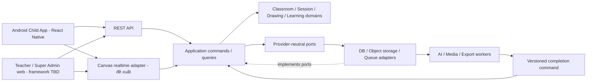

# Phân tích tái sử dụng và kiến trúc cho scope học tập sáng tạo cộng tác

- Ngày phân tích: 2026-10-10, Asia/Saigon.
- Trạng thái: source audit theo plan revision 2, cập nhật quyết định nền tảng theo [plan revision 3](../plan/PLAN.md) và [task approval](../approvals/TASK_APPROVAL.md); kiến trúc chi tiết là **PROPOSED**, chưa cho phép sửa runtime.
- Owner đã xác nhận: scope mới **thay thế** scope cũ; Child App chạy trên tablet/điện thoại Android; giữ **React Native và FastAPI**.
- Owner refinement: duyệt từng AI Sketch trước cho pilot; nhiều trẻ chung tablet chọn trẻ đang vẽ theo lượt; khi video hết retries vẫn lỗi thì chỉ Teacher chọn thử lại/bỏ qua/kết thúc. Đang generate vẫn chờ, không tự skip/fallback.
- Nguồn sản phẩm: Product Scope v1.0 được owner cung cấp; các mục CONFIRMED, PROPOSED và TBD giữ nguyên cấp thẩm quyền. [Master SRS](../../FEAT-029-master-srs/artifacts/Sketch2Life_Master_SRS.md) là tài liệu yêu cầu canonical được cập nhật trong FEAT-039.
- Phạm vi audit: working copy hiện tại, cấu hình, source, ADR và evidence có sẵn. Không nâng dependency, chạy provider, triển khai cloud, thu dữ liệu trẻ, commit hoặc push.

> Foundation amendment cùng ngày: canonical SRS là v3.1. Owner chốt một trường pilot, managed profiles + QR/mã không child login, trường thu consent với authorized Teacher/Admin ghi evidence/purposes, tuổi 36–155 tháng inclusive, target một lớp tối đa 40 trẻ, default session/artwork retention 90 ngày sau end. Những mục tương ứng còn ghi mở trong phân tích discovery bên dưới là lịch sử; decision register B17 của SRS/ADR-0014 giữ trạng thái mới nhất. Runtime/editor/sync/model/DB/queue/web/cloud và các data-class/copy policies khác chưa full freeze; target capacity chưa đo.

## 1. Kết luận và ranh giới tái sử dụng

Có thể tiếp tục dùng React Native/TypeScript cho Android, FastAPI/Python cho backend và phần lớn nền tảng AI Vision, validation, catalog, contracts và provenance. Khối lượng mới lớn nhất nằm ở **lớp/nhóm/phiên nhiều người, canvas cộng tác, adaptive sketch, video thực, portfolio bền vững và authorization sản phẩm**.

Sản phẩm cũ tổ chức trải nghiệm từ một tranh và ngữ cảnh người lớn. Sản phẩm mới tổ chức một lớp có nhiều nhóm, nhiều canvas và tiến độ riêng. Cần đưa pipeline hiểu tranh hiện có xuống thành một năng lực được classroom session gọi, thay vì kéo state machine đơn tranh thành state machine toàn lớp.

Audit không đủ cơ sở để nói toàn bộ hệ thống hiện tại đã production-ready hoặc phần trăm code có thể giữ. Một dependency được khai báo, một fixture pass và một adapter đã có source là ba loại bằng chứng khác nhau.

| Nhãn audit | Ý nghĩa trong tài liệu |
| --- | --- |
| SOURCE_IMPLEMENTED | Có source thực hiện năng lực cụ thể; không mặc nhiên chứng minh deployment hoặc chất lượng pilot. |
| DEMO_FIXTURE | Có implementation phục vụ demo/fixture, synthetic input hoặc process-local state. |
| SCAFFOLD | Có skeleton, port, dependency hoặc compose config; chưa có đường chạy production tương ứng. |
| REQUIREMENTS_ONLY | Có target/ADR/plan, chưa đủ source để kết luận đã triển khai. |
| PROPOSED / TBD | Đề xuất mới hoặc quyết định còn mở; cần ADR/approval phù hợp trước implementation. |

## 2. Công nghệ và thành phần có thể tái sử dụng

| Thành phần | Source và độ trưởng thành | Quyết định tái sử dụng / phần cần đổi |
| --- | --- | --- |
| React Native + TypeScript | [UI package](../../../apps/ui-mobile/package.json): Expo SDK `~52.0.32`, React Native `0.76.9`, React `18.3.1`; có màn hình và demo API. SOURCE_IMPLEMENTED/DEMO_FIXTURE. | **CONFIRMED giữ React Native**. Tái sử dụng screens/components, typing, API error handling. Canvas cộng tác và child join cần flow mới. |
| Bare RN foundation khác | [Foundation package](../../../apps/mobile/package.json): RN `0.87.0`, React `^19.2.0`, React Query/Zod; [fixture tests](../../../apps/mobile/__tests__/fixtureFlow.test.ts). | Hai package không cùng toolchain. Chọn một baseline Android rồi mới lập migration; không copy native modules hoặc nâng version đồng loạt trong lần sửa SRS. |
| PixiJS + GSAP | [Renderer package](../../../packages/art-renderer/package.json): `pixi.js ^8.20.0`, `gsap ^3.13.0`; [browser player](../../../packages/art-renderer/src/browserPlayer.ts), [bridge](../../../packages/art-renderer/src/bridge.ts). SOURCE_IMPLEMENTED với acceptance trực quan còn giới hạn. | Có thể giữ playback/animation tùy chọn. Đây là player cho tranh/plan, chưa phải drawing editor có stroke log, undo nhiều người, vùng vẽ và đồng bộ. |
| React Native WebView | [UI dependencies](../../../apps/ui-mobile/package.json), [renderer protocol](../../../packages/art-renderer/src/protocol.ts). | Bridge/lifecycle/typed failure có giá trị nếu canvas dùng web engine. Việc chọn WebView canvas vẫn PROPOSED; không suy ra performance vẽ từ performance playback. |
| FastAPI + Python + Pydantic | [Backend dependencies](../../../backend/pyproject.toml), [composition root](../../../backend/src/sketch2life/interfaces/http/app.py), [HTTP routers](../../../backend/src/sketch2life/interfaces/http/routers/sessions.py). SOURCE_IMPLEMENTED/DEMO_FIXTURE. | **CONFIRMED giữ FastAPI**. Giữ DTO parsing, HTTP patterns, bounded upload, typed failure; thêm classroom authorization và các use case mới. |
| Inward layers, ports/adapters | [Backend architecture](../../../docs/architecture/PYTHON_BACKEND_ARCHITECTURE.md), [application ports](../../../backend/src/sketch2life/application/ports/session_storage.py), [identity port](../../../backend/src/sketch2life/application/ports/identity.py). | Giữ nguyên nguyên tắc. Domain không biết FastAPI, SQLAlchemy, Redis, S3 hoặc model SDK; cross-module dùng hợp đồng version hóa. |
| Qwen Vision và Lightning transport | [Qwen implementation](../../../backend/src/sketch2life/infrastructure/ai/qwen_vision.py), [Lightning V2 adapter](../../../backend/src/sketch2life/infrastructure/ai/lightning_vision_v2.py), [Vision port](../../../backend/src/sketch2life/application/ports/vision_understanding_v2.py). SOURCE_IMPLEMENTED, chất lượng/phần cứng phải đo riêng. | Giữ recognition/structured observations, timeout và provider validation. Đầu vào mới nên là canvas snapshot/revision, topic, age, request scope; không gửi mỗi pointer event sang GPU. |
| ASR faster-whisper | [Adapter](../../../backend/src/sketch2life/infrastructure/ai/faster_whisper_asr.py), [runtime config](../../../backend/src/sketch2life/infrastructure/ai/faster_whisper_runtime_config.py), optional dependency trong pyproject. SOURCE_IMPLEMENTED/benchmark. | **Tùy chọn** khi lời trình bày cần ghi âm và consent cho phép. Không đưa microphone thành requirement mặc định của scope mới. |
| SAM2.1/auto-rig | [Segmentation adapter](../../../backend/src/sketch2life/infrastructure/ai/lightning_sam21.py), [auto-rig service](../../../backend/src/sketch2life/application/services/auto_rig/service.py), [mask validation](../../../backend/src/sketch2life/application/services/auto_rig/mask_validation.py). | Giữ khi cần segmentation/animation. Không phải model tạo line sketch; không bắt buộc SAM/auto-rig cho core canvas hoặc AI Sketch. |
| Image admission/validation | [Admission service](../../../backend/src/sketch2life/application/services/image_admission.py), [domain admission](../../../backend/src/sketch2life/domain/understanding/image_admission.py), [decoder](../../../backend/src/sketch2life/infrastructure/media_validation/av_image_decoder.py). SOURCE_IMPLEMENTED. | Tái sử dụng kiểm format, kích thước, metadata, bounded payload cho snapshot/export. Nhập ảnh từ ngoài vẫn OD09, không tự bật chức năng đó. |
| Confirmed understanding / Gate A | [Supervised flow](../../../backend/src/sketch2life/application/services/supervised_flow.py), [Gate A schemas](../../../backend/src/sketch2life/contracts/schemas/gate_a.py). SOURCE_IMPLEMENTED/DEMO_FIXTURE. | Giữ khả năng sửa/từ chối nhận diện và ghi nguồn ý định trẻ. Reviewer thành Teacher theo quyền lớp; không xem nhận diện AI là sự thật cuối cùng. |
| Catalog, semantic matching, activity discovery | [P1 compiler](../../../backend/src/sketch2life/application/services/p1_experience.py), [catalog adapter](../../../backend/src/sketch2life/infrastructure/catalog/p1_catalog.py), [ADR-0012](../../../docs/adr/ADR-0012-topic-age-complete-montessori-discovery.md). SOURCE_IMPLEMENTED với catalog review riêng. | Tái sử dụng implementation full topic+exact-age discovery/preference ranking hiện có như candidate. Baseline cũ không loại theo readiness/history/material availability; áp dụng nguyên policy vào lớp/nhóm mới là PROPOSED, không yêu cầu confirmed của scope mới. Safety/preparation trước thực hiện cần policy riêng. |
| Activity/objective approval / Gate B | [P1 schemas](../../../backend/src/sketch2life/contracts/schemas/p1_experience.py), [approve_gate_b](../../../backend/src/sketch2life/application/services/supervised_flow.py). SOURCE_IMPLEMENTED/DEMO_FIXTURE. | Giữ approval gắn đúng ID/version, stale checks. Không dùng một Gate B để mặc nhiên phê duyệt sketch, knowledge script và video; chúng có approval records riêng. |
| Reviewed media cache/resolver | [Resolver](../../../backend/src/sketch2life/application/services/learning_media_resolver.py), [media schemas](../../../backend/src/sketch2life/contracts/schemas/learning_media.py). DEMO_FIXTURE. | Có thể giữ cache identity/version/hash và reviewed status. Resolver hiện không sinh video; production library và teacher approval per-session cần bổ sung. |
| Legacy media fallback | [Fallback](../../../backend/src/sketch2life/application/services/learning_media_fallback.py). DEMO_FIXTURE; có still narration/whole image/supervised handoff. | Giữ source để đối chiếu. **Không áp dụng automatic fallback vào video mới**: đang generate chờ; exhausted failure do Teacher retry/skip/end, theo OD01 đã chốt. |
| Session version/idempotency/typed errors | [Ephemeral service](../../../backend/src/sketch2life/application/services/ephemeral_sessions.py), [storage ports](../../../backend/src/sketch2life/application/ports/session_storage.py), [lock pool](../../../backend/src/sketch2life/application/services/session_lock_pool.py). DEMO_FIXTURE. | Giữ mẫu command retry, stale result, compare-and-swap. Thay process-local storage/locks bằng durable transaction/concurrency policy khi integration được duyệt. |
| Original/derivative provenance | [Artifact store](../../../backend/src/sketch2life/infrastructure/storage/in_memory.py), [auto-rig schemas](../../../backend/src/sketch2life/contracts/schemas/auto_rig.py). SOURCE_IMPLEMENTED/DEMO_FIXTURE. | Giữ original hash và derivative references. Canvas mới cần operation history, accepted revision, contribution attribution và AI layer riêng. |
| Gallery/feedback | [Workflow records](../../../backend/src/sketch2life/contracts/schemas/workflow_records.py), [record_feedback/read_gallery](../../../backend/src/sketch2life/application/services/supervised_flow.py). DEMO_FIXTURE. | Giữ identity-linked observations và projection pattern; chưa phải portfolio nhiều phiên, nhiều teacher hoặc progress report bền vững. |
| PostgreSQL / SQLAlchemy / Alembic | [pyproject](../../../backend/pyproject.toml), [compose](../../../compose.yaml). SCAFFOLD. | Đề xuất transactional source of truth cho lớp/session/permissions/approvals/portfolio. Chưa có production repository/migration adapter được xác nhận trong audit. |
| S3-compatible / MinIO / boto3 | [compose](../../../compose.yaml), [pyproject](../../../backend/pyproject.toml), [artifact port](../../../backend/src/sketch2life/application/ports/session_storage.py). SCAFFOLD/port. | Đề xuất lưu snapshot/media/exports qua backend-owned ports; source không chứng minh upload/download/purge production đã nối. |
| Redis / RQ | [pyproject](../../../backend/pyproject.toml), [compose](../../../compose.yaml). SCAFFOLD. | Đề xuất queue/cache/presence tùy ADR; job truth và durable canvas không chỉ nằm trong Redis. Chưa có production RQ wiring được xác nhận. |
| Firebase Authentication | [Identity verifier protocol](../../../backend/src/sketch2life/application/ports/identity.py), [ADR-0005](../../../docs/adr/ADR-0005-auth-release-and-ai-provider-strategy.md). REQUIREMENTS_ONLY/port ở backend audit. | Candidate giữ auth adult; child participant join tách riêng. Firebase Storage/Firestore/Realtime Database vẫn bị cấm bởi [AGENTS](../../../AGENTS.md). |
| Tests và validators | [Contract tests](../../../backend/tests/contract/test_session_http_api.py), [unit media tests](../../../backend/tests/unit/test_learning_media_scenario_matrix.py), [real-AI E2E](../../../backend/tests/e2e/test_lightning_backend_workflow.py), [security validator](../../../tools/validate_repository_security.py). | Giữ test harness và synthetic fixture approach; thêm collab/recovery/teacher authorization scenarios. Không coi sự tồn tại test là test đã pass ở lần audit này. |

## 3. Khoảng trống theo 14 module sản phẩm

| Module | Có thể kế thừa | Năng lực còn thiếu / thay đổi chính |
| --- | --- | --- |
| M01 Identity, Roles & Permissions | Identity port, typed actor metadata, nguyên tắc backend authorization. | Teacher/Super Admin auth, ChildParticipant join, session/device scopes, teacher-class relation, revoke; hiện marker `demo:local` không phải auth. |
| M02 Class & Student Management | Catalog age metadata, context DTO. | Class, enrollment, teacher assignment, hồ sơ trẻ và consent records bền vững; scope một/nhiều tổ chức OD06. |
| M03 Session Lifecycle & Orchestration | Version/idempotency, job/progress DTO, stale result handling. | ClassroomSession lifecycle, pause/resume/end early/recover, teacher override, group-independent phase, durable orchestration. |
| M04 Group Management | Không có runtime group domain tương đương được xác nhận. | Membership, group canvas binding, chuyển trẻ giữa nhóm, preserve contributions, group progress và Phase 2 chia nhóm tự động có teacher control; grouping criteria/mixed-age policy TBD. |
| M05 Collaborative Drawing Canvas | RN host, WebView bridge nếu chọn web canvas, original preservation. | Drawing engine, shared/free canvas/regions, permission locks, operation log, undo/recovery, shared-device attribution; renderer cũ không đáp ứng trực tiếp. |
| M06 AI Vision & Adaptive Sketch | Vision/validation/scene contracts, confirmed meaning. | Drawing-process context, nhiều mức/overlay, queue duyệt từng Sketch cho pilot, child hide/reject và separate AI layer; trigger thresholds/implementation chưa chốt. |
| M07 Artwork Gallery & Sharing | Session journey/gallery projection pattern. | Gallery lớp, select/present/annotate, submission revisions, scope visibility, contribution display theo OD03; không suy ra public/social sharing. |
| M08 Knowledge & Video Generation | Reviewed-media identity, source/provenance patterns, typed job contracts. | Knowledge corpus/review, actual video generation/assembly, teacher content review, common-class content/optional personalization, wait/failure lifecycle với Teacher explicit retry/skip/end; retry budget TBD. |
| M09 Off-screen Activity Library | Catalog templates/objectives/materials/steps, discovery và Gate-B identities. | Teacher authored/editable activity governance, class/group applicability, versioned override, safety feasibility before execution. Readiness/materials không tự trở thành discovery filters. |
| M10 Assessment & Learning Portfolio | Feedback observations gắn identity approved experience. | Longitudinal portfolio, process evidence, teacher comments/corrections, rubric age-aware, authorized reports; AI gợi ý không tự thành đánh giá cuối. |
| M11 Teacher Dashboard & Automation | Có các projection/API/error patterns; UI demo có thể tái sử dụng component. | Desktop live dashboard, previews, group controls, review queues, presets/conditions/manual override, simultaneous workload; framework web TBD. |
| M12 Super Admin Console | Có yêu cầu audit/config/auth boundaries. | User/class/content governance, policy configuration, monitoring/report scopes, admin provisioning; quyền quản trị không mặc nhiên raw child content access. |
| M13 Privacy, Consent & Audit | Redaction, immutable provenance, synthetic evidence rules. | Legal representative consent không cần portal Parent, retention/export/delete, durable access/decision audit, provider-copy deletion, tenant isolation nếu đa tổ chức. |
| M14 Recovery & Exception Handling | Typed failures, bounded retry, stale checks, renderer watchdogs. | Offline/reconnect canvas, interrupted classroom recovery, teacher disconnect, group changes, duplicate ops, revoked permissions, rejected pending approvals, durable recovery checkpoints. Video fallback cũ không quyết định OD01. |

## 4. Kiến trúc đề xuất

### 4.1 Modular monolith với các domain rõ ràng

Một backend modular monolith là lựa chọn khởi đầu hợp lý cho đội hiện tại. Các module chức năng không cần trở thành 14 deployable services. [ADR-0001](../../../docs/adr/ADR-0001-modular-monolith-first.md) hiện là PROPOSED; quyết định deployment mới cần ADR được chấp nhận riêng.

Chiều dependency của source là **interfaces → application → domain**; infrastructure implements ports. Mũi tên runtime gọi port/worker trong hình không cho phép domain import adapter. Worker phải trả kết quả qua application completion command, không viết tùy ý vào bảng của module khác.

| Domain/module kỹ thuật | Trách nhiệm và aggregate đề xuất |
| --- | --- |
| Identity/Consent | AdultPrincipal, TeacherAssignment, ChildParticipationGrant, ConsentRecord; kiểm tra quyền theo tài nguyên. |
| Classroom | Class, Enrollment, StudentProfile; quan hệ hợp lệ và lịch sử thay đổi. |
| Session | ClassroomSession, GroupSession/GroupProgress, Participant, PresetSnapshot; teacher orchestration. |
| Drawing | CanvasDocument, CanvasRegion, StrokeOperation, CanvasRevision, Submission; provenance và quyền chỉnh sửa. |
| AI Assistance | AssistanceRequest, AnalysisJob, SketchProposal, ReviewDecision; gợi ý và từ chối. |
| Knowledge/Media | KnowledgeDraft, reviewed sources, VideoJob, MediaRevision, TeacherApproval, PlaybackState. |
| Activities | ActivityVersion, ObjectiveVersion, ActivitySelection, Preparation/ExecutionDecision; reuse catalog. |
| Portfolio/Assessment | EvidenceEntry, TeacherObservation, AssessmentSuggestion, approved assessment, report projection. |
| Governance/Operations | Content publication/revocation, privacy requests, security audit, operational telemetry. |

`ClassroomSession` giữ mốc chung; `GroupProgress` giữ nhịp riêng; `CanvasRevision` giữ sản phẩm; `AnalysisJob`/`VideoJob` giữ async work. Mỗi đơn vị có version thích hợp. Một nhóm Ready không tự chuyển cả lớp; result AI dựa trên revision cũ không được áp dụng vào canvas mới mà không revalidation.

Đề xuất giữ các workflow cũ dưới tên ngữ nghĩa `ArtworkExperience` hoặc `ArtworkAnalysisPipeline`. Giữ V1 contracts để đọc lịch sử/demo; tạo contracts mới cho classroom/group/child grants, không sửa ngầm V1 thành multi-child runtime.

### 4.2 Worker riêng cho tác vụ chậm

API/realtime process xử lý command nhỏ, quyền và synchronization. AI Vision, adaptive sketch, video, export/report chạy trên worker thích hợp; GPU profile và concurrency không cố định trong SRS.

Job envelope nên có contract version, resource scope, source canvas/content revision/hash, requesting actor, applicable policy version, idempotency key và cancellation scope. Completion kiểm lại quyền, current revision, content review và lifecycle trước publish.

Lightning hiện là development/model-test plane qua backend-only adapter; Runpod là production target của baseline cũ, chưa phải production implementation đã có. Scope mới không chốt provider/model; owner cần xác nhận giữ hay đổi lựa chọn cũ trong ADR mới. Child/Teacher clients không giữ AI endpoint secrets hoặc storage credentials.

## 5. Canvas và đồng bộ: các lựa chọn cần đo

### 5.1 Drawing engine trên Android

| Candidate | Lý do xem xét | Điều phải kiểm chứng |
| --- | --- | --- |
| React Native Skia, compatible version TBD | Engine đồ họa native trong RN; candidate cho touch drawing và local stroke rendering. [Official repository](https://github.com/wcandillon/react-native-skia). | Compatibility với baseline RN/Expo đã chọn, thiết bị tablet/phone, gestures/stylus nếu có, memory, export/replay, nhiều nét và shared-device UX. Chưa cài/chưa benchmark. |
| PixiJS trong WebView, editor mới | Có sẵn expertise/bridge playback; candidate dùng cùng renderer model cho mobile/web preview. Pixi có [Graphics primitives](https://pixijs.com/8.x/guides/components/scene-objects/graphics). | Pointer/gesture latency, WebView bridge batching, memory/recovery, coordinate transform, stroke data/undo/regions. Cần xây editor mới; playback hiện có không chứng minh các năng lực này. |

Khuyến nghị benchmark một drawing vertical slice nhỏ trên hai thiết bị đại diện trước chọn. Dùng cùng canonical stroke format và scenario: brush/eraser/zoom/undo, nhiều người, reconnect, lock region, export và replay. Đặt ngưỡng acceptance theo pilot sau khi owner chốt; không tự cam kết fps/latency trong tài liệu.

Skia/Pixi chỉ render; canvas quyền, đồng bộ, lịch sử và contribution attribution phải được định nghĩa độc lập. Không lấy raster screenshot làm bản duy nhất để hoàn tác hoặc xác định đóng góp.

### 5.2 REST polling cho jobs, realtime cho nét vẽ

Baseline cũ dùng bounded HTTP polling cho async progress. Có thể giữ REST + polling cho Vision/video/export jobs. Đề xuất WebSocket cho stroke operations, presence và teacher live events; FastAPI có [WebSocket support](https://fastapi.tiangolo.com/advanced/websockets/).

Đây là **PROPOSED update** đối với decision polling cũ, cần ADR nêu rõ loại dữ liệu realtime, auth/revoke, room scope, recovery và capacity. WebSocket không tự cung cấp CRDT, persistence, tenant isolation hoặc quyền canvas.

### 5.3 Server-ordered stroke log và Yjs

| Lựa chọn | Mô hình đề xuất | Tradeoff cần benchmark |
| --- | --- | --- |
| Server-ordered operations | Client render local preview; gửi op ID/client sequence/base revision. Application kiểm quyền, dedupe, cấp server sequence và ghi durable log trước accepted broadcast. Snapshot + missing-op replay phục hồi. | Dễ gắn teacher region locks/undo authorization; cần xử lý latency, batch, ordering, offline pending ops và multi-process sequencing. Không dùng một global session version cho từng điểm chạm. |
| Yjs/CRDT candidate | Dùng shared document representation cho strokes/objects; sync adapter trao đổi updates; authorization và durable checkpoints do backend policy quản lý. [Yjs documentation](https://docs.yjs.dev/). | Cần kiểm mobile/web integration, document growth, storage/GC, granular rights và cách reject changes ngoài vùng. CRDT convergence không tự đáp ứng quyền Teacher. |

Khuyến nghị dùng server-ordered log làm prototype so sánh đầu tiên vì core vẽ có stroke identity và teacher control rõ. Chọn Yjs nếu benchmark cho thấy nhu cầu concurrent object edits/offline merge và lợi ích đủ lớn. Đây là đề xuất nghiên cứu, chưa freeze algorithm/transport/schema.

Undo là một authorized operation có history, không xóa ngầm đóng góp của bạn. Với Yjs, [UndoManager](https://docs.yjs.dev/api/undo-manager) có tracked origins nhưng vẫn cần quy tắc nghiệp vụ undo own/group/teacher và shared-device attribution.

Mất kết nối giữ pending local ops có trạng thái rõ. Reconnect tải accepted revision, đối chiếu quyền hiện tại, dedupe/replay; pending op bị reject không được báo đã lưu. Teacher pause/lock/revoke phải được áp dụng cả khi client cũ gửi lại hàng đợi.

Owner chốt nhiều trẻ chung máy chọn active child theo lượt. Mỗi operation ghi selected contributor/turn context của lúc vẽ, không gán lại nét cũ khi switch. Đây là declared attribution theo UI, không là biometric proof; verified device/principal capability vẫn luôn có để authorize. Switching UX/correction/undo cần thiết kế; không suy identity từ touch hoặc hành vi.

## 6. Vai trò storage, auth và event history

| Lớp lưu trữ đề xuất | Dữ liệu/trách nhiệm | Giới hạn |
| --- | --- | --- |
| PostgreSQL qua repository ports | Class/enrollment/session/group, authorization, grants, consent, approvals, job states, activity versions, portfolio metadata, durable audit; canvas operations/checkpoint metadata nếu benchmark chọn. | Transaction/CAS/migrations chưa có production wiring trong audit; không direct database coupling giữa modules. |
| Object storage S3-compatible | Immutable canvas snapshots/exports, AI derivatives, approved video/audio, report files; metadata/hash/reference trong DB. | Backend-owned authorization/capabilities; không bucket credentials trong mobile. Retention/provider copies/export scope cần policy. |
| Redis | Optional presence/cache/pub-sub/rate limits, queue backend nếu RQ được chọn. | Presence không phải enrollment; cache không phải session truth; pub-sub không phải operation replay log bền vững. |
| RQ hoặc queue adapter khác | Bounded jobs/retry/cancellation cho CPU/media/GPU coordination. [RQ documentation](https://python-rq.org/docs/). | Chọn phù hợp deployment/worker needs trong ADR; declarations không chứng minh durable end-to-end job workflow hiện tại. |
| Device local store, công nghệ TBD | Pending stroke queue và recovery checkpoint tối thiểu theo consent/retention policy. | Production local persistence cần scope approval; không coi volatile demo profile là durable student record. |

Đề xuất Firebase Authentication tiếp tục xác thực Teacher/Super Admin, với ID token do backend verify theo [official guide](https://firebase.google.com/docs/auth/admin/verify-id-tokens). Sau identity verification, domain kiểm TeacherAssignment, Class/Session scope và permission version. Super Admin provisioning/break-glass vẫn cần policy mới.

Child là actor sản phẩm đã CONFIRMED, còn credential implementation chưa chốt. Đề xuất ChildParticipant join grant được Teacher xác nhận, có expiry và scope class/session/device; QR/mã và profile join không cần mặc nhiên tạo Firebase user cho trẻ. Legal guardian consent vẫn cần record/verifiable process ngay khi không có Parent portal.

Phân biệt ba lịch sử: canvas/process evidence; business state/approval events; security access/audit records. Logs/metrics/traces chỉ phục vụ vận hành, đã redaction; không lưu raw canvas, transcript, tokens hoặc secrets vào telemetry.

## 7. AI và knowledge video theo scope thay thế

Vision hiện có phù hợp để đọc snapshot và trả candidates; cần ghi `source_canvas_revision`/hash, subject intention đã xác nhận và uncertainty. Vision không chứng minh trẻ thiếu kiến thức khi dừng vẽ. Tín hiệu thời gian/thao tác chỉ hỗ trợ đề nghị trợ giúp theo policy được duyệt.

AI Sketch là năng lực mới: proposal có riêng geometry/image reference, intended assistance, provenance, scope và review status. Owner chốt Teacher duyệt từng gợi ý trước cho pilot; Child nhận nội dung được phép rồi có thể ẩn/từ chối. Gợi ý không sửa stroke gốc hoặc tự thành contribution của trẻ.

Qwen3-VL-8B là candidate recognition đã có hướng tích hợp; [model card](https://huggingface.co/Qwen/Qwen3-VL-8B-Instruct) là nguồn capability, không chứng minh chất lượng đọc tranh trẻ hoặc latency lớp học. SAM/ASR/Pixi animation giữ vai trò tùy chọn và không được làm điều kiện để hoàn thành core scope.

Knowledge pipeline đề xuất: confirmed artwork/topic + phần trình bày được phép → query reviewed knowledge → draft/script có source claims → teacher content review → video generation/library resolution → validate/safety review → teacher approval đúng final revision → trình chiếu. Phê duyệt script trước render là đề xuất workflow để giảm chi phí; requirement đã chốt là Teacher phê duyệt trước trình chiếu.

[Wan2.2 TI2V-5B](https://huggingface.co/Wan-AI/Wan2.2-TI2V-5B) là candidate từ hướng video cũ, cần benchmark/license/deployment review nếu giữ. Scope mới không tự chốt Wan, thời lượng 40–60 giây, L4, ngôn ngữ/TTS hoặc ngân sách; không nêu speed/cost claim chưa đo.

**Video đang tạo phải chờ**, có progress và trạng thái Generating/Ready for Review/Approved/Playing/Failed. Giáo viên có thể tổ chức trao đổi lúc chờ theo đề xuất nguồn; không automatic fallback/skip. Sau các retries được phép vẫn lỗi, owner chốt Teacher explicit retry/skip/end; ghi disposition và không báo skipped video là generated/completed. Retry budget/backoff/timeout chưa chốt.

Library asset phải active/reviewed phù hợp scope và gắn version/hash. Teacher approval cho presentation trong phiên phải kiểm đúng revision; đổi content/source/audience làm approval cũ không còn áp dụng. Off-screen activity do Teacher chọn/edit cho lớp/nhóm, với safety/preparation decision riêng.

## 8. Trình tự migration và phân kỳ phát triển

| Bước phụ thuộc | Đầu ra để review | Gate trước implementation/acceptance |
| --- | --- | --- |
| 0. Documentation baseline | SRS thay thế, backup v2.0, reuse matrix, open decisions và proposed ADR. | Documentation scope đã approved; không sửa runtime trong FEAT-039. |
| 1. Identity/classroom/contracts | Teacher/Class/Student/Participant/Group models, active-child turns, consent scope, age policy, versioned fixtures. | OD03 nguyên tắc đã chốt; thiết kế chuyển lượt và OD04/05/06/upper age boundary cần refinement; approval mới. |
| 2. Drawing/sync benchmark | Native/WebView prototype, canonical operations, permission/undo/reconnect scenarios; benchmark server log vs Yjs. | ADR chọn toolchain/engine/sync theo evidence; chốt device/capacity acceptance. |
| 3. Session orchestration + durable adapters | Class/group state, pause/resume/recovery, repository/storage/queue integration, teacher dashboard projection. | Authz/revoke/idempotency/restore tests; integration allocation riêng. |
| 4. Adaptive AI + video | Snapshot analysis, per-Sketch review/child rejection, knowledge sources/video wait/review/manual exhaustion choices. | OD01/02 đã chốt behavior; retry/queue/model budget, review bindings và quality evaluation cần thiết kế; no real child data in development. |
| 5. End-to-end learning session | Join → draw/collab → AI help → gallery → approved video → off-screen → reflection → saved results. | Source AC01–AC18 coverage phù hợp increment; classroom/pilot validation chưa được coi đã pass. |
| 6. Operations/intelligence/administration | Presets, full portfolio/reporting, publication/revocation, privacy export/delete, operational dashboards và scale. | Pilot metrics/SLO/capacity/retention verification; security tối thiểu đã có từ bước đầu. |

Trình tự trên là dependency roadmap phục vụ triển khai, không đổi full product scope hay bỏ video/sketch để giảm khó. Phase 1–4 trong source vẫn định hướng complete session → classroom operations → content/portfolio → full administration; capacity và quality được tăng theo evidence.

**Roadmap không phải phân công bốn người.** [ADR-0006](../../../docs/adr/ADR-0006-parallel-sprint-allocation.md) giữ Sprint 1 là bốn workstream độc lập fixture/contract; integration có allocation và approval riêng. Không mặc định Person 3 ôm toàn Android, Person 4 ôm backend/infra/E2E. Nếu replacement scope cần đổi workstream ownership, phải proposed ADR/allocation mới thay vì viết ngầm trong SRS.

## 9. Rủi ro và câu hỏi cần chốt

| Quyết định/rủi ro | Tại sao ảnh hưởng kiến trúc | Trạng thái |
| --- | --- | --- |
| Tuổi “3–12” chính xác | Lower 3 = 36 completed months; upper có bao gồm toàn năm 12 đến trước 13 hay dừng mốc 12 cần xác nhận. UX bands khác catalog labels. | TBD; không tự chọn 143/155 tháng. |
| Một/nhiều tổ chức; một/nhiều lớp đồng thời | Tenant keys, authorization, DB isolation, workload, backup và deployment. | OD06/TBD; các số 32 trẻ/8 nhóm trong mockup không phải capacity commitment. |
| Pilot devices/network/group size | Native canvas vs WebView, operation batching, reconnect UX và acceptance. | Android đã chốt; thiết bị, mạng, concurrency chưa chốt. |
| AI sketch duyệt từng lần | Review queue load, approval scope/version, auto-trigger safety và teacher control. | Owner chốt per-suggestion cho pilot; không preset preapprove. |
| Video fail hoàn toàn | Manual failure transitions, retry limits và lesson continuity. | Owner chốt Teacher retry/skip/end; không automatic fallback/skip, budget còn TBD. |
| AI ngân sách/provider/model | Queue concurrency, cold start/timeout, serving/licensing, teacher wait và content quality. | TBD; Lightning/Runpod cũ không tự đóng quyết định scope mới. |
| Shared device contribution | Portfolio evidence và undo rights; device ID không đủ attribution. | Owner chốt active-child turn selection; switching/correction design proposed. |
| Consent/retention/export/delete | Student enroll, AI use, object lifecycle, device/provider copies và report privacy. | OD04/05; không giữ nguyên mặc định 30/60/90 ngày từ scope cũ. |
| Rubrics/screen time/rewind/canvas tools | Age UX, state transitions, automation và evaluation evidence. | OD07/08/09/10/11/12; cần refinement theo nguồn. |
| RN toolchain drift | UI app `0.76.9` khác foundation `0.87.0`; native library compatibility không suy từ tên framework. | Candidate ADR; chưa nâng dependency. |
| Library governance | Publication/version/withdrawal và classroom reuse cần review scope; catalog hiện có chưa đủ chứng minh mọi record qualified. | Reviewer/workflow TBD; preserve provenance. |

Parent portal, payment/credits, public social sharing, free chat và marketplace không được đưa lại vào new scope từ hệ thống cũ. Giữ lịch sử/source/code không đồng nghĩa tiếp tục bắt buộc các tính năng đó trong SRS thay thế.

## 10. Verification cần bổ sung khi implementation được duyệt

Đây là thiết kế verification cho các increment tương lai, không phải danh sách test đã chạy trong FEAT-039. Mỗi test phải kiểm hành vi người dùng/quyền/toàn vẹn dữ liệu và dùng fixture/synthetic input trước pilot.

| Scenario | Kết quả cần kiểm chứng | Source AC |
| --- | --- | --- |
| Tạo phiên/preset và join | Teacher đúng lớp tạo được phiên; cả phương thức join đã chốt được teacher xác nhận; join ngoài scope bị reject. | AC01, AC02, AC14 |
| Nhiều trẻ một máy | Chọn active child theo lượt; nét mới ghi selected contributor; switch không gán lại nét cũ, verified capability vẫn required. | AC03, AC12 |
| Canvas vùng/quyền/công cụ | Các trẻ chỉ sửa phạm vi được phép; teacher lock/pause và tool config có hiệu lực; undo bảo toàn nét người khác. | AC04, AC05, AC14 |
| Retry/reconnect/crash | Duplicate op không nhân đôi nét; accepted state phục hồi; pending rejected ops không được báo đã lưu; restart backend không làm mất history. | AC04, AC13 |
| Nhóm có nhịp riêng | Group Ready không tự đổi phase cả lớp; teacher có thể pause/continue/draft theo quyền và lifecycle. | AC08, AC13, AC18 |
| Sketch approval/revision | Gợi ý cần duyệt không đến Child trước approval; stale/revoked proposal bị chặn; Child có thể ẩn/từ chối. | AC06, AC07, AC16 |
| Gallery và video | Chọn/present/annotate đúng revision; unapproved không play; generating chờ; exhausted failure chỉ Teacher retry/skip/end, không automatic skip. | AC09, AC10, AC16 |
| Activity discovery/execution | AI đề xuất từ library, Teacher chọn/chỉnh cho class/group; kiểm safety/preparation theo policy được duyệt. Chỉ kiểm full topic+age/no-readiness-filter semantics nếu owner chọn áp dụng candidate ADR-0012 vào scope mới. | AC11 |
| Assessment/portfolio | Process, AI suggestion, teacher observation phân biệt nguồn; report phản ánh progress của chính trẻ; không ranking giữa trẻ. | AC12, AC17 |
| Consent/export/delete/audit | Ngoài quyền hoặc consent scope bị chặn; xuất/xóa theo policy có evidence; audit tối thiểu không chứa raw secrets/child media. | AC14, AC15, AC16 |
| Automation/manual override | Teacher override hợp lệ thắng automation; queued/stale action không tiếp tục tác động sau revoke/pause/end. | AC18, AC13 |

Benchmark canvas/model/video cần giữ source revision, device/network profile, workload, failure cases và kết quả thô được sanitize trong feature evidence. Tỷ lệ synthetic pass không thay thế pedagogical review hoặc đánh giá pilot; quality, latency, memory và cost cần threshold được owner duyệt.

## 11. Source audit findings và giới hạn bằng chứng

Các finding sau được đọc từ working copy ngày 2026-10-10; có thể tồn tại thay đổi chưa commit của owner. Chúng mô tả source hiện tại, không khẳng định runtime mới đã triển khai.

1. [Composition root](../../../backend/src/sketch2life/interfaces/http/app.py) dòng 134 gọi API là local image-only/ephemeral; dòng 227–249 inject in-memory artifacts/idempotency/jobs/sessions/workflow store. Không thấy production PostgreSQL/S3/Redis/RQ adapters được wired tương ứng trong audit.
2. [Identity port](../../../backend/src/sketch2life/application/ports/identity.py) là `Protocol`; [session service](../../../backend/src/sketch2life/application/services/ephemeral_sessions.py) dùng `DEMO_ACTOR_REF = "demo:local"`; [sessions router](../../../backend/src/sketch2life/interfaces/http/routers/sessions.py) kiểm `X-Actor-Ref`. Đây không phải Firebase token verification hoặc TeacherAssignment authorization.
3. [Workflow records](../../../backend/src/sketch2life/contracts/schemas/workflow_records.py) ghi rõ `SessionGalleryV1` và `SessionSnapshotV1` có `durable: Literal[False]`. Gallery hiện tại không phải longitudinal portfolio.
4. [Child age policy](../../../backend/src/sketch2life/domain/child_age.py) vẫn min 0, max 107 tháng và bands 0–3/3–6/6–9. Runtime chưa được sửa trong FEAT-039; thay SRS không làm guard này tự thành 3–12.
5. [ADR-0008](../../../docs/adr/ADR-0008-child-profile-ownership-guide-assignment-and-observability.md) là requirements baseline với physical implementation TBD; one-owner caregiver, time-bound GuideAssignment và one-child Guide session là mô hình cũ cần replacement compatibility decision, không phải facts đã có DB/auth production.
6. [ADR-0012](../../../docs/adr/ADR-0012-topic-age-complete-montessori-discovery.md) và B33 của SRS v2.0 trước replacement đã supersede các discovery readiness/history/material hard filters. [Supervised flow](../../../backend/src/sketch2life/application/services/supervised_flow.py) có full activity-suggestions path và [P1 compiler](../../../backend/src/sketch2life/application/services/p1_experience.py) có versioned context. Legacy policies còn source không được tái gắn nhãn current policy.
7. [Resolver](../../../backend/src/sketch2life/application/services/learning_media_resolver.py) trả `generation_called=False`; [backend workflow](../../../backend/src/sketch2life/application/services/backend_ai_workflow.py) dùng `DeferredVideoV1`; supervised flow có `video_executed=False`/`video_placeholder_only=True`. Chưa chứng minh actual video synthesis.
8. [Real-AI E2E](../../../backend/tests/e2e/test_lightning_backend_workflow.py) skip trừ khi environment flag bật và assert video `DEFERRED`. Test code không đồng nghĩa đã chạy real provider trong audit này.
9. [FEAT-038 evidence](../../FEAT-038-lightning-vision-startup/evidence/IMPLEMENTATION_20261009.md) chỉ xác nhận Bash syntax/import correction; không remote launch/model load/inference. Không dùng làm bằng chứng remote AI readiness.
10. [FEAT-037 status](../../FEAT-037-registration-age-genai-payment-alignment/status/STATUS.md) ghi age amendments manual review, automated runtime tests chưa chạy. [FEAT-018 status](../../FEAT-018-live-image-canvas-flow/status/STATUS.md) ghi các test history và phần live/Android visual acceptance còn mở; không chuyển chúng thành passes của lần audit này.
11. UI/foundation/renderer version facts lấy trực tiếp từ package manifests liên kết ở mục 2; ranges là declarations, không mặc nhiên installed locked versions. Không nâng RN/Expo/Pixi hoặc thêm drawing dependency trong documentation task.

Nguồn official được đối chiếu ngày 2026-10-10: các liên kết FastAPI, Yjs/UndoManager, Firebase, RQ, Pixi, Qwen, Wan và Skia ở trên dùng để kiểm khả năng/candidate design. Không có inference benchmark mới, cost estimate hoặc license approval mới. Skia documentation homepage đã chuyển địa chỉ; official GitHub repository xác nhận tên dòng sản phẩm, việc chọn package/version tương thích vẫn TBD.

Tài liệu này chỉ ghi phân tích và đề xuất. Runtime migration, contract/schema changes, deployment, external provider execution và asset application cần feature plan, approval và evidence riêng theo [AGENTS](../../../AGENTS.md).
