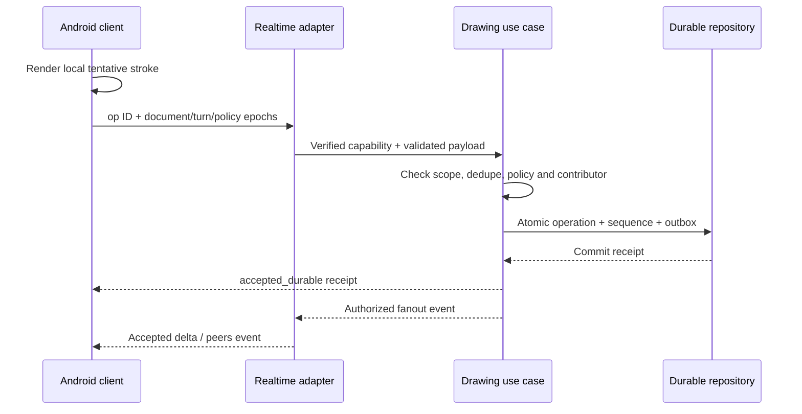

## B19. Nền tảng hành vi, policy và tính nhất quán

### B19.1 Phạm vi đặc tả chi tiết và thứ tự đọc

Các phần B19–B26 mở rộng B1–B18 thành yêu cầu có thể phân rã cho backend, Android, Teacher Desktop, Admin và QA. Đây là logical specification, chưa phải runtime implementation hoặc contract được adopt. Các dòng `OWNER_CONFIRMED` có căn cứ ở answers; các chi tiết thiết kế mới là `PROPOSED` cho owner review. Khi chi tiết chưa được chấp thuận, implementation phải có decision/approval cho phần tương ứng thay vì suy rằng chữ “phải” trong một proposal đã cấp quyền.

Giữ mã FR001–FR066. B20 cung cấp use case `UC-001` trở đi và acceptance `AT-UC-*`; chúng khác catalogue tóm tắt UC01–UC13. B21 là data dictionary; B22 là contract/interface; B23 là UI; B24 là privacy; B25 là chất lượng; B26 là truy vết/gates. Không đổi tên hoặc ý nghĩa contract V1 đang chạy bằng các tên đề xuất trong tài liệu.

Thẩm quyền trong tài liệu: owner answers hiện tại → CONFIRMED product requirements/security invariants → detailed refinements đã được owner xác nhận → PROPOSED detailed design → TBD. Chi tiết B19–B26 làm rõ section tổng quan cùng chủ đề; không ghi đè một quyết định confirmed bằng một proposal. Không áp dụng các addendum v2.0 khi scope mới không giữ hành vi đó.

### B19.2 Policy registry dùng chung

Mọi giá trị ở cột “Candidate” là `PROPOSED` nếu chưa có owner answer riêng. Đơn vị, mục đích, version và cách thay đổi phải rõ. Không copy số magic riêng vào từng app/service. Server trả effective policy của session/tool/capability cho UI; client tối đa làm kiểm tra sớm, server vẫn xác thực.

| Key | Candidate / trạng thái | Đơn vị và semantics | Ai có quyền đổi / giới hạn |
|---|---|---|---|
| AGE_MIN_MONTHS | 36, OWNER_CONFIRMED | Completed months từ đủ 3 do adult xác nhận; không suy từ media | Policy version; không sửa dữ liệu lịch sử im lặng |
| AGE_MAX_MONTHS | 155 inclusive, OWNER_CONFIRMED | Bao gồm trọn năm 12; 156 tháng/đủ 13 ngoài target | Exact computation/date boundary cần contract fixtures |
| AGE_UI_BANDS | 36–71 / 72–107 / 108–155, PROPOSED month mapping | UX 3–5 / 6–8 / 9–12 confirmed; exact activity ages độc lập | Theo age-policy version; không suy curriculum bằng tên band |
| PILOT_ACTIVE_CLASSROOMS | 1, OWNER_CONFIRMED target | Một lớp/session chạy đồng thời; không là kết quả benchmark | Owner target; ops/device/network profile riêng |
| PILOT_CHILDREN_PER_CLASS | 40 maximum, OWNER_CONFIRMED target | Unique admitted participants, không chỉ device connections | Không tính một tablet = một trẻ; phải verify load trước pilot |
| LIMIT_TEXT_SHORT | 128, PROPOSED | Unicode code points sau trim/NFC; alias/title/label; cấm control chars | Admin config theo contract; API có field limit riêng nếu thấp hơn |
| LIMIT_TEXT_LONG | 4000, PROPOSED | Unicode code points cho notes/reflection/script text; không HTML thực thi | Không truncate nội dung submitted im lặng |
| LIMIT_PAGE_SIZE | 100 maximum; default 25, PROPOSED | Items per page; cursor opaque, filtered trước paging | Query policy; paginate không mở scope |
| LIMIT_CANVAS_POINTS | 512, PROPOSED | Points per atomic stroke operation; stroke dài chia chunks theo B19.7 | Device prototype/quality evidence trước chốt |
| LIMIT_CANVAS_BATCH | 32, PROPOSED | Operations per batch; atomicity semantics theo B22 | Không dùng cho số trẻ/region |
| LIMIT_OPERATION_BYTES | 65536, PROPOSED | Bytes UTF-8 sau serialize của một op; validate trước decode geometry | Reject oversize bằng typed error, không âm thầm bỏ points |
| LIMIT_ASSET_BYTES | 10485760, PROPOSED | 10 MiB cho snapshot/image intake; video/report có policy riêng theo manifest | Không giả định video bị limit 10 MiB |
| MAX_JOIN_ATTEMPTS | 5 / device / 300 s, PROPOSED | Failed code guesses; kết hợp limits theo origin/network/class | Teacher có reset/quy trình support, không tắt toàn bộ guard |
| JOIN_CODE_TTL | 600, PROPOSED | Seconds kể từ issue/rotate; terminal session vô hiệu ngay | Teacher rotate; rotation không revoke admitted grants mặc định |
| CAPABILITY_TTL | 3600, PROPOSED | Seconds; effective expiry = min(TTL, session closure/revoke). Refresh cần còn admission/consent/quyền | Backend cấp/thu hồi; child không tự extend |
| WS_AUTH_DEADLINE | 5, PROPOSED | Seconds từ connect tới application-level authenticated handshake | Không broadcast/read sensitive room trước auth |
| WS_HEARTBEAT_INTERVAL | 15, PROPOSED | Seconds; presence timeout candidate 45 s; không coi presence là membership | Config operations, không đánh dấu session complete vì timeout |
| IDEMPOTENCY_TTL | 86400, PROPOSED | Seconds giữ API receipt; durable canvas op IDs giữ bằng operation retention | Replay old mutating commands sau receipt expiry vẫn kiểm state/version |
| OFFLINE_REPLAY_WINDOW | 1800, PROPOSED | Seconds giữ window replay draft; không cấp quyền viết offline | B19.9 + teacher/policy epochs; expired draft còn export/correction theo policy |
| AI_REQUEST_DEBOUNCE | 5, PROPOSED | Seconds chống duplicate trigger trong document/participant context | Child manual request hiển thị cooldown rõ; per-item approval vẫn cần |
| JOB_POLL_MIN_INTERVAL | 2, PROPOSED | Seconds minimum; backoff tới 10 s; tôn trọng Retry-After/ETag | Pause/reduce background; job terminal thì stop |
| VIDEO_RETRY_BUDGET | 2 auto retries sau attempt đầu, PROPOSED | Chỉ transient retryable error; unsafe/schema/policy error không retry auto | Exhausted → Teacher retry/skip/end confirmed; manual retry là job/attempt cycle được authorize mới |
| VIDEO_JOB_DEADLINE | TBD by model/render profile | Timeout phải có worker deadline + queue wait policy riêng | Không đặt SLA video trước benchmark/provider selection |
| RETENTION_SESSION_DAYS | 90 sau session end, OWNER_CONFIRMED default | Tranh và dữ liệu từng phiên; session-derived AI/media theo classification ở B24 | Portfolio/profile/audit có policy riêng; copy/provider/backup purge cần evidence |
| RETENTION_PORTFOLIO_DAYS | TBD | Longitudinal observations/approved summaries và liên kết evidence | Không kéo dài raw source chỉ vì link portfolio tồn tại |
| RETENTION_PROFILE_DAYS | TBD | Profile/enrollment/guardian evidence lifecycle | Không xóa roster khi một session hết hạn |
| RETENTION_AUDIT_DAYS | TBD | Redacted audit có purpose riêng; không chứa media backup | Admin không tự dùng audit để giữ raw child data vô hạn |
| RETENTION_DEVICE_DRAFT_HOURS | 24, PROPOSED | Tối đa cache draft local; purge sớm khi revoke/close/data request theo policy | Device shared clear/rebind rules, offline limits không là retention consent |

Mỗi `PolicySnapshot` gồm `policy_id`, `version`, `status`, `effective_from`, parameters/hash, approving actor và applicability. Session lưu version đã dùng; chính sách an toàn/quyền/consent mới có thể siết ngay bằng policy epoch/event. Nới quyền/công cụ không tự đổi mọi session; Teacher phải xác nhận effective scope. Values TBD không được đọc thành zero, infinity hoặc disabled.

Tuổi eligibility được chốt tại ngày phiên theo adult-confirmed age context; PROPOSED calculation dùng completed calendar months, với timezone/date-reference và trường hợp ngày cuối tháng/leap-day được fixtures xác định trước migration. Kiểm tra ít nhất 35/36/71/72/107/108/155/156 tháng; không lấy integer năm nhân 12 rồi bỏ phần tháng. Mixed-age compatibility vẫn theo từng trẻ/Teacher choice, không dùng tuổi trung bình.

Retention 90 ngày là default maximum access/storage window cho session/artwork theo owner choice, không là consent giữ vô hạn hoặc quyền trì hoãn verified delete. Proposed deadline = terminal ended_at + 90 ngày, ghi UTC instant/policy version; incomplete/draft chưa kết thúc cần policy riêng, không tự reset TTL bởi read/download/link portfolio. Khi hết hạn, raw session/art và personalized derivatives không được tiếp tục đọc/chia sẻ bằng cached URL; purge/discovery có per-copy pending/exception status. Portfolio summaries/profile/audit có class riêng; chưa chốt duration không được âm thầm kéo dài raw source quá 90 ngày. Deadline/copy enforcement exact contracts và backup/provider expiry cần decision/evidence trước dữ liệu thật.

### B19.3 Domain ownership và consistency boundary

| Aggregate | Quyết định domain sở hữu | Version/CAS scope | Nguồn authoritative |
|---|---|---|---|
| OrganizationPolicy | School boundary, policy applicability | organization policy version | Durable record; pilot đúng một active school |
| ClassRoster | Enrollment và TeacherAssignment | roster version | Classroom application repository |
| ClassroomSession | Lifecycle/mốc chung/preset snapshot/controller | session version | Session aggregate, không screen navigation |
| GroupProgress | Tiến độ nhóm/activity stage | group progress version | Group aggregate; nhóm ready không đổi session tự động |
| ParticipantMembership | Admission/device roster/group/turn eligibility | membership/authorization epoch | Durable scoped grant decision |
| DeviceTurn | Selected contributor theo lượt | turn version/epoch | Server acknowledged turn; device actor vẫn verified |
| CanvasDocument | Accepted operations/checkpoint/region policies | document epoch + server sequence; region/tool policy epochs | Durable operation history/checkpoint |
| SketchProposal | Source/context/output/safety/review/child availability | proposal version/hash | Assistance application; không boolean AI enabled |
| KnowledgeBundle/MediaRevision | Sources/script/edit/audience/output/review | content/media/review versions riêng | Content application |
| AsyncJob | Attempt/cancel/retry/outcome | job version + attempt | Job aggregate; provider job ID không là product truth |
| ActivityAssignment | Selected version/Teacher edit/preparation/execution | assignment version | Activities application |
| Observation/Portfolio | Evidence/judgement/correction | observation/entry version | Teacher-confirmed records, không AI output thẳng |
| Consent/DataRequest | Purpose/scope/revoke/export/delete | consent version/request version | Privacy application; không roster flags tự suy |

`CS-001` PROPOSED: command qua authorized application use case, transaction/CAS theo đúng aggregate; worker completion đi qua use case. Router/gateway không tự gọi model rồi ghi bảng; module không đọc private DB của module khác.

`CS-002` PROPOSED: command nhiều aggregate (admit, move group, close/revoke) cần explicit transaction boundary hoặc durable orchestration/saga có trạng thái. Không ack “xong” khi chỉ một nửa records đã ghi. Outbox event ghi trong cùng transaction state authoritative, fanout sau commit. Presence/cursor preview không cần durable transaction nhưng không được coi là stroke accepted.

`CS-003` PROPOSED: audit access/permission/review/data action có durable record; telemetry drop không làm mất domain truth. Từ chối thao tác gây hại không phụ thuộc một remote telemetry endpoint còn chạy.

### B19.4 State registry và nguyên tắc chuyển trạng thái

Wire values đề xuất `lower_snake_case`; UI có thể localize tiếng Việt. Không dùng state text từ model làm domain command. Terminal trạng thái cần ghi outcome/reason/time; không reset aggregate terminal để “retry” nếu retry thuộc job mới.

| Registry | Proposed states | Invariants |
|---|---|---|
| Session lifecycle | draft, scheduled, lobby, active, paused, recovering, completing, completed, ended_early, cancelled | completed/ended_early/cancelled không nhận nét mới; lịch scheduled optional |
| Shared learning stage | preparation, join, explore_draw, assistance, sharing, knowledge, off_screen, reflection, completion | stage độc lập lifecycle; assistance có thể là hoạt động xen kẽ |
| Group progress | waiting, exploring, drawing, help_requested, reviewing, ready, presenting, off_screen, finished | Không bắt tuyến tính; group ready không advance class |
| Admission | pending, admitted, denied, left, removed, expired | Code/profile request không là admitted; một học sinh/session admission active duy nhất theo policy |
| Device connection | connecting, authenticated, resyncing, connected, disconnected, revoked | connected chỉ sau resync/ack; revoked không refresh/replay |
| Draft sync | local_only, queued, sent_unacknowledged, accepted_durable, rejected_recoverable, quarantined, expired | rejected/local không là portfolio accepted evidence |
| Sketch pipeline | requested, analyzing, pending_teacher_review, approved, rejected, blocked_unsafe, cancelled, stale, failed | approved không tự overwrite child document; review gắn content hash |
| Child suggestion response | available, viewed, hidden, declined | Child response không đổi Teacher approval history; declined không tự re-show same version |
| Knowledge editorial | draft, in_review, changes_requested, approved_for_render, withdrawn | approved_for_render là proposed cost-control gate, không thay final-video review |
| Media job | queued, running, succeeded, failed_retryable, failed_exhausted, blocked_unsafe, cancelled | job succeeded là output tạo xong, chưa approved_for_playback |
| Video delivery | generating, ready_for_review, approved, playing, completed, rejected, failed, skipped_by_teacher | approved only exact output/audience; skipped không successful video |
| Activity execution | proposed, teacher_selected, preparation_required, ready, in_progress, completed, skipped, interrupted | Teacher chọn không tự chứng minh vật liệu/an toàn sẵn sàng |
| Observation | draft, ai_suggested, teacher_confirmed, corrected, withdrawn | ai_suggested không là final assessment |
| Content publication | draft, submitted, changes_requested, published, recalled, archived | published version reviewed; recall denies new use immediately |
| Data request | received, identity_check, scope_review, approved, running, awaiting_external_purge, completed, partially_completed, rejected, failed, cancelled | failed/partially_completed không hiển thị đã xóa toàn bộ; cancelled cần authority/state policy, không hoàn tác purge đã xảy ra |

### B19.5 Session/group transition matrix

Tất cả cấu trúc/guard chi tiết ở bảng là PROPOSED, triển khai sau feature approval. Teacher control và tiến độ riêng là CONFIRMED. `Owner answer` được nêu nơi đã chốt.

| Command | From → To | Actor/guards | Durable effect và reject behavior |
|---|---|---|---|
| CreateSession | none → draft | Teacher assigned class, topic/age/tools/preset valid | Session + policy snapshot; idempotency avoids duplicate |
| ScheduleSession | draft → scheduled | Teacher/class scope, future date/time valid | Start schedule is planning, không tự admit/play AI |
| OpenLobby | draft/scheduled → lobby | Teacher quyền hiện hành, capacity/consent policy ready | Join ticket/code issued; không public roster |
| AdmitParticipant | pending → admitted | Teacher verified roster/profile/enrollment/age/consent và device binding | Membership/capability + audit/outbox atomic; duplicates echo same admission |
| StartSession | lobby → active | Teacher controller, admitted roster, effective tools | Shared stage explore_draw; incomplete groups remain waiting |
| LateAdmit | active/paused → same lifecycle | PROPOSED Teacher explicit confirmation; policy allows late join | Child assigned group + checkpoint/resync; no old-content access outside grant |
| Pause | active → paused | Teacher control/version | control epoch increment + checkpoint job; server denies new accepted child drawing under proposed pause policy |
| Resume | paused → active | Teacher explicit command, consistent snapshot/recovery available | New control epoch, clients resync/pending reconcile; no reset source art |
| EnterRecovery | active/paused/completing → recovering | Application detected durable failure/state inconsistency | Preserve last stable state/target resume; block unsafe mutations, show safe status |
| Recover | recovering → prior valid lifecycle | Authorized recovery use case; checkpoints/hashes/version validate | Resume only validated state; corruption not silently replaced with empty canvas |
| AdvanceStage | active → active | Teacher, current version, stage guards | Class stage event; group progress unaffected unless explicit scoped command |
| ReturnStage | active → active | OD07 must be resolved for affected transitions | Do not implement UI Back as domain stage rewind |
| SaveGroupDraft | drawing/etc → reviewing/ready or remain | Teacher explicit disposition, target group scope | New submitted snapshot; unfinished artwork marked draft |
| MoveParticipant | admitted → admitted | Teacher + eligible target group + membership version | Revoke old-room writes/subscription, rebind group/new grant; old contribution retained |
| BeginCompletion | active/paused → completing | Teacher command, no required pending disposition, exact version | Freeze new writes/reviews; save outcome snapshot and jobs/assessment refs |
| Complete | completing → completed | All required durable results saved, completion consistency validates | Terminal time/outcome; policy retention anchor; no pending save reported success |
| EndEarly | lobby/active/paused/recovering → ended_early via completion record | Teacher confirms reason, existing accepted state recoverable | Save available artifacts/partial learning outcomes; cancel remaining jobs/grants |
| CancelBeforeStart | draft/scheduled/lobby → cancelled | Teacher/controller, pre-start policy | Close admission, preserve relevant administrative audit; no completed-learning claim |

`CS-004` PROPOSED: pilot session có đúng một controlling Teacher. TeacherAssignment có thể có nhiều người theo mô hình tương lai, nhưng transfer controller/co-teacher permissions là OD14; không tự cấp command quyền cho mọi Teacher trong trường. Teacher mất mạng không làm unassigned Teacher thành controller.

`CS-005` PROPOSED: pause ngừng server accepting child edits. Nét đã accepted trước control-epoch change vẫn giữ. Draft pointer đang vẽ có thể được lưu local_rejected/recoverable, không tự replay sau resume. Permission/tool/activity controls mới phải được fetch/resync trước nét mới. Teacher edit/restore lúc paused chỉ nếu có action-specific quyền và audit.

`CS-006` PROPOSED: nhóm chưa xong khi Teacher advance có explicit outcome continue_in_current_stage/save_draft/join_shared_stage; không tự mark finished hoặc mất tác phẩm. Completion ghi ended_early/group_draft/video_skipped/assessment_unobserved thay vì lấp kết quả giả.

### B19.6 Admission, authorization và active-child turns

Owner confirmed: no independent child account. Flow đề xuất: QR/mã tạo pending-device admission → Teacher gán/xác nhận các profile được phép trên thiết bị → backend cấp participation capability → device tải giới hạn roster/group/document/policy → resync → chọn active child theo lượt.

`CS-007` PROPOSED: anonymous pending grant chỉ cho submit/check pending request, không xem roster/art/portfolio. Join code được random đủ entropy, TTL/rate limit/có rotate. Teacher validation là bước xác nhận roster và context, không proof biometric ai dùng máy. Code không tự cấp write permission.

`CS-008` PROPOSED: verified principal = authenticated adult hoặc verified device/session capability. `contributor_participant_id` = trẻ đang được chọn của turn hiện hành, là thuộc tính contribution được khai báo. Cả hai được lưu riêng. Session grant bind allowed participant list/class/group/document actions; contributor gửi ngoài list bị reject, không tự thêm profile.

`CS-009` PROPOSED: switch turn có `expected_turn_version`/new child và phải server acknowledge trước operation mới có attribution của lượt mới. Nếu pointer đang vẽ, flush/finish chunk thuộc lượt cũ trước switch hoặc giữ draft; không mid-stroke đổi tác giả. Hai client/connection của cùng device tranh switch: CAS chỉ một thắng. Offline switch không được claimed confirmed tới khi reconciled.

`CS-010` PROPOSED: sửa attribution lịch sử phải Teacher correction record nêu original contributor, corrected contributor, reason, scope và evidence; giữ original event. Không update immutable op author in-place. Report hiển thị correction/declared attribution quality; không suy learning mastery từ selected child alone.

`CS-011` PROPOSED: authorization kiểm mỗi command và mỗi room subscribe/delta fetch/op batch/approval/playback request, không chỉ login/handshake. Revoked teacher/enrollment/device/consent làm capability authorization epoch stale ngay trong application. Gateway closes subscriptions và fetch results bị deny; provider job results arriving later không được publish. Chỉ accept callback/job ID còn đúng scope/version/cancellation status.

`CS-012` PROPOSED: pilot chỉ một active school nhưng mọi aggregate/resource có school scope; class/TeacherAssignment vẫn cô lập trong school. Organization preparation chỉ là scope keys và invariants, không mở UI multi-school, cross-school reports hay Admin raw-access privilege mặc định.

### B19.7 Canvas document và operation semantics

`CS-013` PROPOSED canonical canvas lưu vector/operation history; image export chỉ là derivative. Coordinate x/y normalize [0,1], transform viewport/pan/zoom không đổi source coordinates. Stroke/tool payload validated finite numeric values, allowed style, logical width/color và size bounds. Pressure chỉ là input device nếu supported, không định danh trẻ; ignore/normalize theo policy chứ không crash khi absent.

| Operation candidate | Intended meaning | Guards | Outcome |
|---|---|---|---|
| stroke.add/chunk | Nét hoặc chunk mới append theo stroke_id/chunk_index | admitted grant + active turn + allowed tool/region + current epochs + bounded points | Accepted immutable event, server_seq/hash; preview before ack is tentative |
| stroke.erase | Erase visible segment/object theo operation model | Own-scope permission; peer/shared erase policy separately approved | Mask/tombstone/compensating event; original retained within retention policy |
| operation.undo | Reverse một eligible own operation | Operation accepted, authorized contributor/teacher scope, causality checks | New compensating operation; no global rollback |
| operation.redo | Reapply eligible reversed action | Same scope/current epochs; target still valid | New event; no resurrection deleted/revoked content outside policy |
| region.lock/unlock | Teacher changes region write policy | Teacher scope/CAS/lock-policy version | Policy epoch changed + room update; not a paint operation |
| document.restore | Teacher restores a historical accepted checkpoint | Teacher permission + reason + source hash/revision + current document epoch | New epoch/checkpoint references source; keeps prior lineage, old queued ops rejected |
| overlay.show/hide | Child local display of approved sketch | Proposal approved, audience/capability valid | UI preference/response event; never source stroke |
| draft.submit | Freeze a version for gallery/analysis | Write/submit scope + last accepted watermark consistent | Immutable snapshot/hash; later edits create later revisions |

Tên operation trong bảng là semantic candidates, không là wire enum bổ sung. DATA-17 định nghĩa closed primitive union cho stroke chunks, own undo và own-stroke visibility; region/restore/review có command riêng. Erase đoạn, redo, shape/layer/transform/replay extensions phải có exact payload/causality/permission và fixtures được adopt trước khi enable tool tương ứng (OD08/OD15). Một flag trên tool policy không làm operation chưa định nghĩa trở thành supported.

`CS-014` PROPOSED: long stroke split into bounded chunks, each `(stroke_id, chunk_index)` unique; each op has unique ID. Incomplete stroke may be shown with pending segment and eventually finalize; one chunk failing doesn't falsely mark full stroke accepted. Accepted chunk duplicates return same sequence/hash, no double render. Same op ID different payload = `IDEMPOTENCY_CONFLICT`, not overwrite.

`CS-015` PROPOSED: writer service sequences per document; no global class lock per point, no `If-Match` head requirement for concurrent append. Control/document/region/tool/turn/membership epochs are security/semantic guards. Snapshot references `through_server_seq`; after that watermark fetch ordered delta; sequence gap prompts resync. Client verifies received sequence/doc epoch, not local clock.

`CS-016` PROPOSED region semantics: document can free-shared, personal or assigned-region. Role/capability authorizes operation target; stroke crossing region boundary is reject or clip by an explicitly selected geometry policy. Candidate pilot = reject whole unauthorized chunk, keep it local with explanation; do not silently modify the accepted geometry. Pixel overdraw in permitted shared canvas is collaboration; undo peer work or delete whole canvas requires Teacher action policy.

`CS-017` PROPOSED: Teacher restore creates a new document epoch and checkpoint, not deletion of all old events. Every client resyncs into new epoch; old epoch ops remain local conflict drafts and are never replayed automatically. Recovery from backup or a saved draft follows same explicit source/provenance semantics.

### B19.8 Durable acknowledgement and realtime delivery

WebSocket is proposed canvas/presence transport, not selected algorithm/library. REST remains command/query and bounded job polling candidate. Server-ordered log vs CRDT decision remains OD15; behavioral guarantees below apply whichever implementation is selected.

`CS-018` PROPOSED: accepted_durable có operation ID/document epoch/server sequence/result hash. Network send, server receipt, Redis pubsub event hoặc optimistic UI không là durable acceptance. Nếu ack mất sau commit, retry ID cũ nhận lại receipt; không ghi lần hai. Nếu transaction fail, không fanout như accepted.

`CS-019` PROPOSED: fanout có event ID/document epoch/server sequence; delivery at-least-once và out-of-order có thể xảy ra. Client dedup/correct order, fetch missing delta, hydrate checkpoint + ordered changes; không claim transport đảm bảo exactly-once. Cursor/presence không sequence cùng durable stroke log, không lưu thành assessment.

`CS-020` PROPOSED: connection/auth/subscriptions have bounded lifetimes. WSS/TLS ngoài local fixture; browser surface checks origin/allowed host, native device uses authenticated capability and optional device-binding secret. No persistent provider/Firebase token in logs/URL. Proposed short WS ticket or authenticated first-message handshake; pending channel không gửi sensitive events. Message/action validation vẫn diễn ra sau handshake. Security design dựa trên scope yêu cầu và đối chiếu [OWASP WebSocket guidance](https://cheatsheetseries.owasp.org/cheatsheets/WebSocket_Security_Cheat_Sheet.html); không suy WebSocket library tự cấp authorization.

### B19.9 Offline, reconnect, close và data revocation

`CS-021` PROPOSED conservative pilot: offline lưu local drafts của công cụ/vùng đã có policy, không broadcast/khẳng định accepted; publish/review/phase change/switch attribution require server acknowledgement. Cho phép offline authoring cụ thể vẫn cần owner approval OD14/15; nếu chưa được approve chỉ cache current accepted view và giữ interrupted tentative draft.

Reconnect sequence: (1) verify/refresh grant; (2) fetch lifecycle/control/membership/turn/tool/region/consent epochs; (3) hydrate checkpoint/delta và watermark; (4) dedup previously acknowledged op IDs; (5) classify queued drafts theo quyền hiện tại; (6) replay only valid operations theo approved replay policy; (7) typed conflict/quarantine còn lại; (8) UI transitions connected. Không gửi toàn bộ queue trước resync.

`CS-022` PROPOSED: revocation/closed session/removed member/consent withdraw denies later server acceptance regardless client-created timestamp. Accepted-before-cutoff data follows retention/privacy policy. Stale queued data không được gán “đã lưu”; giữ local conflict/export option chỉ nếu consent/local retention permits. Shared tablet rebind/next session phải clear old capability và private caches; không để trẻ sau xem portfolio/nhận xét trẻ trước.

`CS-023` PROPOSED: khi backend restart, restore authoritative aggregates/checkpoint/outbox/idempotency; in-memory-only store không đạt recovery acceptance. Server resume emits document epochs/watermarks, clients compare source hash. Failed decode/hash/corrupted snapshot enters recovering; preserve previous verified snapshot, never display an empty canvas as successful restore.

### B19.10 AI/video/activity/assessment transition rules

| Action | Guards proposed; confirmed behavior retained | Effect / fail path |
|---|---|---|
| RequestAssistance | Current participant/document/snapshot/topic/age context, consent purpose + budget, dedup | Immutable request/context ref; bounded analysis job, drawing continues |
| RecordVisionObservation | Job current, source hash/revision valid, structured schema/safety | Candidates + uncertainty; no intention inferred as fact; unsafe blocked |
| ConfirmMeaning | Teacher scope/version; child statement/correction recorded | New meaning version; old observation remains separate |
| CreateSketchProposal | Approved purpose/age/tools/source, safety validator, geometry bounds | pending_teacher_review; Child cannot fetch raw proposal before Teacher gate |
| ReviewSketch | Owner per-proposal review confirmed; exact proposal/version/hash/context | approve/reject/edit; edit creates revised content requiring review; publish only approved bytes |
| ChildView/Hide/Decline | Admitted allowed audience + approved current proposal | Child response/local preference; decline doesn't alter child art/assessment |
| SourceChangesDuringAI | Snapshot older than canvas head | Mark non-applicable/stale or retain reference view under explicit policy; no silent overlay onto unrelated current regions |
| RequestKnowledge | Confirmed concepts/Teacher sources, content age audience and scope | Grounded draft and source claims; imagined details explicitly story context |
| Render/SelectVideo | Exact bundle/script/source versions, bounded queue + active consent | Independent output artifact; succeeded job becomes ready_for_review, not approved |
| ApproveVideo | Teacher preview/edit decision + exact hash/version/audience, safety pass | approved presentation record; changed bytes/audience invalidate reuse of approval |
| PlayVideo | Approved nonrecalled media, authorized class/group/audience, current session stage | playing; offline playback rights/contentcache proposed not automatic |
| ExhaustedVideo | After retryable attempts within budget fail | Owner confirmed only Teacher retry/skip/end; skipped_by_teacher has reason/outcome, no generated-success flag |
| ManualRetry | Teacher explicit command, retryability/consent/budget recheck | New request/attempt cycle and idempotency record; no bypass blocked_unsafe |
| SelectActivity | Library version/curriculum scope and Teacher class/group choice | Teacher edits recorded as derivative assignment; safety/material preparation proposed gate |
| RecordReflection | Format permitted for age/tool/consent; participant/group scope | Save evidence with declared contribution quality; no microphone requirement implied |
| ConfirmObservation | Teacher exact observation/evidence/scope | teacher_confirmed entry; AI suggested remains provenance, rubric not rank |
| CorrectAssessment | Teacher version + reason | New version with link to prior; reports resolve current status without erasing history |

`CS-024` PROPOSED: one proposal approval never approves unrelated proposals/videos/activities. Batch UI can show multiple items, but each approved item has an explicit review record; no preset preapproval under chosen pilot policy. Child decline is recorded without automatically reducing assessment.

`CS-025` PROPOSED: reviewed library content has publication review separate from Teacher approval to present a version/audience in a session. Recall immediately denies new presentation/download to new sessions; active-use interruption/escalation policy still named decision. Media failure transition is explicit per stage, not legacy fallback code.

`CS-026` PROPOSED: class/group content suitability checks each admitted child's age policy, not average age or age estimated by AI. Mixed-age common content/activity uses compatibility set and Teacher review; if empty, Teacher chooses separate group content/activity or adjusts grouping. Specific curriculum/rubric choices remain pedagogical review decisions.

### B19.11 Candidate concurrency/error precedence

Order proposal: parse/schema/size limits → verify principal/grant and current scope to disclose receipt → lookup operation/key + payload fingerprint. Nếu đã accepted/committed và payload giống, trả immutable receipt gốc, không tạo mutation mới; lock/pause/turn change sau commit không đổi kết quả lịch sử. Same key khác payload bị conflict. Receipt replay vẫn cần current read/disclosure authorization; revoked caller không lấy lại dữ liệu qua receipt cũ. Chỉ lệnh/op chưa accepted mới qua current scope/class/membership → consent + age/purpose/tool safety → lifecycle/control/document epochs → CAS/target causality → transaction commit → receipt/outbox. Lookup cùng transaction/uniqueness guard ngăn race duplicate; lookup trước guard không là quyền accept mới.

| Collision | Expected semantics proposed |
|---|---|
| Two Teacher edits same preset/content/observation | One CAS wins; stale writer gets safe conflict + authorized current version, no last-write-wins silent overwrite |
| Two per-item review decisions | First valid transition wins; repeat same command returns prior receipt; different competing decision rejected/stale |
| Stage advance vs pending video approval | Check stage/content guards in application transaction; no UI-only gate |
| Canvas accepted vs pause/revoke | Ordering/cutoff fixed by commit/epoch, not client timestamp; accepted-before-cutoff retained |
| Turn switch vs active stroke | Finish old-turn chunk first; post-switch old-turn ops reject or recover draft by explicit policy |
| Participant move vs queued edits | Old membership epoch denied; old accepted contributions remain old group history |
| Job completion vs consent withdrawal/end/recall | Completion checks live cancellation/purpose/audience/epoch; invalid result quarantined/purged as policy |
| Session completion vs failed save | Remain completing/recovering; no completed success while durable persistence pending |

REST single-aggregate mutation may use strong ETag/If-Match: mismatched condition maps 412 as described by [RFC 9110 If-Match](https://www.rfc-editor.org/rfc/rfc9110.html#name-if-match). Domain conflicts (locked region/invalid lifecycle/duplicate key with different payload) have separate typed reasons. B22 owns exact HTTP mapping; do not use 412 for every error.

Authorization refinements follow least privilege, deny-by-default and validation per action in [OWASP Authorization guidance](https://cheatsheetseries.owasp.org/cheatsheets/Authorization_Cheat_Sheet.html). Product-specific authority is still TeacherAssignment/consent/grant data, not an external checklist claiming legal compliance.

### B19.12 Foundation scenario probes

| Probe ID | Given / When | Required observation |
|---|---|---|
| AT-CS-001 | Two admitted devices append into one canvas from same previous checkpoint | Both authorized strokes retained; no global version starvation |
| AT-CS-002 | Op committed but ack dropped, same payload retried | Same accepted receipt/sequence, no duplicate stroke |
| AT-CS-003 | Same op ID replayed with changed points/contributor | Conflict; original immutable receipt/content unchanged |
| AT-CS-004 | Participant selected changes after old-turn chunk queued | New turn acknowledged; old queued op not relabeled new author |
| AT-CS-005 | Device writes region after Teacher lock/pause/revoke | Denied at server; pending local draft status honest |
| AT-CS-006 | Teacher restores epoch while another client offline | Old accepted lineage retained; reconnect doesn't merge stale epoch automatically |
| AT-CS-007 | Backend restart and delayed outbox fanout | Accepted operations/metadata recover; event replays deduped |
| AT-CS-008 | Child asks AI and immediately changes drawing/object intention | Result retains source snapshot/context; stale overlay blocked or explicit reference view |
| AT-CS-009 | Sketch exists pending Teacher review, child guesses artifact ref | No access; per-item approval gate enforced on fetch as well as notify |
| AT-CS-010 | Approved video bytes/script/audience edited | Old approval cannot authorize edited version playback |
| AT-CS-011 | Video job exhausts retries | Only Teacher explicit retry/skip/end changes disposition; generating waiting behavior preserved |
| AT-CS-012 | Consent revoked during queued/inflight analysis | New/completion publication denied; cancellation/purge handled with traceable status |
| AT-CS-013 | Child data export includes shared artwork with peer content | Authorized subject scope/export rendering applied; no peer profile/notes leaked |
| AT-CS-014 | Session completion save partially fails | Completing/recovering visible; retry idempotent; no fake completed result |

These probes are verification requirements/proposals, not reports of executed product tests. Synthetic fixtures and fault injection precede real classroom validation; permission/privacy and durable acceptance are pass/fail, quality/latency thresholds are candidate profiles in B25.
